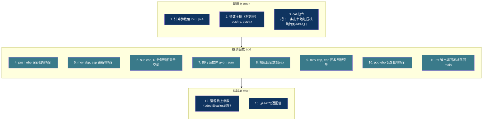
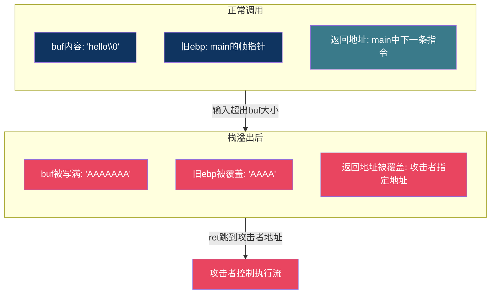

# 【炼气·18】函数调用栈：从main到子函数发生了什么

> **码农修仙传 · 炼气期 · 第18篇**
> 我是玄芯散人，带你从炼气修到大乘。

---

## 境界标识

```
╔══════════════════════════════════════╗
║     炼气期 · 第18篇                    ║
║     函数调用栈                          ║
║     从main到子函数发生了什么             ║
║     预计阅读：25分钟                    ║
╚══════════════════════════════════════╝
```

---

## 修仙引入

修炼界有"洞府"一说。前辈修炼过的洞天，走后不会夷为平地，而是留着原来的底子，下一批人住进去，桌椅灶台都在，只是上面的物品换了。栈内存就是这种洞府。函数调用时在栈上布置好桌椅（局部变量和参数以及返回地址），函数返回后不拆房子，只把栈指针挪回去。下一个函数住进来，看到的还是上一位住客留下的残痕。理解了栈帧，你才明白为什么局部变量不初始化有随机值，为什么递归太深会崩，为什么数组越界能改掉返回地址。

---

## 硬核主体

### 栈是什么：一块往下长的内存

程序运行时，操作系统给进程分配一块内存做栈用。栈的特点是"后进先出"（LIFO），只在一端操作。x86平台上栈是从高地址往低地址生长的：`push`让栈指针`esp`减小，`pop`让它增大。

```
高地址  ┌──────────────┐
        │  ...          │
        │  栈底(最初esp) │
        ├──────────────┤ ← 旧的esp
        │  函数A的栈帧   │
        ├──────────────┤ ← 当前esp（往下生长）
        │  函数B的栈帧   │
        ├──────────────┤
        │  (空闲)       │
低地址  └──────────────┘
```

每次调用一个函数，就在栈上划出一片区域存放它的信息（局部变量和参数加上返回地址），这片区域叫栈帧（stack frame）。函数返回时，栈帧所属的区域不会被清零，只是栈指针移回去，表明这片区域重新可用。

### 函数调用的全过程

用一个简单例子来说明：

```c
#include <stdio.h>

int add(int a, int b) {
    int sum = a + b;
    return sum;
}

int main(void) {
    int x = 3;
    int y = 4;
    int z = add(x, y);   // 调用点
    printf("%d\n", z);   // 7
    return 0;
}
```

`main`调用`add(x, y)`时，CPU和编译器配合做了以下几件事：



整个过程分三大阶段：调用方准备参数和`call`指令，被调函数搭建栈帧并执行，返回时拆除栈帧并`ret`跳回。

### 参数传递：右到左压栈

C语言默认的调用约定（x86上叫cdecl）规定参数从右到左压栈。`add(x, y)`先压`y`再压`x`，所以栈上`x`在低地址，`y`在高地址。

为什么从右到左？这样可以让函数内部用固定的偏移量访问参数。第一个参数离帧指针最近，第二个远一点，依次类推。更关键的一点是，从右到左压栈天然支持可变参数函数（如`printf`），因为第一个参数（格式字符串）在栈上地址最高，函数知道它的位置，后面的参数按固定步长往下找就行。

```c
// printf的第一个参数(格式串)地址固定
// 后面的参数依次往下排列
printf("%d %d %d\n", a, b, c);
// 压栈顺序: c, b, a, "格式串"
// 栈上布局(低→高): 格式串 | a | b | c
// printf从格式串里数%d个数, 往上找对应参数
```

x86-64改变了这个规则。System V ABI（Linux/macOS默认）的前6个整数参数通过寄存器传递（`rdi, rsi, rdx, rcx, r8, r9`），多余的参数才压栈。所以上面的`add(x, y)`在64位平台上`x`放进`edi`，`y`放进`esi`，不碰栈。但理解栈传参仍然有必要，因为参数多的时候，或者浮点混合的时候，或者ARM这类架构上，栈传参依然在用。

### 栈帧结构：ebp和esp的故事

函数入口处的几条指令叫prologue（序言），出口处叫epilogue（尾声）。它们围绕两个寄存器展开：`esp`（栈指针，指向当前栈顶）和`ebp`（帧指针，指向当前栈帧的基准地址）。

```asm
; x86 prologue（函数开头, 32位）
push ebp         ; 保存调用者的帧指针
mov ebp, esp     ; 把当前栈顶作为本帧的基准
sub esp, 16      ; 给局部变量腾16字节空间

; ... 函数体 ...

; epilogue（函数结尾）
mov esp, ebp     ; 回收局部变量空间（不用逐个pop）
pop ebp          ; 恢复调用者的帧指针
ret              ; 弹出返回地址，跳回去
```

`ebp`是32位的帧指针，`esp`是栈指针。64位平台上对应`rbp`和`rsp`，逻辑完全一样，只是寄存器名和槽位大小不同。

`ebp`的用途是给局部变量和参数一个稳定的参照点。`esp`在函数执行过程中可能变（比如再调用别的函数时要压栈），但`ebp`固定不变，局部变量用`ebp-偏移`访问，参数用`ebp+偏移`访问。64位平台对应`rbp`和`rsp`，逻辑相同。

栈帧布局（以32位x86的`add`函数为例，cdecl约定参数压栈）：

```
高地址
┌──────────────────┐
│  参数y (4)        │  rbp+12  （caller压的参数）
├──────────────────┤
│  参数x (3)        │  rbp+8
├──────────────────┤
│  返回地址          │  rbp+4   （call指令自动压的）
├──────────────────┤
│  旧rbp            │  rbp+0   （push rbp压的，mov后rbp指向这里）
├──────────────────┤
│  局部变量sum      │  rbp-4   （sub rsp腾的空间）
├──────────────────┤
│  (对齐填充)       │  rbp-8
└──────────────────┘  rsp
低地址
```

注意这是32位布局，每个槽4字节。64位平台上前6个参数走寄存器不入栈，只有第7个及之后的参数才压栈（每个槽8字节），但帧指针和返回地址的关系是一样的。这里用32位举例是为了看清参数在栈上的排列方式。

编译器经常省略`ebp`（开`-O2`时用`-fomit-frame-pointer`），直接用`esp`做基准，省掉`push ebp`和`mov ebp,esp`两条指令。这能省一丁点性能，但调试时`gdb`的`backtrace`就得靠`.cfi`调试信息来还原帧关系了。`-O0`下默认保留`ebp`，方便调试。

### 用gdb看栈帧

光讲概念不够直观，拿gdb实际看一遍。编译时加`-g`保留调试信息，用32位编译方便观察栈传参：

```bash
gcc -m32 -g -O0 -o demo demo.c
gdb ./demo
```

在gdb里打断点，运行到`add`函数内部（以32位编译`gcc -m32 -g -O0 -o demo demo.c`）：

```
(gdb) break add
(gdb) run
(gdb) info registers esp ebp eip
esp            0xffffd2cc
ebp            0xffffd2d0
eip            0x5655614a  <add+4>

(gdb) x/8wx $esp
0xffffd2cc:  0x00000007   ← 局部变量sum(7)和对齐填充
0xffffd2d0:  0xffffd2e8   ← 旧ebp（指向main的帧）
0xffffd2d4:  0x56556170   ← 返回地址(指向main中call之后)
0xffffd2d8:  0x00000003   ← 参数x(3)
0xffffd2dc:  0x00000004   ← 参数y(4)

(gdb) backtrace
#0  add (a=3, b=4) at demo.c:4
#1  main () at demo.c:10
```

`backtrace`（简写`bt`）打印调用链。`#0`是当前函数，`#1`是调用者。每一行就是一个栈帧。gdb能还原出参数值和函数名，靠的就是`ebp`链和调试信息。

### 递归为什么能崩：栈溢出

每次函数调用都占栈空间。递归如果没有终止条件，或者递归层数太多，栈空间耗尽就报栈溢出（stack overflow），Linux下通常收到`SIGSEGV`信号。

```c
// 无限递归
void recurse(void) {
    int local[1024];  // 每次占4KB
    recurse();        // 自己调自己
}

int main(void) {
    recurse();  // 很快栈溢出
    return 0;
}
```

Linux默认栈大小8MB（用`ulimit -s`查看）。上面每次调用占4KB以上（局部数组加栈帧开销），2000层左右就撑爆8MB。

递归的正确姿势是确保有终止条件，且每层栈帧不要太大：

```c
// 阶乘: 递归层数可控
long long factorial(int n) {
    if (n <= 1) return 1;     // 终止条件
    return (long long)n * factorial(n - 1);
}
// factorial(20) 20层, 每帧几十字节, 安全
// factorial(1000000) 就炸了, 这种情况要改成迭代或尾递归
```

### 栈上数据的生命周期

栈变量的生命周期跟函数调用绑定。函数开始时栈帧创建，函数返回时栈帧"消失"（实际是栈指针移走，内存还在）。这意味着返回栈变量的地址是经典错误，016篇提过野指针，这里从栈帧角度再看一遍：

```c
// 错误: 返回局部变量地址
int *get_value(void) {
    int x = 42;
    return &x;   // x在get_value返回后就不存在了
}

int main(void) {
    int *p = get_value();
    *p = 100;   // p指向的内存已经不属于x了
                // 可能碰巧能改, 也可能崩, 行为未定义
    return 0;
}
```

`x`存在栈上，`get_value`返回后栈帧被回收。`p`指向的那块内存现在属于上一个被调用的函数的栈帧，内容随时会被覆盖。这是C语言里最常见的悬空指针（dangling pointer）来源之一。

想从函数里返回数据，要么用`return`返回值本身（值拷贝），要么用`malloc`在堆上分配（堆的生命周期不受函数调用控制），要么让调用方传入缓冲区地址：

```c
// 正确写法1: 返回值
int get_value(void) {
    return 42;   // 返回值通过寄存器传递, 不涉及栈地址
}

// 正确写法2: 调用方传缓冲区
void fill_array(int *out, int n) {
    for (int i = 0; i < n; i++) {
        out[i] = i * 2;
    }
}

int main(void) {
    int buf[10];
    fill_array(buf, 10);   // buf在main的栈帧里, 一直有效
    return 0;
}
```

### 栈溢出攻击：改掉返回地址

栈帧里存着返回地址，告诉CPU函数结束后跳到哪。016篇讲了`gets`导致的缓冲区溢出，这里从栈帧结构角度看看攻击者怎么利用它。

```c
#include <stdio.h>
#include <string.h>

void vulnerable(void) {
    char buf[8];
    // 危险: 没有长度限制, 输入超过8字节就越界
    gets(buf);   // gets在C11标准里被彻底删除
    printf("you said: %s\n", buf);
}

int main(void) {
    vulnerable();
    return 0;
}
```

`buf`只有8字节。输入"AAAA"（4字节加`\0`）没问题。但如果输入16个字节，多出来的部分往高地址写，覆盖到旧`ebp`，再往上就覆盖返回地址。攻击者精心构造输入，把返回地址改成想跳转的地址，函数返回时不去main而是去了攻击者指定的代码。



现代防护手段包括：栈保护（canary，函数序言在`ebp`和返回地址之间放一个随机值，返回前检查被改没改），以及NX（栈内存不可执行）和ASLR（地址随机化）。这些在筑基和金丹篇会深入讲，炼气篇知道有这回事就够了。

### 调用约定速查

不同平台和编译器对参数怎么传递以及栈谁清理还有返回值放哪有不同规定，这套规则叫调用约定（calling convention）：

| 约定名 | 平台 | 参数传递 | 栈清理方 |
|--------|------|---------|---------|
| cdecl | x86 Windows/Linux | 右到左压栈 | 调用方 |
| fastcall | x86 | 前两参数用寄存器 | 被调方 |
| stdcall | x86 Windows API | 右到左压栈 | 被调方 |
| System V ABI | x86-64 Linux/macOS | 前6个用寄存器，多余压栈 | 调用方 |
| AAPCS | ARM | 前4个用r0-r3，多余压栈 | 调用方 |

cdecl由调用方清理栈的好处是支持可变参数函数（`printf`就是cdecl）。stdcall由被调方清理，调用方代码少一些，但不支持可变参数。64位平台大量用寄存器传参，性能更好。

### 一个综合例子

```c
#include <stdio.h>

// 递归求斐波那契, 演示调用栈
int fib(int n) {
    if (n <= 1) return n;       // 终止条件
    return fib(n - 1) + fib(n - 2);
}

int main(void) {
    int result = fib(5);        // 返回5
    printf("fib(5) = %d\n", result);

    // fib(5)的调用链:
    // fib(5) → fib(4) → fib(3) → fib(2) → fib(1)返回1
    //       → fib(0)返回0, fib(2)返回1
    //   → fib(1)返回1, fib(3)返回2
    // → fib(2)返回1, fib(4)返回3
    //   → fib(3)→fib(2)→fib(1)+fib(0)=1
    //   → fib(1)=1, fib(3)=2
    // fib(4)+fib(3)=3+2=5

    // 最大递归层数是5, 每层栈帧几十字节, 安全
    // 但fib(40)就要递归约1亿次, 不是栈溢出而是算不完

    return 0;
}
```

`fib(5)`的递归树展开后有多次调用，但同一时刻栈上的最大层数只有5。因为每次函数返回后栈帧就回收了，空间复用。递归真正怕的是同一时刻的最大层数，不是总调用次数。

---

## 修仙术语对照表

| 修仙术语 | 技术现实 | 本篇位置 |
|----------|---------|---------|
| 洞府复用 | 栈内存函数返回后不清零 | 修仙引入 |
| 洞天底子 | 栈帧结构（参数和返回地址加上局部变量） | 栈帧结构 |
| 入驻 | 函数prologue（push ebp, mov ebp esp, sub esp） | 栈帧结构 |
| 撤离 | 函数epilogue（mov esp ebp, pop ebp, ret） | 栈帧结构 |
| 灵力灌注 | 参数压栈传递 | 参数传递 |
| 右行先入 | 参数从右到左压栈 | 参数传递 |
| 传送阵 | call指令压入返回地址并跳转 | 调用过程 |
| 归途路标 | 返回地址压栈 | 栈帧结构 |
| 帧指针锚 | ebp作为栈帧基准地址 | 栈帧结构 |
| 栈底灵脉 | esp栈指针指向当前栈顶 | 栈是什么 |
| 无限递归 | 递归无终止条件导致栈溢出 | 递归 |
| 灵力耗尽 | 栈空间用尽收到SIGSEGV | 递归 |
| 残魂附体 | 返回栈变量地址后悬空指针 | 生命周期 |
| 夺舍术 | 栈溢出改写返回地址劫持执行流 | 栈溢出攻击 |

---

## 突破条件

- [ ] 能画出`main`调用`add`时的栈帧布局，标注参数和返回地址以及旧ebp加上局部变量的位置
- [ ] 能解释为什么参数从右到左压栈，说出这和可变参数函数的关系
- [ ] 能说出prologue和epilogue各自做了什么，解释`ebp`和`esp`各自的用途
- [ ] 能解释为什么返回局部变量地址是危险的，写出两种安全替代方案
- [ ] 能解释递归为什么可能导致栈溢出，说出最大栈大小（Linux默认8MB）的限制
- [ ] 能用gdb打断点后用`backtrace`查看调用链，用`info registers`查看esp和ebp
- [ ] 能说出栈溢出攻击改写返回地址的原理，提一个现代防护手段

> 下一篇讲你的代码怎么变成可执行文件。编辑到运行之间经历预处理，然后编译，然后汇编，最后链接，每步做了什么，编译器替你藏了哪些事情。

---

## 下期预告 + 互动

> 下一篇：【炼气·19】你的代码怎么变成可执行文件
>
> 你写完代码按下运行，中间发生了什么？预处理展开了`#include`，编译器把C翻译成汇编，汇编器变成二进制，链接器拼上库函数。四步拆开来看，你就知道那些报错到底出在哪一步。

问你：

> 你遇到过`Segmentation fault`吗？当时是怎么定位的，用gdb看过调用栈没有？

> 递归写得最深的场景是什么？有没有被栈溢出坑过？

> 我是玄芯散人，带你从炼气修到大乘。

---

*本文是「码农修仙传」系列第18篇。系列导航见 [xren.ren](https://xren.ren)*
