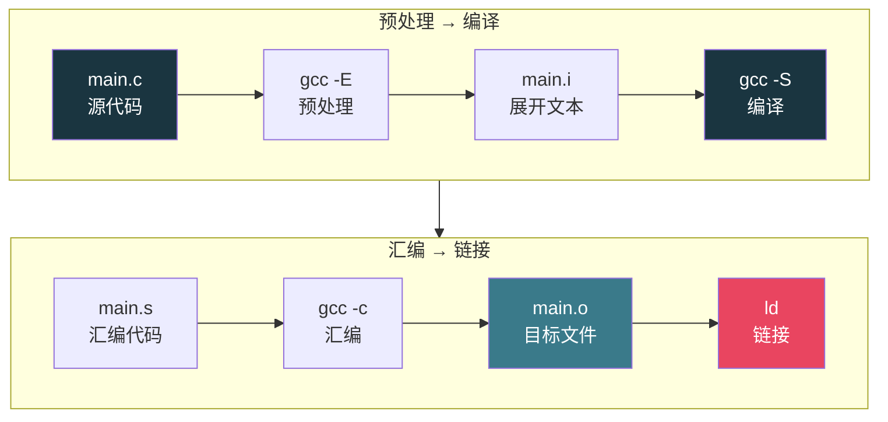
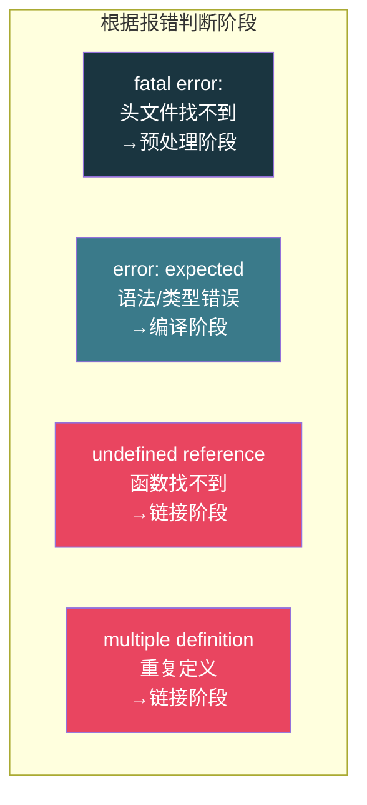

# 【炼气·19】你的代码怎么变成可执行文件

> **码农修仙传 · 炼气期 · 第19篇**
> 我是玄芯散人，带你从炼气修到大乘。

---

## 境界标识

```
╔══════════════════════════════════════╗
║     炼气期 · 第19篇                    ║
║     你的代码怎么变成可执行文件          ║
║     预处理编译汇编链接四步拆解          ║
║     预计阅读：20分钟                    ║
╚══════════════════════════════════════╝
```

---

## 修仙引入

炼丹师拿到一堆灵草，不能直接吞。先要清洗去杂质，然后研磨成粉，再炼制成丹胚，最后封丹固灵。四步走完，才算一颗能服用的丹药。你写的C代码也一样，从文本变成可执行文件，中间隔着预处理，编译，汇编，链接四个阶段。每个阶段干不同的事，每个阶段可能报不同的错。搞清楚这四步，你才知道`gcc main.c`这一条命令背后到底发生了什么，遇到报错时才能一眼看出是哪一步出了问题。

---

## 硬核主体

### 四步全景

你写完`main.c`，执行`gcc main.c -o main`，屏幕上没报错，生成了一个`main`文件。你运行`./main`，程序跑起来了。但`gcc`这条命令背后不是一步到位的。它实际上调用了四个不同的工具，依次完成四个阶段。



四个阶段分别是预处理（Preprocessing），编译（Compilation），汇编（Assembly），链接（Linking）。每个阶段产出不同的中间文件，用`.i`，`.s`，`.o`，可执行文件四种后缀区分。`gcc`默认一口气跑完四步，但你可以加选项让它停在某一步，逐步查看中间产物。

### 第一步：预处理，展开口诀

预处理器叫`cpp`（C Preprocessor，不是C++那个cpp）。它干三件事：

头文件展开。你写了`#include <stdio.h>`，预处理器把整个`stdio.h`文件的内容原封不动复制到你源文件里。`stdio.h`里又有`#include`其他头文件，也一并展开。一个十几行的`main.c`展开后可能有好几千行。

宏替换。你定义了`#define PI 3.14`，预处理器把代码里所有`PI`都换成`3.14`。带参数的宏也在这步展开，比如`#define SQUARE(x) ((x)*(x))`，写`SQUARE(5)`就变成`((5)*(5))`。

条件编译。`#ifdef`，`#ifndef`，`#endif`这些指令告诉预处理器哪些代码保留，哪些删掉。嵌入式代码经常用这个切换平台：

```c
#ifdef STM32F1
    // F1系列的代码
    GPIOA->CRL &= ~(0xF << 20);
#elif defined(STM32F4)
    // F4系列的代码
    GPIOA->MODER &= ~(0x3 << 10);
    GPIOA->MODER |= (0x1 << 10);
#endif
    // 两套代码只保留一套, 另一套不进入编译
```

预处理完的文件叫`.i`文件，还是纯文本，但已经没有`#include`和`#define`了，所有内容都展开了。

你可以用这条命令只跑预处理，看展开后的结果：

```bash
gcc -E main.c -o main.i
# 或者直接输出到屏幕
gcc -E main.c | head -50
```

打开`main.i`你会看到好几千行，前面全是标准库头文件展开的内容，最后几行才是你自己写的代码。014篇讲过宏定义和条件编译的细节，这里从编译流程角度看看它们在哪个阶段干活。

### 第二步：编译，口诀转符文

编译器把预处理后的`.i`文件翻译成汇编代码。这一步做语法检查，如果你的代码有语法错误，在这一步就会被逮到。

```c
// 语法错误示例
int main(void) {
    int a = 1 +   // 少了分号, 表达式没写完
    return 0;
}
```

编译器报错：

```
main.c:3:14: error: expected ';' before 'return'
```

编译通过后，输出`.s`文件，里面是汇编代码。还是文本格式，人类勉强能读，但已经是跟CPU指令集对应的低级表达了。

```bash
# 只跑到编译阶段, 输出汇编文件
gcc -S main.c -o main.s
```

打开`main.s`，你会看到类似这样的内容（x86-64为例）：

```asm
main:
    push    rbp
    mov     rbp, rsp
    sub     rsp, 16
    mov     DWORD PTR [rbp-4], 1    ; int a = 1
    mov     eax, 0
    leave
    ret
```

这段汇编对应你写的C代码。`push rbp`和`mov rbp, rsp`是函数序言，018篇讲函数调用栈时提过。这里你能亲眼看到编译器把`int a = 1`翻译成了`mov DWORD PTR [rbp-4], 1`，就是把数字1写到栈上`rbp-4`那个位置。

金丹期061篇会深入讲编译器内部的词法解析，语法解析，语义检查，代码生成。炼气期知道这一步把C翻译成汇编就够了。

### 第三步：汇编，符文变灵力

汇编器把`.s`文件里的汇编指令翻译成机器码，输出`.o`文件（object file，目标文件）。到这一步，文件已经是二进制了，用文本编辑器打开是一堆乱码。

```bash
# 只跑到汇编阶段, 输出目标文件
gcc -c main.c -o main.o
```

`.o`文件里存的是机器码，但还不能运行。因为你的代码可能调用了`printf`，`printf`的实现在C标准库里，你的`.o`文件里只有一个"我要调用printf"的引用，实际地址还空着。这个空着的引用需要在链接阶段填上。

用`file`命令看`.o`文件的类型：

```bash
file main.o
# 输出: ELF 64-bit LSB relocatable, x86-64, not stripped
```

注意输出里是"relocatable"（可重定位），不是"executable"（可执行）。可重定位的意思是文件里的代码可以被搬移到内存中的任何位置，但地址还没确定，还不能直接跑。

用`objdump`可以反汇编`.o`文件，看机器码对应的汇编：

```bash
objdump -d main.o

main.o:     file format elf64-x86-64
Disassembly of section .text:
0000000000000000 <main>:
   0:   55                      push   rbp
   1:   48 89 e5                mov    rbp,rsp
   4:   48 83 ec 10             sub    rsp,0x10
   8:   c7 45 fc 01 00 00 00    mov    DWORD PTR [rbp-4],0x1
   ...
```

左边是十六进制机器码，右边是反汇编出来的汇编。你能看到`55`就是`push rbp`的机器码，`48 89 e5`就是`mov rbp, rsp`。这就是CPU真正看到的东西。

### 第四步：链接，接通灵脉

链接器把你的`.o`文件和需要的库文件拼在一起，解决函数引用。你的代码调用了`printf`，链接器找到C标准库里`printf`的真实地址，填回你的代码里那个空着的位置。

```bash
# 完整四步: 预处理→编译→汇编→链接
gcc main.c -o main
# 或者分开做最后一步
gcc main.o -o main
```

链接完生成的`main`文件才是可执行文件：

```bash
file main
# 输出: ELF 64-bit LSB pie executable, x86-64, dynamically linked
```

注意现在是"executable"（可执行）而不是"relocatable"了。现代GCC默认生成PIE（Position Independent Executable），所以输出里是"pie executable"。

链接分两种方式：

静态链接：把库函数的代码直接复制到你的可执行文件里。生成的文件大，但运行时不依赖外部库，拷到别的机器上直接能跑。

动态链接：只在可执行文件里记录"我要用libc.so里的printf"，运行时操作系统负责把libc.so加载进内存，把printf的地址告诉你。生成的文件小，但运行时必须能找到对应的库文件。

```bash
# 看可执行文件依赖哪些动态库
ldd main
# 输出类似:
# libc.so.6 => /lib/x86_64-linux-gnu/libc.so.6
# /lib64/ld-linux-x86-64.so.2
```

Linux默认用动态链接。如果你的程序拷到另一台没装libc的机器上，会报`error while loading shared libraries`。金丹期087篇详细讲了静态库和动态库的区别，这里知道有这两种就行。

### 一步一步走，亲眼看中间产物

把四步拆开来手动走一遍，你会对编译流程有直观感受：

```bash
# 准备一个简单的C文件
cat > demo.c << 'EOF'
#include <stdio.h>

#define MAX 10

int main(void) {
    int arr[MAX] = {0};
    arr[0] = 42;
    printf("arr[0] = %d\n", arr[0]);
    return 0;
}
EOF

# 第一步: 预处理
gcc -E demo.c -o demo.i
wc -l demo.i   # 展开后行数, 可能有好几百行

# 第二步: 编译
gcc -S demo.i -o demo.s
head -30 demo.s   # 看汇编代码

# 第三步: 汇编
gcc -c demo.s -o demo.o
file demo.o        # relocatable

# 第四步: 链接
gcc demo.o -o demo
file demo          # executable

# 运行
./demo
# 输出: arr[0] = 42
```

走完这四步，你走完了源代码变成可执行文件的每一个中间产物。以后遇到编译报错，你就能判断是哪个阶段的问题。

### 每个阶段报什么错

四个阶段各有各的报错特征，学会区分能帮你快速定位问题：

预处理阶段错误：头文件找不到，宏定义有问题。

```
fatal error: stdio.h: No such file or directory
```

这种错误通常是没安装开发库，或者头文件路径不对。检查`#include`的路径有没有写错，或者编译时加`-I`指定头文件目录。

编译阶段错误：语法错误，类型错误。

```
error: expected ';' before '}' token
error: assignment to expression with array type
warning: implicit declaration of function 'printf'
```

语法错误是你代码写得不对，少了分号，括号不匹配。类型错误是类型不兼容，比如给数组赋值。`implicit declaration`警告表示你用了一个没声明的函数，通常是忘了`#include`。

汇编阶段错误：很少见。通常是汇编器遇到了不认识的指令，可能是编译器输出了非法汇编代码，或者你手动写了错误的内联汇编。

链接阶段错误：函数找不到，变量重复定义。

```
undefined reference to `printf'
multiple definition of `foo'
```

`undefined reference`是链接器找不到函数的实现。比如你调用了`printf`但没链接libc，或者你自己声明的函数只有声明没有实现。金丹期066篇详细讲了链接报错的原因和排查方法。

`multiple definition`是同一个符号在多个文件里都定义了，链接器不知道用哪个。



### .o文件和可执行文件的区别

这是初学者容易混淆的点。`.o`文件和可执行文件都是二进制，但差别很大：

`.o`文件是"半成品"。里面有你的代码翻译成的机器码，但函数调用地址还没填好。比如你调用了`printf`，`.o`文件里对应位置是空的，写着"这里要调用printf，地址待定"。而且`.o`文件里的地址都是相对地址，还没有分配最终的内存位置。

可执行文件是"成品"。链接器把所有`.o`文件和库拼好，填上了所有地址，分配了代码段和数据段的位置。操作系统加载它时知道代码放哪，数据放哪，从哪里开始执行。

用`readelf`可以看两者的区别：

```bash
# 看.o文件的section
readelf -S main.o | head -20
# 类型: REL (Relocatable file)

# 看可执行文件的section
readelf -h main | grep Type
# Type: DYN (Position-Independent Executable)
```

金丹期065篇会深入讲ELF文件格式，炼气期知道`.o`是半成品，可执行文件是成品就够了。

### 多文件编译

实际项目不会只有一个`.c`文件。多个源文件的编译流程跟单文件一样，只是链接阶段要把多个`.o`拼在一起：

```bash
# 三个源文件
gcc -c main.c -o main.o      # 各自预处理→编译→汇编
gcc -c utils.c -o utils.o
gcc -c driver.c -o driver.o

# 链接成一个可执行文件
gcc main.o utils.o driver.o -o app

# 或者一步到位
gcc main.c utils.c driver.c -o app
```

每个`.c`文件独立编译成`.o`，彼此隔离。`main.c`里调用了`utils.c`的函数，编译时编译器只看到函数声明（来自头文件），不知道函数在哪。链接器负责把`main.o`里"调用utils函数"的引用跟`utils.o`里"utils函数的定义"连上。

这就是为什么头文件只放声明不放实现。声明告诉编译器"这个函数存在，长这样"，实现在哪个`.c`文件里编译器不关心，链接器去找。021篇会详细讲头文件的机制。

---

## 修仙术语对照表

| 修仙术语 | 技术现实 | 本篇位置 |
|----------|---------|---------|
| 炼丹四步 | 预处理编译汇编链接四个阶段 | 四步全景 |
| 清洗去杂 | 预处理展开头文件和宏 | 第一步 |
| 研磨成粉 | 编译把C代码翻译成汇编 | 第二步 |
| 炼制丹胚 | 汇编把汇编代码翻译成机器码 | 第三步 |
| 封丹固灵 | 链接把目标文件和库拼成可执行文件 | 第四步 |
| 口诀展开 | #include和#define的文本展开 | 第一步 |
| 符文 | 汇编代码 | 第二步 |
| 灵力 | 机器码（二进制） | 第三步 |
| 丹胚 | .o目标文件（半成品） | 第三步 |
| 成丹 | 可执行文件（成品） | 第四步 |
| 接通灵脉 | 链接器解析符号填地址 | 第四步 |
| 灵脉断裂 | undefined reference链接错误 | 报错定位 |
| 旁门丹方 | 静态链接（代码全复制进去） | 第四步 |
| 借力法阵 | 动态链接（运行时加载库） | 第四步 |
| 各炼各的丹 | 多文件独立编译彼此隔离 | 多文件编译 |

---

## 突破条件

- [ ] 能说出预处理，编译，汇编，链接四个阶段各自做什么，各自产出什么文件
- [ ] 能用`gcc -E`，`gcc -S`，`gcc -c`分别停在三个阶段查看中间产物
- [ ] 能根据报错信息判断是哪个阶段出了问题（头文件找不到是预处理，语法错误是编译，undefined reference是链接）
- [ ] 能解释`.o`文件和可执行文件的区别（前者地址未定是半成品，后者地址已填是成品）
- [ ] 能说出静态链接和动态链接的区别（前者把库代码复制进去，后者运行时加载）
- [ ] 能用`file`命令区分relocatable文件和executable文件
- [ ] 能解释为什么多文件编译时每个.c文件可以独立编译成.o

> 下一篇讲变量的生命周期。栈变量随函数调用生灭，全局变量活到程序结束，static变量有啥特别的。作用域和生命周期不是一回事，搞混了会写出Bug。

---

## 下期预告 + 互动

> 下一篇：【炼气·20】变量的生命周期：栈变量和全局变量和static
>
> 你在函数里写的`int x = 0`，每次调用函数时x都是0。但有些变量你想让它"记住"上一次的值。C语言提供了`static`关键字，让局部变量活到程序结束，但名字还是局部可见。作用域管"谁能看到你"，生命周期管"你能活多久"，两码事。

问你：

> 你有没有遇到过`undefined reference to xxx`的报错？当时是怎么解决的，最后发现是什么原因？

> 你用过`gcc -S`看汇编输出吗？第一次看到自己写的C代码变成汇编是什么感受？

> 我是玄芯散人，带你从炼气修到大乘。

---

*本文是「码农修仙传」系列第19篇。系列导航见 [xren.ren](https://xren.ren)*
