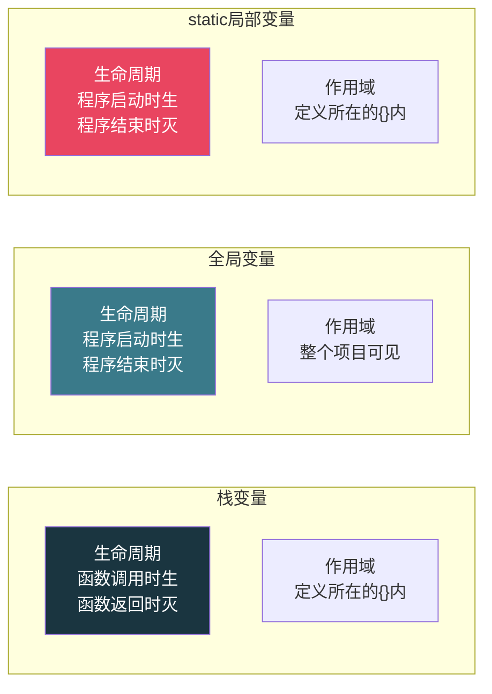
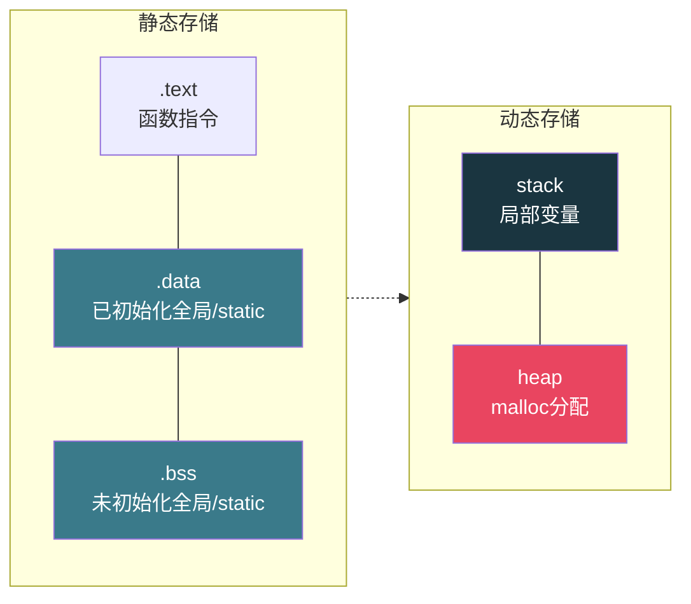

# 【炼气·20】变量的生命周期：栈变量、全局变量和static

> **码农修仙传 · 炼气期 · 第20篇**
> 我是玄芯散人，带你从炼气修到大乘。

---

## 境界标识

```
╔══════════════════════════════════════╗
║     炼气期 · 第20篇                    ║
║     变量的生命周期                      ║
║     栈变量、全局变量和static            ║
║     预计阅读：20分钟                    ║
╚══════════════════════════════════════╝
```

---

## 修仙引入

修仙界有两种规矩管着你。一种叫寿元，你能活多久。一种叫活动范围，你能在哪些地方走动。寿元和活动范围是两码事，有人寿元悠长却只能待在洞府里，有人寿元短暂却到处能跑。C语言的变量也受这两条规矩管。一条叫生命周期，管变量能活多久。一条叫作用域，管变量的名字在哪些代码里可见。搞混这两条规矩，是新手写Bug的常见原因。

---

## 硬核主体

### 两条规矩：生命周期和作用域

生命周期回答"变量什么时候生，什么时候灭"。作用域回答"变量的名字在什么范围内能被引用"。

这两个概念听起来像一回事，实际不是。一个变量可以活得很久但名字只有一小段代码能看到，也可以名字到处可见但活得短暂。下面三种变量刚好展示了三种不同的组合。



### 栈变量：朝生暮灭

你在函数里写的局部变量，都是栈变量。018篇讲过函数调用栈，每次调用函数时在栈上划出一片区域放局部变量，函数返回时这片区域就交还了。变量的值随着栈帧的销毁而消失。

```c
#include <stdio.h>

void counter(void) {
    int count = 0;   // 每次调用都重新初始化为0
    count++;
    printf("count = %d\n", count);
}

int main(void) {
    counter();   // 输出 count = 1
    counter();   // 还是输出 count = 1
    counter();   // 还是 1
    return 0;
}
```

调用了三次`counter`，每次输出的都是1。因为`count`是栈变量，每次函数返回时它的值就没了。下次再调用`counter`，`count`重新被初始化为0，然后加1，又是1。

栈变量的生命周期跟函数调用绑定。函数被调时生，函数返回时灭。它的作用域也只在定义它的花括号`{}`内部。你在`counter`外面写`count`，编译器不认识这个名字。

还有一个容易踩的坑：栈变量不初始化时，值是未定义的。因为栈帧所在的那片内存区域上次被别的函数用过，留下了残余数据。

```c
void test(void) {
    int x;   // 没初始化
    printf("x = %d\n", x);   // 可能是任何值
}
```

每次调用`test`，输出的值可能都不一样。016篇讲过这个陷阱，这里从生命周期的角度看：栈变量在函数调用时才获得内存，那片内存上一位住客留下的残余还在，你没清就直接用了。

### 全局变量：与天同寿

全局变量定义在所有函数外面。它的生命周期跟整个程序一样长，程序启动时就存在，程序结束时才销毁。它的名字在整个项目的所有`.c`文件里都可见（前提是你用`extern`声明了它）。

```c
#include <stdio.h>

int count = 0;   // 全局变量, 定义在函数外面

void counter(void) {
    count++;     // 每次调用都累加
    printf("count = %d\n", count);
}

int main(void) {
    counter();   // 输出 1
    counter();   // 输出 2
    counter();   // 输出 3
    return 0;
}
```

跟前面的栈变量版本对比，唯一区别是把`int count = 0`挪到了函数外面。现在`count`是全局变量，只初始化一次，三次调用都在累加。

全局变量存在数据段（已初始化的）或BSS段（未初始化的）里，不占栈空间。程序加载时操作系统给它分配好内存，值在那里一直放着，谁都能读写。

全局变量方便是方便，但有个大问题：谁都能改它。项目大了以后，全局变量被十几个函数读写，你完全不知道某个时刻它的值是谁改的，改成了什么。调试时这种Bug特别难查。所以有经验的工程师会尽量少用全局变量，能用局部变量解决的就不放外面。

### static局部变量：活得久但只在局部有名

C语言有个关键字`static`，放在局部变量前面，效果很特别。变量的生命周期变得跟全局变量一样长，程序启动时就存在，程序结束时才销毁。但作用域没变，只在定义它的花括号内部可见。

```c
#include <stdio.h>

void counter(void) {
    static int count = 0;   // 只初始化一次
    count++;
    printf("count = %d\n", count);
}

int main(void) {
    counter();   // 输出 1
    counter();   // 输出 2
    counter();   // 输出 3
    return 0;
}
```

这段代码跟全局变量版本的效果一模一样，三次调用输出1，2，3。但`count`的名字在`counter`函数外面完全不可见。你在`main`里写`count`，编译器报错说没定义。

`static int count = 0`这行只在程序启动时执行一次。第二次第三次调用`counter`时，这行被跳过，`count`保留上一次的值。这是static局部变量和普通局部变量的最大区别：初始化只做一次。

static局部变量也存在数据段或BSS段，跟全局变量放一起。它不占栈空间，函数返回时它的值也不会丢。



这张图能帮你记住三种变量分别住在哪。栈变量住在栈上，随函数调用来去。全局变量和static变量住在数据段或BSS段，程序运行期间一直在那里。堆是`malloc`分配的内存，这里先不展开，后面会专门讲。

### static的第二种用法：限制可见范围

`static`除了修饰局部变量，还能修饰全局变量和函数。这时候它的意思完全不一样，不是延长生命周期（全局变量和函数本来就活到程序结束），而是限制可见范围。

普通的全局变量，其他`.c`文件用`extern`声明后就能访问。但如果你在全局变量前面加了`static`，这个变量就只在本`.c`文件里可见，其他文件即使写`extern`也找不到。

```c
// counter.c
static int internal_count = 0;   // 只在counter.c里可见

int get_count(void) {            // 普通函数, 其他文件可以调用
    return internal_count;
}
```

```c
// main.c
extern int internal_count;   // 链接报错! static变量外部不可见

int main(void) {
    // internal_count = 10;   // 编译/链接失败
    int n = get_count();       // 这样可以, 通过函数间接访问
    return 0;
}
```

函数也一样。加了`static`的函数只在本文件内可调用，其他文件链接不到它。

这种用法在做模块化设计时很有用。你写了一个`.c`文件，有些函数是给外部调用的接口，有些函数是自己内部用的辅助函数。给辅助函数加`static`，外部就看不到也不会误调用。019篇讲了多文件编译和链接，`static`就是在链接阶段把符号限制在文件内部的。

### 一个综合例子：三种变量放一起

```c
#include <stdio.h>

int global_val = 100;          // 全局变量, 程序级生命周期, 全项目可见

void demo(void) {
    int local_val = 10;         // 栈变量, 函数返回时灭
    static int static_val = 0;  // static局部变量, 程序级生命周期, 仅本函数可见

    local_val++;
    static_val++;
    global_val++;

    printf("local=%d, static=%d, global=%d\n",
           local_val, static_val, global_val);
}

int main(void) {
    demo();   // local=11, static=1, global=101
    demo();   // local=11, static=2, global=102
    demo();   // local=11, static=3, global=103
    return 0;
}
```

`local_val`每次都是11，因为每次调用`demo`时它重新初始化为10然后加1。`static_val`和`global_val`每次都在累加，因为它们的值在函数返回后还在。

区别在于：`global_val`在别的函数里也能直接访问，`static_val`只在`demo`函数里可见。如果你想让一个变量记住上次的值，又不想让别的函数乱改它，`static`局部变量就是最合适的工具。

### 初始化的时机

栈变量的初始化在每次函数调用时执行。你写`int x = 10`，每次调用函数都会把10赋给x。

全局变量和static变量的初始化在程序启动时执行，而且只执行一次。你写`static int x = 10`，程序一启动x就是10了，后面函数被调用多少次，这行都不会再执行。

有一个细节：C标准规定static变量如果不显式初始化，默认值是0。全局变量也一样。栈变量则没有这种待遇，不初始化就是未定义值。这个区别背后的原因是，全局变量和static变量存在BSS段，操作系统加载程序时会把BSS段清零。栈变量用的是栈上残留的内存，没人帮你清。

```c
int g;              // 全局, 自动初始化为0
static int s;       // static全局, 自动初始化为0

void foo(void) {
    int x;           // 栈变量, 值未定义
    static int y;    // static局部, 自动初始化为0
    printf("g=%d, s=%d, x=%d, y=%d\n", g, s, x, y);
    // g=0, s=0, x=随机值, y=0
}
```

### 什么时候用什么

写代码时怎么选这三种变量？有几条经验：

能用局部变量的就用局部变量。局部变量作用域小，出了函数就消失，不会污染其他代码。调试时你只要看函数内部就能搞清楚变量的来龙去脉。

需要"记住"上次的值，但不想让别的函数碰它，用static局部变量。比如一个函数内部计数器，记录自己被调用了多少次。

多个函数需要共享的数据，才考虑用全局变量。但要意识到全局变量是"公共财产"，谁都能改，出了Bug很难查。实际项目中，全局变量能少用就少用。

需要限制符号在本文件内部的，用static修饰全局变量或函数。这是模块化编程的常见手段，让接口更干净。

---

## 修仙术语对照表

| 修仙术语 | 技术现实 | 本篇位置 |
|----------|---------|---------|
| 寿元 | 变量的生命周期 | 两条规矩 |
| 活动范围 | 变量的作用域 | 两条规矩 |
| 朝生暮灭 | 栈变量随函数调用生灭 | 栈变量 |
| 与天同寿 | 全局变量活到程序结束 | 全局变量 |
| 洞府密室 | static限制可见范围到本文件 | static第二种用法 |
| 留着记忆 | static局部变量保留上次值 | static局部变量 |
| 公共灵田 | 全局变量谁都能读写 | 全局变量 |
| 私有灵田 | static变量仅本文件或本函数可见 | static两种用法 |
| 住所 | 变量在内存中的存储位置 | 内存布局 |
| 搬进洞府 | 栈变量在函数调用时分配 | 栈变量 |
| 原住民 | 全局和static变量在数据段或BSS段 | static局部变量 |
| 一次性开光 | static变量只初始化一次 | 初始化的时机 |

---

## 突破条件

- [ ] 能说清生命周期和作用域的区别（一个管活多久，一个管名字在哪可见）
- [ ] 能解释为什么栈变量不初始化时值是随机的（栈上残留数据没清）
- [ ] 能写出static局部变量的代码，解释它为什么只初始化一次
- [ ] 能解释全局变量和static全局变量的区别（后者只在本文件可见）
- [ ] 能说出三种变量分别存在内存的哪个段（栈/数据段或BSS段）
- [ ] 能解释为什么全局变量和static变量不初始化时默认值是0（BSS段被OS清零）
- [ ] 能在一个多文件项目里用static限制函数的可见范围

> 下一篇讲头文件。.h和.c的关系到底是什么，声明和定义有什么区别，为什么头文件要写`#ifndef`防重复包含。这些疑问在021篇里都会说清楚。

> 下一篇：【炼气·21】头文件到底在干什么
>
> 你写`#include <stdio.h>`时编译器做了什么？.h文件里放声明还是放实现？为什么同一个头文件被包含两次会报错，`#ifndef`是怎么解决这个问题的？019篇讲了编译四步，这篇用预处理器的视角看头文件到底干了什么活。

问你：

> 你有没有被全局变量坑过？某个函数莫名其妙改了全局变量的值，导致另一个函数行为异常，你花了多久才找到原因？

> 你用过`static`局部变量吗？第一次发现它能"记住"上次的值时是什么反应？

> 我是玄芯散人，带你从炼气修到大乘。

---

*本文是「码农修仙传」系列第20篇。系列导航见 [xren.ren](https://xren.ren)*
