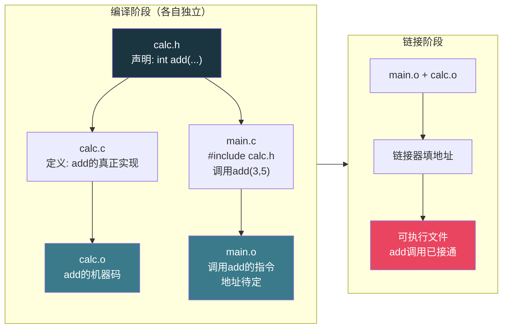
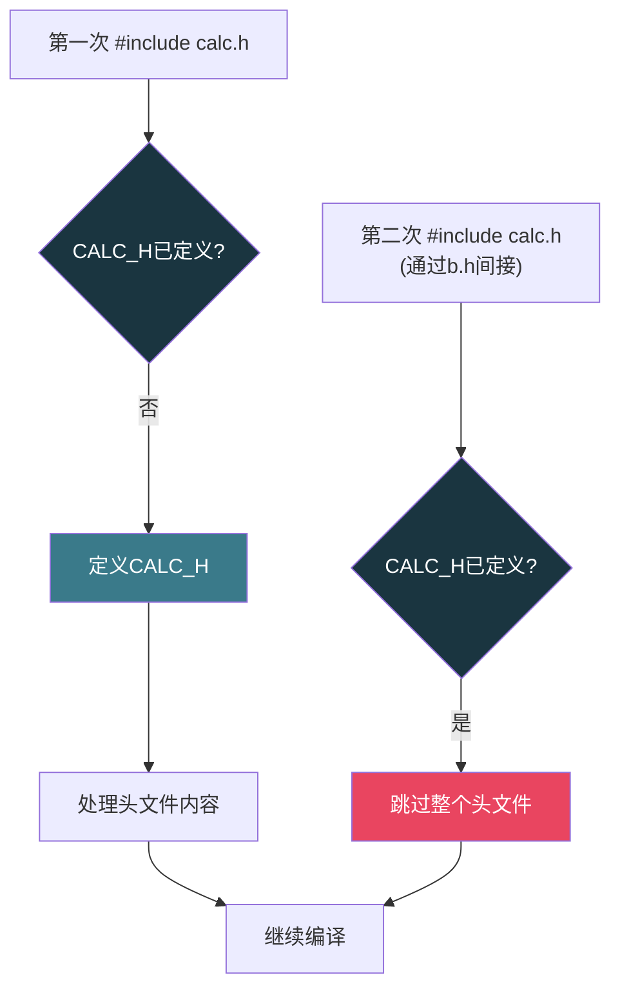

# 【炼气·21】头文件到底在干什么

> **码农修仙传 · 炼气期 · 第21篇**
> 我是玄芯散人，带你从炼气修到大乘。

---

## 境界标识

```
╔══════════════════════════════════════╗
║     炼气期 · 第21篇                    ║
║     头文件到底在干什么                  ║
║     .h和.c的关系、声明与定义、防重复    ║
║     预计阅读：20分钟                    ║
╚══════════════════════════════════════╝
```

---

## 修仙引入

修仙门派有条规矩：你想找某人办事，先去照壁上看名册。名册写着门派里有哪些人，各自擅长什么，住在哪里。你照着名册找到对应的人，事情才能办成。但你不能把人从名册上拽下来办事，名册只是个通报，人得去洞府里找。C语言的头文件就是这张名册。它告诉你有哪些函数和变量可以用，但真正的实现在`.c`文件里。搞清楚头文件到底放什么，不放什么，`#include`到底干了什么活，你才能写出干净的多文件项目。

---

## 硬核主体

### 声明和定义是两码事

在讲头文件之前，先把两个容易混的概念理清。声明是告诉编译器"有这么个东西，长什么样"。定义是真正把这个东西造出来，分配内存。

```c
// 这是声明：告诉编译器有个叫add的函数, 接收两个int, 返回int
int add(int a, int b);

// 这是定义：函数真的在这里实现了
int add(int a, int b) {
    return a + b;
}

// 变量也一样
extern int count;    // 声明：count存在于别处, 我只是告诉你有这东西
int count = 0;       // 定义：给count分配内存并赋值
```

声明可以出现很多次，编译器不介意你重复告诉它同一个信息。但定义只能出现一次。你在两个`.c`文件里都写了`int count = 0`，链接器会报`multiple definition`错误，因为它不知道该用哪个。

019篇讲编译四步时提过，编译阶段每个`.c`文件各自独立编译，编译器只看你这个文件里有没有声明，不管实现在哪。真正把声明和定义连起来的是链接器。

### .h和.c的分工

实际项目里，代码会拆成多个`.c`文件。比如一个计算器项目：

```c
// calc.h —— 头文件, 放声明
#ifndef CALC_H
#define CALC_H

int add(int a, int b);
int sub(int a, int b);
int mul(int a, int b);
int div(int a, int b);

#endif
```

```c
// calc.c —— 源文件, 放定义
#include "calc.h"

int add(int a, int b) {
    return a + b;
}

int sub(int a, int b) {
    return a - b;
}

int mul(int a, int b) {
    return a * b;
}

int div(int a, int b) {
    if (b == 0) return 0;   // 简单处理, 不展开错误处理
    return a / b;
}
```

```c
// main.c —— 使用者
#include <stdio.h>
#include "calc.h"    // 引入calc模块的声明

int main(void) {
    printf("3 + 5 = %d\n", add(3, 5));
    printf("3 * 5 = %d\n", mul(3, 5));
    return 0;
}
```

`calc.h`里只放了函数声明，没有函数体。`calc.c`里放了真正的实现。`main.c`想用`add`函数，只要`#include "calc.h"`就能通过编译，编译器看到声明就放心了："add函数存在，接收两个int返回int，没问题。"

至于`add`到底在哪，编译器不关心。链接器负责把`main.o`和`calc.o`拼在一起，把`add`的调用连到真正的实现上。



### #include到底干了什么

019篇讲预处理阶段时提过，`#include`做的事情非常简单粗暴：把指定文件的内容原封不动复制过来。你写`#include "calc.h"`，预处理器就把`calc.h`的全部内容粘贴到这一行所在的位置。

你可以用`gcc -E`亲眼看这个展开过程：

```bash
gcc -E main.c -o main.i
# 打开main.i, 你会看到calc.h的内容被完整粘贴在main.c前面
```

`#include`有两种写法，用尖括号和双引号：

```c
#include <stdio.h>     // 尖括号: 在系统目录里找
#include "calc.h"      // 双引号: 先在当前目录找, 找不到再去系统目录
```

尖括号用于标准库和系统头文件，编译器去`/usr/include`这类系统目录找。双引号用于你自己写的头文件，编译器先在当前源文件所在目录找。如果找不到，可以用`-I`选项告诉编译器额外的搜索路径：

```bash
gcc -I./include main.c calc.c -o calc
```

这条命令告诉编译器，除了默认路径，也去`./include`目录下找头文件。

### 头文件里该放什么

头文件是给别人看的"接口说明"，放的东西有讲究：

放声明：函数声明，`extern`变量声明，类型定义（`typedef`，`struct`，`enum`），宏定义。这些东西告诉别人"你有什么可以用"。

不放定义：函数体实现，变量定义。如果把定义放头文件里，被多个`.c`文件包含后，每个文件都有一份定义，链接时就会报`multiple definition`。

```c
// ===== mymath.h 正确示范 =====
#ifndef MYMATH_H
#define MYMATH_H

#define PI 3.14159

typedef struct {
    double x;
    double y;
} Point;

int square(int x);           // 函数声明
extern int call_count;       // 变量声明

#endif

// ===== mymath.h 错误示范 =====
// int square(int x) {        // 不要放实现!
//     return x * x;
// }
// int call_count = 0;        // 不要放变量定义! 用extern声明
```

`#define PI 3.14159`放在头文件里没问题。宏是预处理阶段的文本替换，不存在"定义了多次"的问题。每个包含这个头文件的文件里，`PI`都被替换成`3.14159`，各管各的，不冲突。

`typedef`和`struct`定义也一样，它们只是给编译器介绍类型长什么样，不分配内存，重复看到不会报错（前提是每次看到的定义都一样）。

### 重复包含：同一个名册抄了两遍

头文件被包含多次是个常见问题。看这个例子：

```c
// a.h
int foo(void);

// b.h
#include "a.h"     // b.h也需要foo的声明
int bar(void);

// main.c
#include "a.h"     // 包含一次a.h
#include "b.h"     // b.h里又包含了a.h, 等于a.h被包含两次
```

预处理后`main.c`变成：

```c
int foo(void);     // 第一次展开a.h
int foo(void);     // 第二次展开a.h (通过b.h)
int bar(void);
```

函数声明重复出现，编译器倒是不报错，因为声明可以多次出现。但如果有类型定义或者某些编译器选项下，重复定义就麻烦了：

```c
// types.h
typedef struct {
    int x;
    int y;
} Point;
```

如果`types.h`被包含两次，预处理后会出现两个`Point`的`typedef`定义。有些编译器能容忍重复`typedef`，有些会报错。所以防重复包含是写头文件的标配。

### #ifndef防重复：名册上盖个章

解决重复包含的标准做法是加`#ifndef`守卫，叫include guard：

```c
#ifndef CALC_H     // 如果没定义过CALC_H这个宏
#define CALC_H     // 那现在定义它, 后面再包含时就知道来过了

int add(int a, int b);
int sub(int a, int b);

#endif              // 守卫结束
```

第一次包含`calc.h`时，`CALC_H`还没定义，`#ifndef`条件成立，编译器往下走，定义`CALC_H`，看到声明。第二次包含`calc.h`时（比如通过`b.h`间接包含），`CALC_H`已经定义了，`#ifndef`条件不成立，整段内容被跳过。

014篇讲过条件编译，这里的原理一样。预处理器在第一次遇到头文件时"盖个章"（定义宏），第二次看到同一个文件时发现已经盖过章了，就直接跳过。



include guard的命名有讲究。宏名要跟文件名对应，而且最好带上项目前缀，避免跟别的头文件撞名。`calc.h`用`CALC_H`，`mymath.h`用`MYMATH_H`。如果两个不同文件恰好用了同一个守卫宏名，后包含的那个会被直接跳过，声明天折，编译报错。

### #pragma once：另一种防重复

很多编译器支持`#pragma once`，一行搞定防重复：

```c
#pragma once

int add(int a, int b);
int sub(int a, int b);
```

编译器保证同一个文件不会被包含两次，不用你手写宏名。写法简洁，不会撞名，看起来比`#ifndef`优雅。

但`#pragma once`不是C标准的一部分。GCC，Clang，MSVC都支持，但有些古老的编译器不认。另外`#pragma once`依赖编译器判断"两个路径指向的是不是同一个文件"，在符号链接或网络文件系统上偶尔会判断失误。

实际项目里怎么选？如果你只用在主流编译器上（GCC/Clang/MSVC），`#pragma once`够用。如果你写的是跨平台库，或者要兼容老编译器，用`#ifndef`更保险。很多开源项目两个都写：

```c
#pragma once
#ifndef CALC_H
#define CALC_H

int add(int a, int b);

#endif
```

两层防护，谁先生效都行。

### extern：跨文件用变量

函数声明不写`extern`也行，编译器默认函数声明就是`extern`的。但变量声明必须加`extern`，否则编译器会当成定义。

```c
// config.h
#ifndef CONFIG_H
#define CONFIG_H

extern int max_connections;    // 声明: 这个变量在别处定义
extern char server_ip[16];

#endif
```

```c
// config.c
#include "config.h"

int max_connections = 100;     // 定义: 真正分配内存
char server_ip[16] = "127.0.0.1";
```

```c
// main.c
#include "config.h"
#include <stdio.h>

int main(void) {
    printf("server: %s, max_conn: %d\n", server_ip, max_connections);
    return 0;
}
```

`config.h`里写`extern int max_connections`是告诉所有包含这个头文件的文件："这个变量存在，类型是int，但它定义在别处。"真正的定义在`config.c`里，只有一份内存。如果头文件里直接写`int max_connections`（不加extern），在文件作用域下这会被当成试探性定义，多个文件包含时同样会导致`multiple definition`报错。

020篇讲static时提过，`static`全局变量只在本文件可见。如果你想让变量在整个项目里共享，用`extern`。如果你想让变量只在本文件里用，用`static`。两个关键字管的是同一件事的两面：谁能看到这个变量。

### 头文件包含顺序

`#include`的顺序有讲究。一般建议：先包含自己的头文件，再包含第三方库头文件，最后包含系统头文件。原因是这样能尽早暴露你自己的头文件是否漏了依赖。

```c
// main.c
#include "myapp.h"        // 先自己的
#include "third_party.h"  // 再第三方
#include <stdio.h>        // 最后系统
#include <stdlib.h>
```

如果你自己的头文件`myapp.h`里用到了`stdio.h`的函数但忘了包含，先包含`myapp.h`时就会报错。如果先包含`stdio.h`，`stdio.h`里的一切已经展开了，`myapp.h`的问题被掩盖，你以为是正确的，换个编译环境就出事。

### 一个完整的例子

把上面的知识串起来，写一个两文件的小项目：

```c
// counter.h
#ifndef COUNTER_H
#define COUNTER_H

typedef struct {
    int total;
    int peak;
} Counter;

void counter_init(Counter *c);
void counter_add(Counter *c, int n);
int counter_get_total(const Counter *c);

#endif
```

```c
// counter.c
#include "counter.h"

void counter_init(Counter *c) {
    c->total = 0;
    c->peak = 0;
}

void counter_add(Counter *c, int n) {
    c->total += n;
    if (c->total > c->peak) {
        c->peak = c->total;
    }
}

int counter_get_total(const Counter *c) {
    return c->total;
}
```

```c
// main.c
#include <stdio.h>
#include "counter.h"

int main(void) {
    Counter c;
    counter_init(&c);
    counter_add(&c, 10);
    counter_add(&c, 5);
    counter_add(&c, -3);
    printf("total: %d\n", counter_get_total(&c));  // 输出 12
    return 0;
}
```

编译和运行：

```bash
gcc -c counter.c -o counter.o    # 编译counter模块
gcc -c main.c -o main.o          # 编译main
gcc counter.o main.o -o app      # 链接
./app
# 输出: total: 12
```

`counter.h`是接口说明，告诉外部"我有个Counter结构体，有三个函数可以用"。`counter.c`是实现，真正的代码在这里。`main.c`通过包含头文件拿到声明，编译时不需要知道`counter.c`的内容。链接时把两个`.o`文件拼在一起，大功告成。

这就是C语言模块化编程的基本套路：头文件当接口，`.c`文件当实现，`#include`引入接口，链接器接通实现。

---

## 修仙术语对照表

| 修仙术语 | 技术现实 | 本篇位置 |
|----------|---------|---------|
| 名册 | 头文件，放声明 | .h和.c的分工 |
| 洞府 | .c源文件，放实现 | .h和.c的分工 |
| 挂名牌 | 声明告诉编译器有这个东西 | 声明和定义 |
| 人站在那里 | 定义，真正分配内存 | 声明和定义 |
| 抄一份名册 | #include文本展开 | #include干了什么 |
| 尖括号找官府 | 系统目录搜索 | #include干了什么 |
| 双引号先找自家 | 当前目录优先搜索 | #include干了什么 |
| 名册抄了两遍 | 头文件被重复包含 | 重复包含 |
| 盖个章已抄录 | #ifndef include guard | #ifndef防重复 |
| 一行咒语防重复 | #pragma once | #pragma once |
| 跨门派借人 | extern声明变量在别处 | extern |
| 门户封闭 | static限制可见范围到本文件 | extern |
| 先照自家名册 | 头文件包含顺序先自己的 | 包含顺序 |

---

## 突破条件

- [ ] 能说清声明和定义的区别（声明告诉编译器有这个东西，定义真正分配内存实现它）
- [ ] 能解释为什么头文件只放声明不放定义（定义放头文件里被多文件包含会报multiple definition）
- [ ] 能写出带`#ifndef` include guard的头文件模板
- [ ] 能解释`#include <stdio.h>`和`#include "calc.h"`的区别（系统目录 vs 当前目录优先）
- [ ] 能用`gcc -E`查看头文件展开后的预处理结果
- [ ] 能解释`extern`变量声明的用途（告诉别的文件变量在别处定义）
- [ ] 能写一个两文件的项目，头文件放声明，.c放实现，编译链接跑通

> 下一篇讲调试入门。程序编译过了但跑起来不对，断点怎么打，单步怎么走，变量怎么看。这些是炼气期必须掌握的基本功。

---

## 下期预告 + 互动

> 下一篇：【炼气·22】第一个Bug：程序为什么不跑
>
> 你的代码编译通过了，运行结果却不对。或者干脆闪退了。这时候你需要调试。断点让程序停在你指定的行，单步执行一步一步看变量变化。GDB是C语言调试的利器，这篇带你用GDB找到第一个Bug。

问你：

> 你写代码时遇到过`multiple definition`报错吗？最后是怎么发现的，是不是在头文件里放了变量定义？

> 你在头文件里用`#ifndef`还是`#pragma once`？有没有遇到过include guard命名撞车的情况？

> 我是玄芯散人，带你从炼气修到大乘。

---

*本文是「码农修仙传」系列第21篇。系列导航见 [xren.ren](https://xren.ren)*
