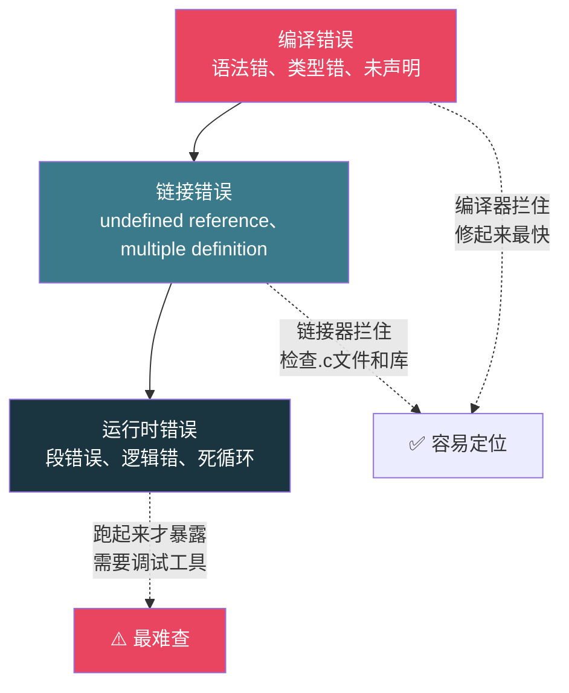
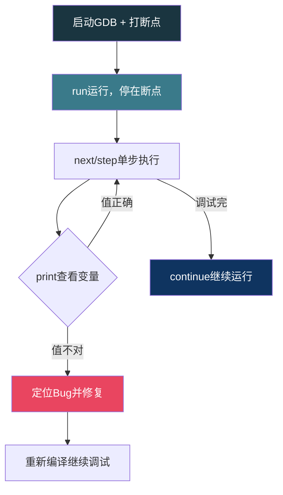
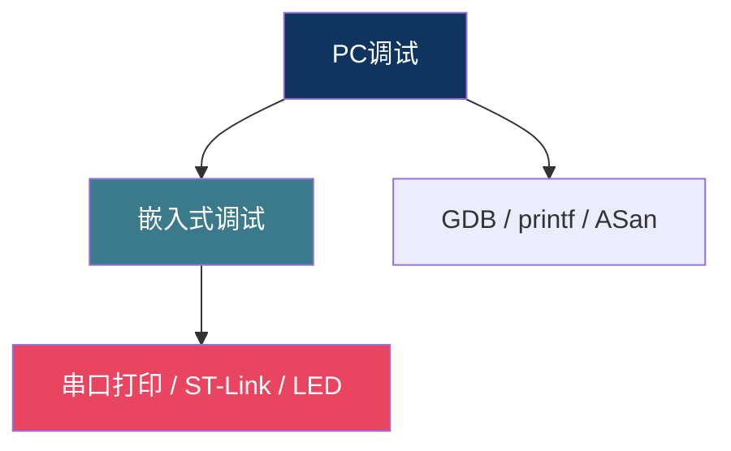

# 【炼气·22】第一个Bug：程序为什么不跑

> **码农修仙传 · 炼气期 · 第22篇**
> 我是玄芯散人，带你从炼气修到大乘。

---

## 境界标识

```
╔══════════════════════════════════════╗
║     炼气期 · 第22篇                    ║
║     第一个Bug：程序为什么不跑           ║
║     编译错误、运行时错误、GDB调试入门    ║
║     预计阅读：25分钟                    ║
╚══════════════════════════════════════╝
```

---

## 修仙引入

修炼之人最怕走火入魔。功法运转到一半，灵气逆行，经脉堵塞，轻则修为倒退，重则当场炸丹。你的代码也一样：编译时报错，像功法练错了经脉走向，还能重来；运行时崩溃，像走火入魔，你根本不知道是哪一步出了问题。

这篇讲怎么找到你的第一个Bug。编译器给你的错误信息怎么看，程序跑起来结果不对怎么排查，GDB怎么打断点单步执行。这些是炼气期必须练的排查基本功，不会调试的程序员跟蒙眼走路没区别。

---

## 硬核主体

### Bug分三类

写代码出问题，按出问题的时机分三种。搞清楚你的Bug属于哪一类，排查方向就明确了大半。

第一类是编译错误。编译器在编译阶段就拦住你，程序根本没变成可执行文件。常见的原因是语法写错了，比如少了分号，括号没配对，变量名拼错了，函数参数类型不对。这类错误编译器会告诉你具体在哪一行，修起来最快。

第二类是链接错误。编译阶段每个`.c`文件各自通过，但链接器把`.o`文件拼在一起时发现对不上。最常见的是`undefined reference to xxx`，意思是某个函数你声明了也调用了，但找不到实现。021篇讲头文件时说过，声明和定义是两码事，链接器负责把声明和定义接起来，接不上就报这个错。

第三类是运行时错误。程序编译链接都通过了，跑起来要么崩溃，要么结果不对。段错误，死循环，逻辑错误，这些都是运行时才暴露的。也是最难查的一类。



### 怎么读编译器的错误信息

新手看到编译器吐出一堆红字，第一反应是慌。其实编译器的错误信息格式有规律，看懂了就能快速定位。

GCC的错误信息长这样：

```
main.c: In function 'main':
main.c:5:5: error: expected ';' before 'return'
    5 |     return 0;
      |     ^~~~~~
```

每行错误信息包含三样东西：文件名，行号，错误描述。`main.c:5:5`表示`main.c`文件第5行第5列。`error: expected ';' before 'return'`告诉你第5行的`return`之前少了一个分号。

注意编译器有时候报的行号不是真正出错的那一行。比如你少了一个右括号，编译器可能到文件末尾才发现括号没配对，报的行号是最后一行。遇到这种情况，从报错行号往上找，检查括号和分号有没有遗漏。

一个错误可能引发连锁报错。少了一个分号，编译器后面所有的代码都解析错了，一口气吐出十几个error。这时候不要慌，修第一个error，重新编译，后面的error可能自动消失。

```c
#include <stdio.h>

int main(void) {
    int x = 10
    printf("x = %d\n", x);   /* 编译器在这里报错: expected ';' before 'printf' */
    return 0;
}
```

编译器在第5行报错说`printf`之前少分号，但真正的问题在第4行：`int x = 10`末尾少了分号。编译器读到第5行时才发现不对，所以报的行号是5不是4。

### 警告也要看

GCC默认不输出所有警告。加`-Wall`开启常用警告，加`-Wextra`开启更多检查。警告不是错误，程序能编译通过，但警告往往意味着代码有隐患。

```bash
# 编译时开启警告
gcc -Wall -Wextra -g main.c -o main
```

几个常见的警告：

`-Wuninitialized`：变量没初始化就用了。016篇讲过，未初始化的局部变量值是随机的，用了就是隐患。

`-Wunused-variable`：声明了变量但没用。通常是你写代码时改了逻辑，忘了删掉不需要的变量。

`-Wformat`：printf的格式化字符串和参数类型不匹配。比如`printf("%d\n", 3.14)`，`%d`期望int但你给了double，017篇详细讲过这个坑。

养成习惯：编译时永远带`-Wall -Wextra`，零警告才算干净代码。忽略警告的人，迟早被警告教做人。

### undefined reference：链接器的抗议

编译通过了，链接时报`undefined reference to 'xxx'`，这是新手最常遇到的链接错误。

```c
/* main.c */
#include <stdio.h>

int add(int a, int b);   /* 声明: add函数在别处 */

int main(void) {
    printf("%d\n", add(3, 5));
    return 0;
}
```

你声明了`add`函数，调用了它，但没写实现。编译时没问题，编译器看到声明就放行。链接时找不到`add`的实现，报错：

```
/usr/bin/ld: main.o: in function `main':
main.c:(.text+0x1f): undefined reference to `add'
collect2: error: ld returned 1 exit status
```

`ld`是链接器，它告诉你`main.o`里引用了`add`但找不到定义。修法很简单：写一个`add.c`文件提供实现，编译时把两个文件一起传给gcc。

```c
/* add.c */
int add(int a, int b) {
    return a + b;
}
```

```bash
gcc -g main.c add.c -o main   # 两个文件一起编译链接
```

021篇讲过，头文件放声明，`.c`文件放定义。如果链接器报`undefined reference`，先检查你是不是忘了把某个`.c`文件加到编译命令里。

### 段错误：运行时的地雷

段错误（Segmentation Fault，简称segfault）是C语言运行时最常见的崩溃。原因是程序访问了不该访问的内存地址。操作系统给每个进程分配了合法的内存区域，你访问的地址不在这个区域里，CPU触发异常，操作系统直接把进程杀掉。

常见的段错误原因：

```c
/* 1. 解引用NULL指针 */
int *p = NULL;
*p = 42;        /* 段错误: NULL地址不可写 */

/* 2. 解引用野指针 */
int *q;         /* 没初始化, 指向随机地址 */
*q = 42;        /* 段错误: 随机地址大概率不可写 */

/* 3. 数组越界 */
int arr[10];
arr[100000] = 42;   /* 可能段错误, 也可能踩坏内存不报错 */

/* 4. 修改字符串常量 */
char *s = "hello";
s[0] = 'H';     /* 段错误: 字符串常量在只读区 */
```

第四种容易忽略。`char *s = "hello"`里的`"hello"`是字符串常量，存在程序的只读数据段，不可修改。想修改字符串内容，应该用数组：`char s[] = "hello"`，这样`"hello"`被复制到栈上的可写数组里。

### GDB：你的调试法器

printf调试法是最原始的手段：在代码里到处加`printf`打印变量值，看程序跑到哪一步出了问题。简单有效，但效率低。你每加一个printf就要重新编译，而且printf只能看到你主动打印的变量。

GDB（GNU Debugger）是Linux下C语言的调试利器。它能让你在程序运行时暂停，查看任意变量的值，一步一步执行代码，比printf高效得多。

用GDB调试，编译时要加`-g`选项，把调试信息编进可执行文件里：

```bash
gcc -g -Wall main.c -o main    # -g保留源码行号等信息, GDB需要
```

不加`-g`，GDB能调试但看不到源码行号，只能看汇编。加了`-g`，GDB能把机器码和你的C源码对应起来，你可以按行设断点。

启动GDB：

```bash
gdb ./main
```

进入GDB的交互界面后，常用的命令：

```bash
(gdb) break main          # 在main函数打断点, 简写 b
(gdb) break 15            # 在第15行打断点
(gdb) run                 # 运行程序, 简写 r
(gdb) next                # 执行下一行(不进入函数), 简写 n
(gdb) step                # 执行下一行(进入函数), 简写 s
(gdb) print x             # 打印变量x的值, 简写 p
(gdb) continue            # 继续运行到下一个断点, 简写 c
(gdb) backtrace           # 查看调用栈, 简写 bt
(gdb) quit                # 退出GDB, 简写 q
```

一个完整的调试流程：

```c
#include <stdio.h>

int compute(int n) {
    int result = 1;
    for (int i = 1; i <= n; i++) {
        result *= i;        /* 算阶乘 */
    }
    return result;
}

int main(void) {
    int n = 5;
    int answer = compute(n);
    printf("%d! = %d\n", n, answer);
    return 0;
}
```

```bash
gcc -g -Wall factorial.c -o factorial
gdb ./factorial
```



`next`和`step`的区别要记住：`next`执行一行代码，遇到函数调用不进去，把函数整个执行完。`step`执行一行代码，遇到函数调用会进去，停在函数内部第一行。调试自己的代码用`step`进去看，调试库函数调用用`next`跳过。

`backtrace`在程序崩溃时特别有用。如果程序在某个函数里段错误了，GDB会自动停下来，你输入`backtrace`就能看到调用链：谁调用了谁，一路追到出错的位置。

```
Program received signal SIGSEGV, Segmentation fault.
0x0000555555555169 in compute (n=5) at factorial.c:6
6	    result *= i;
(gdb) backtrace
#0  0x0000555555555169 in compute (n=5) at factorial.c:6
#1  0x0000555555555192 in main () at factorial.c:11
```

`backtrace`告诉你：程序在`factorial.c`第6行崩了，这个函数是被`main`第11行调用的。顺着调用链往回查，就能定位问题根源。

### printf调试法：简单但有效

GDB功能强大，但有时候你只是想快速看几个变量的值，不想开GDB。printf调试法虽然原始，但在简单场景下效率不低。

```c
int main(void) {
    int arr[5] = {10, 20, 30, 40, 50};
    int sum = 0;

    for (int i = 0; i <= 5; i++) {     /* 注意: <=5, 越界了! */
        printf("[DEBUG] i=%d, arr[i]=%d, sum=%d\n", i, arr[i], sum);
        sum += arr[i];
    }
    printf("sum = %d\n", sum);
    return 0;
}
```

加一行`[DEBUG]`打印，你能看到每次循环时`i`和`arr[i]`的值。当`i`变成5时，`arr[5]`越界读到了乱码，问题一目了然。

调试完记得删掉debug打印，或者用宏控制：

```c
#define DEBUG 1

#if DEBUG
    #define DBG_PRINT(fmt, ...) printf("[DEBUG] " fmt, ##__VA_ARGS__)
#else
    #define DBG_PRINT(fmt, ...)   /* 什么都不做 */
#endif

/* 使用 */
DBG_PRINT("i=%d, sum=%d\n", i, sum);
```

把`DEBUG`设为0，所有`DBG_PRINT`变成空操作，发布时不用一个个删。014篇讲宏和条件编译时说过`#if`的用法，这里就是一个实际用途。

### 调试心法：先复现再修

调试的第一步不是改代码，是复现Bug。能稳定复现的Bug才好查，随机出现的Bug让人抓狂。复现Bug时记清楚你的输入和操作步骤，这样才能确认修了之后确实好了。

第二步缩小范围。注释掉一部分代码，看Bug还在不在。如果在，说明问题在被注释掉的部分之外。如果不在了，说明问题在注释掉的那部分里。反复二分，把问题锁定在几行代码之内。

第三步用GDB或者printf在可疑区域查看变量值，看哪个变量的值跟预期不符。找到了不对的变量，再往回查它是在哪里被赋值的，赋值的逻辑哪里有问题。

这套流程看起来慢，但比"凭感觉乱改然后祈祷能好"快得多。新手最大的问题是改代码太随意，改完不确认是不是真的修了，结果原来的Bug没修好又引入新的Bug。

### 嵌入式调试的特殊之处

PC上调试有GDB用，嵌入式上往往没那么方便。单片机跑在裸机上，没有操作系统帮你管内存，也没有终端跑GDB。调试手段主要是两个：串口打印和硬件调试器。

串口打印就是嵌入式版的printf调试法。通过UART把变量值打到串口终端上看。027篇会专门讲UART，这里先知道有这回事。

硬件调试器如ST-Link可以通过SWD接口连接单片机，在Keil里打断点单步调试，跟PC上的GDB用法类似。但嵌入式调试受限于硬件资源，断点数量有限，某些低功耗模式下调试器会失效。



有些嵌入式项目连串口都没有，只能用LED灯的亮灭状态来传递调试信息。闪烁一次表示初始化通过了，闪烁两次表示某个传感器读取失败。这种调试方式很原始，但在资源受限的环境下确实管用。

---

## 修仙术语对照表

| 修仙术语 | 技术现实 | 本篇位置 |
|----------|---------|---------|
| 走火入魔 | 运行时崩溃，程序行为失控 | 修仙引入 |
| 功法练错经脉 | 编译错误，语法或类型不对 | Bug分三类 |
| 灵脉接不上 | 链接错误，声明找不到定义 | Bug分三类 |
| 地雷 | 段错误，访问非法地址 | 段错误 |
| 调试法器 | GDB调试器 | GDB入门 |
| 定身术 | break打断点暂停程序 | GDB入门 |
| 一步一停 | next和step单步执行 | GDB入门 |
| 照妖镜 | print查看变量值 | GDB入门 |
| 回溯踪迹 | backtrace查看调用栈 | GDB入门 |
| 痕迹追踪 | printf调试法 | printf调试法 |
| 稳定复现 | 能反复触发的Bug才好查 | 调试心法 |
| 二分排查 | 注释掉部分代码缩小范围 | 调试心法 |
| 传音符 | 串口打印调试 | 嵌入式调试 |
| 法器探查 | ST-Link硬件调试器 | 嵌入式调试 |
| 灯语 | LED亮灭传递调试状态 | 嵌入式调试 |

---

## 突破条件

- [ ] 能区分编译错误、链接错误、运行时错误，说出各自的特征
- [ ] 能读懂GCC的错误信息格式（文件名:行号:列号:错误描述）
- [ ] 知道一个编译错误可能引发连锁报错，修第一个error后重新编译
- [ ] 能用`gcc -g -Wall -Wextra`编译带调试信息和警告的程序
- [ ] 能用GDB完成基本的调试流程：break打断点，run运行，next单步，print看变量
- [ ] 能说出`next`和`step`的区别（next不进入函数，step进入函数）
- [ ] 能用backtrace查看崩溃时的调用栈，定位崩溃位置
- [ ] 能用printf加`[DEBUG]`标记快速排查简单的逻辑错误

> 下一篇讲数组越界。C语言不检查数组边界，越界了编译器不拦，程序可能照跑也可能直接崩。越界到底会发生什么，ASan怎么帮你抓越界Bug，下篇细说。

---

## 下期预告 + 互动

> 下一篇：【炼气·23】数组越界：C语言最危险的Bug
>
> 你写了个`int arr[10]`，然后访问了`arr[15]`。编译器一声不吭，程序可能正常跑，也可能某天突然崩。C语言为什么不管数组边界？越界访问到底改了什么？AddressSanitizer怎么在运行时抓到越界？这是C程序员必须知道的危险地带。

问你：

> 你写的第一个Bug是什么？花了多久才找到？用的printf还是GDB？
>
> 你第一次用GDB打断点单步调试时是什么感觉？有没有被GDB的命令行界面劝退过？

> 我是玄芯散人，带你从炼气修到大乘。

---

*本文是「码农修仙传」系列第22篇。系列导航见 [xren.ren](https://xren.ren)*
