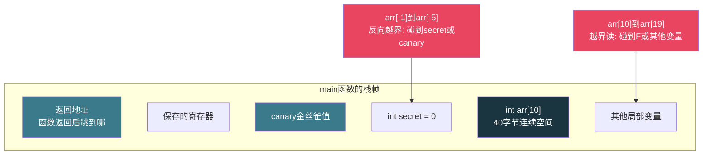
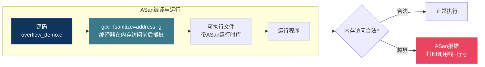

# 【炼气·23】数组越界：C语言最危险的Bug

> **码农修仙传 · 炼气期 · 第23篇**
> 我是玄芯散人，带你从炼气修到大乘。

---

## 境界标识

```
╔══════════════════════════════════════╗
║     炼气期 · 第23篇                    ║
║     数组越界：C语言最危险的Bug          ║
║     为什么C不检查边界，ASan怎么抓越界    ║
║     预计阅读：20分钟                    ║
╚══════════════════════════════════════╝
```

---

## 修仙引入

修仙界有一种禁术，施法时看起来毫无异样，灵力运转顺畅，法诀也没报错。但三天后经脉碎裂，七天后丹田漏风，你完全不知道是哪一步出了问题。C语言的数组越界就是这种禁术。你写了`arr[15]`，数组只有10个元素，编译器不拦你，程序跑得好好的，直到某天突然崩了，或者数据莫名变了，你翻遍代码也找不到原因。

上一篇讲了调试基本功，这篇专讲C语言里最危险的一类Bug：数组越界。为什么C语言不检查数组边界，越界访问到底改了什么内存，ASan怎么在运行时帮你抓住越界操作。这些是每个C程序员必须知道的东西。

---

## 硬核主体

### C语言为什么不检查数组边界

先回答这个问题：C语言在编译时和运行时都不检查数组下标是否越界。这不是设计疏忽，是刻意的取舍。

C语言诞生于1972年，设计目标是替代汇编语言写操作系统。那个年代CPU主频不到1MHz，内存以KB计，每一次内存访问都要精打细算。如果在每次数组访问时加一个边界检查，意味着每次`arr[i]`都要额外执行两三条指令：取数组长度，比较下标，条件跳转。对于频繁访问数组的循环来说，这个开销不可忽视。

Dennis Ritchie的设计哲学是"信任程序员"。C语言假设你知道自己在做什么，编译器不替你做安全检查。这跟后来的Java、Python完全不同，那些语言在运行时检查每次数组访问，越界了抛异常。C语言的选择是性能优先，安全靠程序员自己负责。

```c
#include <stdio.h>

int main(void) {
    int arr[10] = {0, 1, 2, 3, 4, 5, 6, 7, 8, 9};

    /* 正常访问 */
    printf("arr[5] = %d\n", arr[5]);    /* 输出5 */

    /* 越界访问 */
    printf("arr[15] = %d\n", arr[15]);  /* 编译通过, 运行时行为未定义 */

    /* 越界写入 */
    arr[20] = 42;   /* 编译通过, 可能踩坏内存, 也可能不报错 */

    return 0;
}
```

上面这段代码用`gcc -Wall`编译，一个警告都不会有。编译器看到`arr[15]`，它知道`arr`是`int[10]`，但它不检查15是否越界。运行时，`arr[15]`会访问`arr`起始地址往后偏移60个字节的位置（15乘以4，因为`int`占4字节）。那个位置存着什么，谁也不知道。

### 越界访问到底碰到了什么内存

数组在内存里是连续存放的。`int arr[10]`占40个字节，紧挨着它的可能是其他局部变量，可能是函数的返回地址，可能是上一个函数留下的栈残留。越界访问就是读写了这块不属于你的内存。

栈上的布局大致长这样：



注意这张图是简化示意，实际栈布局取决于编译器和平台和编译选项。但大致结构是对的：数组后面或前面有其他变量，越界访问就是踩到了它们。

来看一个能实际复现的例子：

```c
#include <stdio.h>

int main(void) {
    int arr[5] = {10, 20, 30, 40, 50};
    int canary = 999;   /* 放在数组后面, 模拟相邻变量 */

    printf("越界前: canary = %d\n", canary);

    arr[5] = 0;   /* 越界写入! arr只有0-4, 下标5越界 */
    /* 注意: arr[5]可能恰好踩到canary, 也可能踩到别的位置 */

    printf("越界后: canary = %d\n", canary);
    /* 如果canary变了, 说明arr[5]踩到了它 */

    return 0;
}
```

这段代码的行为是未定义的（undefined behavior）。在某个编译器某个编译选项下，`arr[5]`可能恰好覆盖`canary`，你会看到输出从999变成了0。换个编译器或换个编译选项，`arr[5]`可能踩到别的位置，`canary`不变，程序看起来完全正常。

这就是数组越界最可怕的地方：它的表现是随机的。有时候立刻崩溃，有时候数据悄悄变了你浑然不知，有时候程序跑得好好的直到某天环境变了突然出问题。

### 未定义行为是什么意思

C语言标准里有一个概念叫"未定义行为"（undefined behavior，简称UB）。意思是：标准没有规定这种情况该怎么处理，编译器可以随便来。

数组越界就是典型的UB。标准只说`arr[i]`访问的是`arr`起始地址往后偏移`i * sizeof(int)`的位置，但没说如果这个位置超出数组范围会怎样。编译器不需要处理这种情况，也不需要报错。

UB的后果包括但不限于：

- 读到垃圾值，程序输出错误结果
- 写坏其他变量，程序行为异常
- 踩到栈上的返回地址，程序跳到错误位置执行
- 恰好没碰到关键数据，程序照常运行
- 编译器在编译时假设UB不会发生，导致更诡异的行为

最后一条特别坑。现代编译器会做激进的代码变换，如果它推断出某段代码会导致UB，它可能直接删掉这段代码或者做意想不到的改写。你写的代码跟编译器生成的机器码可能完全不是一回事。

```c
#include <stdio.h>
#include <limits.h>

int main(void) {
    int arr[10];
    int i = 0;

    /* 编译器可能假设这个循环不会越界, 因为越界是UB */
    /* 从而做出意料之外的代码变换 */
    for (i = 0; i <= 10; i++) {   /* 注意: <=10, i=10时越界 */
        arr[i] = i;
    }

    printf("arr[0] = %d\n", arr[0]);
    return 0;
}
```

`i <= 10`时，`i`从0到10共11次循环，但`arr`只有10个元素（下标0到9）。`arr[10]`越界，行为未定义。在启用代码变换的情况下，编译器可能假设这个UB不会发生，从而推断`i <= 10`永远为假，直接把循环删掉了。你运行程序发现数组没被赋值，一头雾水。

### 栈溢出：越界的致命后果

数组越界最致命的后果是栈溢出攻击。016篇讲缓冲区溢出时提过，这里展开说。

函数调用时，返回地址被压到栈上。这个返回地址告诉CPU"这个函数执行完后跳回哪里继续"。如果数组越界把这个返回地址覆盖了，函数返回时CPU会跳到你覆盖的地址去执行代码。

```c
#include <stdio.h>
#include <string.h>

void vulnerable_function(void) {
    char buf[8];                        /* 栈上8字节缓冲区 */
    strcpy(buf, "AAAAAAAAAAAAAAAA");    /* 16个A, 远超8字节 */
    /* 多出来的字节踩到了buf后面的内存 */
    /* 如果踩到返回地址, 函数返回时跳到0x41414141 */
    printf("buf = %s\n", buf);
}

int main(void) {
    vulnerable_function();
    printf("函数返回了\n");   /* 如果返回地址被覆盖, 这行可能执行不到 */
    return 0;
}
```

`buf`只有8字节，`strcpy`灌进去17个字节（16个A加一个`\0`）。多出来的9个字节踩到栈上`buf`后面的区域。如果踩到返回地址，函数返回时CPU尝试跳到由A的ASCII码（0x41）拼成的地址。在32位系统上这个地址是`0x41414141`，在64位系统上更长，大概率是个非法地址，程序段错误。

真正的攻击会精心构造溢出数据，把返回地址替换成攻击代码的地址，让CPU跳去执行攻击者想跑的代码。这就是经典的栈溢出攻击原理，1996年Aleph One在Phrack杂志上发表的"Smashing The Stack For Fun And Profit"详细讲了这个技术。

现代编译器和操作系统加了几层防护来应对：

- 栈保护（`-fstack-protector`）：在栈上放一个随机值（canary），函数返回前检查它有没有被改。越界覆盖了canary就立刻中止程序，不让攻击者篡改返回地址。
- ASLR（地址空间随机化）：每次运行程序时栈和堆的地址都不一样，攻击者没法预知返回地址该填什么值。
- NX位（不可执行栈）：把栈标记为不可执行，即使返回地址被覆盖跳到了栈上，CPU也拒绝执行栈上的代码。

这些防护大大增加了攻击难度，但没有一种是万能的。最底层的防护还是写出不越界的代码。

### 怎么避免数组越界

避免越界没有高深的技术，靠的是编码习惯：

```c
/* 1. 用常量定义数组大小, 循环时引用常量, 不要写魔法数字 */
#define ARR_SIZE 10
int arr[ARR_SIZE];
for (int i = 0; i < ARR_SIZE; i++) {   /* 用 < 而不是 <= */
    arr[i] = i;
}

/* 2. 接收外部输入时检查长度 */
void process_data(const int *input, int input_len) {
    int buf[256];
    if (input_len > 256) {
        /* 输入太长, 截断或报错 */
        input_len = 256;
    }
    for (int i = 0; i < input_len; i++) {
        buf[i] = input[i];
    }
}

/* 3. 用fgets而不是gets, 用snprintf而不是sprintf */
char line[64];
fgets(line, sizeof(line), stdin);   /* 最多读63个字符 */

/* 4. 字符串操作用strncpy或snprintf限长 */
char dst[16];
snprintf(dst, sizeof(dst), "%s", src);   /* 不会写超过16字节 */
```

第一条最简单也最容易漏：循环条件用`<`不用`<=`。`i < ARR_SIZE`时`i`最大是`ARR_SIZE - 1`，刚好是最后一个元素。写成`i <= ARR_SIZE`时`i`会取到`ARR_SIZE`，越界一个元素。

第二条是函数接收外部数据时必须检查长度。你不知道调用者会传多大的数组进来，`input_len`可能远超`buf`的大小。C语言没有引用类型附带的长度信息，长度靠参数传递，调用者和被调用者必须达成默契。

第三条和第四条在016篇详细讲过，这里不重复。只需要记住：任何把外部数据写入固定大小缓冲区的操作，都必须限制写入长度。

### ASan：运行时越界检测

即使你很小心，越界Bug还是可能漏过去。GCC和Clang提供了一个运行时检测工具：AddressSanitizer，简称ASan。

ASan的原理是在每个内存访问前后插入检查代码。编译时加`-fsanitize=address`，编译器会在每次读写内存前检查地址是否合法。越界访问时ASan立刻报错，打印出详细的调用栈信息，告诉你哪一行代码访问了哪个非法地址。

```c
/* overflow_demo.c */
#include <stdio.h>

int main(void) {
    int arr[5] = {10, 20, 30, 40, 50};

    /* 越界写入 */
    arr[10] = 42;   /* arr只有5个元素, 下标10越界 */

    printf("arr[0] = %d\n", arr[0]);
    return 0;
}
```

用ASan编译并运行：

```bash
gcc -fsanitize=address -g overflow_demo.c -o overflow_demo
./overflow_demo
```

运行时ASan会输出类似这样的信息：

```
=================================================================
==12345==ERROR: AddressSanitizer: stack-buffer-overflow on address 0x7ffe12345678
WRITE of size 4 at 0x7ffe12345678 thread T0
    #0 0x4005e6 in main /home/user/overflow_demo.c:6:5
    #1 0x7f1234567890 in __libc_start_main
    ...
Shadow bytes around the buggy address:
  ...
==12345==ABORTING
```

ASan告诉你：在`overflow_demo.c`第6行，发生了`stack-buffer-overflow`，写入了一个4字节（`int`的大小）到越界地址。你一眼就知道问题在哪。

对比没有ASan的情况：这段代码不加`-fsanitize=address`编译运行，大概率什么都不报，程序正常退出。你完全不知道`arr[10] = 42`踩坏了什么。



ASan能检测的问题包括栈缓冲区溢出，堆缓冲区溢出，还有释放后使用（use-after-free）和重复释放（double free）等。它对开发阶段排查内存问题非常有用。

ASan的代价是性能。插桩会让程序慢约2倍，内存占用增加约3倍。所以ASan只在开发和测试阶段开启，正式发布时关闭。用法跟016篇讲的一致：`gcc -fsanitize=address -g`编译，正常运行就能看到报错。

### ASan的局限

ASan不是万能的。有些越界它抓不到。

栈上相邻变量的越界访问，如果偏移量太小（比如`arr[5]`踩到紧挨着的`int secret`），ASan可能在某些情况下漏报。因为ASan的影子内存有粒度限制，它是按8字节块来跟踪的，如果越界恰好落在同一个8字节块内，可能检测不到。

另外，ASan检测的是运行时实际发生的越界。如果你的代码里有一段越界逻辑，但测试时没跑到那条路径，ASan也不会报错。测试覆盖率不够，ASan的保护就不够。

静态检查工具如GCC的`-Warray-bounds`可以在编译时检查一些明显的越界，比如`arr[100]`这种编译器能算出来的越界。但它只能检查编译期常量下标，变量下标查不了。

```c
int arr[10];

arr[15] = 0;      /* 编译器可能警告: -Warray-bounds */
arr[i] = 0;       /* 编译器无法检查, i是变量, 运行时才知道值 */
```

### 嵌入式里的数组越界

嵌入式开发中数组越界的后果往往更严重。PC上程序崩溃最多重启，嵌入式设备没有MMU（内存管理单元）做内存保护，越界写入可能直接踩到硬件寄存器区域，导致外设行为异常甚至硬件损坏。

```c
/* 嵌入式危险示例（概念说明） */
/* 假设GPIO寄存器基地址是0x40020000 */
#define GPIO_BASE  0x40020000
volatile uint32_t *gpio = (uint32_t *)GPIO_BASE;

uint32_t buf[4];
/* 如果buf后面的内存恰好是GPIO寄存器区域 */
/* buf[10] = 0xFF 就可能改写GPIO寄存器, 引脚状态突变 */
```

嵌入式调试手段有限，PC上能跑ASan，嵌入式上往往只有串口打印和几个LED灯。所以嵌入式工程师对数组越界的警惕性要比PC程序员更高：所有外部输入都要校验长度，所有数组访问都要确认下标范围，缓冲区大小要留足余量。

### 实战：一个真实的越界Bug

来看一段看起来没问题的代码，实际藏了越界Bug：

```c
#include <stdio.h>

#define BUF_SIZE 8

int main(void) {
    char buf[BUF_SIZE];
    int i;

    /* 把数字0到7的字符存入buf */
    for (i = 0; i <= BUF_SIZE; i++) {   /* Bug: <= 应该是 < */
        buf[i] = '0' + i;
    }

    /* 打印buf作为字符串 */
    buf[BUF_SIZE - 1] = '\0';   /* 留了结尾的\0, 但循环已经越界了 */
    printf("buf = %s\n", buf);

    return 0;
}
```

`BUF_SIZE`是8，数组下标0到7。循环用`i <= BUF_SIZE`，`i`会取到8，`buf[8]`越界一个元素。这一个字节的越界可能踩到`buf`后面的`i`变量（取决于栈布局），也可能踩到canary，也可能什么都没踩到。

用ASan编译运行这段代码，会看到`stack-buffer-overflow`的报错，精确指向循环那一行。不用ASan，程序可能正常输出`buf = 0123456`，你以为没问题，Bug就这么藏下来了。

修法很简单：把`<=`改成`<`。

```c
for (i = 0; i < BUF_SIZE; i++) {   /* 修复: < 确保不越界 */
    buf[i] = '0' + i;
}
```

---

## 修仙术语对照表

| 修仙术语 | 技术现实 | 本篇位置 |
|----------|---------|---------|
| 禁术 | 数组越界，编译器不拦但后果不可控 | 修仙引入 |
| 信任修行者 | C语言不检查数组边界的设计哲学 | 为什么不检查 |
| 暗踩灵脉 | 越界访问踩到相邻变量 | 越界碰到了什么 |
| 随机发作 | 未定义行为的不可预测性 | 未定义行为 |
| 天劫 | 栈溢出覆盖返回地址 | 栈溢出 |
| 金丝雀护体 | canary栈保护机制 | 栈溢出 |
| 结界随机化 | ASLR地址空间随机化 | 栈溢出 |
| 禁魔区 | NX不可执行栈 | 栈溢出 |
| 防御心法 | 用常量定义大小、检查输入长度 | 怎么避免 |
| 天眼术 | ASan运行时越界检测 | ASan |
| 照妖镜 | ASan打印调用栈和行号 | ASan |
| 天眼盲区 | ASan对同块内小偏移越界可能漏报 | ASan的局限 |
| 静观术 | 静态检查-Warray-bounds编译期检查 | ASan的局限 |
| 灵脉崩坏 | 嵌入式越界踩到硬件寄存器 | 嵌入式 |
| 循环差一字 | <=与<差一个元素的越界 | 实战 |

---

## 突破条件

- [ ] 能解释C语言不检查数组边界的原因（性能取舍+信任程序员的设计哲学）
- [ ] 能说出"未定义行为"的含义，列出至少3种可能的后果
- [ ] 能解释栈溢出攻击的原理：越界覆盖返回地址导致跳转到非法地址
- [ ] 能列出三种栈溢出防护机制（canary、ASLR、NX位），各说一句话原理
- [ ] 能写出避免数组越界的编码习惯：用常量定义大小，循环用<不用<=，外部输入检查长度
- [ ] 能用`-fsanitize=address -g`编译带ASan的程序，读懂ASan的报错信息
- [ ] 能说出ASan的两个局限（性能开销、同块小偏移可能漏报）

> 下一篇讲段错误的深入排查。程序崩了留下core dump怎么用，GDB怎么在崩溃后自动加载core文件看到崩溃位置的变量值和调用栈。数组越界是段错误的常见原因之一，下篇讲怎么把崩溃现场还原出来。

---

## 下期预告 + 互动

> 下一篇：【炼气·24】程序崩了怎么看：段错误入门
>
> 你的程序跑着跑着突然打印一个"Segmentation fault"然后退出了。022篇介绍了段错误的概念，这篇深入讲core dump怎么用，GDB怎么加载core文件定位崩溃现场，崩溃时的变量值怎么看。数组越界踩坏内存后，程序往往以段错误收场，下篇教你把崩溃现场还原出来。

问你：

> 你被数组越界坑过吗？最离谱的一次越界Bug是什么表现？
>
> 你的项目里开了ASan吗？如果没开，看完这篇打算在开发阶段加上吗？

> 我是玄芯散人，带你从炼气修到大乘。

---

*本文是「码农修仙传」系列第23篇。系列导航见 [xren.ren](https://xren.ren)*
