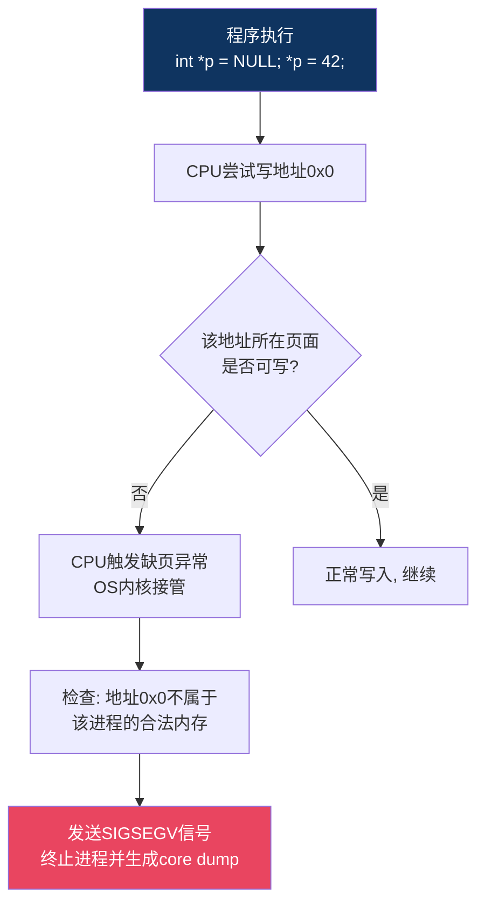

# 【炼气·24】程序崩了怎么看：段错误入门

> **码农修仙传 · 炼气期 · 第24篇**
> 我是玄芯散人，带你从炼气修到大乘。

---

## 境界标识

```
╔══════════════════════════════════════╗
║     炼气期 · 第24篇                    ║
║     程序崩了怎么看：段错误入门          ║
║     SegFault原理+core dump+GDB定位     ║
║     预计阅读：18分钟                    ║
╚══════════════════════════════════════╝
```

---

## 修仙引入

修仙者渡劫失败，元神溃散，留下一缕残魂。你不知道劫雷从哪边劈来，不知道哪条经脉先断的。但如果有人能在你溃散的瞬间拍一张快照，记录下残魂的状态和位置以及最后正在运转的法诀，你就有机会找到死因。程序崩溃时留下的core dump，就是这张快照。段错误是C程序员最常遇到的"劫"，这篇讲怎么从崩溃现场还原出Bug。

---

## 硬核主体

### 段错误到底是什么

你在终端跑程序，屏幕上突然蹦出一行字：`Segmentation fault (core dumped)`。程序没了，进程没了，只剩这行字告诉你它死在了什么地方。

段错误的英文是Segmentation Fault，也叫SIGSEGV（Signal Segmentation Violation）。这个名字来源于早期的内存管理方式：操作系统把进程的内存空间分成若干个段（segment），代码段和数据段和栈段各占一块。程序访问了不属于自己这个段的内存地址，操作系统就会发一个SIGSEGV信号把这个进程杀掉。

对炼气期来说，你只需要知道一件事：你的程序试图读写一个不该碰的内存地址，操作系统发现了，直接把它干掉了。

哪些操作会触发段错误？最常见的有这几种：

```c
/* 1. 解引用空指针 */
int *p = NULL;
*p = 42;        /* p是NULL, 地址0x0不可写, 段错误 */

/* 2. 解引用野指针 */
int *q;         /* 未初始化, 值是随机的 */
*q = 100;       /* q指向的地址大概率非法, 段错误 */

/* 3. 访问已释放的内存 */
int *r = (int *)malloc(sizeof(int));
*r = 10;
free(r);
*r = 20;        /* r指向的内存已经被释放, 段错误(可能) */

/* 4. 数组越界(上一篇详细讲过) */
int arr[5];
arr[100000] = 0;  /* 偏移太大, 踩到非法页面, 段错误 */

/* 5. 栈溢出(递归没终止条件) */
void infinite(void) {
    infinite();  /* 一直递归, 栈空间耗尽, 段错误 */
}
```

注意第三条，free后访问不一定会段错误。如果那块内存恰好还在合法页面内，程序可能照常跑，只是读到垃圾值。这正是use-after-free的危险之处：它不一定立刻崩溃，而是悄悄产生错误结果，你很难排查。

### 操作系统怎么知道你碰了不该碰的内存

这里稍微展开一点，但不会深入到硬件层（那是元婴期的事）。

操作系统给每个进程分配内存时，以"页"为单位（通常一页4096字节）。每个页面有权限标记（可读，可写，可执行）。你的程序尝试写一个只读页面，或者读一个未分配的页面，CPU会触发一个硬件异常，操作系统接管这个异常，检查发现这个地址确实不属于你的进程，于是发送SIGSEGV信号。



NULL指针为什么总是段错误？因为几乎所有操作系统都把地址0所在的页面标记为不可访问。这样空指针解引用会立刻崩溃，而不是悄悄写坏地址0的数据。这是一种有意的设计，让空指针Bug尽早暴露。

### core dump：崩溃瞬间的快照

进程被杀掉时，操作系统可以把进程的内存内容和寄存器状态和调用栈等信息写到一个文件里，这个文件叫core dump文件，简称core文件。有了它，你就能用GDB加载崩溃现场，看到程序死在哪一行，当时的变量值是什么，调用链是怎样的。

但默认情况下core dump可能是关闭的。你需要先开启它：

```bash
# 查看当前core文件大小限制
ulimit -c
# 输出0表示core dump被禁用

# 开启core dump(不限大小)
ulimit -c unlimited

# 再次确认
ulimit -c
# 输出unlimited
```

`ulimit -c`设置的是core文件的最大大小。0表示不生成core文件，unlimited表示不限大小。这个设置只在当前终端会话生效，新开终端要重新设置。如果想永久生效，可以在`~/.bashrc`或`~/.zshrc`里加一行`ulimit -c unlimited`。

core文件生成在哪里、叫什么名字，由`/proc/sys/kernel/core_pattern`决定：

```bash
# 查看core文件命名模式
cat /proc/sys/kernel/core_pattern
# 可能输出: core 或 /var/lib/systemd/coredump/%p-%u-%g-%s-%t

# 临时修改为在当前目录生成名为core的文件
echo "core" | sudo tee /proc/sys/kernel/core_pattern
```

不同Linux发行版的默认行为不同。Ubuntu默认用systemd-coredump接管，core文件存在`/var/lib/systemd/coredump/`目录下，需要用`coredumpctl`命令来查看和加载。CentOS和嵌入式Linux通常直接在程序所在目录生成一个叫`core`或`core.进程号`的文件。

### 实战：定位段错误Bug

来看一个会段错误的程序：

```c
/* segfault_demo.c */
#include <stdio.h>
#include <string.h>

void copy_string(char *dst, const char *src) {
    /* 没有检查dst是否为NULL */
    strcpy(dst, src);   /* 如果dst是NULL, 这里段错误 */
}

int main(void) {
    char *buf = NULL;       /* 忘了分配内存 */
    copy_string(buf, "hello world");  /* 传入NULL指针 */
    printf("buf = %s\n", buf);
    return 0;
}
```

编译时加上`-g`选项，让编译器在可执行文件里嵌入调试信息（源码行号、变量名等）。没有`-g`，GDB看不到行号和变量名，只能看到地址。

```bash
gcc -g segfault_demo.c -o segfault_demo
```

运行：

```bash
./segfault_demo
# 输出: Segmentation fault (core dumped)
```

程序崩了。如果core dump已开启，当前目录下应该有一个core文件：

```bash
ls -l core*
# -rw------- 1 user user 262144 Sep  1 10:30 core
# 大小因程序内存占用而异, 几十KB到几MB都有可能
```

现在用GDB加载这个core文件：

```bash
gdb ./segfault_demo core
```

GDB会自动定位到崩溃的那一行，输出类似这样：

```
Core was generated by `./segfault_demo'.
Program terminated with signal SIGSEGV, Segmentation fault.
#0  __strcpy_avx2 () at ../sysdeps/x86_64/multiarch/strcpy-avx2.S:5
#1  0x0000555555555159 in copy_string (dst=0x0, src=0x555555556004 "hello world")
    at segfault_demo.c:6
#2  0x0000555555555175 in main () at segfault_demo.c:11
```

看这个调用栈，从下往上读：

- `main()`在第11行调用了`copy_string`
- `copy_string`在第6行调用了`strcpy`
- `strcpy`在尝试写`dst`指向的地址时崩溃了
- `dst=0x0`，就是NULL

一眼就看到了：`dst`是NULL，你没给它分配内存，`strcpy`往NULL地址写数据，段错误。

在GDB里，几个常用命令帮你进一步查看：

```
(gdb) bt              # 打印调用栈(backtrace), 就是上面那段
(gdb) bt full         # 打印调用栈+每个栈帧的局部变量值
(gdb) frame 1         # 切换到第1帧(copy_string函数)
(gdb) print dst       # 查看dst的值
$1 = 0x0
(gdb) print src       # 查看src的值
$2 = 0x555555556004 "hello world"
(gdb) list            # 显示崩溃位置附近的源码
1   #include <stdio.h>
2   #include <string.h>
3   
4   void copy_string(char *dst, const char *src) {
5       /* 没有检查dst是否为NULL */
6       strcpy(dst, src);   /* 如果dst是NULL, 这里段错误 */
7   }
```


修这个Bug很简单，在`main`里给`buf`分配内存：

```c
int main(void) {
    char buf[64];           /* 栈上分配64字节 */
    copy_string(buf, "hello world");
    printf("buf = %s\n", buf);
    return 0;
}
```

或者在`copy_string`里加NULL检查：

```c
void copy_string(char *dst, const char *src) {
    if (dst == NULL || src == NULL) {
        return;   /* 防御性检查 */
    }
    strcpy(dst, src);
}
```

两种修法都可以，实际项目中两个都加：调用者负责分配内存，被调用者负责防御性检查。

### 没有core dump怎么办

有时候你拿不到core文件。嵌入式设备上没有磁盘空间存core，或者core_pattern被系统接管了找不到文件，或者程序在客户现场崩溃了你没法复现。这时候还有别的办法。

办法一：直接用GDB运行程序

不用core文件，让GDB直接跑程序，崩溃时GDB会自动停在出问题的位置：

```bash
gdb ./segfault_demo
(gdb) run
# 程序运行, 段错误时GDB自动停下
# 然后bt, print等命令照样用
```

这比core dump更简单，缺点是你得能复现这个Bug。如果Bug只在特定条件下触发，你可能要给GDB传参数或重定向输入：

```bash
(gdb) run < input.txt   # 从文件读输入
(gdb) set args arg1 arg2  # 传命令行参数
```

办法二：加printf大法

最原始但最好用的调试法：在可疑的代码段前后加`printf`，看程序执行到哪一步崩了：

```c
printf("step1: before copy\n");
copy_string(buf, "hello");
printf("step2: after copy\n");   /* 如果没打印, 说明崩在copy_string里 */
```

加printf时注意一个问题：stdout是行缓冲的，`printf`输出不一定立刻显示。如果程序在`printf`之后、换行之前崩了，那行printf可能没输出。解决方法是在printf里加`\n`换行（换行会触发刷缓冲），或者加`fflush(stdout)`强制刷新：

```c
printf("step1: before copy\n");
fflush(stdout);   /* 强制立刻输出 */
```

办法三：信号处理函数捕获SIGSEGV

你可以注册一个信号处理函数，段错误时打印一些信息再退出：

```c
#include <stdio.h>
#include <signal.h>
#include <stdlib.h>

void crash_handler(int sig) {
    fprintf(stderr, "\n[CRASH] 捕获到信号 %d (SIGSEGV)\n", sig);
    fprintf(stderr, "程序尝试访问非法内存地址\n");
    fprintf(stderr, "请用GDB加载core文件定位\n");
    exit(1);
}

int main(void) {
    signal(SIGSEGV, crash_handler);   /* 注册信号处理 */

    int *p = NULL;
    *p = 42;   /* 触发段错误, 但先进入crash_handler */

    return 0;
}
```

注意信号处理函数里不能做太复杂的事。`printf`不是信号安全的，应该用`write`函数直接输出。但炼气期先用`fprintf`够了，知道这个概念就行。

实际项目中，信号处理函数通常会调用`abort()`来触发core dump，这样你看到了自定义的报错信息，也拿到了core文件：

```c
void crash_handler(int sig) {
    fprintf(stderr, "[CRASH] 段错误, 生成core dump...\n");
    signal(sig, SIG_DFL);   /* 恢复默认信号处理 */
    raise(sig);             /* 重新发送信号, 触发默认处理(生成core) */
}
```

先恢复默认处理，再重新发信号，这样操作系统会用默认行为生成core文件。直接在信号处理函数里调`abort()`也行，`abort()`会触发SIGABRT并生成core文件。

### 常见段错误排查清单

段错误的原因就那几类，按这个清单逐个排除：

1. 空指针解引用。检查指针使用前是否赋了合法值
2. 野指针。检查指针是否初始化，free后是否置NULL
3. 数组越界。回顾上一篇的内容，用ASan检测
4. 栈溢出。检查递归是否有终止条件，局部数组是否太大
5. 重复释放。同一块内存free两次，可能导致堆管理器状态错乱
6. 格式化字符串错误。`scanf`忘了取地址`&`，把变量的值当地址写入

第六条特别容易犯：

```c
int x;
scanf("%d", x);    /* Bug: 应该是&x, 传了x的值当地址 */
/* x未初始化, 值随机, scanf往随机地址写, 段错误 */
```

正确的写法：

```c
scanf("%d", &x);   /* 传x的地址, scanf往这个地址写 */
```

这种错误编译器通常会警告，开启`-Wall`就能看到：

```bash
gcc -Wall -g test.c -o test
# 警告: format '%d' expects argument of type 'int *', but argument 2 has type 'int'
```

所以每次编译都加`-Wall`，让编译器帮你抓这种低级错误。

### 段错误和总线错误的区别

还有一个容易混淆的概念：总线错误（Bus Error，也叫SIGBUS）。段错误是访问了非法地址，总线错误是访问了合法地址但访问方式不对。

最常见的情况是对齐错误。某些CPU平台（如ARM、MIPS）要求访问内存时地址必须对齐：读4字节的int必须从4的倍数地址开始。如果你用一个没对齐的指针读int，CPU触发总线错误。

```c
char buf[10];
int *p = (int *)(buf + 1);  /* buf+1不是4的倍数, 未对齐 */
*p = 42;                     /* 在要求对齐的CPU上, 总线错误 */
```

x86平台比较宽容，硬件会自动处理未对齐访问（虽然慢一点），不会触发总线错误。但嵌入式平台往往严格要求对齐，013篇讲内存对齐时详细说过。

炼气期只需要知道：段错误是地址非法，总线错误是访问方式不对。两者的排查方法一样，都用GDB看崩溃位置。

---

## 修仙术语对照表

| 修仙术语 | 技术现实 | 本篇位置 |
|----------|---------|---------|
| 渡劫失败 | 程序崩溃，进程被操作系统终止 | 修仙引入 |
| 残魂快照 | core dump文件，记录崩溃时的内存和寄存器状态 | 修仙引入 |
| 劫雷 | SIGSEGV信号，操作系统发出的段错误通知 | 段错误是什么 |
| 灵脉禁区 | 不属于本进程的内存页面，访问即段错误 | 段错误是什么 |
| 空壳指针 | 空指针NULL，地址0x0不可访问 | 常见原因 |
| 野魂附体 | 野指针，指向随机地址 | 常见原因 |
| 护体阵法 | 页面权限标记，可读可写可执行 | OS怎么知道 |
| 溯源术 | GDB的bt命令，追溯调用栈 | 实战定位 |
| 定身术 | GDB的frame命令，切换到指定栈帧 | 实战定位 |
| 传音追踪 | printf调试法，逐步缩小崩溃范围 | 没有core dump |
| 警阵 | SIGSEGV信号处理函数，崩溃前留下信息 | 没有core dump |
| 夺舍重生 | 信号处理中恢复默认处理并raise，重新生成core | 没有core dump |
| 扫雷诀 | 段错误排查清单，逐项排除 | 排查清单 |
| 走火入魔 | scanf忘取地址，把值当地址写入 | 排查清单 |
| 轨道偏移 | 总线错误SIGBUS，访问方式不对（如未对齐） | 段错误和总线错误 |

---

## 突破条件

- [ ] 能用一句话解释段错误：程序访问了不属于它的内存地址，被操作系统终止
- [ ] 能列出至少4种触发段错误的原因（空指针或野指针或越界或use-after-free等）
- [ ] 能用`ulimit -c unlimited`开启core dump，并用`cat /proc/sys/kernel/core_pattern`查看core文件路径
- [ ] 能用`gcc -g`编译带调试信息的程序，用`gdb ./程序 core`加载core文件
- [ ] 能读懂GDB的bt输出，指出崩溃发生在哪个函数哪一行
- [ ] 能用GDB的`print`命令查看崩溃时的变量值
- [ ] 能说出三种没有core文件时的调试方法（GDB直接run或printf大法或信号处理函数）
- [ ] 能进阶到总线错误的识别：知道SIGBUS和SIGSEGV的区别

> 下一篇离开PC世界，开始碰硬件。STM32开发环境怎么搭，Keil和VS Code怎么选，STM32CubeMX怎么生成工程。炼气期最后7篇是动手环节，准备点亮你的第一个LED。

---

## 下期预告 + 互动

> 下一篇：【炼气·25】STM32开发环境搭建：Keil vs VS Code
>
> 告别PC上的gcc和终端，开始玩嵌入式。STM32开发用什么工具，Keil和VS Code各有什么优劣，STM32CubeMX怎么用图形化界面生成初始化代码。搭好环境是动手实践的第一步。

问你：

> 你的项目里core dump目录是不是被systemd接管了，找不到core文件？
>
> 段错误排查时你最先用哪个命令？bt还是直接看源码？

> 我是玄芯散人，带你从炼气修到大乘。

---

*本文是「码农修仙传」系列第24篇。系列导航见 [xren.ren](https://xren.ren)*
