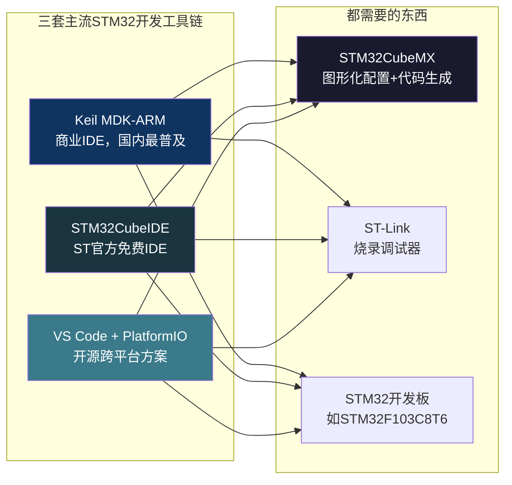
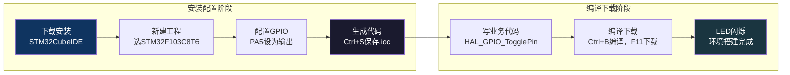

# 【炼气·25】STM32开发环境搭建：Keil vs VS Code怎么选

> **码农修仙传 · 炼气期 · 第25篇**
> 我是玄芯散人，带你从炼气修到大乘。

---

## 境界标识

```
╔══════════════════════════════════════╗
║     炼气期 · 第25篇                    ║
║     STM32开发环境搭建                  ║
║     Keil vs VS Code怎么选              ║
║     预计阅读：15分钟                    ║
╚══════════════════════════════════════╝
```

---

## 修仙引入

前24篇你都在PC上写代码，用gcc编译，在终端跑程序。这就像修仙者在门派练气池里修炼，灵气是别人给你准备好的，经脉是打通好的，你只管打坐就行。

但真正的修仙要入世历劫。你得离开PC这个温室，开始碰硬件。STM32就是你踏入的第一座炼丹炉。问题是，炼丹炉不是你打开就能用的，你得先选工具，搭灶台，备柴火。这篇文章讲的是STM32开发环境怎么搭，Keil和VS Code和STM32CubeIDE这三套工具链各自什么特点，你怎么选。

---

## 硬核主体

### 三套主流工具链概览

STM32开发有三套主流工具链，先给你一个全局认识：



不管你选哪套IDE，STM32CubeMX和ST-Link这两样东西都得有。STM32CubeMX负责帮你生成芯片初始化代码，包括配置时钟和GPIO还有串口这些，ST-Link负责把编译好的固件烧录进芯片并调试。区别只在于代码编辑和编译用的IDE不同。

### Keil MDK-ARM：国内最普及的方案

Keil是ARM公司出品的商业IDE，全称MDK-ARM（Microcontroller Development Kit）。它在国内嵌入式圈子里几乎是标配，大学教材、培训机构的教程，十有八九用Keil。

Keil长什么样？打开以后你会看到uVision5这个编辑器界面，有点像2005年的Visual Studio，界面不花哨但功能齐全。代码编辑和编译还有下载和调试全在一个窗口里完成，不用来回切换软件。

Keil的编译器是ARMCC（v5版本）或ARMClang（v6版本，基于LLVM）。ARMCC编译出来的代码体积小，执行效率高，在工业项目里经过了大量验证。很多公司的代码库都是基于Keil工程组织的，你要改人家的项目，大概率得装Keil。

Keil的授权费用不便宜，商业版几万块人民币。但ARM提供了MDK-Lite免费版，限制是代码大小不超过32KB。对初学者来说32KB够用了，STM32F103C8T6的Flash总共才64KB，你写的点灯程序编译完也就几KB。

Keil的缺点：只支持Windows，macOS和Linux用户只能开虚拟机。界面老旧，代码补全和语法检查远不如VS Code。免费版有32KB限制，一旦项目变大就得买授权。

### STM32CubeIDE：ST官方免费方案

STM32CubeIDE是意法半导体（ST）自己出的IDE，2019年发布，基于Eclipse和GNU工具链，完全免费，没有代码大小限制。它把STM32CubeMX直接集成进去了，不用单独开CubeMX软件，在IDE里就能配置外设并生成代码。

STM32CubeIDE用arm-none-eabi-gcc作为编译器，这是GCC的ARM交叉编译版本。GCC编译的代码质量也不错，跟Keil的ARMCC比，体积可能稍大一点，但日常开发感知不到差别。

对于初学者，STM32CubeIDE有一个明显优势：创建工程流程简单。选芯片型号，配置外设，生成代码，编译下载，一路在同一个软件里完成。而且ST官方的文档和教程都基于CubeIDE，你遇到问题搜ST的官方文档，截图都是CubeIDE的界面。

缺点是Eclipse内核比较重，启动慢，吃内存。代码编辑体验不如VS Code流畅。如果你之前一直用VS Code写代码，切到Eclipse会有点不适应。

### VS Code + PlatformIO：开源跨平台方案

第三套方案是用VS Code加PlatformIO插件。PlatformIO是一个跨平台的嵌入式开发工具，装在VS Code里，支持几百种开发板和MCU，STM32只是其中之一。

这套方案的优点是编辑器体验好。VS Code的代码补全做得很好，语法高亮也舒服，Git集成更是甩Keil和Eclipse几条街。跨平台，Windows和macOS和Linux都支持。对于已经用VS Code写Web或Python的人，不用换编辑器。

缺点是配置门槛高。PlatformIO的工程文件用platformio.ini管理，跟Keil的.uvprojx和CubeIDE的.cproject完全不同。出了问题搜中文资料，关于PlatformIO的教程远不如Keil多。而且PlatformIO默认用Arduino库，如果你要用STM32 HAL库，配置起来要额外费点功夫。

### 我的建议：初学者怎么选

如果你刚接触STM32，我的建议是直接上STM32CubeIDE。理由：

一是免费，没有32KB限制，不用担心写到一半发现编译不过。
二是官方出品，跟STM32CubeMX无缝集成，配置外设到生成代码一条龙。
三是ST的官方教程和示例代码都基于CubeIDE，遇到问题查文档最方便。

等你写了几个月，觉得Eclipse太慢了，或者公司项目要求用Keil，再切换也不迟。工具链之间的切换成本不高，代码逻辑是一样的，只是工程文件格式和编译器不同。

如果你学生党没钱买开发板，先别急着买。下一个方案零成本入门。

### 零成本入门：Proteus仿真

Proteus是一款电路仿真软件，能在电脑上模拟STM32芯片和外设电路。你写好代码编译成.hex文件，扔进Proteus里就能跑，不用买开发板。

Proteus的好处是零成本，适合纯入门阶段验证代码逻辑。缺点是仿真跟真实硬件有差异，时序和电气特性不完全一致。你如果在Proteus里点灯成功了，不代表在真实板子上也能亮。但作为第一步练手，足够了。

等你确认自己要继续学嵌入式，再花几十块钱买一块STM32F103C8T6最小系统板（俗称Blue Pill），加一个ST-Link V2下载器，总共不超过50块人民币。这套硬件组合是国内最便宜的STM32入门方案。

### 搭建STM32CubeIDE环境：实操流程

下面以STM32CubeIDE为例，走一遍安装到点灯的流程。

第一步，下载安装。

去ST官网搜索STM32CubeIDE，下载对应系统的安装包。Windows版是个exe安装程序，一路下一步就行。macOS版是dmg镜像，拖进Applications目录。安装过程中会让你选择是否安装ST-Link驱动和Java运行时，全部勾选。

第二步，创建工程。

打开STM32CubeIDE，点File → New → STM32 Project。在弹出的芯片选择界面输入STM32F103C8，选中STM32F103C8Tx。给工程起个名字，比如blink。点击Finish，CubeMX会在后台初始化工程配置。

第三步，配置GPIO。

工程创建好后，自动打开.ioc文件，这是一个图形化的芯片引脚配置界面。你会看到STM32F103C8T6的48个引脚分布图。

在引脚图上点击PA5引脚，选择GPIO_Output。PA5通常连着Blue Pill板子上的用户LED。

然后在左侧System Core菜单里展开GPIO，选中PA5，把GPIO output level设为High，GPIO mode设为Output Push Pull，Maximum output speed设为Low。这些参数的含义下一篇讲GPIO时详细说，这里先按默认配置走。

第四步，生成代码。

按Ctrl+S保存.ioc文件，STM32CubeMX会自动生成初始化代码。生成的代码在Core/Src/main.c里。你会在main函数里看到MX_GPIO_Init()这个函数调用，这就是CubeMX帮你写的GPIO初始化代码。

第五步，写点灯代码。

在main.c的while(1)循环里加两行代码：

```c
/* Infinite loop */
/* USER CODE BEGIN WHILE */
while (1)
{
    HAL_GPIO_TogglePin(GPIOA, GPIO_PIN_5);   /* 翻转PA5电平 */
    HAL_Delay(500);                           /* 延时500毫秒 */
    /* USER CODE END WHILE */
}
```

注意这两行代码必须写在`USER CODE BEGIN WHILE`和`USER CODE END WHILE`之间。CubeMX生成的代码里有大量这种注释标记，写在标记之间的代码下次重新生成时会被保留，写在标记外面的会被覆盖掉。这是CubeMX保护用户代码的机制。

第六步，编译下载。

按Ctrl+B编译工程，没有错误的话会生成.elf和.bin文件。然后把ST-Link用USB连到电脑，SWD接口接开发板，需要接SWDIO和SWCLK还有GND三根线，再加3.3V供电。

按F11下载程序到芯片并进入调试模式。下载完成后STM32会自动复位运行，LED开始闪烁。如果没亮，检查ST-Link驱动是否装好，SWD接线是否正确。



### ST-Link是什么

上面反复提到ST-Link，这里展开说一下。ST-Link是ST出的一款调试烧录器，用来连接电脑和STM32芯片。它通过SWD（Serial Wire Debug）接口跟STM32通信，SWD只需要两根信号线：SWDIO（数据线）和SWCLK（时钟线），加GND和VCC总共四根线。

ST-Link有两个常见版本。ST-Link/V2是USB Dongle形态，长得像U盘，淘宝上十几块钱的廉价版用的是ST-Link/V2的方案。ST-Link/V3是新款，支持SWD和JTAG和SPI多种接口，速度更快，官方售价几百块。初学者用ST-Link/V2完全够用。

除了ST-Link，还有J-Link。J-Link是Segger公司的产品，支持几乎所有ARM芯片，性能更好但价格更贵。如果你的项目只用STM32，ST-Link就够了，没必要花更多钱买J-Link。

### arm-none-eabi-gcc工具链

如果你不用Keil也不用CubeIDE，而是用VS Code或命令行开发，就需要手动安装arm-none-eabi-gcc工具链。这是一套交叉编译工具，包含编译器和汇编器还有链接器，专门用来编译ARM Cortex-M系列的代码。

交叉编译是什么意思？你在PC上（x86平台）写代码，但代码要在STM32上（ARM Cortex-M平台）跑。PC的gcc编译出来的二进制是x86指令，STM32看不懂。你需要一个运行在x86上但生成ARM指令的编译器，这就是arm-none-eabi-gcc。

工具链的命名有讲究。arm表示目标平台是ARM，none表示没有操作系统（裸机），eabi表示嵌入式应用二进制接口（Embedded Application Binary Interface），gcc就是GCC编译器。整个名字告诉你：这套工具链把C代码编译成ARM裸机能跑的二进制文件。

用命令行编译STM32程序大致是这样的：

```bash
# 编译main.c，生成main.o
arm-none-eabi-gcc -c -mcpu=cortex-m3 -mthumb main.c -o main.o

# 链接，生成.elf
arm-none-eabi-gcc -mcpu=cortex-m3 -mthumb \
    -T STM32F103C8_FLASH.ld \
    main.o startup_stm32f103xb.o \
    -o blink.elf

# 从.elf提取.bin（用来烧录）
arm-none-eabi-objcopy -O binary blink.elf blink.bin

# 用st-flash烧录
st-flash write blink.bin 0x08000000
```

`-mcpu=cortex-m3`指定CPU型号为Cortex-M3，`-mthumb`指定使用Thumb指令集。`0x08000000`是STM32F103的Flash起始地址，烧录就是把.bin文件写到这个地址开始的区域。

命令行开发的好处是你能理解每一步在干什么，坏处是手动管理Makefile和链接脚本比较繁琐。等你有了经验，用CMake或Make管理工程会方便很多。但炼气期先用IDE，把精力放在学STM32本身而不是折腾工具链上。

### 工具链选择的底层逻辑

说了这么多工具，你可能觉得眼花。其实选择逻辑很简单，看两个因素：编译器和调试器。

编译器决定了代码怎么变成机器码。Keil用ARMCC，CubeIDE和VS Code用GCC。两个编译器都符合C标准，但某些编译器特性有差异。比如Keil的`__attribute__((section(...)))`跟GCC的语法略有不同，跨编译器移植时要改。不过如果你用STM32 HAL库，ST已经帮你处理了编译器兼容性问题，HAL库的宏定义会自动适配不同编译器。

调试器决定了你怎么下断点和看变量。Keil用自己的调试器，CubeIDE用GDB加OpenOCD，VS Code用PlatformIO封装的GDB。调试功能上都差不多，都能设断点和单步，也都能看变量和寄存器。差别在于操作手感，Keil的调试界面最直观，GDB的命令行操作需要学一些命令。

对初学者来说，选哪个都行，不会因为工具链选错了就学不好STM32。真正要紧的是你写代码和调Bug的能力，不是你用什么编辑器。

---

## 修仙术语对照表

| 修仙术语 | 技术现实 | 本篇位置 |
|----------|---------|---------|
| 炼丹炉 | STM32开发板，入门硬件平台 | 修仙引入 |
| 灶台 | 开发环境（IDE+工具链） | 修仙引入 |
| 柴火 | 编译器和调试器，环境运转的能量来源 | 修仙引入 |
| 门派功法 | Keil MDK-ARM，国内最普及的工具链 | Keil段落 |
| 官方心法 | STM32CubeIDE，ST官方出品免费IDE | CubeIDE段落 |
| 野修功法 | VS Code + PlatformIO，开源跨平台方案 | VS Code段落 |
| 炼丹图谱 | STM32CubeMX，图形化配置生成初始化代码 | 三套工具概览 |
| 传音符 | ST-Link，连接PC和STM32的烧录调试器 | ST-Link段落 |
| 灵脉接驳 | SWD接口，四根线连接调试器和芯片 | ST-Link段落 |
| 镜中修炼 | Proteus仿真，零成本验证代码 | 零成本入门 |
| 修炼功法 | arm-none-eabi-gcc，交叉编译工具链 | GCC段落 |
| 跨界修炼 | 交叉编译，在x86上编译ARM代码 | GCC段落 |
| 功法标记 | USER CODE BEGIN/END，保护用户代码不被覆盖 | 点灯流程 |
| 灵力灌注 | 烧录，把.bin文件写进Flash | GCC段落 |

---

## 突破条件

- [ ] 能说出三套主流STM32开发工具链的名称（Keil或CubeIDE或VS Code+PlatformIO）
- [ ] 能说出STM32CubeMX的用途：图形化配置外设并生成初始化代码
- [ ] 能安装STM32CubeIDE并成功创建一个STM32F103C8T6工程
- [ ] 能在CubeIDE里配置PA5为GPIO_Output并生成代码
- [ ] 能在生成的main.c里找到USER CODE标记并在正确位置写业务代码
- [ ] 能用ST-Link通过SWD接口把程序下载到STM32并看到LED闪烁
- [ ] 知道arm-none-eabi-gcc是交叉编译器，能在x86上编译出ARM能跑的二进制

> 下一篇点亮第一个LED。GPIO输出模式、HAL库点灯函数、推挽和开漏的区别。环境搭好了，开始动手。

---

## 下期预告 + 互动

> 下一篇：【炼气·26】点亮第一个LED：GPIO入门
>
> 环境搭好了，板子能下载程序了。下一篇正式碰GPIO，讲引脚怎么配置成输出模式，推挽和开漏有什么区别，HAL库的GPIO函数怎么用。点灯是嵌入式版的Hello World，一切从这里开始。

问你：

> 你第一次搭STM32开发环境踩了什么坑？驱动装不上还是CubeMX不会配？
>
> Keil和CubeIDE你选了哪个？为什么？

> 我是玄芯散人，带你从炼气修到大乘。

---

*本文是「码农修仙传」系列第25篇。系列导航见 [xren.ren](https://xren.ren)*
