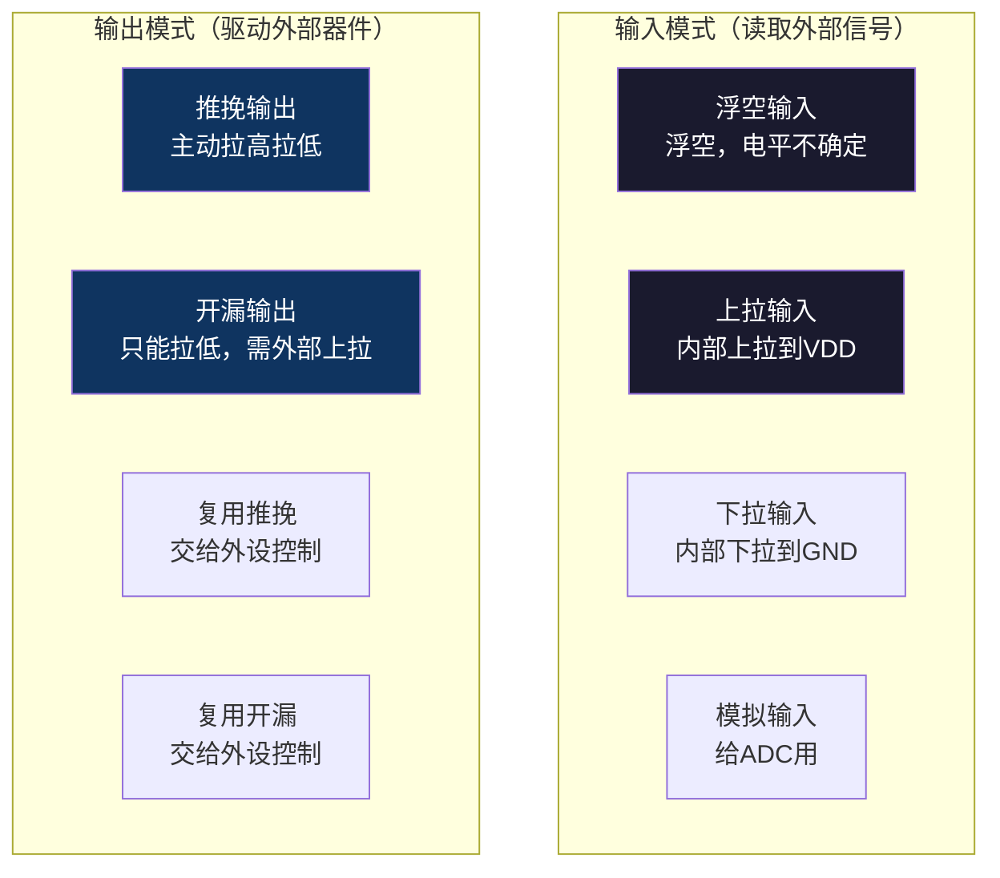
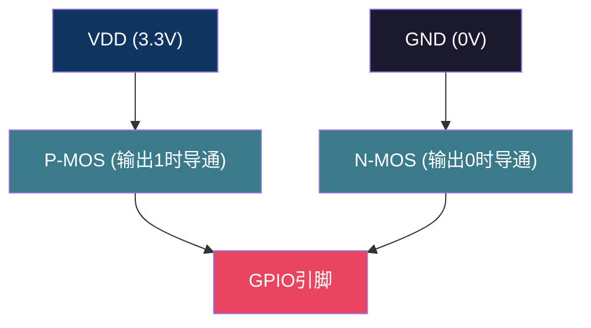
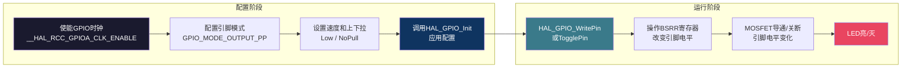

# 【炼气·26】点亮第一个LED：GPIO输出模式与HAL库点灯

> **码农修仙传 · 炼气期 · 第26篇**
> 我是玄芯散人，带你从炼气修到大乘。

---

## 境界标识

```
╔══════════════════════════════════════╗
║     炼气期 · 第26篇                    ║
║     点亮第一个LED                       ║
║     GPIO输出模式与HAL库点灯             ║
║     预计阅读：15分钟                    ║
╚══════════════════════════════════════╝
```

---

## 修仙引入

上一篇你搭好了开发环境，写了第一行STM32代码`HAL_GPIO_TogglePin`让LED闪烁。但你知道那行代码背后到底发生了什么吗？为什么配置PA5为输出模式就能让灯亮？推挽和开漏有什么区别？为什么有的LED要接上拉电阻？

这一篇带你搞懂GPIO。GPIO是General Purpose Input/Output的缩写，通用输入输出。它是STM32引脚与外部世界通信的方式。点灯是GPIO最简单的用法，但搞懂GPIO的输出模式，以后碰任何外设都能举一反三。

---

## 硬核主体

### GPIO是什么

STM32F103C8T6有48个引脚，其中大部分是GPIO。每个GPIO引脚可以独立配置成输入或输出，还可以配置成复用功能（比如UART的TX/RX）。引脚的配置通过寄存器来控制，但炼气期先用HAL库函数操作，寄存器后面元婴期再深入。

GPIO引脚可以想象成一根灵脉的端口。你可以往里面注入灵力（输出高电平），也可以从里面感知灵力（读取输入电平）。注不注入、怎么注入，由你配置的模式决定。

### GPIO的8种工作模式

STM32的GPIO有8种工作模式，先给你一个全局认识：



初学者点灯只需要关注两种：推挽输出和开漏输出。输入模式下一篇讲按键的时候再说，复用模式等碰串口和SPI的时候再展开。

### 推挽输出：能推能挽

推挽输出（Push-Pull）是点灯最常用的模式。推挽是什么意思？GPIO内部有两个MOSFET，一个P-MOS接VDD（正极），一个N-MOS接GND（地）。当输出高电平时，P-MOS导通，引脚被拉到VDD（3.3V）。当输出低电平时，N-MOS导通，引脚被拉到GND（0V）。

"推"就是P-MOS把电流推出去（拉高），"挽"就是N-MOS把电流挽回来（拉低）。两个MOSFET交替工作，不会同时导通。这种模式下，引脚既能输出高电平也能输出低电平，不需要外部上拉电阻。



点灯用推挽输出，因为LED接在引脚和GND之间（或者引脚和VDD之间），推挽模式可以直接驱动LED亮灭，不需要额外的上拉电阻。

### 开漏输出：只能拉低

开漏输出（Open-Drain）只使用N-MOS，没有P-MOS。输出低电平时N-MOS导通，引脚被拉到GND。但输出高电平时N-MOS关断，引脚既不是高也不是低，处于高阻态（浮空）。要让它输出高电平，必须外接一个上拉电阻到VDD。

这就像一扇门，推挽模式可以自己开也可以自己关。开漏模式只能自己关（拉低），要开门（拉高）得靠弹簧（上拉电阻）把门弹回来。

开漏输出有什么用？一是可以实现电平转换，比如STM32是3.3V逻辑，你要驱动一个5V的器件，用开漏模式加上拉到5V的电阻就行。二是可以实现线与，多个开漏引脚接在同一根线上，只要有一个输出低，整根线就是低。I2C总线就是用开漏模式实现的。

### 用HAL库点灯：实操

理论说完了，开始动手。假设你用STM32CubeIDE创建了一个工程，芯片选STM32F103C8T6，PA5配置为GPIO_Output（推挽输出）。

CubeMX生成的初始化代码在`Core/Src/main.c`里，函数名叫`MX_GPIO_Init`。这个函数帮你做了三件事：

一，使能GPIOA的时钟。STM32的每个外设都有独立的时钟开关，不使能时钟寄存器就不工作。CubeMX生成的代码会调用`__HAL_RCC_GPIOA_CLK_ENABLE()`来打开GPIOA的时钟。

二，配置PA5为推挽输出。CubeMX把引脚模式设为`GPIO_MODE_OUTPUT_PP`，这里的PP就是Push-Pull。

三，设置初始电平和速度。默认输出低电平，速度设为Low。

生成的初始化代码大概长这样：

```c
void MX_GPIO_Init(void)
{
    GPIO_InitTypeDef GPIO_InitStruct = {0};

    __HAL_RCC_GPIOA_CLK_ENABLE();    /* 使能GPIOA时钟 */

    GPIO_InitStruct.Pin = GPIO_PIN_5;              /* 选择PA5 */
    GPIO_InitStruct.Mode = GPIO_MODE_OUTPUT_PP;    /* 推挽输出 */
    GPIO_InitStruct.Pull = GPIO_NOPULL;            /* 无内部上下拉 */
    GPIO_InitStruct.Speed = GPIO_SPEED_FREQ_LOW;   /* 低速 */
    HAL_GPIO_Init(GPIOA, &GPIO_InitStruct);        /* 应用配置 */
}
```

初始化完成后，你就可以在main函数的while循环里操作PA5了。HAL库提供了两个常用函数：

```c
/* 设置引脚电平：GPIO_PIN_SET为高（灯亮），GPIO_PIN_RESET为低（灯灭） */
HAL_GPIO_WritePin(GPIOA, GPIO_PIN_5, GPIO_PIN_SET);
HAL_GPIO_WritePin(GPIOA, GPIO_PIN_5, GPIO_PIN_RESET);

/* 翻转引脚电平：亮的变灭，灭的变亮 */
HAL_GPIO_TogglePin(GPIOA, GPIO_PIN_5);

/* 读取引脚当前电平：返回GPIO_PIN_SET或GPIO_PIN_RESET */
GPIO_PinState state = HAL_GPIO_ReadPin(GPIOA, GPIO_PIN_5);
```

一个能跑的闪烁LED程序：

```c
/* USER CODE BEGIN WHILE */
while (1)
{
    HAL_GPIO_TogglePin(GPIOA, GPIO_PIN_5);   /* 翻转PA5电平 */
    HAL_Delay(500);                           /* 延时500ms */
    /* USER CODE END WHILE */
}
```

`HAL_Delay(500)`是HAL库提供的毫秒级延时函数，参数是毫秒。500就是0.5秒亮0.5秒灭，周期1秒。改参数可以调闪烁速度。

### HAL_GPIO_WritePin怎么工作的

`HAL_GPIO_WritePin`这个函数看着简单，它内部做了什么？它操作的是GPIO的ODR寄存器（Output Data Register，输出数据寄存器）。ODR是16位的，每位对应一个引脚。写1对应引脚输出高电平，写0对应引脚输出低电平。

但HAL库不直接写ODR，而是通过BSRR寄存器（Bit Set/Reset Register，位设置/清除寄存器）来操作。BSRR的好处是单次写操作只修改目标位，不需要"先读ODR再改再写回去"这种多步操作。多步操作如果在中间被中断打断，可能写入错误的数据。BSRR一次写完，不存在这个问题。

```c
/* HAL_GPIO_WritePin的简化逻辑 */
void HAL_GPIO_WritePin(GPIO_TypeDef *GPIOx, uint16_t GPIO_Pin, GPIO_PinState PinState)
{
    if (PinState == GPIO_PIN_SET) {
        GPIOx->BSRR = GPIO_Pin;       /* 置位：对应位写1 */
    } else {
        GPIOx->BSRR = (uint32_t)GPIO_Pin << 16;  /* 复位：对应位写1 */
    }
}
```

BSRR寄存器低16位控制置位（写1让引脚变高），高16位控制复位（写1让引脚变低）。写0的位无效果。这种设计让你只改目标位，不碰其他引脚。

这个寄存器细节在炼气期知道概念就行，不用背。等元婴期讲GPIO寄存器进阶内容时会展开每个位的含义。

### GPIO速度有什么用

CubeMX配置GPIO时有个Speed选项：Low、Medium、High。这个速度指的是输出信号的边沿斜率（slew rate），跟引脚翻转频率没直接关系。

低速的边沿缓，信号平滑，EMI（电磁干扰）小。高速的边沿陡，信号变化快，适合高频率通信。点灯用低速就够了。如果用SPI跑高波特率，就需要高速。

初学者记住：点灯用Low，串口用Low或Medium，SPI高速通信才用High。速度选高了不会出错，但会增加功耗和EMI。

### LED接线方式

Blue Pill板子的板载LED通常接在PC13上，而且是低电平点亮（阴极接引脚）。但很多教程和开发板也用PA5外接LED做示例。上一篇我们用PA5做配置演示，这里继续用PA5保持一致。如果你用的是Blue Pill板载LED，把代码里的GPIOA换成GPIOC，GPIO_PIN_5换成GPIO_PIN_13，电平也反过来（低电平亮）。

外部接LED时记得串一个限流电阻。LED的压降大约2V（红色）到3.2V（蓝色），STM32引脚输出3.3V，直接接LED会烧掉。限流电阻计算公式：R = (3.3 - Vled) / Iled。红色LED用1KΩ就够了。

### 点灯流程总览

配置阶段完成以后，整个流程：



配置是一次性的，初始化之后不用再配。运行阶段可以反复操作引脚电平，想闪就闪，想灭就灭。

### 寄存器点灯（只提不深入）

上一篇提到过寄存器直接点灯的代码：

```c
/* 使能GPIOA时钟 */
RCC->APB2ENR |= RCC_APB2ENR_IOPAEN;

/* 配置PA5为推挽输出，MODE=01表示10MHz输出 */
GPIOA->CRL &= ~(0xF << (5 * 4));
GPIOA->CRL |= (0x1 << (5 * 4));

/* PA5输出高电平，LED亮 */
GPIOA->ODR |= (1 << 5);
```

这段代码直接操作寄存器，不依赖HAL库。`CRL`寄存器控制引脚0到7的模式，每4位控制一个引脚。`MODE=01`对应10MHz输出模式。`ODR`寄存器的第5位控制PA5的电平。

寄存器操作的细节（CRL和CRH的位域定义、CNF和MODE的组合含义）留到元婴期第103篇讲GPIO寄存器时展开。炼气期知道"寄存器点灯存在，HAL库帮你封装了这些操作"就够了。

### 为什么不直接用寄存器

你可能会问，既然寄存器点灯这么直接，为什么还要用HAL库多一层封装？

一，可移植性。HAL库屏蔽了不同STM32系列之间的寄存器差异。你把F1换成F4，GPIO寄存器结构变了，但`HAL_GPIO_WritePin`的用法不变。直接操作寄存器就得改代码。

二，安全性。HAL库的BSRR操作是原子操作，不会因为中断打断导致引脚状态错误。手动操作ODR要自己注意原子性。

三，学习曲线。寄存器需要查手册、算位偏移，初学者容易出错。HAL库的函数名见名知意，参数类型安全，上手快。

等你到了元婴期，需要精细控制时序或者追求极致性能时，再直接操作寄存器。那时候你已经具备了读Datasheet的能力。

---

## 修仙术语对照表

| 修仙术语 | 技术现实 | 本篇位置 |
|----------|---------|---------|
| 灵脉端口 | GPIO引脚，与外部世界通信的通道 | GPIO是什么 |
| 注入灵力 | 输出高电平，引脚拉到VDD | 推挽输出 |
| 挽回灵力 | 输出低电平，引脚拉到GND | 推挽输出 |
| 推挽法 | Push-Pull输出模式，两个MOSFET交替工作 | 推挽输出 |
| 开漏法 | Open-Drain输出模式，只拉低不拉高 | 开漏输出 |
| 弹簧 | 上拉电阻，把浮空引脚拉回高电平 | 开漏输出 |
| 时钟开关 | RCC时钟使能，不打开外设不工作 | HAL库点灯 |
| 灵力输出口 | ODR输出数据寄存器，控制引脚电平 | WritePin原理 |
| 原子符咒 | BSRR寄存器，原子操作不改其他位 | WritePin原理 |
| 功法封装 | HAL库函数，屏蔽寄存器细节 | 为什么用HAL |
| 边沿斜率 | GPIO Speed，信号变化快慢 | GPIO速度 |
| 限流阵法 | 限流电阻，防止LED烧毁 | LED接线 |

---

## 突破条件

- [ ] 能说出GPIO的8种工作模式名称，至少能区分输入和输出
- [ ] 能解释推挽输出和开漏输出的区别，知道为什么开漏需要上拉电阻
- [ ] 能在CubeMX里把PA5配置为推挽输出并生成代码
- [ ] 能用HAL_GPIO_WritePin和HAL_GPIO_TogglePin控制LED亮灭和闪烁
- [ ] 知道HAL_GPIO_WritePin内部操作的是BSRR寄存器，不是直接写ODR
- [ ] 知道GPIO速度选项对应的是边沿斜率不是翻转频率
- [ ] 会计算LED限流电阻的阻值
- [ ] 知道寄存器点灯和HAL库点灯的关系，HAL封装了寄存器操作

> 下一篇讲串口。UART是嵌入式调试的利器，你写完了点灯程序，怎么知道代码跑对了？用串口打印调试信息是最直接的方法。

---

## 下期预告 + 互动

> 下一篇：【炼气·27】串口输出Hello World：UART入门
>
> 点灯是最原始的输出方式，亮灭只有两种状态。串口能让你看到更多内容，变量值和运行状态和错误信息都能打印出来。UART是嵌入式工程师最常用的调试手段，学会串口调试，你的修仙之路就开了一扇窗。

问你：

> 你第一次点灯成功是什么感觉？LED亮的那一刻有没有激动？
>
> 推挽和开漏你以前分得清吗？现在搞懂了吗？

> 我是玄芯散人，带你从炼气修到大乘。

---

*本文是「码农修仙传」系列第26篇。系列导航见 [xren.ren](https://xren.ren)*
