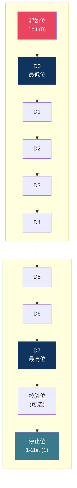
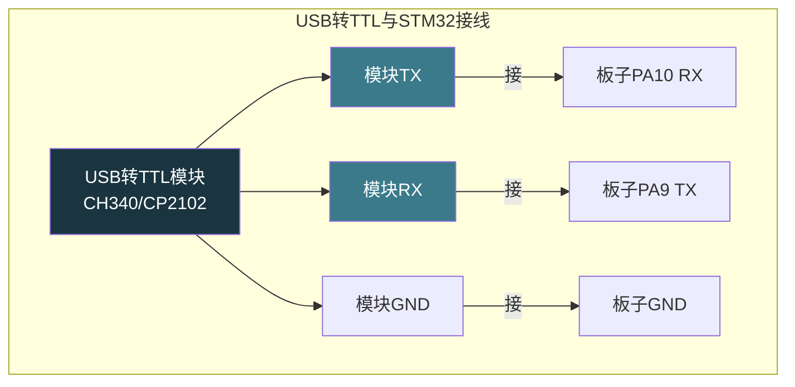
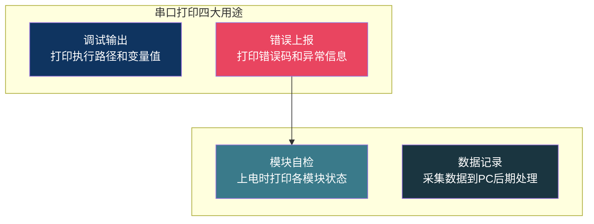

# 【炼气·27】串口输出Hello World：UART通信入门与printf重定向

> **码农修仙传 · 炼气期 · 第27篇**
> 我是玄芯散人，带你从炼气修到大乘。

---

## 境界标识

```
╔══════════════════════════════════════╗
║     炼气期 · 第27篇                    ║
║     串口输出Hello World               ║
║     UART通信入门与printf重定向         ║
║     预计阅读：16分钟                   ║
╚══════════════════════════════════════╝
```

---

## 修仙引入

修仙门派里，弟子入山门第一件事不是学功法，是领一块传音玉简。师兄弟之间靠玉简传话，写了什么字对方就看到什么字。单片机也有这么一块传音玉简，叫UART。你用一根线把数据一位一位送出去，电脑这边用串口助手接收，屏幕上就能看到文字。点灯是跟硬件打招呼，串口是跟硬件聊天。

---

## 硬核主体

### UART是什么

UART全称Universal Asynchronous Receiver/Transmitter，通用异步收发器。拆开三个词来看：

Universal，通用。不限定发送什么数据，字母也行数字也行二进制字节也行，UART不在乎内容含义，只负责搬运比特。

Asynchronous，异步。发送方和接收方之间没有时钟线。I2C和SPI都有单独的时钟线来同步节拍，UART没有。双方事先约定好一个速度（波特率），各按各的时钟走，只要速度一致就能对上。

Receiver/Transmitter，收发器。既能发也能收。TX是发送引脚，RX是接收引脚。两块芯片用UART通信，TX接RX，RX接TX，交叉接线。

STM32F103C8T6有3个USART，编号USART1到USART3。USART比UART多一个S，S代表Synchronous，USART支持同步模式但平时用异步模式居多。炼气期只讲异步，同步模式等以后碰SPI时再提。

### 串口通信的帧结构

UART一次发送一个字节的数据，但线上跑的不止8位。一个UART数据帧长这样：



空闲时TX线保持高电平。发送方拉低TX，接收方检测到下降沿就知道数据来了，这个低电平就是起始位。紧接着8个数据位，低位在前高位在后。然后可选一个校验位（奇校验或偶校验，炼气期不用校验）。最后停止位保持高电平，标志这一帧结束。

最常用的配置是8N1：8位数据，无校验（No parity），1位停止位。绝大多数嵌入式项目用这个配置。你看到串口助手里写115200, 8N1，意思就是波特率115200，8数据位，无校验，1停止位。

### 波特率怎么算

波特率指每秒传输的比特数。115200表示每秒115200个bit。一个8N1帧共10位（1起始+8数据+1停止），算下来每秒能传11520字节，约11KB/s。9600波特率每秒传960字节，约1KB/s。

为什么双方必须波特率一致？因为没有时钟线同步，接收方按约定的速度采样。发送方用115200的速度发，接收方用9600的速度收，采样位置全错位，读出来的数据全是乱的。你在串口助手里看到一堆乱码，十有八九是波特率没对上。

常见波特率有9600、19200、38400、57600和115200等几档。115200是嵌入式调试最常用的，速度快，短距离稳定。9600适合长距离或低速率传感器。怎么选？调试打印用115200，工业总线看设备要求。

### STM32的USART1引脚

STM32F103C8T6的USART1默认引脚是PA9（TX）和PA10（RX）。这两个引脚在板子的右上角附近，很多Blue Pill板子背面就有标注。

USART1接到PA9和PA10是默认配置，不需要改引脚。如果引脚冲突了，USART1可以换到PB6和PB7，但炼气期不用管引脚切换，默认引脚够用。

PA9和PA10输出的是TTL电平（0V到3.3V），不是RS232电平（±12V）。电脑的串口（如果有的话）是RS232电平，直接接会把芯片烧掉。现在笔记本基本没有DB9串口了，用的是USB转TTL模块。常见的芯片有CH340和CP2102，淘宝几块钱一个。模块的TX接板子RX，RX接板子TX，GND接GND。



记住一个口诀：TX接RX，RX接TX。同名不接，交叉相接。GND必须共地，不然信号没有参考电平。

### CubeMX配置USART1

打开STM32CubeMX，找到USART1，Mode选Asynchronous。下面的参数面板里：

Baud Rate填115200。Word Length选8 Bits（含校验位）。Parity选None。Stop Bits选1。这些对应8N1配置。

CubeMX会自动把PA9设为USART1_TX，PA10设为USART1_RX，模式是复用推挽（AF Push-Pull）。复用模式的意思是引脚交给USART外设控制，不再由GPIO模块管。上一篇讲GPIO时提到过复用推挽，现在用上了。

生成代码后，CubeMX会在`MX_USART1_UART_Init`里完成初始化：

```c
UART_HandleTypeDef huart1;

void MX_USART1_UART_Init(void)
{
    huart1.Instance = USART1;
    huart1.Init.BaudRate = 115200;              /* 波特率 */
    huart1.Init.WordLength = UART_WORDLENGTH_8B;/* 8位数据 */
    huart1.Init.StopBits = UART_STOPBITS_1;     /* 1位停止 */
    huart1.Init.Parity = UART_PARITY_NONE;      /* 无校验 */
    huart1.Init.Mode = UART_MODE_TX_RX;         /* 收发模式 */
    huart1.Init.HwFlowCtl = UART_HWCONTROL_NONE;/* 无硬件流控 */
    huart1.Init.OverSampling = UART_OVERSAMPLING_16; /* 16倍过采样 */
    HAL_UART_Init(&huart1);                     /* 应用配置 */
}
```

这个初始化函数帮你设置了波特率寄存器（BRR），选择了数据格式，使能了USART1的时钟。USART1挂在APB2总线上，最高速率72MHz。APB2总线时钟越高，波特率越准。其他USART可能挂在APB1上，最高36MHz，波特率范围会有差异。

### 用HAL_UART_Transmit发送数据

HAL库提供了发送函数`HAL_UART_Transmit`，原型是：

```c
HAL_StatusTypeDef HAL_UART_Transmit(
    UART_HandleTypeDef *huart,   /* 哪个USART */
    uint8_t *pData,              /* 数据指针 */
    uint16_t Size,               /* 数据长度 */
    uint32_t Timeout             /* 超时时间(ms) */
);
```

发一个"Hello"出去：

```c
uint8_t msg[] = "Hello, UART!\r\n";
HAL_UART_Transmit(&huart1, msg, sizeof(msg) - 1, 100);
/* sizeof算上\0, 发送时减1不算结束符 */
/* \r\n是回车换行, 串口助手会另起一行 */
```

`HAL_UART_Transmit`是阻塞发送。函数内部把数据一个字节一个字节塞进发送数据寄存器（TDR），每塞一个等发送完成标志（TXE）置位，再塞下一个。发完所有字节后返回。Timeout参数是最大等待时间，超过这个时间还没发完就返回超时错误。

阻塞发送简单直接，但发送期间CPU干等。发115200波特率下一个字节约87微秒，发12个字节约1毫秒，对实时性要求不高的地方没问题。等到了金丹期讲并发时，你会知道怎么用中断或DMA方式让CPU不等。

### printf重定向：让printf输出到串口

每次用`HAL_UART_Transmit`发字符串太麻烦了，能不能直接用`printf`？C标准库的`printf`默认输出到屏幕，嵌入式没有屏幕，但可以重定向到串口。

原理是C标准库的`printf`最终调用`fputc`把字符输出。你重写`fputc`，让它把字符通过UART发出去，printf就往串口打印了。

用GCC工具链（STM32CubeIDE）时需要重写`__io_putchar`：

```c
/* 重定向printf到USART1 */
int __io_putchar(int ch)
{
    HAL_UART_Transmit(&huart1, (uint8_t *)&ch, 1, 100);
    return ch;
}
```

如果用Keil MDK，标准库不一样，重写的函数名是`fputc`：

```c
/* Keil下重定向printf */
int fputc(int ch, FILE *f)
{
    HAL_UART_Transmit(&huart1, (uint8_t *)&ch, 1, 100);
    return ch;
}
```

两个函数做的事一样，只是编译器不同函数名不同。CubeIDE用GCC，用`__io_putchar`。Keil用ARMCC，用`fputc`。

重写后还要在工程里勾选Use MicroLIB（Keil）或在链接选项里加`-u _printf_float`（CubeIDE）来支持浮点数打印。否则`printf("%.2f", 3.14)`可能打印不出正确结果。

一个能跑的Hello World：

```c
/* main.c */
#include <stdio.h>

int __io_putchar(int ch)
{
    HAL_UART_Transmit(&huart1, (uint8_t *)&ch, 1, 100);
    return ch;
}

int main(void)
{
    HAL_Init();
    SystemClock_Config();
    MX_GPIO_Init();
    MX_USART1_UART_Init();

    printf("Hello, 码农修仙传!\r\n");
    printf("USART1 init done, baud=115200\r\n");

    uint8_t count = 0;
    while (1)
    {
        printf("loop count: %d\r\n", count++);
        HAL_Delay(1000);
    }
}
```

烧录后打开串口助手，选对COM口和115200波特率，就能看到每秒打印一行计数。恭喜，你的单片机会说话了。

### 串口调试助手怎么选

电脑端需要一个串口终端来收发数据。Windows下常用的是：

Tera Term，免费开源，界面老旧但稳定，支持宏脚本。

SSCOM（丁丁串口助手），国内嵌入式圈用得最多，轻量，支持多串口。

PuTTY，功能全，SSH和串口都支持，但串口配置不如专业工具方便。

macOS和Linux下用screen或minicom命令行工具。`screen /dev/tty.usbserial-XXXX 115200`就能连上。VS Code也有串口插件，装一个Serial Monitor扩展就行。

选哪个看习惯。炼气期用SSCOM或Tera Term足够了，不要在工具选择上纠结太久。

### 串口打印的用途

串口打印不只是输出Hello World。它在实际开发中有几个用途：

调试信息输出。代码跑到哪一步，进入哪个分支，变量值多少，用printf打印出来，比单步调试快得多。尤其在中断函数里，断点不好打，printf加时间戳是最快的定位手段。

错误码上报。函数返回错误码，直接printf打出来，不用每次单步看返回值。实际项目里通常会做一个日志分级（DEBUG/INFO/WARN/ERROR），按级别开关打印。

模块自检。上电时把各外设初始化状态打印出来，一目了然哪个模块挂了。比如`printf("Flash init: OK\r\n")`，`printf("SPI init: FAIL, code=%d\r\n", err)`。

数据记录。ADC采样值、传感器读数，用串口打到电脑，在串口助手里保存成文件，后期用Excel或Python画图处理。比在板子上接LCD显示方便太多。



### 调试打印的两个坑

第一个坑：printf在中断里别用。中断函数要求快进快出，printf内部可能执行几十微秒甚至几百微秒（取决于字符串长度和波特率），在中断里调用会阻塞其他中断。如果非要在中断里输出调试信息，先把数据存进缓冲区，等出了中断再打印。

第二个坑：printf不支持浮点数。默认情况下STM32的MicroLIB或newlib-nano不链接浮点格式化代码。你想`printf("%.2f\r\n", 3.14)`，打出来可能是空的或者乱码。CubeIDE里需要在工程选项里勾选"Use float with printf from newlib-nano"，或者链接时加`-u _printf_float`。Keil里勾选MicroLib后基本能用，但如果不行就在代码里把浮点数乘以100转成整数打印。

### TTL和RS232的区别

前面提过PA9输出的是TTL电平（0V到3.3V）。工业环境里用的RS232电平是±3V到±15V，逻辑0是+3V到+15V，逻辑1是-3V到-15V。电平反相，电压范围差很大。

TTL适合板间短距离通信（几十厘米内）。RS232适合设备间较长距离通信（15米以内）。如果你的板子要接工业设备的RS232接口，中间加一个MAX3232芯片做电平转换。MAX3232一边接STM32的TX/RX（TTL），另一边输出RS232电平，接DB9接口。

还有RS485，用差分信号传输，距离可达1200米，工业总线用得多。这些炼气期知道有这回事就行，不用深究。等元婴期讲通信总线实战时会展开。

---

## 修仙术语对照表

| 修仙术语 | 技术现实 | 本篇位置 |
|----------|---------|---------|
| 传音玉简 | UART串口通信，芯片与PC交换文字信息 | 修仙引入 |
| 异步传音 | 异步通信，无时钟线，靠约定波特率对拍 | UART是什么 |
| 传音符 | USART外设，硬件上收发数据的模块 | UART是什么 |
| 发符引脚 | TX发送引脚，数据从这里出去 | UART是什么 |
| 收符引脚 | RX接收引脚，数据从这里进来 | UART是什么 |
| 符文格式 | 数据帧结构，起始位+数据位+停止位 | 帧结构 |
| 传音速率 | 波特率，每秒传输的比特数 | 波特率 |
| 灵脉通道 | PA9和PA10引脚，USART1的默认引脚 | USART1引脚 |
| 复用通道 | 复用推挽模式，引脚交给外设控制 | CubeMX配置 |
| 灵脉接驳 | USB转TTL模块接线，TX接RX交叉相接 | USART1引脚 |
| 功法重定向 | printf重定向，重写fputc或__io_putchar | printf重定向 |
| 传讯阵 | 串口调试助手，PC端收发串口数据 | 调试助手 |
| 灵压转换 | TTL与RS232电平转换，MAX3232芯片 | TTL和RS232 |

---

## 进阶条件

- [ ] 能说出UART异步通信的含义，知道为什么需要约定波特率
- [ ] 能画出UART数据帧结构，知道起始位和停止位各自干什么
- [ ] 能在CubeMX里配置USART1为Asynchronous模式，设115200/8N1
- [ ] 能用HAL_UART_Transmit发送字符串并在串口助手中收到
- [ ] 能重写__io_putchar或fputc让printf输出到串口
- [ ] 知道TX接RX交叉接线，GND必须共地
- [ ] 知道TTL电平和RS232电平的区别，什么时候需要MAX3232
- [ ] 知道printf在中断里别用的原因

> 下一篇讲按键输入。你学会了输出信息，但还没有输入手段。按键是最简单的输入方式，按一下芯片就知道你想干什么了。轮询和中断两种检测方式怎么选，消抖为什么不可省，下一篇讲清楚。

---

## 下期预告 + 互动

> 下一篇：【炼气·28】按键输入：中断和轮询怎么选
>
> 串口让芯片会说话了，但还不会听话。按键就是芯片的耳朵，按下去芯片就知道你要下指令。轮询方式简单但浪费CPU，中断方式快但有陷阱。机械按键有抖动，不消抖就会误触发。消抖用硬件还是用软件，各有讲究。下一篇把这些讲透。

问你：

> 你第一次用串口看到单片机打印的文字是什么感觉？是不是觉得芯片突然活了？
>
> 你遇到过串口乱码吗？最后发现是什么原因？波特率？接线？还是初始化顺序？

> 我是玄芯散人，带你从炼气修到大乘。

---

*本文是「码农修仙传」系列第27篇。系列导航见 [xren.ren](https://xren.ren)*
