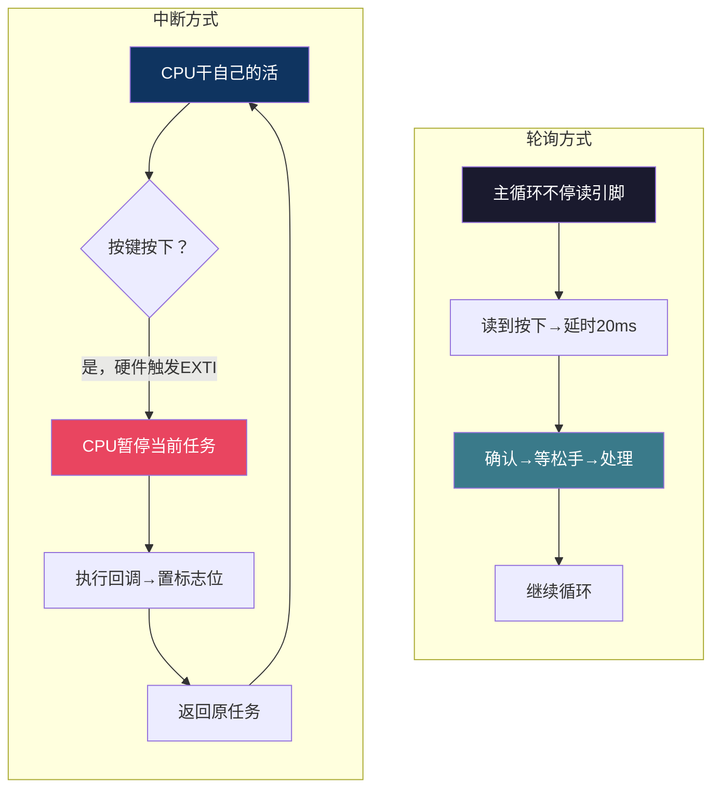

# 【炼气·28】按键输入：中断和轮询，STM32怎么响应你的手指

> **码农修仙传 · 炼气期 · 第28篇**
> 我是玄芯散人，带你从炼气修到大乘。

---

## 境界标识

```
╔══════════════════════════════════════╗
║     炼气期 · 第28篇                    ║
║     按键输入：中断和轮询               ║
║     STM32怎么响应你的手指              ║
║     预计阅读：16分钟                   ║
╚══════════════════════════════════════╝
```

---

## 修仙引入

前两篇你学会了用GPIO输出点灯，又用UART把文字打到电脑上。这两件事都是单片机往外送东西。现在反过来，让单片机收东西。最简单的输入设备就是按键，按一下灯亮，再按一下灯灭。看起来特别简单，但按键背后藏着一个坑，叫抖动。你按下去的那一瞬间，触点会弹跳几十次，单片机以为你按了几十下。怎么处理这个抖动，怎么让单片机及时响应你的操作，就是这篇的主题。

---

## 硬核主体

### 按键的硬件原理

按键就是一个开关。按下接通，松开断开。接通和断开的那一刻，金属触点会弹跳，一般在5ms到20ms之间反复通断好几次才稳定下来。

拿示波器抓一个按键的波形，你会看到按下的那瞬间，信号在高电平和低电平之间快速跳了好几次，然后才稳定在低电平。松手的时候也是一样，弹跳几下才稳定在高电平。这个现象叫机械抖动，所有机械按键都有，不管你用多贵的开关。

如果不处理抖动，单片机会在一次按下期间检测到多次跳变。你按一次，程序以为你按了十几次，灯就闪了好几下，最后停在什么状态全看运气。

### 消抖的三种思路

处理抖动有硬件消抖和软件消抖两条路。硬件消抖用一个RC滤波电路加施密特触发器，把弹跳的毛刺滤掉。软件消抖更常用，成本低，改代码就行。这里只讲软件消抖。

软件消抖最直接的办法：检测到按键按下后，等20ms再读一次。如果还是按下的状态，确认是真按下了。如果已经松开，说明是抖动，忽略。

另一种思路是记录每次检测到电平变化的时间戳，两次变化间隔超过20ms才算一次真实的按下。这种方式不阻塞，适合放在主循环里。

还有一种是状态机消抖法，把按键状态分成几档：空闲，按下消抖中，已按下，松开消抖中。每档设定时器计时，超时才切换状态。这种做法最稳，适合稍大一点的项目。

### 轮询方式：最简单的读取

轮询就是主循环里不停读引脚电平。读到了按下就处理，没按下就跳过。

先看硬件接法。按键一端接PA0，另一端接GND。PA0配置成上拉输入模式（GPIO_MODE_INPUT加上GPIO_PULLUP）。这样按键没按下时，PA0被内部上拉电阻拉到3.3V，读到高电平。按下时PA0接到GND，读到低电平。

CubeMX里的配置：点PA0，选GPIO_Input，然后在GPIO模式下拉选Pull-up。生成代码后`MX_GPIO_Init`里会自动配好。

轮询读取按键的代码：

```c
/* PA0配置为上拉输入，按下时读到低电平 */

/* 简单轮询+消抖 */
uint8_t KeyPressed(void)
{
    if (HAL_GPIO_ReadPin(GPIOA, GPIO_PIN_0) == GPIO_PIN_RESET) {
        /* 检测到低电平，可能按下了 */
        HAL_Delay(20);                          /* 等20ms消抖 */
        if (HAL_GPIO_ReadPin(GPIOA, GPIO_PIN_0) == GPIO_PIN_RESET) {
            /* 还是低电平，确认按下 */
            while (HAL_GPIO_ReadPin(GPIOA, GPIO_PIN_0) == GPIO_PIN_RESET)
                ;  /* 等松手，防止一直按住重复触发 */
            return 1;  /* 返回按键事件 */
        }
    }
    return 0;  /* 没按下 */
}

/* 主循环 */
while (1)
{
    if (KeyPressed()) {
        HAL_GPIO_TogglePin(GPIOA, GPIO_PIN_5);  /* 翻转LED */
    }
}
```

这段代码有三个要点。第一，读到低电平后延时20ms再确认，过滤掉抖动。第二，等松手才返回，保证按一次只触发一次。第三，`HAL_GPIO_ReadPin`读取引脚电平，返回`GPIO_PIN_SET`（高）或`GPIO_PIN_RESET`（低）。

轮询的优点是简单，几行代码就搞定。缺点是`HAL_Delay(20)`把CPU卡住了，这20ms里CPU什么都干不了。等松手那个`while`循环更狠，你按住不放，CPU就一直在那等。

对于点灯这种只有一个任务的项目，轮询完全够用。但如果你还要同时跑串口收发或者传感器采集，轮询就力不从心了。

### 中断方式：按下就来通知

中断的思路不一样。CPU不用一直盯着引脚，按键按下的一瞬间，硬件会发一个信号告诉CPU，CPU放下手头的事去处理按键，处理完回来继续干原来的活。

STM32F103的外部中断叫EXTI，External Interrupt。每个GPIO引脚都可以配置成EXTI中断源，但有个限制：同一编号的引脚共用一条EXTI线。PA0、PB0和PC0都对应到EXTI0，同一时刻只能选一个。EXTI1对应PA1或PB1或PC1，以此类推到EXTI15。如果你PA0已经用了EXTI0，PB0就不能同时用EXTI中断。

CubeMX里配置EXTI中断的步骤：

一，点PA0选GPIO_EXTI0。二，在GPIO模式里选`External Interrupt Mode with Falling edge trigger detection`，下降沿触发。因为按键按下时电平从高变低，下降沿就是按下的瞬间。三，选上拉（Pull-up）。四，在NVIC Settings里勾选`EXTI0_IRQn`使能中断。

生成代码后，CubeMX会帮你做好三件事。使能EXTI0时钟，配置PA0为下降沿中断输入，在NVIC里使能EXTI0中断线。你只需要写中断处理函数就行。

HAL库的中断处理流程是这样的。EXTI0中断触发后，硬件跳到`EXTI0_IRQHandler`，这个函数在`stm32f1xx_it.c`里。它调用`HAL_GPIO_EXTI_IRQHandler(GPIO_PIN_0)`，这个HAL函数清除中断标志位，然后调用`HAL_GPIO_EXTI_Callback`。你需要重写这个回调函数：

```c
/* 重写HAL库的弱定义回调函数 */
void HAL_GPIO_EXTI_Callback(uint16_t GPIO_Pin)
{
    if (GPIO_Pin == GPIO_PIN_0) {
        HAL_GPIO_TogglePin(GPIOA, GPIO_PIN_5);  /* 翻转LED */
    }
}
```

这个回调函数在EXTI0中断的上下文里执行。中断里不能做耗时操作，不能用`HAL_Delay`，因为SysTick的中断优先级可能比EXTI0低，延时函数赖以工作的滴答定时器中断进不来，`HAL_Delay`就永远等不到时间。中断里只做简单操作，翻个引脚电平、置个标志位就行。

中断方式按一次LED翻转一次，但抖动问题没处理。按下瞬间的弹跳会产生多个下降沿，每个下降沿都触发一次中断，LED可能翻转好几下。怎么在中断方式下消抖？最常用的办法是中断里只置一个标志位，主循环里读标志位再延时消抖处理。

```c
volatile uint8_t key_flag = 0;   /* 中断和主循环都会访问，必须加volatile */

void HAL_GPIO_EXTI_Callback(uint16_t GPIO_Pin)
{
    if (GPIO_Pin == GPIO_PIN_0) {
        key_flag = 1;            /* 只置标志，不做事 */
    }
}

/* 主循环里处理 */
while (1)
{
    if (key_flag) {
        key_flag = 0;
        HAL_Delay(20);           /* 消抖延时放在主循环，不阻塞中断 */
        if (HAL_GPIO_ReadPin(GPIOA, GPIO_PIN_0) == GPIO_PIN_RESET) {
            HAL_GPIO_TogglePin(GPIOA, GPIO_PIN_5);
        }
    }
    /* 这里可以干其他事 */
}
```

`volatile`告诉编译器，这个变量会被中断修改，不要把它放到寄存器里缓存，每次都从内存重新读。漏加volatile是嵌入式新手最常见的坑，调试时现象很诡异：加-O2选项就出问题，-O0就正常，因为编译器把key_flag缓存了。

### 轮询和中断怎么选



轮询适合简单情况。只有一个按键，主循环没有别的任务要跑，轮询代码少，调试方便。

中断适合需要同时做多件事的时候。比如你一边用串口接收数据，一边等按键，一边还要定时采样ADC。如果用轮询，延时消抖的20ms里串口可能丢字节。用中断，按键事件不会阻塞串口接收。

实际项目里，按键用中断加标志位的方式最常见。中断只负责通知，消抖和业务逻辑放在主循环处理。这样既不丢事件，也不耽误其他任务执行。

### 按键接法的两种方式

上面用的是低电平有效接法：按键一端接引脚，一端接GND，引脚配上拉。没按下时高电平，按下时低电平。这种方式好处是不需要外部电阻，用STM32内部上拉就行。

另一种是高电平有效接法：按键一端接引脚，一端接VDD，引脚配下拉。没按下时低电平，按下时高电平。STM32F103的GPIO大部分都有内部下拉，但PC13到PC15这几个引脚比较特殊，内部下拉可能没有或不稳定，用之前查手册确认。

两种接法功能一样，选哪种看个人习惯和硬件设计。Blue Pill板子上的按键多数用低电平有效，配上拉接GND。

### 按键长按和短按

有时候你需要区分长按和短按。比如短按切换LED，长按进入配置模式。思路很简单：检测到按下后开始计时，松手时看计了多久。超过1秒算长按，不到算短按。

```c
uint16_t press_time = 0;

while (1)
{
    if (HAL_GPIO_ReadPin(GPIOA, GPIO_PIN_0) == GPIO_PIN_RESET) {
        /* 按下了，开始计时 */
        press_time = 0;
        while (HAL_GPIO_ReadPin(GPIOA, GPIO_PIN_0) == GPIO_PIN_RESET) {
            HAL_Delay(10);
            press_time++;
        }
        /* 松手了，判断时长 */
        if (press_time > 100) {
            /* 长按，超过1秒（100×10ms） */
            /* 进入配置模式 */
        } else {
            /* 短按 */
            HAL_GPIO_TogglePin(GPIOA, GPIO_PIN_5);
        }
    }
}
```

这段代码用轮询方式计时，`HAL_Delay(10)`每次10ms，循环100次就是1秒。实际项目里更精确的做法是用定时器中断计时，但炼气期先用这个简单方案。

---

## 修仙术语对照表

| 修仙术语 | 技术现实 | 本篇位置 |
|----------|---------|---------|
| 触碰灵脉 | 按键按下，触发引脚电平变化 | 按键硬件原理 |
| 弹指抖动 | 机械抖动，触点弹跳5-20ms | 按键硬件原理 |
| 静心咒 | 软件消抖，延时20ms再确认 | 消抖思路 |
| 巡视法 | 轮询，主循环不停读引脚 | 轮询方式 |
| 传音符 | EXTI外部中断，硬件触发通知CPU | 中断方式 |
| 护法标记 | volatile，防止编译器缓存变量 | 中断方式 |
| 传音信使 | HAL_GPIO_EXTI_Callback回调函数 | 中断方式 |
| 驻留修炼 | 等松手循环，防止重复触发 | 轮询方式 |
| 长时修炼 | 长按检测，计时判断按下时长 | 长按短按 |
| 上拉护盾 | 内部上拉电阻，引脚默认高电平 | 接法 |
| 下拉锁 | 内部下拉电阻，引脚默认低电平 | 接法 |
| 外门弟子传话 | 中断标志位，通知主循环处理 | 中断消抖 |

---

## 进阶条件

- [ ] 能解释机械抖动是什么，为什么按键需要消抖
- [ ] 能用轮询方式读取按键并在代码中实现20ms消抖
- [ ] 能在CubeMX中配置PA0为EXTI0外部中断，下降沿触发
- [ ] 能重写HAL_GPIO_EXTI_Callback函数处理按键中断
- [ ] 知道volatile干什么用，能解释不加会出什么问题
- [ ] 能说出轮询和中断各自的优缺点及什么时候用哪个
- [ ] 能实现按键长按和短按的区分逻辑

> 下一篇讲定时器。前面你用HAL_Delay做延时和消抖，但这个延时函数不准，而且会卡住CPU。定时器能让你精确控制时间，还能用中断方式闪烁LED，CPU完全不被阻塞。

---

## 下期预告 + 互动

> 下一篇：【炼气·29】定时器闪烁LED：精确延时
>
> HAL_Delay的延时精度依赖SysTick滴答定时器，但它是毫秒级的，而且延时期间CPU干不了别的。定时器是STM32内部的硬件模块，能精确到微秒，还能配置成中断模式自动触发，不用CPU盯着。学会定时器，你的LED闪烁才能又准又省电。

问你：

> 你写按键程序的时候有没有遇到过按一下触发好几次的问题？是怎么解决的？
>
> 轮询和中断你更习惯用哪种？有没有在什么情况下被坑过？

> 我是玄芯散人，带你从炼气修到大乘。

---

*本文是「码农修仙传」系列第28篇。系列导航见 [xren.ren](https://xren.ren)*
