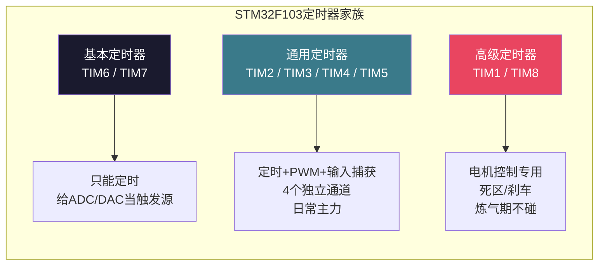
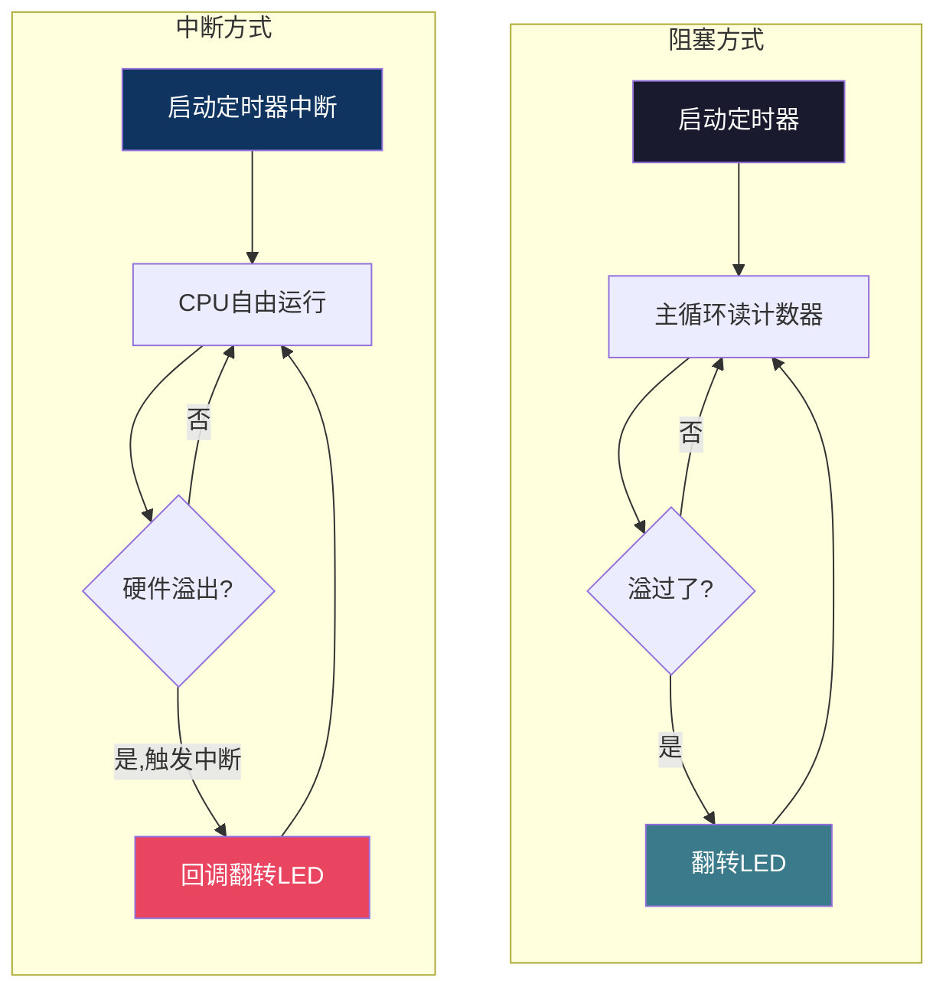

# 【炼气·29】定时器闪烁LED：精确延时，STM32硬件计时器入门

> **码农修仙传 · 炼气期 · 第29篇**
> 我是玄芯散人，带你从炼气修到大乘。

---

## 境界标识

```
╔══════════════════════════════════════╗
║     炼气期 · 第29篇                    ║
║     定时器闪烁LED：精确延时            ║
║     STM32硬件计时器入门                ║
║     预计阅读：15分钟                   ║
╚══════════════════════════════════════╝
```

---

## 修仙引入

上一篇你用按键控制LED，代码里到处是HAL_Delay。延时消抖要20ms，长按检测要10ms一次循环，闪烁LED就HAL_Delay(500)翻一下电平。用起来挺方便，但有个问题你迟早会遇到：延时期间CPU完全卡死，什么都干不了。更要命的是，HAL_Delay的精度有限，说好延时1秒，实际可能差几毫秒甚至更多。修仙之人不能光靠憋气计时，得有法宝。STM32内部自带定时器，这是硬件级别的计时工具，精度到微秒，还能用中断方式工作，CPU完全不被阻塞。这一篇就讲怎么用定时器精确闪烁LED。

---

## 硬核主体

### HAL_Delay靠什么计时

先搞清楚HAL_Delay的原理。HAL_Delay不是凭空等待，它依赖一个叫SysTick的硬件定时器。SysTick是Cortex-M3内核自带的一个24位递减计数器，集成在CPU内核里，不属于STM32的外设。HAL库在初始化时把SysTick配置成每1ms触发一次中断，每次中断里把一个全局变量uwTick加1。HAL_Delay(500)的实现就是循环检查uwTick有没有增加500，到了就返回。

这个机制能用，但有两个毛病。

第一，精度受限。SysTick的时钟源可以选HCLK或者HCLK除8。如果HCLK是72MHz，选HCLK/8就是9MHz，重装载值设9000减1，刚好1ms触发一次中断。但中断响应有延迟，如果当时CPU在处理更高优先级的中断，SysTick中断进不来，uwTick的更新就晚了几拍。累加500次，误差就放大了。

第二，阻塞。HAL_Delay(500)在500ms内CPU一直在死循环检查uwTick，什么都干不了。你要同时闪烁LED又接收串口数据？用HAL_Delay就做不到。

### STM32的定时器家族

SysTick只是个内核滴答定时器，功能单一。STM32还有一堆更强大的外设定时器，按功能分三档。

基本定时器：TIM6和TIM7。功能最少，只能定时，没有通道，不能输出PWM。一般用来给DAC或者ADC当触发源。炼气期用不上。

通用定时器：TIM2到TIM5。这是你日常用的主力。16位计数器，支持自动重装载，有4个独立通道，能做PWM输出和输入捕获。闪烁LED用通用定时器就够了。

高级定时器：TIM1和TIM8。功能最全，在通用定时器基础上加了死区时间控制、刹车输入这些电机控制专用功能。炼气期不碰。



### 定时器的两个参数：PSC和ARR

用定时器计时，你得告诉它两件事：数多快，数到多少。这两个参数对应两个寄存器。

PSC，预分频寄存器。定时器的时钟源频率很高，F103里通用定时器挂APB1总线上。APB1总线频率36MHz，但STM32有个规定：当APB1分频系数不是1时，定时器时钟自动翻倍。所以APB1=36MHz，定时器时钟实际是72MHz。72MHz太快了，每秒计数7200万次，16位计数器最多数65535，不到1毫秒就溢出。PSC就是把输入时钟分频，降低计数速度。PSC=7199，72MHz除以7200等于10kHz，每0.1ms计一次数。

ARR，自动重装载寄存器。计数器从0数到ARR的值，然后溢出，触发更新事件，再从0开始数。ARR=9999，计数器数10000次溢出一次。配合PSC=7199，溢出周期等于10000乘0.1ms等于1000ms，刚好1秒。

公式记一下：溢出周期 = (ARR+1) × (PSC+1) / 定时器时钟频率。F103通用定时器时钟72MHz，所以溢出周期 = (ARR+1) × (PSC+1) / 72000000，单位秒。

举例，要500ms中断一次：PSC=7199，时钟分频到10kHz，ARR=4999，数5000次溢出，5000乘0.1ms等于500ms。

### CubeMX配置定时器

打开CubeMX，左边选Timers再选TIM3。Clock Source选Internal Clock，表示用内部时钟驱动。Channel1到Channel4先都不用，我们只用定时器的中断功能，不输出波形。

下面的Parameter Settings里配置：

Counter Settings的Prescaler即PSC填7199。Counter Settings的Counter Period即ARR填4999。其余保持默认。这样配置后TIM3每500ms溢出一次。

然后到NVIC Settings，勾选TIM3 global interrupt，使能定时器中断。

生成代码，CubeMX会帮你初始化TIM3。初始化代码在MX_TIM3_Init里，主要是设置PSC和ARR的值，然后清标志位。你需要手动做两件事：启动定时器，和写中断回调函数。

### 方式一：阻塞方式闪烁LED

先看一个不用中断的方式。HAL库提供了纯计数模式的启动函数`HAL_TIM_Base_Start`，启动定时器后，用`__HAL_TIM_GET_COUNTER`读计数器值，判断时间到了没有。

```c
/* TIM3已由CubeMX初始化，PSC=7199, ARR=4999 */
/* 每500ms计数器溢出一次 */

HAL_TIM_Base_Start(&htim3);  /* 启动定时器 */

uint32_t last_tick = 0;
while (1)
{
    uint32_t current = __HAL_TIM_GET_COUNTER(&htim3);
    if (current < last_tick) {
        /* 计数器从大变小，说明溢出了，时间到了 */
        HAL_GPIO_TogglePin(GPIOA, GPIO_PIN_5);  /* 翻转LED */
    }
    last_tick = current;
    /* 这里可以干别的事 */
}
```

这种方式比HAL_Delay好在哪？检查计数器的操作很快，CPU不用死等500ms。但判断溢出靠主循环不断查，如果主循环里有耗时操作，可能错过溢出事件，导致闪烁不均匀。对于简单的闪烁LED没问题，要求高一点就不行。

### 方式二：中断方式闪烁LED

中断方式才是定时器的正确打开方式。定时器溢出时硬件自动触发中断，CPU收到中断信号后暂停当前任务，跳去执行回调函数，处理完再回来。整个过程CPU几乎不浪费时间。

```c
/* 启动定时器中断模式 */
HAL_TIM_Base_Start_IT(&htim3);  /* 启动定时器并使能更新中断 */

/* 重写HAL库的弱定义回调函数 */
void HAL_TIM_PeriodElapsedCallback(TIM_HandleTypeDef *htim)
{
    if (htim->Instance == TIM3) {
        HAL_GPIO_TogglePin(GPIOA, GPIO_PIN_5);  /* 每500ms翻转LED */
    }
}

/* 主循环完全空闲，可以干其他事 */
while (1)
{
    /* 这里可以跑串口收发、传感器采集等 */
}
```

`HAL_TIM_Base_Start_IT`做了两件事：启动定时器计数，使能更新中断。定时器数到ARR溢出时触发TIM3中断，硬件跳转到`TIM3_IRQHandler`，这个函数在stm32f1xx_it.c里。它调用`HAL_TIM_IRQHandler(&htim3)`，HAL库在里面清除中断标志位，然后调用`HAL_TIM_PeriodElapsedCallback`。你只需要重写这个回调函数，在里面做对应的LED翻转就行。

回调函数里判断`htim->Instance == TIM3`是因为如果你同时用了多个定时器，它们都会调用同一个回调函数，靠这个判断是哪个定时器触发的。

中断方式的好处很明显：CPU在500ms间隔里完全自由，可以处理其他任务。闪烁的精度只取决于定时器时钟，72MHz晶体振荡器驱动，精度远高于HAL_Delay。

### 两种方式对比



阻塞方式代码直观，适合学习理解定时器的工作原理。实际项目几乎都用中断方式，因为不占CPU时间。

还有一点要说，如果你想改闪烁频率，改ARR就行。ARR=9999就是1秒翻转一次，ARR=2499就是250ms翻转一次。不用重新生成CubeMX代码，在代码里直接改：

```c
__HAL_TIM_SET_AUTORELOAD(&htim3, 9999);  /* 动态修改ARR，闪烁周期变为1秒 */
```

这个函数直接改ARR寄存器，下次溢出就按新值计数。灵活调整闪烁速度不用停定时器。

### HAL_Delay什么时候还能用

不是说学了定时器就不用HAL_Delay了。简单情况下HAL_Delay完全够用，代码简单，不需要配置定时器。消抖延时20ms、上电等电源稳定100ms，这种一次性短延时用HAL_Delay没毛病。

需要长时间精确定时，或者延时期间还要干别的事，才需要上定时器。按键长按检测用HAL_Delay可以，但如果你要同时闪烁状态指示灯又检测按键，就得用定时器中断了。

---

## 修仙术语对照表

| 修仙术语 | 技术现实 | 本篇位置 |
|----------|---------|---------|
| 修心跳 | 定时器，硬件计时模块 | 定时器家族 |
| 呼吸法 | SysTick滴答，每1ms一次中断 | HAL_Delay原理 |
| 静坐 | 阻塞延时，CPU死等 | HAL_Delay原理 |
| 灵脉流速 | 定时器时钟频率，72MHz | PSC和ARR |
| 分流闸门 | PSC预分频寄存器，降低计数速度 | PSC和ARR |
| 周天数 | ARR自动重装载值，数到多少溢出 | PSC和ARR |
| 功法运转 | 计数器从0数到ARR循环计数 | PSC和ARR |
| 灵息间隔 | 溢出周期，两次中断的时间间隔 | PSC和ARR |
| 神识外放 | 非阻塞中断方式，CPU不卡死 | 中断方式 |
| 传音玉简 | HAL_TIM_PeriodElapsedCallback回调函数 | 中断方式 |
| 巡脉 | 主循环读计数器判断溢出 | 阻塞方式 |
| 调息 | 动态修改ARR调整闪烁频率 | 两种方式对比 |

---

## 进阶条件

- [ ] 能解释HAL_Delay的工作原理，说出它为什么不准和为什么阻塞
- [ ] 能说出STM32F103通用定时器的时钟频率是72MHz，并解释为什么APB1=36MHz但定时器时钟是72MHz
- [ ] 能用公式计算溢出周期：(ARR+1)×(PSC+1)/定时器时钟
- [ ] 能在CubeMX中配置TIM3的PSC和ARR使中断周期为500ms
- [ ] 能用HAL_TIM_Base_Start_IT启动定时器中断并重写HAL_TIM_PeriodElapsedCallback回调
- [ ] 能用__HAL_TIM_SET_AUTORELOAD动态修改闪烁频率
- [ ] 知道什么时候用HAL_Delay，什么时候必须上定时器

> 下一篇是炼气期毕业项目：做一个温度显示器。把前面学的东西全部串起来，做一个能读温度并显示的小项目。

---

## 下期预告 + 互动

> 下一篇：【炼气·30】炼气期项目：做一个温度显示器
>
> 综合练习，ADC采集温度传感器数据，串口输出温度值，定时器控制采集间隔，LCD显示当前温度。把前29篇学的东西揉到一个项目里，炼气期毕业前的最后检验。

问你：

> 你用HAL_Delay做过精确延时吗？有没有遇到过延时不准导致的问题？
>
> 用定时器中断闪烁LED之后，你觉得和HAL_Delay比最大的区别是什么？

> 我是玄芯散人，带你从炼气修到大乘。

---

*本文是「码农修仙传」系列第29篇。系列导航见 [xren.ren](https://xren.ren)*
