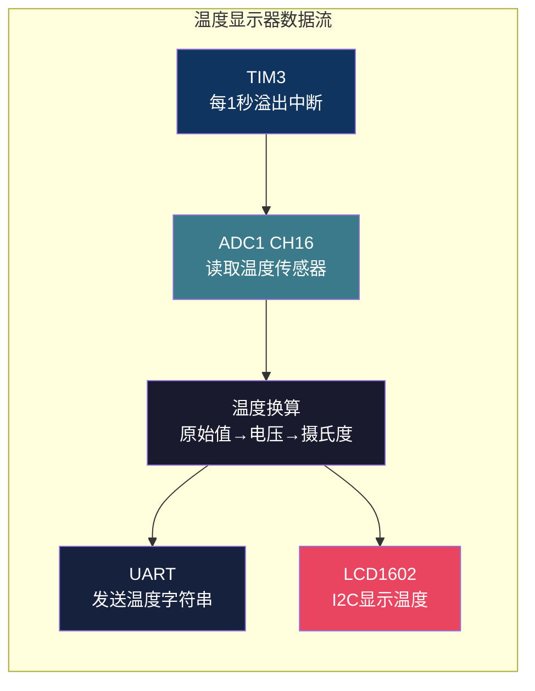
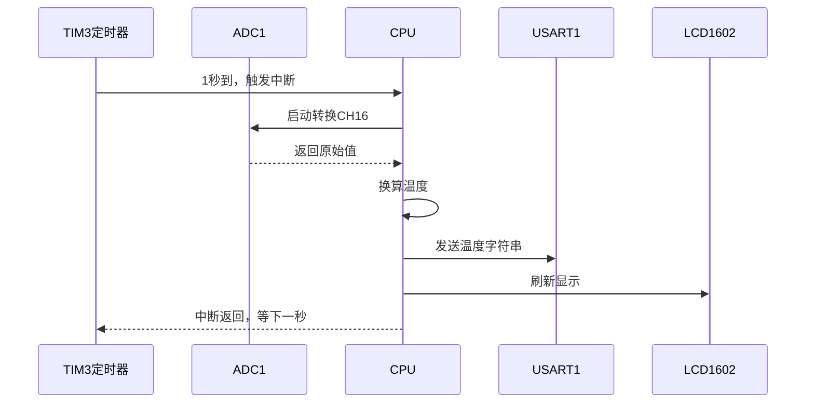

# 【炼气·30】炼气期毕业项目：做一个温度显示器，把前29篇串起来

> **码农修仙传 · 炼气期 · 第30篇**
> 我是玄芯散人，带你从炼气修到大乘。

---

## 境界标识

```
╔══════════════════════════════════════╗
║     炼气期 · 第30篇                    ║
║     炼气期毕业项目：温度显示器          ║
║     ADC+UART+TIM+LCD综合实战           ║
║     预计阅读：18分钟                   ║
╚══════════════════════════════════════╝
```

---

## 修仙引入

修炼讲究法度。学了一身功法却从来不打一场，等真刀真枪的时候手脚发软。炼气期你学了GPIO点灯，学了UART打字，学了按键中断，学了定时器闪烁LED。这些都是散招。毕业之前，得把散招串成一套连招。

这一篇的毕业项目：做一个温度显示器。用STM32F103的ADC读取芯片内部温度传感器，定时器每秒触发一次采集，串口把温度值打到电脑上，LCD1602同时显示当前温度。四个外设配合工作，一个项目串起来。

---

## 硬核主体

### 项目需求拆解

先理清楚做什么，再动手。

功能一：读取温度。用STM32F103自带的内部温度传感器，不需要外接器件。这个温度传感器连在ADC1的channel 16上，测的是芯片自己的温度，不是环境温度。精度不高，误差能到好几度，但作为毕业练习完全够用。

功能二：定时采集。每秒读一次温度，不能靠HAL_Delay死等，用定时器中断触发，CPU在两次采样之间可以做别的事。

功能三：串口输出。每次采样完，通过UART把温度值发到电脑，用串口助手查看，方便调试。

功能四：LCD显示。LCD1602显示当前温度，I2C接口驱动，省引脚。



### CubeMX配置

一个项目要配四个外设，CubeMX里一个个来。

ADC配置：选ADC1，勾选Temperature Sensor Channel。这个通道是固定的，channel 16，不需要接外部引脚。ADC参数设置里，分辨率选12位，采样时间选239.5个ADC时钟周期，温度传感器需要较长的采样时间才能稳定。

定时器配置：选TIM3，和上一篇一样。PSC填7199，ARR填9999。72MHz除以7200等于10kHz，数10000次溢出，溢出周期1秒。NVIC Settings里勾选TIM3 global interrupt。

UART配置：选USART1，波特率115200，8位数据，1位停止位，无校验。跟第27篇一样的配法。

I2C配置：选I2C1，标准模式100kHz。LCD1602带I2C转接板用PCF8574，地址常见0x4E（对应PCF8574芯片）或0x7E（对应PCF8574A芯片），具体看模块背面的芯片型号。

生成代码后，CubeMX会帮你初始化所有外设。你要做的是把这些外设串到一起。

### 温度传感器的工作原理

STM32F103的内部温度传感器输出一个电压，跟温度成线性关系。数据手册里给了公式：

温度(°C) = (V25 - V_sense) / Avg_Slope + 25

V25是25度时传感器的输出电压，数据手册给的典型值是1.43V。Avg_Slope是温度每升高1度电压下降多少，典型值4.3mV/°C。V_sense是ADC读到的电压值。

ADC是12位的，量程0到3.3V，所以ADC原始值的换算：电压 = 原始值 × 3.3 / 4096。

合起来，温度的计算公式：

```c
/* ADC原始值转换为温度（摄氏度） */
float adc_to_temperature(uint32_t raw)
{
    float voltage = raw * 3.3f / 4096.0f;     /* ADC值转电压 */
    float temp = (1.43f - voltage) / 0.0043f;  /* 电压转温度 */
    return temp + 25.0f;                       /* 加上25度基准 */
}
```

为什么是1.43减voltage？因为温度越高，传感器输出的电压越低。25度时是1.43V，温度每升1度降4.3mV。所以25度时的电压减去当前电压，除以每度变化量，就得到比25度高了多少度。

这个公式算出来的温度误差不小，正负1.5度算正常的。内部温度传感器测的是芯片温度，芯片工作时会发热，测出来的温度通常比环境温度高几度。想测环境温度得外接DS18B20这类数字温度传感器，但那是以后的事。

### ADC读取：单次转换模式

ADC有好几种工作模式，这里用最简单的单次转换。每次读温度时启动一次ADC转换，等转换完成读结果。

```c
/* 读取ADC1 channel 16（内部温度传感器）的值 */
uint32_t read_adc_temp(void)
{
    ADC_ChannelConfTypeDef sConfig = {0};
    sConfig.Channel = ADC_CHANNEL_TEMPSENSOR;   /* channel 16 */
    sConfig.Rank = 1;
    sConfig.SamplingTime = ADC_SAMPLETIME_239CYCLES_5;  /* 温度传感器需要长采样 */
    HAL_ADC_ConfigChannel(&hadc1, &sConfig);

    HAL_ADC_Start(&hadc1);                          /* 启动ADC */
    HAL_ADC_PollForConversion(&hadc1, HAL_MAX_DELAY); /* 等转换完成 */
    uint32_t value = HAL_ADC_GetValue(&hadc1);      /* 读结果 */
    HAL_ADC_Stop(&hadc1);                            /* 停ADC */
    return value;
}
```

`HAL_ADC_PollForConversion`是阻塞等待，但ADC转换很快，12位分辨率加239.5周期采样时间，总共不到100微秒，阻塞这一点点时间无所谓。

如果后续要同时采集多个通道，可以用DMA加扫描模式，但毕业项目用单次转换就够了。简单可靠，容易理解。

### 定时器触发采集

上一篇你学了用定时器中断闪烁LED。这里把LED翻转换成温度采集。

```c
/* TIM3每1秒溢出中断一次 */
void HAL_TIM_PeriodElapsedCallback(TIM_HandleTypeDef *htim)
{
    if (htim->Instance == TIM3) {
        /* 1. 读ADC温度传感器 */
        uint32_t raw = read_adc_temp();
        float temp = adc_to_temperature(raw);

        /* 2. 串口输出温度 */
        char buf[32];
        snprintf(buf, sizeof(buf), "Temp: %.1f C\r\n", temp);
        HAL_UART_Transmit(&huart1, (uint8_t*)buf, strlen(buf), 100);

        /* 3. LCD显示温度 */
        lcd_show_temp(temp);
    }
}
```

定时器中断回调里做了几件事：读ADC，算温度，然后串口发送加LCD刷新。这一套在一秒里跑一次，CPU在两次中断之间完全空闲。

有个问题要注意。定时器回调里调用`HAL_ADC_PollForConversion`这种阻塞函数，如果ADC转换耗时太长，会干扰其他中断响应。这里ADC转换不到100微秒，问题不大。但如果在更严格的项目里，中断回调应该只设标志位，真正的工作放到主循环里做。

### LCD1602显示

LCD1602带PCF8574 I2C转接板，只需要4根线。VCC和GND供电，SDA接PB7，SCL接PB6，对应STM32的I2C1接口。

LCD1602的驱动有一套固定的初始化序列和命令格式，网上有大量现成库。炼气期不深究I2C协议细节，用一个简化版的驱动说明思路：

```c
/* LCD1602 I2C 简化驱动（基于PCF8574） */
#define LCD_ADDR 0x4E  /* PCF8574常见地址（视跳线而定） */

/* 发送一个字节到LCD */
void lcd_write_byte(uint8_t data, uint8_t mode)
{
    /* mode: 0=命令, 1=数据 */
    uint8_t hi = (data & 0xF0) | 0x08 | mode;  /* 高4位+背光+RS */
    uint8_t lo = ((data << 4) & 0xF0) | 0x08 | mode; /* 低4位 */
    HAL_I2C_Master_Transmit(&hi2c1, LCD_ADDR, &hi, 1, 100);
    /* 使能脉冲 */
    hi |= 0x04;  /* EN=1 */
    HAL_I2C_Master_Transmit(&hi2c1, LCD_ADDR, &hi, 1, 100);
    hi &= ~0x04; /* EN=0 */
    HAL_I2C_Master_Transmit(&hi2c1, LCD_ADDR, &hi, 1, 100);
    HAL_Delay(2);
    /* 低4位同理 */
    HAL_I2C_Master_Transmit(&hi2c1, LCD_ADDR, &lo, 1, 100);
    lo |= 0x04;
    HAL_I2C_Master_Transmit(&hi2c1, LCD_ADDR, &lo, 1, 100);
    lo &= ~0x04;
    HAL_I2C_Master_Transmit(&hi2c1, LCD_ADDR, &lo, 1, 100);
    HAL_Delay(2);
}

/* 显示温度到LCD */
void lcd_show_temp(float temp)
{
    /* 第一行显示标题 */
    lcd_write_byte(0x80, 0);  /* 光标移到第一行起始 */
    lcd_write_byte(0x80, 0);
    const char* title = "Temperature:";
    while (*title) lcd_write_byte(*title++, 1);

    /* 第二行显示数值 */
    lcd_write_byte(0xC0, 0);  /* 光标移到第二行起始 */
    lcd_write_byte(0xC0, 0);
    char buf[16];
    snprintf(buf, sizeof(buf), "%.1f C  ", temp);
    char *p = buf;
    while (*p) lcd_write_byte(*p++, 1);
}
```

LCD1602每次发一个字节要拆成两个4位传送，因为PCF8574是8位IO扩展，LCD1602数据口是4位模式。每次传送需要一个使能脉冲，EN引脚从高变低时LCD读取数据。这些时序细节不用全记住，用现成库就行，理解原理就好。

### 主程序代码

把所有部件拼到一起：

```c
#include "main.h"
#include <string.h>
#include <stdio.h>

/* 函数声明 */
uint32_t read_adc_temp(void);
float adc_to_temperature(uint32_t raw);
void lcd_init(void);
void lcd_show_temp(float temp);

int main(void)
{
    HAL_Init();
    SystemClock_Config();
    MX_GPIO_Init();
    MX_ADC1_Init();
    MX_USART1_UART_Init();
    MX_I2C1_Init();
    MX_TIM3_Init();

    lcd_init();                          /* 初始化LCD */
    HAL_TIM_Base_Start_IT(&htim3);       /* 启动定时器中断 */

    /* 发送启动消息 */
    const char* msg = "Temp Monitor Ready\r\n";
    HAL_UART_Transmit(&huart1, (uint8_t*)msg, strlen(msg), 100);

    while (1)
    {
        /* 主循环空闲，所有工作在定时器中断里完成 */
        /* 可以在这里加按键检测、低功耗模式等 */
    }
}
```

整个程序的结构很清晰：初始化所有外设，启动定时器，主循环空闲。每秒定时器中断触发一次，读ADC算温度发串口刷LCD，一气呵成。

### 数据流时序



整个链路，定时器中断触发到LCD刷新完成，耗时不超过几毫秒。剩下的99%时间CPU完全空闲，可以加别的功能，比如按键切换显示模式，或者加个蜂鸣器在温度超阈值时报警。

### 调试顺序

做这种多外设配合的项目，别一次全配上再调。一次加一个外设，每加一个先验证能跑。

第一步：先调ADC，把原始值打到串口看数字。用手捂住芯片，温度应该缓慢上升，松手后下降。如果数值一直是0或者4095，检查ADC通道配置和采样时间。

第二步：调温度公式。把ADC原始值和算出来的温度同时通过串口输出，对比一下。室温环境下芯片温度一般在30到40度之间。如果算出来是负数或者上百，公式写错了。

第三步：加定时器。让定时器每秒触发一次ADC读取，串口每秒打印一行温度。如果串口没输出或者一次打印好几行，检查定时器中断有没有正确使能。

第四步：加LCD。先让LCD显示一个固定字符串，确认I2C通信正常。再改成显示动态温度值。如果LCD不显示，先检查I2C地址对不对，用I2C扫描函数扫一遍总线上有哪些设备。

### 这个项目教了你什么

单独看每个外设，都不难。GPIO点灯你早会了，UART打字也会了，定时器中断上一篇刚学的。ADC是新东西，但读取接口就那三步：配置通道，启动转换，读值。LCD的I2C驱动稍微复杂一点，但网上有现成库。

真正的难点不在单个外设，在于把多个外设拼到一个项目里让它们协调工作。初始化顺序，中断优先级，阻塞函数放哪里，数据在不同模块之间怎么传递，这些才是工程能力。

你做了一个能读温度并输出到串口和LCD的项目。点灯到这一步，炼气期的功夫就练完了。

---

## 修仙术语对照表

| 修仙术语 | 技术现实 | 本篇位置 |
|----------|---------|---------|
| 散招 | 单个外设的使用（GPIO/UART/ADC） | 项目需求拆解 |
| 连招 | 多外设配合组成可运行项目 | 项目需求拆解 |
| 灵脉探温 | ADC读取内部温度传感器 | 温度传感器原理 |
| 周天循环 | 定时器每秒触发一次采集流程 | 定时器触发采集 |
| 传音符 | 串口输出温度值 | 串口输出 |
| 显形石 | LCD1602显示温度 | LCD1602显示 |
| 法器组装 | CubeMX配置多个外设 | CubeMX配置 |
| 炼丹火候 | ADC采样时间设置239.5周期 | ADC读取 |
| 搬运灵气 | ADC原始值到温度值的换算 | 温度传感器原理 |
| 灵力调度 | 中断回调里串联多个外设操作 | 定时器触发采集 |
| 凝液成丹 | 多外设拼装为可运行项目 | 主程序代码 |
| 逐层试法 | 一次加一个外设逐步调试 | 调试顺序 |

---

## 进阶条件

- [ ] 能画出温度显示器的数据流图，说清定时器中断到LCD刷新的全链路
- [ ] 能用公式将ADC原始值换算为摄氏度，知道V25=1.43V和Avg_Slope=4.3mV/°C的含义
- [ ] 能解释为什么内部温度传感器测的不是环境温度，以及误差来源
- [ ] 能在CubeMX中同时配置多个外设（ADC/TIM/UART/I2C）
- [ ] 能写出定时器中断回调函数，在回调里完成ADC读取温度换算和结果输出
- [ ] 知道多外设项目要逐个调试验证，能说出调试的四个步骤
- [ ] 能解释为什么中断回调里不宜放耗时操作，以及主循环空闲的好处

> 炼气期到这里就毕业了。下一篇进入筑基期，你将理解代码背后的计算机原理。

---

## 下期预告 + 互动

> 下一篇：【筑基·31】你已经筑基了吗
>
> 筑基不是多写了几年代码就行，得能说清楚代码在计算机里怎么跑的。筑基的判断标准，CS基础四座地基概述。炼气到筑基，不是量的积累，是视角的升级。

问你：

> 这个项目里四个外设，你觉得哪个最难调试？是ADC的温度换算还是LCD的I2C通信？
>
> 如果要给这个温度显示器加一个功能，你会加什么？报警蜂鸣器？历史温度记录？还是无线传输？

> 我是玄芯散人，带你从炼气修到大乘。

---

*本文是「码农修仙传」系列第30篇。系列导航见 [xren.ren](https://xren.ren)*
