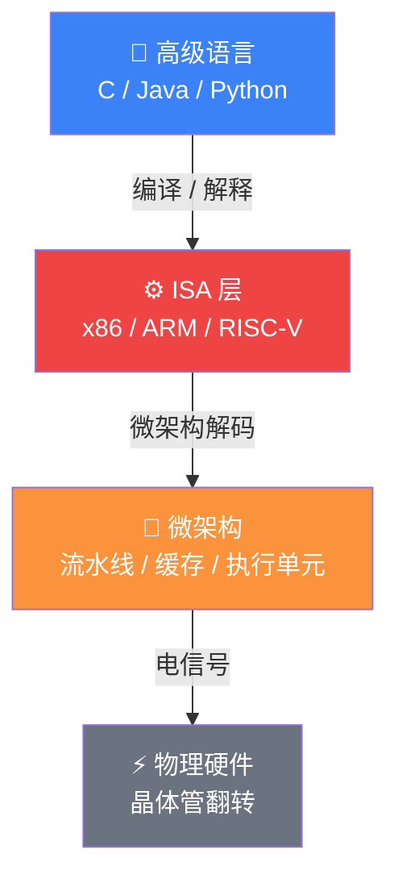
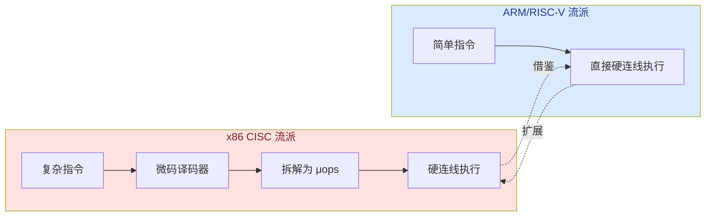
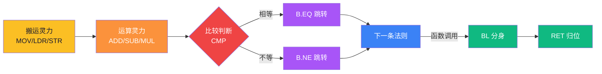
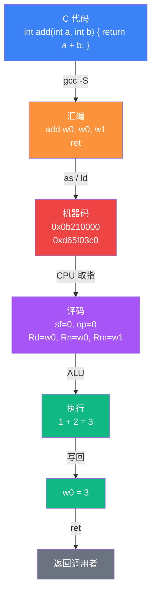

# 【元婴·91】CPU指令集是天地法则

> **码农修仙传 · 元婴期 · 第15篇**
> 我是玄芯散人，带你从炼气修到大乘。

---

## 境界标识

```
╔══════════════════════════════════╗
║     元婴期 · 第15篇               ║
║     CPU指令集是天地法则            ║
║     预计阅读：15分钟              ║
╚══════════════════════════════════╝
```

---

## 修仙引入

金丹期你开了天眼，能看清代码在 CPU 里跑成了什么——一串串符文（指令）在经脉（总线）里流动。

但天眼只看到了表象。元婴期修士要再深一层：这些符文是谁写的？为什么是这些，不是别的？

答案是——**指令集架构（ISA, Instruction Set Architecture）**。

ISA，就是某个 CPU 世界里的天地法则全集。它规定了这个世界的修士能施展什么功法（指令）、有多少灵力容器（寄存器）、灵力怎么流动（寻址模式）。你写的一切代码，最终都要翻译成这套法则，CPU 才能执行。

换句话说：程序员写的是人话，CPU 只认 ISA 这门"天地语"。编译器、解释器、JIT、虚拟机——所有翻译官的活儿，本质都是把你说的话翻成 ISA。

今天这堂课，我们一起读懂这套法则，看清三个最常见的法则流派，亲手把一条 C 代码翻译成 CPU 能听懂的符文。

---

## 硬核主体

### 一、法则之上还有法则——ISA 到底是什么

在动手修炼之前，先把"法则"的层级分清楚。元婴修士最忌讳的就是把不同层的东西混为一谈。

CPU 的世界有四层抽象，从上到下越来越接近物理：

| 层级 | 修仙类比 | 技术术语 |
|------|---------|----------|
| 应用层 | 功法秘籍（你写的 Python/Java/C 代码） | 高级语言 |
| 翻译层 | 译经僧（把秘籍翻成法则条文） | 编译器 / 解释器 / JIT |
| ISA 层 | **天地法则（CPU 唯一能听懂的语言）** | **指令集架构（ISA）** |
| 微架构层 | 法则的具体执行方式（不同宗门修炼同一条法则的手法不同） | Microarchitecture（流水线 / 缓存 / 乱序执行） |

记住这一条核心心法：

> ISA 是契约，微架构是实现。
>
> ISA 是软件和硬件之间的"约法三章"——只要 CPU 承诺支持某条 ISA，它就必须按这个约定执行指令。微架构是各家 CPU 厂商（Intel、AMD、苹果、高通）的内部功法，只要对外的 ISA 契约不变，内部怎么实现是它的事。

这意味着：同一个 x86-64 法则，Intel 的 i9 和 AMD 的 Ryzen 都遵守，但它们内部的流水线长度、缓存结构、执行单元都是独家秘方。ISA 是公开的武林盟约，微架构是各宗门的不传之秘。

那 ISA 这份"盟约"具体规定了什么？三件事：

1. **指令集**：CPU 能执行的所有指令（加、减、跳转、加载、存储……）
2. **寄存器组**：CPU 内部有多少灵力容器，每个容器多大，能装什么
3. **寻址模式**：怎么找到外部灵气（内存）里的某个位置（立即数 / 寄存器 / 直接地址 / 偏移地址……）

把这三件事打包成一个文档，就是 ISA 规范。x86 的规范上千页，ARM 几百页，RISC-V 简洁些但模块化。本质上，这些规范就是 CPU 这个"天地"的立法文本。



图中红色那一层就是 ISA——它是上层软件和下层硬件之间唯一不变的语言。你换 CPU 可以（换微架构），换指令集就要重新编译所有代码（换法则）。所以 ISA 这一层的选择，往往十年不动——它是程序员和物理世界之间的契约。

---

### 二、三大宗门的天地法则

修仙界有宗门林立，CPU 界也是。当今世界，三大 ISA 鼎足三分：

#### 2.1 x86 / x86-64——PC 服务器的霸主

x86 是 Intel 1978 年发布的 ISA，到现在四十多年了。它的特点是**复杂指令集（CISC, Complex Instruction Set Computer）**——单条指令能完成很复杂的工作，比如一条指令可以同时做"从内存取数 + 算术运算 + 写回内存"三件事。

好处是：写汇编的人少敲几条指令。坏处是：硬件工程师要做一套微码来翻译这些复杂指令，CPU 内部变得臃肿。

地盘：PC、服务器、工作站。你用的台式机笔记本，99% 是 x86-64（也叫 AMD64 / Intel 64）。

#### 2.2 ARM——移动世界的王者

ARM 起源于英国 Acorn 公司，现在是软银旗下。它的特点是**精简指令集（RISC, Reduced Instruction Set Computer）**——指令数量少（基础几十条），单条指令只做一件事（取数就取数，加就加），格式定长（通常 4 字节）。

好处是：硬件设计简单，功耗低，芯片面积小——这恰好是手机、嵌入式设备最需要的。

地盘：手机（>99% 份额）、嵌入式、Apple Silicon 笔记本、服务器新势力。

#### 2.3 RISC-V——开源的新生力量

RISC-V 是 2010 年 UC Berkeley 发起的开源 ISA。它的核心理念是开放、免费、模块化——任何人都能用它设计 CPU，不用交授权费，可以根据需要加扩展模块（整数 / 浮点 / 向量 / 压缩指令……）。

地盘：IoT、教育、国产芯片、AI 加速器。中国把它当成"芯片自主可控"的备选路径之一。

我们把它放在一张图里看：

| 维度 | x86 | ARM | RISC-V |
|------|-----|-----|--------|
| 流派 | CISC | RISC | RISC |
| 开放性 | 闭源（Intel / AMD 自家） | 闭源（要授权费） | **完全开源免费** |
| 基础指令数 | 数千条 | 约百条 | 约 47 条（RV32I 基础） |
| 主要阵营 | Intel / AMD | Apple / 高通 / 联发科 | 平头哥 / SiFive / 大量新势力 |
| 主战场 | PC / 服务器 | 手机 / 嵌入式 | IoT / 教育 / AI 芯片 |
| 商业模式 | 卖芯片 | 卖 IP（设计图） | 卖服务 / 卖芯片 |

注意一个细节：ARM 自己不造芯片。它把指令集和 CPU 设计图授权给苹果、高通、华为这些公司，每家公司交授权费后自己造芯片。这是一种"卖铲子"的商业模式——很像修仙界的学院派：自己不开山门，只收弟子学费。

而 RISC-V 走的是开源功法流：免费，谁都能练，谁都能改。这条路未来能不能撼动 ARM 的地位？我们下下下篇（18 篇）专门讲宗门大战。

---

### 三、CISC vs RISC——法则的两种哲学

上一节埋了一个伏笔：CISC 和 RISC 是两种截然不同的立法哲学。这场争论持续了 40 年，至今没分出绝对胜负——因为现代 CPU 其实在互相借鉴。

先看对比表，再讲内在逻辑：

| 对比维度 | CISC（x86） | RISC（ARM / RISC-V） |
|---------|------------|---------------------|
| 法则数量 | 多（1000+ 条指令） | 少（基础约 40-100 条） |
| 单条法则复杂度 | 复杂，一条指令做多步 | 简单，一条指令做一步 |
| 法则长度 | 变长（1-15 字节） | 定长（通常 4 字节） |
| 硬件执行方式 | 微码翻译复杂指令 | 直接硬连线执行 |
| 修炼风格 | "一招多能" | "一招一能" |
| 适用场景 | PC / 服务器 | 移动 / 嵌入式 / IoT |
| 典型功法 | `REP MOVSB`（一条指令搬一块内存） | `LDR` + `STR` + 循环（多条指令搬内存） |

#### 哲学之争：CISC 想让软件省事，RISC 想让硬件省事

CISC 的哲学是：硬件多做点，软件少写点。汇编程序员日子好过，一条指令就能搞定复杂操作。问题是硬件工程师累——要做微码，要拆解复杂指令，要让 CPU 看起来"什么都能做"。

RISC 的哲学是：硬件简单点，软件多做点。CPU 只认最简单的指令，复杂功能由编译器或软件用多条简单指令组合出来。好处是硬件能做得快、省电、流水。

听起来 RISC 完胜？并不是。x86 CPU 内部其实偷偷在做 RISC 化——Intel 拿到一条 CISC 指令，先用微码把它拆成几条类似 RISC 的微操作（μops），再交给执行单元。这说明在硬件层面，两种哲学最终都收敛到了相似的执行方式。



这张图揭示了一个元婴级洞察：CISC 和 RISC 都在向中间靠拢。现代 x86 CPU 内部跑的是"伪 RISC"——复杂指令拆成简单 μops。现代 ARM CPU 也支持越来越多的复杂指令。所以这场争论的真相是：两种哲学最终殊途同归。

那为什么还要分 CISC 和 RISC？因为对外的 ISA 契约不一样——这是程序员、编译器、操作系统看到的"接口"。接口决定生态，生态决定生死。

---

### 四、法则条文——你必须知道的十条核心指令

不管 x86 还是 ARM 还是 RISC-V，核心指令就那几条。再复杂的程序，拆到底就是搬数据、算数据、比较、跳转、调函数。ISA 的核心指令不超过十条，掌握这十条，你就能读懂大部分汇编。

下面这五条核心指令，每个程序员都应该认识。我用 ARM64 汇编做示例（移动端主流），但 x86 的版本几乎一一对应：

#### 4.1 MOV——灵力搬运

作用：把灵力从一个容器搬到另一个容器（寄存器 ↔ 寄存器 / 寄存器 ↔ 内存）。

ARM64 写法：
```asm
// ARM64 汇编 —— 灵力搬运
MOV X0, X1         // 把 X1 容器里的灵力搬到 X0（寄存器→寄存器）
MOV X0, #100       // 把"100"这个数字直接装入 X0（立即数→寄存器）
LDR X0, [X1]       // 把 X1 指向的内存里的灵力搬到 X0（内存→寄存器）
```

> 注意：ARM64 是 Load-Store 架构，MOV 只能在寄存器之间搬数据，不能直接读写内存。访问内存必须用 LDR/STR。这一点和 x86 的 `MOV RAX, [RBX]` 形成关键区别——x86 的 MOV 可以兼任加载和存储，ARM64 不行。

修仙类比：MOV 就是"搬运灵力"——把丹田的灵力移到经脉。所有计算的起点，都是 MOV。但搬灵石（内存数据）必须用 LDR，MOV 管不了外面的事。

x86 对应：`MOV RAX, RBX` / `MOV RAX, 100` / `MOV RAX, [RBX]`。

#### 4.2 ADD / SUB / MUL / DIV——灵力运算

作用：在寄存器之间做算术运算。

ARM64 写法：
```asm
ADD X0, X1, X2     // X0 = X1 + X2
SUB X0, X1, X2     // X0 = X1 - X2
MUL X0, X1, X2     // X0 = X1 * X2
SDIV X0, X1, X2    // X0 = X1 / X2（有符号除法）
```

修仙类比：灵力相加 / 相减 / 相乘 / 相除。注意：所有算术只在寄存器之间发生——CPU 不能直接对内存里的数做加法，必须先 MOV 到寄存器，再 ADD。

#### 4.3 CMP / B.EQ / B.NE / B —— 比较与跳转

作用：判断条件，决定下一条指令执行哪一条。这是所有 if / while / for 的物理基础。

ARM64 写法：
```asm
CMP  X0, X1         // 比较 X0 和 X1（本质是 X0 - X1，只更新标志位，不保存结果）
B.EQ label_true     // 如果相等，跳转到 label_true
B.NE label_false    // 如果不等，跳转到 label_false
B    label_end      // 无条件跳转（jump）
```

修仙类比：CMP 是"心算探查"——不动手，只探查灵力的相对强弱；B.EQ 是"如果相等就瞬移"——法则条文之间的跳转。所有的循环和判断，最终都是 CMP + B 指令的组合。

x86 对应：`CMP RAX, RBX` / `JE label` / `JNE label` / `JMP label`。

#### 4.4 LDR / STR——加载与存储

作用：CPU 不能直接操作外部灵气（内存），必须通过 LDR（Load）把内存的灵力装进寄存器，通过 STR（Store）把寄存器的灵力写回内存。

ARM64 写法：
```asm
LDR X0, [X1]        // 从 X1 指向的内存地址加载 8 字节到 X0
LDR X0, [X1, #8]    // 从 X1+8 指向的内存地址加载
STR X0, [X1]        // 把 X0 的内容存到 X1 指向的内存
STR W0, [X1]        // 只存 4 字节（W 寄存器是 32 位的）
```

修仙类比：LDR 是"从丹田取灵力"——把外界灵气引入体内；STR 是"存灵力入丹田"——把体内灵力寄存出去。CPU 寄存器就像修士体内的丹田，内存就像外部世界——丹田容量有限（一般 16-32 个寄存器），所以要频繁 LDR / STR。

x86 对应：`MOV RAX, [RBX]`（Load）/ `MOV [RBX], RAX`（Store）。注意 x86 用 MOV 兼任 LDR / STR——这是 CISC 风格，一条指令搞定两种语义。

#### 4.5 RET / BL——函数调用与返回

作用：跳到另一个函数执行（BL = Branch with Link），或者从函数返回（RET）。

ARM64 写法：
```asm
BL  my_function     // 跳转到 my_function，把返回地址存在 LR 寄存器
RET                 // 跳回 LR 寄存器保存的地址
```

修仙类比：BL 是"分身术"——施法者自己留下，原神去执行另一条法则；RET 是"归位"——分身回归本体。所有函数调用，本质都是 BL + RET；所有递归、回调、协程的物理基础，都在这里。

#### 总结：五条法则的"归宗图"



这张图就是所有程序运行的最小循环。从 `int a = b + c` 到分布式系统，每一行代码最终都是这几种动作的排列组合。记住这几条，你看汇编就不会觉得陌生。

---

### 五、灵力容器——寄存器的奥秘

上一节反复提到"寄存器"。它是 ISA 里仅次于指令的核心概念。

**寄存器（Register）= CPU 内部的少量超高速存储单元**。一般有 16-32 个，每个 64 位（8 字节）。访问速度是纳秒级，比内存（DRAM）快 100 倍以上。

类比：寄存器是修士体内的丹田——容量小（就那么几个），但存取极快。内存是外部灵石矿藏——容量大（GB 级别），但每次取用都要走经脉（总线），慢得多。

#### 5.1 通用寄存器 vs 特殊寄存器

**通用寄存器（GPR, General Purpose Register）**：程序员能自由使用的"随身储物袋"。ARM64 有 X0-X30（31 个），x86-64 有 RAX、RBX、RCX、RDX、RSI、RDI、RBP、RSP、R8-R15（共 16 个）。

**特殊寄存器**：有专门用途，碰之前要懂规矩。

| 寄存器 | 修仙类比 | 技术含义 |
|--------|---------|----------|
| PC（Program Counter） | 灵魂指针——当前修炼到哪一条法则 | 程序计数器：下一条要执行的指令地址 |
| SP（Stack Pointer） | 丹田基座——函数栈帧的底 | 栈指针：当前函数栈帧的栈顶地址 |
| LR（Link Register） | 分身定位符——BL 之后分身在哪 | 链接寄存器：函数返回地址（ARM64 专属） |
| FP/X29（Frame Pointer） | 经脉定位符——当前栈帧起点 | 帧指针：用于栈回溯（debug 用） |
| CPSR / RFLAGS | 修炼状态符——灵力的属性标签 | 状态寄存器：N/Z/C/V 等标志位 |
| X0-X7（AArch64） | 调用约定指定丹田——前 8 个参数 | 函数调用约定：前 8 个参数放这里 |

注意 ARM64 的 X0 / W0 区分：X0 是 64 位寄存器，W0 是 X0 的低 32 位视图（写入 W0 会清零 X0 的高 32 位）。这是 ARM 的"双视图"设计——同一个寄存器，32 位和 64 位程序都能用。

#### 5.2 调用约定——跨修士的"接力棒"规矩

寄存器是有限的，多个函数嵌套调用时，谁用哪个寄存器？这就要遵守**调用约定（Calling Convention）**。

比如 ARM64 的约定：

- X0-X7：函数参数和返回值。调用者把参数放 X0-X7，被调者把返回值放 X0
- X8-X15：临时寄存器，调用者不指望这些值在函数调用后还活着
- X19-X28：被调者保存寄存器，函数如果要使用，必须先保存原值再恢复
- X29（FP）：帧指针
- X30（LR）：返回地址
- SP：栈指针

不遵守调用约定会怎样？栈被踩坏、函数返回乱跳、程序崩溃——这在修仙界叫"经脉逆行、走火入魔"。

调用约定的本质是：多个修士（函数）协作时的灵力交接规矩。没有规矩，灵力就乱了。

---

### 六、亲手铸一条法则——从 C 到机器码

理论讲够了，来真格的。我们把一行 C 代码，一步一步翻译成 ARM64 机器码，让你看清"代码 → 法则"的完整旅程。

#### 6.1 起点：一行 C 代码

```c
// add.c —— 一行最简单的 C 代码
int add(int a, int b) {
    return a + b;
}
```

#### 6.2 第一步：C → 汇编

用 `gcc -S` 编译（关闭优化，方便看）：

```bash
gcc -S -O0 add.c -o add.s
```

得到 ARM64 汇编：

```asm
// add.s —— ARM64 汇编（编译器视角）
add:
    add w0, w0, w1     // w0 = w0 + w1（w0 是 32 位寄存器，存返回值）
    ret                 // 返回（PC 跳回 LR 保存的地址）
```

逐行讲解：

- `add:` 是函数标签（label），相当于函数名 `add`
- `add w0, w0, w1` 是核心指令——把 `w1` 加到 `w0`，结果存回 `w0`
  - 这里 `w0` 存的是参数 `a`（按调用约定，第一个参数放 X0/W0）
  - `w1` 存的是参数 `b`（第二个参数放 X1/W1）
  - 返回值也放 X0/W0，所以直接覆盖 `w0`
- `ret` 让 CPU 跳回调用者

#### 6.3 第二步：汇编 → 机器码

用 `objdump` 看机器码：

```bash
objdump -d add.o
```

输出：

```
0000000000000000 <add>:
   0:   0b210000    add w0, w0, w1
   4:   d65f03c0    ret
```

每一行是 8 位十六进制机器码，共 32 位（4 字节）：

| 汇编指令 | 机器码 | 含义 |
|---------|--------|------|
| `add w0, w0, w1` | `0x0b210000` | ADD 寄存器指令编码 |
| `ret` | `0xd65f03c0` | RET 返回指令编码 |

#### 6.4 第三步：拆解机器码

你可能会好奇：`0x0b210000` 这串十六进制到底什么意思？让我们拆解一下 ADD 指令的位域：

```
31  30  29  28-24   23-22  21  20-16   15-10    9-5    4-0
┌───┬───┬───┬──────┬──────┬───┬──────┬────────┬──────┬──────┐
│sf │op │ S │01011 │shift │ 1 │  Rm  │  imm6  │  Rn  │  Rd  │
│=0 │=0 │=0 │ ADD  │=00   │   │=00001│=000000 │=00000│=00000│
│32b│ADD│   │固定  │不移位│固定│ w1   │ 无关   │ w0   │ w0   │
└───┴───┴───┴──────┴──────┴───┴──────┴────────┴──────┴──────┘
二进制: 0000 1011 0010 0001 0000 0000 0000 0000
十六进制:  0b    21    00    00
```

每个字段的含义：

- `sf`（bit 31）：操作宽度，0 表示 32 位操作
- `op`（bit 30）：0 表示 ADD，1 表示 SUB
- `S`（bit 29）：0 表示不更新标志位
- `01011`（bits 28-24）：ADD shifted register 的固定操作码
- `shift`（bits 23-22）：00 表示不移位
- `1`（bit 21）：固定为 1
- `Rm`（bits 20-16）：源寄存器 2，00001 = w1
- `imm6`（bits 15-10）：移位量，000000 = 不移位
- `Rn`（bits 9-5）：源寄存器 1，00000 = w0
- `Rd`（bits 4-0）：目标寄存器，00000 = w0

整个 32 位二进制就是 ISA 规范里规定的**指令编码格式**。CPU 内部的译码器就是按这套格式去解析每一位的含义，然后送到对应执行单元。

#### 6.5 第四步：CPU 执行

CPU 取到 `0x0b210000` 这条指令：

1. **取指（Fetch）**：从内存（PC 指向）读出 4 字节指令
2. **译码（Decode）**：解析出"这是 ADD，目标是 w0，源是 w0 和 w1"
3. **执行（Execute）**：从寄存器文件读出 w0 和 w1 的值（假设是 1 和 2），送到 ALU 做加法
4. **写回（Writeback）**：把结果 3 写回 w0
5. PC 更新：PC 加 4，指向下一条指令

整个过程在 1 纳秒内完成。这就是 ISA：程序员写的每一行代码，最终都变成了 0/1 的位流，被 CPU 按这套规则解读和执行。

#### 6.6 完整旅程图



这条流水线，就是码农修仙传的核心链路：从人话到机器话，从灵魂到物理，从抽象到具体。元婴期修士看清了这条链路，才算真正触到了"代码"的根。

---

### 七、ISA 是契约，不是僵化的规则

讲到这里，有一个元婴级的洞察必须点破——

ISA 是软件和硬件之间的契约。这条契约的关键不在于它多严密、多死板，而在于它给两边都留了自由：

- 硬件可以自由实现：只要对外的 ISA 契约不变，CPU 厂商怎么造流水线、怎么调度、怎么优化功耗，都是它自己的事
- 软件可以自由发挥：只要按 ISA 写指令，编译器、操作系统、应用程序怎么组织都行

正是这种"契约 + 自由"的设计，让 CPU 生态能演化 40 年还在前进。x86 当年是 16 位，后来扩展到 32 位，再到 64 位——ISA 每次扩展，都保留了向后兼容。老的代码还能跑，新的代码能跑更快。

这意味着 ISA 一旦定下来，几十年不会大改。x86 从 1978 到现在，核心指令集一直在做增量扩展，但从来没有推翻重来。而各家厂商的微架构——Intel 的和 AMD 的，苹果的和高通的——年年都在变。ISA 是接口契约，微架构是实现细节，就这么简单。

理解这一点，你就真正进入了元婴期——不只知道 CPU 能做什么，还知道 CPU 为什么能这样做、未来会怎样演化。

下篇，我们沿着这条链路继续往深走——从机器码到晶体管翻转，看清"代码"如何变成"物理动作"。

---

## 修仙术语对照表

本篇用到的修仙术语和技术现实的映射：

| 修仙术语 | 技术现实 | 本篇位置 |
|---------|---------|----------|
| 天地法则 | 指令集架构（ISA） | §一·ISA 是什么 |
| 法则条文 | 指令（Instruction） | §四·十条核心指令 |
| 法则流派 | CISC / RISC / RISC-V | §二·三大宗门 |
| 契约 vs 实现 | ISA vs 微架构 | §一 / §七 |
| 丹田 | 寄存器（Register） | §五·寄存器 |
| 灵力搬运 | MOV 指令 | §四·MOV |
| 灵力运算 | ADD / SUB / MUL | §四·运算指令 |
| 比较心算 | CMP 指令 | §四·CMP |
| 瞬移跳转 | B / JMP 指令 | §四·跳转 |
| 取灵石 / 存灵石 | LDR / STR 指令 | §四·访存 |
| 分身术 / 归位 | BL / RET 指令 | §四·函数调用 |
| 调用约定 | 跨函数灵力交接规矩 | §五·调用约定 |
| 灵魂指针 | PC 程序计数器 | §五·特殊寄存器 |
| 译经僧 | 编译器 | §一 / §六 |

想查全系列术语？看 [术语词典](/glossary)。

---

## 突破条件

炼气期 → 筑基期 → 金丹期一路走来，元婴期这一关要验证下面四条：

- [ ] 能用自己的话解释 ISA 是什么，并说出 ISA 和微架构的区别
- [ ] 能说出 CISC 和 RISC 的至少三个区别
- [ ] 能识别 MOV / ADD / CMP / B / LDR / STR 这六条核心指令的语义
- [ ] 能看懂一段 10 行以内的 ARM64 或 x86 汇编，知道它在干什么

四条全勾，你就算正式摸到了"元婴"的门槛——开始看得见代码背后的物理世界。

下一关是从 C 代码到晶体管翻转（16 篇），那条链路比这一篇更长、更硬。准备好了就继续。

---

## 下期预告 + 互动

> **下一篇：【元婴·16】从 C 代码到晶体管翻转**
>
> 这一篇我们停在 ISA 层——法则条文已经看清了，但条文怎么变成物理动作？
>
> 下篇我们顺着这条链路继续往下挖：
> - C 代码 → 汇编 → 机器码 → 微指令 → 逻辑门 → 晶体管 → 电子流动
> - 一行 `a = 1 + 2`，几亿个晶体管翻转的完整故事
> - 加法器、寄存器、时钟、MOSFET——所有底层的真相

这条链路是元婴期的核心硬功，也是本系列的差异化主场。

现在问你：

> 🎮 境界自测：你能不看答案说出 MOV / ADD / LDR / STR 各自的作用吗？评论区默写一遍，看看自己有没有真正记住。
>
> 💬 话题：你写过汇编吗？在什么场景下被迫或主动接触过 ISA 这一层？留言聊聊你的"灵根觉醒时刻"。
>
> 🔔 关注玄芯散人，修炼不迷路。下一篇我们顺着 ISA 这条根，继续往晶体管挖。

> 我是玄芯散人，带你从炼气修到大乘。

---

*本文是「码农修仙传」系列第91篇。系列导航见 [xren.ren](https://xren.ren)*