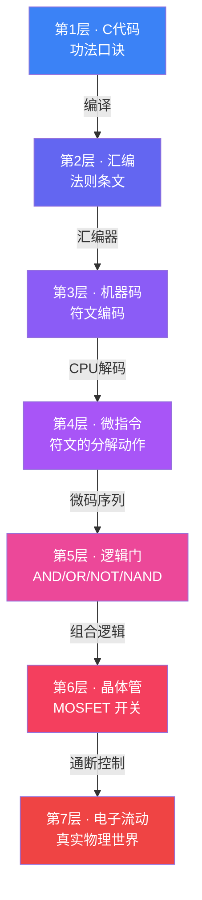
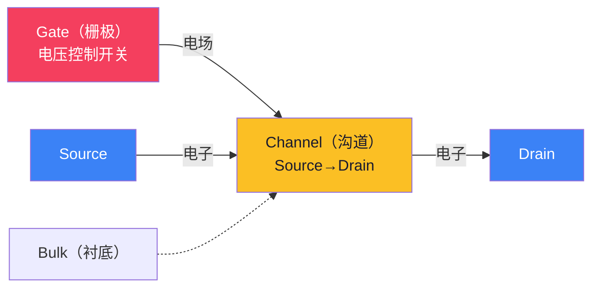
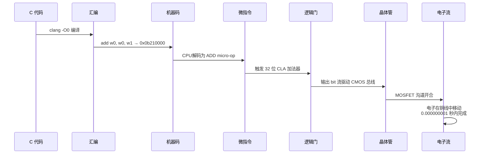

# 【元婴·92】从C代码到晶体管翻转

> **码农修仙传 · 元婴期 · 第16篇**
> 我是玄芯散人，带你从炼气修到大乘。

---

## 境界标识

```
╔══════════════════════════════════════╗
║      元婴期 · 第16篇                 ║
║      从C代码到晶体管翻转              ║
║      预计阅读：15分钟（重头戏）         ║
╚══════════════════════════════════════╝
```

---

## 修仙引入

上一篇我们说，指令集是 CPU 的天地法则——MOV、ADD、JMP 这些符文，是 CPU 能听懂的最底层咒语。

但元婴期的终极拷问还没回答：这些咒语，最后是怎么让电子真的"流起来"的？

你写 `a = 1 + 2`，按下回车的瞬间，CPU 里几亿个 MOSFET 翻了一下，几毫安电流沿铜线冲过去，一块 DRAM 里的电子重新归位。这一切发生在 0.000000001 秒内。

今天走完全程：**C 代码 → 编译 → 汇编 → 机器码 → 微指令 → 逻辑门 → 晶体管 → 电子流动**。

从代码到物理，凡人到真神之间隔的就是这一段路。走完这段，你就不再是被 API 喂养的程序员，而是真能看见硅片里物理世界的元婴修士。

我用一句话总结这条链路的"魔法"：你以为在写代码，CPU 在用几十亿个微开关协同表演；你以为在按回车，电子在铜与硅之间跑了几十亿步。两层抽象之间隔着的不是虚无，是几十年工程师堆出来的物理实在。今天我们把这层"实在"拆给你看。

---

## 硬核主体

### 2.1 完整链路总览——从灵力到物理，七层通天塔

很多程序员一辈子活在第一层（写代码），偶尔窥探第二层（汇编），但下面五层基本是黑箱。元婴期要做的，就是把这黑箱一寸寸拆开。



每向下一层，抽象就剥掉一层，"灵力"就更接近物理实在。但注意——向下是简单的，向上是复杂的。晶体管只有通/断两种状态，但几亿个组合起来，就能运算、能存储、能让 ChatGPT 给你写诗。

| 层级 | 修仙类比 | 技术现实 | 一句话定义 |
|------|---------|---------|-----------|
| 1 | 功法口诀 | C 源码 | 人类可读的最高层描述 |
| 2 | 法则条文 | 汇编指令 | CPU 指令集的助记符 |
| 3 | 符文编码 | 机器码 | 十六进制/二进制指令 |
| 4 | 符文的分解动作 | 微指令 (micro-op) | CPU 内部更细的操作 |
| 5 | 灵力基本法阵 | 逻辑门 (AND/OR/NOT) | 数字电路最小单元 |
| 6 | 灵力基本粒子 | MOSFET | 物理开关 |
| 7 | 灵力物理流动 | 电流 | 电子在铜线里移动 |

下面我们就一层一层往下钻。

---

### 2.2 逻辑门——灵力的基本法阵

逻辑门是数字电路的"原子"。无论多复杂的 CPU，最终都是由四种基本门组成的：

```verilog
// 四种基本逻辑门的 Verilog 描述
module gates(
    input  a, b,
    output and_y, or_y, not_y, nand_y
);
    assign and_y  = a & b;     // AND：两者皆真则真
    assign or_y   = a | b;     // OR：任一为真则真
    assign not_y  = ~a;        // NOT：取反
    assign nand_y = ~(a & b);  // NAND：AND 的取反
endmodule
```

四种门看似简单，但有一条修仙界的天规——**NAND 是"万阵之母"**。

什么意思？**只用 NAND 这一种门，就能搭出所有其他逻辑（AND、OR、NOT、异或、加法器、寄存器、CPU……全是 NAND 堆出来的）**。在硬件设计里这个特性叫 **functional completeness（功能完备性）**，NOR 也有同样的能力。这是为什么工业界几乎所有芯片都用 NAND/NOR 作为基础单元——简化制造。

用 NAND 搭一个 AND 门，需要这样：

```verilog
// AND = NAND(NAND(a,b), NAND(a,b))
// 物理意义：把 NAND 的输出再 NAND 一次，等价于 AND
module and_using_nand(
    input  a, b,
    output y
);
    wire n1;                   // 中间信号
    assign n1 = ~(a & b);      // 第一次 NAND
    assign y  = ~(n1 & n1);    // 第二次 NAND：自身 NAND 两次 = 自身
endmodule
```

为什么 `NAND(NAND(a,b), NAND(a,b))` 是 AND？ 因为 n1 = NAND(a,b) = ~(a&b)，然后把 n1 自己和自己做 NAND：NAND(n1, n1) = ~(n1 & n1) = ~n1（因为 x & x = x，一个信号和自身做与运算结果不变）= ~~(a & b) = a & b。关键不是 De Morgan 定律，而是两条更基础的布尔恒等式：幂等律（x & x = x）和双重否定律（~~x = x）。

修仙类比：NAND 就像修仙界的"一气化三清"——别看它只有一招，靠它自身叠加就能变出 AND、OR、NOT 所有花样。功能完备性不是玄学，是布尔代数可以证明的数学定理。

---

### 2.3 加法器——从法阵到计算

> CPU 看起来高大上，但它的核心运算就是加法。减法是加法的负数，乘法是加法的循环，除法是加法的逆推——几乎所有算术都建立在加法器之上。

**第一步：半加器（Half Adder）**

把两个 1 比特数相加，需要两个输出：

```c
// 半加器的 C 仿真（用位运算代替线路信号）
#include <stdio.h>

void half_adder(int a, int b, int *sum, int *carry) {
    *sum   = a ^ b;   // XOR：相同为0，不同为1——本位和
    *carry = a & b;   // AND：都为1才进位
}

int main(void) {
    int s, c;
    half_adder(1, 1, &s, &c);
    printf("1+1 -> sum=%d carry=%d\n", s, c);  // 输出 1+1 -> sum=0 carry=1
    return 0;
}
```

1+1=10（二进制），本位和是 0，进位是 1。半加器只算了"两个 1 比特之和"，没有处理"前一位来的进位"。

**第二步：全加器（Full Adder）**

要算多位数，必须把前一位的进位接进来：

| a | b | cin | sum | cout |
|---|---|-----|-----|------|
| 0 | 0 | 0   | 0   | 0    |
| 0 | 1 | 0   | 1   | 0    |
| 1 | 0 | 0   | 1   | 0    |
| 1 | 1 | 0   | 0   | 1    |
| ... | ... | ... | ... | ... |
| 1 | 1 | 1   | 1   | 1    |

全加器是 1 位加法的完整版，可以首尾相连变成 N 位行波进位加法器（Ripple Carry Adder, RCA）：


RCA 的问题是慢——每一级都要等上一级进位算完，32 位加起来就是 32 级延迟，像接力赛。

**第三步：超前进位加法器（CLA）**

修炼到更高境界的修士不等接力。**CLA（Carry Lookahead Adder）** 用一种"提前算"的方式同时算所有进位：

```verilog
// 超前进位逻辑——同时算出每位的进位
module cla_4bit(
    input  [3:0] a, b,
    input        cin,
    output [3:0] sum,
    output       cout
);
    wire [3:0] g, p;       // g=generate, p=propagate
    wire [3:0] c;          // c[0]=cin, c[1-3]=各位进位

    assign g = a & b;      // 进位生成：a b 都为1，本位必进位
    assign p = a ^ b;      // 进位传递：a b 异或为1，进位能传下来

    assign c[0] = cin;     // cin 接到进位链最低位
    // 并行算所有进位——不再等上一级
    assign c[1] = g[0] | (p[0] & c[0]);
    assign c[2] = g[1] | (p[1] & g[0]) | (p[1] & p[0] & c[0]);
    assign c[3] = g[2] | (p[2] & g[1]) | (p[2] & p[1] & g[0]) | (p[2] & p[1] & p[0] & c[0]);

    assign sum  = p ^ c[3:0];
    assign cout = g[3] | (p[3] & g[2]) | (p[3] & p[2] & g[1]) | (p[3] & p[2] & p[1] & g[0]) | (p[3] & p[2] & p[1] & p[0] & c[0]);
endmodule
```

CLA 用"并行预算"代替"串行接力"，延迟从 O(N) 降到 O(log N)——32 位加法只要几级门电路就完成。现代 CPU 里的加法器基本都是 CLA 或更深的 Kogge-Stone/Ladner-Fischer 变种。

你写的 `1 + 2`，在物理世界里，就是这么一堆逻辑门在几个时钟周期内"算"出来的。

---

### 2.4 寄存器与存储——灵力容器与灵力矿藏

加法器解决了"怎么算"，但还需要"怎么记"。如果算完就忘，下一步数都没了就没法编程了。

**最底层：SR 锁存器（SR Latch）**

1 比特存储的最简形式，用两个 NOR 或 NAND 门相互耦合：

```verilog
// SR 锁存器（用 NOR 门）
module sr_latch_nor(
    input  s, r,    // Set 和 Reset
    output q, qbar  // 互为反相的两个输出
);
    assign q    = ~(r | qbar);  // Q 的更新依赖自己——这就是"锁存"
    assign qbar = ~(s | q);
endmodule
```

SR 锁存器有个致命缺点——当 S=R=1 时输出不确定，而且输入电平变化时输出也跟着变（电平触发），无法在精确时刻采样。

**改进：D 触发器（D Flip-Flop）**

在时钟上升沿才锁存输入：

```verilog
// D 触发器：时钟上升沿锁存
module d_flipflop(
    input  clk, d,
    output reg q
);
    always @(posedge clk) begin
        q <= d;            // 上升沿瞬间把 d 的值"快照"到 q
    end
endmodule
```

D 触发器是"时钟 + 锁存"的组合——它只在心跳到来那一刻才更新，否则稳定不动。这种边沿触发让数字电路有了"时间锚点"。

CPU 寄存器 = 一组 D 触发器

ARM64 的 R0 寄存器，就是 64 个 D 触发器并排，每个时钟沿更新一次。x86 的 RAX、RCX、RDX……同理。

SRAM vs DRAM——存储的层级

| 类型 | 修仙类比 | 物理结构 | 速度 | 密度 | 用途 |
|------|---------|---------|------|------|------|
| 寄存器 | 修士丹田 | 多个 D 触发器并排 | 最快 | 最低 | CPU 内部运算 |
| SRAM (L1/L2/L3 Cache) | 体内气海 | 6 个晶体管存 1 比特 | 很快 | 中 | 缓存热数据 |
| DRAM (主内存) | 天地灵脉 | 1 个晶体管 + 1 个电容存 1 比特 | 较慢 | 高 | 程序运行时数据 |
| SSD/HDD | 地底灵矿 | 闪存/磁性介质 | 最慢 | 最高 | 永久存储 |

DRAM 用电容存电，电容会漏电，所以要定时刷新（64ms 内全部充一次电）。每次刷新就是一次"灵力续命"。DRAM 比 SRAM 慢、便宜，就是因为电容必须周期性做"修整功"——电容是漏水的桶。

在 ARM64 体系里，一个 `str x0, [sp]` 指令，本质是：把 D 触发器组（x0）的值，通过 SRAM 控制器，经总线写到 DRAM 里某一行电容上。这一段链路上任何一个环节出问题，都是嵌入式工程师的活。

---

### 2.5 晶体管——灵力的物理开关

接下来是最关键的一跳：从"逻辑符号"到"真实硅片"。

MOSFET 的物理结构



MOSFET = **Metal-Oxide-Semiconductor Field-Effect Transistor**（金属氧化物半导体场效应晶体管）。它有三种引脚：**栅极（Gate）、源极（Source）、漏极（Drain）**。

核心机制：**Gate 加电压，会在 Source-Drain 之间"长出"一条导电沟道**。沟道形成 → 电流能流；沟道消失 → 电流断了。

| 类型 | Gate 高电平 | Gate 低电平 | 用途 |
|------|-----------|-----------|------|
| NMOS | 导通 | 截止 | "拉低"输出 |
| PMOS | 截止 | 导通 | "拉高"输出 |

**CMOS = Complementary MOS = NMOS + PMOS 互补**

一个 CMOS 反相器就这么简单：

```verilog
// CMOS 反相器：PMOS 上拉 + NMOS 下拉
// Schematic: VDD ---[PMOS]--- Output ---[NMOS]--- GND
//                       |                      |
//                      IN  ----------------- IN
module cmos_inverter(input in, output out);
    // 物理结构（不是真的 Verilog，是示意）：
    // 当 in=1：NMOS 通，PMOS 断 → out 拉到 GND = 0
    // 当 in=0：NMOS 断，PMOS 通 → out 拉到 VDD = 1
    assign out = ~in;
endmodule
```

CMOS 的精妙之处：静态（输出稳定）时只有一个晶体管导通，几乎没有静态功耗。只有在 0→1 或 1→0 切换的瞬间，两个管子都半通，才消耗电流。这也是为什么现代 CPU 能塞几十亿个晶体管还能省电。

用晶体管搭一个 NAND 的物理思路：PMOS1 和 PMOS2 并联接到 VDD，NMOS1 和 NMOS2 串联到 GND，输入 A、B 控制栅极。当 A=B=1，两个 NMOS 都通但两个 PMOS 都关 → 输出拉低到 0；当任一输入为 0，对应 PMOS 导通 → 输出拉到 1。这正是 NAND 真值表的物理实现。每一个你用 Verilog 写的逻辑，都能在硅片上找到对应的一组 NMOS/PMOS 拓扑——这就是**RTL → 门级网表 → 物理版图**的合成链路，EDA 工具帮你自动完成。

一个 CPU 里有几个晶体管？

- 1971 年 Intel 4004：2300 个
- 1993 年 Intel Pentium：310 万个
- 2008 年 Intel Core i7：7.74 亿个
- 2024 年 Apple M3 Ultra：1340 亿个

一百三十亿个 MOSFET 在指甲盖大小的硅片上同时翻转。每一秒，它们协同完成几十亿次加法，这是你刷手机的物理基础。

每代工艺进步让 Gate 长度从 10μm 缩到 3nm，单晶体管面积缩到原来的 1/100 以下。但物理极限开始显现——3nm 以下电子会隧穿（tunneling），量子效应出场，摩尔定律开始撞墙。这也是为什么计算架构要从 CISC 走到 RISC-V，从单核走到多核，从硅走到 GaAs/碳纳米管。

---

### 2.5.1 怎么真的"看见"这条链路？——修炼者的眼

理论讲完，作为元婴修士你得能亲手复现这条链。用 GCC 和 binutils 几步就能做到：

```bash
# 第 1 步：写一段 C 代码
cat > add.c << 'EOF'
int add(int a, int b) {
    return a + b;
}

int main(void) {
    int c = add(1, 2);
    return c;
}
EOF

# 第 2 步：编译生成汇编（C → 汇编）
gcc -O0 -S add.c           # 输出 add.s

# 第 3 步：编译生成机器码（汇编 → 机器码）
gcc -O0 -c add.c           # 输出 add.o
objdump -d add.o           # 反汇编看到机器码

# 第 4 步：看链接后的完整程序
gcc -O0 add.c -o add
objdump -d add | head -30   # 看 add() 函数的机器码段
```

如果你在 x86 机器上操作，输出会是 x86 汇编。这里以 ARM64 为例：

```
0000000000000000 <add>:
   0:   0b210000    add w0, w0, w1     ; w0 = w0 + w1
   4:   d65f03c0    ret               ; 返回
```

这一段里 `0b210000` 就是第三层（机器码）——十六进制的符文编码。CPU 取指后由解码器拆成微指令，调度到 ALU，ALU 是逻辑门构成的加法器，加法器驱动 MOSFET 沟道通断，这是七层链路在一次函数调用里的完整运行。

元婴修士的"天眼"就是这套工具链。`objdump` 是天眼、`gdb` 是定身术、`strace` 是听风术、`perf` 是窥心术。你不需要每层都精通，但知道有这些工具在、知道在第几层用哪个，这种分层视野是元婴期的基本功。

---

### 2.6 时钟——修炼的心跳节拍

最后说说**时钟（Clock）**。

数字电路是同步的，所有操作需要一个统一的"心跳"驱动。最常见的时钟是方波：


频率越高，每秒心跳越多，完成的指令就越多。Apple M3 的 CPU 频率约 4 GHz，意味着每秒 40 亿次上升沿。每次上升沿，所有 D 触发器同步更新一次。

但频率越高，功耗呈指数级增长：

$$P \propto C \cdot V^2 \cdot f$$

功耗 P 与电容 C、电压 V 的平方、频率 f 成正比。这也是为什么：

- 手机 CPU 频率一般 3-3.5 GHz（续航优先）
- 桌面 CPU 可以 5-6 GHz（性能优先）
- 超算 CPU 反而只有 2-3 GHz（并行优先，频率让步）

超频的本质，就是给这颗心脏打兴奋剂——心跳加快，算力上升，但发热和漏电也爆炸式增长。现代芯片的瓶颈几乎全是"卡在散热上"。

还有一个隐藏层面：**时钟抖动（jitter）**和**时钟偏移（skew）**。几亿个 D 触发器分布在芯片各处，时钟信号到每个触发器的延迟略有不同——这叫 clock skew。如果 skew 太大，相邻两个触发器在同一边沿却"错峰"翻转，整个电路就乱套。高端芯片需要专门的**时钟树综合（clock tree synthesis）**——用 H-tree 或鱼骨型走线让时钟到达每个点的延迟尽量一致。这是 EDA 工具的核心工作，也是芯片工程师的真功夫。

---

### 2.7 一句话总结链路

你写 `int a = 1 + 2;`，从按下回车到屏幕显示出 `3`，这中间发生了什么：



从 C 的 `+` 符号，到电子真实在硅片里流动——整条链路就是 7 层通天塔。

你作为程序员，平时只站在塔顶；但到了元婴期，你要能看见塔的每一层，甚至能自己爬到某一层去修塔。你作为程序员，平时只站在塔顶；但到了元婴期，你要能看见塔的每一层，甚至能自己爬到某一层去修塔。这是嵌入式/底层工程师的"元婴境界"——不止能写代码，还能看清代码落地到哪一片硅。

最后一层，从电回到光的显示环节——你看到的 `3` 这个字符，是 GPU 把数字信号送到屏幕，液晶分子翻转 / OLED 有机材料发光，最终还是电子流动。整条链路从你指尖按下回车开始，到光子打到你视网膜结束，无一处不是物理。

---

## 修仙术语对照表

| 修仙术语 | 技术现实 | 本篇详解 |
|---------|---------|---------|
| 功法口诀 | C 源码 | §2.1 |
| 法则条文 | 汇编指令 | §2.1 |
| 符文编码 | 机器码（十六进制） | §2.1 / §2.7 |
| 符文的分解动作 | 微指令 (micro-op) | §2.1 |
| 灵力基本法阵 | 逻辑门 AND/OR/NOT/NAND | §2.2 |
| 万阵之母 | NAND/NOR 功能完备性 | §2.2 |
| 加法法阵 | 加法器 (半加/全加/CLA) | §2.3 |
| 灵力容器 | 寄存器（D 触发器组） | §2.4 |
| 体内气海 | SRAM 缓存 | §2.4 |
| 天地灵脉 | DRAM 主内存 | §2.4 |
| 地底灵矿 | SSD/HDD 永久存储 | §2.4 |
| 灵力基本粒子 | MOSFET 晶体管 | §2.5 |
| 阴阳二气互补 | CMOS (NMOS+PMOS) | §2.5 |
| 天道心跳 | 时钟信号 (Clock) | §2.6 |
| 七层通天塔 | C→汇编→机器码→微指令→门→管→电 | §2.1 / §2.7 |

> 想查全系列术语？看 [术语词典](/glossary)。

---

## 突破条件

炼气 → 筑基 → 金丹 → 元婴 走到今天，你能看清"代码到物理"完整链路的标志是这六条：

- [ ] 能复述 C → 汇编 → 机器码 → 逻辑门 → 晶体管 → 电子 七层链路
- [ ] 能说出 AND / OR / NOT / NAND 四种门的真值表，并理解 NAND 的功能完备性
- [ ] 能解释半加器、全加器、RCA、CLA 的区别，知道为什么现代 CPU 用 CLA
- [ ] 能描述 SR 锁存器 → D 触发器 → 寄存器 → SRAM/DRAM 的存储层级
- [ ] 能说清 MOSFET 的栅极控制原理，以及 CMOS 为何静态几乎不耗电
- [ ] 能解释时钟在同步电路中的作用，知道频率 / 功耗 / 电压的关系

> 全勾代表你已经在元婴中期——能看见代码落地的每一寸物理。差几条也没事，元婴期的修炼本来就是"看见看不见的东西"。

---

## 下期预告 + 互动

> **下一篇：【元婴·17】为什么嵌入式工程师天生在元婴期**
>
> 上篇我们从 C 代码走到了晶体管翻转。但有人问了：那谁真的会写寄存器、做中断、调 SPI/I2C？
> 嵌入式工程师。 他们站在软件和硬件的交界处，别人写代码是"用灵力"，他们是"造灵脉"。
> 下篇讲清楚：这个身份为什么天然就是元婴期？为什么创作者本人是嵌入式方向？
> 还有嵌入式修炼路径图：点亮 LED → 串口 → 中断 → RTOS → Linux 驱动，一步一步。

现在问你：

> 🎮 真实自测：你之前有没有意识到 `printf("Hello")` 背后是几亿晶体管在工作？还是今天才第一次感受到这事的"重量"？在评论区留下你的"顿悟瞬间"。

> 💬 技术互动：你最关心的"代码落地"环节是哪一层？是编译器/汇编？逻辑门组合？还是 MOSFET 物理原理？留言告诉我，下一篇可能挑你最关心的来深挖。

> 🔔 关注玄芯散人，修炼不迷路。下一篇揭开嵌入式工程师的元婴身份。

> 我是玄芯散人，带你从炼气修到大乘。

---

*本文是「码农修仙传」系列第92篇。系列导航见 [xren.ren](https://xren.ren)*
