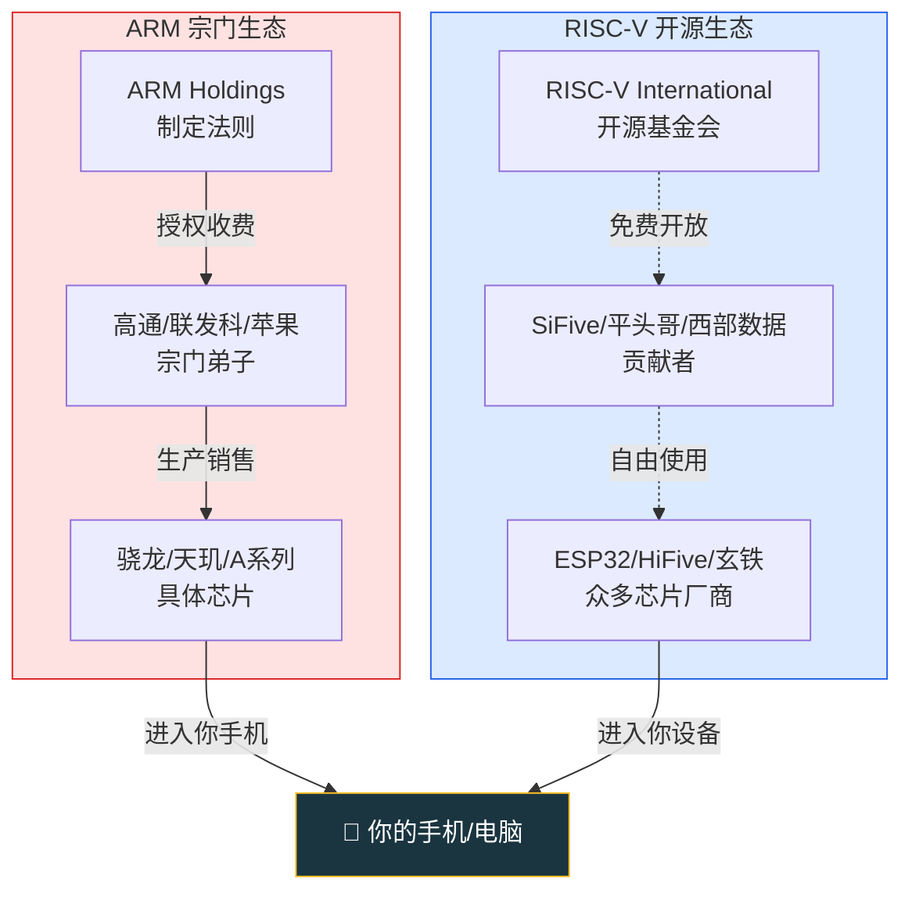
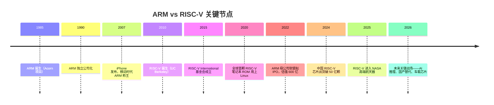

# 【元婴·94】ARM vs RISC-V大战

> **码农修仙传 · 元婴期 · 第18篇**
> 我是玄芯散人，带你从炼气修到大乘。

---

## 境界标识

```
╔══════════════════════════════════╗
║     元婴期 · 第18篇              ║
║     ARM vs RISC-V大战            ║
║     预计阅读：14分钟              ║
╚══════════════════════════════════╝
```

---

## 修仙引入

上一回我们讲过，CPU 的指令集架构（ISA）是这片修真世界的**天地法则**——x86、ARM、RISC-V 是三套不同的法则体系。x86 宗立派数千年（Intel/AMD 坐镇 PC 和服务器），ARM 在移动界一统江山，但真正有意思的大战，正在 ARM 和 RISC-V 之间展开。

ARM 是统治移动修炼界的老牌顶级宗门——你口袋里的手机、身边的 IoT 设备，几乎都在修 ARM 功法。RISC-V 则是近十年才崛起的"开源新教"，主张天地法则应该人人可修炼，不应被宗门垄断。

这场大战，关乎未来三十年芯片格局。作为嵌入式工程师出身的创作者，我必须告诉你：这场大战你必须看懂。因为不管你最终站哪一边，你的下一份工作、下一块开发板、下一个项目，可能就在二者之间做出选择。

更现实地说：哪怕你只用其中一种，理解对手才能在选型、招聘、技术决策中不踩坑。这一篇，我们把 ARM 和 RISC-V 的来龙去脉、核心差异、未来格局，一次说清楚。

---

## 硬核主体

### ARM 宗门——移动世界的霸主

ARM 的全称是 **Advanced RISC Machines**（高级精简指令集机器）。它的故事要从 1985 年的英国剑桥说起——一家叫 Acorn 的小公司，做不出能跑得动的 16 位处理器，干脆自己设计了一套 32 位 RISC 架构，命名 ARM（Acorn RISC Machine）。

那个年代 Intel 和 Motorola 把持着 PC 市场，Acorn 这家做教育电脑的小公司根本挤不进去。但 Acorn 的工程师 Sophie Wilson 和 Steve Furber 意识到一个趋势：**处理器不一定要做得复杂，也可以做得简单高效**——这就是 RISC（Reduced Instruction Set Computer）哲学的胜利。

后来 Acorn、苹果、VLSI 三家合资成立了 ARM Holdings——注意，ARM 自己不造芯片。它做的是另一件事：卖设计图（IP 核授权）。

这是一种非常独特的商业模式。Intel/AMD 是"自己设计 + 自己生产 + 自己卖"（IDM 模式）；NVIDIA 是"自己设计 + 找人代工 + 自己卖"（Fabless 模式）；而 ARM 是"我设计，你拿去用，用一次付一次钱"。

这就像修仙界的"顶级功法典籍授权"——ARM 不亲自开山立派，但它把"功法"（CPU IP）授权给高通、联发科、苹果、三星、华为这些下游宗门，下游宗门把它做成具体芯片（骁龙、天玑、麒麟、A 系列……）。ARM 自己则坐收授权费，旱涝保收。

ARM 的产品线按场景分为三大门派：

- **Cortex-A 系列**（Application）：高性能阵营，跑 Linux/Android/iOS，目标是手机和笔记本。Apple M1/M2/M3/M4、Cortex-A78、A710 都是这个系列。
- **Cortex-R 系列**（Real-time）：实时阵营，跑 RTOS，目标是汽车 ECU、硬盘控制器、5G 基带。延迟确定性极强。
- Cortex-M 系列（Microcontroller）：嵌入式阵营，跑裸机或 RTOS，目标是 STM32 单片机、IoT 设备。入门嵌入式工程师最先接触的就是 Cortex-M 系列（比如 STM32F103 的 M3 内核、STM32F407 的 M4 内核）。

市场地位有多恐怖？看几个数字：

- 全球 **99% 以上** 的智能手机 SoC 用 ARM 架构
- Apple M1/M2/M3/M4 笔记本芯片也是 ARM（Apple Silicon 时代）
- 全球 IoT 芯片，ARM 占绝对主导
- 服务器市场，AWS Graviton、NVIDIA Grace 都在向 ARM 迁移
- 嵌入式领域，STM32、NXP i.MX、全志、瑞芯微……几乎全部 ARM 内核

一句话总结：移动时代，ARM 就是天。 你的每一次滑动屏幕、每一次扫码支付，背后都是 ARM 内核在跑指令。

ARM 的关键转折点是 2007 年——iPhone 发布。iPhone 第一代用的就是 ARM11 内核，从此移动互联网爆发，ARM 跟着起飞。乔布斯选 ARM 不是偶然：ARM 简洁、低功耗，正好契合移动设备的核心需求（电池续航）。这一次选型，决定了接下来十五年的芯片格局。

但 ARM 的模式有个隐忧：授权费越来越贵。2022 年 ARM 母公司软银试图 IPO，估值高达 600 亿美元。一个芯片公司，如果用 ARM 内核，一颗芯片可能要交几美分的授权费——出货量上亿颗时，这笔费用可观。RISC-V 就是在这种历史窗口下兴起的。

```c
// ARM 宗门的"功法典籍"——授权许可证长这样（简化版）
typedef struct {
    uint32_t core_type;       // Cortex-M0 / M4 / A53 / A75 ...
    uint32_t license_tier;    // Academic / Standard / Premium
    uint32_t upfront_fee;     // 入门灵石（一次）
    uint32_t royalty_per_chip;// 每炼一颗芯片交一颗的灵石
} ARM_License;

// 你用了 ARM 的 Cortex-A75，就要按上面的规则交费
// 出货量越大，交得越多——但也意味着你站在巨人肩膀上
ARM_License my_chip = {
    .core_type = 0x4D34,      // Cortex-M4
    .license_tier = STANDARD,
    .royalty_per_chip = 0.02, // 2 美分一颗
};
```

> 修仙类比：ARM 是统治移动修炼界的顶级宗门。你想修炼 ARM 功法？先交"入门灵石"（授权费），每炼出一件法器（芯片）再按比例抽成。宗门不亲自下场打架，但弟子遍布天下。

---

### RISC-V——开源新教

RISC-V 的故事比 ARM 短得多——2010 年，加州大学伯克利分校。

当时 Krste Asanović 教授带着几个博士生想搞研究，发现一个问题：要做处理器研究，得先有指令集。但所有现成的指令集都被商业公司把持——x86 要 Intel 授权，ARM 要 ARM 授权，连 MIPS 都要花钱买。学生做研究，难道每做一个项目都要去求爷爷告奶奶？

于是他们做了一个"破格"的决定：自己设计一套全新的、干净的、简洁的、开源的指令集。

RISC-V 由此诞生——一个学术项目，最初只是为了学生做研究方便。但开源的力量远比学术圈想象的强大。

2015 年，RISC-V 团队把它从伯克利的一个实验室项目，转交给新成立的 RISC-V International（非营利基金会），类似 Linux Foundation 的治理模式。从此 RISC-V 不属于任何公司、任何学校、任何国家——它属于全人类。

任何个人、任何公司都可以免费使用、修改、扩展 RISC-V 指令集。没有授权费，没有入门灵石，没有出货抽成。

这就像修仙界的一场"功法开源运动"——

> "天地法则应该人人可修炼，不应被宗门垄断。如果功法被锁在宗门典籍里，修仙界如何进步？"

RISC-V 的核心特点有三个：

第一，简洁干净。基础整数指令集 RV32I 只有 47 条指令（对比 ARMv8 有上千条）。一个学期教完，工程师两周上手。入门门槛极低。这背后是设计哲学上的取舍——RISC-V 不追求"一条指令做复杂事"，而是追求"几条简单指令组合做复杂事"。编译器负责把复杂操作翻译成简单指令序列，硬件负责把每条指令做得飞快。这种哲学本质上和 ARM 是同源的（都是 RISC），但 RISC-V 更激进地贯彻了"简洁"。

第二，模块化扩展。RISC-V 不是一个大而全的指令集，而是一个乐高积木式的设计。基础 RV32I 是 47 条最小集，要做乘除法就加 M 扩展，要做原子操作就加 A 扩展（多核同步），要做单精度浮点就加 F 扩展，要做双精度浮点就加 D 扩展，要做向量（AI 推理）就加 V 扩展，要做嵌入式压缩指令就加 C 扩展，要做嵌入式定制就加自定义扩展。你需要什么就拼什么，没有冗余。

看一个真实案例：ESP32-C3 这颗乐鑫出品的 Wi-Fi 芯片，用的就是 RV32IMC（基础 RV32I + 整数乘除 M + 压缩指令 C），总指令数 100 出头。如果换成 ARM Cortex-M 内核，光是基础指令就上千条，对嵌入式芯片来说太重了。RISC-V 的模块化让芯片公司能精确控制成本和功耗。

第三，完全免费。不管你做芯片、卖芯片、卖给谁、用多少，不收一分钱。这意味着初创公司、个人开发者、学校、爱好者，都能零门槛使用 RISC-V。光是这一点，ARM 就做不到——ARM 从来不允许"非授权使用"。

```c
// RISC-V 的模块化设计——像乐高积木
// 基础 RV32I（47条指令）就是这块最核心的积木
// 想要什么能力，就拼上对应的扩展

typedef struct {
    uint32_t RV32I;    // 基础整数指令集（47条）—— 必选
    uint32_t M_ext;    // 整数乘除法扩展 —— 可选
    uint32_t A_ext;    // 原子操作扩展 —— 可选（多核同步用）
    uint32_t F_ext;    // 单精度浮点 —— 可选
    uint32_t D_ext;    // 双精度浮点 —— 可选
    uint32_t C_ext;    // 压缩指令（16位）—— 嵌入式可选
    uint32_t V_ext;    // 向量扩展（AI/向量计算）—— 可选
} RISC_V_Config;

// IoT 场景：RV32IMC（基础 + 乘除 + 压缩）
RISC_V_Config iot_chip = {.RV32I=1, .M_ext=1, .C_ext=1};

// AI 推理场景：RV64GCV（64位 + 通用 + 压缩 + 向量）
RISC_V_Config ai_chip = {.RV32I=1, .M_ext=1, .A_ext=1,
                         .F_ext=1, .D_ext=1, .C_ext=1, .V_ext=1};

// 同一套 RISC-V 基础，却能拼出完全不同的芯片——这是模块化设计的魅力
```

> 修仙类比：RISC-V 是"功法开源运动"。它主张：基础功法（RV32I）人人可学，按需加模块（M/A/F/D/C/V），不收费，没有宗门垄断。天地法则本应开放。

来一组对比，看 ARM 和 RISC-V 汇编写同一个函数的差异：

```c
// C 代码：实现 a + b
int add(int a, int b) {
    return a + b;
}
```

```asm
// ARM64 汇编（AArch64）
// 寄存器约定：a -> w0, b -> w1, 返回值放 w0
add  w0, w0, w1     // w0 = w0 + w1
ret                  // 函数返回
```

```asm
// RISC-V 汇编（RV64I）
// 寄存器约定：a -> a0, b -> a1, 返回值放 a0
add  a0, a0, a1      // a0 = a0 + a1
ret                  // 函数返回（伪指令，真实是 jalr x0, ra, 0）
```

看起来差不多？因为两者本质上都是 RISC 哲学的产物——load-store 架构、固定长度指令、大量寄存器。但 RISC-V 的语法更规整，模块化更彻底，扩展机制更开放。

---

### 核心对比

ARM 和 RISC-V 的对决，不是简单的"谁好谁坏"，而是两种工程哲学 + 两种商业模式的碰撞。

| 对比维度 | ARM | RISC-V |
|---------|-----|--------|
| **开放性** | 闭源 ISA，要签 NDA 才能看手册 | 开源 ISA，手册公开可下载 |
| **授权费** | 入门费 + 每颗芯片抽成 | 完全免费 |
| **基础指令数** | 数千条（ARMv8/ARMv9） | 47 条（RV32I） |
| **可扩展性** | ARM 规定死，新功能由 ARM 公司决定 | 模块化，需要什么加什么 |
| **生态成熟度** | 极成熟（30+ 年积累） | 成长中（10+ 年） |
| **工具链** | ARM 官方 + Keil + IAR + GCC | GCC + LLVM + RISC-V 官方 |
| **OS 支持** | Linux/Android/iOS/macOS 全面原生支持 | Linux 完善，Windows on RISC-V 起步 |
| **商业模式** | IP 授权收费 | 完全免费，靠生态和服务 |
| **代表芯片** | 骁龙、天玑、麒麟、Apple M 系列 | ESP32-C 系列、SiFive HiFive、阿里平头哥 |
| **典型场景** | 手机、笔记本、服务器 | IoT、教育、AI 推理、国产替代 |

重点说几个差异：

指令数对比：ARMv8-A 有 1000+ 条指令（包含 SIMD、加密、浮点、虚拟化等所有扩展）；RISC-V 的 RV32I 只有 47 条基础指令，其他能力靠模块拼装。ARM 是大而全，RISC-V 是小而美。这个差异在大芯片里被工具链和编译器"消化"了，最终用户感觉不到，但在嵌入式小芯片里，RISC-V 的精简直接转化为更低的功耗和成本。

授权成本对比：用 ARM 内核，一颗芯片可能要交 1-5 美分授权费；用 RISC-V 内核，零授权费。对于出货量大的消费电子公司（如小米、OPPO），一年能省下几千万美元。更关键的是，ARM 的授权协议不允许客户修改 ARM 内核本身——你想加个自定义指令？没门。RISC-V 的 Custom 扩展允许你自由定义私有指令，这对专用加速器（AI、加密、信号处理）至关重要。

生态成熟度：ARM 经营 30+ 年，全球开发者熟悉，工具链完善，问题解决方案多；RISC-V 生态在快速追赶，但很多细分场景（比如某些 RTOS、某些芯片厂商私有 SDK）只有 ARM 版本。生态是 RISC-V 短期内的最大短板——也是 RISC-V 长期必须补的课。

可扩展性：ARM 新功能由 ARM 公司决定——你想加个自定义指令？要先说服 ARM 公司接受，进了标准才能用。RISC-V 模块化设计允许你自由组合标准扩展，甚至定义自定义扩展（用 Custom 扩展编号）。这对专用芯片（ASIC、AI 加速器、IoT）特别友好。RISC-V 基金会正在推动 RISC-V Profiles——预定义一组扩展组合（如 RVA22），让 OS 和应用知道目标芯片支持哪些能力，进一步提升互操作性。

下面这张图展示两种生态的差异：



> 红色是 ARM 的"宗门经济"——上游收钱，下游生产；蓝色是 RISC-V 的"开源共治"——基础免费，多方贡献。

---

### 为什么要关注这场大战

这场大战不只是技术之争，背后是三个巨大的现实推力。

第一，国产芯片自主可控。

中国是芯片进口大国，每年进口芯片金额超过 4000 亿美元，远超石油。芯片被卡脖子，是悬在所有中国科技公司头上的剑——2019 年以来美国对华为的制裁就是前车之鉴。

ARM 是英国公司，虽然中立性不错，但本质上仍受地缘政治影响（软银是日本公司，英伟达曾试图收购被否决）。RISC-V 是开源的、基金会治理的、不属于任何国家的 ISA。中国押注 RISC-V 是国家战略的一部分——阿里平头哥（玄铁 C910/C906 系列）、华为（海思也在做 RISC-V）、中科院计算所、芯来科技、兆易创新……国内 RISC-V 力量正在快速崛起。

2024 年中国 RISC-V 芯片出货量已突破 50 亿颗，主要集中在 IoT 和嵌入式领域。这是一个不容忽视的数字。

第二，AI 算力的下一站。

NVIDIA GPU 当下统治 AI 训练市场，但 AI 推理（特别是边缘 AI、端侧大模型）市场是 RISC-V 的机会。

RISC-V 的 V 扩展（向量扩展）天然适合矩阵运算和张量运算——AI 推理的核心操作。SiFive、Tenstorrent、Rivos 等公司已经在做 RISC-V AI 芯片。未来 RISC-V + AI 的组合，可能是对抗 NVIDIA CUDA 生态的另一条路。

不止向量扩展，RISC-V 的可扩展性让 AI 公司可以定义自己的私有指令。比如某家公司可以加一个"矩阵乘专用指令"，硬件直接支持，效率比通用指令拼出来的高几倍。这种"为特定工作负载定制指令"的能力，x86 和 ARM 都做不到（要等 ISA 大版本更新），RISC-V 一年就能做到。

```c
// RISC-V 向量扩展做矩阵乘法的伪代码
// 一次操作 32 个 float，远超标量循环
void matmul_vec(float *A, float *B, float *C, int N) {
    for (int i = 0; i < N; i += 32) {
        vfloat32m1_t va = vle32_v_f32m1(&A[i]);  // 加载 32 个 float
        vfloat32m1_t vb = vle32_v_f32m1(&B[i]);  // 加载 32 个 float
        vfloat32m1_t vc = vfmul_vv_f32m1(va, vb); // 32 个乘法并行
        vse32_v_f32m1(&C[i], vc);                 // 存回 32 个结果
    }
    // 一个循环迭代处理 32 个元素——这就是向量扩展的优势
}
```

第三，教育场景的优势。

RISC-V 简洁、干净、开源，是教学生学 CPU 设计的最佳 ISA。MIT、UC Berkeley、清华、北大、哈工大等顶尖高校的计算机体系结构课程，越来越多用 RISC-V 替代 MIPS 或 ARM。MIT 6.004（计算结构）这门经典课的教学用 ISA 已经全面切换到 RISC-V。本系列后续文章用 RISC-V 汇编举例，也是基于这个考虑——它对学生和新手更友好。

第四，定制芯片时代的红利。

随着摩尔定律放缓，通用芯片性能增长越来越慢，"为特定场景造专用芯片"成为新趋势。RISC-V 的可定制性让初创公司能用极低的成本做出差异化芯片——这块市场 ARM 守不住，因为定制就意味着你要修改 ISA，ARM 不允许。

创作者观点（重要）：

> ARM 不会倒，但 RISC-V 会在三个领域占据重要份额——IoT/嵌入式、教育、国产替代。移动和笔记本，ARM 仍会统治相当长时间（生态太强）；服务器市场双方都在争夺（AWS Graviton 已经押注 ARM）；AI 推理市场 RISC-V 有奇袭机会；车规芯片（自动驾驶、智能座舱）是下一个战场。
>
> 给你一个选型建议：
> - 做 IoT/嵌入式/单片机 → RISC-V 是趋势（ESP32-C 系列已经很好用）
> - 做手机 App 开发 → 不用关心 ARM 还是 RISC-V，OS 帮你屏蔽
> - 做 Linux 驱动/系统软件 → ARM 优先（生态成熟），但要懂 RISC-V
> - 做 AI 推理/边缘计算 → 关注 RISC-V V 扩展和 Tenstorrent 这类玩家
> - 做国产芯片/想进大厂芯片部 → 必须学 RISC-V（中国押注）

用一张时间线看清楚这场大战的关键节点：



> 时间线上看，ARM 比 RISC-V 老 25 年，但 RISC-V 的增长曲线是指数级的。

---

## 修仙术语对照表

本篇用到的修仙术语，跟技术现实的对应关系：

| 修仙术语 | 技术现实 | 本篇详解 |
|---------|---------|---------|
| 天地法则 / ISA | 指令集架构（ARM / RISC-V） | 开头 + 全篇主线 |
| 顶级宗门 | ARM Holdings | §ARM 宗门 |
| 宗门弟子 | 高通/苹果/华为等 ARM 授权厂商 | §ARM 宗门 |
| 功法典籍授权 | IP 核授权（License） | §ARM 宗门 |
| 入门灵石 | 一次性授权费 | §ARM 宗门 |
| 出货抽成 | 每颗芯片按比例收费 | §ARM 宗门 |
| 三大门派 | ARM Cortex-A/R/M 三大系列 | §ARM 宗门 |
| 功法开源运动 | RISC-V 开源指令集 | §RISC-V 开源新教 |
| 开源新教 | RISC-V International 基金会 | §RISC-V 开源新教 |
| 乐高积木 | RISC-V 模块化扩展（M/A/F/D/C/V） | §RISC-V 开源新教 |
| 47 条基础法则 | RV32I 基础指令集（47 条） | §RISC-V 开源新教 |
| 向量法则 | RISC-V V 扩展（向量指令） | §为什么要关注 |
| 自定义法则 | RISC-V Custom 扩展 | §核心对比 |
| 卡脖子 | 芯片进口依赖、地缘制裁 | §为什么要关注 |
| 边缘 AI | 端侧 AI 推理（不依赖云） | §为什么要关注 |
| 芯片自主可控 | 国产 RISC-V 芯片（玄铁/海思） | §为什么要关注 |

---

## 突破条件

元婴期 · 第18篇「ARM vs RISC-V 大战」突破 checklist：

- [ ] 理解 ARM 的 IP 授权商业模式（卖设计图、不造芯片）
- [ ] 知道 ARM 在移动/IoT/笔记本市场的统治地位（手机>99%）
- [ ] 区分 ARM 三大产品线（Cortex-A 高性能、Cortex-R 实时、Cortex-M 嵌入式）
- [ ] 理解 RISC-V 的开源理念——ISA 免费、可商用、无授权费
- [ ] 能说出 RV32I 基础指令数（47 条）和模块化扩展（M/A/F/D/C/V）
- [ ] 能对比 ARM 和 RISC-V 在开放性、指令数、生态、商业模式上的差异
- [ ] 理解中国押注 RISC-V 的战略意义（国产芯片自主可控）
- [ ] 知道 RISC-V V 扩展在 AI 推理领域的潜力
- [ ] 能根据场景（IoT/手机/AI/服务器）做出 ARM vs RISC-V 的初步选型判断

> 全部勾上，你对 ARM vs RISC-V 的格局就有了元婴期的认知。后续无论你做嵌入式、IoT、AI 推理还是国产芯片选型，都能基于这套认知做判断。
>
> 一个隐藏的突破信号：当你能在公司内部分享中说出"我们这次芯片选型为什么不选 ARM 而选 RISC-V"或反之，并给出合理理由——恭喜，你已经从"听故事"升级到"做决策"了。

---

## 下期预告 + 互动

> **下一篇：【元婴·19】驱动开发：沟通硬件的御灵术**
>
> 操作系统是天道法则，但法则怎么驱动具体硬件？中间需要"驱动"——沟通硬件的御灵术。
> 下篇讲 Linux 驱动模型、`file_operations` 结构体、字符设备驱动从零写起，
> 还有一条数据的旅程：从硬件产生到用户态 read()。
> 嵌入式工程师必看，元婴期硬核修炼。

现在问你：

> 🎮 站队时间：如果让你选下一块学习/开发板，你选 ARM 还是 RISC-V？为什么？评论区说出你的理由！
>
> 💬 话题：你用过哪些 RISC-V 开发板？ESP32-C3？HiFive Unmatched？平头哥玄铁？或者你坚持用 ARM？评论区聊聊你的实战经验！
>
> 🔍 观察任务：下次打开手机，搜一下你的手机 SoC 用的是什么 ARM 内核（A78？A720？），评论区报上型号，看谁的手机 SoC 最新！
>
> 🔔 关注玄芯散人，修炼不迷路。下一篇讲驱动开发——沟通硬件的御灵术。

> 我是玄芯散人，带你从炼气修到大乘。

---

*本文是「码农修仙传」系列第94篇。系列导航见 [xren.ren](https://xren.ren)*