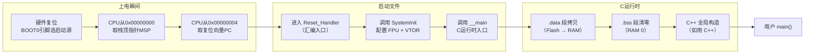
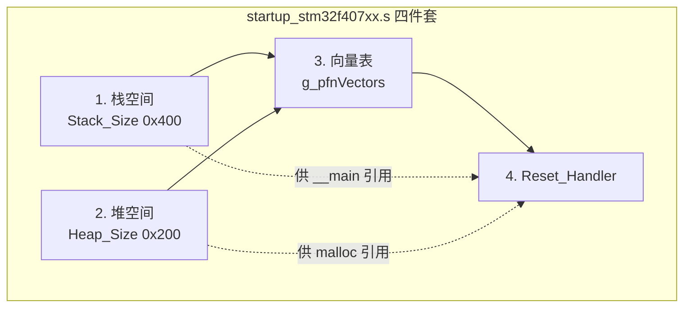
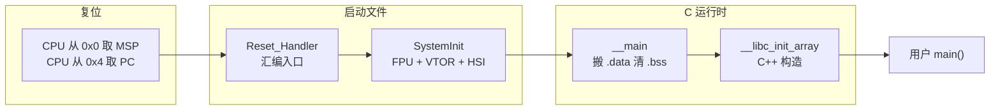

# 【元婴·100】STM32启动流程：从上电到main()经历了什么

> 码农修仙传 · 元婴期 · 第100篇
> 我是玄芯散人，带你从炼气修到大乘。

---

## 境界标识

```
╔══════════════════════════════════╗
║     元婴期 · 第100篇             ║
║     STM32启动流程：从上电到main() ║
║     预计阅读：18分钟             ║
╚══════════════════════════════════╝
```

---

## 修仙引入

道友，你每次按下复位键，芯片都是一片混沌。

寄存器没值，栈指针没初始化，时钟还是出厂默认值，C 语言的全局变量也没被搬进 RAM。按理说，这时候任何 C 代码都不该跑得起来。可你写得 `main()` 函数就是稳稳当当地执行了。

谁替你做了这些前置工作？谁知道栈顶该放在哪？谁记得要把 `main()` 之前的所有环境搭好？

答案藏在两个你平时不太翻的地方：`startup_stm32f407xx.s` 这个汇编启动文件，还有 ARM 编译器内建的 `__main` 函数。这一篇，就把这条开天辟地的链路走一遍。

修真界讲究"窥探天机"。嵌入式这条路上，窥探天机就是看懂芯片冷启动的全过程。看完这一篇，再看 `SystemInit`、`__main` 这些名字就不会觉得神秘了。

---

## 硬核主体

### 全链路一览

先把整张图摆出来，方便后面一层一层拆。



全链路大概一百行汇编加 C 代码，但每一行都有讲究。下面按顺序拆。

---

### 一、上电那一瞬

按下复位键之后，Cortex-M4 内核的 CPU 处于纯净状态：所有寄存器清零（PC 例外），SP 默认指向栈区末尾，流水线停下，外设都没时钟。

接下来内核做两件事：

1. 从地址 `0x00000000` 读取 4 字节，作为主栈指针 MSP 的初值。
2. 从地址 `0x00000004` 读取 4 字节，作为程序计数器 PC 的初值。

注意这个 `0x00000000`。在 STM32F4 上，这个地址其实是一个别名窗口，按启动模式转到不同物理地址：

```c
/* STM32F4 启动模式由 BOOT0 引脚和 BOOT1 引脚决定。 */
#define FLASH_BASE       0x08000000U  /* 主闪存，默认启动位置 */
#define SYSTEM_MEMORY    0x1FFF0000U  /* 系统存储器，存 ST 出厂 Bootloader */
#define SRAM_BASE        0x20000000U  /* SRAM，常用于调试 */
```

| BOOT0 | BOOT1 | 启动位置 | 0x00000000 实际转到 |
|-------|-------|----------|---------------------|
| 0 | x | 主闪存 | 0x08000000 |
| 1 | 0 | 系统存储器 | 0x1FFF0000 |
| 1 | 1 | SRAM | 0x20000000 |

日常开发几乎都用 BOOT0=0 启动主闪存。把 BOOT0 拉高进入系统存储器，是 ST 出厂 Bootloader 的入口，常用于 ISP 烧录。SRAM 启动一般只在调试器在线加载代码时用。

这里有个常见的误解：很多人以为 CPU 是从 `0x08000000` 开始取第一条指令。其实不是。CPU 只认 `0x00000000`，只是这个地址被总线桥接落到闪存。理解这一点，再看 VTOR 寄存器（向量表偏移）就顺畅了。

---

### 二、向量表的结构

向量表（Vector Table）放在启动区域的起始位置。STM32F407 的向量表大致长这样：

```c
/* startup_stm32f407xx.s 顶部，向量表示例（精简）。 */
__attribute__((section(".isr_vector")))
const uint32_t g_pfnVectors[] = {
    (uint32_t)&_estack,         /* 0x00 初始栈顶（MSP）        */
    (uint32_t)Reset_Handler,    /* 0x04 复位向量（PC 初值）    */
    (uint32_t)NMI_Handler,      /* 0x08 NMI 中断                */
    (uint32_t)HardFault_Handler,/* 0x0C 硬件错误                */
    (uint32_t)MemManage_Handler,/* 0x10 内存管理错误            */
    (uint32_t)BusFault_Handler, /* 0x14 总线错误                */
    (uint32_t)UsageFault_Handler,/* 0x18 用法错误              */
    /* ... 更多中断向量 ... */
    (uint32_t)TIM2_IRQHandler,  /* 定时器2中断                  */
    /* ... */
};
```

向量表有两条规则：

1. 每项 4 字节，对应一个 32 位值。
2. 第一项是初始栈顶，第二项是复位向量地址。从第三项开始才是常规中断向量。

第二项里存的 `Reset_Handler` 地址，就是 CPU 上电后 PC 要跳过去执行的函数。也就是说，CPU 上电之后实际执行的第一行代码，是汇编里写的 `Reset_Handler`。

验证一下：在 STM32F407 上，向量表第一项的栈顶初始值 `_estack` 由链接脚本定义。它通常指向 RAM 最高地址 + 1，比如 `0x20020000`（因为 F407 的 SRAM 是 128KB，从 `0x20000000` 开始）。

```ld
/* STM32F407 链接脚本（STM32F407VGTX_FLASH.ld）摘录。 */
_estack = 0x20020000;    /* RAM 末尾 + 1，作为栈顶初值 */
```

CPU 上电后，`MSP = 0x20020000`（也就是 `_estack` 的值）。栈是满递减结构，每次 `PUSH` SP 减 4 再写入数据；首次 `PUSH` 之后 MSP 才变成 `0x2001FFFC`。

---

### 三、启动文件 startup_stm32f407xx.s 拆解

启动文件（startup file）是一份精简的汇编源文件，由 ST 官方随 HAL 库提供。它做四件事：



#### 3.1 栈和堆定义

```asm
; 栈空间：1KB。这是给中断和局部变量用的。
Stack_Size      EQU     0x400

                AREA    STACK, NOINIT, READWRITE, ALIGN=3
Stack_Mem       SPACE   Stack_Size
__initial_sp    EQU     0       ; 占位，下面会重写

; 堆空间：512字节。这是给 malloc 用的（RTOS 内部分配也要它）。
Heap_Size       EQU     0x200

                AREA    HEAP, NOINIT, READWRITE, ALIGN=3
__heap_base
Heap_Mem        SPACE   Heap_Size
__heap_limit
```

栈大小可以根据项目调整。如果中断嵌套深，或者局部变量大，再或者函数调用链长，三者都要留足余量。HAL 库项目一般给 0x1000（4KB）或更大，否则经常 `HardFault`。

#### 3.2 复位中断处理函数

启动文件的戏肉是 `Reset_Handler`。它要做两件事：调 `SystemInit`，调 `__main`。

```asm
                AREA    |.text|, CODE, READONLY

; ------------------------------------------------------------
; 复位向量：上电后 CPU 跳到这里
; ------------------------------------------------------------
Reset_Handler   PROC
                EXPORT   Reset_Handler             [WEAK]
                IMPORT   SystemInit
                IMPORT   __main

                LDR      R0, =SystemInit          ; 把 SystemInit 地址装入 R0
                BLX      R0                       ; 调到 SystemInit（C 函数）
                LDR      R0, =__main              ; 把 __main 地址装入 R0
                BX       R0                       ; 调到 __main（永不返回）

                ENDP
```

这一段只有四行可用代码。第一行把 `SystemInit` 的地址装入 R0，第二行带链接跳转过去（BLX 会把返回地址存到 LR，并切换指令集状态）。`SystemInit` 返回后，第三、四行跳到 `__main`，注意 `__main` 不返回，所以用 `BX` 而不是 `BLX`（BX 不写 LR，但同样会按目标地址最低位切换 Thumb/ARM 状态）。

汇编细节：

- `IMPORT` 声明外部符号，由链接器从 `system_stm32f4xx.c` 和 ARM 运行时库解析。
- `BLX` 跳转时把返回地址写入 LR。`BX` 只跳转，不写 LR。两者都会按目标地址最低位自动切换 Thumb/ARM 状态。
- `__main` 这个符号要看工具链。ARMCC / Keil MDK 里 `__main` 是 ARM 编译器自带的 C 运行时入口；GCC 工具链（`arm-none-eabi-gcc` + newlib）则用 `_start`，里面调 `__libc_init_array` 之后再调 `main`。文章里的 `Reset_Handler` 写法是 ARMCC 风格的，GCC 工程里多半改用 `_start`。

#### 3.3 默认中断处理函数

启动文件还定义了 `Default_Handler`：

```asm
Default_Handler PROC
                EXPORT  Default_Handler           [WEAK]
                B       .                         ; 死循环
                ENDP
```

它是一个无限循环。当某个中断被触发但没有用户实现的中断服务函数（IRQHandler）时，链接器会把这个默认实现链上。这样做的好处是：就算没写某个中断处理函数，CPU 也不会跳到 `0x00000000` 引发 HardFault，而是卡在这里让你看到死机现象。

`[WEAK]` 是弱定义的 ARM 汇编扩展标识。你在自己代码里写了 `void TIM2_IRQHandler(void)` 之后，链接器会用你的版本覆盖这个默认实现。这是 C 标准里没有的 ARM 汇编扩展，但嵌入式开发里天天见。

---

### 四、SystemInit：时钟与 FPU 初始化

`SystemInit` 函数定义在 `system_stm32f4xx.c` 里，由 ST 提供。它在上电后第一件事是打开 FPU，第二件事是配置向量表偏移，第三件事是复位时钟系统。

```c
/* system_stm32f4xx.c 摘录（简化版）。 */
void SystemInit(void)
{
    /* 1. 打开 FPU 全权限（CPACR 寄存器）。 */
    #if (__FPU_PRESENT == 1) && (__FPU_USED == 1)
    SCB->CPACR |= ((3UL << 10*2) | (3UL << 11*2));  /* CP10 + CP11 全访问 */
    #endif

    /* 2. 把向量表偏移寄存器 VTOR 设回 Flash 起始。 */
    SCB->VTOR = FLASH_BASE | VECT_TAB_OFFSET;       /* 0x08000000 */

    /* 3. 复位 RCC 时钟配置（HSI 默认 16MHz）。 */
    RCC->CR |= RCC_CR_HSION;
    RCC->CFGR = 0x00000000U;                        /* HSI 作系统时钟 */
    RCC->CR &= ~(RCC_CR_HSEON | RCC_CR_CSSON |
                  RCC_CR_PLLON | RCC_CR_PLLI2SON);

    /* 4. 关闭所有中断，清除所有挂起位。 */
    RCC->CIR = 0x00000000U;
    
    /* 5. （HAL 库版本）调用 SystemCoreClockUpdate。 */
    SystemCoreClock = HSI_VALUE;                     /* 此时还是 16MHz */
}
```

几个留意点：

第一，FPU 必须在 `__main` 之前打开。如果你用 `__FPU_USED = 1` 编译选项（在 Target 选项里勾选 Use FPU），编译器会在函数入口自动生成 `VFP FPSCR` 初始化指令。如果 FPU 没开，第一条浮点指令就会触发 `UsageFault`。

第二，VTOR 必须配置。`SCB->VTOR` 是向量表偏移寄存器。它决定了 CPU 找向量表的基地址。默认 `0x08000000`，如果你将来要写 IAP 升级（112 篇 Bootloader），就需要把 VTOR 改到新位置。

第三，默认时钟是 HSI 16MHz。`SystemInit` 执行完之后，系统还是跑在内部 RC 振荡器 16MHz 上。要切到 168MHz 的 PLL，必须在用户 `main()` 里调用 `SystemClock_Config()`。

> 这部分下一篇 101《时钟树是修炼灵脉：RCC 与 PLL 全链路》会展开。

---

### 五、`__main`：C 运行时入口

`SystemInit` 返回后，跳到 `__main`。这个符号在源码里找不到，但工具链会把它链接进来。需要注意的是不同工具链的实现不同：

- ARMCC / Keil MDK：`__main` 是 ARM Compiler 自带的运行时入口，会做 `.data` 拷贝、`.bss` 清零、跳转 `main()`。
- GCC（arm-none-eabi-gcc）：入口是 `_start`（newlib 提供），内部调 `__libc_init_array` 完成 C++ 全局构造，再调 `main()`。

下面是 ARMCC 风格的伪代码：

```c
/* ARM 运行时库的 __main（伪代码）。 */
__attribute__((noreturn))
void __main(void)
{
    /* 1. 拷贝 .data 段到 RAM。 */
    /*    _sidata 在 Flash，_sdata 在 RAM，_edata 是结束地址。 */
    uint32_t *src = &_sidata;
    uint32_t *dst = &_sdata;
    while (dst < &_edata) {
        *dst++ = *src++;
    }

    /* 2. .bss 段清零。 */
    dst = &_sbss;
    while (dst < &_ebss) {
        *dst++ = 0;
    }

    /* 3. 初始化 C 库（设置 errno、stdout 等）。 */
    __rt_lib_init();

    /* 4. 调用 C++ 全局构造函数（C++ 工程才有）。 */
    /*    __libc_init_array 遍历 .preinit_array 和 .init_array。 */
    __libc_init_array();

    /* 5. 终于跳到用户的 main()。 */
    main();

    /* 6. 如果 main 返回，进入退出流程（嵌入式一般死循环）。 */
    exit(main_return_value);
}
```

这一段做了嵌入式工程看不见的工作：

#### 5.1 `.data` 段的来龙去脉

`uint32_t my_value = 0x12345678;` 这种带初始值的全局变量，编译后存放在 Flash 的 `.data` 段。但 CPU 跑的时候要从 RAM 里访问（不然写不了）。所以上电时必须把这段数据搬到 RAM 对应位置。

链接脚本里定义了四个留意符号：

```ld
/* 链接脚本摘录。 */
_sidata = LOADADDR(.data);     /* .data 在 Flash 的加载地址 */
_sdata  = ADDR(.data);         /* .data 在 RAM 里的起始地址 */
_edata  = ADDR(.data) + SIZEOF(.data);  /* .data 结束地址 */

_sbss   = ADDR(.bss);          /* .bss 起始地址 */
_ebss   = ADDR(.bss) + SIZEOF(.bss);    /* .bss 结束地址 */
```

运行时，CPU 把 `_sidata` 到 `_edata` 区间的内容，一个字一个字拷到 RAM 的 `_sdata` 到 `_edata` 区间。这段代码就是 `__main` 里那两行 `while`。

#### 5.2 `.bss` 段为什么不用拷

`static uint8_t buf[1024];` 这种零初始化的全局变量，把 "0" 写进 Flash 会浪费空间。编译器只记录它的 RAM 起始地址和大小，运行前把 RAM 对应区间清零就行。这就是 `.bss` 段。

#### 5.3 C++ 全局构造

如果你用 C++，`__libc_init_array` 会遍历 `.preinit_array` 和 `.init_array` 两张函数指针表，依次调用里面的构造函数。这就是为什么你在 C++ 里写一个全局对象，构造函数会被自动调用：

```cpp
class Hardware {
public:
    Hardware() {
        GPIO_Init();   /* 上电时自动运行 */
    }
} g_hw;
```

`g_hw` 的构造函数在 `__main` 里被调用，早于 `main()`。

---

### 六、终于到 `main()`

`__main` 调完所有前置工作，最后调 `main()`。

到这里，用户写的代码才真正开始执行。回顾整条链路：



常见的 `main()` 长这样：

```c
/* 用户 main() 的最小骨架。 */
int main(void)
{
    /* 1. HAL 库初始化（SysTick、中断分组）。 */
    HAL_Init();

    /* 2. 配置系统时钟到 168MHz。 */
    SystemClock_Config();

    /* 3. 初始化外设（GPIO、UART 等）。 */
    MX_GPIO_Init();
    MX_USART1_UART_Init();

    /* 4. 进入主循环。 */
    while (1) {
        /* 业务代码 */
    }
}
```

注意：`HAL_Init()` 是 ST HAL 库提供的，它内部会用 SysTick 实现 1ms 时基。`SystemClock_Config()` 一般在 HAL 模板里自动生成，是切到 PLL 168MHz 的地方。

---

### 七、调试技巧：怎么验证启动流程

学完上面的链路，至少要会用三种方法验证：

方法 1：断点法。在 `Reset_Handler` 第一行打断点，单步走完，观察 PC 跳到 `SystemInit`、`__main`、`main` 的全过程。IDE 会显示汇编窗口。

方法 2：MAP 文件法。编译后看 `.map` 文件：

```bash
arm-none-eabi-objdump -h build/stm32f407.elf | head -30
```

输出里能直接看到 `.isr_vector`、`Reset_Handler`、`__main` 这些符号的地址：

```
.isr_vector   0x08000000   0x188  startup_stm32f407xx.o
.text         0x08000188   0x...  startup_stm32f407xx.o  + main.o
.data         0x20000000   0x...  LOADADDR 0x0800xxxx
.bss          0x20000xxx   0x...
```

方法 3：反汇编法。

```bash
arm-none-eabi-objdump -d build/stm32f407.elf | grep -A 5 "Reset_Handler"
```

看 `Reset_Handler` 的前 5 条指令，是不是 `LDR R0, =SystemInit; BLX R0; LDR R0, =__main; BX R0`。

---

### 八、常见误区

误区 1：SystemInit 之后时钟就是 168MHz

错。默认还是 HSI 16MHz。`SystemInit` 只复位时钟寄存器，让系统跑在安全的默认值。要切到 PLL，必须在 `main()` 里再调 `SystemClock_Config()`。下一篇 101 会展开这块。

误区 2：栈是从 `_estack` 往下增长的，跟我想的路线不一样

栈是满递减结构。`_estack` 是初始 SP 的值，指向 RAM 末尾 + 1。第一条 `PUSH` 指令把 SP 减 4，再把数据存到 SP 处。所以栈"往下"长（地址减小）。

误区 3：中断向量表只能放在 Flash

错。`SCB->VTOR` 可以改写。Bootloader 升级（112 篇）的重点就是改 VTOR 切向量表。

误区 4：`__main` 是用户写的

错。`__main` 是 ARMCC / Keil 工具链的运行时库符号。GCC 工程（`arm-none-eabi-gcc` + newlib）的入口是 `_start`，由 `crt0.o` 之类的库提供。普通用户代码里搜不到它们，但通过反汇编能看到。

---

### 启动文件 vs 链接脚本 vs 运行时库

这三者配合工作，容易混淆：

| 角色 | 提供的文件 | 干什么 |
|------|------------|--------|
| 启动文件 | `startup_stm32f407xx.s` | 提供 `Reset_Handler` 和栈定义和向量表 |
| 链接脚本 | `STM32F407VGTX_FLASH.ld` | 决定各段放哪，含 `_sidata`/`_sdata`/`_sbss` 地址 |
| 运行时库 | `arm-none-eabi-` 自带 | 提供 `__main` 和 C 库函数 |

这三者必须相互对得上。例如：链接脚本里定义的 `_sdata` 符号，启动文件里的 `Reset_Handler` 不直接用它，但 `__main` 会用。如果链接脚本里写错了地址，`__main` 会把 `.data` 段拷到错误地方，`main()` 里的全局变量初值全是乱码。

---

## 修仙术语对照表

| 修仙术语 | 技术现实 | 本篇位置 |
|----------|----------|----------|
| 开天辟地 | STM32 上电启动全过程 | 全文骨架 |
| 混沌初开 | CPU 复位后的初始状态 | 第一段 |
| 天道法则 | Cortex-M4 启动协议（从 0x0 取 MSP） | 第一段 |
| 灵脉泉眼 | 时钟源（HSI / HSE / PLL） | 第四段 |
| 接引法阵 | 向量表（中断向量排布） | 第二段 |
| 灵台方寸 | 复位向量 `Reset_Handler` 地址 | 第二段 |
| 祭坛之地 | 启动文件 `.s` 汇编源码 | 第三段 |
| 紫气东来 | 打开 FPU 浮点运算单元 | 第四段 |
| 符箓搬运 | `.data` 段写入 RAM | 第五段 |
| 灵台清扫 | `.bss` 段清零 | 第五段 |
| 登天梯 | C 运行时 `__main` | 第五段 |
| 元婴出窍 | 用户 `main()` 入口 | 第六段 |
| 窥探天机 | 理解启动链路 | 全文 |
| 推演术数 | 反汇编 / MAP 文件验证 | 第七段 |
| 误区破障 | 启动流程常见误解 | 第八段 |

---

## 进阶条件

启动流程这条链路，看完一遍还不算过。读完后请自检：

- [ ] 能默写出 `0x00000000` 取 MSP、`0x00000004` 取 PC 的内核行为
- [ ] 能说出向量表第一项和第二项分别是什么
- [ ] 能区分 BOOT0 三种启动模式对应的物理地址
- [ ] 能解释 `Reset_Handler` 里 `BLX R0` 和 `BX R0` 的差别
- [ ] 能解释 `SystemInit` 之后时钟为什么还是 HSI 16MHz
- [ ] 能解释 `.data` 段为什么必须拷到 RAM，`.bss` 段为什么免去
- [ ] 能用 `arm-none-eabi-objdump -h` 在 MAP 文件里找到 `__main` 符号
- [ ] 能解释 `SCB->VTOR` 在 Bootloader 用法里的用途

如果有一项卡住，回到对应章节重读一遍。这条链路是 101 时钟树和 102 中断 NVIC 的地基，地基不稳，上层全塌。

---

## 下期预告 + 互动

下一篇：101 时钟树是修炼灵脉：RCC 与 PLL 全链路。这一篇讲 STM32F4 的时钟系统：HSI / HSE / PLL 三个时钟源怎么选，AHB / APB1 / APB2 怎么分频，PLL 把 8MHz 晶振倍频成 168MHz。看完之后，"为啥 `HAL_Delay(1000)` 真的就是 1 秒"这种问题就再也不会困住你。

互动问题：

1. 你平时调试 STM32 启动，最先查的是哪个寄存器？是 `SCB->VTOR`、`RCC->CFGR`，还是别的？
2. `SystemInit` 之后时钟还是 HSI 16MHz 这件事，你之前踩过坑吗？比如外设跑不动或者 `HAL_Delay` 不准？
3. 你用过 `arm-none-eabi-objdump` 看过自己的固件吗？看到 `__main` 的时候是什么感觉？

评论区聊聊你的启动调试经历。

---

*本文是「码农修仙传」系列第100篇。系列导航见 [xren.ren](https://xren.ren)*