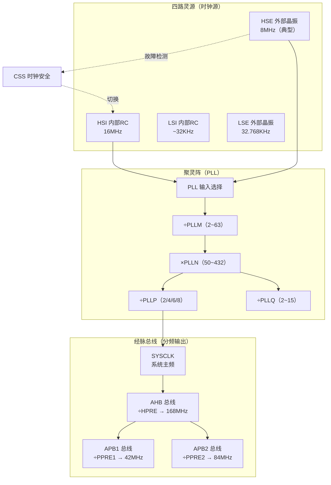
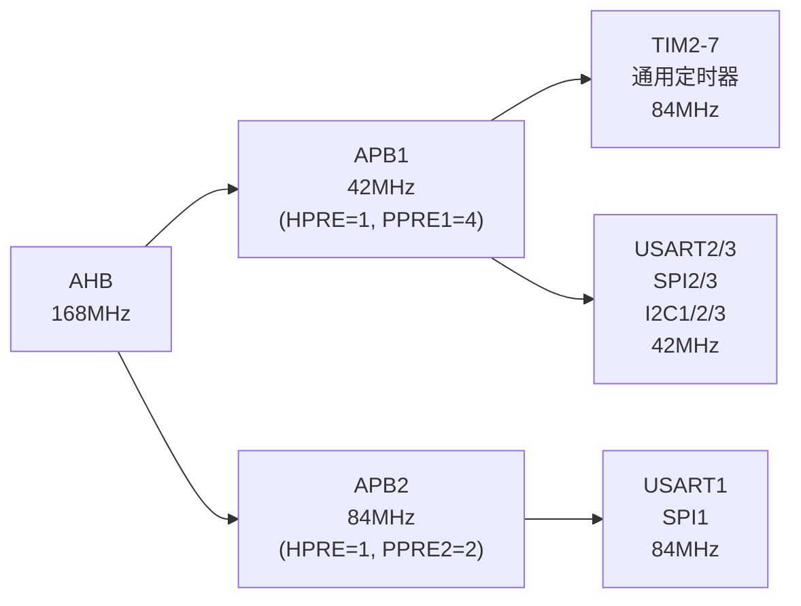
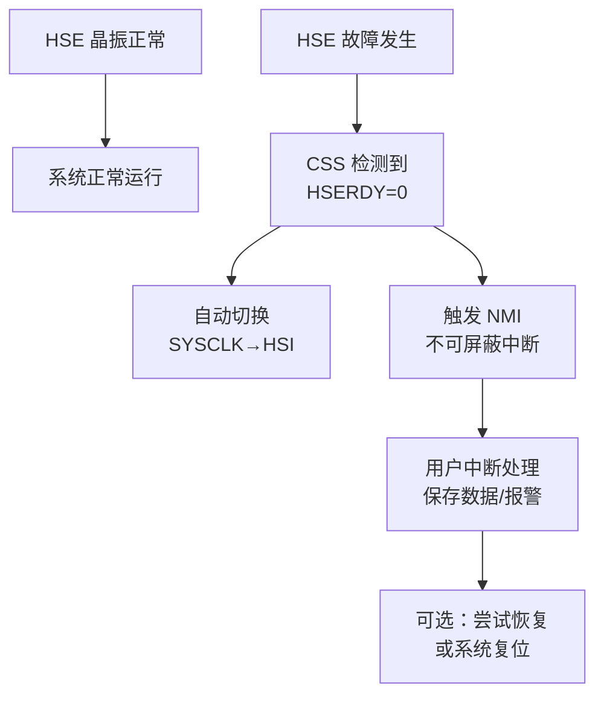

# 【元婴·101】时钟树是修炼灵脉：RCC与PLL全链路

> 码农修仙传 · 元婴期 · 第101篇
> 我是玄芯散人，带你从炼气修到大乘。

---

## 境界标识

```
╔══════════════════════════════════╗
║     元婴期 · 第101篇              ║
║     时钟树是修炼灵脉：RCC与PLL全链路 ║
║     预计阅读：20分钟              ║
╚══════════════════════════════════╝
```

---

## 修仙引入

上一篇讲到 `SystemInit` 跑完，时钟还停在 HSI 16MHz。这是为啥？

道友要知道，MCU 就像一座修真大阵，整座阵法要运转，必须有一条稳定的主灵脉。灵脉从哪涌出来，按什么节拍分配给众多外设，全靠一块叫 RCC（Reset and Clock Control，复位与时钟控制）的调度令牌。

而要让灵脉从涓涓细流（8MHz 晶振）变成滔滔大河（168MHz），就需要一座聚灵阵——PLL（Phase-Locked Loop，锁相环）。

这条从 HSE/HSI 一路倍频再分频，最终落到每个外设的链路，就是 STM32 的时钟树。看懂它，`HAL_Delay(1000)` 真的就是 1 秒，UART 波特率算得明明白白，外设跑不动也能定位到灵脉堵点。

修真界讲究"通晓灵脉"。嵌入式这条路，通晓灵脉就是吃透 RCC 与 PLL。

---

## 硬核主体

### 全局一览：MCU 的灵脉调度图

先把整张图摆出来，后面按模块拆解。



光看图可能觉得抽象。下面按"灵源 → 聚灵阵 → 总线经脉"的顺序一层层讲。

---

### 一、四个时钟源：灵脉的四条起源

STM32F407 有四个时钟源，对应四种不同性质的灵脉起源。

#### 1.1 HSI：内部 RC 振荡器

```c
/* STM32F4 芯片头文件定义（节选）。 */
#define HSI_VALUE    ((uint32_t)16000000)   /* 16MHz 内部 RC */
```

HSI（High-Speed Internal）是芯片出厂自带的 RC 振荡器，频率 16MHz。

修真类比：像宗门地底自带的一眼温泉，不用开凿就能用，但水质不纯，会随温度漂移（精度差，±1% 左右，温漂较大）。

优点：上电默认就用，不需要任何外部器件；启动快（μs 级）。
缺点：精度差，受温度电压干扰大；不适合做 UART 精确波特率，也不适合 RTC 等需要长期稳定频率的场合。

#### 1.2 HSE：外部高速晶振

```c
#define HSE_VALUE    ((uint32_t)8000000)    /* 8MHz 外部晶振（开发板常用） */
#define HSE_STARTUP_TIMEOUT  ((uint16_t)0x0500)  /* 启动超时 ~100ms */
```

HSE 走外部晶振或时钟输入，开发板常用 8MHz，也有 12MHz、25MHz 这些规格的产品可用。HSE 必须等晶振起振稳定（HSERDY=1）才能用，否则一切基于它的下游都会罢工。

修真类比：像从灵山上引下来的活水，水质纯净稳定（精度 ±10ppm 级），但要先开渠（外部电路）、等水流稳定（启动延时）。

开发板上几乎都是 HSE=8MHz 一路到底，把后续 PLL 拉到 168MHz。后面实战就按这个配置走。

#### 1.3 LSI：内部低速 RC

```c
#define LSI_VALUE    ((uint32_t)32000)      /* ~32KHz 内部低速 RC */
```

LSI（Low-Speed Internal）约 32KHz，给独立看门狗（IWDG）和 RTC 用。

修真类比：地窖里的小水洼，涓涓细流但胜在一直有。主要给"守山门"的看门狗（109 篇要详谈）。

#### 1.4 LSE：外部低速晶振

```c
#define LSE_VALUE    ((uint32_t)32768)      /* 32.768KHz，RTC 专用 */
```

LSE（Low-Speed External）标准 32.768KHz 晶振，专供 RTC（实时时钟）。

修真类比：宗门大殿里那座古老的滴漏钟，精度高，敲点准（2^15 = 32768，分频到 1Hz 刚好一秒一次）。

#### 1.5 四源对照表

| 时钟源 | 频率 | 精度 | 用途 | 修真类比 |
|--------|------|------|------|----------|
| HSI | 16MHz | ±1%（温漂大） | 上电默认、系统备份 | 地底温泉 |
| HSE | 8MHz（典型） | ±10ppm | PLL 输入、精准外设 | 灵山活水 |
| LSI | ~32KHz | 较差 | IWDG、RTC 备份 | 地窖水洼 |
| LSE | 32.768KHz | ±20ppm | RTC 主时钟 | 滴漏古钟 |

---

### 二、PLL：把 8MHz 变成 168MHz 的聚灵阵

光有 HSE 8MHz 还不够，Cortex-M4 主频想跑满 168MHz，得靠 PLL 倍频。

#### 2.1 PLL 的工作原理

修真类比：PLL 是把涓涓细流引入阵眼，通过灵阵共振把灵气密度放大几十倍，最终涌出比源头猛烈百倍的灵流。

#### 2.2 PLL 的寄存器配置

STM32F407 的 PLL 配置由 `RCC->PLLCFGR` 控制，里面有五个位域：

```c
/* RCC PLL 配置寄存器（简化）。 */
typedef struct {
    uint32_t PLLM   : 6;   /* 0-5   位：PLL 输入分频，2~63 */
    uint32_t PLLN   : 9;   /* 6-14  位：PLL 倍频，50~432 */
    uint32_t PLLP   : 2;   /* 16-17 位：PLL 输出分频，2/4/6/8 */
    uint32_t PLLSRC : 1;   /* 22    位：PLL 输入源，0=HSI, 1=HSE */
    uint32_t PLLQ   : 4;   /* 24-27 位：USB OTG/SDIO/RNG 时钟分频 */
    uint32_t PLLR   : 3;   /* 28-30 位：F407 没用到 */
} RCC_PLLCFGR_t;

#define RCC_PLLCFGR_ADDR   0x40023808U   /* RCC 基址 0x40023800 + 偏移 0x08 */
```

#### 2.3 计算 168MHz 的实际算式

要把 HSE 8MHz 变成 SYSCLK 168MHz，标准配置是：

```
SYSCLK = HSE × PLLN / (PLLM × PLLP)
       = 8MHz × 336 / (8 × 2)
       = 8 × 336 / 16
       = 168 MHz ✓
```

也就是说：

| 参数 | 取值 | 用途 |
|------|------|------|
| PLLM | 8 | 把 8MHz 先降到 1MHz（VCO 输入要求 1~2MHz） |
| PLLN | 336 | VCO 振荡到 336MHz |
| PLLP | 2 | 降到 SYSCLK 168MHz |
| PLLQ | 7 | 给 USB OTG FS 单独提供 48MHz（336/7=48） |

修真类比：PLLM 是引水渠（让涓流先平稳下来），PLLN 是聚灵阵眼，PLLP 是出阵闸门（按下游需求再次分压）。三段缺一不可。

⚠️ 待确认要点：VCO 输入频率范围不同文档略有差异，RM0090 给的是 1~2MHz（实测 HSE/PLLM 落在 1~2MHz 之间最稳）。

---

### 三、总线分频：把灵脉送到每个弟子手里

SYSCLK 跑出来 168MHz 之后，并不是所有外设都吃这个频率。外设分属不同总线，每条总线有自己的频率上限。



#### 3.1 三条总线的分工

| 总线 | 频率上限 | 典型分频 |
|------|----------|----------|
| AHB | 168MHz | HPRE=1（不分频） |
| APB1 | 42MHz | PPRE1=4（÷4） |
| APB2 | 84MHz | PPRE2=2（÷2） |

挂载外设大致分布：

- AHB：CPU 内核、DMA 与 SDIO，还有 USB OTG FS。
- APB1：USART2/3，SPI2/3，I2C1-3，TIM2 至 TIM7，CAN。
- APB2：USART1，SPI1，TIM1/8-11，ADC1-3，GPIOA-I。

修真类比：AHB 是宗门主脉，气势磅礴；APB1 是主脉分出的支脉，要照顾内门弟子（慢速外设）；APB2 是给真传弟子（高速外设）用的快脉。分频器就是每处分灵台。

#### 3.2 定时器时钟的特殊处理

有个新手容易忽略的细节：当 APB1 分频系数 ≠ 1 时，挂载在 APB1 上的通用定时器（TIM2-7）时钟会被自动 ×2。

也就是说：

```c
/* APB1=42MHz，APB1 上的定时器时钟 = 2 × 42MHz = 84MHz（F407 定时器上限）。 */
#define APB1_TIMER_CLOCK    (APB1_CLK * 2)   /* TIM2-7, 84MHz */
/* APB2=84MHz，APB2 上的定时器时钟 = 2 × 84MHz = 168MHz（F407 定时器最高时钟）。 */
#define APB2_TIMER_CLOCK    (APB2_CLK * 2)   /* TIM1/8/9/10/11, 168MHz */
```

这里有个常被忽略的细节：当某个 APB 预分频系数 ≠ 1 时，挂在这条总线上的定时器输入时钟都会被硬件自动 ×2。所以：

- APB1（PPRE1=4）上的 TIM2-7：42MHz × 2 = 84MHz，正好等于 F407 定时器上限 84MHz，没浪费。
- APB2（PPRE2=2）上的 TIM1/8/9/10/11：84MHz × 2 = 168MHz，等于 F407 定时器最高频率 168MHz。

修真类比：定时器这种"特殊弟子"自带双倍灵脉待遇，正好够着宗门律法给的上限。APB1 上限 84MHz 是真传弟子里偏慢的几位；APB2 上的则直接拉到 168MHz 真传顶配。

#### 3.3 分频配置位

分频系数在 `RCC->CFGR` 寄存器里：

```c
/* RCC_CFGR 位域定义。 */
#define RCC_CFGR_HPRE_DIV1    0x0U   /* AHB 不分频 */
#define RCC_CFGR_PPRE1_DIV4   0x5U   /* APB1 ÷4（位 [10:8]=0b101） */
#define RCC_CFGR_PPRE2_DIV2   0x4U   /* APB2 ÷2（位 [13:11]=0b100） */
```

注意 PPRE 的位域值 ≠ 分频系数。要 ÷4 要写 0b101，÷2 要写 0b100。这是手册里的"特殊编码"，见多了就习惯了。

---

### 四、CSS：时钟安全的最后一道护山大阵

修真界有句话：灵脉一断，宗门崩塌。芯片也一样：HSE 一旦挂了（晶振虚焊、电磁干扰），整个系统要么罢工，要么跑飞。

CSS（Clock Security System，时钟安全系统）就是为了应对 HSE 故障而设。

#### 4.1 CSS 工作机制



修真类比：CSS 是宗门的护山大阵。一旦主灵脉（HSE）断了，大阵自动把灵气来源切到地底温泉（HSI），同时拉响九天玄雷（NMI 中断），让值守长老赶紧处理。

#### 4.2 CSS 寄存器配置

```c
/* 打开 CSS 的代码（简化）。 */
void ClockSecurity_Enable(void)
{
    /* 1. 打开 CSS 位。RM0090 第 7.3.1 节：CSSON 一旦使能不可关闭，
       直到下次系统复位。 */
    RCC->CR |= RCC_CR_CSSON;

    /* 2. （可选）使能 CSS 中断。
       RCC->CIER 寄存器的 CSSIE 位。 */
    RCC->CIER |= RCC_CIER_CSSIE;

    /* 3. NMI 中断必须连到处理函数，CMSIS 库提供 NMI_Handler 弱定义。 */
}
```

⚠️ 待确认细节：`RCC_CR_CSSON` 一旦置位，要等到下一次系统复位才能清零。这是 ST 出于安全考虑的设计，避免故障中途被人为关掉。

#### 4.3 CSS 触发后的处理

CSS 触发后，CPU 会跳到 `NMI_Handler`（默认是无限循环）。用户必须自己实现这个函数：

```c
/* NMI 处理函数（用户实现）。 */
void NMI_Handler(void)
{
    if (RCC->CIR & RCC_CIR_CSSF) {     /* 确认是 CSS 触发 */
        RCC->CIR |= RCC_CIR_CSSC;       /* 写 1 清除 CSS 标志位 */

        /* 这里做紧急处理：保存现场、点亮故障灯、记录日志。 */
        Emergency_Log("HSE 时钟故障，已切换 HSI");

        /* 大多数产品选择系统复位，让系统从干净状态重启。 */
        NVIC_SystemReset();
    }
}
```

修真类比：NMI 是宗门最高级别警报。一旦响，所有弟子都得停下手上活，听值守长老发落。

#### 4.4 CSS 的局限性

CSS 不是万能的：

- 只检测 HSE 故障，LSI/LSE 出问题 CSS 不会动。
- 切换到 HSI 后频率变 16MHz，UART 波特率会跑偏，需要重新配置。
- 如果 HSE 故障是偶发的（比如板子抖了一下），系统会在 HSI 下继续运行，但性能大幅下降。

---

### 五、实战：把 STM32F407 拉到 168MHz

光看原理不顶用，下面动手写一份全流程的时钟配置代码。

#### 5.1 HAL 库版本（最常见）

```c
/* system_clock.c —— 用 HAL 库把系统切到 168MHz。
   函数名与 STM32CubeMX 生成的 SystemClock_Config 一致。 */
void SystemClock_Config(void)
{
    RCC_OscInitTypeDef RCC_OscInit = {0};
    RCC_ClkInitTypeDef RCC_ClkInit = {0};

    /* 第一步：打开 HSE，等待晶振稳定。 */
    RCC_OscInit.OscillatorType = RCC_OSCILLATORTYPE_HSE;
    RCC_OscInit.HSEState       = RCC_HSE_ON;
    RCC_OscInit.PLL.PLLState   = RCC_PLL_ON;
    RCC_OscInit.PLL.PLLSource  = RCC_PLLSOURCE_HSE;

    /* PLL 参数：8MHz × 336 / (8 × 2) = 168MHz。 */
    RCC_OscInit.PLL.PLLM = 8;
    RCC_OscInit.PLL.PLLN = 336;
    RCC_OscInit.PLL.PLLP = RCC_PLLP_DIV2;     /* SYSCLK = 168MHz */
    RCC_OscInit.PLL.PLLQ = 7;                 /* USB OTG FS = 48MHz */

    if (HAL_RCC_OscConfig(&RCC_OscInit) != HAL_OK) {
        Error_Handler();                       /* HSE 起不来或 PLL 失锁 */
    }

    /* 第二步：选 SYSCLK 来源，配置 AHB/APB 分频。 */
    RCC_ClkInit.ClockType = RCC_CLOCKTYPE_SYSCLK |
                            RCC_CLOCKTYPE_HCLK   |
                            RCC_CLOCKTYPE_PCLK1  |
                            RCC_CLOCKTYPE_PCLK2;
    RCC_ClkInit.SYSCLKSource   = RCC_SYSCLKSOURCE_PLLCLK;
    RCC_ClkInit.AHBCLKDivider  = RCC_SYSCLK_DIV1;   /* AHB = 168MHz */
    RCC_ClkInit.APB1CLKDivider = RCC_HCLK_DIV4;     /* APB1 = 42MHz */
    RCC_ClkInit.APB2CLKDivider = RCC_HCLK_DIV2;     /* APB2 = 84MHz */

    if (HAL_RCC_ClockConfig(&RCC_ClkInit, FLASH_LATENCY_5) != HAL_OK) {
        Error_Handler();
    }

    /* 第三步：打开 CSS 作为最后一道护山大阵。 */
    HAL_RCC_EnableCSS();
}
```

几个要点：

- `FLASH_LATENCY_5` 必须设：168MHz 下 Flash 等待要 5 个周期，否则取指错误。
- `HAL_RCC_OscConfig` 内部会等 HSERDY，超时会返回 HAL_TIMEOUT。
- 如果 HSE 没起振（比如板子晶振虚焊），`Error_Handler` 会被调用。

#### 5.2 寄存器版本（修炼寄存器基本功）

HAL 库封装厚，调试时不方便看真正发生了什么。下面写一份寄存器版。

```c
/* register_clock.c —— 寄存器级配置，纯炼元婴基本功。 */
static void SetSysClock_PLL_168MHz(void)
{
    /* 1. 打开 HSE。 */
    RCC->CR |= RCC_CR_HSEON;
    while ((RCC->CR & RCC_CR_HSERDY) == 0) {
        /* 等待 HSE 起振稳定，超时处理见下文。 */
    }

    /* 2. 配置 PLL：8MHz × 336 / (8 × 2) = 168MHz。 */
    RCC->PLLCFGR = (8U   << RCC_PLLCFGR_PLLM_Pos) |   /* PLLM = 8  */
                   (336U << RCC_PLLCFGR_PLLN_Pos) |   /* PLLN = 336*/
                   (0U   << RCC_PLLCFGR_PLP_Pos)  |   /* PLLP = ÷2 */
                   RCC_PLLCFGR_PLLSRC_HSE         |
                   (7U   << RCC_PLLCFGR_PLLQ_Pos);    /* PLLQ = 7  */

    /* 3. 打开 PLL。 */
    RCC->CR |= RCC_CR_PLLON;
    while ((RCC->CR & RCC_CR_PLLRDY) == 0) {
        /* 等待 PLL 锁定。 */
    }

    /* 4. 配置 Flash 等待周期（168MHz → 5 等待）。 */
    FLASH->ACR |= FLASH_ACR_LATENCY_5WS;
    FLASH->ACR |= FLASH_ACR_PRFTEN | FLASH_ACR_ICEN | FLASH_ACR_DCEN;

    /* 5. 配置总线分频：AHB=1, APB1=4, APB2=2。 */
    RCC->CFGR = RCC_CFGR_HPRE_DIV1   |
                RCC_CFGR_PPRE1_DIV4  |
                RCC_CFGR_PPRE2_DIV2;

    /* 6. 切 SYSCLK 到 PLL。 */
    RCC->CFGR |= RCC_CFGR_SW_PLL;
    while ((RCC->CFGR & RCC_CFGR_SWS) != RCC_CFGR_SWS_PLL) {
        /* 等待切换完成。 */
    }

    /* 7. 打开 CSS。 */
    RCC->CR |= RCC_CR_CSSON;
}
```

修真类比：HAL 库就像宗门发放的标准聚灵符，傻瓜式贴上去就灵；寄存器版则要自己掐诀、引导，最后封阵。表面上繁琐，但每一步都看得见摸得着。元婴期就得多走这条路。

#### 5.3 验证：检查时钟频率对不对

配置完怎么验证频率正确？两个办法：

办法 1：用 MCO 引脚把内部时钟输出到示波器。

```c
/* 把 PLL 输出 168MHz 的一半（PLL/2=84MHz）通过 PA8 引脚输出。
   实际工程里一般选 HSI（更安全），示波器一打就看到 16MHz 方波。 */
RCC->CFGR |= RCC_CFGR_MCO1_HSI;          /* 选 HSI 作为 MCO1 输出 */
RCC->CFGR |= RCC_CFGR_MCO1PRE_DIV1;      /* 不分频 */
GPIO_Config_MCO_Pin();                    /* 配置 PA8 为复用推挽输出 */
```

办法 2：用 `HAL_RCC_GetSysClockFreq()` 读寄存器算出来的值。

```c
uint32_t sys_clk = HAL_RCC_GetSysClockFreq();
uint32_t hclk    = HAL_RCC_GetHCLKFreq();
uint32_t pclk1   = HAL_RCC_GetPCLK1Freq();
uint32_t pclk2   = HAL_RCC_GetPCLK2Freq();
/* 期望值：168000000, 168000000, 42000000, 84000000 */
```

修真类比：MCO 是宗门塔顶的望月镜，把灵脉节拍反射出去给外面的长老看；`HAL_RCC_GetSysClockFreq` 是看护山大阵的回执阵纹。两招都能验证配置成功。

---

### 六、常见误区与排错思路

修炼 RCC 与 PLL，最怕的是"明明照手册配了，时钟就是不对"。下面列出几个常见坑。

#### 误区 1：HSE_VALUE 跟实际晶振不一致

很多工程师从 CubeMX 拷贝模板后，改了硬件晶振（比如从 8MHz 改成 12MHz），却忘了改 `HSE_VALUE` 宏。结果：

```c
/* 错误的宏定义（实际晶振 12MHz，但宏还写 8MHz）。 */
#define HSE_VALUE  ((uint32_t)8000000)   /* 错！应该是 12000000 */
```

后果：PLL 算出来的 SYSCLK 会跑到 252MHz，芯片罢工。

修真类比：宗门改换了主水源，却没改护山大阵的灵脉图纸。大阵按 8MHz 算，实际进了 12MHz 的水，溢出来伤人。

#### 误区 2：忘了设 Flash 等待

168MHz 主频下，CPU 比 Flash 快得多。如果不设 `FLASH_LATENCY_5WS`，CPU 取指会读错数据：

```c
/* 漏掉这行，程序随机跑飞。 */
FLASH->ACR |= FLASH_ACR_LATENCY_5WS;
```

修真类比：CPU 是动作飞快的弟子，Flash 是反应慢的藏经阁。两边节奏差太多，弟子去查典籍时拿到的就是错页。

#### 误区 3：APB1 外设算频率忘了 ×2（定时器）

定时器挂 APB1，分频后是 42MHz。但定时器时钟是 84MHz（自动 ×2）。

修真类比：APB1 上的定时器自带双倍灵脉，这是 STM32 给"特殊弟子"的隐性待遇。

#### 误区 4：CSS 触发后没实现 NMI_Handler

`NMI_Handler` 默认是死循环（参考 100 篇 `Default_Handler`）。如果工程里没实现，CSS 触发后系统直接卡死。

修真类比：警报响了没人接，护山大阵拉了没人放，整个宗门就僵在原地。

#### 误区 5：VCO 输入频率超出范围

PLL 的 VCO 输入频率必须在 1~2MHz 之间。如果选 HSE=8MHz、PLLM=2，得 4MHz 喂给 VCO，会让 PLL 失锁。

修真类比：聚灵阵眼对入水速度有严格要求：太急（频率太高）会冲垮阵眼，太缓（频率太低）又激不起共振。

#### 排错思路总结

| 现象 | 排查思路 |
|------|----------|
| 程序不跑 | 检查 `RCC->CR` 的 HSERDY/PLLRDY 是否置位 |
| 串口乱码 | 检查 HSE_VALUE 宏，检查 APB1 分频系数 |
| 跑飞/随机死机 | 检查 Flash 等待周期，检查 VCO 输入频率 |
| 不进中断 | 检查 CSS 是否触发但 NMI_Handler 未实现 |
| USB 不识别 | 检查 PLLQ 是否给到 48MHz |

修真类比：灵脉出问题，先看源（HSERDY），再看阵（PLLRDY），最后查下游经脉。逐段掐诀，比乱猜快得多。

---

### 七、性能调优：什么时候不该满血 168MHz

168MHz 满血跑性能强，但功耗也高（每 MHz 多耗 ~0.3mA）。产品设计要权衡：

| 适用情形 | 推荐配置 | 理由 |
|------|----------|------|
| 数据采集 + 高速处理 | 168MHz 全速 | 性能优先 |
| 低功耗待机 | HSI 16MHz | 功耗优先 |
| RTC 长时间运行 | LSE 32.768KHz | 精度 + 极低功耗 |
| 蓝牙/无线模组 | 通常需要精准 HSE | 射频基准 |

修真类比：满血跑相当于真传弟子全力施法，威力大但真元消耗快。日常巡逻用 HSI 就够，大战时再开 PLL。

---

## 修仙术语对照表

| 修仙术语 | 技术现实 | 本篇位置 |
|----------|----------|----------|
| 灵脉 | 时钟信号（方波） | 全文骨架 |
| 灵源 | 时钟源（HSI/HSE/LSI/LSE） | 第一段 |
| 灵山活水 | HSE 外部晶振 | 第一段 |
| 地底温泉 | HSI 内部 RC | 第一段 |
| 滴漏古钟 | LSE 32.768KHz | 第一段 |
| 地窖水洼 | LSI 内部低速 RC | 第一段 |
| 聚灵阵 | PLL 锁相环 | 第二段 |
| 引水渠 | PLLM 输入分频 | 第二段 |
| 阵眼 | PLLN 倍频 | 第二段 |
| 出阵闸门 | PLLP 输出分频 | 第二段 |
| USB 专用灵支 | PLLQ 分频 | 第二段 |
| 主脉 | AHB 总线 | 第三段 |
| 支脉 | APB1 总线 | 第三段 |
| 快脉 | APB2 总线 | 第三段 |
| 定时器双倍灵脉 | APB1 定时器时钟 ×2 | 第三段 |
| 护山大阵 | CSS 时钟安全系统 | 第四段 |
| 九天玄雷 | NMI 中断 | 第四段 |
| 望月镜 | MCO 引脚输出 | 第五段 |
| 藏经阁 | Flash 存储 | 第六段 |

---

## 进阶条件

时钟树这条链路，看完一遍还不算过。读完后请自检：

- [ ] 能说出 HSI/HSE/LSI/LSE 四个时钟源的频率与典型用途
- [ ] 能默写 168MHz 配置的 PLLM/PLLN/PLLP/PLLQ 取值
- [ ] 能解释 SYSCLK → AHB → APB1/APB2 的分频关系
- [ ] 能解释 APB1 上的通用定时器时钟为什么是 42MHz × 2
- [ ] 能说出 CSS 触发后系统会做哪三件事
- [ ] 能解释 Flash 等待周期与主频的关系
- [ ] 能区分 `RCC_CFGR_PPRE1_DIV4` 的位域值 0b101 与实际分频系数 4 的关系
- [ ] 能用 `arm-none-eabi-objdump` 在 MAP 文件里找到 `SystemClock_Config` 符号

如果有一项卡住，回到对应章节重读一遍。时钟树是后面 102 NVIC 还有 104 UART、105 SPI 的地基，地基不稳，所有依赖时钟的外设都跑不转。

---

## 下期预告 + 互动

下一篇：102 中断与 NVIC。

RCC 把灵脉铺好了，外设终于能按节拍跑起来。可外设遇到紧急事件（比如 UART 收到一字节、定时器溢出），怎么打断 CPU 当前工作去处理？这就是 NVIC（Nested Vectored Interrupt Controller，嵌套向量中断控制器）要解决的问题。

这篇讲 NVIC 的几块拼图：Preemption Priority 与 Sub Priority 这两个优先级字段怎么配，抢占和嵌套在多中断并发时怎么调度，临界区开关的实现，还有 volatile 修饰符和中断共享变量的关系。看完之后，"中断优先级配错导致系统死锁"这种坑就再也不会困住你。

互动问题：

1. 你配置 STM32 时，最先打开的是哪个时钟源？是 HSE、HSI，还是 PLL？
2. 168MHz 配置里那组 PLL 参数（PLLM=8, PLLN=336, PLLP=2），你能在 CubeMX 里手动算一遍吗？换成 HSE=12MHz 又该怎么改？
3. CSS 时钟安全系统你用过吗？在哪些工程里打开？NMI_Handler 里你一般做啥处理？

评论区聊聊你的 RCC 调试经历。

---

*本文是「码农修仙传」系列第101篇。系列导航见 [xren.ren](https://xren.ren)*