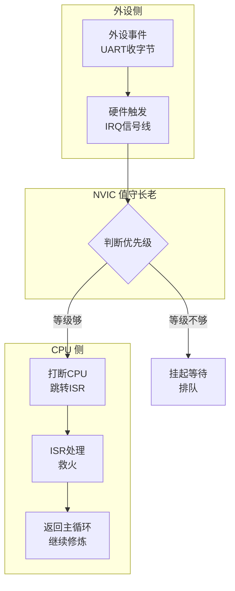
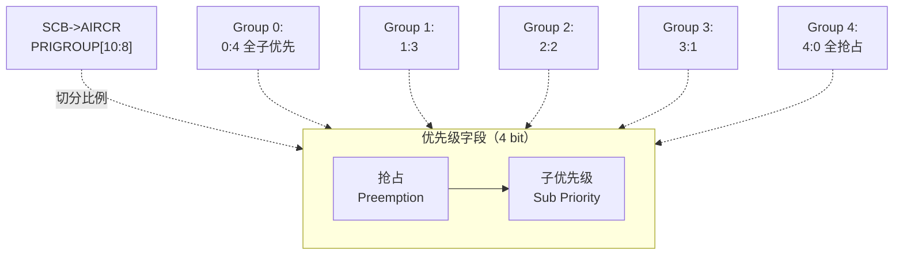
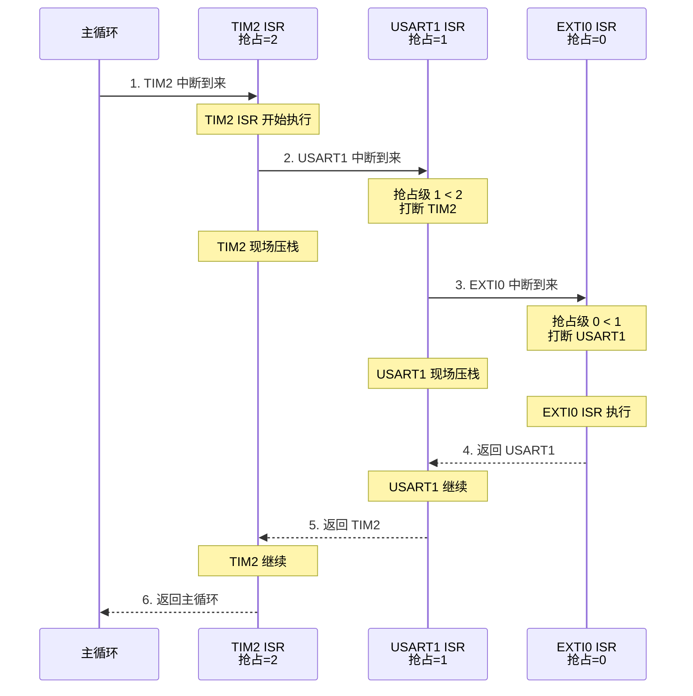
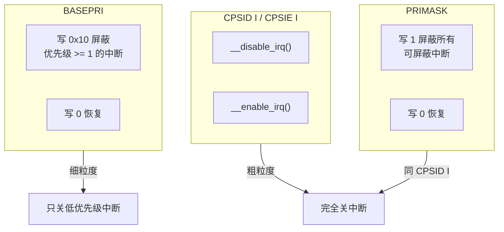

# 【元婴·102】中断与NVIC：抢占、嵌套、临界区

> 元婴期 · 第102篇
> 我是玄芯散人，带你从炼气修到大乘。

---

## 境界标识

```
╔══════════════════════════════════╗
║     元婴期 · 第102篇              ║
║     中断与NVIC：抢占、嵌套、临界区   ║
║     预计阅读：22分钟              ║
╚══════════════════════════════════╝
```

---

## 修仙引入

上一篇 101 把灵脉铺好了，外设按节拍跑起来。可修真界哪有岁月静好。UART 收字节或者定时器溢出，又或者外部按键按下——这些紧急事件随时会来。CPU 正在修炼某道功法（主循环），要不要停下？停下多久？谁先谁后？

修真大阵里的解法是「烽火台」。每个外设都挂一座烽火台，发生紧急事件就点火。值守长老（NVIC）按事先约定的等级，决定要不要打断值守弟子（CPU）当前修炼，去处理哪座烽火台。处理完再回来继续修炼。这就是中断。

这一篇讲 NVIC（Nested Vectored Interrupt Controller，嵌套向量中断控制器）的几块拼图：4 位优先级字段怎么分配给抢占和子优先级，嵌套是怎么发生的，临界区开关用什么指令保护，volatile 在嵌入式里到底解决什么问题。

---

## 硬核主体

### 一、中断是什么：从烽火文书说起

修真界处理紧急事件有完整流程。边关告急文书送到宗门，烽火台点火，值守长老拆开文书看编号（紧急程度），按等级调度救火队。救火队处理完回到岗位，下一份文书到了再处理。

CPU 处理紧急事件也是这套流程：



修真类比：烽火台上的告急文书就是中断请求（IRQ），值守长老拆文书看编号就是 NVIC 判断优先级，跳转到 ISR（Interrupt Service Routine，中断服务函数）就是救火队出动，处理完返回就是救火完毕回岗。

中断和 074 篇讲的 Linux 软中断不是一回事。074 是 Linux 内核在硬中断之上设计的三种下半部机制（softirq/tasklet/workqueue），跑在操作系统里；这一篇讲的是 Cortex-M 硬件层的中断控制器，是 074 那些机制赖以存在的硬件基础。

---

### 二、NVIC：嵌套向量中断控制器

ARM Cortex-M 内核自带一个硬件模块叫 NVIC，挂在 CPU 内部。它的全称里有三个关键词：

- Nested：嵌套，高优先级可以打断低优先级
- Vectored：向量，每个中断对应固定的 ISR 入口地址（中断向量表）
- Interrupt Controller：中断控制器，统一管理所有外设中断

STM32F407（Cortex-M4）的 NVIC 能力：

| 特性 | 数值 |
|------|------|
| 可屏蔽中断数 | 82 个（外设中断） |
| 系统异常槽 | 16 个（含 NMI、HardFault、SysTick 等，前 16 项是 Cortex-M4 标准异常槽） |
| 优先级字段宽度 | 4 bit |
| 优先级分组方式 | 5 种 |

NVIC 的寄存器在内存里有一个固定基址，Cortex-M4 是 `0xE000E000`：

```c
/* NVIC 寄存器对应关系（Cortex-M4 权威手册，STM32F407 沿用）。
   基址 0xE000E000，加上偏移访问具体功能。 */
#define NVIC_BASE           0xE000E000UL

#define NVIC_ISER0          (NVIC_BASE + 0x100)  /* 中断使能寄存器 0 */
#define NVIC_ICER0          (NVIC_BASE + 0x180)  /* 中断除能寄存器 0 */
#define NVIC_ISPR0          (NVIC_BASE + 0x200)  /* 中断挂起寄存器 0 */
#define NVIC_ICPR0          (NVIC_BASE + 0x280)  /* 中断解挂寄存器 0 */
#define NVIC_IABR0          (NVIC_BASE + 0x300)  /* 中断活动位寄存器 0 */
#define NVIC_IPR0           (NVIC_BASE + 0x400)  /* 中断优先级寄存器 0 */
/* ISER/ICER 各 8 个（共 256 bit 覆盖 82 个中断 + 一些保留位）。 */
```

修真类比：NVIC 是宗门里专管告急文书的长老阁。它有一面总墙（基址 0xE000E000），墙上挂着不同的木牌，分别管哪座烽火台该点（ISER）或者该灭（ICER）或者在排队（ISPR）。所有外设的告急文书都得先送到长老阁，由它统一调度。

#### 2.1 中断向量表：每个中断的"门牌号"

上电启动那一瞬（100 篇讲的 `SystemInit` → `__main` → `main`），CPU 已经把中断向量表读到了。STM32F407 的向量表前 16 项是系统异常，后面跟 82 个外设中断：

```c
/* startup_stm32f407.s 中的中断向量表（节选）。
   每个条目 4 字节，是对应 ISR 的入口地址。 */
__Vectors:
    DCD     0                  /* 0  栈顶初始值 */
    DCD     Reset_Handler      /* 1  上电复位入口 */
    DCD     NMI_Handler        /* 2  不可屏蔽中断 */
    DCD     HardFault_Handler  /* 3  硬件错误 */
    DCD     MemManage_Handler  /* 4  内存管理错误 */
    ...
    DCD     SysTick_Handler    /* 15 系统滴答定时器 */
    DCD     WWDG_Handler       /* 16 窗口看门狗 */
    DCD     PVD_Handler        /* 17 电源电压检测 */
    ...
    DCD     USART1_IRQHandler  /* 37 USART1 中断 */
    ...
    DCD     DMA2_Stream0_IRQHandler  /* 56 DMA2 流 0 中断 */
```

每个条目是一个 ISR 函数指针。NVIC 收到中断请求后，会查表找到对应 ISR 的地址，然后让 CPU 跳转过去。这就是 Vectored 的含义——不用软件查表，硬件直接定位入口。

修真类比：中断向量表就是宗门值守长老手里的「烽火台编号 → 救火队地址」对照册。USART1 烽火台起火（IRQ=37），长老翻册第 37 项，喊 `USART1_IRQHandler` 出动。整个过程不用救火队自己找路。

---

### 三、优先级分组：4 位拆给抢占和子级

NVIC 给每个中断分配一个 4-bit 的优先级字段。STM32F407 用高 4 位（[7:4]），低 4 位读出来恒为 0。

问题来了：这 4 bit 怎么切分给「抢占优先级」和「子优先级」？ARM 设计了 5 种切法，由 `SCB->AIRCR` 寄存器的 `PRIGROUP` 字段控制：



具体配置代码：

```c
/* 设置优先级分组为 Group 2（2 bit 抢占，2 bit 子优先级）。
   SCB->AIRCR 是应用中断与复位控制寄存器。
   VECTKEY 字段 [31:16] 必须写 0x05FA，否则写操作被忽略。
   PRIGROUP 字段 [10:8]，Group 2 = 0b010 = 0x02。 */
#define SCB_AIRCR_PRIGROUP_GROUP2   0x05FA0200U   /* Group 2 关键字 */
SCB->AIRCR = SCB_AIRCR_PRIGROUP_GROUP2;   /* 写入即生效，全局唯一 */

/* 配置 USART1 中断优先级为 2（抢占 = 1，子 = 0）。 */
NVIC_SetPriority(USART1_IRQn, 0x10);   /* 0x10=0b00010000，[5:4]=01=抢占级 1 */
/* 配置 EXTI0 中断优先级（抢占 = 0，子 = 0）。
   若意图子优先级 = 1（Group 2 下），应写 0x40（[7:6]=01）。 */
NVIC_SetPriority(EXTI0_IRQn, 0x00);    /* [5:4]=00=抢占级 0，[7:6]=00=子级 0 */
```

各分组的能力对照：

| PRIGROUP | 抢占位数 | 子优先级位数 | 抢占等级 | 子优先级等级 | 嵌套能力 |
|----------|----------|--------------|----------|--------------|----------|
| 0 | 0 | 4 | 1 | 16 | 无嵌套 |
| 1 | 1 | 3 | 2 | 8 | 弱 |
| 2 | 2 | 2 | 4 | 4 | 中（工程实践常用） |
| 3 | 3 | 1 | 8 | 2 | 强 |
| 4 | 4 | 0 | 16 | 1 | 最强（无子级） |

STM32CubeMX 项目模板里默认配 Group 4（4 位全抢占，0 位子优先级），这是 ST 官方库 `HAL_Init()` 里调用的值。Group 2（2:2）则是工程实践里最常见的折中配置。HAL 库的 `HAL_NVIC_SetPriorityGrouping(NVIC_PRIORITYGROUP_2)` 调的就是上面这段代码。

修真类比：4 bit 优先级字段像 4 块令牌，分给「紧急程度」（抢占）和「同紧急下的排队顺序」（子优先级）。Group 2 把 4 块令牌平分，紧急程度 4 档，同档排队 4 档。紧急程度越高，越容易打断别人。

---

### 四、抢占优先级 vs 子优先级：能打断还是只能排队

两个概念看着相似，但作用完全不同。看这张对比：

| 维度 | 抢占优先级 | 子优先级 |
|------|-----------|----------|
| 作用 | 决定能否嵌套（打断） | 决定同抢占级内的排队 |
| 数值意义 | 越小越紧急 | 越小越靠前 |
| 高抢占打断低抢占 | 可以 | 不适用 |
| 同抢占不同子 | 不能嵌套 | 后到的要排队 |
| 子相同抢占不同 | 数值小者赢 | 数值小者赢 |

具体场景：假设 Group 2（2:2），三种中断都使能：

```c
NVIC_SetPriority(USART1_IRQn, 0x10);  /* 抢占 = 1，子 = 0 */
NVIC_SetPriority(TIM2_IRQn,    0x20);  /* 抢占 = 2，子 = 0 */
NVIC_SetPriority(EXTI0_IRQn,   0x00);  /* 抢占 = 0，子 = 0 */
```

修真类比：抢占优先级是「官阶」，子优先级是「同官阶下的排队号」。官阶高的（数值小的）可以打断官阶低的。同官阶的看排队号，号小的先处理。

---

### 五、中断嵌套：高抢占打断低抢占

嵌套（preemption）的触发条件只有一个：高抢占优先级的中断到来时，能打断正在执行的低抢占优先级 ISR。

继续上面的例子：



嵌套深度理论无限制，但每一层嵌套都要把现场压栈。Cortex-M 自动压入 r0 到 r3、r12 这些通用寄存器，再加上 LR（链接寄存器）、PC（程序计数）、xPSR（程序状态寄存器）。STM32F407 启动文件已经设好栈大小，嵌套深了会栈溢出。修真类比：每嵌套一层就要多占用一份救火资源（栈空间），叠太深就撑爆。

#### 5.1 几个反直觉的细节

细节 1：相同抢占级不能嵌套

```c
NVIC_SetPriority(USART1_IRQn, 0x10);  /* 抢占 = 1，子 = 0 */
NVIC_SetPriority(USART2_IRQn, 0x10);  /* 抢占 = 1，子 = 0 */
/* USART1 在跑，USART2 来：不能嵌套，要排队。 */
```

细节 2：抢占和子级都相同时，看硬件中断编号

```c
NVIC_SetPriority(USART1_IRQn, 0x10);  /* 抢占 = 1，子 = 0 */
NVIC_SetPriority(USART2_IRQn, 0x10);  /* 抢占 = 1，子 = 0 */
/* USART1 编号 37，USART2 编号 38。USART1 在跑时 USART2 来，USART2 排队。
   等 USART1 处理完，先看 pending 列表，USART2 在等。 */
```

细节 3：抢占数值小不代表更频繁触发

优先级是仲裁顺序，不是触发频率。数值小只是「能打赢别的中断」，跟「什么时候来」无关。

修真类比：抢占数值小是官阶高（被授勋），不是俸禄多。官阶高才能指挥调度别人，官阶一样大就按登记顺序排队。

---

### 六、临界区保护：关中断的三种深度

修真界有时要锁住某段不被打断。比如修改一处秘库库存（共享变量），必须一气呵成，半路有人闯进来换货就乱了。

嵌入式里这种「必须一气呵成」的区域叫临界区（critical section）。Cortex-M 提供三种粒度的中断屏蔽：



#### 6.1 __disable_irq / __enable_irq

最常见的临界区保护。CMSIS 提供两个内联函数，编译出来就是 `CPSID I` 和 `CPSIE I` 两条汇编指令：

```c
/* 关中断，保护临界区。 */
__disable_irq();                  /* CPSID I，禁止所有可屏蔽中断 */
shared_var = new_value;           /* 不会被中断打断修改 */
__enable_irq();                   /* CPSIE I，恢复 */

/* 注意：NMI 和 HardFault 不受这条指令影响。 */
```

⚠️ 待确认细节：NMI 是芯片级不可屏蔽中断，`CPSID I` 关不掉。HardFault 在 NMI 关闭或 BusFault 等异常未使能时会被强制升级。

修真类比：`__disable_irq` 相当于贴一张「护山大阵临时封闭」的告示。所有可屏蔽中断（普通弟子告急）都被挡在阵外，NMI（九天玄雷）这种最高警报依然能穿透。

#### 6.2 PRIMASK 寄存器

`PRIMASK` 是 Cortex-M 的一个 1-bit 特殊寄存器。写 1 等价于 `CPSID I`，写 0 等价于 `CPSIE I`：

```c
/* 用 PRIMASK 实现同样的效果。 */
__set_PRIMASK(1);                 /* 同 __disable_irq */
shared_var = new_value;
__set_PRIMASK(0);                 /* 同 __enable_irq */
```

实际工程里直接用 `__disable_irq`/`__enable_irq` 即可，PRIMASK 主要在内核或 RTOS 里使用。

#### 6.3 BASEPRI 寄存器（更精细）

`BASEPRI` 屏蔽阈值以下的中断。比如某系统里 NMI 之外的所有中断都要响应（RTOS 的 Systick），但临界区又不希望被低优先级打扰：

```c
/* 只屏蔽优先级数值 >= 0x20 的中断（数值越大优先级越低）。
   优先级 < 0x20 的（比如 SysTick）依然能响应。 */
__set_BASEPRI(0x20);
critical_operation();              /* 不会被低优先级中断打扰 */
__set_BASEPRI(0);                  /* 恢复所有中断 */
```

修真类比：`BASEPRI` 是「按官阶封山」。只拦官阶低于某级的（数值大于阈值的），高官阶的（NMI、SysTick）照常能进出。RTOS 里经常用 BASEPRI 保护临界段，能屏蔽普通外设中断，又不耽误 SysTick 调度。

#### 6.4 关中断 vs 互斥锁的区别

修真界有句话：杀鸡用牛刀，不是不能用，是浪费。关中断是粗粒度手段，要按场合挑工具。

| 场景 | 推荐手段 | 理由 |
|------|----------|------|
| 极短临界区（几条指令） | 关中断 | 简单 |
| 中等临界区（数十条） | 关中断 + BASEPRI | 兼顾响应 |
| 跨任务的共享资源 | 互斥锁（mutex） | 任务间协作 |
| 中断与主循环共享 | 关中断 | 中断里不能用锁 |
| ISR 内部 | 不能再关中断 | 中断已在跑 |

关键差别：互斥锁会让等待者睡眠，关中断期间系统无法调度。Linux 内核里互斥锁的睡眠等待正是依赖「可以调度」，而关中断期间连调度器都跑不了，所以关中断期间不能用互斥锁。

修真类比：互斥锁是约好「等我喊你再进来」，关中断是把门锁死不让任何人进。约好的可以轮班，等不到能换事干；锁死的啥也干不了，只能干等。

---

### 七、volatile：嵌入式里被误解最多的关键字

修真界有个流传很广的误解：volatile 是用来「保证线程安全」的。错。

volatile 在 C 语言里的定义是：告诉编译器，这个变量可能在当前线程之外被改变（比如硬件直接写寄存器，或者其他 ISR 改写，或者 DMA 搬运覆盖），不要把它缓存到寄存器，不要把多次读写合并掉，每次访问都要老老实实去内存。

```c
/* 没有 volatile：编译器可能把 while 循环优化掉。 */
uint32_t *status_reg = (uint32_t *)0x40010C00;
while (*status_reg & 0x01) {       /* 等待硬件把状态位清零 */
    /* 编译器看到循环里没改 status_reg，可能直接把循环
       优化成 if 判断 + 跳过。结果：死循环或逻辑错误。 */
}

/* 加 volatile：每次都去内存读最新值。 */
volatile uint32_t *status_reg = (uint32_t *)0x40010C00;
while (*status_reg & 0x01) {
    /* 每次循环都从 0x40010C00 真实读，不会被优化掉。 */
}
```

修真类比：volatile 是告诉弟子「这本秘典随时可能被外面的人改写，每次查看都得回藏经阁取最新副本，不能用你脑子里的缓存」。

#### 7.1 volatile 在嵌入式里的三个真正用途

用途 1：外设寄存器（MMIO）

```c
/* STM32F407 GPIOA 输出数据寄存器，地址 0x40020014。
   编译器不知道硬件会改变这个地址的内容，必须加 volatile。 */
#define GPIOA_ODR   (*(volatile uint32_t *)0x40020014)
GPIOA_ODR = (1 << 5);              /* 置位 PA5，编译器一定写出去 */
```

用途 2：中断与主循环共享变量

```c
volatile uint32_t g_tick_ms = 0;   /* SysTick 中断里递增，主循环读 */

void SysTick_Handler(void) {
    g_tick_ms++;                   /* ISR 写 */
}

void main_loop(void) {
    uint32_t now = g_tick_ms;      /* 主循环读 */
    /* 没有 volatile：编译器可能只读一次进缓存，
       导致 now 永远是初始值。 */
}
```

用途 3：多线程（或 RTOS 任务间）共享变量

```c
volatile uint8_t g_flag = 0;       /* 任务 A 写，任务 B 读 */

void task_a(void) {
    g_flag = 1;                    /* 不让编译器把写优化掉 */
}

void task_b(void) {
    if (g_flag) {                  /* 每次都从内存读最新值 */
        ...
    }
}
```

⚠️ volatile 不解决所有问题：volatile 只保证「每次访问都去内存」，不保证「读到的就是别人刚写的」（不保证原子性，也不保证内存顺序）。如果是 32 位架构读 32 位变量，多数情况下原子，但跨任务访问还是要加锁或关中断。

修真类比：volatile 让弟子每次去藏经阁取最新副本，但藏经阁会不会被别人同时改，volatile 管不了。要保证「读和写之间没人插队」，还得靠关中断或加锁。

---

### 八、实战配置：完整 ISR 配置流程

把上面这些拼到一起，看一份典型 NVIC 配置代码：

```c
/* nvic_config.c —— 典型配置流程。 */

void NVIC_Config_Example(void)
{
    /* 1. 设置全局优先级分组（HAL_Init 里默认已经做了一次）。 */
    HAL_NVIC_SetPriorityGrouping(NVIC_PRIORITYGROUP_2);   /* 2:2 */

    /* 2. 配置 USART1 中断。 */
    HAL_NVIC_SetPriority(USART1_IRQn, 1, 0);    /* 抢占 = 1，子 = 0 */
    HAL_NVIC_EnableIRQ(USART1_IRQn);             /* NVIC_EnableIRQ 写 ISER */

    /* 3. 配置 EXTI0 外部中断。 */
    HAL_NVIC_SetPriority(EXTI0_IRQn, 0, 0);     /* 抢占 = 0，子 = 0 */
    HAL_NVIC_EnableIRQ(EXTI0_IRQn);

    /* 4. 实现 ISR，注意 volatile 和临界区。 */
}

volatile uint8_t g_rx_byte = 0;

void USART1_IRQHandler(void)
{
    if (USART1->SR & USART_SR_RXNE) {
        g_rx_byte = (uint8_t)USART1->DR;        /* volatile 必须 */
    }
}
```

修真类比：这份配置就是给宗门里的烽火台编排顺序。USART1 是普通哨戒任务（抢占级 1），EXTI0 是紧急呼叫（抢占级 0）。EXTI0 来时可以打断 USART1；反过来不行。同抢占比子优先级，子小者先。volatile 修饰的共享变量，就是通知弟子「这本秘典随时可能被改」。

---

## 修仙术语对照表

| 修仙术语 | 技术现实 | 本篇位置 |
|----------|----------|----------|
| 烽火台 | 外设的中断源 | 第一段 |
| 告急文书 | 中断请求（IRQ 信号） | 第一段 |
| 值守长老 | NVIC | 第二段 |
| 长老阁总墙 | NVIC 寄存器基址 0xE000E000 | 第二段 |
| 对照册 | 中断向量表 | 第二段 |
| 救火队 | ISR（中断服务函数） | 第二段 |
| 官阶 | 抢占优先级 | 第三段 |
| 同官阶下的排队号 | 子优先级 | 第三段 |
| 九天玄雷 | NMI（不可屏蔽中断） | 第六段 |
| 封山告示 | `__disable_irq` | 第六段 |
| 按官阶封山 | `BASEPRI` | 第六段 |
| 秘库库存 | 共享变量 | 第六段 |
| 随时被改的秘典 | volatile 变量 | 第七段 |
| 藏经阁 | 内存（寄存器对应地址） | 第七段 |

---

## 突破条件

NVIC 这条链路，看完一遍还不算过。读完后请自检：

- [ ] 能说出 NVIC 寄存器组的基址和至少 5 个寄存器名（ISER/ICER/ISPR/IPR 等）
- [ ] 能解释优先级分组 PRIGROUP 的 5 种切分方式，并指出 HAL 默认是哪一种
- [ ] 能区分抢占优先级和子优先级，举出不能嵌套的具体例子
- [ ] 能画出中断嵌套发生时栈压入和弹出的顺序
- [ ] 能说出 `__disable_irq` 关闭的是哪些中断、关不掉哪些
- [ ] 能解释 BASEPRI 与 `__disable_irq` 的区别
- [ ] 能解释 volatile 在嵌入式里的三个真实用途，并指出 volatile 不保证什么
- [ ] 能用一句话说清楚「关中断 vs 互斥锁」何时该用哪个

如果有一项卡住，回到对应章节重读一遍。NVIC 是后面 103 GPIO、104 UART 中断接收这些外设的基础。基础不稳，所有依赖中断的外设都跑不转。

---

## 下期预告 + 互动

下一篇：103 GPIO 深度：复用、上下拉、翻转速度。

NVIC 安排好谁打断谁，可 GPIO 引脚本身也不是一根简单的导线。它能复用成多种外设功能（USART 和 SPI、I2C 都靠引脚复用实现），能配上下拉电阻控制默认电平，还能选翻转速度平衡噪声和功耗。这篇看 MODER/OTYPER/OSPEEDR/PUPDR 四个寄存器怎么配合，复用功能（Alternate Function）AFIO 怎么选，看完就能在引脚分配时心里有数。

互动问题：

1. 你配置过中断优先级吗？踩过「同抢占级无法嵌套」的坑没？当时怎么定位的？
2. volatile 在你项目里一般修饰什么？有没有过没加 volatile 导致 bug 的经历？
3. 临界区保护你习惯用 `__disable_irq`，还是 BASEPRI，还是 RTOS 提供的接口？为什么？

评论区聊聊你的 NVIC 调试经历。

---

*本文是「码农修仙传」系列第102篇。系列导航见 [xren.ren](https://xren.ren)*
