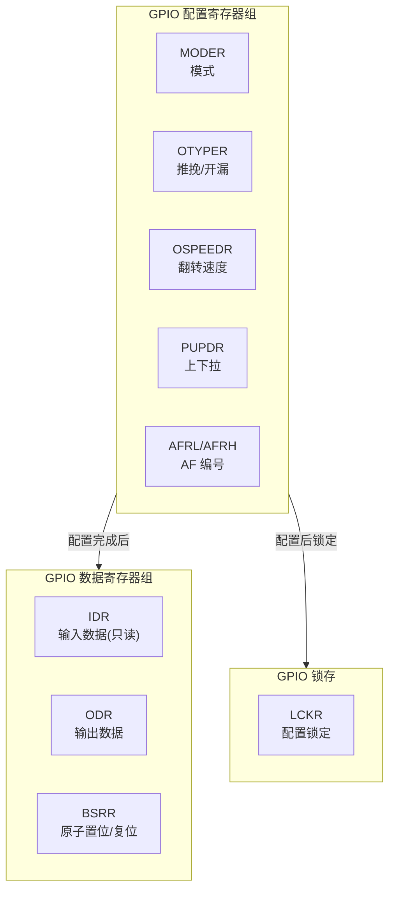

# 【元婴·103】GPIO深度：复用、上下拉、翻转速度

> 元婴期 · 第103篇
> 我是玄芯散人，带你从炼气修到大乘。

---

## 境界标识

```
╔════════════════════════════════════╗
║     元婴期 · 第103篇                ║
║     GPIO深度：复用、上下拉、翻转速度  ║
║     预计阅读：25分钟                 ║
╚════════════════════════════════════╝
```

---

## 修仙引入

上一篇 102 把 NVIC 安排妥当，谁打断谁、谁先谁后都有规矩。可 NVIC 是管「谁来敲门」的，引脚本身才是「门」。修真大阵里一道符阵要走通，先得知道这道门是什么木头做的（推挽还是开漏），门槛高不高（翻转速度），门轴默认朝哪边开（上下拉），更关键的是这道门同时挂着几块牌子（复用功能）。

炼气 026 篇讲过点灯的 HAL 写法，知道 `HAL_GPIO_WritePin(GPIOA, GPIO_PIN_5, GPIO_PIN_SET)` 能让 LED 亮起来。元婴期不再满足于「能用」，要弄清这行 API 背后到底摸到了哪几块内存，置位 PA5 时整个 GPIOA 的哪些寄存器被改写，复用成 USART_TX 时这套机制又怎么切换。

这一篇就看 STM32F407 的 GPIO 寄存器组。STM32 的 GPIO 是一组由 7 个寄存器（MODER/OTYPER/OSPEEDR/PUPDR/IDR/ODR/BSRR 等）协同控制的复合硬件，外加 AFIO 复用功能表。把这套摸透，配引脚就不再是抄例程。

---

## 硬核主体

### 一、GPIO 寄存器全景：7 块令牌牌管一道门

STM32F407 每个 GPIO 端口（GPIOA/GPIOB/.../GPIOI）有 10 个寄存器挂在固定地址。GPIOA 基址 `0x40020000`，GPIOB 是 `0x40020400`，依此类推每个端口偏移 `0x400`。

| 偏移 | 寄存器 | 复位值 | 大小 | 功能简述 |
|------|--------|--------|------|----------|
| 0x00 | MODER | 0xA8000000 | 32b | 模式选择（输入/输出/复用/模拟，每引脚2bit）|
| 0x04 | OTYPER | 0x00000000 | 16b+保留 | 输出类型（推挽/开漏，每引脚1bit）|
| 0x08 | OSPEEDR | 0x0C000000 | 32b | 翻转速度（每引脚2bit）|
| 0x0C | PUPDR | 0x64000000 | 32b | 上下拉电阻（每引脚2bit）|
| 0x10 | IDR | 不定 | 16b+保留 | 输入数据，只读 |
| 0x14 | ODR | 0x00000000 | 16b+保留 | 输出数据，可读写 |
| 0x18 | BSRR | 0x00000000 | 32b | 原子置位/复位 |
| 0x1C | LCKR | 0x00000000 | 32b | 锁定配置 |
| 0x20 | AFRL | 0x00000000 | 32b | 低8引脚复用功能（每引脚4bit）|
| 0x24 | AFRH | 0x00000000 | 32b | 高8引脚复用功能（每引脚4bit）|

修真类比：GPIO 端口是一道机关重重的石门。MODER 是大钥匙孔，决定门走「进」「出」「挂载」「断电」四种模式；OTYPER 是门闩，推挽是双向锁，开漏是单向锁；OSPEEDR 是门轴松紧度，关系到推门时的速度；PUPDR 是门上的弹簧，决定没人推时门朝哪边倒；AFRL/AFRH 是门牌号系统，标记这道门同时属于哪几个部门（外设）。



上面三组寄存器共享同一个基址，配置组决定行为模式，IO 组负责日常读写，LCK 负责配置锁定后禁止改动。

修真类比：配置组（MODER/OTYPER/OSPEEDR/PUPDR/AFR）是大阵布置阶段，匠人按图施工；数据组（IDR/ODR/BSRR）是日常运转阶段，弟子们开关机关；LCKR 是大阵封阵玉简，掌门用过后整个配置就锁死。

### 二、MODER：决定引脚四种命运

MODER 是 32 位寄存器，每个引脚占 2 bit。复位后 PA13/PA14/PA15/PB3/PB4 等少数引脚处于「复用」模式（JTAG/SWD 默认占用），其余多数是「输入」模式。

| MODERy[1:0] | 模式 | 修真类比 |
|-------------|------|----------|
| 00 | 输入（Input） | 门只开不进，弟子读外面信号 |
| 01 | 输出（Output） | 门只出不进，弟子对外发信号 |
| 10 | 复用（Alternate Function） | 门挂载外设（如 USART_TX），由外设控制 |
| 11 | 模拟（Analog） | 门断电，给 ADC/DAC 用，避免数字噪声 |

要把 PA5 配置为输出，假设 PA5 是引脚编号 5，对应 MODER[11:10] 这两位（每引脚2bit，引脚 5 占 bit 11 和 bit 10）。代码如下：

```c
/* 配置 PA5 为通用输出模式 */
#define GPIOA_BASE   0x40020000UL
#define GPIOA_MODER  (*(volatile uint32_t *)(GPIOA_BASE + 0x00))

/* 清除 PA5 对应的两位，再置位为 01（输出）。
   MODER 每引脚占 2 bit，引脚 5 对应 bit 11:10。 */
GPIOA_MODER &= ~(0x3U << (5 * 2));    /* 清零 [11:10] */
GPIOA_MODER |=  (0x1U << (5 * 2));    /* 写入 01（输出）*/
```

修真类比：MODER 是这道门的总开关。00（输入）相当于「只听不说」，引脚上的电平读进 IDR；01（输出）相当于「只说不听」，ODR 的值会推到引脚；10（复用）相当于「借给外设」，引脚由 USART/SPI 等外设接管；11（模拟）相当于「关电省事」，给 ADC 专用。

### 三、OTYPER：推挽与开漏的本质区别

OTYPER 高 16 位保留，低 16 位每引脚 1 bit，控制输出类型。

| OTy 位 | 类型 | 修真类比 |
|--------|------|----------|
| 0 | 推挽（Push-Pull） | 双向门，门后两个弟子，一个推一个拉 |
| 1 | 开漏（Open-Drain） | 单向门，门里只有拉，需要外接上拉电阻 |

推挽输出的内部结构是 PMOS + NMOS 两个管子。当输出高时 PMOS 导通（拉到 VDD），输出低时 NMOS 导通（拉到 GND）。能主动拉高也能主动拉低，输出阻抗低，翻转速度快，驱动能力也强（一般 4-8 mA，部分引脚 20 mA）。

开漏输出只有 NMOS。输出低时 NMOS 导通拉到 GND；输出高时 NMOS 关断，引脚悬空，需要外部上拉电阻才能得到高电平。开漏的几个典型用途：

1. 电平转换：3.3V MCU 控制 5V 设备时，外接上拉到 5V 即可；
2. 线与逻辑：多个开漏引脚接在同一根线上，任何一个拉低就整线拉低，方便总线仲裁（I2C 就是这个机制）；
3. 驱动大电流负载：外部上拉电阻功率可大于内部。

修真类比：推挽是宗门内弟子，两人一组，开关灵活；开漏是宗门外联弟子，自己只能往下拉，往上得靠外面接的天线帮忙。I2C 总线那种「多个设备都能拉低」的特性正是开漏的天然能力。

```c
/* 把 PA5 配置为开漏输出（点亮 LED 时一般用推挽） */
#define GPIOA_OTYPER (*(volatile uint32_t *)(GPIOA_BASE + 0x04))
GPIOA_OTYPER |= (1U << 5);   /* 置位 OT5 = 1，开漏模式 */
```

### 四、OSPEEDR：翻转速度的四种档位

OSPEEDR 32 位寄存器，每引脚 2 bit。STM32F407 的 4 个档位对应 4 个最大翻转频率：

| OSPEEDRy[1:0] | 速度档 | 最大频率 | 修真类比 |
|---------------|--------|----------|----------|
| 00 | 低速 | 2 MHz | 慢吞吞走，慢但省力 |
| 01 | 中速 | 25 MHz | 普通走 |
| 10 | 高速 | 50 MHz | 小跑 |
| 11 | 超高速 | 100 MHz | 全力冲刺 |

⚠️ 待确认：STM32F407 的 OSPEEDR = 11 对应 100 MHz，STM32F103 同字段含义不同（F103 的 11 对应 50 MHz）。这是芯片系列差异，跨型号写代码务必查手册。

修真类比：OSPEEDR 是门轴的弹簧松紧。松了开门慢（信号上升沿慢），但消耗的真元少；紧了开门快（边沿陡），消耗的真元多。如果引脚只是低速控制 LED，2 MHz 足够；如果驱动高速 SPI 总线（50 MHz+），必须 50 MHz 或 100 MHz。

速度档越高，EMI（电磁干扰）越大、功耗越高。一般原则：

- 输出给 LED / 按键 / 普通 GPIO → 2 MHz 或 25 MHz
- I2C（400 kHz 高速模式也算低速）→ 2 MHz 或 25 MHz
- SPI 主模式（时钟 10 MHz+）→ 50 MHz
- 高速总线或长走线 → 100 MHz

### 五、PUPDR：上下拉电阻

PUPDR 32 位寄存器，每引脚 2 bit。复位值部分引脚已经有上拉（PA13/PA14/PA15 是 JTAG/SWD 复用，复位后默认上下拉已配置）。

| PUPDRy[1:0] | 配置 | 修真类比 |
|-------------|------|----------|
| 00 | 无（浮空） | 门后无弹簧，靠风决定方向 |
| 01 | 上拉（Pull-up） | 弹簧把门往开方向推 |
| 10 | 下拉（Pull-down） | 弹簧把门往关方向拉 |
| 11 | 保留 | 别用 |

上拉电阻阻值一般在 30-50 kΩ 范围，弱上拉只保证默认电平，驱动能力差。

修真类比：浮空输入相当于门在风中摇晃，引脚电平随机漂移，可能造成误触发。配置输入引脚时几乎一定要设上下拉，确定默认状态，避免「电平悬空 + 中断抖动」组合的诡异 bug。

典型场景：

```c
/* 按键输入：PA0 接按键到 GND，配下拉，默认高电平，按下变低 */
#define GPIOA_PUPDR (*(volatile uint32_t *)(GPIOA_BASE + 0x0C))
GPIOA_PUPDR &= ~(0x3U << (0 * 2));    /* 清零 [1:0] */
GPIOA_PUPDR |=  (0x2U << (0 * 2));    /* 10 = 下拉 */

/* I2C 总线（SCL/SDA）：开漏输出 + 上拉，靠外部上拉电阻工作。
   内部上拉一般不够强（30-50kΩ），必须外接 4.7kΩ 上拉到 VCC。*/
```

### 六、AFRL/AFRH：复用功能编号

GPIO 引脚最多有 16 个复用功能（AF0-AF15），每个外设对应特定的 AF 编号。

- AFRL（offset 0x20）：管引脚 0-7，每引脚 4 bit
- AFRH（offset 0x24）：管引脚 8-15，每引脚 4 bit

STM32F407 复用功能示例（来自 RM0090 手册 Table 9）：

| 引脚 | AF0 | AF1 | AF2 | AF3 | AF4 | AF5 | AF6 | AF7 | ... |
|------|-----|-----|-----|-----|-----|-----|-----|-----|-----|
| PA0 | - | TIM2_CH1/TIM2_ETR | TIM5_CH1 | TIM8_ETR | - | - | - | USART2_CTS | ... |
| PA2 | - | - | TIM5_CH3 | TIM9_CH1 | USART2_RX | - | - | - | ... |
| PA9 | - | TIM1_CH2 | - | - | I2C3_SMBA | - | - | USART1_TX | ... |
| PA10 | - | TIM1_CH3 | - | - | - | - | - | USART1_RX | ... |

PA9 想当 USART1_TX 用，必须配 AFRH[7:4] = 0x7（即 **AF7**）。

修真类比：AFRL/AFRH 是门上的多面牌子。AF0 是默认牌（系统功能），AF1-AF15 是宗门各堂口（外设）借调这块地的编号。同一块地可以挂多个外设，但同时只能让一个堂口用，调配权在 AFRH/AFRL。

代码配置 PA9 为 USART1_TX：

```c
/* PA9 → AF7（USART1_TX）*/
#define GPIOA_AFRH  (*(volatile uint32_t *)(GPIOA_BASE + 0x24))

/* AFRH 每引脚占 4 bit，引脚 9 对应 bit [7:4]。
   写入 0x7 = AF7 = USART1_TX */
GPIOA_AFRH &= ~(0xFU << ((9 - 8) * 4));   /* 清零 [7:4] */
GPIOA_AFRH |=  (0x7U << ((9 - 8) * 4));   /* AF7 */
```

⚠️ 待确认：不同 STM32 系列（特别是 F1 vs F4）AF 编号差异很大。F1 没有 AFRL/AFRH，而是用 `GPIO_PinRemapConfig` 配合 AFIO_MAPR 寄存器；F4 是 AFRL/AFRH 直接对应。跨系列要查对应手册。

AFIO 外设（不是 GPIO 的一部分）：

```c
/* AFIO 基址 0x40010000（不在 GPIO 内）。启用某些重映射功能时需要打开 AFIO 时钟。
   F407 的普通复用功能（USART1/SPI1 等）通常不需要 AFIO，只有事件输出 EXTI 等特殊功能才用。*/
#define AFIO_BASE    0x40010000UL
```

### 七、BSRR vs ODR：原子操作的必要性

ODR 是最直觉的输出寄存器。想让 PA5 输出高，写 `GPIOA_ODR |= (1 << 5)`。

可这有个致命问题：读-改-写不是原子的。

```c
/* 危险！读-改-写三步可能被 ISR 打断 */
void SetBit_NonAtomic(volatile uint32_t *reg, uint8_t pin) {
    uint32_t val = *reg;          /* 读 */
    val |= (1U << pin);           /* 改 */
    *reg = val;                   /* 写 */
}
```

如果在「读」和「写」之间 ISR 抢权改了同一个寄存器的另一位（比如 ISR 拉低 PA6），主循环的「写」会把 ISR 的改动覆盖掉。这是经典的「读-改-写竞争」。

修真类比：ODR 是宗门弟子同时改一本秘典。师徒两人同时握笔，前一个还没写完，后一个抢先落笔，前面的字就丢了。

BSRR（Bit Set Reset Register）就是为这个问题设计的。它是 32 位寄存器：

- 低 16 位（BSy，bit 0-15）：写 1 → 对应 ODR 位置 1，写 0 → 无效
- 高 16 位（BRy，bit 16-31）：写 1 → 对应 ODR 位清 0，写 0 → 无效

单次 32-bit 写操作完成「置位某位 + 复位某位」，硬件保证原子性，无需读-改-写。

```c
/* BSRR 单次写操作完成置位/复位，硬件原子 */
#define GPIOA_BSRR (*(volatile uint32_t *)(GPIOA_BASE + 0x18))

/* PA5 置高：低 16 位 bit 5 写 1 */
GPIOA_BSRR = (1U << 5);            /* 置位 PA5 */

/* PA5 置低：高 16 位 bit 5 写 1（即 bit 21 写 1）*/
GPIOA_BSRR = (1U << (5 + 16));     /* 复位 PA5 */

/* 同时：PA5 置高 + PA6 置低 */
GPIOA_BSRR = (1U << 5) | (1U << (6 + 16));   /* 原子完成 */
```

修真类比：BSRR 是宗门发布的正式令牌牌（制式符诏）。师徒不必先看秘典再下笔，朝廷发一道「PA5 开门、PA6 关门」的令牌，一次生效，各管各的，互不干扰。

#### 7.1 BRR：仅复位的精简版本

F4 还提供 BRR（offset 0x28）寄存器，结构和 BSRR 高 16 位等价，专用于「只想复位某些位」。HAL 库里有 `__HAL_GPIO_EXTI_CLEAR_IT(GPIO_PIN_x)` 这种宏，内部就用了 BSRR 高 16 位或 BRR。

#### 7.2 ODR 何时还能用

ODR 不是完全不能用。在「只写不读」场景下，HAL 的 `HAL_GPIO_WritePin` 内部实现就是：

```c
/* HAL_GPIO_WritePin 内部（简化）：
   - 当 pin < 8 用 BSRR 寄存器高效置位/复位；
   - 高 pin 或全集操作时直接写 ODR。 */
if (pinState == GPIO_PIN_SET) {
    GPIOx->BSRR = (uint32_t)GPIO_Pin;   /* 置位用 BSRR */
} else {
    GPIOx->BSRR = (uint32_t)GPIO_Pin << 16;  /* 复位用 BSRR 高 16 位 */
}
```

修真类比：ODR 是自家作坊账本，多人共写需要 BSRR 这把官方令牌；BSRR 是宗门账房，一手办理宗门总账，账目互不串。

### 八、实战配置：PA5 推挽输出 + PA9 USART1_TX 复用

把前面 7 个寄存器的知识拼起来，配两个引脚：

1. PA5：通用推挽输出（点 LED 用）
2. PA9：复用推挽输出 + AF7（USART1_TX）

```c
/* gpio_config.c —— GPIO 寄存器级完整配置。
   不依赖 HAL，直接操作寄存器，加深理解。 */

void GPIO_Config_PA5_Output(void)
{
    /* 1. 打开 GPIOA 时钟（RCC 章节第101篇讲过，这里从简）。*/
    RCC->AHB1ENR |= RCC_AHB1ENR_GPIOAEN;

    /* 2. PA5 MODER = 01（通用输出）*/
    GPIOA->MODER &= ~(0x3U << (5 * 2));
    GPIOA->MODER |=  (0x1U << (5 * 2));

    /* 3. PA5 OTYPER = 0（推挽）*/
    GPIOA->OTYPER &= ~(1U << 5);

    /* 4. PA5 OSPEEDR = 01（中速 25 MHz，LED 够用）*/
    GPIOA->OSPEEDR &= ~(0x3U << (5 * 2));
    GPIOA->OSPEEDR |=  (0x1U << (5 * 2));

    /* 5. PA5 PUPDR = 00（无上下拉，输出模式默认无）*/
    GPIOA->PUPDR &= ~(0x3U << (5 * 2));

    /* 6. 点亮 LED */
    GPIOA->BSRR = (1U << 5);    /* 置位 PA5 */
}

void GPIO_Config_PA9_USART1_TX(void)
{
    /* 1. 时钟（已经在上一个函数里开了）*/

    /* 2. PA9 MODER = 10（复用功能）*/
    GPIOA->MODER &= ~(0x3U << (9 * 2));
    GPIOA->MODER |=  (0x2U << (9 * 2));

    /* 3. PA9 OTYPER = 0（推挽，USART_TX 推挽就够）*/
    GPIOA->OTYPER &= ~(1U << 9);

    /* 4. PA9 OSPEEDR = 10（高速 50 MHz，USART 115200 够用）*/
    GPIOA->OSPEEDR &= ~(0x3U << (9 * 2));
    GPIOA->OSPEEDR |=  (0x2U << (9 * 2));

    /* 5. PA9 PUPDR = 00（无）*/
    GPIOA->PUPDR &= ~(0x3U << (9 * 2));

    /* 6. PA9 AFRH[7:4] = 0x7（AF7 = USART1_TX）*/
    GPIOA->AFRH &= ~(0xFU << ((9 - 8) * 4));
    GPIOA->AFRH |=  (0x7U << ((9 - 8) * 4));
}
```

修真类比：PA5 是宗门外挂的灯笼，推挽门闩 + 25 MHz 门轴足够亮；PA9 是宗门对外传送阵的出口，推挽 + 50 MHz + AF7 复用，让传送阵的外接设备（USART1 外设）来控制开闭。

### 九、完整寄存器配置顺序：避免坑

实际配置 GPIO 推荐顺序：

1. 开 RCC 时钟（AHB1ENR）
2. 配 MODER（决定模式，否则其他配置可能无效）
3. 配 OTYPER（推挽/开漏）
4. 配 OSPEEDR（速度）
5. 配 PUPDR（上下拉）
6. 配 AFR（复用功能）
7. 写 IDR/ODR/BSRR（数据）

常见坑：

- 忘了开 RCC 时钟，寄存器读写无反应
- MODER 没设为输出就写 ODR，电平不出门
- 复用功能没配对 AF 编号，外设信号不通
- 速度档选太慢导致 SPI 波形畸变

修真类比：配置大阵先开灵脉（RCC），再定阵法形式（MODER），再调材料（OTYPER/OSPEEDR），最后挂接堂口（AFR）。顺序错了，要么白干，要么门闩生锈信号不通。

---

## 修仙术语对照表

| 修仙术语 | 技术现实 | 本篇位置 |
|----------|----------|----------|
| 符阵机关重重的石门 | GPIO 端口（10 个寄存器协同）| 第一段 |
| 大钥匙孔 | MODER 模式寄存器 | 第二段 |
| 门闩（推挽/开漏）| OTYPER 输出类型 | 第三段 |
| 门轴松紧 | OSPEEDR 翻转速度 | 第四段 |
| 门上弹簧 | PUPDR 上下拉 | 第五段 |
| 门牌号系统 | AFRL/AFRH 复用编号 | 第六段 |
| 宗门账房令牌牌 | BSRR 原子置位/复位 | 第七段 |
| 自家作坊账本 | ODR 读写寄存器 | 第七段 |
| 大阵布置匠人 | 配置阶段寄存器写入 | 第一段 |
| 日常运转弟子 | 数据寄存器组（IDR/ODR）| 第一段 |
| 宗门外联堂口 | 复用外设（USART/SPI/I2C 等）| 第六段 |
| 灯阵灯笼 | PA5 推挽输出（LED）| 第八段 |
| 对外传送阵 | PA9 USART1_TX 复用 | 第八段 |

---

## 突破条件

GPIO 这条链路，看完一遍还不算过。读完后请自检：

- [ ] 能说出 STM32F407 GPIO 端口至少 7 个寄存器的名字和功能
- [ ] 能解释 MODER 的 4 个模式（输入/输出/复用/模拟）和它们的位域
- [ ] 能区分推挽输出和开漏输出，写出至少 2 个开漏输出的典型用途
- [ ] 能解释 OSPEEDR 的 4 档速度含义，并知道不同档位适用的场景
- [ ] 能解释 PUPDR 上下拉的作用和默认浮空输入的风险
- [ ] 能说出 AFRL/AFRH 的位宽分配和 PA9 配 USART1_TX 该写 AF几
- [ ] 能解释 BSRR 为什么能解决读-改-写竞争问题
- [ ] 能完整配置一个 GPIO 引脚（PA5 推挽输出）和一个复用引脚（PA9 USART1_TX）

如果有一项卡住，回到对应章节重读一遍。GPIO 是所有外设的物理基础，UART/SPI/I2C 都要靠 AFR 寄存器表分配。下一篇 104 UART 实战会接着讲 USART1 配置和丢字节排查。

---

## 下期预告 + 互动

下一篇：104 UART 实战：丢字节查了三天。

波特率怎么算、115200 究竟是什么意义。DMA + 空闲中断 + 环形缓冲区的标准接收方案。一个字节怎么丢，三个字节怎么丢，丢字节的常见原因和排查方法。

互动问题：

1. 你配置 GPIO 时踩过「寄存器写了但引脚没反应」的坑没？当时是 RCC 时钟没开，还是 MODER 没配对？
2. 开漏输出你在什么场景用过？I2C 总线还是电平转换？
3. BSRR vs ODR 这套原子操作你在项目里用过没？还是有别的原子位操作方法（比如位带别名区）？

评论区聊聊你的 GPIO 调试经历。

---

*本文是「码农修仙传」系列第103篇。系列导航见 [xren.ren](https://xren.ren)*