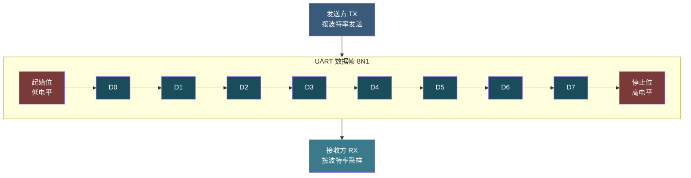
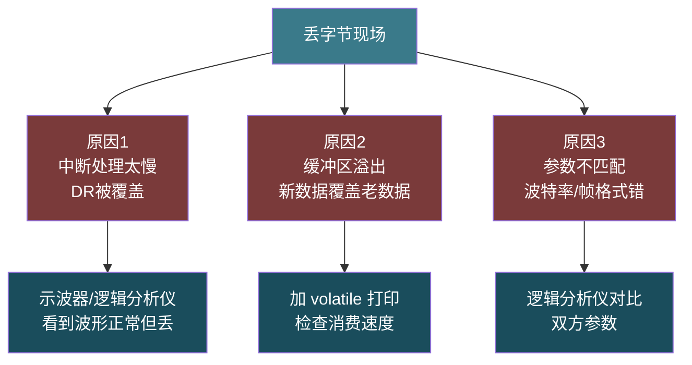
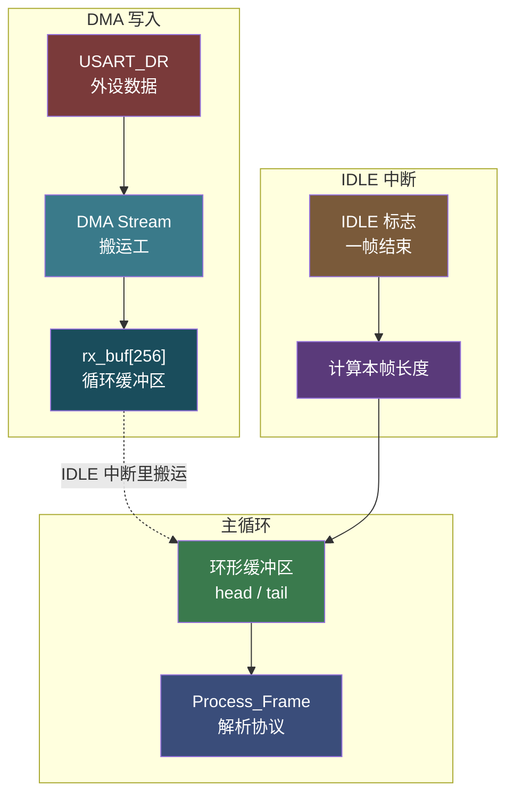

# 【元婴·104】UART实战：丢字节查了三天

> 元婴期 · 第104篇
> 我是玄芯散人，带你从炼气修到大乘。

---

## 境界标识

```
╔════════════════════════════════════╗
║     元婴期 · 第104篇                ║
║     UART实战：丢字节查了三天        ║
║     预计阅读：30分钟                 ║
╚════════════════════════════════════╝
```

---

## 修仙引入

上一篇 103 把 GPIO 寄存器摸透，知道怎么让引脚「听话」了。可要让两个 MCU 隔空对话，光有引脚不够，还得有串口这条「传音玉简」。

UART 是嵌入式工程师打交道最多的外设。点灯、按键、调试日志、模块通信，几乎都靠它。修真界里，传音玉简看似简单，把神识灌进去对方就能收到。可工程现实是：115200 波特率、8N1 数据帧这些参数背后到底是哪些寄存器在管。数据怎么走 DMA 通路。不定长数据包怎么识别帧结束。这一篇就是把这些一层层拆开。

这一篇要讲清楚 UART 的寄存器机理、DMA 加空闲中断的标准接收方案，以及实战排查「丢字节」的三种典型场景。

调试 UART 的工程师都有过这种体验：明明代码看起来都对，串口就是少字节；逻辑分析仪抓波形正常，软件就是解析错；以为 DMA 配好了，结果还是丢。修真界里丢字节就像传音玉简偶尔失灵，几百里传音断断续续。这一篇把玉简失灵的三种常见原因拆开看，串起寄存器配置、DMA 通路、环形缓冲，把整条链路打通。

---

## 硬核主体

### 一、UART 是什么：异步串行的传音玉简

UART（Universal Asynchronous Receiver/Transmitter）是一种异步串行通信协议。两根线：TX（发送）和 RX（接收），没有共享时钟，靠双方约定好的波特率（Baud Rate）同步采样。

数据帧格式最常见的是「8N1」：起始位加 8 位数据位加停止位，共 10 bit。发送方先拉低 1 bit 时间表示起始位，接着按波特率时钟把 8 位数据按低位到高位依次发出，最后拉高 1 bit 时间表示停止位。

修真类比：UART 是两人隔空传音。约定好语速后，甲方喊一句「天」，乙方听到 1 个低电平（起始位）就开始听，按约定节奏收 8 个音节，再听 1 个高电平（停止位）确认一句结束。两边必须语速一样，否则听到的就是乱码。



「8N1」是嵌入式的事实标准，多数传感器和模块都支持。更严谨的协议会加校验位（如 8E1 加偶校验）或两个停止位（8N2），但都靠 BRR 配置和 CR1/CR2/CR3 寄存器位调整。

### 二、波特率是怎么算出来的：BRR 寄存器

STM32 的 USART 波特率由 BRR（Baud Rate Register）寄存器决定。BRR 是 32 位寄存器（实际用 16 位），分两部分：高 12 位是整数部分 DIV_Mantissa，低 4 位是小数部分 DIV_Fraction，精度 1/16。

计算公式是：

```
USARTDIV = fck / (16 × baud)
BRR = (整数部分 << 4) | (小数部分 × 16)
```

以 STM32F407 的 USART1 为例，挂 APB2 时 fck 等于 84 MHz，配 115200 波特率：

```
USARTDIV = 84,000,000 / (16 × 115200) = 45.5625
整数部分 = 45 = 0x2D
小数部分 = 0.5625 × 16 = 9 = 0x9
BRR = (45 << 4) | 9 = 0x2D9
```

实际误差计算：

```
实际波特率 = fck / (16 × USARTDIV) = 84M / (16 × 45.5625) ≈ 115226
误差 = (115226 - 115200) / 115200 ≈ 0.023%
```

修真类比：BRR 是传音玉简的「语速令牌」。发送方按令牌节奏把字符变成电脉冲，接收方按同一令牌节奏把脉冲还原成字符。令牌算错，两边语速不一致，听到的就是串串乱码。

```c
/* 计算 BRR 的辅助函数（fck 单位 Hz） */
uint16_t UART_BRR_Calc(uint32_t fck, uint32_t baud)
{
    /* USARTDIV = fck / (16 × baud) */
    uint32_t usartdiv = (fck * 25) / (4 * baud);  /* ×25/4 避免浮点 */
    uint32_t mantissa = usartdiv / 100;
    uint32_t fraction = ((usartdiv - mantissa * 100) * 16 + 50) / 100;
    return (uint16_t)((mantissa << 4) | (fraction & 0x0F));
}

/* USART1 配 115200 波特率，fck = 84 MHz */
USART1->BRR = UART_BRR_Calc(84000000, 115200);  /* = 0x2D9 = 45.5625 */
```

⚠️ 待确认：F1 系列 USART 在 APB1（最大 36 MHz），BRR 计算原理相同但 fck 不同。F1 上 115200 误差比 F4 大，约 0.16%，仍能稳定通信但临界场景（如 1.5 Mbaud）需要换更高 fck 或换芯片。

### 三、为什么会丢字节：三种典型原因

把 BRR 配好、数据帧格式设对，是不是就能稳定通信？不一定。嵌入式工程师十有八九在 UART 上栽过跟头，常见丢字节原因有三个。

第一种原因：中断处理太慢，新数据来了旧数据还没取走。

USART_DR 寄存器只有一个字节的缓冲。收到 1 个字节就置 RXNE（RX Not Empty）标志；如果上一个字节还没读走，下一个字节到了就会覆盖 DR，导致丢字节。

```c
/* 危险！中断里做太多事，新字节被覆盖 */
void USART1_IRQHandler(void)
{
    if (USART1->SR & USART_SR_RXNE) {
        uint8_t ch = USART1->DR;
        printf("Recv: %c\n", ch);  /* printf 本身就要几毫秒，期间可收几十字节 */
    }
}
```

修真类比：传音玉简只有一格容量。弟子听一句写一句，没写完下一句就到了，原来的字就被新字盖掉了。

第二种原因：缓冲区太小，数据溢出。

如果中断里只是把字节丢进一个小数组（如 `uint8_t buf[64]`），但生产数据速度比消费速度快（生产者中断里塞数据，消费者主循环慢慢解析），数组很快满，新数据覆盖老数据。

第三种原因：波特率或帧格式不匹配。

这是最低级的错：一边配 115200-8N1，另一边配 9600-8E1，两边听到的就是乱码或者丢字节。但这种错查起来简单，逻辑分析仪一抓波形就看出来了。

修真类比：修真大阵里两人传音，一人说「天」，另一人听成「地」，乱序就是丢字节的另一种形式。



### 四、DMA 接收方案：硬件搬数据，CPU 不插手

DMA（Direct Memory Access）让外设直接读写内存，不需要 CPU 参与。STM32 的 DMA1 和 DMA2 各有多个流（Stream），USART_RX 有专属的 DMA 通道。

以 STM32F407 为例，USART1_RX 挂在 DMA2 的 Stream 5、Channel 4。

修真类比：DMA 是宗门雇的搬运工，CPU 是长老。长老不必亲自搬箱子，只管发号施令。搬运工听长老调度，把外设寄存器里的数据搬到内存缓冲区。长老偶尔看一眼库房就知道收了什么。

```c
/* UART + DMA 接收初始化（USART1 + DMA2 Stream5） */
void UART_DMA_Init(void)
{
    /* 1. 打开时钟 */
    RCC->AHB1ENR |= RCC_AHB1ENR_GPIOAEN | RCC_AHB1ENR_DMA2EN;
    RCC->APB2ENR |= RCC_APB2ENR_USART1EN;

    /* 2. GPIO 配置 PA9/PA10（AF7 = USART1）*/
    GPIOA->MODER &= ~((0x3U << (9*2)) | (0x3U << (10*2)));
    GPIOA->MODER |=  ((0x2U << (9*2)) | (0x2U << (10*2)));  /* 复用模式 */
    GPIOA->AFRH &= ~((0xFU << ((9-8)*4)) | (0xFU << ((10-8)*4)));
    GPIOA->AFRH |=  ((0x7U << ((9-8)*4)) | (0x7U << ((10-8)*4)));  /* AF7 */

    /* 3. USART1 配置：115200 8N1 */
    USART1->BRR = 0x2D9;       /* 45.5625 @ 84 MHz */
    USART1->CR1 = USART_CR1_TE | USART_CR1_RE | USART_CR1_UE;

    /* 4. DMA2 Stream5 配置（USART1_RX）*/
    DMA2_Stream5->PAR  = (uint32_t)&USART1->DR;   /* 源：USART 数据寄存器 */
    DMA2_Stream5->M0AR = (uint32_t)rx_buf;         /* 目标：内存缓冲区 */
    DMA2_Stream5->NDTR = RX_BUF_SIZE;              /* 传输数量 */
    DMA2_Stream5->CR = 0
        | (4 << 25)   /* Channel 4 */
        | (0 << 13)   /* 8-bit 内存 */
        | (0 << 11)   /* 8-bit 外设 */
        | (1 << 10)   /* 内存地址递增 */
        | (0 <<  9)   /* 外设地址不增 */
        | (1 <<  8)   /* 循环模式 */
        | (1 <<  5)   /* 传输完成中断 */
        | (1 <<  0);  /* 使能 */
}
```

修真类比：DMA 循环模式像水车。USART_RX 引脚是水源，DR 是水闸，内存缓冲区是水槽。DMA 搬运工不断把水舀到水槽里，水槽满了从头再来，永远不停。

`DMA_SxCR_CIRC`（循环模式）是接收方案的命门。开启后 DMA 不会停下来等 CPU，而是持续地把外设数据搬到内存，到 NDTR 计数器归零时自动重装载，搬运不中断。

### 五、空闲中断（IDLE）：识别不定长数据帧

DMA 加循环模式解决了不丢字节的问题，但带来新问题：怎么知道一帧数据结束了。

比如 GPS 模块输出的 NMEA 语句，每条 `'$' ... '\r\n'` 长度不一样。如果只按字节解析，需要一直盯着缓冲区找 `'\n'`。但循环 DMA 模式下，缓冲区里的数据位置不断滚动，需要一个明确的帧边界信号。

这个信号就是 USART 的 IDLE 标志（Idle Line Detected）。当 USART 检测到 RX 线在一帧时间内保持高电平（空闲），硬件自动置位 IDLE 标志。

修真类比：传音玉简收完一串字符后，对方沉默了一秒，这一秒就是「休止符」。听者听到休止符就知道一句完整的话结束了，可以开始处理。

```c
/* 开启 IDLE 中断 */
USART1->CR1 |= USART_CR1_IDLEIE;          /* IDLE 中断使能 */
NVIC_SetPriority(USART1_IRQn, 2);
NVIC_EnableIRQ(USART1_IRQn);

/* IDLE 中断处理：清 IDLE 标志 + 计算本帧长度 */
volatile uint8_t  rx_buf[256];
volatile uint16_t dma_pos;       /* DMA 当前写到哪里 */
volatile uint16_t last_pos = 0;  /* 上一次 IDLE 时写到哪里 */

void USART1_IRQHandler(void)
{
    /* 处理 IDLE 中断 */
    if (USART1->SR & USART_SR_IDLE) {
        /* 必须先读 SR，再读 DR 才能清 IDLE */
        (void)USART1->SR;
        (void)USART1->DR;

        /* 计算本帧长度 */
        dma_pos = RX_BUF_SIZE - DMA2_Stream5->NDTR;
        uint16_t frame_len = (dma_pos - last_pos + RX_BUF_SIZE) % RX_BUF_SIZE;

        /* 在这里处理 frame_len 长度的数据：从 rx_buf[last_pos] 开始 */
        Process_Frame(&rx_buf[last_pos], frame_len);

        last_pos = dma_pos;  /* 更新位置 */
    }

    /* 如果还开了 RXNE 中断（通常不用，DMA 已经处理了）*/
    if (USART1->SR & USART_SR_RXNE) {
        (void)USART1->DR;
    }
}
```

IDLE 中断处理有两个要点：

一、清 IDLE 标志必须先读 SR 再读 DR 两步骤。这是 STM32 的硬件约定，只读 SR 不够。

二、帧长度等于 DMA 当前写位置减去上次处理位置。循环模式下要用模运算（加 RX_BUF_SIZE 再取模 RX_BUF_SIZE）处理位置回绕。

修真类比：清 IDLE 标志是宗门规矩。掌门宣布「此次传音结束」必须盖两个章（SR 加 DR），少盖一个下次就不灵验。

### 六、环形缓冲区：DMA 与应用的桥梁

DMA 把数据搬进内存，但应用层（主循环）何时读数据，读多少，直接操作 DMA 的 rx_buf 不安全：DMA 在后台还在写。中间需要一个环形缓冲区（Ring Buffer）作为桥梁。

环形缓冲区是一个数组加两个指针：head（写指针，DMA 用）和 tail（读指针，应用层用）。head 和 tail 都只往一个方向走，到数组末尾自动回到开头。

修真类比：环形缓冲区是宗门的「待办书匣」。弟子送来新指令放书匣头（head），长老从书匣尾（tail）取指令处理。如果书匣满了（head 追上 tail），说明长老没跟上，得回头查原因。

```c
/* 环形缓冲区实现 */
#define RB_SIZE 256

typedef struct {
    uint8_t  buf[RB_SIZE];
    uint16_t head;  /* 写指针（DMA 中断写）*/
    uint16_t tail;  /* 读指针（应用读）*/
} RingBuffer;

RingBuffer uart_rb = { .head = 0, .tail = 0 };

/* 写一个字节（DMA 中断或主循环调用）*/
void RB_Put(RingBuffer *rb, uint8_t data)
{
    uint16_t next = (rb->head + 1) % RB_SIZE;
    if (next != rb->tail) {  /* 满则丢弃 */
        rb->buf[rb->head] = data;
        rb->head = next;
    }
}

/* 读一个字节（应用层调用）*/
int RB_Get(RingBuffer *rb, uint8_t *data)
{
    if (rb->head == rb->tail) return 0;  /* 空 */
    *data = rb->buf[rb->tail];
    rb->tail = (rb->tail + 1) % RB_SIZE;
    return 1;
}

/* 当前可读字节数 */
uint16_t RB_Available(RingBuffer *rb)
{
    return (rb->head - rb->tail + RB_SIZE) % RB_SIZE;
}
```

RB_SIZE 通常选 2 的幂（如 256 或 512），这样 head 加 1 取模 RB_SIZE 可以用位运算 head 加 1 与上 RB_SIZE 减 1 替换，省力又不出错。

修真类比：RB_SIZE 是 2 的幂就像大阵阵眼设成对称结构，弟子走阵时不必算路径，直接按方位走。



### 七、完整方案：DMA 加 IDLE 加环形缓冲

把 DMA 接收、IDLE 中断、环形缓冲三件套拼起来，就是工业界最常见的「UART 接收三件套」：

```c
/* 完整三件套：DMA + IDLE + Ring Buffer */

#define RB_SIZE 256
volatile uint8_t  rx_buf[RB_SIZE];      /* DMA 目标 */
volatile uint16_t last_pos = 0;          /* 上次 IDLE 时 DMA 写到哪 */
RingBuffer uart_rb = { .head = 0, .tail = 0 };

void UART_All_Init(void)
{
    /* GPIO + USART + DMA 初始化（前面章节已写，从略）*/
    UART_GPIO_Init();
    UART_USART_Init();
    UART_DMA_Init();

    /* 开启 IDLE 中断 */
    USART1->CR1 |= USART_CR1_IDLEIE;
    NVIC_SetPriority(USART1_IRQn, 2);
    NVIC_EnableIRQ(USART1_IRQn);
}

void USART1_IRQHandler(void)
{
    /* IDLE 中断：把 DMA 已写入但没处理的数据搬到环形缓冲 */
    if (USART1->SR & USART_SR_IDLE) {
        (void)USART1->SR;  /* 清 IDLE 必须读 SR + DR */
        (void)USART1->DR;

        uint16_t dma_pos = RB_SIZE - DMA2_Stream5->NDTR;
        uint16_t len = (dma_pos - last_pos + RB_SIZE) % RB_SIZE;

        /* 把新数据搬到环形缓冲 */
        for (uint16_t i = 0; i < len; i++) {
            RB_Put(&uart_rb, rx_buf[(last_pos + i) % RB_SIZE]);
        }
        last_pos = dma_pos;
    }
}

/* 主循环从环形缓冲读数据 */
void Process_Received_Data(void)
{
    uint8_t ch;
    while (RB_Get(&uart_rb, &ch)) {
        /* 这里是协议解析（GPS NMEA 或 Modbus 或自定义协议）*/
        Protocol_Parse(ch);
    }
}
```

修真类比：完整方案是宗门传音大阵。DMA 是搬运工（搬字节），IDLE 是休止符（标识一句结束），环形缓冲是待办书匣（缓冲解析任务），主循环是长老（看字做决策）。四者各司其职，长老不必亲自搬字，搬运工不必管字义。

### 八、实战排查流程：丢字节查三天怎么查

修真界里传音玉简失灵，第一件事不是怀疑玉简本身。先看两端语速是否一致，看玉简容量是否够大，看搬运工是否偷懒。对应到 UART，标准排查流程有五个步骤。

步骤一，参数对齐。

逻辑分析仪（如 Saleae）抓 TX/RX 波形，对比实际波特率与配置值。常见错误：APB1/APB2 时钟算错、BRR 计算溢出。

步骤二，检查 DMA 是否启用。

```c
/* 验证 DMA 状态 */
if ((DMA2_Stream5->CR & DMA_SxCR_EN) == 0) {
    /* DMA 没启 */
}
if ((USART1->CR3 & USART_CR3_DMAR) == 0) {
    /* USART 没打开 DMA 接收 */
}
```

USART_CR3 的 DMAR 位必须置 1，DMA 才会响应 USART_RX 请求。

步骤三，检查 IDLE 中断是否开启。

```c
if ((USART1->CR1 & USART_CR1_IDLEIE) == 0) {
    /* IDLE 中断没开 */
}
```

步骤四，检查环形缓冲区是否溢出。

```c
uint16_t avail = RB_Available(&uart_rb);
if (avail > RB_SIZE * 0.8) {
    /* 缓冲区快满，主循环处理太慢 */
}
```

如果缓冲区长期接近满，说明主循环消费速度跟不上，需要改进解析逻辑或扩大缓冲区。

步骤五，万不得已，加看门狗复位。

修真大阵再精密也有卡住的时候，给整个 UART 链路加超时看门狗（10 秒没收到合法数据就复位 UART 状态机），是最后一道防线。看门狗触发后，重启 USART、清 DMA、清环形缓冲、重置 last_pos，这一套下来 UART 又能继续工作。修真界里这就是「自动重启大阵」。

```c
/* UART 看门狗示例：定时器检查 rx_buf 是否有新数据 */
volatile uint32_t last_rx_tick = 0;  /* 上次收到数据的时刻 */

void UART_Watchdog_Check(void)
{
    uint32_t now = HAL_GetTick();
    if (now - last_rx_tick > 10000) {  /* 10 秒无数据 */
        /* 复位 UART 状态机 */
        USART1->CR1 &= ~USART_CR1_UE;   /* 关 USART */
        DMA2_Stream5->CR &= ~DMA_SxCR_EN;  /* 关 DMA */
        (void)USART1->SR; (void)USART1->DR;  /* 清 IDLE */
        last_pos = 0;
        uart_rb.head = uart_rb.tail = 0;

        USART1->CR1 |= USART_CR1_UE;   /* 重开 USART */
        DMA2_Stream5->CR |= DMA_SxCR_EN;  /* 重开 DMA */
        last_rx_tick = now;
    }
}
```

修真类比：排查传音玉简要按规矩来。先查语速（波特率），再查搬运工（DMA），再查休止符（IDLE），再查书匣（环形缓冲），最后下死手（看门狗）。盲目重启大阵是没查清缘由就推倒重来，往往修好了这次，下次同样的坑又来。

---

## 修仙术语对照表

| 修仙术语 | 技术现实 | 本篇位置 |
|----------|----------|----------|
| 传音玉简 | UART 异步串行通信 | 第一段 |
| 语速令牌 | 波特率 / BRR 寄存器 | 第二段 |
| 数据帧 8N1 | 起始位加 8 数据位加停止位 | 第一段 |
| 搬运工 | DMA 控制器 | 第四段 |
| 水车循环模式 | DMA_SxCR_CIRC 循环模式 | 第四段 |
| 休止符 | USART IDLE 中断 | 第五段 |
| 盖两个章（清 IDLE） | 先读 SR 加再读 DR | 第五段 |
| 待办书匣 | 环形缓冲区 Ring Buffer | 第六段 |
| 书匣头/尾指针 | head / tail 读写指针 | 第六段 |
| 长老看字决策 | 主循环协议解析 | 第七段 |
| 排查五步 | 实战排查流程 | 第八段 |
| 语速不一致 | 波特率 / 帧格式不匹配 | 第三段 |
| 玉简失灵 | UART 通信异常 | 第八段 |

---

## 进阶条件

UART 这条链路，看完一遍还不算过。读完后请自检：

- [ ] 能说出 STM32 USART 至少 6 个寄存器的名字和功能（SR/DR/BRR/CR1/CR2/CR3）
- [ ] 能计算 115200 @ 84 MHz 的 BRR 值（答案是 0x2D9）
- [ ] 能解释 DMA 加 IDLE 加环形缓冲这套标准接收方案的原理
- [ ] 能说出清 IDLE 标志必须先读 SR 再读 DR 的原因
- [ ] 能解释 DMA 循环模式下为什么需要环形缓冲区做桥梁
- [ ] 能区分三种丢字节原因（DR 覆盖 / 缓冲溢出 / 参数不匹配）并说出对应排查方法
- [ ] 能写出 USART_CR3 的 DMAR 位作用（DMA 接收使能）
- [ ] 能解释为什么 RB_SIZE 选 2 的幂（位运算替换模运算）

如果有一项卡住，回到对应章节重读一遍。UART 是嵌入式调试的「第一道关」，绝大多数模块通信问题都从这里开始。下一篇 105 SPI 总线会接着讲同步串行、时钟极性、DMA 收发。

---

## 下期预告 + 互动

下一篇：105 SPI 总线：主从模式、时钟极性、DMA传输。

SPI 与 UART 最大的区别是有时钟线（SCK）。CPOL/CPHA 四种模式的本质是什么。为什么 W25Q Flash 必须用 Mode 0。DMA 收发配置上和 UART 有何异同。

互动问题：

1. 你排查 UART 丢字节时用过逻辑分析仪没？抓到过哪些「诡异波形」（比如实际 115201、帧错误）？
2. DMA 接收方案里你偏好「DMA 加 IDLE 中断」还是「DMA 加串口空闲检测加定时器」？为什么？
3. 环形缓冲区的 RB_SIZE 一般选多大？遇到过 head 追上 tail 的「书匣满」情况没？怎么处理的？

评论区聊聊你的 UART 调试经历。

---

*本文是「码农修仙传」系列第104篇。系列导航见 [xren.ren](https://xren.ren)*