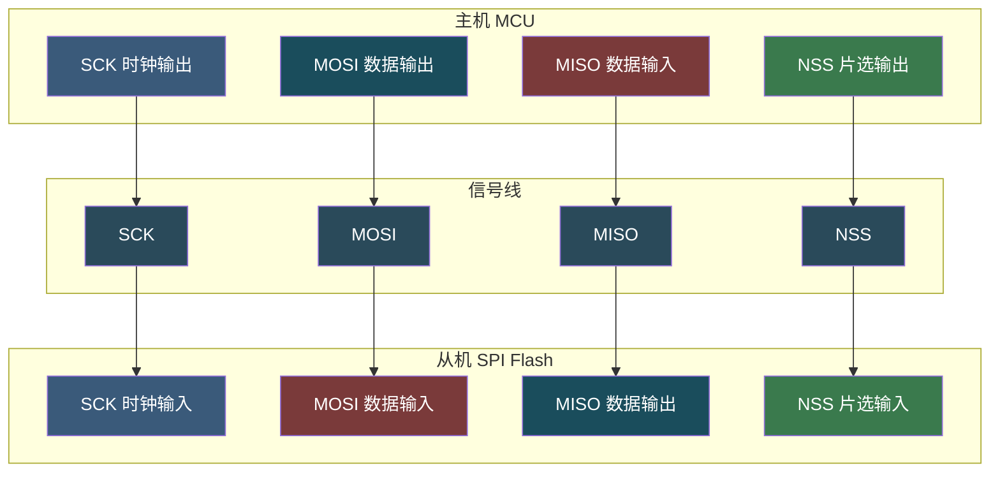
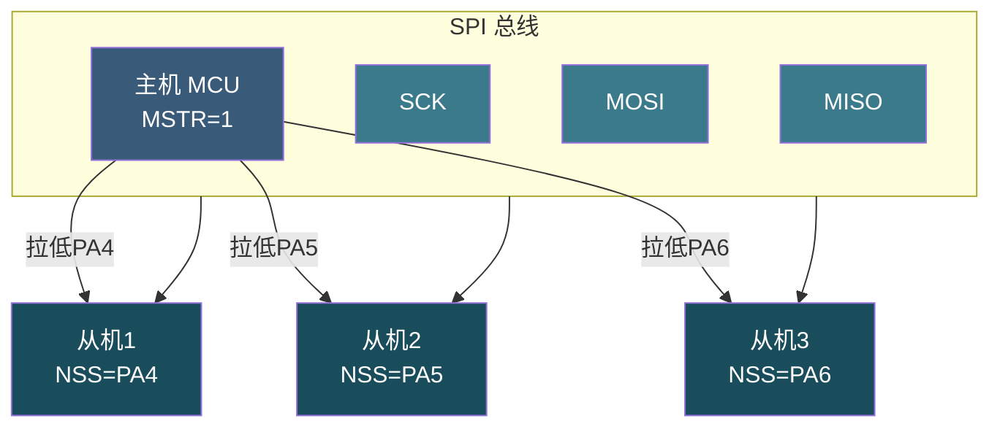
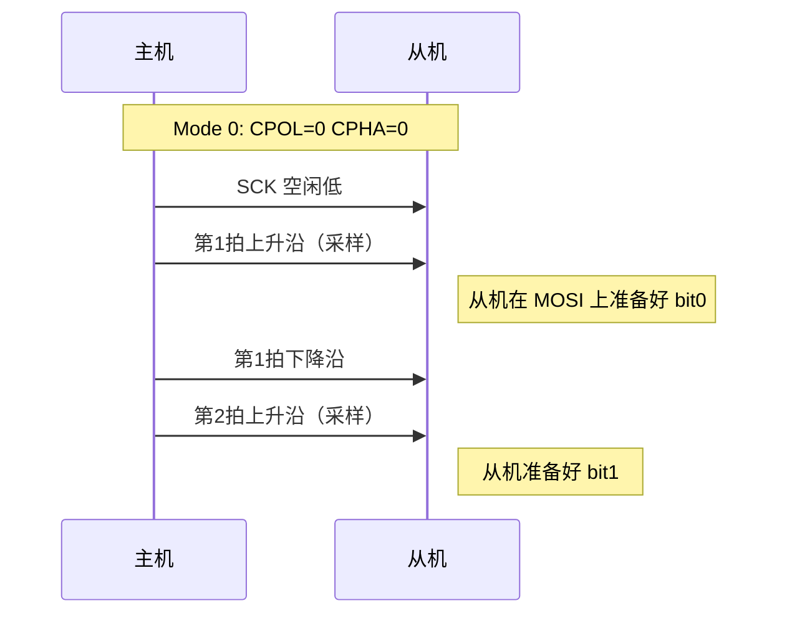
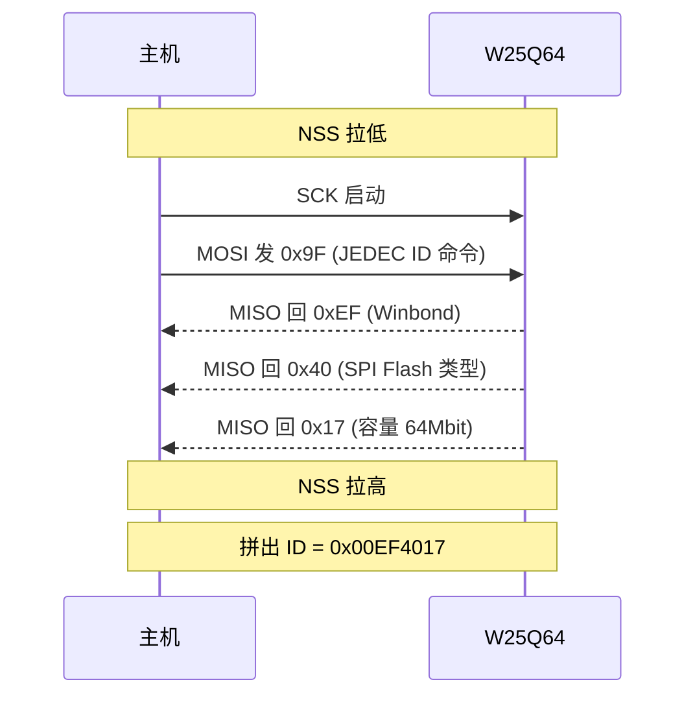

# 【元婴·105】SPI总线：主从模式、时钟极性、DMA传输

> 元婴期 · 第105篇
> 我是玄芯散人，带你从炼气修到大乘。

---

## 境界标识

```
╔════════════════════════════════════╗
║     元婴期 · 第105篇                ║
║     SPI总线：主从模式、时钟极性、DMA传输 ║
║     预计阅读：35分钟                 ║
╚════════════════════════════════════╝
```

---

## 修仙引入

上一篇 104 把 UART 这条传音玉简摸透了，知道异步串行怎么配波特率，知道怎么用 DMA 接收，知道怎么识别不定长数据帧。可 UART 有一个绕不过去的短板：没有共享时钟。两边靠波特率约定采样时机，时钟稍有偏差，长距离传输就累积误差，出乱码。

修真界里如果师徒相隔千里传功，靠语速约定容易失真。需要一种带节拍器的传音术：师徒共用一面鼓，师父敲一下徒弟听一次，绝不出错。这就是 SPI（Serial Peripheral Interface，串行外设接口）。SCK 时钟线就是那面鼓，每敲一下传一比特，发送和接收同步推进，速率可达几十 MHz，比 UART 的 115200 baud 高出一个数量级。

这一篇要拆开讲 SPI 四根线的分工，讲主从模式与 NSS 片选，讲 CPOL/CPHA 四种时钟模式背后的物理含义，再讲 STM32 SPI 寄存器配置，最后讲双 DMA 通道全双工收发，加实战驱动 W25Q Flash 读 JEDEC ID。修完这一篇，再看 SPI Flash 与 SD 卡与 LCD 屏的代码就不会发怵。

修真类比：UART 是隔空传音，SPI 是擂鼓传功。鼓点（SCK）一拍一比特，主鼓手（Master）和弟子（Slave）跟着鼓点同步呼吸，绝不串拍。

---

## 硬核主体

### 一、SPI 是什么：四线同步全双工

SPI 是 Motorola 在 1980 年代提出的同步串行通信协议。一主多从结构，最少四根线。

SCK（Serial Clock）是时钟线，由主机产生。MOSI（Master Out Slave In）走主机到从机的数据。MISO（Master In Slave Out）走从机到主机的数据。NSS（Negative Slave Select，低电平有效）做片选，告诉从机现在跟你说话。

SPI 是全双工：MOSI 和 MISO 同时存在，主机发一字节的同时也在收一字节。一笔 8 比特交换完成后，主机的 DR 寄存器里既有刚发出的字节，也有从机回应的新字节。

修真类比：SPI 是宗门演武场上的双向传功。师父（M）和弟子（S）面对面站着，鼓手敲一下，两人同时出手。师父送出掌风（MOSI 比特），弟子也同步回推一掌（MISO 比特）。鼓响八次，一个来回完成，主从双方各交换一字节。



⚠️ 待确认：四线 SPI 是标准模式，也有三线 SPI（单向共享 MOSI/MISO，多见于 ADC/DAC）。工业上多数 Flash 用四线标准 SPI，本篇按四线讲。

### 二、主从模式：一个师傅多个弟子

SPI 总线上只能有一个主机，可以挂多个从机。怎么区分当前跟谁通信？靠 NSS 片选线。

每个从机都有一根 NSS 引脚接到主机的一个 GPIO。主机要跟某个从机通信，先把对应的 GPIO 拉低，因为 NSS 是低电平有效。被选中的那台机看到自己的 NSS 被拉低，就知道现在跟自己说话。其他从机的 NSS 保持高电平，强制进入休眠，MOSI/MISO 引脚变高阻态，不干扰总线。

修真类比：演武场上有七个弟子站成一排，师父要点名。师父拍一下某个弟子的肩膀（拉低 NSS），被拍的弟子起立听令；其他人（NSS 为高）闭目养神，不接话也不出手。

NSS 信号有两种控制方式。软件 NSS（SSM=1）用普通 GPIO 拉低拉高，软件灵活，多从机时常用。硬件 NSS（SSM=0）让 SPI 外设自动控制 NSS 引脚，单从机时用起来更省事。

主机视角的 MSTR 位（SPI_CR1 寄存器 bit2）必须置 1，否则 SCK 不会输出。MSTR=0 就是从机模式，SCK 改输入，NSS 改输入听主机召唤。



### 三、CPOL 与 CPHA：四种时钟模式的物理含义

SPI 之所以有四种模式，是因为两个参数 CPOL（Clock Polarity，时钟极性）与 CPHA（Clock Phase，时钟相位）各自有两种取值，组合起来就是四种。

CPOL 决定 SCK 空闲时是高电平还是低电平。CPOL=0 表示 SCK 空闲时为低电平（idle low）。CPOL=1 表示 SCK 空闲时为高电平（idle high）。

CPHA 决定数据在 SCK 的哪个边沿被采样（与时钟有效边沿对齐）。CPHA=0 表示在 SCK 的第一个边沿采样，CPHA=1 表示在 SCK 的第二个边沿采样。配合 CPOL 一起看：CPOL=0 时第一边沿是上升沿、第二边沿是下降沿；CPOL=1 时第一边沿是下降沿、第二边沿是上升沿。

四种模式对应表：

| 模式 | CPOL | CPHA | 空闲电平 | 采样边沿 | 数据变化边沿 |
|------|------|------|----------|----------|--------------|
| Mode 0 | 0 | 0 | 低 | 第 1 个（上升沿） | 第 0 个边沿前已稳定 |
| Mode 1 | 0 | 1 | 低 | 第 2 个（下降沿） | 第 1 个边沿后变化 |
| Mode 2 | 1 | 0 | 高 | 第 1 个（下降沿） | 第 0 个边沿前已稳定 |
| Mode 3 | 1 | 1 | 高 | 第 2 个（上升沿） | 第 1 个边沿后变化 |

修真类比：鼓手敲鼓有四种节奏。鼓点起始（空闲）位置不同：有的鼓手第一拍前举棒（CPOL=1），有的垂棒（CPOL=0）。弟子听鼓的时机也不同：有的鼓棒落到最低就听（CPHA=0），有的鼓棒抬到顶才听（CPHA=1）。

Mode 0 与 Mode 3 是嵌入式最常用的两种。W25Q 系列 SPI Flash 同时支持 Mode 0 与 Mode 3（数据手册里写 SPI Modes 0 and 3），所以两者都能跑通。



实际写代码时只需要设两个寄存器位：SPI_CR1 的 CPOL（bit1）与 CPHA（bit0）。比如 W25Q 选 Mode 0，就 `SPI_InitStructure.SPI_CPOL = SPI_CPOL_Low; SPI_InitStructure.SPI_CPHA = SPI_CPHA_1Edge;`。

### 四、STM32 SPI 寄存器的四个主角

STM32 的 SPI 外设控制一组寄存器，CR1 是配置的主战场，CR2 管理 DMA 与中断，SR 是状态查询，DR 是数据收发。

SPI_CR1 是控制寄存器 1，偏移 0x00。其中 MSTR 在 bit2，主从模式选择，1 表示主机，0 表示从机。BR 在 bit5:3，波特率分频，fPCLK 除以 2、4、8、16、32、64、128、256 共八档。CPOL 在 bit1，时钟极性。CPHA 在 bit0，时钟相位。DFF 在 bit11，数据帧格式，0 表示 8-bit，1 表示 16-bit。SPE 在 bit6，SPI 使能。要修改其他位，必须先关 SPE=0，写完再开。

SPI_CR2 是控制寄存器 2，偏移 0x04。TXDMAEN 在 bit1，TX DMA 使能。RXDMAEN 在 bit0，RX DMA 使能。ERRIE 在 bit5，错误中断使能（覆盖 CRC 错、模式错等状况）。

SPI_SR 是状态寄存器，偏移 0x08。TXE 在 bit1，TX 缓冲区空。1 表示可以往 DR 写下一字节。RXNE 在 bit0，RX 缓冲区非空。1 表示 DR 里有刚收到的一字节。

SPI_DR 是数据寄存器，偏移 0x0C。写入要发的字节，读取收到的字节。读写共用一个地址，靠读写维度区分。

修真类比：CR1 是演武场总规。它规定鼓点节奏对应 BR、鼓手起势对应 CPOL/CPHA、主从角色对应 MSTR。CR2 是后勤令，决定要不要雇佣搬运工（DMA）。SR 是鼓手当前状态（鼓空或鼓满）。DR 是传功箱，主机丢进去要发的字、取出来收到的字。

修改 SPI 配置的标准流程：先清 SPE=0 关闭 SPI，然后改 CR1 各字段，最后置 SPE=1 重新使能。不在 SPE=0 时改 CR1，硬件可能不立即生效，配置错位是新手常见坑。

### 五、初始化一个 SPI 主机：以 STM32F407 为例

STM32F407 的 SPI1 挂在 APB2 总线（最高 84 MHz），SPI2 与 SPI3 在 APB1（最高 42 MHz）。标准主机初始化流程如下：

```c
/* SPI1 主机模式，Mode 0，fPCLK2/16 = 5.25 MHz */
void SPI1_Master_Init(void)
{
    /* 1. 开时钟 */
    RCC->AHB1ENR |= RCC_AHB1ENR_GPIOAEN;   /* GPIOA 时钟 */
    RCC->APB2ENR |= RCC_APB2ENR_SPI1EN;    /* SPI1 时钟 */

    /* 2. GPIO 配置：PA5=SCK, PA6=MISO, PA7=MOSI 全部复用 AF5 */
    GPIOA->MODER &= ~((0x3U << (5*2)) | (0x3U << (6*2)) | (0x3U << (7*2)));
    GPIOA->MODER |=  ((0x2U << (5*2)) | (0x2U << (6*2)) | (0x2U << (7*2)));  /* 复用 */
    GPIOA->OSPEEDR |= ((0x3U << (5*2)) | (0x3U << (6*2)) | (0x3U << (7*2)));/* 高速 */
    GPIOA->AFRL &= ~((0xFU << (5*4)) | (0xFU << (6*4)) | (0xFU << (7*4)));
    GPIOA->AFRL |=  ((0x5U << (5*4)) | (0x5U << (6*4)) | (0x5U << (7*4)));  /* AF5 = SPI1 */

    /* 3. SPI1 配置：Mode 0，主机，8-bit，软件 NSS */
    SPI1->CR1 = 0
        | SPI_CR1_MSTR      /* 主机 */
        | SPI_CR1_CPOL_Low  /* CPOL=0 */
        | SPI_CR1_CPHA_1Edge/* CPHA=0，对应 Mode 0 */
        | (0x3U << 3)       /* BR=011：fPCLK/16 = 5.25 MHz */
        | SPI_CR1_SSI       /* 软件 NSS，内部 NSS 高 */
        | SPI_CR1_SSM;      /* 软件从机管理 */
    SPI1->CR1 |= SPI_CR1_SPE;  /* 最后打开 SPI */
}
```

BR 分频对应关系：000 是 fPCLK/2，001 是 fPCLK/4，010 是 fPCLK/8。011 是 fPCLK/16，100 是 fPCLK/32，101 是 fPCLK/64，110 是 fPCLK/128。111 是 fPCLK/256。八档覆盖 fPCLK 除 2 到除 256 的全部范围。

W25Q64 SPI 时钟最高支持 80 MHz，但实际板级走线要考虑信号完整性。STM32F407 Discovery 板带 W25Q64 通常配 5 到 10 MHz，工程上稳妥些。

发送一字节（阻塞方式）：

```c
uint8_t SPI1_SendByte(uint8_t data)
{
    /* 等 TXE=1，上次已发出 */
    while (!(SPI1->SR & SPI_SR_TXE));
    SPI1->DR = data;
    /* 等 RXNE=1，从机已回应 */
    while (!(SPI1->SR & SPI_SR_RXNE));
    return SPI1->DR;
}
```

修真类比：阻塞发送是演武场上师父递一掌回一掌的节奏。师父先把要传的掌（data）丢进传功箱（写 DR），等鼓手敲响（等 TXE），弟子回掌（DR 收到从机字节）才算这一回合完成。

### 六、DMA 全双工收发：双通道并行搬运

阻塞收发只适合调试与低速命令。SPI Flash 读一页 256 字节，按 5 MHz 一字节约 1.6 微秒，CPU 一直轮询 TXE/RXNE 浪费时间。工程上 SPI 收发都用 DMA，TX 一条 DMA 通道，RX 一条 DMA 通道，全双工并行。

STM32F407 的 SPI1 配套 DMA 通道：SPI1_RX 走 DMA2 Stream0 Channel 3（或 Stream2 Channel 3），SPI1_TX 走 DMA2 Stream3 Channel 3。

修真类比：SPI DMA 是双搬运工。传功时师父发掌（MOSI）与弟子回掌（MISO）同时进行，两个搬运工一个专管师父发出那一路（TX DMA），一个专管弟子回传那一路（RX DMA）。CPU 只管开场与收尾，中间过程不必亲自看。

```c
/* SPI1 + 双 DMA 全双工收发初始化 */
#define SPI_BUF_SIZE 256
volatile uint8_t spi_tx_buf[SPI_BUF_SIZE];
volatile uint8_t spi_rx_buf[SPI_BUF_SIZE];

void SPI1_DMA_Init(void)
{
    /* 1. 打开 DMA2 时钟 */
    RCC->AHB1ENR |= RCC_AHB1ENR_DMA2EN;

    /* 2. TX DMA：DMA2 Stream3 Channel 3 */
    DMA2_Stream3->PAR  = (uint32_t)&SPI1->DR;          /* 目标：SPI 数据寄存器 */
    DMA2_Stream3->M0AR = (uint32_t)spi_tx_buf;          /* 源：TX 缓冲区 */
    DMA2_Stream3->NDTR = SPI_BUF_SIZE;
    DMA2_Stream3->CR = 0
        | (3 << 25)     /* Channel 3 = SPI1_TX */
        | (0 << 13)     /* MSIZE = 00 = 8-bit 内存 */
        | (0 << 11)     /* PSIZE = 00 = 8-bit 外设 */
        | (1 << 10)     /* MINC：内存地址递增（TX 源走 M0AR） */
        | (0 <<  9)     /* PINC：外设地址固定（PAR = DR 不动） */
        | (1 <<  4)     /* TCIE：传输完成中断 */
        | (1 <<  0);    /* EN：先使能 DMA 流，等待 SPI TX 触发 */

    /* 3. RX DMA：DMA2 Stream0 Channel 3 */
    DMA2_Stream0->PAR  = (uint32_t)&SPI1->DR;          /* 源：SPI 数据寄存器 */
    DMA2_Stream0->M0AR = (uint32_t)spi_rx_buf;          /* 目标：RX 缓冲区 */
    DMA2_Stream0->NDTR = SPI_BUF_SIZE;
    DMA2_Stream0->CR = 0
        | (3 << 25)     /* Channel 3 = SPI1_RX */
        | (0 << 13)     /* MSIZE = 00 = 8-bit 内存 */
        | (0 << 11)     /* PSIZE = 00 = 8-bit 外设 */
        | (1 << 10)     /* MINC：内存地址递增（RX 目标走 M0AR） */
        | (0 <<  9)     /* PINC：外设地址固定（PAR = DR 不动） */
        | (1 <<  4)     /* TCIE：传输完成中断 */
        | (1 <<  0);    /* EN：先使能 DMA 流，等待 SPI RX 触发 */
}
```

全双工发送有一个重点顺序：先开 RX DMA，再开 SPI TX DMA，最后开 SPI TXE 中断。

```c
/* 全双工 SPI 收发：TX 和 RX 必须同时启动 */
void SPI1_DMA_Transfer(uint8_t *tx, uint8_t *rx, uint16_t len)
{
    /* 1. 把数据搬进 TX 缓冲区 */
    if (tx != NULL) {
        memcpy((void*)spi_tx_buf, tx, len);
    } else {
        memset((void*)spi_tx_buf, 0xFF, len);  /* 无 TX 时填 0xFF 占位 */
    }

    /* 2. 关闭两个 DMA 流 */
    DMA2_Stream3->CR &= ~DMA_SxCR_EN;  /* TX */
    while (DMA2_Stream3->CR & DMA_SxCR_EN);
    DMA2_Stream0->CR &= ~DMA_SxCR_EN;  /* RX */
    while (DMA2_Stream0->CR & DMA_SxCR_EN);

    /* 3. 重装载传输长度 */
    DMA2_Stream3->NDTR = len;
    DMA2_Stream0->NDTR = len;

    /* 4. 清 RX 接收缓冲区（防止收到旧数据） */
    memset((void*)spi_rx_buf, 0, len);

    /* 5. 开 SPI1 的 TXDMAEN 和 RXDMAEN */
    SPI1->CR2 |= SPI_CR2_TXDMAEN | SPI_CR2_RXDMAEN;

    /* 6. 先开 RX DMA（否则第一个字节会丢） */
    DMA2_Stream0->CR |= DMA_SxCR_EN;
    /* 7. 再开 TX DMA（开始发送） */
    DMA2_Stream3->CR |= DMA_SxCR_EN;
}
```

为什么 RX DMA 必须先开？这是 STM32 SPI 的硬件约定。SPI1_DR 收到第一字节时，RX DMA 流如果还没使能，那个字节就丢了。RX DMA 先就位，TX DMA 启动的瞬间，DR 收到的字节立刻被搬运工接走。

修真类比：双搬运工不能搞错出场顺序。接掌的（RX DMA）必须先到位等在传功箱旁边（DR），发掌的（TX DMA）才能启动。如果发掌的先动而接掌的还没到，第一个传过来的字就掉地上了。

### 七、实战：驱动 W25Q64 读 JEDEC ID

W25Q64 是华邦（Winbond）产的 64 Mbit（8 MB）SPI Flash，常用于固件与参数存储。读 JEDEC ID 是最基础的调试命令，用来验证 SPI 链路是否打通。

JEDEC ID 命令（0x9F）的时序：先拉低 CS，然后主机发 0x9F（一字节），从机回 3 字节，分别是 Manufacturer ID（0xEF for Winbond）、Memory Type、Capacity，最后拉高 CS。

```c
/* 读 W25Q64 的 JEDEC ID（验证 SPI 链路） */
uint32_t W25Q_ReadJEDEC_ID(void)
{
    uint8_t tx_buf[4] = { 0x9F, 0xFF, 0xFF, 0xFF };  /* 0x9F + 3 个 dummy */
    uint8_t rx_buf[4] = { 0 };

    /* 1. 拉低 NSS（PA4 软件控制） */
    GPIOA->BSRR = (1U << (4 + 16));  /* PA4 拉低 */

    /* 2. 全双工收发 4 字节 */
    SPI1_DMA_Transfer(tx_buf, rx_buf, 4);

    /* 3. 等待传输完成（阻塞轮询：EN=1 表示 DMA 仍活跃，EN=0 表示完成） */
    while (DMA2_Stream3->CR & DMA_SxCR_EN);  /* 等 TX DMA 流自动关闭（硬件完成后 EN 自动清零） */
    /* 此时 RX DMA 也已同步自动关闭 */

    /* 4. 拉高 NSS */
    GPIOA->BSRR = (1U << 4);  /* PA4 拉高 */

    /* 5. 解析响应：rx_buf[1..3] 是 MFR / TYPE / CAPACITY */
    uint32_t jedec_id = ((uint32_t)rx_buf[1] << 16)
                      | ((uint32_t)rx_buf[2] <<  8)
                      | ((uint32_t)rx_buf[3]);

    return jedec_id;  /* 期望 0x00EF4017（W25Q64）*/
}

void main(void)
{
    SystemInit();
    SPI1_Master_Init();
    SPI1_DMA_Init();

    uint32_t id = W25Q_ReadJEDEC_ID();
    /* id 应该等于 0x00EF4017：华邦 (0xEF) + SPI Flash (0x40) + 64Mbit (0x17) */
    if (id == 0x00EF4017) {
        /* 链路打通，Flash 识别正确 */
    }
}
```

修真类比：读 JEDEC ID 是演武场点名仪式。师父说报上名来（发 0x9F），弟子回三个字：门派（MFR 0xEF 等于华邦），辈分（TYPE 0x40 等于 SPI Flash），修为（CAP 0x17 等于 64 Mbit）。三者拼起来就是 JEDEC ID 0x00EF4017。三个字段回传的顺序里先 Manufacturer，然后 Memory Type，最后 Capacity。



如果读到的 ID 不对，按以下顺序排查：先看 NSS 软件拉低时序，确认发命令前真的拉低、结束后真的拉高；再用示波器抓三根线（SCK、MOSI、MISO），确认波形与 Mode 0 一致。这一步经常能直接抓到 CPOL/CPHA 配错的痕迹。然后验证 SPI 模式，W25Q64 必须 Mode 0 或 Mode 3，CPOL/CPHA 不能搞错。接着降速试试，把 BR 改到 /128，看链路是否能通，再慢慢提速找临界点；最后查硬件接线，看是否短路或虚焊，SCK 与 MOSI 是否接反。

修真类比：弟子回话不对，先查师父的鼓点节奏对不对（CPOL/CPHA），再查师父的鼓速是否太快（BR 分频），再查鼓声是否传到弟子耳朵里（硬件接线）。盲目加大鼓劲只会让信号更乱。

### 八、SPI 调试三大坑

SPI 看似简单，新手常踩三类坑。

第一类坑是 CPOL/CPHA 配错，从机收不到。不同从机的要求不一样。W25Q64 支持 Mode 0 与 Mode 3；ADXL345 加速度计支持 Mode 3；ISD1700 语音芯片支持 Mode 1。配错就是鼓点节奏不对，弟子听不懂。

第二类坑是 SCK 太快，板级信号完整性出问题。原理图上 80 MHz 跑得通，实际 PCB 上 SCK 走线太长、电容太大，反射与振铃会让从机读错数据。工业现场 SPI Flash 一般降到 10 到 20 MHz 稳定。

第三类坑是 DMA 顺序错，丢第一字节。上一节已经讲过：RX DMA 必须先使能，TX DMA 后使能。否则第一个字节从机发回时 RX 流还没就位，字节直接丢失。

修真类比：演武场常见的三个事故。第一种是师父鼓点敲错节奏，弟子听不懂。第二种是师父鼓敲太猛，鼓声在演武场里反弹成回音，弟子听错。第三种是接掌搬运工还没到位，发掌搬运工就动手。

修真界里演武场事故排查按规矩来：先查鼓点（CPOL/CPHA），再查鼓速（BR），最后查搬运工顺序（DMA）。盲目重启大阵是没查清缘由就推倒重来，往往修好了这次，下次同样的坑又来。

---

## 修仙术语对照表

| 修仙术语 | 技术现实 | 本篇位置 |
|----------|----------|----------|
| 擂鼓传功 | SPI 同步串行通信 | 修仙引入 |
| 鼓手敲鼓（SCK） | 主机产生时钟线 | 第一段 |
| 双向传功 | SPI 全双工 MOSI/MISO | 第一段 |
| 弟子起立（NSS 拉低） | 从机被选中通信 | 第二段 |
| 师父拍肩膀（软件 NSS） | GPIO 控制片选 | 第二段 |
| 鼓点起始（CPOL） | 时钟极性 | 第三段 |
| 弟子听鼓时机（CPHA） | 时钟相位 | 第三段 |
| Mode 0/1/2/3 | 四种 SPI 时钟模式 | 第三段 |
| 演武场总规（CR1） | SPI 控制寄存器 1 | 第四段 |
| 后勤令（CR2） | SPI 控制寄存器 2 | 第四段 |
| 鼓手状态（SR） | SPI 状态寄存器 | 第四段 |
| 传功箱（DR） | SPI 数据寄存器 | 第四段 |
| 接掌搬运工（RX DMA） | SPI RX DMA 通道 | 第六段 |
| 发掌搬运工（TX DMA） | SPI TX DMA 通道 | 第六段 |
| 接掌先到位（RX DMA 先开） | RX DMA 流先使能 | 第六段 |
| 演武场点名（JEDEC ID） | W25Q 读 ID 命令 | 第七段 |
| 华邦门派（MFR=0xEF） | W25Q64 Manufacturer ID | 第七段 |
| 鼓点节奏错配 | CPOL/CPHA 配错 | 第八段 |
| 鼓速太快信号反射 | SCK 频率过高 | 第八段 |
| 搬运工顺序错 | DMA 流使能顺序错 | 第八段 |

---

## 进阶条件

SPI 这一篇看完一遍还不算过。读完后请自检：

- [ ] 能说出 SPI 至少 4 根线的名字与维度。SCK、MOSI、MISO、NSS 是这四根
- [ ] 能解释 CPOL/CPHA 四种模式的区别和 Mode 0/3 为最常用
- [ ] 能列出 STM32 SPI 的 4 个寄存器及其重点位，比如 MSTR/BR/CPOL/CPHA/DFF/SPE/TXE/RXNE
- [ ] 能解释为什么 SPI 是全双工，因为 MOSI 与 MISO 同时存在
- [ ] 能解释 NSS 片选的功能（多从机选择 + 低电平有效）
- [ ] 能解释 SPI1 双 DMA 收发时 RX DMA 必须先开的硬件原因
- [ ] 能写出 W25Q64 读 JEDEC ID 命令的时序（0x9F + 3 字节响应）
- [ ] 能说出 W25Q64 的 Manufacturer ID 是 0xEF

如果有一项卡住，回到对应章节重读一遍。SPI 是嵌入式第二道关，UART 解决异步串行，SPI 解决高速同步外设这一类需求。它能挂 Flash 存储，也能挂 SD 卡、LCD 屏、传感器这些设备。下一篇 106 I2C 总线会接着讲两线制同步串行，以及地址冲突、Clock Stretching、总线死锁怎么破。

---

## 下期预告 + 互动

下一篇：106 I2C 总线：地址冲突、Clock Stretching、总线死锁怎么破。

I2C 与 SPI 都是同步串行，但 I2C 只用两根线（SCL/SDA）。为什么 I2C 需要上拉电阻。多个从机地址冲突怎么仲裁。从机把 SCL 拉低不放怎么办（Clock Stretching）。SDA 卡在低电平整个总线死锁怎么恢复。

互动问题：

1. 你调试 SPI 时遇到过哪些诡异状况？比如 ID 错读，或者半字节错位，或者 MOSI/MISO 接反。最后是怎么定位的？
2. SPI 模式四种里你常用的是哪个？项目里有没有踩过模式选错的坑？
3. SPI DMA 全双工收发你用过吗？有没有遇到过第一字节丢失这种坑？按什么顺序开 DMA？

评论区聊聊你的 SPI 调试经历。

---

*本文是「码农修仙传」系列第105篇。系列导航见 [xren.ren](https://xren.ren)*