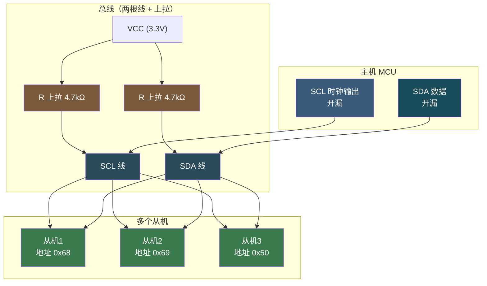
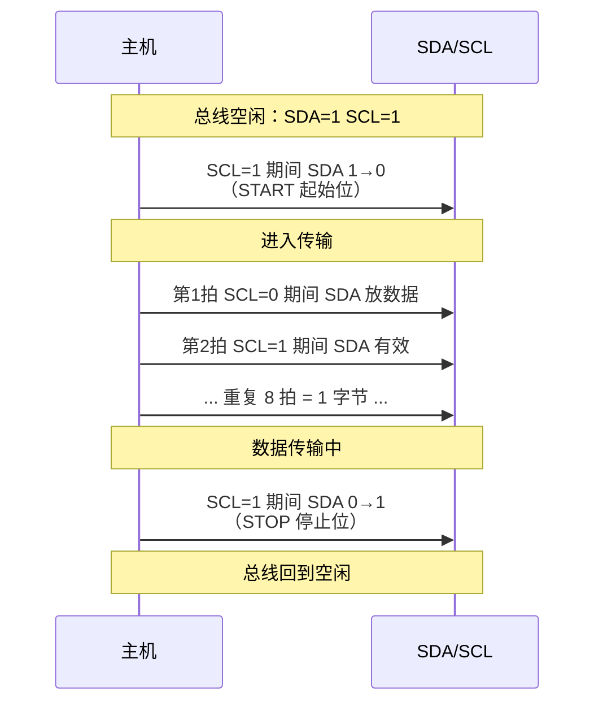
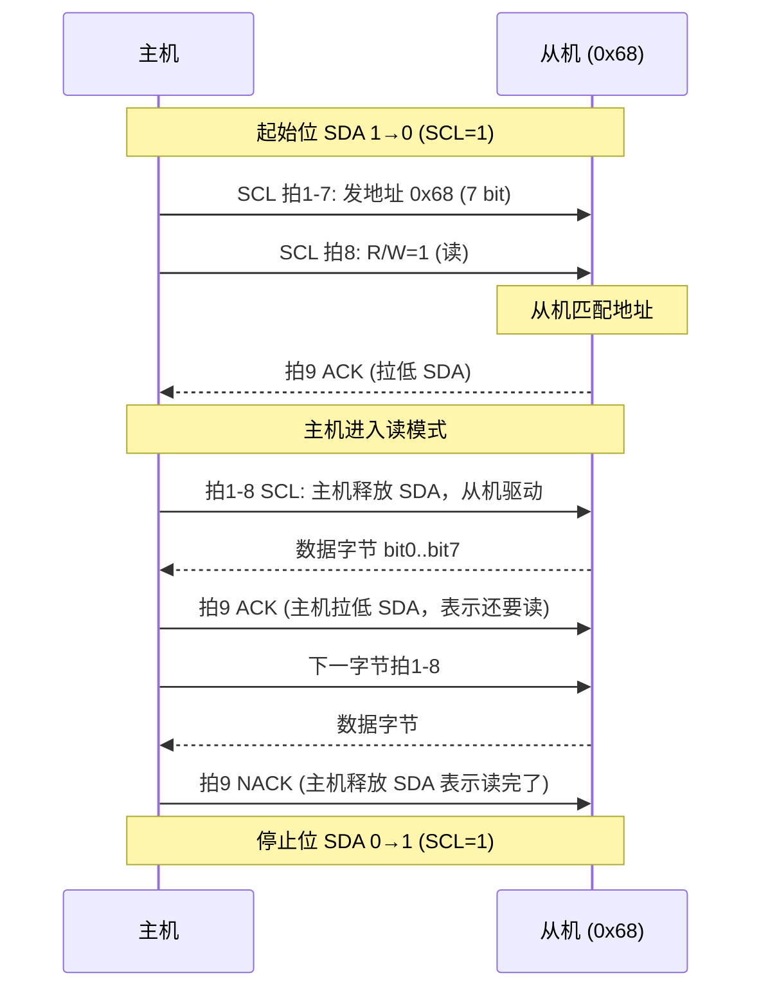
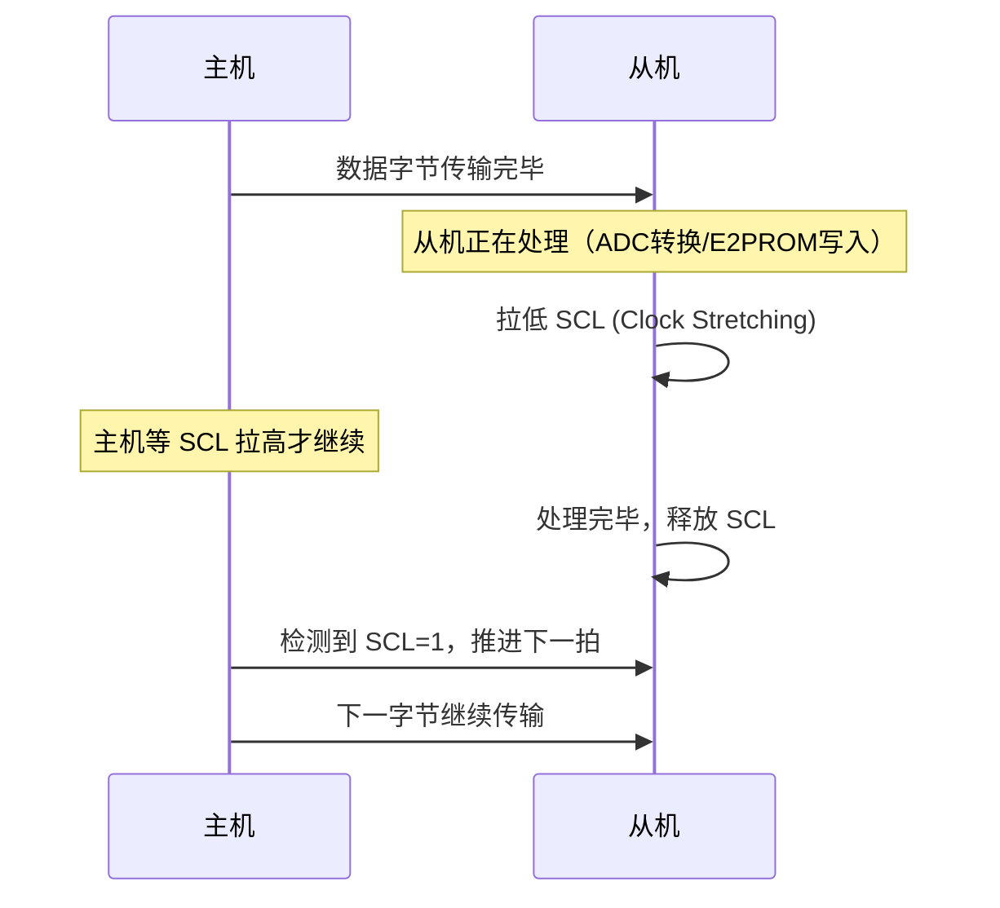
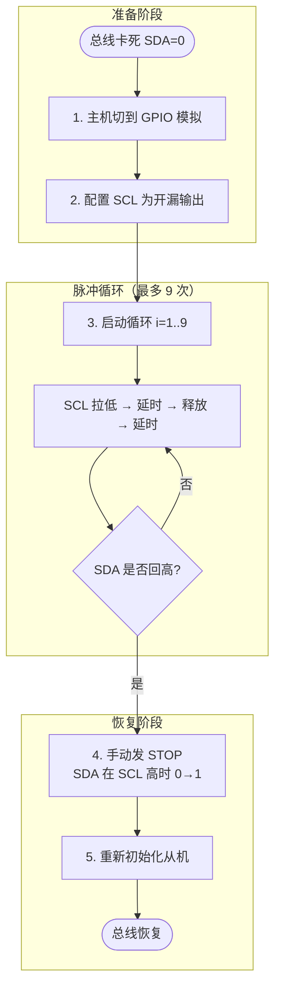
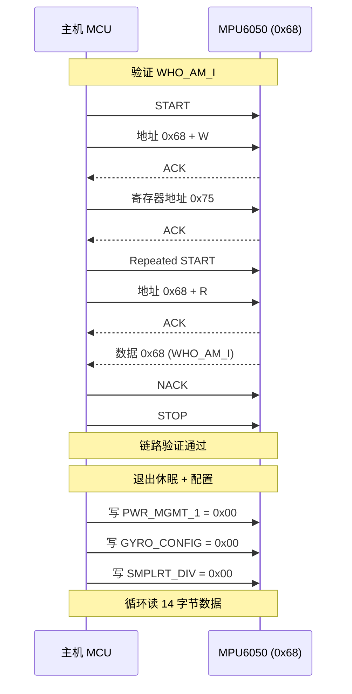

# 【元婴·106】I2C总线：地址冲突、Clock Stretching、总线死锁怎么破

> 元婴期 · 第106篇
> 我是玄芯散人，带你从炼气修到大乘。

---

## 境界标识

```
╔════════════════════════════════════════╗
║     元婴期 · 第106篇                  ║
║     I2C总线：地址冲突、Clock Stretching、总线死锁怎么破 ║
║     预计阅读：40分钟                   ║
╚════════════════════════════════════════╝
```

---

## 修仙引入

上一篇 105 把 SPI 总线擂鼓传功讲透了。四根信号线分工明确，主从模式靠片选区分，CPOL/CPHA 四种时钟模式配对从机。可 SPI 有一个绕不过去的小毛病：每多挂一个从机就要多一根片选线，板上十个传感器就是十根 CS，连线扎成一团。

修真界里众弟子同堂听训，每人站一根铜铃当然好认，可若要在同一张令符上广播传功，就得换规矩。各位弟子各持令牌（7 位地址），师父只敲一面鼓（SCL 时钟），配上另一根传音线（SDA 数据）。哪位弟子被点名（地址匹配），就回一声"是"（ACK）。不被点名的，默不作声。一根数据线大家轮流用，半双工，省线但慢。

修真类比：SPI 是擂鼓传功，一鼓一弟子一对一。I2C 是令牌点名，一位师父串起满堂弟子，地址就是令牌编号。鼓是 SCL，令符是 SDA，喊"到"是 ACK，沉默是 NACK。

这一篇要拆开讲 I2C 两根线的物理约束（开漏加外部上拉），讲起始位与停止位的时序，讲 7 位地址与读写位以及 ACK/NACK 的应答规矩，再讲 Clock Stretching（从机拉低 SCL 请求等待）与总线死锁恢复（9 个时钟脉冲救场），最后讲 STM32 I2C 寄存器配置，加实战驱动 MPU6050 六轴陀螺仪。修完这一篇，再看传感器手册里那一堆"7-bit address 0xXX"的描述就不会发怵。

---

## 硬核主体

### 一、I2C 是什么：两线半双工

I2C（Inter-Integrated Circuit）是 Philips 在 1980 年代提出的同步串行通信协议。一主多从结构，最少两根线。

SCL（Serial Clock）是时钟线，由主机产生。SDA（Serial Data）是数据线，主机和从机都能驱动。两根线都是开漏输出（Open-Drain），意思是设备只能把线拉低或者释放，无法主动拉高。谁要说话，谁就拉低；不说话就释放，外部上拉电阻把线拉回高电平。

修真类比：SCL 是演武场的鼓，SDA 是传音筒。鼓手（主机）一敲鼓，传音筒上下震动一次。但传音筒特殊一点，说话的人只能往下按，不能往上抬。要抬起来，得靠房梁上挂着的弹簧（上拉电阻）。这就是开漏加外部上拉的设计。



为什么必须开漏加外部上拉？因为 I2C 多主机仲裁靠"线与"逻辑：任何一台设备都能拉低线，只有全部释放线才会变高。如果用推挽输出，两台主机同时拉低时一方输出高一方输出低，电源和地之间直接短路，瞬间烧芯片。开漏结构避开了这个雷。

上拉电阻的选择有讲究。标准模式（Sm，100 kHz）一般选 4.7 kΩ，快速模式（Fm，400 kHz）选 2.2 kΩ，更高速（Fm+，1 MHz）选 1 kΩ。电阻太小，电流大但边沿快；电阻太大，边沿慢拖累速率。实际板子上拉电阻算边界值再实测。

修真类比：演武场传音筒上挂弹簧（上拉），不用力按就弹回高位。用力小（电阻大），弹簧弹得慢，传音筒震动糊；用力大（电阻小），弹簧弹得快但费力气。修行讲究力道恰当。

### 二、起始位与停止位：总线状态的边界

I2C 没有片选线，靠起始位（START）和停止位（STOP）来框出一帧传输。

起始位：SCL 高电平时，SDA 由高变低。这是从空闲状态进入传输的边界。主机一旦发出 START，就夺得了总线控制权，其他主机只能等。

停止位：SCL 高电平时，SDA 由低变高。这是传输结束，释放总线的信号。

两根线在总线空闲时都是高电平（都被上拉拉高）。起始位和停止位的共同点是 SDA 都在 SCL 高电平期间变化。SCL 低电平时 SDA 可以自由变化，那是数据比特传输的时刻，不能搞混。

修真类比：演武场传功前先敲一下令鼓（SDA 在 SCL 高时拉低），传功完毕再敲一下（SDA 在 SCL 高时拉高）。鼓点起落才是真正传功的节奏。



注意：起始位和停止位只能由主机发出。从机只能发数据，不能主动发起 START 或 STOP，否则就成了"越权抢令"，违反协议。

### 三、7 位地址 + 读写位 + ACK/NACK

I2C 帧的基本单位是 9 比特：8 比特数据 + 1 比特 ACK。主机发地址那一帧的 8 比特数据里，前 7 位是从机地址，最低位是读写位（R/W）。0 表示主机写从机（Write），1 表示主机读从机（Read）。

主机发完 8 比特后，释放 SDA 线（变高阻）。从机如果识别到自己的地址，必须在第 9 个 SCL 高电平期间把 SDA 拉低，这就是 ACK（Acknowledgement）。如果 SDA 保持高，就是 NACK（Not Acknowledgement）。NACK 含义有两种：从机没收到（地址不对），或者从机收到但忙不过来（暂时不应答）。

地址冲突怎么破？两条腿走路。第一，多从机地址错开：常见传感器默认地址不一样（比如 MPU6050 默认 0x68，AT24C02 默认 0x50），自然不冲突。第二，同型号传感器地址可调：MPU6050 的 AD0 引脚接高电平，地址就从 0x68 变成 0x69；AT24C02 有 A0/A1/A2 三个引脚可配 8 种地址。这样两根 AD 线加三根 A 线，一根 I2C 总线最多挂 8 个 AT24C02。

修真类比：7 位地址是弟子令牌编号。师父喊"0x68 号弟子出列"，那位弟子回"到"（ACK），其他弟子沉默（NACK）。如果两位弟子编号撞了（地址冲突），师父分不清谁应了，这是设计阶段就要避开的事。同门同号的可调编号（AD0 引脚），相当于再发一个临时腰牌，错开即可。



完整的一次 I2C 读取流程：START 加地址字节（带 R/W=1），从机 ACK，发数据字节 1，主机 ACK，再发数据字节 2，主机 NACK，最后 STOP。NACK 标志接收结束，主机发 STOP 释放总线。

💡 提示：现代传感器芯片手册多写 7-bit 地址（如 MPU6050 手册写 0x68），不是带 R/W 位的 8-bit 值。代码里写入 DR 寄存器时需要左移一位腾出最低位给 R/W。

### 四、Clock Stretching：从机拉低 SCL 请求等待

I2C 协议规定从机可以拉低 SCL 来请求主机等待。这就是 Clock Stretching。

主机发完一字节进入第 9 个时钟（ACK 时钟）之前，会把 SCL 拉高准备让从机发 ACK。如果从机还忙着处理上一笔数据（比如 ADC 转换、E2PROM 写入），它会主动把 SCL 拉低。主机检测到 SCL 没拉高，就一直等。直到从机忙完，释放 SCL 让它回到高电平，主机才继续推下一拍。

修真类比：演武场鼓手敲完一通鼓（发了字节），下一通鼓敲之前，弟子拉住鼓槌不放（SCL 拉低），让师父等一下，自己这一掌还没准备好。鼓手看着鼓槌被拉住了，就静静等。弟子整理完衣襟，放开鼓槌（SCL 释放变高），鼓手才继续敲下一通。

Clock Stretching 是合法的延迟机制，主机必须支持。STM32 的 I2C 外设硬件检测 SCL 状态，会自动等待 SCL 变高再继续发下一拍。普通的 GPIO 模拟 I2C（bit-bang）则需要在代码里显式读 SCL 引脚，确认拉高后才推进。



实战中常见两种状况。第一种是从机合理拉伸（合法），常见于 MPU6050 数据准备、E2PROM 写入周期。拉伸时间几微秒到几毫秒。第二种是从机异常拉伸（故障），比如从机死机后 SCL 一直拉低，主机永远等下去。这种情况就要进总线恢复流程，下一节讲。

修真类比：弟子拉住鼓槌等师父，合法；弟子抱住鼓槌不放师父走，那就是闹事，要请执法长老（总线恢复）出场。

### 五、总线死锁：从机卡死拉低 SDA

总线死锁分两种。SCL 死锁和 SDA 死锁，前者相对少见（I2C 多主机仲裁丢主时可能短暂出现），后者是工程中最头疼的。

SDA 死锁常见情况：从机在应答 ACK 时拉低 SDA 表示 ACK，但下一拍主机没及时拉低 SCL，从机无法释放 SDA 切换下一字节数据；或者从机内部故障把 SDA 锁死在低电平。这时主机发 START 或 STOP 也没用，SDA 一直低，起始位和停止位要 SDA 在 SCL 高时跳变，但 SDA 一直低就变化不了。

修真类比：传音筒（SDA）被一个闹事的弟子按住不放，师父再怎么敲鼓（SCL），传音筒都传不出声。整个演武场传功流程卡死，所有人等着。

总线死锁的原因复杂，常见根源包括：从机断电不彻底（VDD 没了但 SDA 还在被上拉拉高时某个 I/O 漏电拉低）；从机程序跑飞（IO 配置错乱）；板级走线短路（机械振动、SDA 撞到 GND）。

修真类比：弟子跑神按住传音筒是表象，根因可能是心神失守（程序跑飞）或经脉断绝（VDD 掉电）。找师父诊断，要先查弟子身体（硬件），再查弟子神识（软件）。

### 六、总线恢复：9 个时钟脉冲救场

SDA 被卡死时，主机发 START 或 STOP 都没用（因为 SDA 一直低，无法在 SCL 高时跳变）。这时候要手动产生最多 9 个 SCL 脉冲，让从机有机会完成当前的字节传输，自己释放 SDA。

具体流程：

1. 把主机 SCL 配置成开漏输出（或者切到 GPIO 软件模拟模式）。
2. 手动翻转 SCL 引脚产生 9 个时钟脉冲，每拍之间短暂延时（典型 5 μs 到 100 μs，看从机响应速度）。
3. 每拍释放 SDA 后，检查 SDA 是否回到高电平。
4. 一旦 SDA 回到高电平，说明从机已经把卡住的字节发完，释放了 SDA。
5. 主机发一个 STOP（手动翻转 SDA 和 SCL 按 STOP 时序），彻底释放总线。
6. 总线恢复后再尝试重新初始化从机。

修真类比：执法长老处理闹事弟子按住传音筒的场面。长老自己手动敲鼓（产生 9 个 SCL 脉冲），每敲一次给弟子一个机会把手松开。每敲一拍，长老检查传音筒是否弹回高位。一旦弹回，再补一个"散场"指令（STOP），传音筒才算真正恢复自由。



9 这个数字不是随便定的。I2C 每帧 9 拍（8 比特数据 + 1 拍 ACK）。从机卡在某一帧中间，最坏情况已经发了 8 比特但没发 ACK，这时从机可能还在第 9 拍拉低 SDA 等主机回应；也可能从机卡在 ACK 拉低后忘了释放。给 9 拍完整时钟，从机就能正常完成它卡住的帧。

工程上还会做点保险：9 拍脉冲前先把主机自己的 I2C 外设复位（PE=0 再 PE=1，或者用 SWRST 位），把从机的 I2C 地址扫描一遍确认活着。如果反复卡死，那可能是硬件问题（上拉电阻虚焊、传感器坏了），要查板子。

修真类比：执法长老手动敲鼓救人不是万能药。如果弟子经脉断了（硬件坏了），敲再多鼓也没用。要先请医修弟子（硬件工程师）查脉象（万用表量上拉电阻、查电源），再决定换药还是换人。

### 七、STM32 I2C 寄存器的七大主角

STM32 的 I2C 外设（按 F1/F4 标准库视角）由 7 个寄存器组成，工作流程和 SPI 不一样，I2C 要软件按事件序列推进，不是简单的"塞 DR 等 TXE"。

I2C_CR1 是控制寄存器 1，偏移 0x00。其中 PE 在 bit0，外设使能。START 在 bit8，软件产生 START。STOP 在 bit9，软件产生 STOP。ACK 在 bit10，应答使能（1 表示 ACK，0 表示 NACK）。SWRST 在 bit15，软件复位（置 1 再清 0 复位整个 I2C 外设）。

I2C_CR2 是控制寄存器 2，偏移 0x04。其中 FREQ[5:0] 在 bit5:0，是 I2C 外设时钟频率（APB1 时钟，单位 MHz，典型 42）。ITEVTEN 在 bit9，事件中断使能。ITBUFEN 在 bit10，缓冲区中断使能。DMAEN 在 bit11，DMA 使能。LAST 在 bit12，下一次 DMA 传输是最后一个字节。

I2C_DR 是数据寄存器，偏移 0x10。写入要发的字节，读取收到的字节。

I2C_SR1 是状态寄存器 1，偏移 0x14。SB 在 bit0，START 已发出（主模式）。ADDR 在 bit1，地址已发出且收到 ACK（主模式）。BTF 在 bit2，字节传输结束（数据加 ACK 都已经走完）。RXNE 在 bit6，接收缓冲区非空。TXE 在 bit7，发送缓冲区空。BERR 在 bit8，总线错误。ARLO 在 bit9，仲裁丢失（多主机时）。AF 在 bit10，应答失败（NACK）。STOPF 在 bit4，STOP 检测到（从模式）。

I2C_SR2 是状态寄存器 2，偏移 0x18。其中 MSL 在 bit0，主/从模式（1 表示主机）。BUSY 在 bit1，总线忙。TRA 在 bit2，发送/接收（1 表示发送）。

I2C_CCR 是时钟控制寄存器，偏移 0x1C。CCR[11:0] 是时钟分频系数。F/S 在 bit15，0 表示标准模式 100 kHz，1 表示快速模式 400 kHz。DUTY 在 bit14，快速模式占空比（0 表示 Tlow:Thigh=2:1，1 表示 16:9）。

I2C_TRISE 是上升时间寄存器，偏移 0x20。TRISE[5:0] 是 SCL 最大上升时间（按 FREQ 字段算，单位是 1/APB1 时钟周期）。标准模式填 FREQ+1，快速模式填 FREQ*300/1000 + 1。

修真类比：CR1 是演武场总规，决定什么时候开始（START）什么时候散（STOP）什么时候喊到（ACK）。CR2 是后勤令，安排多少人搬东西（DMA）、什么情况出声（中断）。SR1 是鼓手当前状态，SB 是集合已敲，ADDR 是点名已应，TXE 是传功箱已空可以再放下一件东西。SR2 是演武场氛围，BUSY 是场上有事在忙，MSL 是师父在主持。CCR 是鼓速，决定每通鼓敲多久。TRISE 是弹簧劲道，决定传音筒弹回要多快。

I2C 操作和 SPI 不同：SPI 可以单次写完不管，I2C 必须按事件序列走。先检查 SB=1（START 已发出）才能写 DR（地址）；写完地址等 ADDR=1 才能清 ADDR（读 SR1 再读 SR2 清掉）；等 TXE=1 才能写下一字节数据；等 RXNE=1 才能读收到的字节；最后一字节等 BTF=1 后再清 ADDR 或发 STOP。事件序列不按规矩走，数据就乱。

### 八、初始化 STM32 I2C 主机：以 STM32F407 为例

STM32F407 的 I2C1 挂在 APB1 总线（最高 42 MHz）。标准主机初始化流程：先开 GPIO 和 I2C 时钟，配置 PB8/PB9 为复用开漏 AF4，再设 CR2 的 FREQ，最后设 CCR 和 TRISE 配置时序。

```c
/* I2C1 主机模式，100 kHz（标准模式），PB8=SCL PB9=SDA */
void I2C1_Master_Init(void)
{
    /* 1. 开时钟 */
    RCC->AHB1ENR |= RCC_AHB1ENR_GPIOBEN;   /* GPIOB 时钟 */
    RCC->APB1ENR |= RCC_APB1ENR_I2C1EN;    /* I2C1 时钟 */

    /* 2. GPIO 配置：PB8=SCL, PB9=SDA 复用开漏 AF4 */
    GPIOB->MODER &= ~((0x3U << (8*2)) | (0x3U << (9*2)));
    GPIOB->MODER |=  ((0x2U << (8*2)) | (0x2U << (9*2)));   /* 复用模式 */
    GPIOB->OTYPER |= ((1U << 8) | (1U << 9));                /* 开漏输出 */
    GPIOB->OSPEEDR |= ((0x2U << (8*2)) | (0x2U << (9*2)));  /* 高速 */
    GPIOB->PUPDR |= ((0x1U << (8*2)) | (0x1U << (9*2)));    /* 上拉（可选，板级也可能有） */
    GPIOB->AFRH &= ~((0xFU << ((8-8)*4)) | (0xFU << ((9-8)*4)));
    GPIOB->AFRH |=  ((0x4U << ((8-8)*4)) | (0x4U << ((9-8)*4)));  /* AF4 = I2C1 */

    /* 3. 复位 I2C1（可选但推荐） */
    I2C1->CR1 |= I2C_CR1_SWRST;
    I2C1->CR1 &= ~I2C_CR1_SWRST;

    /* 4. 设 APB1 频率（42 MHz → FREQ = 42） */
    I2C1->CR2 = 42;

    /* 5. 设 100 kHz 标准模式：CCR = 42MHz / (2 * 100kHz) = 210 */
    I2C1->CCR = 210;     /* F/S=0 标准模式 */

    /* 6. 设最大上升时间：标准模式 TRISE = FREQ + 1 = 43 */
    I2C1->TRISE = 43;

    /* 7. 使能 I2C */
    I2C1->CR1 |= I2C_CR1_PE;
}
```

CCR 计算公式：标准模式 CCR = fPCLK1 / (2 * fSCL)。fPCLK1 是 APB1 时钟（42 MHz），fSCL 是目标 SCL 频率（100 kHz）。42 MHz 除以 (2 乘 100 kHz) 等于 210。快速模式 DUTY=0 时 CCR = fPCLK1 / (3 * fSCL)，DUTY=1 时 CCR = fPCLK1 / (25 * fSCL)。

修真类比：师父登台前要先排好演武场。算好鼓速（CCR），调好弹簧劲道（TRISE），请好仲裁长老（CR2 FREQ 告诉长老场上是什么钟摆）。这些参数算错，鼓敲快了弟子跟不上，敲慢了传音筒弹不到位。

💡 提示：STM32 不同系列（F1/F4/F7/H7）的 I2C 外设细节略有差异，F1 的 I2C1 对应到 PB6/PB7 而不是 PB8/PB9。本文按 STM32F407 写，F1 用户需要查 Reference Manual 改 GPIO 对应关系。

### 九、读写一字节：按事件序列推进

I2C 读写不像 SPI 那样一行代码搞定，要按事件序列一步步等标志位。

主机写一字节（地址字节）：

```c
/* 主机发送地址字节（带 R/W=0 写） */
uint8_t I2C1_WriteAddr(uint8_t addr_7bit, uint8_t rw)
{
    uint16_t dr = (addr_7bit << 1) | (rw & 0x1);  /* 7 位地址 + R/W */

    /* 1. 等总线空闲 */
    uint32_t timeout = 100000;
    while ((I2C1->SR2 & I2C_SR2_BUSY) && (--timeout));

    /* 2. 产生 START */
    I2C1->CR1 |= I2C_CR1_START;
    /* 3. 等 START 已发出 */
    timeout = 100000;
    while (!(I2C1->SR1 & I2C_SR1_SB) && (--timeout));
    if (timeout == 0) return 0;  /* START 失败 */

    /* 4. 写地址字节 */
    I2C1->DR = dr;
    /* 5. 等地址已发送且收到 ACK（或收到 NACK） */
    timeout = 100000;
    while (!(I2C1->SR1 & I2C_SR1_ADDR) && (--timeout));
    if (timeout == 0) return 0;  /* 地址阶段超时 */

    /* 6. 清 ADDR（读 SR1 再读 SR2） */
    (void)I2C1->SR1;
    (void)I2C1->SR2;
    /* 注意：若主机需要收下一字节数据，ACK 位要在 ADDR 清掉之前置 1，否则从机可能因没看到 ACK 而停发下一字节 */
    /* 此时检查 AF 位 */
    if (I2C1->SR1 & I2C_SR1_AF) {
        I2C1->SR1 &= ~I2C_SR1_AF;  /* 清 AF */
        return 0;  /* NACK，从机不应答 */
    }

    return 1;  /* 成功 */
}
```

主机读一字节（最后一字节发 NACK）：

```c
/* 主机读 N 个字节，最后一字节发 NACK */
void I2C1_ReadMulti(uint8_t addr_7bit, uint8_t *buf, uint16_t len)
{
    /* 1. START + 地址字节（R/W=1） */
    I2C1_WriteAddr(addr_7bit, 1);

    /* 2. 使能 ACK（除了最后一字节前） */
    if (len > 1) {
        I2C1->CR1 |= I2C_CR1_ACK;
    } else {
        I2C1->CR1 &= ~I2C_CR1_ACK;  /* 只读 1 字节，发 NACK */
    }

    for (uint16_t i = 0; i < len; i++) {
        /* 等 RXNE=1 */
        uint32_t timeout = 100000;
        while (!(I2C1->SR1 & I2C_SR1_RXNE) && (--timeout));
        if (timeout == 0) break;

        buf[i] = I2C1->DR;

        /* 不是最后一字节：保持 ACK；是最后一字节前：关 ACK */
        if (i == len - 2) {
            I2C1->CR1 &= ~I2C_CR1_ACK;  /* 下一字节发 NACK */
        }
        /* 是最后一字节：先准备 STOP */
        if (i == len - 1) {
            I2C1->CR1 |= I2C_CR1_STOP;
        }
    }
}
```

修真类比：师父点名不是一句喊完就完事。要先敲集合鼓（START），等鼓点响（SB）才能喊令牌（写 DR）。喊完等弟子应答（ADDR），应答了（ACK）才能继续。读弟子回话也一样，等弟子说完（RXNE）才能接（读 DR）。弟子最后一句话不接（NACK），然后敲散场鼓（STOP）。

### 十、实战：驱动 MPU6050 读 WHO_AM_I

MPU6050 是 InvenSense（现属 TDK）产的 6 轴 IMU（3 轴加速度加 3 轴陀螺仪），常用于无人机和平衡车。I2C 接口，默认地址 0x68（AD0 引脚接低），拉高 AD0 改为 0x69。WHO_AM_I 寄存器（0x75）固定返回 0x68（与 AD0 引脚无关，AD0 只改变 I2C 从机地址），可以用来验证传感器活着。

驱动流程：

1. 初始化 STM32 I2C1 主机。
2. 读 WHO_AM_I 验证链路：如果读到 0x68 说明传感器活着。
3. 写 PWR_MGMT_1（0x6B）清 SLEEP 位（0x00），让传感器退出休眠。
4. 配置采样率（SMPLRT_DIV=0x19，GYRO_CONFIG=0x00），数据准备好。
5. 循环读加速度和角速度寄存器（0x3B 起 14 字节）。

```c
/* MPU6050 寄存器定义 */
#define MPU6050_ADDR        0x68    /* AD0=0 时的 7 位地址 */
#define MPU6050_WHO_AM_I    0x75
#define MPU6050_PWR_MGMT_1  0x6B
#define MPU6050_ACCEL_XOUT  0x3B    /* 14 字节连续读 */
#define MPU6050_GYRO_CONFIG 0x1B
#define MPU6050_SMPLRT_DIV  0x19

/* 写 MPU6050 单寄存器 */
uint8_t MPU6050_WriteReg(uint8_t reg, uint8_t val)
{
    if (!I2C1_WriteAddr(MPU6050_ADDR, 0)) return 0;  /* 写地址 */

    /* 写寄存器地址 */
    uint32_t timeout = 100000;
    while (!(I2C1->SR1 & I2C_SR1_TXE) && (--timeout));
    if (timeout == 0) return 0;
    I2C1->DR = reg;

    /* 写值 */
    timeout = 100000;
    while (!(I2C1->SR1 & I2C_SR1_TXE) && (--timeout));
    if (timeout == 0) return 0;
    I2C1->DR = val;

    /* 等 BTF（字节传输结束） */
    timeout = 100000;
    while (!(I2C1->SR1 & I2C_SR1_BTF) && (--timeout));
    if (timeout == 0) return 0;

    /* STOP */
    I2C1->CR1 |= I2C_CR1_STOP;
    return 1;
}

/* 读 MPU6050 单寄存器 */
uint8_t MPU6050_ReadReg(uint8_t reg, uint8_t *val)
{
    /* 写寄存器地址（写阶段） */
    if (!I2C1_WriteAddr(MPU6050_ADDR, 0)) return 0;
    uint32_t timeout = 100000;
    while (!(I2C1->SR1 & I2C_SR1_TXE) && (--timeout));
    if (timeout == 0) return 0;
    I2C1->DR = reg;
    timeout = 100000;
    while (!(I2C1->SR1 & I2C_SR1_BTF) && (--timeout));
    if (timeout == 0) return 0;

    /* 产生 Repeated START（不释放总线直接发读地址） */
    I2C1->CR1 |= I2C_CR1_START;
    timeout = 100000;
    while (!(I2C1->SR1 & I2C_SR1_SB) && (--timeout));
    if (timeout == 0) return 0;

    /* 发读地址 */
    I2C1->DR = (MPU6050_ADDR << 1) | 0x1;
    timeout = 100000;
    while (!(I2C1->SR1 & I2C_SR1_ADDR) && (--timeout));
    if (timeout == 0) return 0;
    (void)I2C1->SR1;
    (void)I2C1->SR2;

    /* 关 ACK（只读 1 字节） */
    I2C1->CR1 &= ~I2C_CR1_ACK;
    /* 等 RXNE */
    timeout = 100000;
    while (!(I2C1->SR1 & I2C_SR1_RXNE) && (--timeout));
    if (timeout == 0) return 0;

    /* STOP + 读 */
    I2C1->CR1 |= I2C_CR1_STOP;
    *val = I2C1->DR;
    return 1;
}

/* 验证链路 */
uint8_t MPU6050_Check(void)
{
    uint8_t who = 0;
    if (!MPU6050_ReadReg(MPU6050_WHO_AM_I, &who)) return 0;
    if (who != 0x68) return 0;  /* 期望 0x68 */
    return 1;
}

void main(void)
{
    SystemInit();
    I2C1_Master_Init();

    if (!MPU6050_Check()) {
        /* 链路不通，可能地址错、接线错、上拉电阻虚焊 */
        while (1);
    }

    /* 退出休眠：清 SLEEP 位 */
    MPU6050_WriteReg(MPU6050_PWR_MGMT_1, 0x00);
    /* 配置陀螺仪 ±250°/s */
    MPU6050_WriteReg(MPU6050_GYRO_CONFIG, 0x00);
    /* 采样率 1kHz / (1+0) = 1kHz */
    MPU6050_WriteReg(MPU6050_SMPLRT_DIV, 0x00);

    while (1) {
        uint8_t buf[14];
        /* 读 14 字节：从 ACCEL_XOUT_H (0x3B) 开始 */
        /* 略：连续读取可基于上面 ReadReg 实现多字节版本 */
        /* ... */
    }
}
```

修真类比：驱动 MPU6050 是给弟子上课。师父先点名验证弟子在场（WHO_AM_I 应答 0x68，固定值不随弟子腰牌变化），再让弟子退出休眠（清 SLEEP 位），再问弟子几斤几两（读加速度和角速度）。弟子不答应，先查腰牌（地址）有没有带错，再查耳朵（接线）有没有塞好，最后查弹簧（上拉电阻）有没有断。



### 十一、I2C 调试四大坑

第一类坑：地址错配。手头手册写 7 位地址 0x68，代码里写成 0xD0（带 R/W=0 的 8 位值）发给 DR。结果从机不认识。解决：7 位地址写代码时左移一位 `(addr << 1) | R/W`，不要混淆 7 位地址和 8 位地址。

第二类坑：上拉电阻缺失。板子上没加上拉电阻，SDA 与 SCL 一直被线与逻辑拉低（其实是上拉失败），I2C 永远 BUSY。解决：每根线加 4.7 kΩ 上拉到 VCC，标准模式 100 kHz 时这是底线。

第三类坑：事件序列错位。写完 DR 没等 TXE 又写一次，结果数据错位。读 SR1 不读 SR2，ADDR 标志不清，后续被卡死。解决：严格按照 SB 到写 DR 到 ADDR 到清 SR1+SR2 到 TXE/RXNE 到 BTF 到 STOP 的序列走。

第四类坑：总线死锁没救场。从机异常拉低 SDA，主机程序卡在 while(!(SR1 & SB))。解决：写一个 watchdog 定时器，超时未完成就触发总线恢复流程（手动 9 个 SCL 脉冲）。

修真类比：弟子腰牌写错、上拉弹簧断了、敲鼓顺序乱、鼓手卡死没救场，这是四种常见事故。演武场规矩事先讲明，事故按规程处理。每一次卡死都不是意外，是上一环节的疏忽。

---

## 修仙术语对照表

| 修仙术语 | 技术现实 | 本篇位置 |
|----------|----------|----------|
| 令牌点名 | I2C 同步串行通信 | 修仙引入 |
| 鼓（SCL） | 主机产生时钟线 | 第一段 |
| 传音筒（SDA） | 半双工数据线 | 第一段 |
| 开漏 + 弹簧（上拉） | Open-Drain + Pull-up 电阻 | 第一段 |
| 集合鼓（START） | 起始位 SDA 在 SCL 高时 1→0 | 第二段 |
| 散场鼓（STOP） | 停止位 SDA 在 SCL 高时 0→1 | 第二段 |
| 弟子令牌（7 位地址） | 从机设备地址 | 第三段 |
| 喊"到"（ACK） | 第 9 拍 SDA 拉低应答 | 第三段 |
| 沉默（NACK） | 第 9 拍 SDA 保持高 | 第三段 |
| 腰牌可调（AD0 引脚） | MPU6050 地址 0x68/0x69 切换 | 第三段 |
| 拉住鼓槌（Clock Stretching） | 从机拉低 SCL 请求等待 | 第四段 |
| 传音筒被按住（总线死锁） | 从机异常拉低 SDA | 第五段 |
| 手动敲鼓救人 | 9 个 SCL 脉冲恢复 | 第六段 |
| 演武场总规（CR1） | I2C 控制寄存器 1 | 第七段 |
| 后勤令（CR2） | I2C 控制寄存器 2 | 第七段 |
| 鼓速（CCR） | I2C 时钟分频 | 第七段 |
| 弹簧劲道（TRISE） | I2C 上升时间 | 第七段 |
| 鼓手状态（SR1/SR2） | I2C 状态寄存器 | 第七段 |
| 弟子腰牌检查 | MPU6050 WHO_AM_I 应答 | 第十段 |
| 弟子退出休眠（清 SLEEP） | 写 PWR_MGMT_1 = 0x00 | 第十段 |
| 演武场四大事故 | I2C 调试四大坑 | 第十一段 |

---

## 进阶条件

I2C 这一篇看完一遍还不算过。读完后请自检：

- [ ] 能说出 I2C 两根线的名字（SCL、SDA）以及为什么必须开漏加外部上拉
- [ ] 能解释起始位与停止位的时序条件（都是 SDA 在 SCL 高电平期间变化）
- [ ] 能解释 7 位地址 + R/W 位如何组成 8 比特发给 DR，以及 ACK/NACK 在第 9 拍
- [ ] 能说出标准模式（100 kHz）和快速模式（400 kHz）的上拉电阻选型
- [ ] 能解释 Clock Stretching 的硬件机制，以及主机为什么要等 SCL 拉高
- [ ] 能解释总线死锁怎么发生（从机拉低 SDA 不放），以及 9 个 SCL 脉冲恢复流程
- [ ] 能列出 STM32 I2C 的 7 个寄存器及其标志位，比如 CR1 的 PE/START/STOP/ACK，SR1 的 SB/ADDR/BTF/RXNE/TXE/AF
- [ ] 能解释 MPU6050 的 WHO_AM_I 应答是什么，以及 PWR_MGMT_1 怎么退出休眠
- [ ] 能写出 MPU6050 读单寄存器的 Repeated START 时序

如果有一项卡住，回到对应章节重读一遍。I2C 是嵌入式第三道关，UART 解决异步串行，SPI 解决高速同步外设，I2C 解决多设备低速共享总线。它能挂 EEPROM，能挂各种传感器，能挂 IO 扩展器与音频编解码器。下一篇 107 ADC 采样会接着讲模拟到数字的转换。

---

## 下期预告 + 互动

下一篇：107 ADC 采样：DMA 双缓冲流水线。

现实世界是连续的模拟量。ADC（Analog-to-Digital Converter）就是把模拟电压翻译成数字的翻译官。STM32F407 的 ADC 是 12 位逐次逼近型，最多支持 16 个通道加 3 个内部通道。触发源怎么选，软件触发、定时器触发还是外部中断触发？DMA 双缓冲怎么实现不丢点的高频采样？数据对齐怎么配，左对齐还是右对齐？这些问题下一篇拆开讲。

互动问题：

1. 你调试 I2C 时遇到过哪些诡异状况？比如 ACK 死活收不到，或者读到一半卡死，或者地址怎么改都对不上。最后是怎么定位的？
2. 总线死锁这种事故你遇到过吗？是软件复位解决，还是手动 SCL 脉冲救场？上拉电阻有没有补焊过？
3. MPU6050 你驱动过吗？WHO_AM_I 第一次读到 0x68 的时候什么心情？姿态解算用的什么算法（DMP 还是自己写的 Mahony）？

评论区聊聊你的 I2C 调试经历。

*本文是这个 IP 系列第106篇。系列导航见 [xren.ren](https://xren.ren)*