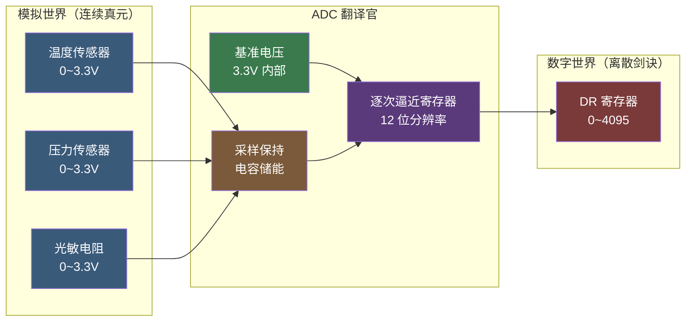
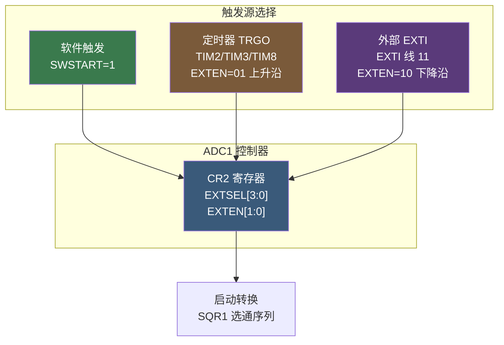
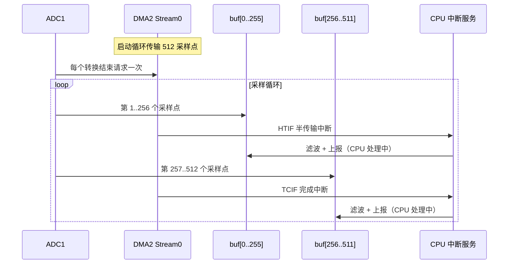

# 【元婴·107】ADC采样：DMA双缓冲流水线

> 元婴期 · 第107篇
> 我是玄芯散人，带你从炼气修到大乘。

---

## 境界标识

```
╔════════════════════════════════════════╗
║     元婴期 · 第107篇                  ║
║     ADC采样：DMA双缓冲流水线            ║
║     预计阅读：45分钟                   ║
╚════════════════════════════════════════╝
```

---

## 修仙引入

上一篇 106 把 I2C 总线的令牌点名拆完了。SCL 是集合鼓，SDA 是传音筒，7 位地址是弟子腰牌。两根线串起一整堂弟子，靠 ACK 应答识别谁在场。

可修真界全是连续的真元波动，外在表现可以是温度、压力、光强这类真气感应。MCU 只认识 0 和 1，遇到这种"连绵不绝"的模拟量就抓瞎。需要一位翻译官，把连续的电压翻译成离散的数字。ADC（Analog-to-Digital Converter，模数转换器）就是这位翻译官。

这一篇的 STM32F4 ADC 以实际工程为主线，先讲通道配置、采样时间的计算，再讲对齐方式的工程取舍。

修真类比：修真之气的强度变化是连续的真气波动，温度、压力、光强都算真气感应之类。MCU 这位剑修只认剑诀（0/1 二值）。ADC 是传功长老，把真气流强度（0~3.3V）按等阶切分，每一阶对应一个剑诀（0~4095，12 位）。弟子按剑诀大小施法，灵力有多少便发多少。

这一篇要拆开讲 ADC 采样保持电路的工作原理，讲触发源的工程差异与选法，讲扫描模式多通道采样的序列寄存器配置（SQR1/SQR2/SQR3），讲 DMA 双缓冲流水线的实现（HTIF 半传输中断 + TCIF 完成中断交替处理 buffer），讲数据对齐方式（左对齐 vs 右对齐），最后实战多通道温度采集。修完这一篇，再看到传感器手册里"12-bit ADC, sample rate up to X kSPS, multi-channel DMA"这些参数就不会发怵。

---

## 硬核主体

### 一、ADC 是什么：把连续模拟量切成离散数字

ADC 的本职是把一个连续的模拟电压，按预设的基准切成有限个等阶，输出对应的数字码。STM32F4 内部嵌入三个 12 位逐次逼近型 ADC（ADC1/ADC2/ADC3），共享同一组采样通道。单 ADC 上限 1.2 MSPS（采样时钟 30 MHz），双 ADC 交错采样的极限是 2.4 MSPS。

逐次逼近是常用结构。把输入电压与一组按二进制权重配置的参考电压依次比较，12 次比较后逼近输入值，每一次逼近一位精度。

修真类比：长老拿一根千分尺量灵力。千分尺有 12 圈刻度，每圈代表一位精度。先量大圈，确定大致范围（最高位 MSB）；再量次大圈，细化范围（次高位）；一直量到最小圈（最低位 LSB）。12 圈量完，灵力大小精确到 1/4096。这就是逐次逼近型 ADC 的工作方式。

量化过程有一个绕不过去的精度损失。12 位 ADC 把 0~3.3V 切成 4096 等份，每份约 0.8 mV。如果输入电压比 0.8 mV 还小的变化，就识别不出。

修真类比：千分尺精度有限，灵力比最小刻度还细微的变化会被忽略，这就是量化误差。要提高精度，要么加 ADC 位数（16/24 位），要么加 PGA 放大器把信号放大，要么用 sigma-delta 调制（牺牲速度换精度）。



### 二、采样保持电路：为什么需要采样时间

ADC 不是瞬间完成翻译的，从采样指令发起到 12 位数字码出炉包含两段：采样时间与转换时间。采样时间把外部电压灌进 ADC 内部采样电容。转换时间是逐次逼近 12 次比较的过程。

采样时间不够会出事。ADC 内部有个采样电容（典型 8 pF），外部信号源要通过一个等效输入电阻给它充电。如果采样窗口太短，电容没充满，采到的电压比实际值偏小，造成非线性误差。

修真类比：长老拿着水瓢往河里舀水。水瓢放进河里要等水面稳定，再快速提出。瓢放得越久水越满，提出时水就不洒。如果放下去就提出，瓢里只到一半，这就是采样不足。STM32 ADC 通过 SMP[2:0] 位域配置采样时间，可选 3/15/28/56/84/112/144/480 个 ADC 时钟周期。阻抗越高，需要的采样周期越长。

具体选多少看信号源阻抗。手册建议：输入阻抗 < 10 kΩ 时选 15 周期就够；输入阻抗在 10~50 kΩ 之间选 28 或 56 周期；50 kΩ 以上选 84 或更长。温度传感器、MEMS 麦克风等高阻信号源一般选 480 周期。

### 三、ADC 时钟配置

STM32F407 的 ADC 时钟来源于 APB2（最大 84 MHz），经过 ADCPRE[1:0] 分频器二次分频，最高 ADC 时钟是 36 MHz（手册 RP 章节明确给出上限）。分频系数可选 2/4/6/8，对应 ADCCLK = 84M / 6 = 14 MHz 或 84M / 4 = 21 MHz 等。

修真类比：ADC 时钟是长老出剑的节奏。APB2 是宗门鼓点（84 MHz），长老嫌太快受不了，用 ADCPRE 把节奏降到 14 或 21 MHz。低于 14 MHz 长老动作生疏（采样时间分档变粗），高于 36 MHz 长老手抖（精度不达标），要折中。

```c
/* 打开 ADC1 时钟 */
RCC->APB2ENR |= RCC_APB2ENR_ADC1EN;

/* 配置 ADC 预分频：APB2 84MHz / 6 = 14MHz */
ADC->CCR &= ~ADC_CCR_ADCPRE;
ADC->CCR |=  ADC_CCR_ADCPRE_1;  /* 10b = ADCPRE=10 → /6 */

/* 启用温度传感器和 VREFINT 通道 */
ADC->CCR |= ADC_CCR_TSVREFE;
```

### 四、触发源选择：软件 / 定时器 / 外部

ADC 启动一次转换需要一个"开始"的信号，这个信号就是触发源。STM32F4 ADC 在硬件层面支持多种触发，例如软件命令或定时器 TRGO 又或外部 EXTI 引脚。

软件触发最简单。设置 CR2 寄存器的 SWSTART 位（ADON=1 后置 1），启动一次转换。扫描模式下，SWSTART 启动整个序列（多通道自动切换）。

定时器触发通过定时器的 TRGO（Trigger Output）信号触发。STM32 的定时器可以配置为输出 PWM 或更新事件时产生 TRGO 脉冲，ADC 收到 TRGO 自动启动转换。这是高速多通道采样的标准配置，保证采样率精确等于定时器频率。

修真类比：长老拍腿自己起阵是手动起阵；用宗门的报时钟触发，是按节奏稳定起阵；山门外有人敲钟触发，那是事件驱动。三类触发方式各有用途：手动测试用软件最直观；固定频率采样用定时器；外部事件驱动用外部中断。

外部引脚触发是 EXTI 硬件事件触发。这种场合用于"按键按下才采样"、"外部信号上升沿触发捕获"之类的事件。EXTI 线 11 对应 ADC 的外部触发，可以配成上升沿、下降沿或双边沿响应。

```c
/* 软件触发一次转换（单通道、无扫描） */
ADC1->CR2 |= ADC_CR2_SWSTART;

/* 定时器触发：配置 TIM2 TRGO 事件作为 ADC1 触发源 */
/* CR2 位域：EXTEN[1:0] 在 bit[29:28]，EXTSEL[3:0] 在 bit[27:24] */
/* 0110 = TIM2 TRGO event */
ADC1->CR2 &= ~ADC_CR2_EXTSEL;
ADC1->CR2 |=  (0x6U << 24);   /* EXTSEL=0110: TIM2 TRGO event */

/* 上升沿触发 */
ADC1->CR2 &= ~ADC_CR2_EXTEN;
ADC1->CR2 |=  ADC_CR2_EXTEN_0;  /* 01 = 上升沿触发 */
```



### 五、扫描模式与序列寄存器：多通道编排

扫描模式（SCAN=1）允许一次触发扫描多个通道，按 SQR1/SQR2/SQR3 三个序列寄存器编排顺序。每个寄存器 32 位，分多个 SQx 字段，每个字段 5 位选择通道编号（0~18）。

SQR1 寄存器包含 L[3:0] 字段指定总通道数（1~16）和 SQ1~SQ4 字段。SQR2 包含 SQ5~SQ9。SQR3 包含 SQ10~SQ16。

修真类比：扫描模式是长老按弟子名单依次点卯。名单三卷（SQR1/2/3），每卷四列，共可列 16 名弟子。L[3:0] 指定点卯几位弟子。长老从第一卷开始依次点，点完最后一位（L 指定的那位）触发 EOC（End of Conversion）。

```c
/* 扫描模式：扫描通道 0、1、4、5 共 4 个 */
ADC1->CR1 |= ADC_CR1_SCAN;     /* 使能扫描模式 */
ADC1->CR1 |= ADC_CR1_EOCIE;    /* 转换结束中断 */

/* L[3:0] = 3，表示 4 次转换（0~15 代表 1~16） */
ADC1->SQR1 &= ~ADC_SQR1_L;
ADC1->SQR1 |=  (3U << 20);     /* L=3 → 4 个通道 */

/* SQ1=通道 0，SQ2=通道 1，SQ3=通道 4，SQ4=通道 5 */
ADC1->SQR3 = (0U << 0)   /* SQ1 = ch0 */
           | (1U << 5)   /* SQ2 = ch1 */
           | (4U << 10)  /* SQ3 = ch4 */
           | (5U << 15); /* SQ4 = ch5 */

/* 采样时间：通道 0 和 1 用 56 周期，通道 4 和 5 用 480 周期 */
ADC1->SMPR2 = (3U << 0)   /* ch0:  56 cycles */
            | (3U << 3)   /* ch1:  56 cycles */
            | (7U << 12)  /* ch4:  480 cycles */
            | (7U << 15); /* ch5:  480 cycles */
```

### 六、DMA 双缓冲流水线：双半区轮换处理

#### 6.1 为什么需要 DMA

不带 DMA 的方案是：每次 ADC 转换结束产生中断，CPU 读 DR，存内存，再回去处理其他事。采样率高（10 kHz 以上）或通道多时，中断频率爆炸，CPU 时间全被读 DR 占满。这就是 104 讲过的 DMA 解法，让 DMA 引擎搬运数据，CPU 释放出来。

修真类比：104 讲过 UART DMA 接收，这次 ADC 一样适用。每读完一次 DR，DMA 自动把 DR 值搬到内存。CPU 不用中断读 DR，可以腾出手算其它修真大事。

#### 6.2 半传输中断与完成中断

DMA 双缓冲的核心是两个中断：HTIF（Half Transfer Flag，半传输中断标志）和 TCIF（Transfer Complete Flag，完成中断标志）。

把两个缓冲区拼成一个 DMA 视图。比如 bufA[256] 与 bufB[256] 拼成 bufTotal[512]。DMA 搬运 bufTotal 时，先填 bufA[0..255]，到达中点时硬件置位 HTIF，触发中断。CPU 在中断里处理 bufA（比如低通滤波、上报）。DMA 同时继续填 bufB[256..511]，填完置位 TCIF，触发另一个中断，CPU 处理 bufB。

修真类比：两个水缸轮换接水。长老把水从河里抽进 A 缸，A 缸满了（半传输中断）就把缸封起来用法术处理；同时水继续抽进 B 缸，B 缸满了（完成中断）也封起来处理。下一个轮回从 A 缸开始。两缸接力，永远不会溢，永远不会断流。这就是双缓冲流水线。

双缓冲的好处：

- CPU 永远处理的那一半数据，是 DMA 不再写入的稳定数据
- 两半交替处理，CPU 处理时间被 DMA 搬运时间覆盖，整体效率接近 100%
- 不会因为 CPU 处理慢导致采样时丢点

#### 6.3 STM32F4 的双缓冲实现

STM32F407 不像 STM32H7 那样有硬件双缓冲模式（DMA 有个 CT/DM 模式自动切换两个目标地址）。F407 走"软双缓冲"路线：用一个长缓冲区，配合 HTIF + TCIF 两个中断，在中断服务程序里切换语义。

```c
#define BUF_SIZE  512    /* 总采样数组，每个缓冲 256 个采样点 */
__IO uint16_t adc_buf[BUF_SIZE];

/* 启动 ADC1 + DMA2 Stream0 */
void ADC1_DMA_DualBuffer_Init(void)
{
    /* 1. 时钟 */
    RCC->APB2ENR |= RCC_APB2ENR_ADC1EN;
    RCC->AHB1ENR |= RCC_AHB1ENR_DMA2EN;

    /* 2. 配置 DMA2 Stream0 */
    DMA2_Stream0->PAR  = (uint32_t)&ADC1->DR;   /* 源 = ADC1 数据寄存器 */
    DMA2_Stream0->M0AR = (uint32_t)adc_buf;     /* 目标 = adc_buf */
    DMA2_Stream0->NDTR = BUF_SIZE;              /* 传输总长度 */
    DMA2_Stream0->CR  = DMA_SxCR_DIR_0         /* 02: 外设到内存 */
                     | DMA_SxCR_CIRC            /* 循环模式 */
                     | DMA_SxCR_PSIZE_0         /* 源 16 位 */
                     | DMA_SxCR_MSIZE_0         /* 目标 16 位 */
                     | DMA_SxCR_PL_1;           /* 高优先级 */
    DMA2_Stream0->FCR = 0;                      /* 直接模式（不开 FIFO） */

    /* 3. 使能 DMA 半传输中断 + 完成中断 */
    DMA2_Stream0->CR |= DMA_SxCR_HTIE | DMA_SxCR_TCIE;
    NVIC_SetPriority(DMA2_Stream0_IRQn, 5);
    NVIC_EnableIRQ(DMA2_Stream0_IRQn);

    /* 4. 通道选择：DMA2 Stream0 必须选 Channel0 给 ADC1（F407 ADC1 固定映射） */
    DMA2_Stream0->CR = (DMA2_Stream0->CR & ~DMA_SxCR_CHSEL)
                     | (0U << 25);  /* CHSEL=000 → Channel 0 = ADC1 */

    /* 5. 使能 ADC1 的 DMA 请求 */
    ADC1->CR2 |= ADC_CR2_DMA | ADC_CR2_CONT;
    /* 注意：扫描模式下 DMA 必须设为循环模式 */

    /* 6. 启动 DMA */
    DMA2_Stream0->CR |= DMA_SxCR_EN;

    /* 7. 校准流程：先 RSTCAL，再 CAL，最后启动 */
    ADC1->CR2 |= ADC_CR2_RSTCAL;
    while (ADC1->CR2 & ADC_CR2_RSTCAL);
    ADC1->CR2 |= ADC_CR2_CAL;
    while (ADC1->CR2 & ADC_CR2_CAL);
    ADC1->CR2 |= ADC_CR2_SWSTART;  /* 软件触发启动转换 */
}

/* 双缓冲中断处理 */
void DMA2_Stream0_IRQHandler(void)
{
    /* 状态标志在 DMA2->LISR，读后用 LIFCR 对应位写 1 清 0 */
    if (DMA2->LISR & DMA_LISR_HTIF0) {
        DMA2->LIFCR = DMA_LIFCR_CHTIF0;  /* 清 Stream0 半传输标志 */
        /* 处理 adc_buf[0..255]，此处填低通滤波 + 上报逻辑 */
        Process_Buffer(&adc_buf[0], BUF_SIZE/2);
    }
    if (DMA2->LISR & DMA_LISR_TCIF0) {
        DMA2->LIFCR = DMA_LIFCR_CTCIF0;  /* 清 Stream0 完成标志 */
        /* 处理 adc_buf[256..511] */
        Process_Buffer(&adc_buf[BUF_SIZE/2], BUF_SIZE/2);
    }
}
```

修真类比：长老把水抽进两个水缸的轮换，靠两声鼓响切换。半水鼓响（HTIF）处理甲缸；满缸鼓响（TCIF）处理乙缸；下一轮甲缸又装满。鼓手是 DMA 引擎，敲鼓是硬件中断，长老是 CPU，互不耽误。



### 七、数据对齐：左对齐 vs 右对齐

ADC 数据寄存器 DR 是 16 位，12 位有效数据可以靠左（ALIGN=1）或靠右（ALIGN=0）放置。这是"数据对齐"选项。

右对齐是默认。数字 0~4095 占用 bit[11:0]，bit[15:12] 是 0。读 `adc_val = ADC1->DR` 直接得到 0~4095，方便 `voltage = adc_val * 3.3 / 4095` 计算。

左对齐是数字 0~4095 占用 bit[15:4]，bit[3:0] 是 0。这相当于把 12 位数据移到 16 位的高位，低 4 位补零，存储格式不变，只是数据位置靠左。这给软件过采样留了空间——左移 4 位之后低位可以继续累加多组采样做平均，向上扩展精度的算法会更顺手。实践中绝大多数场景用右对齐就好，左对齐是留给特殊软件过采样算法用的。

修真类比：右对齐是把数字放在竹简最右端，方便从右往左读出原始值。左对齐是把数字放在竹简最左端，高位对齐，方便比对。绝大多数场景用右对齐就好，左对齐是留给特殊软件过采样算法用的。

```c
/* 右对齐（默认） */
ADC1->CR2 &= ~ADC_CR2_ALIGN;

/* 左对齐 */
ADC1->CR2 |= ADC_CR2_ALIGN;
```

### 八、多通道与 DMA：双缓冲精度陷阱

扫描模式 + DMA 双缓冲 + 多通道，几个细节决定能否真正跑通：

第一个是 DMA 位宽。ADC DR 是 16 位，DMA 源和目标位宽都要配 16 位（PSIZE=MSIZE=01），不然只能搬 8 位，丢精度。

第二个是 DMA 模式必须是循环（CIRC=1）。扫描模式不停采，DMA 必须循环回到地址 0，不然采到 NDTR 个点就停了。

第三个是通道切换的稳定时间。多个通道切换时，ADC 会留下"换通道空载"开销（典型 8~15 个 ADC 周期），高阻抗信号源要额外预充。`SMP[2:0]` 配的是单个通道的采样时间，不含换通道开销。

修真类比：长老点卯名单上每位弟子，要给弟子"肃立"前那段响应时间。如果名单排得密、弟子反应慢，就会漏点。SMPR2 配 480 周期，相当于给每位弟子充足的反应时间，名单可以排得密但不会漏。

### 九、实战：多通道温度采集

把上面的零件拼起来，做一个多通道温度采集。三路模拟信号（光敏电阻 / 热敏电阻 / 外部电压），DMA 双缓冲流水线处理。

```c
#include "stm32f407xx.h"

#define BUF_LEN 256  /* 单个缓冲长度，总缓冲 = 512 */
__IO uint16_t adc_buf[BUF_LEN * 2];

void ADC1_MultiCh_DMA_Init(void)
{
    /* 时钟与 GPIO */
    RCC->APB2ENR |= RCC_APB2ENR_ADC1EN;
    RCC->AHB1ENR |= RCC_AHB1ENR_DMA2EN;
    RCC->AHB1ENR |= RCC_AHB1ENR_GPIOAEN;

    /* PA0 (ADC1_IN0) PA1 (ADC1_IN1) PA4 (ADC1_IN4) */
    GPIOA->MODER = (GPIOA->MODER & ~((3U << (0*2)) | (3U << (1*2)) | (3U << (4*2))))
                | (3U << (0*2)) | (3U << (1*2)) | (3U << (4*2));

    /* ADC 时钟：APB2 84MHz / 6 = 14MHz */
    ADC->CCR &= ~ADC_CCR_ADCPRE;
    ADC->CCR |=  ADC_CCR_ADCPRE_1;  /* 10b = ADCPRE=10 → /6 */

    /* DMA2 Stream0：外设 -> 内存，循环，16 位 */
    DMA2_Stream0->PAR  = (uint32_t)&ADC1->DR;
    DMA2_Stream0->M0AR = (uint32_t)adc_buf;
    DMA2_Stream0->NDTR = BUF_LEN * 2;
    DMA2_Stream0->CR  = DMA_SxCR_DIR_0      /* 02: 外设到内存 */
                     | DMA_SxCR_CIRC         /* 循环模式 */
                     | DMA_SxCR_PSIZE_0      /* 源 16 位 */
                     | DMA_SxCR_MSIZE_0      /* 目标 16 位 */
                     | DMA_SxCR_PL_1         /* 高优先级 */
                     | (0U << 25)            /* CHSEL=000 → Channel0 = ADC1 (F407 固定) */
                     | DMA_SxCR_HTIE
                     | DMA_SxCR_TCIE;
    NVIC_SetPriority(DMA2_Stream0_IRQn, 5);
    NVIC_EnableIRQ(DMA2_Stream0_IRQn);

    /* ADC 扫描模式 + 连续 + DMA */
    ADC1->CR1 = ADC_CR1_SCAN;
    ADC1->CR2 = ADC_CR2_DMA | ADC_CR2_CONT | ADC_CR2_ADON;

    /* 通道序列：ch0 → ch1 → ch4，共 3 个通道 */
    ADC1->SQR1 = (2U << 20);  /* L = 2 → 3 个通道 */
    ADC1->SQR3 = (0U << 0)    /* SQ1 = ch0 */
               | (1U << 5)    /* SQ2 = ch1 */
               | (4U << 10);  /* SQ3 = ch4 */

    /* 采样时间：ch0/ch1 用 56 周期，ch4 用 480 周期 */
    ADC1->SMPR2 = (3U << 0)
                | (3U << 3)
                | (7U << 12);

    /* 校准（手册要求） */
    ADC1->CR2 |= ADC_CR2_RSTCAL;
    while (ADC1->CR2 & ADC_CR2_RSTCAL);
    ADC1->CR2 |= ADC_CR2_CAL;
    while (ADC1->CR2 & ADC_CR2_CAL);

    /* 启动 DMA + ADC */
    DMA2_Stream0->CR |= DMA_SxCR_EN;
    ADC1->CR2 |= ADC_CR2_SWSTART;
}

/* 处理函数：对每半缓冲区做平均 + 上报 */
void Process_Buffer(__IO uint16_t *buf, uint32_t len)
{
    uint32_t sum = 0;
    for (uint32_t i = 0; i < len; i++) {
        sum += buf[i] & 0x0FFF;  /* 右对齐，屏蔽高 4 位 */
    }
    uint16_t avg = sum / len;
    /* 转电压：avg * 3.3 / 4095 → 单位 V */
    /* 串口上报或 OLED 显示 */
    Report_To_UART(avg);
}

void DMA2_Stream0_IRQHandler(void)
{
    if (DMA2->LISR & DMA_LISR_HTIF0) {
        DMA2->LIFCR = DMA_LIFCR_CHTIF0;
        Process_Buffer(&adc_buf[0], BUF_LEN);
    }
    if (DMA2->LISR & DMA_LISR_TCIF0) {
        DMA2->LIFCR = DMA_LIFCR_CTCIF0;
        Process_Buffer(&adc_buf[BUF_LEN], BUF_LEN);
    }
}
```

修真类比：这一整套程序像布一座定时接水阵。山门外三条溪流（PA0/PA1/PA4），长老在水流处各放一只水瓢（采样保持电路）。鼓声响起，半刻钟（A 缸装满）就处理甲缸，半刻钟后（乙缸装满）处理乙缸。两缸轮换不停，三股水流的信息源源不断送到长老手里。

### 十、ADC 调试四大坑

第一类坑：ADC 时钟超 36 MHz。直接配 APB2 = 84 MHz 不分频，ADC 时钟 84 MHz。手册上限 36 MHz，跑一会就漂。解决：ADCPRE 必须配 /6 或 /8，ADC 时钟 14/10 MHz。

第二类坑：DMA 配成单次模式。NDTR=512，采完 512 个点就停，剩下采不到。开 CIRC 循环模式让 DMA 永不停止。

第三类坑：数据对齐被忽视。DR 默认右对齐，结果按手册给的左对齐算，差 16 倍。解决：用之前先读 ALIGN 位确认，或者按左对齐去读 DR。

第四类坑：扫描模式下未开 DMA。扫描模式 ADC 自动跑过所有通道，没 DMA 接收数据会全部丢失。解决：开 ADC_CR2.DMA 位，或在中断里读 DR（高频时容易丢）。

修真类比：时钟超速是长老出剑过频走火入魔；DMA 单次是水瓢接满水倒地上浪费；数据对齐反了是弟子把数字从左往右念错；扫描无 DMA 是长老点了名却没人应，到场弟子都跑了。四个坑对应四种修真事故，每一次都是上一步遗漏。

---

## 修仙术语对照表

| 修仙术语 | 技术现实 | 本篇位置 |
|----------|----------|----------|
| 翻译官 | ADC（模数转换器） | 第一段 |
| 千分尺 | 逐次逼近寄存器 | 第一段 |
| 水瓢舀水 | 采样保持电路 | 第二段 |
| 报时钟鼓点 | ADCPRE 预分频 | 第三段 |
| 长老拍腿起阵 | 软件触发 SWSTART | 第四段 |
| 宗门报时钟（TRGO） | 定时器触发 | 第四段 |
| 山门敲钟 | 外部 EXTI 触发 | 第四段 |
| 点卯名单 | SQR1/SQR2/SQR3 序列寄存器 | 第五段 |
| 水瓢接水时间 | SMP[2:0] 采样时间 | 第五段 |
| 弟子反应时间 | 通道切换稳定时间 | 第八段 |
| 双水缸轮换 | DMA 双缓冲 | 第六段 |
| 半水鼓（HTIF） | DMA 半传输中断 | 第六段 |
| 满缸鼓（TCIF） | DMA 完成中断 | 第六段 |
| 剑诀右对齐 | 数据右对齐 ALIGN=0 | 第七段 |
| 剑诀左对齐 | 数据左对齐 ALIGN=1 | 第七段 |
| 16 位对位 | DMA PSIZE/MSIZE=16 位 | 第八段 |
| 长老走火 | ADC 时钟超 36 MHz | 第十段 |
| 名单无应答 | 扫描模式未开 DMA | 第十段 |

---

## 进阶条件

ADC 这一篇看完一遍还不算过。读完后请自检：

- [ ] 能说出 STM32F407 ADC 的分辨率（12 位）和单 ADC 采样率（1.2 MSPS）
- [ ] 能解释采样保持电路的工作过程，以及为什么采样时间不能太短
- [ ] 能配 ADCPRE 让 ADC 时钟不超过 36 MHz
- [ ] 能区分软件触发、定时器触发与外部 EXTI 触发的差异与应用场合
- [ ] 能配置 SQR1/SQR2/SQR3 排定扫描序列，并设置 L[3:0] 指定通道数
- [ ] 能解释 DMA 双缓冲（HTIF 处理前半、TCIF 处理后半）的原理
- [ ] 能写出 ADC + DMA 的初始化代码，含通道序列与采样时间配置
- [ ] 能解释右对齐与左对齐的区别，以及右对齐怎么读 DR 转电压
- [ ] 能列出 ADC 调试几类常见坑（时钟超速类、扫描无 DMA 类、对齐弄错类）

如果有一项卡住，回到对应章节重读一遍。ADC 是嵌入式第四道关，UART 解决异步串行，SPI 解决高速同步外设，I2C 解决多设备低速共享总线，ADC 把模拟量翻译成数字。下一篇 108 会讲定时器的 PWM 输出与输入捕获。

---

## 下期预告 + 互动

下一篇：108 定时器详解：PWM、输入捕获、编码器接口。

定时器是 STM32 体内最精密的脉搏。它能发 PWM 调光调速，能用输入捕获测方波频率，还能配成编码器接口读电机转速。107 讲的 ADC 定时器触发（TRGO）就是定时器的另一个用法。108 把 TRGO 配置与 PWM 实战讲透，再展开输入捕获测频的精度验证。PWM 输出让 LED 调光和电机调速不再用 for 循环延误；输入捕获可以测方波频率，精度达微秒级；编码器接口能直接读电机转速，省去外部计数器。STM32F407 有 8 个定时器，按基本/通用/高级分级，能力各有差别。

互动问题：

1. 你用过 ADC 吗？单通道轮询 vs 多通道 DMA 双缓冲，性能差距体验过吗？
2. 双缓冲的 HTIF 和 TCIF 中断各处理什么数据？CPU 处理时间过长会怎样？
3. ADC 时钟配过吗？14 MHz 还是 21 MHz，哪个对噪声更友好？
4. 数据对齐左对齐的应用场景你试过吗？软件过采样时怎么用？

评论区聊聊你的 ADC 实战经历。

*本文是「码农修仙传」系列第107篇。系列导航见 [xren.ren](https://xren.ren)*
