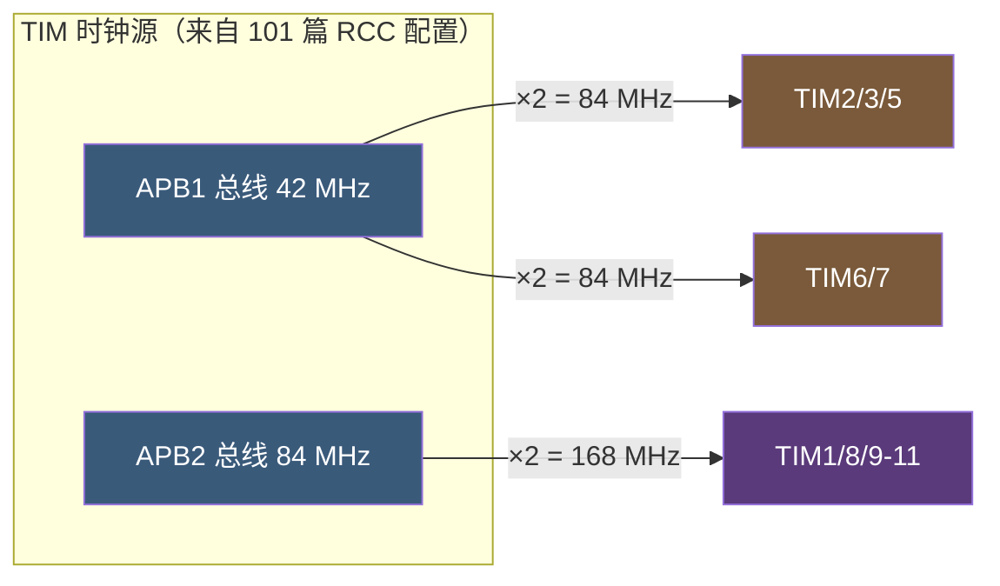
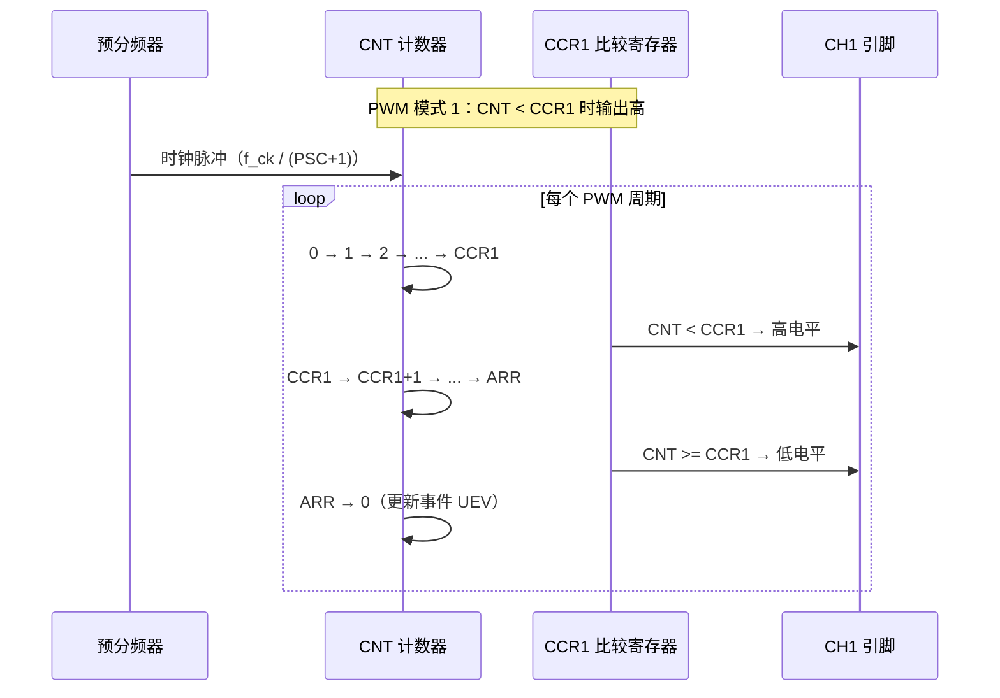
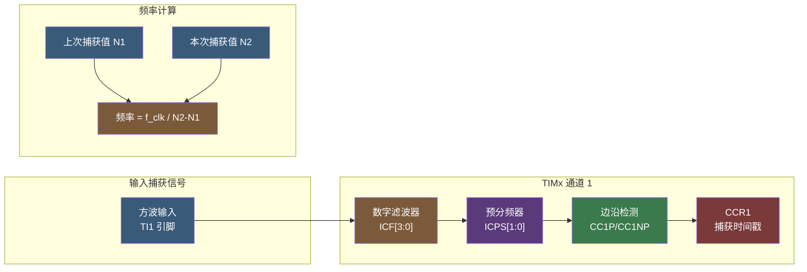
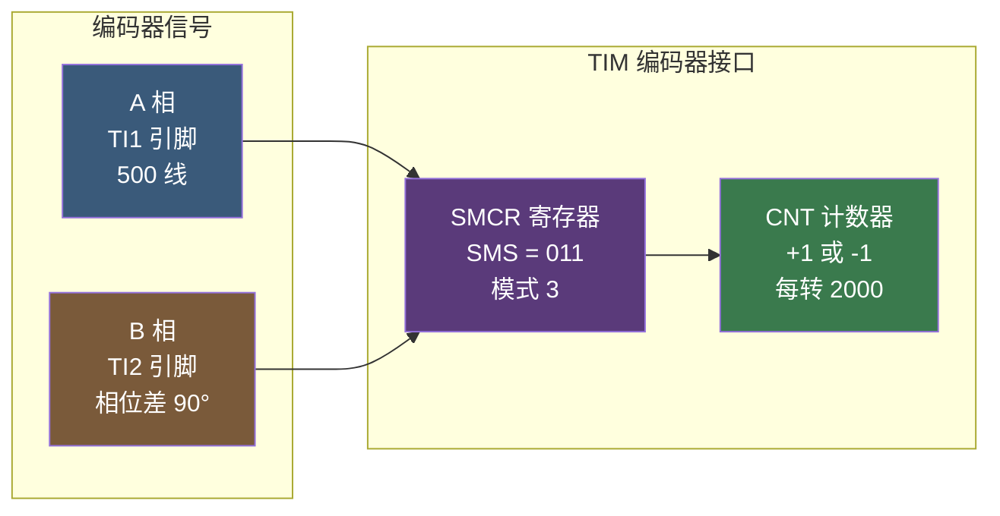

# 【元婴·108】定时器详解：PWM、输入捕获、编码器接口

> 元婴期 · 第108篇
> 我是玄芯散人，带你从炼气修到大乘。

---

## 境界标识

```
╔════════════════════════════════════════╗
║     元婴期 · 第108篇                  ║
║     定时器详解：PWM、输入捕获、编码器接口 ║
║     预计阅读：50分钟                   ║
╚════════════════════════════════════════╝
```

---

## 修仙引入

107 篇把 ADC 的"千分尺"讲完了，长老可以把真元（模拟电压）切成剑诀（数字码）。可修真界还有一类常见功夫：按节奏发功控制 LED 亮度，听回声做超声波测距，读电机转了几圈做编码器计数。这些功夫共享同一个前置法器，叫定时器（Timer）。

修真类比：修真者按境界分门别类，筑基打底，金丹凝丹，元婴出法相，三层功夫各不相同。MCU 这位剑修没有天生的心跳，要在体内炼一枚铜壶滴漏，以滴水的节奏驱动整套功夫。滴漏滴满一次算一个周期，滴漏里挂几个开关，开关一开就触发对应的招式，这就是 STM32 定时器外设的基本思路。

这一篇以 STM32F407 的 TIM 外设为主线，讲透三件事。第一，定时器三种分类与时基单元。第二，PWM 输出模式和占空比计算公式。第三，输入捕获测频率、占空比，加上编码器接口模式。最后用一个实战项目把 PWM 控制 LED 呼吸灯和输入捕获测超声波距离串起来。修完这一篇，再看 STM32 手册里 "TIM_OCMode_PWM1"、"TIM_ICSelection_DirectTI"、"TIM_EncoderMode_TI12" 这些宏就能马上反应过来。

---

## 硬核主体

### 一、定时器三种分类：基本 / 通用 / 高级

STM32F407 一共有 14 个定时器（TIM1~TIM14），其中 12 个是 16 位（TIM1/3/4/6~14），TIM2 和 TIM5 是 32 位计数器，按能力分成三档。

修真类比：修真者按境界分档，筑基是入门，金丹是凝丹，元婴是化神，功夫层层递进。定时器按能力也分档，基本是吐纳，通用是攻守兼备，高级是放大招，功夫层层递进。三档各有各的功夫。高级定时器还有一个独门武器——RCR 重复计数器，让一次更新事件能容纳 N 个计数周期，专门给电机控制做精细周期管理。

| 类别 | 型号 | 通道数 | 主要功能 | 修真类比 |
|------|------|--------|----------|----------|
| 基本 | TIM6、TIM7 | 0 | 时基 + DAC 触发 + 中断 | 入门弟子，只练吐纳 |
| 通用 | TIM2~TIM5 | 4 | 通用四件套均可配置 | 内门弟子 |
| 高级 | TIM1、TIM8 | 4 | 通用全部 + 互补 PWM + 死区时间 + 刹车输入 | 真传弟子 |

基本定时器 TIM6/TIM7 是最简化的版本，主要提供时基单元，由 PSC 预分频器、ARR 自动重装载和 CNT 计数器三个寄存器组成，没有 GPIO 输出通道。它们的主要用途是给 DAC 触发（按节奏搬运数据）和定时中断（每 N 毫秒做一件事）。108 这篇以通用/高级为主，基本定时器只作引子。

通用定时器 TIM2/TIM3/TIM4/TIM5 是主力。每个通用定时器有 4 条独立通道，每条通道可独立配置为输入捕获（测频率）或输出比较（发 PWM）。TIM2/TIM5 还是 32 位计数器（STM32F407 的特点），可测更长的间隔。

高级定时器 TIM1/TIM8 在通用定时器之上多了几样看家本领：互补 PWM 输出配合半桥驱动电机；死区时间防止 H 桥上下管直通；刹车输入紧急关断所有 PWM 输出。合起来就是电机控制与功率电子的标配。

修真类比：基本定时器只练吐纳；通用定时器攻守兼备；高级定时器能开大招。三档各有各的用处，缺一不可。

定时器的时钟源在 101 篇讲过，这里展开一句。当 APBx 预分频系数 = 1 时，定时器时钟 = APBx 时钟；预分频系数 ≠ 1 时，定时器时钟 = APBx 时钟 × 2。STM32F407 默认 APB1 预分频 = 4（AHB 168 / 4 = 42 MHz），所以挂在 APB1 上的 TIM2~TIM7 与 TIM12~TIM14 实际时钟是 42 × 2 = 84 MHz；APB2 预分频 = 2（AHB 168 / 2 = 84 MHz），TIM1、TIM8、TIM9~TIM11 这些挂在 APB2 的定时器实际时钟也是 84 × 2 = 168 MHz。这个"预分频不为 1 则定时器时钟翻倍"是 STM32 的独有设计，是 101 提到但没展开的细节。



修真类比：APBx 是宗门里两条灵脉。APB1 这条灵气稀薄（42 MHz），但挂的弟子多，宗门给他们配个加倍器，弟子实际能享受 84 MHz 的灵气。APB2 这条灵气浓（84 MHz），也加倍，弟子能享受 168 MHz 的灵气。弟子强不强，看能接多少灵气。

### 二、时基单元：PSC / ARR / CNT

时基单元是定时器的"铜壶滴漏"。三个寄存器协同工作。

**PSC（Prescaler，预分频器，16 位）**：对输入时钟做 1~65536 分频。实际分频系数 = PSC + 1（PSC=0 表示 1 分频，PSC=83 表示 84 分频）。

ARR（Auto-Reload Register，自动重装载寄存器，16 位）：计数上界。CNT 计数值递增到 ARR 时产生更新事件（UEV），同时 CNT 归 0 重新开始。

CNT（Counter，计数器，16 位）：当前计数值，每来一个时钟脉冲 +1 或 -1。

修真类比：PSC 是漏壶上方的水龙头，控制水滴入漏壶的间隔。ARR 是漏壶的水位上限，水滴入漏壶到上限就溢出来（更新事件）。CNT 是漏壶里当前的水位。

输出频率（更新事件频率）的公式：

$$f_{UEV} = \frac{f_{CK}}{ (PSC + 1) \times (ARR + 1) }$$

例如 TIM2 时钟 84 MHz，要每秒触发 1 次更新事件：PSC = 8399，ARR = 9999。84M / ((8399+1)(9999+1)) = 84M / (8400 × 10000) = 1 Hz。预分频 8400，计数 10000，正好 1 秒 1 次。

计数模式有三种。

向上计数：CNT 计数值递增到 ARR（重装值），归 0 重新开始。这是绝大多数场景的默认模式。

向下计数：CNT 计数值递减到 0（重装值），重新从 ARR 开始。少用。

中央对齐：CNT 先递增到 ARR，再递减到 0。两次过 ARR 都产生更新事件，常用于电机控制的 FOC 算法。

修真类比：向上计数是漏壶从空往满滴；向下计数是漏壶倒过来从满往空滴；中央对齐是漏壶来回滴一个完整呼吸。

```c
/* TIM2 时基单元：1Hz 更新事件 */
RCC->APB1ENR |= RCC_APB1ENR_TIM2EN;

/* PSC = 8399, ARR = 9999 → 1Hz */
TIM2->PSC = 8399;
TIM2->ARR = 9999;

/* 计数模式：向上（DIR=0） */
TIM2->CR1 &= ~TIM_CR1_DIR;

/* 使能更新事件 */
TIM2->CR1 &= ~TIM_CR1_UDIS;

/* 启动 */
TIM2->CR1 |= TIM_CR1_CEN;
```

### 三、PWM 输出：OC1M 位域与占空比

PWM（Pulse Width Modulation，脉冲宽度调制）的本意是发一串脉冲，靠改变脉冲宽度（高电平占的比例）来传递模拟量。

修真类比：修真者发功时剑诀不是恒定的，连续吐纳时一次发半息，一次歇半息是 50% 占空比；一次发三分之一息就是 33% 占空比。电机看着剑诀的"平均力度"决定转速。

STM32 的 PWM 输出靠输出比较（Output Compare）通道实现。每个通用/高级定时器的 4 条通道对应 GPIO 引脚（如 TIM3_CH1 = PA6），通道按"CNT vs CCRx"的比较结果拉高/拉低。

OC1M[2:0] 字段（TIMx_CCMR1 寄存器的位 6:4）选择输出模式。常用值：

| OC1M | 模式 | 行为 |
|------|------|------|
| 110 | PWM 模式 1 | CNT < CCRx 时输出有效电平，否则无效 |
| 111 | PWM 模式 2 | CNT >= CCRx 时输出有效电平，否则无效 |
| 000 | 冻结 | 比较匹配不影响输出 |
| 001 | 匹配时置 1 | CNT == CCRx 时强制拉高 |
| 010 | 匹配时清 0 | CNT == CCRx 时强制拉低 |
| 100 | 强制拉低 | OCxRef 强制 0 |
| 101 | 强制拉高 | OCxRef 强制 1 |

PWM 模式 1 是绝大多数场景的默认选择。"有效电平"由 CCxP 位决定（CCER 寄存器），默认 0 = 高电平有效，1 = 低电平有效。

PWM 频率和占空比的公式与上一节的输出频率直接相关：

$$f_{PWM} = \frac{f_{CK}}{ (PSC + 1) \times (ARR + 1) }$$

$$D = \frac{ CCRx }{ ARR + 1 }$$

例如 TIM3 时钟 84 MHz，要产生 1 kHz PWM、占空比可调：PSC = 83（84M / 84 = 1 MHz 计数时钟），ARR = 999（1M / 1000 = 1 kHz）。CCRx 在 0~999 之间调，占空比 = CCRx / 1000。

```c
/* TIM3_CH1 输出 1kHz PWM，占空比 50% */
RCC->APB1ENR |= RCC_APB1ENR_TIM3EN;
RCC->AHB1ENR |= RCC_AHB1ENR_GPIOAEN;

/* PA6 复用为 TIM3_CH1（AF2） */
GPIOA->MODER = (GPIOA->MODER & ~(3U << (6*2))) | (2U << (6*2));
GPIOA->AFR[0] = (GPIOA->AFR[0] & ~(0xF << (6*4))) | (2U << (6*4));

/* 时基 */
TIM3->PSC = 83;
TIM3->ARR = 999;

/* PWM 模式 1 */
TIM3->CCMR1 = (TIM3->CCMR1 & ~TIM_CCMR1_OC1M)
            | (6U << 4);   /* OC1M = 110: PWM 模式 1 */

/* 预装载使能：ARR/CCRx 影子寄存器在更新事件时同步 */
TIM3->CCMR1 |= TIM_CCMR1_OC1PE;
TIM3->CR1 |= TIM_CR1_ARPE;

/* 初始占空比 50% */
TIM3->CCR1 = 500;

/* CC1E = 1，使能通道 1 输出 */
TIM3->CCER |= TIM_CCER_CC1E;

/* 启动 */
TIM3->CR1 |= TIM_CR1_CEN;
```

修真类比：长老开炉炼丹，铜壶滴水（PSC 控制节奏）装满 1000 滴水（ARR=999）就溢一次。每溢一次对应 PWM 一个周期。弟子看水位到 500（CCR1=500）就把阀门打开，水位超过 500 关阀门。一个周期里阀门开 500 滴水时间、关 500 滴水时间，占空比正好 50%。



#### 3.1 互补 PWM 与死区时间（高级定时器）

高级定时器 TIM1/TIM8 多出两条互补通道（CHxN）和死区时间寄存器（DTG）。桥式驱动电路里上下两个 MOS 管不能同时导通（直通短路），死区时间就是在切换瞬间插入的一段"上下都关"的窗口。

修真类比：左手挥剑和右手挥剑不能同时，一不留神会双剑互击。死区时间就是切换瞬间的"双剑归鞘"动作。

```c
/* TIM1_CH1 + TIM1_CH1N 互补 PWM，DTG=0x80 表示约 1us 死区 */
TIM1->BDTR |= (0x80 << 0);    /* DTG[7:0] = 死区时间 */
TIM1->CCER |= TIM_CCER_CC1E | TIM_CCER_CC1NE;  /* 主+互补通道同时使能 */
```

DTG[7:0] 的换算：bit[7] = 0 时死区 = DTG[6:0] × t_DTS；bit[7] = 1 且 bit[6:5] = 00 时死区 = (64 + bit[4:0]) × 2 × t_DTS；bit[7:5] = 101 时死区按 8×t_DTS 档算；bit[7:5] = 110/111 时按 16×t_DTS 档算。具体看手册表格。例如 TIM1 时钟 168 MHz、t_DTS = 1/168 MHz ≈ 5.95 ns，DTG = 0x80（最高位置 1，次二位为 00，最低五位是 00000），死区 = 64 × 2 × 5.95 ns ≈ 762 ns。

### 四、输入捕获：测频率与占空比

输入捕获（Input Capture）模式用于捕捉外部信号的边沿时刻。每条通道配 CCRx 寄存器，捕获事件发生时硬件把当前 CNT 值写入 CCRx。

修真类比：修真者听远处钟声，要测钟声的高低频次。在耳朵边放一只沙漏，钟声敲一下沙漏开始漏，再敲一下沙漏停止，看沙漏漏了多少就是钟声间隔。这是输入捕获的原理。

#### 4.1 通道连接与边沿检测

CC1S[1:0]（CCMR1 寄存器的位 1:0）选择输入来源。01 = TI1（直接接到 TI1 引脚），10 = TI1（间接接到 TI2 引脚，CH1 跨接 CH2 的 TI2 用），00 = 通道关闭。

CC1P（CCER 寄存器位 1）选择边沿：0 = 上升沿，1 = 下降沿。CC1NP 是互补边沿（配合高级定时器的互补输入）。

```c
/* TIM2_CH1 输入捕获：上升沿触发 */
RCC->APB1ENR |= RCC_APB1ENR_TIM2EN;
RCC->AHB1ENR |= RCC_AHB1ENR_GPIOAEN;

/* PA0 复用为 TIM2_CH1（AF1） */
GPIOA->MODER = (GPIOA->MODER & ~(3U << (0*2))) | (2U << (0*2));
GPIOA->AFR[0] = (GPIOA->AFR[0] & ~(0xF << (0*4))) | (1U << (0*4));

/* 时基：1MHz 计数（1us 精度） */
TIM2->PSC = 83;        /* 84M / 84 = 1MHz */
TIM2->ARR = 0xFFFF;

/* CH1 配置为输入捕获，TI1 直连 */
TIM2->CCMR1 = (TIM2->CCMR1 & ~TIM_CCMR1_CC1S) | (1U << 0);  /* CC1S = 01: TI1 */
/* 不分频（ICPS = 00） */
TIM2->CCMR1 &= ~TIM_CCMR1_IC1PSC;
/* 不滤波（ICF = 0000） */
TIM2->CCMR1 &= ~TIM_CCMR1_IC1F;

/* 上升沿触发 */
TIM2->CCER &= ~TIM_CCER_CC1P;

/* 使能捕获 */
TIM2->CCER |= TIM_CCER_CC1E;

/* 启动 */
TIM2->CR1 |= TIM_CR1_CEN;
```

#### 4.2 数字滤波器与预分频器

ICF[3:0]（CCMR1 位 7:4）控制数字滤波器，以 f_CK_INT 采样 N 次一致才认作有效边沿。N = 2 ~ 32。例如 ICF=0011 表示采样 8 次一致才认作边沿。噪声大的信号（电机测速、开关电源）务必开滤波器。

ICPS[1:0]（CCMR1 位 3:2）控制输入预分频，决定每 N 个边沿才触发一次捕获。00 时不预分频；01 时每 2 个边沿记一次；10 时每 4 个记一次；11 时每 8 个记一次。频率高时降低捕获频率防止溢出。

#### 4.3 测频率与测占空比

测频率：设两次捕获的 CCR1 值为 N1 和 N2（间隔时间 = (N2 - N1) × 计数时钟周期），输入信号频率 = 1 / 间隔时间 = 计数时钟 / (N2 - N1)。

测占空比：用 CH1 捕获上升沿、CH2 捕获下降沿（配置 CC2S=10 跨接 TI1）。一次完整周期里，CCR1 在周期起点写入，CCR2 在下降沿再写入，CCR1' 在下一个周期的上升沿又写入一次。占空比 = (CCR2 - CCR1) / (CCR1' - CCR1)。

修真类比：修真者听钟声，钟声敲响（上升沿）沙漏开始漏，听到第二次钟声（第二个上升沿）沙漏停了。沙漏里的沙数 = (N2 - N1)，沙漏每秒漏多少 = 计数时钟，沙漏漏掉的秒数 = 沙数 / 时钟。这就是测频率。要测占空比就再加一只沙漏，记下钟声敲响到钟声停的时间。



### 五、编码器接口模式

编码器接口模式（Encoder Mode）用于读旋转编码器的位置/速度。编码器发两路相位差 90° 的方波（A 相、B 相），STM32 通过比较 A 相和 B 相边沿次序，自动决定 CNT 是 +1 还是 -1。

修真类比：修真者盯一只旋转的罗盘，罗盘上有一长一短两把指针（TI1、TI2）。指针转一圈，长指针（TI1）发出一个完整方波，短指针（TI2）跟着发但相位差 90°。修真者看着指针谁先到顶（A 相先还是 B 相先），就能判断罗盘是顺时针转还是逆时针转，转一圈计 +N 还是 -N。

SMS[2:0]（SMCR 寄存器位 2:0）选择编码器模式：

| SMS | 模式 | 行为 |
|-----|------|------|
| 001 | 编码器模式 1 | 仅 TI1 边沿计数，TI2 电平决定方向 |
| 010 | 编码器模式 2 | 仅 TI2 边沿计数，TI1 电平决定方向 |
| 011 | 编码器模式 3 | TI1 和 TI2 双边沿都计数（四倍频） |

修真类比：模式 1 是长老只看长指针，每次长指针过顶就记一格，短指针告诉长老顺还是逆。模式 2 反过来。模式 3 是长老长短指针都看，每次过顶都记一格，精度翻倍但要求信号干净。

模式 3 是四倍频最常用的模式。500 线的编码器（A 相 500 个脉冲）跑模式 3，每转一圈 CNT 加减 2000，分辨率由 0.72° 精细到 0.18°。

```c
/* TIM2 配置为编码器模式 3（四倍频） */
RCC->APB1ENR |= RCC_APB1ENR_TIM2EN;
RCC->AHB1ENR |= RCC_AHB1ENR_GPIOAEN;

/* PA0 = TIM2_CH1 = TI1，PA1 = TIM2_CH2 = TI2 */
GPIOA->MODER = (GPIOA->MODER & ~((3U << 0) | (3U << 2))) | ((2U << 0) | (2U << 2));
GPIOA->AFR[0] = (GPIOA->AFR[0] & ~((0xF << 0) | (0xF << 4))) | ((1U << 0) | (1U << 4));

/* 不分频，不滤波，编码器模式 3 */
TIM2->PSC = 0;
TIM2->ARR = 0xFFFF;

/* CC1S = 01: TI1 直连 */
TIM2->CCMR1 = (TIM2->CCMR1 & ~TIM_CCMR1_CC1S) | (1U << 0);
/* CC2S = 01: TI2 直连 */
TIM2->CCMR1 = (TIM2->CCMR1 & ~TIM_CCMR1_CC2S) | (1U << 8);

/* 不反转（TI1 不取反，TI2 不取反） */
TIM2->CCER &= ~TIM_CCER_CC1P;
TIM2->CCER &= ~TIM_CCER_CC2P;

/* 编码器模式 3 */
TIM2->SMCR = (TIM2->SMCR & ~TIM_SMCR_SMS) | 3U;   /* SMS = 011 */

/* 启动 */
TIM2->CR1 |= TIM_CR1_CEN;

/* 读 CNT 得到当前位置（16 位有符号差值） */
int32_t pos = (int16_t)TIM2->CNT;
```

修真类比：罗盘转到角度 X，CNT 就累加 X × 4（模式 3 四倍频）。逆时针转 CNT 减小，差值直接给出转角。



### 六、实战：PWM 呼吸灯 + 输入捕获测超声波

把前面的零件拼起来，做两个并行任务。

任务 A：TIM3_CH1（PA6）发 1 kHz PWM 控制 LED 亮度，按正弦曲线调占空比做呼吸灯效果。

任务 B：TIM2_CH1（PA0）输入捕获测 HC-SR04 超声波模块的 Echo 引脚高电平宽度，换算成距离。

#### 6.1 硬件接线

HC-SR04 超声波模块：VCC 接 5V 电源；GND 接地；Trig 接 PB0（任意 GPIO 即可）。

注意 Echo 输出是 5V 电平，需要电阻分压到 3.3V 才能接到 STM32 的 PA0，否则烧 IO。常见分压：Echo → 1kΩ → PA0 → 2kΩ → GND，分压比 1:2，5V 降到 3.3V。

#### 6.2 代码实现

```c
#include "stm32f407xx.h"
#include <math.h>

#define BUF_LEN 32
volatile uint32_t capture_buf[BUF_LEN];
volatile uint8_t capture_flag = 0;
volatile uint16_t led_duty = 0;

void LED_PWM_Init(void)
{
    /* TIM3 时钟 84 MHz，发 1 kHz PWM */
    RCC->APB1ENR |= RCC_APB1ENR_TIM3EN;
    RCC->AHB1ENR |= RCC_AHB1ENR_GPIOAEN;

    GPIOA->MODER = (GPIOA->MODER & ~(3U << (6*2))) | (2U << (6*2));
    GPIOA->AFR[0] = (GPIOA->AFR[0] & ~(0xF << (6*4))) | (2U << (6*4));

    TIM3->PSC = 83;
    TIM3->ARR = 999;

    TIM3->CCMR1 = (TIM3->CCMR1 & ~TIM_CCMR1_OC1M) | (6U << 4);  /* PWM 模式 1 */
    TIM3->CCMR1 |= TIM_CCMR1_OC1PE;
    TIM3->CR1 |= TIM_CR1_ARPE;
    TIM3->CCR1 = 0;
    TIM3->CCER |= TIM_CCER_CC1E;
    TIM3->CR1 |= TIM_CR1_CEN;
}

void HC_SR04_Init(void)
{
    /* TIM2 输入捕获：PA0 = TIM2_CH1 */
    RCC->APB1ENR |= RCC_APB1ENR_TIM2EN;
    RCC->AHB1ENR |= RCC_AHB1ENR_GPIOAEN;
    RCC->AHB1ENR |= RCC_AHB1ENR_GPIOBEN;

    GPIOA->MODER = (GPIOA->MODER & ~(3U << (0*2))) | (2U << (0*2));
    GPIOA->AFR[0] = (GPIOA->AFR[0] & ~(0xF << (0*4))) | (1U << (0*4));

    /* PB0 推挽输出（Trig） */
    GPIOB->MODER = (GPIOB->MODER & ~(3U << (0*2))) | (1U << (0*2));

    /* TIM2: 1us 计数（84MHz / 84 = 1MHz） */
    TIM2->PSC = 83;
    TIM2->ARR = 0xFFFF;

    TIM2->CCMR1 = (TIM2->CCMR1 & ~TIM_CCMR1_CC1S) | (1U << 0);
    TIM2->CCMR1 &= ~TIM_CCMR1_IC1PSC;  /* 不分频 */
    TIM2->CCMR1 &= ~TIM_CCMR1_IC1F;    /* 不滤波（实测模块信号干净） */
    TIM2->CCER &= ~TIM_CCER_CC1P;       /* 上升沿 */
    TIM2->CCER |= TIM_CCER_CC1E;

    /* 上升沿 + 下降沿都触发：CH1 上升、CH2 下降（CH2 跨接 TI1） */
    TIM2->CCMR1 = (TIM2->CCMR1 & ~TIM_CCMR1_CC2S) | (2U << 8);  /* CC2S=10: TI1 跨接 */
    TIM2->CCER |= TIM_CCER_CC2P;  /* CH2 下降沿触发 */
    TIM2->CCER |= TIM_CCER_CC2E;

    /* 两个捕获中断都开 */
    TIM2->DIER |= TIM_DIER_CC1IE | TIM_DIER_CC2IE;
    NVIC_SetPriority(TIM2_IRQn, 5);
    NVIC_EnableIRQ(TIM2_IRQn);

    TIM2->CR1 |= TIM_CR1_CEN;
}

/* Trig 发 10us 脉冲启动一次测距 */
void HC_SR04_Trigger(void)
{
    GPIOB->BSRR = (1U << 0);    /* PB0 拉高 */
    for (volatile int i = 0; i < 1680; i++);  /* 约 10us @168MHz */
    GPIOB->BSRR = (1U << 16);   /* PB0 拉低 */
}

volatile uint32_t rise_tick = 0, fall_tick = 0;
volatile uint16_t distance_cm = 0;

/* TIM2 中断：捕获上升沿记起点、下降沿记终点，计算距离 */
void TIM2_IRQHandler(void)
{
    if (TIM2->SR & TIM_SR_CC1IF) {
        TIM2->SR &= ~TIM_SR_CC1IF;  /* SR 是 rc_w0 寄存器，写 0 清位，写 1 无效 */
        rise_tick = TIM2->CCR1;  /* 上升沿时间戳 */
    }
    if (TIM2->SR & TIM_SR_CC2IF) {
        TIM2->SR &= ~TIM_SR_CC2IF;
        fall_tick = TIM2->CCR2;  /* 下降沿时间戳 */
        uint32_t width = (fall_tick >= rise_tick)
                       ? (fall_tick - rise_tick)
                       : (fall_tick + 0x10000 - rise_tick);
        /* Echo 高电平时间（us）= 距离（cm）× 2 / 声速（cm/us） */
        /* 声速 ≈ 0.0343 cm/us，故 距离 = width × 0.01715 cm */
        distance_cm = (uint16_t)(width * 0.01715f);
    }
}

/* 主循环：呼吸灯 + 每 100 ms 测距 */
int main(void)
{
    LED_PWM_Init();
    HC_SR04_Init();

    uint32_t tick = 0;
    while (1) {
        /* 呼吸灯：占空比按正弦曲线变化，周期 2 秒 */
        led_duty = (uint16_t)(500 + 500 * sinf(tick * 0.00314f));
        TIM3->CCR1 = led_duty;

        /* 每 100 ms 触发一次测距 */
        if (tick % 100 == 0) {
            HC_SR04_Trigger();
        }

        /* 延时 1 ms */
        for (volatile int i = 0; i < 168000; i++);
        tick++;
    }
}
```

修真类比：长老左手控炉温（呼吸灯，PWM 按正弦变化），右手握听筒（HC-SR04 听回声）。听筒每 100 毫秒送出一道短促的铃音（Trig 10us 脉冲），对面山谷回应一声长音（Echo 高电平），长老根据长音的时长算山有多远。两件事并行，互不耽误。

#### 6.3 测距精度分析

HC-SR04 测距范围 2 cm ~ 400 cm，对应 Echo 高电平宽度 117 us ~ 23 ms。TIM2 计数 1 MHz（1 us/LSB），16 位计数器最大 65535 us ≈ 65.5 ms，远大于最大回波时间 23 ms，不会溢出。

精度受两个因素限制：

第一，TIM2 计数精度 1 us，对应距离 0.0343/2 = 0.01715 cm ≈ 0.17 mm。工业超声波测距精度通常 1 cm 量级，远大于硬件精度。所以提升精度主要靠多次测量求平均。

第二，Echo 引脚抖动。HC-SR04 模块内部用的是廉价模拟电路，回波前沿通常有 5~10 us 抖动。开启输入捕获滤波器（ICF = 0100，8 次采样）可以把抖动滤掉。

修真类比：听筒听回声有杂音，长老多听几遍取平均，比只听一次准。这就是多次测量平均。

### 七、定时器调试四大坑

第一类坑：PSC 与 ARR 写反。PSC = 8399、ARR = 9999 才是 1 Hz，写成 PSC = 9999、ARR = 8399 就是 0.84 Hz，肉眼看不出来但秒表会差 200 ms。解决：牢记"分频在前，重装在后"。

第二类坑：APB 预分频系数忘考虑。STM32F4 的 APB1 默认预分频 = 4，定时器时钟实际是 APB1 × 2 = 84 MHz。如果直接按 APB1 = 42 MHz 算，所有定时器配置都会偏慢一倍。解决：101 篇讲 RCC 配置时一并记下。

第三类坑：通道方向忘配。PWM 输出必须 CCxE = 1，输入捕获也是 CCxE = 1。CCER 寄存器不使能等于这条通道根本不存在。

第四类坑：编码器模式不接 TI2。模式 1 只看 TI1 边沿但仍要 TI2 提供方向信号，少接一根线会"转得动但读不出方向"。模式 3 是 TI1 和 TI2 都要接，缺一不可。

修真类比：长老练功时把弟子配合搞错，比如节奏铃挂在漏壶后面（PSC/ARR 写反了）、宗门灵脉倍率忘了算（APB 系数没乘 2）、令牌没传给对应弟子（CCxE 没使能）、罗盘只接长指针不接短指针（编码器缺 TI2）。四类错都是组合题，单看每一段都对，合起来就不对。每次出错都回去逐段对照修真总纲。

---

## 修仙术语对照表

| 修仙术语 | 技术现实 | 本篇位置 |
|----------|----------|----------|
| 铜壶滴漏 | 时基单元 PSC/ARR/CNT | 第二段 |
| 漏壶水龙头 | PSC 预分频器 | 第二段 |
| 漏壶水位上限 | ARR 自动重装载 | 第二段 |
| 当前水位 | CNT 计数器 | 第二段 |
| 心跳节奏（宗门鼓点） | 定时器时钟 84/168 MHz | 第一段 |
| 入门弟子只练吐纳 | 基本定时器 TIM6/TIM7 | 第一段 |
| 内门弟子攻守兼备 | 通用定时器 TIM2~5 | 第一段 |
| 真传弟子开大招 | 高级定时器 TIM1/8 | 第一段 |
| 剑诀阀门 | PWM 输出比较 CCRx | 第三段 |
| PWM 模式 1（关→开→关） | OC1M = 110 向上对齐 | 第三段 |
| PWM 模式 2（开→关→开） | OC1M = 111 向下对齐 | 第三段 |
| 双剑归鞘动作 | 死区时间 DTG[7:0] | 第三段 |
| 听钟声 | 输入捕获模式 | 第四段 |
| 沙漏 | 输入捕获 CCRx 寄存器 | 第四段 |
| 杂音滤掉 | 数字滤波器 ICF[3:0] | 第四段 |
| 罗盘长指针 | 编码器 A 相 TI1 | 第五段 |
| 罗盘短指针 | 编码器 B 相 TI2 | 第五段 |
| 四倍频放大镜 | 编码器模式 3（SMS=011） | 第五段 |
| 听筒听回声 | HC-SR04 超声波模块 | 第六段 |
| 长音时长 | Echo 高电平宽度 | 第六段 |
| 节奏铃挂反 | PSC/ARR 配置颠倒 | 第七段 |
| 灵脉倍率忘算 | APB 预分频系数 ×2 | 第七段 |
| 令牌没传到位 | CCxE 通道未使能 | 第七段 |
| 罗盘只接长指针 | 编码器只接 TI1 缺 TI2 | 第七段 |

---

## 进阶条件

定时器这一篇看完一遍还不算过。读完后请自检：

- [ ] 能说出 STM32F407 三类定时器的型号（基本/通用/高级）和功能差异
- [ ] 能解释 PSC/ARR/CNT 三个寄存器各自的作用与公式 f_UEV = f_CK / ((PSC+1)(ARR+1))
- [ ] 能解释 STM32F4 定时器时钟为 APB 时钟 ×2 的条件与原因
- [ ] 能配 PWM 模式 1 输出指定频率和占空比，包括 GPIO 复用配置
- [ ] 能解释 PWM 频率公式与占空比公式 D = CCRx / (ARR+1)
- [ ] 能解释高级定时器的互补输出与 DTG 死区时间计算
- [ ] 能配输入捕获模式测频率，理解 ICF 滤波器与 ICPS 预分频的作用
- [ ] 能用两通道（CH1 上升沿 + CH2 下降沿）测占空比
- [ ] 能配编码器接口模式 3（四倍频），并说明 SMS 三个模式值的差异
- [ ] 能列出定时器调试几类常见坑，包括 PSC/ARR 反、APB 倍率忘、CCxE 没开、编码器缺线

如果有一项卡住，回到对应章节重读一遍。定时器是 STM32 体内最灵活的脉搏。前面 100~107 都在用它，例如启动延时的 SysTick、UART 的波特率时钟、ADC 触发用的 TRGO 都来自定时器家族。108 把它单独掰开讲透。下一篇 109 会讲看门狗（IWDG/WWDG）与 Flash 读保护（RDP），是嵌入式最后一道安全屏障。

---

## 下期预告 + 互动

下一篇：109 看门狗和 Flash 保护：IWDG/WWDG 与 RDP。

修真之路上，弟子炼功时偶尔走火入魔（程序死循环、跑飞）。宗门有几道保险：独立看门狗（IWDG）由独立低速时钟 LSI 驱动，主时钟停了还能强制复位 MCU；窗口看门狗（WWDG）按固定窗口喂狗，错过窗口就触发复位。Flash 读保护（RDP）是另一道保险，把内部 Flash 锁死，外部调试器读不到程序，配合 Option Bytes 与 OTP 区域保护商业固件不被逆向。109 把这两道保险讲透，特别是 RDP 等级 0/1/2 的差异与实战配置。

互动问题：

1. 你用过 PWM 控 LED 或电机吗？PWM 频率怎么选？1 kHz 还是 25 kHz（超出人耳范围）？
2. 输入捕获测频率时，滤波器 ICF 配多少合适？信号噪声大时为什么不直接加更多滤波？
3. 编码器接口模式 1/2/3 三个模式你会怎么选？什么场合不上四倍频？
4. 看门狗喂狗的时间窗口怎么定？太短太长的影响是什么？

评论区聊聊你的定时器实战经历。

*本文是「码农修仙传」系列第108篇。系列导航见 [xren.ren](https://xren.ren)*