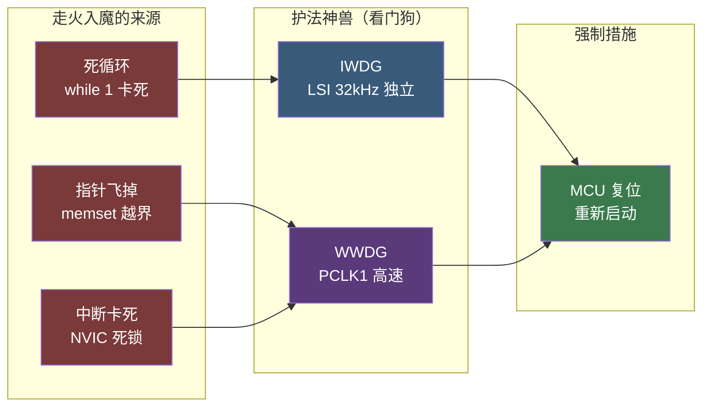

# 【元婴·109】看门狗和 Flash 保护：IWDG/WWDG 与 RDP

> 元婴期 · 第109篇
> 我是玄芯散人，带你从炼气修到大乘。

---

## 境界标识

```
╔══════════════════════════════════════════════╗
║         元婴期 · 第109篇                    ║
║     看门狗和 Flash 保护：IWDG/WWDG 与 RDP  ║
║         预计阅读：50分钟                     ║
╚══════════════════════════════════════════════╝
```

---

## 修仙引入

108 篇讲定时器，给修真者装上了铜壶滴漏。修真界最怕的一件事是弟子练功时走火入魔。典型情形是程序卡死在循环里出不来；指针乱飞覆写内存；中断被锁住再也响应不了。整片神识瘫在原地。这时师傅必须从外界把弟子叫醒，否则一睡不起。

STM32 给修真者留了两道救命符。看门狗分独立看门狗（IWDG）和窗口看门狗（WWDG）两种。前者靠内部低速时钟跑一个倒计时漏壶，没人按时喂狗就强制复位 MCU；后者要求在固定时间窗口内喂狗，早喂晚喂都算走火入魔。Flash 读保护（RDP）则是另一道保险，把内部 Flash 锁死不让外人读，配合 Option Bytes 与 OTP 区保护商业固件不被逆向。

这一篇以 STM32F407 为例，把两类保护讲透。先讲看门狗的硬件机制；再讲寄存器的配置方法；最后讲喂狗时序。具体涉及 RDP 三个等级（Level 0/1/2）的差异和不可逆性；Option Bytes 中的 RDP、WRP、BOR 等可配置项；OTP 一次性编程区的使用边界。修完这一篇，再看 STM32 手册里 IWDG_KR、WWDG_CR、FLASH_OBR 这些寄存器名就能反应过来。

---

## 硬核主体

### 一、看门狗的作用：修真者的护法神兽

修真弟子闭关时若经脉逆乱走火入魔，师傅需要从外界强行点醒。最朴素的办法就是派一只护法神兽蹲在洞府门口，约定每隔一段时间必须送一块肉。神兽没收到肉就冲进洞里把弟子强行拍醒（MCU 复位）。这种不喂就强制复位的机制就是看门狗（Watchdog）。

修真类比：修真者闭关时有两类走火入魔。第一类是普通走神，弟子可能某次循环卡住，过几秒自己会恢复。第二类是深度昏迷，死循环里出不来，长时间无响应。护法神兽专治第二类。神兽的本事在于它独立于弟子的经脉（独立时钟），弟子经脉全部紊乱时神兽还在正常计时。神兽没收到喂狗信号就一脚把弟子踢出闭关（系统复位）。

STM32 提供两种看门狗。独立看门狗（IWDG）用内部低速 RC 时钟（LSI，约 32 kHz，精度差），主时钟挂了它还能跑。窗口看门狗（WWDG）用主时钟域的 PCLK1，精度高但必须按窗口喂狗。两种设计哲学不同，覆盖不同修真需求。

修真类比：IWDG 像一只老牛筋的老龟，反应慢但不吃不喝也能熬（LSI 独立时钟），适合主时钟挂了也要复位的修真任务。WWDG 像一只矫健的仙鹤，反应快但必须按节奏喂食（窗口喂狗），适合喂狗时机不能乱的修真任务。修真路上根据任务挑不同的护法。



### 二、IWDG 独立看门狗：LSI 时钟与 KR 喂狗寄存器

独立看门狗（IWDG，Independent Watchdog）是最经典的看门狗实现，STM32 全系标配。它的时钟源是芯片内部的低速 RC 振荡器（LSI），频率约 32 kHz（实际范围 17 kHz 到 60 kHz），即使主 PLL 和 HSE 都挂了，它依然在工作。这正是独立二字的含义。

修真类比：修真界有一种叫独角龟的护法兽，平时蹲在洞府门口的枯井里，靠吸井水灵气为生。井水与宗门灵脉（主时钟）完全独立，宗门灵脉断流时井水还在。独角龟吞下一颗灵珠就开始倒计时（12 位计数器），倒到零就冲进洞里强制把弟子拍醒。弟子闭关前必须每隔一段时间投喂一块肉干（喂狗），龟吃饱就重新计时。

IWDG 的硬件结构很简单，由 7 位预分频器加上 12 位重装载计数器组成。LSI 时钟先经过预分频器再驱动 12 位递减计数器。当计数器从 RLR（Reload Register）的初值递减到 0 时，产生复位。复位条件是 IWDG 已经被启动（KR 写入 0xCCCC）。

IWDG 涉及三个寄存器，全部通过键值寄存器（IWDG_KR）间接访问。直接写 IWDG_KR 就能喂狗（写 0xAAAA）；写 0x5555 解锁对 PR 和 RLR 的写访问；写 0xCCCC 启动看门狗（启动后 KR 永久锁定，必须等待复位才能再次解锁访问）。

修真类比：独角龟的喂食规则由两个旋钮控制。一个旋钮控制井水流速（PR 预分频器），另一个旋钮控制每次倒多少水（RLR 重装载值）。宗门长老不能直接调旋钮，必须先把封印符（KR 写 0x5555）贴在龟身上才能拧。长老往龟嘴里塞肉干（KR 写 0xAAAA）就完成一次喂狗。长老第一次给龟拍一下背（KR 写 0xCCCC）龟就开始倒数，拍背之后再想拧旋钮就拧不动了。

#### 2.1 预分频器与重装载寄存器

IWDG_PR 是 3 位寄存器（实际只用低 3 位），可选 7 档分频：000 是 /4，001 是 /8，010 是 /16，011 是 /32，100 是 /64，101 是 /128，110 是 /256，111 保留。

IWDG_RLR 是 12 位寄存器（0~4095），决定计数器初值。

超时时间公式：

$$T_{IWDG} = \frac{ 4 \times 2^{PR} \times (RLR + 1) }{ f_{LSI} }$$

LSI 典型 32 kHz 时，超时范围可以从 0.125 ms（PR=0, RLR=0）一直到 32 秒（PR=6, RLR=4095）。常见配置：PR=4（/64），RLR=999，超时 = 4×64×1000/32000 = 8 秒；或 PR=4，RLR=4095，约 32 秒。

修真类比：独角龟吞一次灵珠的灵力量决定它能憋多久。灵力量等于流速（PR）乘以水量（RLR）。流速越慢、水量越大，龟憋得越久。

#### 2.2 配置代码

```c
/* IWDG 配置：32kHz LSI，PR=/64，RLR=999 → 超时 8 秒 */
void IWDG_Init_8s(void)
{
    /* 解锁 PR 与 RLR 寄存器（KR 写 0x5555） */
    IWDG->KR = 0x5555;

    /* 预分频器 PR = 100 → /64 */
    IWDG->PR = 4U;

    /* 重装载值 RLR = 999（12 位范围 0~4095） */
    IWDG->RLR = 999U;

    /* 在启动前喂一次狗，让计数器从 RLR 开始递减 */
    IWDG->KR = 0xAAAA;

    /* 启动 IWDG（KR 写 0xCCCC）。一旦启动，PR/RLR 写访问永久锁定 */
    IWDG->KR = 0xCCCC;
}

/* 主循环里每隔不到 8 秒调用一次 */
void IWDG_Feed(void)
{
    IWDG->KR = 0xAAAA;   /* 喂狗：把 RLR 重载到计数器 */
}
```

修真类比：长老调好独角龟的流速（PR=4）和水量（RLR=999），先塞一次肉让它开始倒数（KR=0xAAAA），再拍背启动（KR=0xCCCC）。龟一旦开始倒数，流速和水量旋钮就拧不动了，宗门长老不能中途改参数。唯一能让龟重置的就是再塞一次肉（KR=0xAAAA）。龟要是在 8 秒内没收到肉，倒数到零就冲进洞拍醒弟子。

#### 2.3 LSI 时钟实测

LSI 频率精度很差（数据手册标 32 kHz，实际芯片可能 17~60 kHz），所以 IWDG 超时精度大概 ±50%。如果修真任务对喂狗时机要求精确（比如每 1 ms 喂一次），不能用 IWDG，要用 WWDG。

修真类比：独角龟的消化节律根据井水灵气浓度变化，夏天井水旺龟消化快，冬天井水弱龟消化慢。长老估个大概时间（8 秒）让弟子投喂一次保险，但不能用它来算严格的时间窗口。

### 三、WWDG 窗口看门狗：PCLK1 驱动与窗口喂狗

窗口看门狗（WWDG，Window Watchdog）走另一条路子。它的时钟源是 PCLK1（STM32F407 上 42 MHz），先经过 4096 固定分频，再经过 WDGTB 可编程分频（1/2/4/8），最后驱动 7 位递减计数器。PCLK1 来自主时钟域，精度高，所以 WWDG 超时精度也高（跟随主时钟晶振精度）。

修真类比：WWDG 像一只矫健的仙鹤。仙鹤听宗门灵脉的鼓点（PCLK1）倒数，比独角龟靠井水倒数精确得多。但灵脉一断仙鹤也跟着停，所以必须在灵脉还在的时候用。仙鹤每次倒数看的尺度是计数器还剩多少格。必须在 6~4 格之间投喂，太早（还剩 6 格以上）仙鹤觉得弟子走火入魔了，太晚（4格以下，剩 3 格或更少）也把弟子拍醒。

修真类比再展开：修真者闭关的节奏规定在第 N 到 M 秒之间喂一次。闭关后期（计数器低段）才算数，早期（计数器高段）喂等于作弊（程序提前喂狗逃避真实运行）。WWDG 这种窗口概念就是修真界最严苛的契约。

#### 3.1 WWDG 寄存器

WWDG_CR 是控制寄存器：T[6:0] 是 7 位计数器初值，WDGA 是使能位。WDGA = 1 后，计数器从 0x7F（默认）开始递减。

WWDG_CFR 是配置寄存器：W[6:0] 是窗口值（喂狗时计数器必须小于 W），WDGTB[1:0] 是分频档（00 是 /1，01 是 /2，10 是 /4，11 是 /8），EWI 是早期预警中断使能位（计数器到 0x40 时触发中断）。

修真类比：WWDG_CR 是仙鹤的「还剩多少格」，修真者每次刷新时把这个值写进去（其实是写 0x5A 到 CR 的低 7 位）。WWDG_CFR 是宗门契约，规定仙鹤还剩 W 格以下才能投喂。

#### 3.2 喂狗窗口公式

设 PCLK1 = 42 MHz，WDGTB = 0（/1），计数器初值 T = 0x7F（127），窗口值 W = 0x5F（95）。超时时间（启动到复位）：

$$T_{WWDG} = \frac{ 4096 \times 2^{WDGTB} \times (T + 1) }{ PCLK1 } = \frac{ 4096 \times 1 \times 128 }{ 42 \times 10^6 } \approx 12.5\ ms$$

喂狗窗口（允许喂狗的时间段）：计数器由 0x7F 递减到 W = 0x5F，对应 (127 - 95) × 4096 × 1 / 42M = 32 × 4096 / 42M ≈ 3.12 ms。也就是必须在倒数到 0x5F 之前喂狗，但也不能在启动初期（计数器接近 0x7F）就喂。

修真类比：仙鹤倒数 12.5 毫秒后把弟子拍醒。但宗门规定必须在仙鹤倒数到 95 格以下投喂。修真者若在 12.5 毫秒内没投喂，仙鹤倒数到 0x40 就触发复位（实际上 0x3F 也算复位点）。修真者若倒计时刚启动就投喂（计数器还接近 0x7F），宗门契约判定修真者在循环外偷喂，闭关失败，仙鹤也强制把弟子拍醒。

喂狗代码是写 0x5A 到 WWDG_CR 的低 7 位：

```c
void WWDG_Feed(void)
{
    /* 写 0x5A 到 WWDG_CR 的 T[6:0] 字段，让计数器从 T 重新开始递减 */
    WWDG->CR = (WWDG->CR & ~0x7F) | 0x5A;
}
```

#### 3.3 配置代码

```c
/* WWDG 配置：PCLK1=42MHz，WDGTB=/8，T=0x7F，W=0x5F，EWI=0
   超时 ≈ 4096×8×128/42M ≈ 100ms
   窗口 ≈ (127-95)×4096×8/42M ≈ 25ms（在 25ms~100ms 之间喂狗） */
void WWDG_Init(void)
{
    /* WWDG 时钟源来自 PCLK1，无需手动使能 */

    /* 窗口值 W = 0x5F（必须在计数器 < 0x5F 时才能喂狗） */
    WWDG->CFR = (WWDG->CFR & ~0x7F) | 0x5F;

    /* WDGTB[1:0] = 10 → /8；EWI = 0（不开早期预警中断） */
    WWDG->CFR = (WWDG->CFR & ~(3U << 11)) | (2U << 11);

    /* T[6:0] = 0x7F（127）+ WDGA = 1（使能） */
    WWDG->CR = 0x7F | (1U << 7);
}

/* 主循环里在 25ms~100ms 窗口内喂狗 */
void WWDG_Feed(void)
{
    WWDG->CR = (WWDG->CR & ~0x7F) | 0x5A;
}
```

修真类比：长老和宗门签了闭关契约。闭关总时长 100 毫秒（计数器由 0x7F 倒数到 0x40），闭关后期 25 毫秒内必须由弟子亲自（不是师傅代劳）发功续命。弟子如果在 0~75 毫秒就续命，师傅判定弟子作弊（程序提前喂狗）；超过 100 毫秒还没续命，弟子走火入魔（WWDG 复位）。

#### 3.4 EWI 早期预警中断

如果开启 EWI（EWI = 1），WWDG 在计数器降到 0x40 时触发一次中断。中断里可以保存数据，也可以打印日志，再做最后挣扎，然后再让 WWDG 复位。这是嵌入式系统的濒死日志机制。

修真类比：仙鹤倒数到 5 格（0x40）时先通知师傅一声（EWI 中断），师傅赶来在弟子身上贴一道护身符（保存数据到 Backup Register），然后仙鹤倒数到 0 把弟子拍醒。复位后师傅读护身符上的内容就知道弟子走火入魔前发生了什么。

### 四、IWDG vs WWDG 对比

修真者挑护法神兽要看应用。两个看门狗的差异可以从五个方面看：

| 对比项 | IWDG 独立看门狗 | WWDG 窗口看门狗 |
|------|----------------|-----------------|
| 时钟源 | LSI 内部低速 RC（约 32 kHz） | PCLK1（42 MHz），主时钟域 |
| 精度 | 差，±50% | 高，跟主时钟晶振精度 |
| 喂狗方式 | 随时喂（写 KR=0xAAAA） | 窗口喂（计数器小于 W 时写 CR） |
| 启动方式 | KR=0xCCCC 软启动，PR/RLR 写后锁定 | WDGA=1 启动，T[6:0] 可中途重写 |
| 复位条件 | 计数器减到 0 | 计数器减到 0x40 或 0x3F |
| 适用情况 | 主时钟挂了也要复位 | 程序必须按节奏执行 |

修真类比：独角龟（IWDG）反应慢但独立，适合任何状态下都要保命的修真任务，比如野外历练长时间无人值守的情况。仙鹤（WWDG）反应快但依赖灵脉，适合闭关节奏严格的修真任务，比如电机控制必须在每个 PWM 周期内喂狗证明程序还在跑。

实际项目里常把两者都用上：IWDG 作为最后兜底，WWDG 作为常规节拍校验。这是修真界双护法配置。

### 五、Flash 保护：RDP 读保护三级跳

修真弟子闭关成功后会留下功法秘籍（固件）。宗门担心秘籍被外人偷走（逆向工程），会在秘籍上加封印。STM32 给内部 Flash 加封印的机制叫 RDP（Read Out Protection，读保护），共三个等级。

修真类比：宗门秘籍按公开等级分三档。Level 0 是公开课功法，所有外门弟子都能借阅。Level 1 是内门心法，需要令牌（JTAG/SWD）才能翻阅，但有办法可以转成公开课（强制擦除）。Level 2 是镇宗之宝，一旦封存外人一辈子都看不到，连令牌都打不开。

#### 5.1 Level 0：无保护（默认）

新出厂的 STM32 默认 RDP = Level 0。内部 Flash 完全可读可写，调试器（JTAG/SWD）能读出全部固件，SRAM 也能访问。这是开发阶段的状态，不适合量产产品。

修真类比：长老刚收的新弟子，功法没加封印，外人随时能偷。

#### 5.2 Level 1：内存读保护

开启 Level 1 后，调试器还能连上 STM32（JTAG/SWD 不被禁用），但 Flash 内存被锁住，外部无法读出。SRAM 仍可访问但部分受限。由 Level 1 退回 Level 0 会触发整片 Flash 擦除（mass erase），所有固件清空。

修真类比：内门心法印在竹简上，外人能看到竹简外壳但读不到字（Flash 内容）。竹简被宗门密封（Option Bytes 锁定），外人强行拆封竹简就会自燃（mass erase）。要回到公开课状态必须把竹简烧掉重写，这是不可逆操作。

量产产品一般开 Level 1 加上设 WRP（写保护扇区）。Level 1 不影响正常运行，固件照常跑，只是防偷。

修真类比：闭关弟子的功法印在内门书架的竹简上，外门弟子借不到（读保护）。宗门规矩是内门书架的竹简可以借阅副本（正常运行），但不能拓印带走（防读）。

#### 5.3 Level 2：芯片完全禁用调试

开启 Level 2 后，JTAG/SWD 调试接口永久禁用，外部任何工具都连不上 STM32。由 Level 2 不可降级（不可逆），芯片进入铁壁状态。这种保护用于加密货币硬件钱包与车规 ECU 等高安全场合。

修真类比：镇宗之宝存放在宗门最深处的石室里，石室大门焊死，钥匙丢进岩浆。外人一辈子都看不到，外门弟子也进不去。芯片本身可以正常运行（固件照常跑），但调试器完全失效。

修真者量产产品一般不开 Level 2，因为 Level 2 后续无法调试升级，除非有特殊加密需求。

修真类比：镇宗之宝只用于特殊场合（如护山大阵的中枢），平时用 Level 1 就够。

#### 5.4 三级对比表

| 等级 | 外部读 Flash | JTAG/SWD 调试 | SRAM 访问 | 降级代价 | 修真类比 |
|------|------------|---------------|----------|---------|----------|
| Level 0 | 可读 | 可用 | 可用 | 无 | 公开课功法 |
| Level 1 | 不可读 | 可用 | 部分可用 | 整片擦除 | 内门心法 |
| Level 2 | 不可读 | 永久禁用 | 不可用 | 不可降级 | 镇宗之宝 |

修真类比：宗门藏经阁按三级管理。外阁（Level 0）自由借阅，中阁（Level 1）需要令牌但可清空重置，深阁（Level 2）焊死大门。修真弟子想保护功法，先把竹简从中阁锁起（Level 1），特殊情况下才放进深阁（Level 2）。

### 六、Option Bytes：用户配置项

Option Bytes 是 STM32 Flash 末尾一段特殊的配置位（STM32F407 在 0x1FFF8000），决定芯片启动行为，并提供读保护、写保护与 BOR 阈值等可配置项。量产时通过 ST-Link Utility 或 STM32CubeProgrammer 配置。

修真类比：宗门弟子入宗时要填一份入宗登记表。登记表上登记弟子功法（启动选项）；然后是守备章节（写保护）；再写断脉反应（BOR 阈值）；最后登记封印强度（RDP 等级）。登记表烧在弟子内丹（Option Bytes）里，入宗后再想改得用宗门专用的铜牌工具（ST-Link Utility）。

#### 6.1 Option Bytes 主要配置

Option Bytes 主要分四组：

- RDP：读保护等级（0/1/2），共 8 位但只用到 RDP[7:0]。
- USER：用户选项。nRST 控制是否启用硬件复位引脚；nBOOT0/1 设置启动模式；nSWBOOT0 选择软件启动；IWDG_SW 决定是否用软件启动 IWDG。
- WRP：写保护，对每个扇区可独立设 WRPx（1 等于写保护，0 等于可写）。STM32F407 有 12 个扇区（0~11），对应 WRP0~WRP11。
- BOR：掉电复位阈值（BOR_LEVEL[1:0]），可选 4 档（关、Level 1~3），电压阈值 1.8V/2.0V/2.5V/2.9V。

修真类比：登记表的守备章节（WRP）是宗门锁死的部分，外人不能改。断脉反应（BOR）类似低血糖反应：灵脉电压掉到某个值，宗门直接判定弟子昏迷，强制复位启动。

#### 6.2 编程 Option Bytes

Option Bytes 修改比较特殊，需要先解锁 Flash 控制寄存器（FLASH_KEYR 写 0x45670123 加上 0xCDEF89AB），然后进入 Option Bytes 编程模式。

修真类比：改弟子内丹里的登记表不能用普通令牌，需要宗门长老的专属玉牌（FLASH_KEYR 解锁）。长老先擦除内丹上的旧表（Option Bytes Erase），再写入新表（Option Bytes Program），最后重新封印。

```c
/* STM32F407 修改 RDP 从 Level 0 到 Level 1 */
void RDP_Set_Level1(void)
{
    /* 1. 解锁 Flash 控制寄存器 */
    FLASH->KEYR = 0x45670123;
    FLASH->KEYR = 0xCDEF89AB;

    /* 2. 解锁 Option Bytes（OB 编程也要独立解锁） */
    FLASH->OPTKEYR = 0x08192A3B;
    FLASH->OPTKEYR = 0x4C5D6E7F;

    /* 3. 解除 Option Bytes 写保护（OPTCR 的 OPTWRE 位） */
    FLASH->OPTCR |= FLASH_OPTCR_OPTWRE;

    /* 4. 设置 RDP 字节 */
    FLASH->OPTCR = (FLASH->OPTCR & ~FLASH_OPTCR_RDP) | (1U << 8);  /* RDP = 01 */

    /* 5. 启动 Option Bytes 编程（OPTSTRT） */
    FLASH->OPTCR |= FLASH_OPTCR_OPTSTRT;

    /* 等待完成 */
    while (FLASH->SR & FLASH_SR_BSY);

    /* 6. 触发 Option Bytes 装载（OBL_LAUNCH，强制 reload） */
    FLASH->OPTCR |= FLASH_OPTCR_OBL_LAUNCH;
}
```

注意：由 Level 1 退回 Level 0 会触发 mass erase，开发阶段切记不要在量产固件里误留这段代码。

修真类比：长老改完弟子内丹上的登记表后要重新封印（OBL_LAUNCH）。如果想把内门心法（Level 1）退回公开课（Level 0），代价是烧毁整片功法竹简（mass erase）。闭关弟子千万别在量产固件里留这段回退代码，否则量产时一旦触发就前功尽弃。

### 七、OTP 一次性编程区

STM32F407 在 Flash 末尾有 528 字节的 OTP（One-Time Programmable）区域，位于 0x1FFF7800 到 0x1FFF7A00。前 96 字节保留给 ST 内部（包含唯一 96 位芯片 ID），剩余 432 字节供修真者使用。

OTP 区域的特性是：1 编程为 0 单向可擦写（按位擦除），但 0 改回 1 必须全片擦除。每个 bit 一辈子只能写一次，天然适合存芯片唯一 ID，也可存校准数据，还能存密钥。

修真类比：OTP 是宗门的刻骨铭文。弟子入门时把身份信息刻在灵骨上（OTP 写入），刻完就是永久，不能改回。但可以在原字上覆盖新字（由 1 写 0）。宗门用灵骨记录身份归属信息，外人无法伪造。

#### 7.1 OTP 写入代码

```c
/* OTP 区域写入：地址 0x1FFF7800~0x1FFF7A00，前 96 字节保留 */
void OTP_Write(uint32_t addr, uint16_t data)
{
    /* 解锁 Flash */
    FLASH->KEYR = 0x45670123;
    FLASH->KEYR = 0xCDEF89AB;

    /* 写入半字 */
    FLASH->CR = FLASH_CR_PROG;          /* 编程模式 */
    *(__IO uint16_t *)addr = data;

    while (FLASH->SR & FLASH_SR_BSY);   /* 等待完成 */
}

/* 读出芯片唯一 96 位 ID */
void Read_Unique_ID(uint32_t *id_buf)
{
    id_buf[0] = *(uint32_t *)0x1FFF7A10;  /* U_ID[31:0] */
    id_buf[1] = *(uint32_t *)0x1FFF7A14;  /* U_ID[63:32] */
    id_buf[2] = *(uint32_t *)0x1FFF7A18;  /* U_ID[95:64] */
}
```

修真类比：长老写入灵骨前要先把内丹解锁（FLASH_KEYR 解锁）。写入半字（16 位）后等待刻完（BSY 清零）。读出灵骨内容用普通读取指令（直接读地址）。每个灵骨地址只能刻一次（OTP 不可逆）。

#### 7.2 OTP 用法

修真类比：灵骨上的铭文有几种典型用法。

第一种是设备唯一序列号：每片芯片 ID 不同，量产固件里读出 ID 作为设备身份证。修真类比是每片灵骨的刻痕天然不同（96 位 ID），宗门用来给弟子发身份令牌。

第二种是校准数据：传感器校准系数存在 OTP，避免每次启动重新校准。修真类比是弟子入门测灵根属性（校准系数），结果刻在灵骨上，下次闭关直接读。

第三种是加密密钥：把 AES 密钥或 RSA 公钥存在 OTP，外部调试器无法读出（即使 RDP Level 0）。修真类比是镇宗密钥（加密密钥）刻在灵骨上，外人即使摸到弟子也读不到。

### 八、实战：配置 IWDG 加上 RDP Level 1

把前面零件拼起来，做一个简单的双护法配置。任务：STM32F407 启动后先配置 IWDG（8 秒兜底），主循环里每 1 秒喂一次狗，同时通过 ST-Link Utility 把 RDP 设成 Level 1 量产。

#### 8.1 代码

```c
#include "stm32f407xx.h"

volatile uint32_t tick = 0;

void IWDG_Init_8s(void)
{
    IWDG->KR = 0x5555;     /* 解锁 PR/RLR 写访问 */
    IWDG->PR = 4U;         /* /64 */
    IWDG->RLR = 999U;      /* RLR=999 → 4×64×1000/32k = 8 秒 */
    IWDG->KR = 0xAAAA;     /* 喂一次狗，让计数器从 999 开始 */
    IWDG->KR = 0xCCCC;     /* 启动 IWDG */
}

void IWDG_Feed(void)
{
    IWDG->KR = 0xAAAA;
}

int main(void)
{
    SystemInit();
    IWDG_Init_8s();        /* 启动 8 秒兜底看门狗 */

    /* 主循环每 1 秒喂一次狗，远小于 8 秒 */
    while (1) {
        Do_Work();         /* 用户主任务 */
        Delay_ms(1000);
        IWDG_Feed();       /* 喂狗 */
        tick++;
    }
}
```

修真类比：弟子闭关前先放一只独角龟守门（IWDG_Init_8s），独角龟的流速调到 64（PR=4），一次吞 999 颗灵珠（RLR=999），憋 8 秒没肉就把弟子拍醒。弟子闭关每 1 秒塞一次肉干（IWDG_Feed），绝对不会超时。

#### 8.2 RDP Level 1 量产配置

修真类比：弟子闭关成功后，宗门把内门心法封印升级到 Level 1。量产工具流程：

1. 编译固件，烧录到 STM32 Flash。
2. 启动 STM32CubeProgrammer。
3. 进入 Option Bytes 页面，把 RDP 由 0xAA（默认 Level 0）改成 0xBB（Level 1）。
4. 应用配置，触发 OBL_LAUNCH 重启芯片。
5. 验证：尝试用 ST-Link 读 Flash，应该读出全 0 或全 1（被锁）。

修真类比：宗门长老把弟子内丹上的登记表烧入新值（RDP 写 1），封印升级（OBL_LAUNCH 触发 reload）。外人再想偷看功法，竹简外壳只能读到封印字（读保护）。要回到公开课必须烧毁整片竹简（mass erase）。

#### 8.3 修真路线图

修真类比：弟子走完这条路线有三道保险。第一道 IWDG 兜底（独角龟），任何情况下 8 秒没喂就强制复位。第二道主循环严守节奏（每 1 秒喂一次），不让独角龟触发。第三道 RDP Level 1 封印，即使弟子闭关失败被人偷走功法，竹简也是封印状态。

量产产品修真三保险：独角龟（IWDG）保命，节奏校验（主循环）保真，竹简封印（RDP Level 1）保密。三者各司其职，缺一不可。

### 九、看门狗与 Flash 保护：调试常见坑

第一类坑：LSI 频率估错。LSI 实际频率可能偏离 32 kHz 很远，IWDG 超时精度差。开发阶段预留 50% 余量，量产前用示波器实测喂狗波形。修真类比：独角龟靠井水计时，井水浓淡决定龟消化快慢，长老估个大概时间（8 秒）就行，不能用独角龟算严格时间窗口。

第二类坑：喂狗窗口算反。WWDG 窗口喂狗要求计数器小于 W 时喂，写反成计数器大于 W 时喂会每次都触发复位。修真类比：闭关契约规定弟子必须在闭关后期投喂，长老理解成闭关前期投喂，仙鹤一拍背弟子就被拍醒。

第三类坑：RDP Level 1 误回退。量产固件里留了 RDP 改回 Level 0 的代码，运行时一旦误触发就全片擦除。修真类比：闭关弟子的功法竹简被长老无意中退回公开课，整片竹简烧毁，前功尽弃。

第四类坑：OTP 重复写入。OTP 只能由 1 写 0，已经写过 0 的位不能改回 1。修真类比：灵骨上已经刻过字的地方不能覆盖回原状，每次写入都要慎重。

修真类比：弟子闭关心急常犯四种错。其一是高估独角龟精度；其二是弄反仙鹤契约；其三是量产固件留了回退代码；其四是灵骨刻字太随意。

---

## 修仙术语对照表

| 修仙术语 | 技术现实 | 本篇位置 |
|----------|----------|----------|
| 护法神兽 | 看门狗 Watchdog | 第一段 |
| 走火入魔 | 程序死循环/跑飞 | 第一段 |
| 独角龟 | IWDG 独立看门狗 | 第二段 |
| 井水灵气 | LSI 时钟（约 32 kHz） | 第二段 |
| 投喂肉干 | 喂狗（KR=0xAAAA） | 第二段 |
| 拍背启动 | KR=0xCCCC 启动 IWDG | 第二段 |
| 封印符贴龟 | KR=0x5555 解锁 PR/RLR | 第二段 |
| 矫健仙鹤 | WWDG 窗口看门狗 | 第三段 |
| 灵脉鼓点 | PCLK1 时钟 | 第三段 |
| 闭关契约 | WWDG 窗口值 W[6:0] | 第三段 |
| 闭关总时长 | WWDG 超时时间 | 第三段 |
| 闭关后期 | 窗口喂狗区间 | 第三段 |
| 濒死日志 | EWI 早期预警中断 | 第三段 |
| 公开课功法 | RDP Level 0 | 第五段 |
| 内门心法 | RDP Level 1 | 第五段 |
| 镇宗之宝 | RDP Level 2 | 第五段 |
| 烧毁竹简 | Flash mass erase | 第五段 |
| 入宗登记表 | Option Bytes | 第六段 |
| 守备章节 | WRP 写保护 | 第六段 |
| 断脉反应 | BOR 掉电复位 | 第六段 |
| 刻骨铭文 | OTP 一次性编程区 | 第七段 |
| 灵根属性 | 校准数据 | 第七段 |
| 镇宗密钥 | AES/RSA 密钥存 OTP | 第七段 |
| 双护法配置 | IWDG + WWDG 配合 | 第八段 |

---

## 进阶条件

看门狗和 Flash 保护这一篇看完一遍还不算过。读完后请自检：

- [ ] 能说出看门狗的作用和适用场合（防程序跑飞/死循环）
- [ ] 能解释 IWDG 时钟源（LSI）的特性，并理解预分频器（PR）和重装载寄存器（RLR）共同决定超时时间。
- [ ] 能解释 IWDG 三个 KR 键值（0x5555 / 0xAAAA / 0xCCCC）的含义
- [ ] 能用公式 T = 4×2^PR×(RLR+1)/f_LSI 计算 IWDG 超时时间
- [ ] 能解释 WWDG 的时钟源（PCLK1）和窗口喂狗的概念（计数器小于 W 时才能喂）
- [ ] 能用公式 T = 4096×2^WDGTB×(T+1)/PCLK1 计算 WWDG 超时时间
- [ ] 能解释 IWDG 与 WWDG 的差异。两类在时钟源、喂狗方式、复位条件三个地方各自不同，精度上也有差别。
- [ ] 能解释 RDP Level 0/1/2 的差异和降级代价
- [ ] 能说出 Option Bytes 主要包含哪些配置项（RDP/USER/WRP/BOR）
- [ ] 能解释 OTP 区域的特性（一次性、可读可写但不可改回 1）
- [ ] 能写出 IWDG 初始化代码和主循环喂狗代码
- [ ] 能用 STM32CubeProgrammer 或 ST-Link Utility 配置 RDP Level 1

如果有一项卡住，回到对应章节重读一遍。看门狗和 Flash 保护是嵌入式系统的最后一道屏障。前面 100~108 都在讲怎么让 MCU 跑起来，109 讲怎么让 MCU 安全地跑和不被偷。下一篇 110 会讲 DMA 通道仲裁、环形缓冲区、Cache 一致性，是嵌入式数据搬运的进阶功夫。

---

## 下期预告 + 互动

下一篇：110 DMA 进阶。

修真之路上，弟子闭关时搬运物资（数据）也是大事。无论串口发数据；ADC 采样；SPI 收发；还是内存拷贝，都需要把数据搬运到指定位置。让 CPU 一字节一字节搬（轮询）效率太低，让中断搬（每字节中断一次）也嫌繁琐。DMA（Direct Memory Access）就是修真界的御剑术。弟子（CPU）只发一道剑诀，剩下交给剑（DMA 控制器）自己飞。110 重点讲 DMA 通道仲裁（多个 DMA 怎么排队）；也会讲环形缓冲区（DMA + 双缓冲无缝接收）；还会讲 Cache 一致性问题（DMA 搬的数据 CPU Cache 里可能读到旧的）。修完这一篇，再看 STM32 手册里 DMA_SxCR、DMA_LISR、MPU、SCB_InvalidateDCache_by_Addr 这些 API 就能反应过来。

互动问题：

1. 你项目里用过 IWDG 还是 WWDG？为什么？喂狗周期怎么定的？
2. 量产产品开了 RDP Level 1 还是 Level 2？升级固件时怎么处理 RDP？
3. OTP 区域用在哪里？存过什么数据？有没有误写入坑过自己？
4. 调试时有没有遇到看门狗复位但代码看起来没问题的情况？最后怎么排查的？

评论区聊聊你的看门狗和 Flash 保护实战经历。

*本文是「码农修仙传」系列第109篇。系列导航见 [xren.ren](https://xren.ren)*