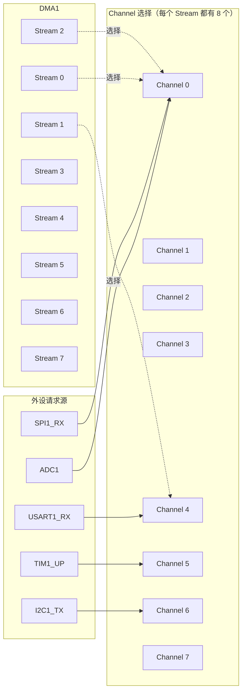
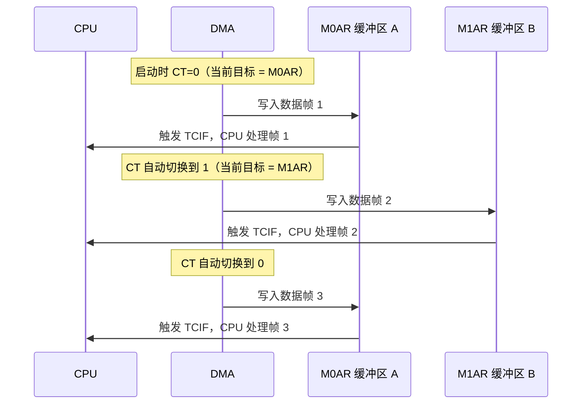
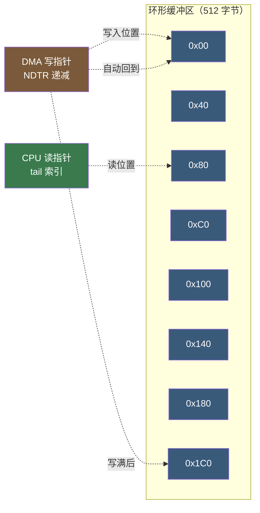

# 【元婴·110】DMA深度：通道仲裁、环形缓冲区、Cache一致性

> 元婴期 · 第110篇
> 我是玄芯散人，带你从炼气修到大乘。

---

## 境界标识

```
╔══════════════════════════════════════════════╗
║          元婴期 · 第110篇                    ║
║    DMA深度：通道仲裁、环形缓冲区、Cache一致性    ║
║          预计阅读：55分钟                     ║
╚══════════════════════════════════════════════╝
```

---

## 修仙引入

104 篇讲了 UART DMA 接收，105 篇讲了 SPI DMA 全双工，107 篇讲了 ADC DMA 双缓冲。三篇都把 DMA 当作一把好用的御剑术，让 CPU 不必亲自搬运数据。修真弟子已经会用剑，但还没看清剑匣里的机关。多个弟子同时御剑时谁先谁后？剑匣里的符阵怎么决定？双缓冲为什么能让 CPU 永远拿到一整帧数据？Cache 一致性问题为何让修真者在 STM32F7/H7 上频频翻车？

这一篇以 STM32F407 为例，把 DMA 控制器本身讲透。先讲 DMA 控制器的硬件结构（两个 DMA 控制器加 8 Stream 乘 8 Channel 对应表）；再讲仲裁器（4 级软件优先级加硬件轮转）；再讲双缓冲寄存器的切换机制（M0AR 和 M1AR 加 CT 位）；再讲环形缓冲区的设计原理（CIRC 模式加 NDTR 自动重装）；最后讲 Cache 一致性问题（DMA 与 CPU 看到的数据不一致）。修完这一篇，再看 STM32 手册里那些寄存器名（DMA_SxCR、DMA_LISR、SCB_CleanDCache_by_Addr）就能反应过来。

---

## 硬核主体

### 一、DMA 是什么：弟子不必亲自搬砖

修真弟子闭关时要把一批灵石搬上山顶。三种搬法。

第一种是弟子亲自搬。每搬一块跑一趟山脚，等搬完再继续练功。这种「CPU 轮询搬运」的方式效率最低，CPU 全部时间耗在搬砖上，练功进度为零。

第二种是每搬一块发一道传音符通知弟子（中断）。弟子接到通知放下手里的活，跑一趟山脚搬一块，再回来继续练功。中断频繁时弟子大量时间耗在上下文切换上，练功进度仍然很低。

第三种是弟子把搬砖任务交给山脚的运粮队（DMA 控制器），弟子只发一道剑诀（配置 DMA），剩下交给运粮队自己飞。运粮队搬完一整车通知弟子一声（「DMA 传输完成中断」）。弟子大部分时间都在练功。

修真类比：DMA（Direct Memory Access，直接内存访问）是修真界的御剑术运粮队。CPU 发一道剑诀（配置 DMA_SxCR 寄存器），运粮队就把数据从源地址搬运到目标地址，全程 CPU 不必参与。搬运完成运粮队通知弟子一声。多个弟子同时调用运粮队时由运粮队的总管（DMA 仲裁器）排队。

修真类比再展开：CPU 亲自搬运数据是「同步阻塞」，CPU 啥也干不了就等搬完。中断搬运是「异步通知」，CPU 收到通知去处理但频繁切换上下文。DMA 搬运是「异步无阻塞」，CPU 配置完 DMA 就去做别的事，DMA 自己跑完全部搬运。修真界追求的是最后一种。

104/105/107 三篇都讲了 DMA 在外设上的用法（UART RX、SPI 全双工与 ADC 双缓冲），本篇不再重复外设细节，专门讲 DMA 控制器本身的机制。

### 二、DMA 控制器组成：两个 DMA 加 16 条 Stream 加 128 条 Channel

STM32F407 有两个 DMA 控制器（DMA1 和 DMA2）。每个 DMA 控制器有 8 条 Stream（Stream 0~7），每条 Stream 有 8 个 Channel 选择（Channel 0~7）。这样 DMA1 加 DMA2 总共有 16 条 Stream 乘 8 个 Channel，也就是 128 条 Channel 选择。

修真类比：修真宗门的运粮队分两支（DMA1 和 DMA2），每支队有 8 个剑匣（Stream 0~7），每个剑匣能装载 8 种灵石来源（Channel 0~7）。每个外设请求（如 ADC1、USART1_RX、SPI1_TX）必须安排到某个剑匣的某个槽位。

Stream 与 Channel 的多对多安排：每条 Stream 都支持 8 个 Channel，但每个外设请求对应固定的 Channel 编号。手册里那张对应表必须记住，因为选错 Channel 号 DMA 永远不响应。



#### 2.1 STM32F407 Stream/Channel 对应表（部分）

每条 Stream 选择哪个 Channel 由 DMA_SxCR 的 CHSEL[2:0] 字段决定。下表是 STM32F407 部分外设的 Channel 编号（齐全表见参考手册 RM0090 第 9.3.3 节）：

| Stream | Channel 0 | Channel 1 | Channel 2 | Channel 3 | Channel 4 | Channel 5 | Channel 6 | Channel 7 |
|--------|-----------|-----------|-----------|-----------|-----------|-----------|-----------|-----------|
| Stream 0 | SPI3_RX | - | SPI3_RX | SPI2_RX | SPI2_TX | SPI3_TX | - | - |
| Stream 1 | I2C1_TX | - | TIM7_UP | - | TIM7_TRIG | TIM7_COM | I2C1_RX | I2C1_TX |
| Stream 2 | I2C4_RX | - | - | - | I2C1_TX | - | - | - |
| Stream 3 | - | - | TIM2_UP | I2C1_RX | - | - | - | - |
| Stream 4 | - | - | - | - | - | - | - | - |
| Stream 5 | - | - | TIM2_CH1 | - | USART1_RX | - | - | - |
| Stream 6 | - | - | TIM2_CH2 | - | - | - | - | - |
| Stream 7 | - | TIM2_CH4 | TIM2_UP | - | USART1_TX | - | - | - |

修真类比：USART1_RX 在 DMA1 Stream 5 Channel 4 这个槽位。如果要启用 USART1 的 DMA 接收，必须配置 `DMA1_Stream5` 加 `DMA_Channel_4`。选错 Stream 或 Channel 号，DMA 永远响应不到外设请求，弟子调半天御剑术都没用。

#### 2.2 DMA_SxCR 寄存器要点字段

DMA_SxCR（Stream x Configuration Register）是配置每条 Stream 的关键寄存器。STM32F407 上 DMA_SxCR 偏移 0x10 加 0x18 乘 Stream 编号（比如 Stream 0 在 0x10，Stream 1 在 0x28）。

```c
typedef struct {
    volatile uint32_t CR;    /* DMA_SxCR 配置寄存器 offset 0x10 + 0x18×n */
    volatile uint32_t NDTR;  /* DMA_SxNDTR 数据量寄存器 */
    volatile uint32_t PAR;   /* DMA_SxPAR 外设地址寄存器 */
    volatile uint32_t M0AR;  /* DMA_SxM0AR 内存地址寄存器 0 */
    volatile uint32_t M1AR;  /* DMA_SxM1AR 内存地址寄存器 1（双缓冲模式） */
    volatile uint32_t FCR;   /* DMA_SxFCR FIFO 控制寄存器 */
} DMA_Stream_TypeDef;
```

DMA_SxCR 主要位域（依据 STM32F407 参考手册 RM0090 第 10.5.1 节）：

- EN（bit 0）：Stream 使能。置 1 启动，置 0 关闭（关闭前必须等待 EN 变 0 才能改其他配置）。
- DBM（bit 18）：双缓冲模式。置 1 启用 M0AR/M1AR 双缓冲。
- CT（bit 19）：当前目标位（Current Target）。DBM=1 时有效，0 表示当前写 M0AR，1 表示当前写 M1AR。
- PL[1:0]（bit 17:16）：软件优先级。00=Low，01=Medium，10=High，11=VeryHigh。
- DIR[1:0]（bit 7:6）：传输朝向。00=外设到内存，01=内存到外设，10=内存到内存。
- CIRC（bit 8）：循环模式。置 1 启用环形缓冲区，NDTR 自动重装。
- MSIZE[1:0]（bit 14:13）：内存数据位宽。00=8 bit，01=16 bit，10=32 bit。
- PSIZE[1:0]（bit 12:11）：外设数据位宽。同上。
- MINC（bit 10）：内存地址递增。
- PINC（bit 9）：外设地址递增。
- CHSEL[2:0]（bit 27:25）：Channel 选择。000~111 对应 Channel 0~7。

修真类比：DMA_SxCR 是每个剑匣的符阵总开关。EN 是「启剑符」（启动 DMA），DBM 是「双剑符」（双缓冲），CIRC 是「循环符」（环形缓冲），PL 是「优先级令牌」（哪个 Stream 先跑）。

#### 2.3 配置示例

```c
/* 配置 USART1_TX 使用 DMA1 Stream 7 Channel 4 */
void DMA1_USART1_TX_Init(void)
{
    /* 1. 使能 DMA1 时钟 */
    RCC->AHB1ENR |= RCC_AHB1ENR_DMA1EN;

    /* 2. 关闭 DMA1 Stream 7（配置前必须先关闭） */
    DMA1_Stream7->CR &= ~DMA_SxCR_EN;
    while (DMA1_Stream7->CR & DMA_SxCR_EN);  /* 等待真正关闭 */

    /* 3. 配置 Stream 参数 */
    DMA1_Stream7->PAR  = (uint32_t)&USART1->DR;  /* 外设地址 = USART1 数据寄存器 */
    DMA1_Stream7->M0AR = (uint32_t)tx_buf;        /* 内存地址 = 发送缓冲区 */
    DMA1_Stream7->NDTR = TX_BUF_LEN;              /* 数据量 = 缓冲区长度 */

    /* 4. 配置控制寄存器：
       - Channel 4 (CHSEL=100)
       - 内存到外设朝向 (DIR=01)
       - 单次模式 (CIRC=0)
       - 内存递增 (MINC=1)
       - 外设不递增 (PINC=0)
       - 数据位宽 8 bit (MSIZE=00, PSIZE=00)
       - 中等优先级 (PL=01) */
    DMA1_Stream7->CR = DMA_SxCR_CHSEL_2 |        /* Channel 4 = bit2=1, 其他 0 */
                       DMA_SxCR_DIR_0 |            /* 内存到外设 */
                       DMA_SxCR_MINC |             /* 内存地址递增 */
                       DMA_SxCR_PL_0 |             /* Medium 优先级 */
                       DMA_SxCR_MBURST_0 |         /* 单次突发 */
                       DMA_SxCR_PBURST_0;

    /* 5. 使能 USART1 的 DMA 发送请求 */
    USART1->CR3 |= USART_CR3_DMAT;

    /* 6. 启动 DMA1 Stream 7 */
    DMA1_Stream7->CR |= DMA_SxCR_EN;
}
```

修真类比：弟子发御剑术前要做四件事。选剑匣（DMA1 Stream 7），写运粮路线（PAR 是外设地址，M0AR 是内存地址），标运粮数量（NDTR 是长度），贴优先级令牌（PL 是 Medium）。最后拍一下剑匣（EN=1），剑匣里的符阵启动，运粮队开始搬运。

### 三、仲裁器：软件优先级 vs 硬件优先级

修真宗门的运粮队有 16 条 Stream，可能多个外设同时请求 DMA。运粮队总管（仲裁器）按什么规则决定先服务谁？

STM32F4 仲裁器分两层。第一层是软件优先级（PL[1:0]，4 级：Low/Medium/High/VeryHigh）。第二层是硬件优先级（Stream 编号小的优先：Stream 0 > Stream 1 > ... > Stream 7）。两层仲裁在同一时刻只生效一层。

修真类比：运粮队总管的排队规则分两层。第一层按令牌等级排（VeryHigh 最先，Low 最后），第二层同一令牌等级下按剑匣编号排（0 号剑匣最优先，7 号剑匣最末）。两层规则互不冲突，令牌等级不同看令牌；令牌等级相同看剑匣编号。

#### 3.1 仲裁规则详解

```
软件优先级仲裁：
  VeryHigh > High > Medium > Low
  （DMA_SxCR 的 PL[1:0] 字段）

硬件优先级仲裁（软件优先级相同时）：
  Stream 0 > Stream 1 > ... > Stream 7
  （编号小的优先）

仲裁器在每个 AHB 时钟周期检查一次
两个请求同时到达时按两层规则决定
```

修真类比：修真宗门长老给运粮队发令牌（PL 字段）。长老可以指定某些任务优先级高（VeryHigh），某些优先级低（Low）。同等级令牌下，剑匣 0 比剑匣 7 优先（硬件编号）。这意味着运粮队总管每时每刻都重新排队，不会出现某个剑匣长期霸占总线。

#### 3.2 配置优先级

```c
/* 设置 Stream 7 为 VeryHigh 优先级 */
DMA1_Stream7->CR |= DMA_SxCR_PL;  /* PL = 11 */

/* 设置 Stream 4 为 Low 优先级 */
DMA1_Stream4->CR &= ~DMA_SxCR_PL;  /* PL = 00 */
```

实际工程里优先级配置有三条经验：

1. 高速数据流（如 SPI 接收高频数据、ADC 连续采样）设为 VeryHigh 或 High。
2. 低速数据流（如 USART 调试日志、SPI flash 慢速读写）设为 Low 或 Medium。
3. 默认所有 Stream 设 Medium，靠硬件编号仲裁。

修真类比：弟子做高速数据流（如高速 ADC）一定要设 VeryHigh，否则仲裁器把它排到最后，ADC 数据溢出。低速日志信息（UART 打印）设 Low，让高速任务先跑完。

#### 3.3 仲裁总线带宽

DMA1 和 DMA2 都挂在 AHB 总线上。DMA2 优先级高于 DMA1（因为 DMA2 是 AHB 上的主设备，DMA1 走 APB 桥接）。两个 DMA 同时请求时 DMA2 赢。

修真类比：运粮队两支都走宗门主路（AHB 总线），但 DMA2 那支是内门弟子专用（DMA2 主设备），DMA1 是外门弟子专用（APB 桥接）。主路堵车时内门弟子先行。

### 四、双缓冲模式：M0AR 与 M1AR 自动切换

DMA 双缓冲模式（Double Buffer Mode）是 STM32F4 的特殊能力。普通 DMA 只有一个内存地址（M0AR），DMA 写到 M0AR 指向的缓冲区。双缓冲模式启用 DBM（DMA_SxCR bit 18）后，DMA 同时拥有 M0AR 和 M1AR 两个内存地址。DMA 交替写入 M0AR 和 M1AR，让 CPU 始终能读到一整帧数据。

修真类比：单缓冲是弟子只有一辆运粮车，运粮车一回来就卸货，卸货期间不能继续运粮。双缓冲是弟子有两辆运粮车。一辆车在路上运粮时，另一辆车在仓库卸货，两辆车交替工作，卸货和运粮并行。



修真类比：双缓冲的两个要点是 M0AR/M1AR 双地址加 CT 切换位。运粮队总管（DMA 控制器）在 M0AR 写满一帧后自动切到 M1AR，同时把 CT 位翻转为 1。弟子（CPU）在中断里读 CT 位判断哪个缓冲区是空的（不在写），处理那个缓冲区的数据。

#### 4.1 双缓冲配置

```c
/* 双缓冲模式配置 */
void DMA_DoubleBuffer_Init(void)
{
    /* 关闭 Stream */
    DMA1_Stream0->CR &= ~DMA_SxCR_EN;
    while (DMA1_Stream0->CR & DMA_SxCR_EN);

    /* 配置两个缓冲区地址 */
    DMA1_Stream0->M0AR = (uint32_t)buf_A;
    DMA1_Stream0->M1AR = (uint32_t)buf_B;

    /* 数据量 */
    DMA1_Stream0->NDTR = BUF_LEN;

    /* 配置控制寄存器（启用 DBM = 双缓冲） */
    DMA1_Stream0->CR = DMA_SxCR_CHSEL_0 |      /* Channel 1 */
                       DMA_SxCR_PL_1 |           /* High 优先级 */
                       DMA_SxCR_DIR_0 |          /* 内存到外设 */
                       DMA_SxCR_MINC |           /* 内存递增 */
                       DMA_SxCR_DBM;             /* 双缓冲模式 */

    /* 启动 */
    DMA1_Stream0->CR |= DMA_SxCR_EN;
}

/* CPU 处理数据：读 CT 位判断当前缓冲区 */
void Process_Buffer(void)
{
    if (DMA1_Stream0->CR & DMA_SxCR_CT) {
        /* CT=1：DMA 当前在写 M1AR（buf_B），buf_A 完整可读 */
        Handle_Data(buf_A, BUF_LEN);
    } else {
        /* CT=0：DMA 当前在写 M0AR（buf_A），buf_B 完整可读 */
        Handle_Data(buf_B, BUF_LEN);
    }
}
```

修真类比（4.1 复述）：双缓冲的关键是 CT 切换位。弟子读 CT 位判断哪个缓冲区是空的（不在写），处理那个缓冲区的数据。

#### 4.2 双缓冲 vs 环形缓冲

修真者容易把双缓冲和环形缓冲混淆。两者机制不同：

双缓冲模式（DBM）：只有两个缓冲区（M0AR 和 M1AR），DMA 交替写两个。CPU 处理完一个再处理下一个。适合 ADC 加 DMA 加处理的流水线情况。

环形缓冲模式（CIRC）：一个缓冲区（CIRC 模式下 M0AR 指向缓冲区起点），DMA 在缓冲区里循环写。NDTR 自动重装到初值。适合 UART RX 这种持续接收数据的情况。

修真类比：双缓冲是两辆运粮车交替跑（剑匣里有两辆车）。环形缓冲是一辆运粮车在圆环路上跑，跑到终点自动回到起点继续跑（剑匣里有一辆永动机车）。

### 五、环形缓冲区：CIRC 模式与 NDTR 自动重装

环形缓冲区（Circular Buffer）是嵌入式最常用的数据流模式。DMA 启用 CIRC（DMA_SxCR bit 8）后，DMA 把数据写入 M0AR 指向的缓冲区，写到 NDTR=0 时自动从缓冲区起点重新开始，同时 NDTR 重新装载到初值。整个过程无需 CPU 干预。

修真类比：环形缓冲区像一座环形跑道。运粮车在跑道上跑，跑到终点自动回到起点继续跑。弟子在跑道边上观察，记下车跑到哪个位置时数据有效。这种「自动循环加位置指针」的设计让运粮队永不停止。



修真类比：环形缓冲区的两个要点是 DMA 自动循环加 CPU 读指针。DMA 自动循环靠 CIRC 位开启，CIRC=1 时 NDTR 自动重装到初值。CPU 读指针由软件维护，记录当前已读到的位置。

#### 5.1 CIRC 模式配置

```c
/* 环形缓冲模式：USART1 RX 用 DMA 持续接收 */
void DMA_Circular_RX_Init(void)
{
    /* 关闭 Stream */
    DMA1_Stream5->CR &= ~DMA_SxCR_EN;
    while (DMA1_Stream5->CR & DMA_SxCR_EN);

    /* 配置 */
    DMA1_Stream5->PAR  = (uint32_t)&USART1->DR;
    DMA1_Stream5->M0AR = (uint32_t)rx_buf;
    DMA1_Stream5->NDTR = RX_BUF_LEN;

    /* CIRC=1 启用环形 */
    DMA1_Stream5->CR = DMA_SxCR_CHSEL_2 |      /* Channel 4 */
                       DMA_SxCR_PL_0 |           /* Medium */
                       DMA_SxCR_MINC |           /* 内存递增 */
                       DMA_SxCR_CIRC;            /* 环形模式 */

    /* 启用 USART1 DMA RX */
    USART1->CR3 |= USART_CR3_DMAR;

    /* 启动 */
    DMA1_Stream5->CR |= DMA_SxCR_EN;
}
```

修真类比：环形缓冲区的核心配置就一行 CIRC=1。其他字段（地址与数据量与优先级）和普通 DMA 一样。CIRC=1 让 NDTR 自动重装，DMA 永不停止。

#### 5.2 读指针设计

环形缓冲区经典做法是「写指针加读指针」分离。写指针由 DMA 硬件维护（通过读 NDTR 推算），读指针由 CPU 维护（已处理到的位置）。

```c
#define RX_BUF_LEN  512
volatile uint16_t rx_tail = 0;   /* CPU 已处理到的位置 */

uint8_t UART_Read_Byte(void)
{
    /* 当前 DMA 写位置（NDTR 剩余未传输的数量） */
    uint16_t dma_write_pos = RX_BUF_LEN - DMA1_Stream5->NDTR;

    /* 如果读指针追上了写指针，缓冲区为空 */
    if (rx_tail == dma_write_pos) return 0xFF;

    uint8_t data = rx_buf[rx_tail];
    rx_tail = (rx_tail + 1) % RX_BUF_LEN;
    return data;
}
```

修真类比：弟子（CPU）在仓库边上看运粮车跑。运粮车当前位置（写指针）由硬件给出，弟子处理进度（读指针）由自己记。仓库有两个要点状态：写指针追过读指针一圈（新数据覆盖了未读数据，数据丢失）；读指针追到写指针（无新数据可读）。

#### 5.3 环形缓冲 vs 双缓冲

修真者容易混淆这两种模式。两者使用情况不同：

环形缓冲（CIRC）：单一缓冲区循环使用，CPU 通过读 NDTR 推算写位置。适合「持续接收不定长数据」如 UART RX。

双缓冲（DBM）：两个缓冲区交替使用，CPU 通过读 CT 位判断当前缓冲区。适合「按固定长度切帧处理」如 ADC 加 DSP 流水线。

修真类比：环形缓冲是一条环形跑道上的永动机车，适合持续数据流（UART）。双缓冲是两辆交替跑的运粮车，适合固定切帧（ADC）。修真者选哪种看任务，不是哪种更高级就用哪种。

### 六、Cache 一致性问题：DMA 与 CPU 看到不同数据

STM32F7/H7 系列 MCU 采用 Cortex-M7 内核，自带 16 KB D-Cache（数据高速缓存）。Cache 是 CPU 与主存之间的临时存储层，CPU 读数据先查 Cache，Cache 没有再读主存。CPU 写数据先写 Cache，再在合适时机写回主存。

DMA 不经过 CPU，DMA 直接读写主存。这就带来 Cache 一致性问题：CPU 看到的可能是 Cache 里的旧数据，DMA 写的可能是主存里的新数据，两者对不上。

修真类比：修真弟子在仓库边上看运粮车卸货。运粮车把灵石卸到仓库地板上，弟子记得灵石在某个位置（Cache）。但弟子之前把灵石藏在衣服口袋（Cache）里，衣服口袋里的灵石和仓库地板上的灵石可能不一致。运粮队（DMA）只动仓库地板，不动弟子口袋。这就是 Cache 一致性问题。

#### 6.1 问题情况

修真类比：CPU 写数据给 DMA 发送（TX 路径）。如果数据在 Cache 里，CPU 写完后 Cache 是新的，主存是旧的。DMA 读主存读到旧数据，弟子发出去的御剑术内容错误。

修真类比：CPU 接收 DMA 数据（RX 路径）。DMA 把新数据写到主存，但 CPU 的 Cache 里还有旧数据。CPU 读时 Cache 命中读到旧数据，弟子以为运粮队还没运完。

修真类比：STM32F7/H7 的 D-Cache 默认是 Write-Back 模式，写 CPU 时只更新 Cache，不立即更新主存。STM32F4 没有 D-Cache，没这个问题。但 STM32F7/H7 的高速任务（SDRAM 加 DMA 加 TCP）必须手动维护 Cache。

#### 6.2 Cache 维护函数

ARM Cortex-M7 提供两个 Cache 维护函数（CMSIS 标准）：

```c
/* 主存写回 Cache（用于 TX 路径）*/
void SCB_CleanDCache_by_Addr(uint32_t *addr, int32_t dsize);

/* 主存写回并清除 Cache（用于 RX 路径）*/
void SCB_InvalidateDCache_by_Addr(uint32_t *addr, int32_t dsize);
```

修真类比：SCB_CleanDCache_by_Addr 是「把口袋里的灵石全部掏出来放回仓库地板」。这个动作保证运粮队（DMA）从仓库地板读到的是新数据。SCB_InvalidateDCache_by_Addr 是「把口袋里的旧灵石丢掉，等下次要用时再从仓库地板拿新数据」。这个动作保证 CPU 不会读到口袋里的旧数据。

#### 6.3 DMA TX 路径：SCB_CleanDCache

```c
/* UART TX with DMA + D-Cache */
void UART_Send_With_Cache(uint8_t *buf, uint16_t len)
{
    /* 1. 让 CPU 把数据写入 buf（写入 Cache） */
    memcpy(buf, user_data, len);

    /* 2. 把 Cache 中的数据写回主存，让 DMA 能读到最新数据 */
    SCB_CleanDCache_by_Addr((uint32_t *)buf, len);

    /* 3. 启动 DMA 发送 */
    DMA1_Stream7->NDTR = len;
    DMA1_Stream7->M0AR = (uint32_t)buf;
    DMA1_Stream7->CR |= DMA_SxCR_EN;
}
```

修真类比：弟子把灵石从外面带回来放进仓库地板。先把灵石放进口袋（memcpy 写到 Cache），再把口袋里的灵石倒回仓库地板（SCB_CleanDCache）。最后叫运粮队（DMA）从仓库地板搬走。如果不倒回口袋，运粮队搬到的是旧灵石（Cache 没写回主存）。

#### 6.4 DMA RX 路径：SCB_InvalidateDCache

```c
/* UART RX with DMA + D-Cache */
void UART_RX_Buffer_Process(uint8_t *buf, uint16_t len)
{
    /* 1. CPU 处理前先让 Cache 失效，下次 CPU 读会从主存拿 */
    SCB_InvalidateDCache_by_Addr((uint32_t *)buf, len);

    /* 2. 现在 buf 里的数据是 DMA 写入的最新数据 */
    Process_Data(buf, len);
}
```

修真类比：弟子准备处理仓库地板上的灵石。先把口袋里可能存在的旧灵石丢掉（SCB_InvalidateDCache）。然后从仓库地板上读灵石（CPU 读触发 Cache Miss，从主存取新数据）。最后处理灵石。如果不丢口袋，弟子读到的是口袋里的旧灵石（Cache 命中但数据陈旧）。

#### 6.5 关键陷阱

Cache 一致性问题有几个常见坑：

第一，Cache Line 对齐。SCB_CleanDCache_by_Addr 和 SCB_InvalidateDCache_by_Addr 都按 Cache Line 对齐（32 字节）。如果 buf 不是 32 字节对齐，函数会处理多余的字节，可能误清掉相邻变量的 Cache。

```c
/* 错误用法：buf 未对齐 */
uint8_t buf[100];  /* 可能不是 32 字节对齐 */

/* 正确用法：强制对齐到 32 字节 */
uint8_t buf[100] __attribute__((aligned(32)));
```

修真类比：修真弟子清理口袋时不要连旁边兄弟的口袋也清了（误清相邻变量）。把口袋位置对齐到 32 字节的边界（aligned 属性），清理时边界清晰不会误清。

第二，TX 和 RX 用错函数。TX 必须 CleanDCache（写回主存）；RX 必须 InvalidateDCache（清掉 Cache 旧数据）。用反了就出问题。

第三，频繁调用性能损耗。每次 SCB_CleanDCache / SCB_InvalidateDCache 都涉及 Cache Line 操作（通常 32 字节一次），频繁调用会增加总线负载。修真者用大缓冲区（Cache Line 对齐）一次维护比小块多次维护更省时。

修真类比：弟子清口袋时一次清完一个 32 字节的口袋（Cache Line）。频繁清小口袋浪费时间（性能损耗）。修真者用大口袋（aligned buffer）一次清比小块多次清更省时。

### 七、实战：DMA 双缓冲 + Cache 一致性（STM32H743 ADC）

把前面零件拼起来，做一个 STM32H743 的 ADC DMA 双缓冲实战。H743 是 Cortex-M7 内核有 D-Cache，所以必须处理 Cache 一致性。任务：ADC1 连续采样 1024 点，DMA 双缓冲模式自动切换缓冲区，CPU 在中断里处理一整帧缓冲区数据。

修真类比：弟子在 STM32H743 仓库里做御剑术实战。仓库有 1024 个灵石槽位（ADC 采样 1024 点），运粮队（DMA）有两辆运粮车（双缓冲），运粮车跑完一趟就通知弟子，弟子处理一整趟的数据。仓库里同时有 Cache（弟子口袋）和地板（主存），必须保证 Cache 不污染运粮队工作。

#### 7.1 代码

```c
#include "stm32h743xx.h"

#define ADC_BUF_LEN  1024
__attribute__((aligned(32))) volatile uint16_t adc_buf_A[ADC_BUF_LEN];
__attribute__((aligned(32))) volatile uint16_t adc_buf_B[ADC_BUF_LEN];
volatile uint8_t  adc_buf_ready = 0;  /* 哪个缓冲区已满 */

/* ADC1 + DMA1 Stream 2 双缓冲模式 */
void ADC_DMA_DoubleBuffer_Init(void)
{
    /* 1. 时钟使能 */
    RCC->AHB1ENR |= RCC_AHB1ENR_DMA1EN;
    RCC->AHB1ENR |= RCC_AHB1ENR_ADC12EN;

    /* 2. ADC1 校准 */
    ADC1->CR = 0;
    ADC1->CR |= ADC_CR_ADCAL;
    while (ADC1->CR & ADC_CR_ADCAL);

    /* 3. 配置 ADC1（软件触发，连续转换） */
    ADC1->CFGR = ADC_CFGR_CONT | ADC_CFGR_OVRMOD;
    ADC1->SQR1 = (0 << ADC_SQR1_L_Pos) | (16 << ADC_SQR1_SQ1_Pos);  /* 1 通道，通道 16 */

    /* 4. 启动 ADC */
    ADC1->CR |= ADC_CR_ADEN;
    while (!(ADC1->ISR & ADC_ISR_ADRDY));

    /* 5. 关闭 DMA1 Stream 2 */
    DMA1_Stream2->CR &= ~DMA_SxCR_EN;
    while (DMA1_Stream2->CR & DMA_SxCR_EN);

    /* 6. 配置 DMA 双缓冲 */
    DMA1_Stream2->PAR  = (uint32_t)&ADC1->DR;
    DMA1_Stream2->M1AR = (uint32_t)adc_buf_B;
    DMA1_Stream2->M0AR = (uint32_t)adc_buf_A;
    DMA1_Stream2->NDTR = ADC_BUF_LEN;
    DMA1_Stream2->FCR  = 0;  /* 不用 FIFO */

    /* Channel 0（ADC1 请求源），High 优先级，
       外设到内存，内存递增，双缓冲模式 */
    DMA1_Stream2->CR = DMA_SxCR_CHSEL_0 |
                       DMA_SxCR_PL_1 |
                       DMA_SxCR_MINC |
                       DMA_SxCR_DBM;

    /* 7. 使能 DMA 中断（传输完成） */
    DMA1_Stream2->CR |= DMA_SxCR_TCIE;
    NVIC_EnableIRQ(DMA1_Stream2_IRQn);

    /* 8. ADC 启动 DMA 请求 */
    ADC1->CFGR |= ADC_CFGR_DMAEN;

    /* 9. 启动 DMA 和 ADC */
    DMA1_Stream2->CR |= DMA_SxCR_EN;
    ADC1->CR |= ADC_CR_ADSTART;
}

/* DMA 传输完成中断 */
void DMA1_Stream2_IRQHandler(void)
{
    if (DMA1->LISR & DMA_LISR_TCIF2) {
        DMA1->LIFCR = DMA_LIFCR_CTCIF2;

        /* 关键步骤：处理 Cache 一致性 */
        if (DMA1_Stream2->CR & DMA_SxCR_CT) {
            /* CT=1：DMA 当前在写 M1AR (adc_buf_B)
               adc_buf_A 完整可读，处理前 InvalidateDCache */
            SCB_InvalidateDCache_by_Addr((uint32_t *)adc_buf_A, ADC_BUF_LEN * 2);
            adc_buf_ready = 0;
        } else {
            /* CT=0：DMA 当前在写 M0AR (adc_buf_A)
               adc_buf_B 完整可读，处理前 InvalidateDCache */
            SCB_InvalidateDCache_by_Addr((uint32_t *)adc_buf_B, ADC_BUF_LEN * 2);
            adc_buf_ready = 1;
        }
    }
}

/* 主循环处理一整帧缓冲区 */
void ADC_Process_Loop(void)
{
    static uint8_t last_ready = 0xFF;

    if (adc_buf_ready != last_ready) {
        last_ready = adc_buf_ready;

        if (adc_buf_ready == 0) {
            /* 处理 adc_buf_A（已 InvalidateDCache） */
            Process_ADC_Data(adc_buf_A, ADC_BUF_LEN);
        } else {
            /* 处理 adc_buf_B */
            Process_ADC_Data(adc_buf_B, ADC_BUF_LEN);
        }
    }
}
```

修真类比：H743 仓库的运粮实战分四步。第一步是启动运粮队（DMA1_Stream2 双缓冲配置）。第二步是运粮队启动后开始把灵石搬到 adc_buf_A，搬满 1024 个通知弟子（TCIF 中断）。第三步是弟子清口袋（SCB_InvalidateDCache）确保读到新数据，处理 adc_buf_A。第四步是运粮队自动切到 adc_buf_B 继续搬，搬满又通知弟子。弟子清口袋处理 adc_buf_B。两辆运粮车永不停歇，弟子口袋里的 Cache 不会污染仓库地板上的数据。

#### 7.2 修真路线图

修真者用 DMA 双缓冲做实时数据流有三条经验：

第一条是双缓冲必备 Cache 维护。STM32F4 无 D-Cache 不需要维护，STM32F7/H7 必须 InvalidateDCache，否则读到旧数据。

第二条是大缓冲区对齐到 32 字节。Cache Line 是 32 字节，buf 没对齐可能导致部分数据没被 Invalidate，读到混合数据。

第三条是不要在中断里做重活。中断里只做数据搬运（memcpy 加标记标志位），重处理（滤波、FFT）放主循环。中断优先级比主循环高，中断里耗时太长会阻塞其他中断。

修真类比：修真者用 DMA 双缓冲加 Cache 维护是 STM32H7 进阶必修课。三条经验是双缓冲必备 Cache 维护（修真弟子口袋要对齐仓库地板）、大缓冲区对齐到 32 字节（大口袋对边界齐）、中断里只搬运不重处理（弟子在仓库外搬灵石，不在仓库里做加工）。

### 八、DMA 进阶：调试常见坑

第一类坑：Channel 选错。USART1_TX 在 DMA1 Stream 7 Channel 4，但很多修真者以为它在 Channel 5 或 Stream 4。选错 Channel 号 DMA 永远不响应，USART 发不出去数据。修真类比：弟子把灵石装到错的车上，运粮队不知道去哪儿送，灵石永远到不了目的地。修真者必须查手册确认 Channel 号。

第二类坑：忘记关闭 EN 改配置。DMA 配置前必须先关闭 EN（EN=0），并等待 EN 真正清零。否则寄存器写入无效，DMA 按旧配置运行。修真类比：弟子御剑时不能中途换灵石（修改配置），必须先落剑（EN=0）再换。

第三类坑：M0AR 地址 32 字节未对齐。F7/H7 上 DMA 写主存，如果 buf 不 32 字节对齐，SCB_InvalidateDCache 会处理多余字节，误清相邻变量。修真类比：弟子口袋位置不对齐，清理时连带清理了兄弟口袋里的灵石。

第四类坑：FIFO 阈值过高。DMA 的 FIFO 阈值（DMA_SxFCR 的 FTH[1:0]）设得过高，DMA 攒够一波才发送，导致延迟。修真类比：运粮车非要装满才出发，灵石要等很久才到。修真者要根据任务调 FIFO 阈值。

第五类坑：Cache 维护方向反。TX 路径用 InvalidateDCache 会丢弃 CPU 写的 Cache 数据，DMA 读到空；RX 路径用 CleanDCache 把旧 Cache 写回主存，覆盖 DMA 的新数据。修真类比：弟子 TX 时清口袋（不要清，要保留），灵石被丢了；弟子 RX 时把口袋里的旧灵石倒回仓库地板（不要倒），仓库地板被污染。

修真类比：弟子修 DMA 进阶常犯五种错。其一是装错车（Channel 错）；其二是御剑中途换灵石（EN 未关）；其三是口袋位置不对齐（Cache 对齐）；其四是运粮车非要装满（FIFO 阈值）；其五是口袋清理方向反（Cache 函数反）。

---

## 修仙术语对照表

| 修仙术语 | 技术现实 | 本篇位置 |
|----------|----------|----------|
| 御剑术运粮队 | DMA 控制器（Direct Memory Access） | 第一段 |
| 同步阻塞搬砖 | CPU 轮询搬运数据 | 第一段 |
| 异步通知搬运 | 中断搬运数据 | 第一段 |
| 异步无阻塞搬运 | DMA 搬运数据 | 第一段 |
| 运粮队两支队 | DMA1 和 DMA2 | 第二段 |
| 8 个剑匣 | 8 个 Stream（每条 Stream） | 第二段 |
| 8 种灵石来源 | 8 个 Channel 选择 | 第二段 |
| 启剑符 | DMA_SxCR 的 EN 位 | 第二段 |
| 双剑符 | DMA_SxCR 的 DBM 位 | 第二段 |
| 循环符 | DMA_SxCR 的 CIRC 位 | 第二段 |
| 优先级令牌 | DMA_SxCR 的 PL[1:0] 字段 | 第二段 |
| 运粮路线 | DMA_SxPAR/DMA_SxM0AR 地址 | 第二段 |
| 运粮数量 | DMA_SxNDTR 数据量 | 第二段 |
| 排队总管 | DMA 仲裁器 | 第三段 |
| 内门弟子专用 | DMA2（AHB 主设备） | 第三段 |
| 外门弟子专用 | DMA1（APB 桥接） | 第三段 |
| 两辆运粮车 | 双缓冲 M0AR/M1AR | 第四段 |
| 当前目标位 | DMA_SxCR 的 CT 位 | 第四段 |
| 永动机车 | 环形缓冲区 CIRC 模式 | 第五段 |
| 写指针 | DMA 自动维护（读 NDTR 推算） | 第五段 |
| 读指针 | CPU 维护（软件索引） | 第五段 |
| 弟子口袋 | CPU D-Cache | 第六段 |
| 仓库地板 | 主存 SRAM/SDRAM | 第六段 |
| 口袋倒回地板 | SCB_CleanDCache_by_Addr | 第六段 |
| 丢掉口袋旧灵石 | SCB_InvalidateDCache_by_Addr | 第六段 |
| 32 字节口袋对齐 | __attribute__((aligned(32))) | 第六段 |
| 修真路线三经验 | Cache 维护 + 32 字节对齐 + 中断只搬运 | 第七段 |

---

## 进阶条件

DMA 深度这一篇看完一遍还不算过。读完后请自检：

- [ ] 能说出 DMA 是什么（CPU 不参与搬运，由 DMA 控制器自行搬运）
- [ ] 能解释 STM32F4 DMA 控制器组成（2 个 DMA，每个有 8 Stream 乘 8 Channel）
- [ ] 能查手册找到某个外设对应的 Stream 和 Channel 编号
- [ ] 能解释 DMA_SxCR 的要点位域（EN/DBM/CIRC/PL/DIR/MINC/PINC/MSIZE/PSIZE/CHSEL）
- [ ] 能解释 DMA 仲裁器的两层规则（软件优先级 4 级加硬件优先级按 Stream 编号）
- [ ] 能解释 DMA2 vs DMA1 的总线差异（DMA2 是 AHB 主设备，DMA1 走 APB 桥接）
- [ ] 能解释双缓冲模式（DBM）的两个要点（M0AR/M1AR 地址加 CT 当前目标位）
- [ ] 能解释双缓冲与环形缓冲的差异（两缓冲区 vs 单缓冲区循环）
- [ ] 能解释环形缓冲（CIRC）的 NDTR 自动重装机制
- [ ] 能用「写指针加读指针」设计环形缓冲区读函数
- [ ] 能解释 STM32F7/H7 的 Cache 一致性问题（CPU Cache 与 DMA 主存不一致）
- [ ] 能区分 TX 路径（SCB_CleanDCache）和 RX 路径（SCB_InvalidateDCache）
- [ ] 能解释为什么 buf 必须 __attribute__((aligned(32)))
- [ ] 能写出 ADC 加 DMA 双缓冲加 Cache 维护的完整代码

如果有一项卡住，回到对应章节重读一遍。DMA 是嵌入式数据搬运的进阶功夫。前面 104/105/107 都在讲怎么用 DMA 做特定外设，110 讲 DMA 控制器本身的机制（控制器组成加仲裁加双缓冲加环形缓冲加 Cache 一致性）。下一篇 111 会讲低功耗设计（Stop/Standby 模式与启动源），让 MCU 在不工作的时候把功耗压到最低。

---

## 下期预告 + 互动

下一篇：111 低功耗设计：Stop/Standby 模式与启动源。

修真之路上，弟子闭关（低功耗模式）也是大事。物联网设备经常需要电池供电，要求 MCU 大部分时间都在睡觉（Sleep/Stop/Standby），偶尔醒来收个数据。111 会讲 STM32 三种低功耗模式（Sleep/Stop/Standby）的电流差异（mA/μA/nA 级）；讲 RTC 闹钟中断以及外部中断以及看门狗中断；讲怎么测量实际功耗（uA 级用万用表微安档、nA 级用专用电源芯片）；讲关闭不必要外设时钟的低功耗技巧。

互动问题：

1. 你项目里 DMA 用过哪种模式？普通 / 双缓冲 / 环形？踩过什么坑？
2. STM32F7/H7 上有没有遇到过 Cache 一致性问题？怎么排查的？
3. DMA 优先级怎么设？多个外设同时用 DMA 时按什么规则排？
4. 环形缓冲区的写指针和读指针怎么同步？用中断还是用信号量？

*本文是「码农修仙传」系列第110篇。系列导航见 [xren.ren](https://xren.ren)*

*我是玄芯散人，带你从炼气修到大乘。*