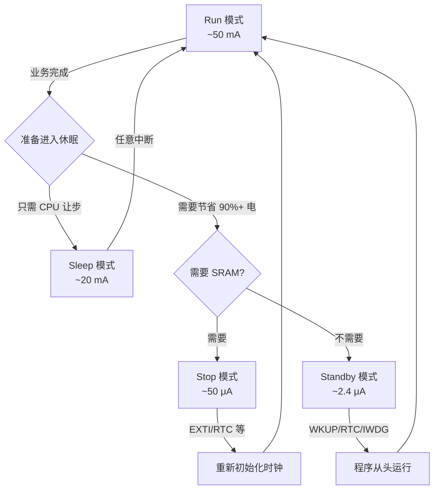

# 【元婴·111】低功耗设计：Stop/Standby模式与唤醒源

> 元婴期 · 第111篇
> 我是玄芯散人，带你从炼气修到大乘。

---

## 境界标识

```
╔══════════════════════════════════════════════╗
║          元婴期 · 第111篇                    ║
║    低功耗设计：Stop/Standby模式与唤醒源       ║
║          预计阅读：50分钟                     ║
╚══════════════════════════════════════════════╝
```

---

## 修仙引入

109 篇修真弟子刚看完门狗和 Flash 保护，知道怎么守 MCU 不死机。但守得住不等于活得长。物联网设备靠电池供电，电池容量决定产品寿命。STM32 在 Run 模式下电流约几十 mA，一节 2000 mAh 的电池撑不过 100 小时。要让设备活一年甚至更久，必须让 MCU 大部分时间睡觉，偶尔起来收个数据再睡回去。这种「少干活多睡觉」的修真境界，就是低功耗设计。

110 篇讲了 DMA 御剑术，CPU 把搬运活外包出去省电。但省电还差一步：没有活干的时刻怎么办？修真弟子闭关时呼吸极慢、心跳极缓，能进入龟息状态，只留一线神识监视外界。STM32 也有一整套龟息术。Sleep 模式像「浅眠」，CPU 停摆，外设还在跑。Stop 模式像「深度睡眠」，所有时钟停摆，SRAM 保持，外部中断或 RTC 能叫醒。Standby 模式像「假死」，SRAM 都丢了，只有 WKUP 引脚或 RTC 闹钟或独立看门狗才能拉回来。这篇把 STM32 的三套龟息术和对应的叫醒手段讲透。修完这篇，再看手册 PWR_CR 和 PWR_CSR 那些位域（PDDS / LPDS / FPDS / EWUP）就知道怎么配。

## 硬核主体

### 一、为什么需要低功耗：电池供电的现实

修真界有一个铁律。弟子任何时刻都在消耗灵力。Run 模式像全力运功打坐，灵力消耗大但产出高（CPU 全速处理）。修真者要选「赚得多」还是「活得久」，大部分场景是活得久。

数字能说明问题。STM32F407 数据手册给的典型电流值（VDD=3.3V，室温条件下）。Run 模式在 168MHz 全外设开时约 50 mA。Sleep 模式（CPU 停，外设跑）约 20 mA。Stop 模式（1.2V 域保持）配 RTC 约 50 μA。Standby 模式在 VBAT 域下约 2.4 μA。

差距何止百倍。一节 CR2032 纽扣电池（220 mAh），在 Run 模式下撑 4 小时就耗尽；切换到 Standby 模式（每秒一次 RTC 短间隔触发跑一次业务），理论上能撑 3 年。这就是低功耗设计的价值。

修真类比：修真界评价一名弟子的真功夫，不看他全力一击能放多大招，看他平时一动不动能维持多久。断电的产品常年要靠这层龟息术撑着。

修真类比再展开：IoT 设备的功耗预算像宗门的灵石储备。STM32 的 Run 模式是「弟子每天全力修炼」消耗大，Sleep 是「弟子打坐」消耗中，Stop 是「弟子浅眠」消耗极小，Standby 是「弟子闭关假死」消耗近乎无。修真者把任务错开（秒级任务放 Sleep，分钟级任务放 Stop，小时级任务放 Standby），灵石才能用得久。

### 二、Sleep 模式：CPU 睡觉，外设跑

Sleep 模式是 ARM Cortex-M 内核自带的基础休眠。CPU 时钟停止，但所有外设时钟还在跑，已经配置好的 DMA 传输或者 UART 收发，又或者定时器计数都不会被打断。任意中断都能触发 CPU 重启。

修真类比：浅眠是弟子坐在蒲团上闭目养神。弟子脑子不动（CPU 停），但耳朵还竖着（中断保持），身旁的香炉还在烧（外设运行）。任何一声响动（中断触发）弟子立刻睁眼（CPU 恢复），可以接着处理。

进入 Sleep 模式有两条路：

```c
/* 方式 1：WFI（Wait For Interrupt） */
void Enter_Sleep_WFI(void)
{
    /* 关闭 SysTick 中断避免误触发（可选） */
    SCB->SCR &= ~SCB_SCR_SLEEPONEXIT_Msk;  /* SLEEPONEXIT=0，正常进入 */

    __WFI();  /* 等待任意中断触发，醒来后继续执行下一句 */
}

/* 方式 2：WFE（Wait For Event） */
void Enter_Sleep_WFE(void)
{
    SCB->SCR |= SCB_SCR_SEVONPEND_Msk;     /* 允许未决中断触发事件 */
    __WFE();  /* 等待事件触发 */
}
```

修真类比：WFI 像弟子坐在蒲团上等「声音」叫醒，任何中断都算声音。WFE 像弟子等「信符」（事件），只有特定事件（比如外设 DMA 完成标志）才叫得醒。WFI 适合一般休眠场景，WFE 适合多个外设协同的省电场景。

修真类比：WFI 是「叫名才会醒」（中断触发），WFE 是「摇铃才会醒」（事件触发）。修真者选哪种看业务：日常用 WFI，多个外设同步用 WFE。

### 三、Stop 模式：时钟全停，SRAM 保持

Stop 模式比 Sleep 深一层。在 Stop 模式下：

- 1.2V 域全部下电，包括 PLL 和 HSI 和 HSE。所有外设时钟关闭。
- SRAM 和寄存器内容保持（不丢）。
- LSI 和 LSE 仍可运行，给 RTC 和独立看门狗供时钟。
- 调压器可切到低功耗模式（Low-Power Regulator）。

修真类比：Stop 是弟子进入深度睡眠。耳、目、舌全部关闭（外设时钟停），脑子里仅留一缕神识监视灵台（SRAM 保留）。外界要叫醒他，必须「碰一下他」或「定时闹钟响」。

进入 Stop 模式流程：

```c
void Enter_Stop_Mode(void)
{
    /* 1. 选择调压器模式 */
    PWR->CR |= PWR_CR_LPDS;     /* 切到低功耗调压器 */

    /* 2. Clear Standby Flag（防止历史误判） */
    PWR->CR |= PWR_CR_CSBF;

    /* 3. Flash 断电（进一步省电） */
    PWR->CR |= PWR_CR_FPDS;     /* 停止时 Flash 也下电 */

    /* 4. 选 PDDS=0（Stop 而不是 Standby） */
    PWR->CR &= ~PWR_CR_PDDS;    /* PDDS=0 = Stop */

    /* 5. Cortex-M4 SLEEPDEEP=1 */
    SCB->SCR |= SCB_SCR_SLEEPDEEP_Msk;

    /* 6. 进入 */
    __WFI();  /* 或 __WFE() */

    /* 7. 醒来后要重新配置系统时钟（PLL/HSI 都没了） */
    SystemClock_Config();  /* 用户自己实现 */
}
```

修真类比：弟子进 Stop 模式有七步告示宗门。第一步告诉护山大阵「我要闭关了，把防御降到最低」（LPDS）。第二步擦掉上次闭关记录（CSBF）。第三步让藏经阁也歇息（FPDS）。第四步定好闭关类别（PDDS=0 = 深度睡眠，不是假死）。第五步告诉心境「这一觉要睡到地老天荒」（SLEEPDEEP）。第六步躺下。第七步醒来时发现护山大阵没了（PLL 关），必须重新召集弟子布阵（SystemClock_Config）。

修真类比：Stop 模式有两种复位（一位真人归位，相当于 CPU 复位），这是修真弟子从 Stop 醒来必须重建神识（重新配置时钟）的现实。

为什么 Stop 醒来必须重建时钟？因为 PLL/HSI 都断电了。重新跑 SystemClock_Config 是开工第一步。

修真类比：Stop 模式的要点在于「SRAM 保留加时钟全关」。弟子闭目后，灵石账户完整（SRAM 保留），但护山大阵全部解散（PLL/HSI 关）。任何震动都能拉他醒来，但醒来要先重整旗鼓（重建时钟）。

#### 3.1 Stop 模式的触发源

修真者有多种方式可以从 Stop 状态拉起 CPU。常见的有：

- 外部中断 EXTI（任意已配置好的引脚）
- RTC 闹钟中断（RTC_ALARM）
- RTC WKUP 定时器
- USB OTG FS 触发
- ETH 触发
- UART 在特定条件下触发

引脚进入 Stop 状态后需要预先配成 EXTI 模式。每一根 EXTI 线对应一个 GPIO 引脚。

修真类比：能叫醒 Stop 弟子的有四类。一是外界动静（EXTI 引脚），二是宗门定时锣鼓（RTC 闹钟），三是 USB 入山令牌（USB 触发），四是道友飞剑传书（UART 触发）。修真者选哪类，看产品怎么交互。

### 四、Standby 模式：最深，SRAM 丢

Standby 模式是 STM32F4 最深的休眠：

- 内核 1.2V 域完全断电。
- 所有高速时钟（PLL/HSI/HSE）全停。
- SRAM 和大部分寄存器内容丢失。
- 只有备份域（RTC + 备份寄存器 + WKUP 引脚逻辑）保持供电（VBAT）。
- 触发后系统等同于上电复位（程序从头跑）。

修真类比：Standby 是弟子假死。闭目塞聪，连神识都收回丹田。醒转后不留任何前世记忆（SRAM 丢），相当于重新投胎（程序从头开始跑）。能叫醒他的只有三种办法：外人一掌拍醒（WKUP 引脚上升沿），寺钟敲响（RTC 闹钟），护法硬摇（IWDG 复位）。

修真类比：Standby 模式假死后唤起的程序不能再依赖任何 RAM 中的状态（比如「上次配置好的 UART 波特率」），必须按上电流程重新初始化并读备份寄存器。

进入 Standby 模式流程：

```c
void Enter_Standby_Mode(void)
{
    /* 1. 使能 WKUP 引脚（PA0 上升沿叫醒） */
    PWR->CSR |= PWR_CSR_EWUP1;     /* EWUP1 = 1，使能 PA0 WKUP */

    /* 2. Clear Standby Flag */
    PWR->CR |= PWR_CR_CSBF;

    /* 3. PDDS=1 = Standby */
    PWR->CR |= PWR_CR_PDDS;        /* 选 Standby */

    /* 4. SLEEPDEEP=1 */
    SCB->SCR |= SCB_SCR_SLEEPDEEP_Msk;

    /* 5. 进入 */
    __WFI();

    /* 程序不会从这里继续，因为醒来等同于复位 */
}

void RTC_Alarm_Trigger_Standby(void)
{
    /* 配置 RTC 闹钟在下一次触发 */
    RTC->CR &= ~RTC_CR_ALRAE;       /* 先关闭闹钟 */
    while (!(RTC->ISR & RTC_ISR_ALRAWF));  /* 等允许写 */
    RTC->ALRMAR = ...;              /* 写闹钟时间 */
    RTC->CR |= RTC_CR_ALRAE | RTC_CR_ALRAIE; /* 开闹钟 + 中断 */
    EXTI->IMR |= EXTI_IMR_IM17;     /* EXTI 线 17 = RTC 闹钟 */
    EXTI->RTSR |= EXTI_RTSR_TR17;   /* 上升沿触发 */

    Enter_Standby_Mode();
}
```

修真类比：弟子进 Standby 有五步。第一步对外发一道令牌「谁来拍我肩膀」（EWUP1）。第二步消除上次假死记录（CSBF）。第三步告诉心境「这次要假死」（PDDS=1）。第四步躺下进入假死（SLEEPDEEP=1）。第五步触发。前四步都在「准备」，第五步才是「真进去」。醒来后程序从头跑，不会有任何状态延续。

修真类比：Standby 模式能利用 RTC 闹钟提前设置下一醒来的时间，然后假死。弟子告诉寺钟「一炷香后敲我」，然后假死。一炷香后寺钟敲醒他，他重新投胎做弟子，从头跑宗门规训（上电复位流程）。

### 五、三种模式功耗对比

修真者经常纠结三个模式选哪个。下表把关键参数列出来：

| 维度 | Sleep | Stop | Standby |
|------|-------|------|---------|
| CPU 时钟 | 停 | 停 | 停（全域断电） |
| 外设时钟 | 跑 | 停 | 停 |
| SRAM | 保持 | 保持 | 丢失 |
| 寄存器 | 保持 | 保持 | 丢失（除备份域） |
| LSE/LSI | 可跑 | 跑（RTC/IWDG） | 跑（仅备份域） |
| 叫醒源 | 任意中断 | EXTI/RTC/USB/ETH | WKUP/RTC/IWDG |
| 醒来后 | 继续执行下一行 | 重新初始化时钟 | 等同上电复位 |
| F407 典型电流 | ~20 mA | ~50 μA | ~2.4 μA |
| 修真类比 | 浅眠（耳朵竖着） | 深度睡眠（一缕神识） | 假死（神识归丹田） |

修真类比：选哪个模式，看产品需要什么样的「醒来能力」。耳科病人（Sleep）保持外设跑只关 CPU 脑子；闭关弟子（Stop）扔下所有事务只留神识监视；假死道人（Standby）扔下一切连神识都收回丹田，只留一盏灯让外人一掌拍醒。IoT 传感器常驻用 Standby（最省电），偶尔处理用 Stop（保留 SRAM），做实时任务用 Sleep（保留外设能力）。

### 六、PWR 寄存器位域（PWR_CR 加 PWR_CSR）

PWR_CR（Power Control Register）位于 RCC APB1 时钟域，偏移 0x00。关键位域：

- LPDS（bit 0）：Low-Power Deep Sleep。Stop 模式下切到低功耗调压器。
- PDDS（bit 1）：Power Down Deep Sleep。0 = Stop，1 = Standby。
- CWUF（bit 2）：Clear Wakeup Flag。清除 WUF 标志。
- CSBF（bit 3）：Clear Standby Flag。清除 SBF 标志。
- PVDE（bit 4）：Power Voltage Detector Enable。掉电检测使能。
- PLS[2:0]（bits 7:5）：PVD Level Selection。2.0V~2.9V 阈值。
- DBP（bit 8）：Disable Backup Domain Protection。RTC 寄存器写保护位。
- FPDS（bit 9）：Flash Power Down in Stop mode。Stop 时关闭 Flash。
- VOS[1:0]（bits 15:14）：Voltage Scaling。调压器输出电压等级。

PWR_CSR（Power Control Status Register）偏移 0x04：

- WUF（bit 0）：Wakeup Flag。WKUP 引脚或 RTC 闹钟被叫醒时置 1。
- SBF（bit 1）：Standby Flag。从 Standby 模式醒来时置 1。
- PVDO（bit 2）：PVD Output。电压低于阈值时置 1。
- BRR（bit 3）：Backup Regulator Ready。
- EWUP1（bit 8）：Enable WKUP1 pin（PA0）。

修真类比：PWR_CR 是「闭关规则总纲」（弟子的闭关告示）。LPDS 是「护山大阵降级告示」（调压器降级），PDDS 是「闭关类型告示」（Stop 还是 Standby），CSBF 是「消除上次闭关记录」。PWR_CSR 是「闭关记录告示」（宗门告示墙），WUF 是「被叫醒记录」，SBF 是「闭关类别记录」。

修真类比：PWR_CR 加 PWR_CSR 是 STM32 低功耗设计的两个总控告示。闭关总纲决定「怎么睡」（CR），闭关记录告示决定「睡过几次、怎么醒的」（CSR）。

```c
/* 常用配置模板 */
void PWR_Config_For_Stop(void)
{
    /* 开 PWR 时钟（通常默认开） */
    RCC->APB1ENR |= RCC_APB1ENR_PWREN;

    /* Stop 模式选择 */
    PWR->CR |= PWR_CR_LPDS;     /* 低功耗调压器 */
    PWR->CR |= PWR_CR_FPDS;     /* Flash 下电 */
    PWR->CR &= ~PWR_CR_PDDS;    /* PDDS=0 = Stop */
}

void PWR_Config_For_Standby(void)
{
    RCC->APB1ENR |= RCC_APB1ENR_PWREN;

    /* 默认 PDDS=0（Stop），进入 Standby 时再切 PDDS=1 */
    PWR->CR &= ~PWR_CR_PDDS;

    /* 使能 PA0 WKUP 上升沿触发 */
    PWR->CSR |= PWR_CSR_EWUP1;
}

void Enter_Standby_Mode(void)
{
    PWR_Config_For_Standby();   /* EWUP1 + 默认 PDDS=0 */

    /* 进入前一刻切到 Standby */
    PWR->CR |= PWR_CR_PDDS;     /* PDDS=1 = Standby */

    PWR->CR |= PWR_CR_CSBF;     /* 清上次 Standby Flag */
    SCB->SCR |= SCB_SCR_SLEEPDEEP_Msk;

    __WFI();

    /* 不会从这行继续：Standby 醒来等同上电复位 */
}
```

修真类比：弟子每次准备闭关都要发两次告示。第一次是给宗门（CR 寄存器）发「我要闭关按这条规则」（LPDS 加 FPDS）。第二次是给山门（CSR 寄存器）发「请用 PA0 这条门路唤我」（EWUP1）。修真弟子并发两条告示，闭关告示才能生效。

### 七、降低功耗的工程实践

修真者光选好模式还不够，细节决定省电成败。下列七条经验：

第一条：未用引脚配模拟输入。GPIO 浮空时输入缓冲器会消耗微小电流（每个引脚约 1 μA，100 个引脚就是 100 μA，量级惊人）。所有未用引脚配成模拟输入（GPIO->MODER = 0xFF），模拟输入缓冲不工作。

第二条：关闭不用外设时钟。AHB 和 APB 总线上的外设只要时钟开就有功耗。RCC 寄存器关闭不用外设的时钟位即可省电。Run 模式下也可以关闭用不到的外设时钟。

第三条：调低主频或换调压器模式。168 MHz 不必要时降到 16 MHz，电流跟着降。还可以通过 PWR_CR.VOS 把调压器从 Scale 1 切到 Scale 2 或 Scale 3（输出电压降低，漏电减少）。

第四条：别用 HSI 当 RTC 时钟。HSI 起振快但精度差，且常开有功耗。RTC 用 LSE（32.768 kHz 晶振）精度高功耗低（μA 级）。

第五条：避免频繁进出低功耗模式。一次进入 Stop 后跑 1 ms 业务再退出的电流平均下来比 Run 模式还高（因为进入和退出过程本身耗能）。修真者把任务攒够再集中跑。

第六条：Stop 模式下关闭 SysTick。SysTick 中断每毫秒触发一次，会立即退出 Stop。建议进入 Stop 前用 HAL_SuspendTick() 挂起 SysTick。

第七条：测量真实功耗。工业级万用表（μA 档精度）够测 mA/μA 级。nA 级只能用专用电源芯片（如 Nordic Power Profiler Kit II 或 Joulescope）。

修真类比：修真者降功耗有七条经验。一是不用的灵脉断开（未用引脚配模拟输入）。二是闲杂人等遣散（关闭外设时钟）。三是低阶弟子别当高阶用（降频降压）。四是精确计时靠晶振而不是心跳（用 LSE）。五是闭关次数要少（避免频繁进出）。六是弟子闭目时护山大阵的钟也要停（挂 SysTick）。七是用真实的电量计测灵石消耗（专用电源芯片）。

修真类比：弟子用「真实测量数据」判断修为。Run 模式 50 mA，Stop 模式 50 μA，Standby 模式 2.4 μA。这些都是 STM32F407 数据手册的典型值。修真者做产品前先量功耗基线，再做调优，否则思路都可能走偏。

### 八、实战：RTC 闹钟定时叫醒 Stop 模式

把前面零件拼起来，做一个实战案例：STM32F407 用 RTC 闹钟每 5 秒叫醒一次 CPU，CPU 醒来读一个传感器值（用虚拟传感器模拟），发一次 LoRa，再进 Stop 模式。整个系统的平均功耗主要来自 Stop 模式。

修真类比：现实修真者造一座定时塔。塔的敲钟人（RTC）每 5 秒敲一次。塔外的巡山弟子（CPU）被钟声叫醒（Stop 退出），醒后查山门令牌（读传感器），写一封飞书传书（LoRa 发送），然后再睡觉（重新进 Stop）。大部分时间塔是静的（Stop），只有钟声和巡山这一瞬间耗电。

#### 8.1 代码实现

```c
#include "stm32f407xx.h"

static volatile uint8_t wakeup_flag = 0;

/* 外部中断线 17 = RTC 闹钟触发 */
void RTC_Alarm_IRQHandler(void)
{
    if (RTC->ISR & RTC_ISR_ALRAF) {
        RTC->ISR &= ~RTC_ISR_ALRAF;   /* 清标志 */
        EXTI->PR = EXTI_PR_PR17;      /* 清 EXTI 线 17 */
    }
}

void RTC_Init_For_Periodic_Wakeup(void)
{
    /* 1. 开 PWR 和备份域访问 */
    RCC->APB1ENR |= RCC_APB1ENR_PWREN;
    PWR->CR |= PWR_CR_DBP;   /* 允许写 RTC 寄存器 */

    /* 2. 选 LSE 作为 RTC 时钟源 */
    RCC->BDCR |= RCC_BDCR_LSEON;
    while (!(RCC->BDCR & RCC_BDCR_LSERDY));

    RCC->BDCR |= RCC_BDCR_RTCSEL_LSE;  /* 选 LSE */
    RCC->BDCR |= RCC_BDCR_RTCEN;       /* RTC 时钟使能 */

    /* 3. 解锁 RTC 写保护 */
    RTC->WPR = 0xCA;
    RTC->WPR = 0x53;

    /* 4. 进入配置模式 */
    RTC->ISR |= RTC_ISR_INIT;
    while (!(RTC->ISR & RTC_ISR_INITF));

    /* 5. 设置 RTC prescaler（LSI 不分频，LSE 32768 异步分频 127 加 1 = 128）*/
    RTC->PRER = (127 << RTC_PRER_PREDIV_S_Pos) | (255 << RTC_PRER_PREDIV_A_Pos);

    /* 6. 时间设为 0 */
    RTC->TR = 0;
    RTC->DR = 0;

    /* 7. 退出配置模式 */
    RTC->ISR &= ~RTC_ISR_INIT;

    /* 8. 配闹钟 A：每 5 秒触发一次
       注意：退出 INIT 后写 ALRMAR 仍需先解 WPR 写保护 */
    while (!(RTC->ISR & RTC_ISR_ALRAWF));

    /* 重新解锁 RTC 写保护（写日历/闹钟寄存器的前提） */
    RTC->WPR = 0xCA;
    RTC->WPR = 0x53;

    RTC->ALRMAR = RTC_ALRMAR_MSK4 | RTC_ALRMAR_MSK3 |
                  RTC_ALRMAR_MSK2 | 5;   /* 秒 = 5（分时日月屏蔽）*/
    RTC->CR |= RTC_CR_ALRAE | RTC_CR_ALRAIE;

    /* 9. EXTI 17 (RTC Alarm) 配置 */
    EXTI->IMR  |= EXTI_IMR_IM17;
    EXTI->RTSR |= EXTI_RTSR_TR17;

    /* 10. NVIC */
    NVIC_EnableIRQ(RTC_Alarm_IRQn);
}

void Enter_Stop_With_RTC(void)
{
    /* 关 SysTick（避免每秒触发） */
    SysTick->CTRL &= ~SysTick_CTRL_TICKINT_Msk;

    /* 配 PWR：Stop 模式，低功耗调压器，Flash 下电 */
    PWR->CR |= PWR_CR_LPDS | PWR_CR_FPDS;
    PWR->CR &= ~PWR_CR_PDDS;     /* PDDS=0 = Stop */
    PWR->CR |= PWR_CR_CWUF | PWR_CR_CSBF;  /* 清标志 */

    SCB->SCR |= SCB_SCR_SLEEPDEEP_Msk;

    __WFI();

    /* 醒来：先恢复 SysTick */
    SysTick->CTRL |= SysTick_CTRL_TICKINT_Msk;

    /* 重建 PLL 时钟（PLL 在 Stop 时断电） */
    SystemClock_Config();
}

int main(void)
{
    HAL_Init();
    SystemClock_Config();
    RTC_Init_For_Periodic_Wakeup();

    while (1) {
        if (wakeup_flag) {
            wakeup_flag = 0;
            /* 这里读传感器、发 LoRa */
            Read_Sensor_And_Send();
        }
        /* 准备再次进 Stop */
        Enter_Stop_With_RTC();
    }
}
```

修真类比：定时塔系统运行分十步。第一步 开护山大阵电源和授权「本章可以动 RTC」（PWREN 加 DBP）。第二步 在山门口装一枚晶振做钟摆（LSEON）。第三步 解除钟摆的封印（解除 WPR 写保护）。第四步 配置钟摆（PRER 异步分频）。第五步 整点钟摆（TR = 0）。第六步 装定下一个时辰（ALRMAR = 5 秒）。第七步 钟摆运行（ALRAE 加 ALRAIE）。第八步 把钟声接上巡山弟子（EXTI 17）。第九步 让守夜人听到钟声（NVIC 启用）。第十步 弟子（主循环）听到钟声起床干活，干完活就睡（进 Stop）。

修真类比：主循环干三件事。听到钟声（wakeup_flag）就起床干活（读传感器发 LoRa）。干完活再躺下（Enter_Stop_With_RTC）。躺下前关掉弟子自己挂的护山钟（SysTick）以免浪费电。躺下后定时塔静悄悄，等下一轮寺钟敲响。

#### 8.2 平均功耗估算

修真者估算这个系统的平均功耗：

```
单次触发耗时：读传感器 + 发 LoRa ≈ 50 ms（工作在 16 MHz）
单次触发电流：约 5 mA
触发间隔：5 秒

平均电流 ≈ 50 ms × 5 mA / 5000 ms + Stop 模式电流
         ≈ 50 μA + 50 μA
         ≈ 100 μA
```

如果换成 Standby 模式（用 RTC 闹钟触发，醒来等同上电复位），平均电流能压到：

```
平均电流 ≈ 100 ms × 10 mA / 5000 ms + 2.4 μA
         ≈ 200 μA + 2.4 μA
         ≈ 202 μA
```

修真类比：定时塔选 Stop 还是 Standby 看任务。Stop 适合「触发后还要做点事」（比如显示一帧数据），Standby 适合「触发后从头开始跑」（上电流程）。修真者按需选型。

修真类比：功耗预估的公式是「触发功耗 × 触发时长 ÷ 触发间隔 + 休眠电流」。修真者多算几次，找到平均电流低的组合。这是 IoT 低功耗设计的真功夫。

修真类比：平均电流 100 μA 是 Stop 模式 + 5 秒触发的常见值。能做到 100 μA 以下的产品已经算省电高手。能压到 10 μA 级别的产品堪称奢侈品。修真者用真实功耗预算表去算，别靠经验猜。



修真类比：模式选择是修真弟子决定宗门事务分级的过程。Run 是「全力运转」（宗门大门开张），Sleep 是「弟子不出门」（外设在外面跑），Stop 是「全山闭关」（大部分事务停），Standby 是「修真界不存在」（整山休眠只有山门令牌在）。修真者选哪一层看产品场景。

---

## 修仙术语对照表

| 修仙术语 | 技术现实 | 本篇位置 |
|----------|----------|----------|
| 龟息术 | 低功耗设计 | 第一段 |
| 浅眠打坐 | Sleep 模式 | 第二段 |
| 深度睡眠 | Stop 模式 | 第三段 |
| 假死闭关 | Standby 模式 | 第四段 |
| 任意声响叫醒 | 任意中断触发 | 第二段 |
| 外界震动叫醒 | EXTI 外部中断 | 第三段 |
| 寺钟敲响 | RTC 闹钟 | 第四段 |
| 拍醒弟子 | WKUP 引脚上升沿 | 第四段 |
| 护法硬摇 | IWDG 独立看门狗 | 第四段 |
| 闭关总纲 | PWR_CR 寄存器 | 第六段 |
| 闭关记录告示 | PWR_CSR 寄存器 | 第六段 |
| 护山大阵降级 | PWR_CR.LPDS | 第六段 |
| 闭关类型告示 | PWR_CR.PDDS | 第六段 |
| 消除闭关记录 | PWR_CR.CSBF | 第六段 |
| 调压器等级 | PWR_CR.VOS | 第七段 |
| 浮空灵脉漏电 | GPIO 浮空耗电 | 第七段 |
| 关闭闲杂人等 | 关闭外设时钟 | 第七段 |
| 定时寺钟 | RTC 闹钟中断 | 第八段 |
| 巡山弟子起床 | CPU 从 Stop 醒来 | 第八段 |
| 钟声响 | EXTI 线 17 触发 | 第八段 |
| 关机重启程序 | 从 Standby 启动等同上电复位 | 第八段 |
| 修真测灵石消耗 | nA 级功耗测量 | 第七段 |

## 进阶条件

低功耗设计这一篇看完一遍还不算过。读完后请自检：

- [ ] 能说出三种低功耗模式的电流量级差别（mA / μA / μA 三档）
- [ ] 能解释 Sleep 模式的机制（CPU 停外设跑，任意中断触发）
- [ ] 能解释 Stop 模式的机制（时钟全停 SRAM 保持，EXTI/RTC 触发）
- [ ] 能解释 Standby 模式的机制（SRAM 丢 只有备份域，可由 WKUP/RTC/IWDG 触发）
- [ ] 能列出 PWR_CR 主要位域（LPDS/PDDS/CWUF/CSBF/PVDE/FPDS/VOS）
- [ ] 能列出 PWR_CSR 主要位域（WUF/SBF/EWUP1）
- [ ] 能写出从 Run 模式进入 Stop 模式的代码流程（七步告示加 WFI）
- [ ] 能写出 RTC 闹钟 + Stop 模式组合的代码（叫醒源配置加 EXTI 加 NVIC）
- [ ] 能解释为什么 Stop 醒来要重新初始化系统时钟（PLL 断电）
- [ ] 能说出至少三条降低功耗的工程做法（未用引脚配模拟输入，外设时钟关闭，LSE 替代 HSI 等）
- [ ] 能估算带 RTC 定时叫醒的 Stop 模式平均功耗
- [ ] 能区分 EWUP1 与 RTC 闹钟作为叫醒源的差异

如果有一项卡住，回到对应章节重读一遍。低功耗是 IoT 产品的续航命脉。下一篇 112 会讲 Bootloader 设计（IAP 升级加双 Bank 切换），让产品能在现场不拆机升级固件。

## 下期预告 + 互动

下一篇：112 Bootloader 设计：IAP 升级与双 Bank 切换。

修真之路上，弟子闭关（低功耗模式）只是省灵石。真正的功夫是产品出货后还能更新固件。IoT 设备常常挂在不易接触的位置（比如高塔或者桥墩），拆机升级成本极高。112 会讲 STM32 的 IAP 升级原理（在 application 中跳转到 bootloader）；讲双 Bank 切换的 STM32F4 特性（两个 Bank 各放一套固件，升级失败自动回滚）；讲常见的 Bootloader 协议，例如 XMODEM 或 YMODEM 或 HTTP；讲升级失败的处理（CRC 校验加版本回退）。

互动问题：

1. 你项目里用 STM32 哪种低功耗模式？量过真实电流吗？
2. RTC 闹钟和 WKUP 引脚各适合什么场景？怎么选？
3. Stop 模式醒来重建时钟那段处理过吗？踩过什么坑？
4. 低功耗产品的电池寿命怎么估算？用万用表实测还是用数据手册典型值？

*本文是「码农修仙传」系列第111篇。系列导航见 [xren.ren](https://xren.ren)*
