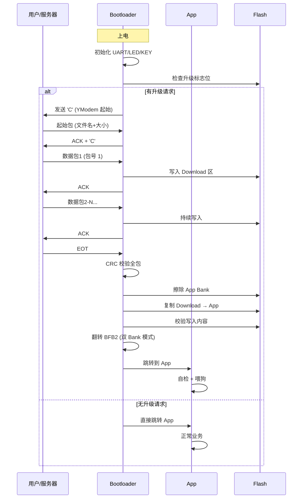

# 【元婴·112】Bootloader设计：IAP升级与双Bank切换

> 元婴期 · 第112篇
> 我是玄芯散人，带你从炼气修到大乘。

---

## 境界标识

```
╔══════════════════════════════════════════════╗
║          元婴期 · 第112篇                    ║
║    Bootloader设计：IAP升级与双Bank切换        ║
║          预计阅读：55分钟                     ║
╚══════════════════════════════════════════════╝
```

---

## 修仙引入

111 篇修真弟子刚闭关修炼完低功耗模式，知道怎么让 MCU 一天只吃三颗灵石。但修真者会遇到另一个难题：产品出厂后还会出 bug。十万个 IoT 节点挂在各地，比如桥墩上，塔顶处，深山里，不可能一个个拆机回来烧固件。修真弟子要学一种法术：让设备自己升级自己。这种「程序自己改写自己」的法术，叫 IAP（In-Application Programming）。

修真类比：宗门弟子常规修炼是闭门造车。但修真界有「神识传功」的秘术，弟子在外地也能接收宗门远程发来的新功法，更换自己修炼的功法卷轴。这就是 IAP 的实质。程序在运行时改写自己的 Flash。112 篇讲 STM32F4 上的实战：Bootloader 和 App 两段程序如何分工、固件如何通过 UART 分包传上来，Flash 怎么擦写，双 Bank 切换怎么保证升级失败能回滚。

修真类比：修真弟子光「省灵石」还不够，还要「能自我更新」。一个闭死关的弟子如果功法错了没法改，那就废了。IoT 设备必须支持远程升级，且升级失败不能变砖。这篇把整套功法拆给弟子看。

---

## 硬核主体

### 一、为什么需要 IAP：产品出货后的更新难题

修真界有个铁律。弟子在宗门内修炼（开发板烧录）和弟子在外历练（产品出货）完全是两件事。开发板烧录用 J-Link、ST-Link 仿真器直接连 SWD 接口，几秒钟搞定。产品出货后，几万个节点挂在各地，不可能派弟子挨个跑去拆机烧程序。

修真类比：传统烧录像「面对面授功」，师傅拿着手抄本逐字逐句告诉弟子，效率低但能纠错。IAP 像「飞剑传书」，师傅把新功法的竹简绑在飞剑上射到外地弟子手里，弟子自己把旧竹简烧掉换新竹简。问题是飞剑可能中途被击落（传输中断），竹简可能在传输中损坏（数据错误），弟子换竹简时可能走火入魔（升级到一半断电变砖）。这套设计要解决几个问题：传输可靠，烧写原子性，变砖恢复都得到位。

修真类比：IoT 设备的固件更新有三个硬指标。第一是传输可靠（CRC 校验加重传机制）。第二是烧写原子性（要么全成功要么全失败，不存在「半新半旧」状态）。第三是升级失败能回滚（保留旧固件，新固件验证通过再切换启动）。修真弟子把这三条做扎实，远程升级才敢上线。

#### 1.1 传统烧录 vs IAP

修真者先认清两种烧录方式差异：

| 方面 | 传统烧录 | IAP 升级 |
|------|----------|----------|
| 接口 | SWD / JTAG | UART / SPI / CAN / 网络 |
| 工具 | J-Link / ST-Link | 串口工具 / OTA 服务器 |
| 时机 | 出厂前 | 出厂后任何时刻 |
| 操作者 | 工厂工人 | 用户触发 / 服务器推送 |
| 风险 | 失败返厂 | 失败可能变砖 |

修真类比：传统烧录是「面对面授功」，IAP 是「飞剑传功」。面对面授功时师傅能看到弟子表情，能纠错，但效率低。飞剑传功一次能传十万份，但中途可能被妖风打落。修真者做产品设计要先确定走哪条路。IoT 设备几乎都走 IAP，因为节点太多没法逐一操作。

### 二、IAP 原理：Bootloader + App 双段程序

STM32 的 IAP 设计重点是「两段程序分工」。Flash 空间被切成两段：前段是 Bootloader（小，占 32 KB 左右），后段是 App（用户的业务程序）。上电先跑 Bootloader，Bootloader 检查是否要升级，是则接收新固件写进 App 区，否则跳转到 App 执行。

修真类比：修真宗门有两个守山弟子。守山弟子甲（Bootloader）专门管山门和功法更新，守山弟子乙（App）负责日常修炼和对外接活。每次弟子出门前（系统上电），守山弟子甲先检查宗门指令簿（升级标志位），如果有新功法（升级请求）就先演练一遍新功法（烧写新固件），演练成功再交班给守山弟子乙（跳转 App）；如果没新功法就直接交班。

修真类比：双段程序的要义是「守山弟子甲永远在线」。无论 App 程序跑得多烂，Bootloader 那一段永远跑得动，因为它是只读的（不会被自己覆盖）。这就是 IAP 升级的安全网。最差情况下 App 区全坏了，Bootloader 还能重新烧一遍救回来。

#### 2.1 Flash 分区方案

修真者要把 Flash 划成几个区域，每个区域分工明确。STM32F407 有 1MB Flash，典型分区方案：

```
0x08000000 ┌─────────────────────────┐
           │   Bootloader (32 KB)    │  ← 永远不擦写
0x08008000 ├─────────────────────────┤
           │   Backup Region /        │
           │   Flag Area (16 KB)     │  ← 备份区 / 标志位
0x0800C000 ├─────────────────────────┤
           │   App Region (480 KB)   │  ← 用户 App
0x08084000 ├─────────────────────────┤
           │   Download Region        │  ← 升级时暂存新固件
           │   (480 KB)              │
0x08100000 └─────────────────────────┘
```

修真类比：山门分区像宗门仓库管理。功法库（Bootloader）独立锁死，只读不写。功法运行区（App）放当前修炼的功法。新功法接收区（Download）专门接收飞剑送来的新功法，先放这里验证通过再搬到运行区。修真者绝不让功法库和运行区混在一起，否则守山弟子甲的功法被覆盖就完了。

修真类比：单 Bank 方案的隐患是「升级到一半断电」。弟子正在搬新功法（旧擦除加新写入），突然停电，功法库半空半满，下次上电启动失败。修真者用双 Bank 方案彻底解决这个问题，下面第五段专门讲。

#### 2.2 程序跳转：栈重建 + 向量表重定位

Bootloader 跳转到 App 的要义是三件事：把 App 的栈顶指针赋给 MSP、把 App 的复位向量赋给 PC、重定位中断向量表。代码极简：

```c
typedef void (*pFunction)(void);

void Jump_To_App(uint32_t app_addr)
{
    /* 1. 关所有中断，避免跳转后中断乱飞 */
    __disable_irq();
    
    /* 2. 关闭所有外设时钟，防止 Bootloader 的外设状态泄漏 */
    RCC_DeInit();
    
    /* 3. 读 App 向量表的第一个字（栈顶指针） */
    uint32_t app_sp = *(__IO uint32_t*)app_addr;
    
    /* 4. 读 App 向量表的第二个字（复位向量 = 入口函数） */
    uint32_t app_reset = *(__IO uint32_t*)(app_addr + 4);
    
    /* 5. 合法性检查：栈顶指针必须在合法 RAM 范围 */
    if ((app_sp & 0x2FFE0000) == 0x20000000) {
        /* 6. 设置 MSP 为 App 的栈顶 */
        __set_MSP(app_sp);
        
        /* 7. 重定位中断向量表（VTOR）到 App 区 */
        SCB->VTOR = app_addr;
        
        /* 8. 跳到 App 入口 */
        pFunction jump = (pFunction)app_reset;
        jump();
    }
}
```

修真类比：守山弟子甲交班给守山弟子乙要办七件事。第一件关山门（关中断），防止交接时外人闯入。第二件把甲的外袍脱下来（DeInit），防止甲的衣服染色到乙身上。第三件查乙的功法总目（向量表第一个字是栈顶，第二个字是入口）。第四件查功法是否合法（栈顶在合法 RAM 范围）。第五件交出镇山玉玺（设置 MSP）。第六件让乙接管宗门事务（重定位 VTOR）。第七件击鼓传位（跳转到 App 入口）。

修真类比：跳转的合法性检查是命门。如果 App 区烧坏了，栈顶指针可能指向非法地址（不在 0x20000000 开始的 RAM 范围），跳转过去会导致 HardFault。修真弟子必须做合法性检查，否则故障会扩散到 Bootloader。

### 三、固件传输协议：YModem 分包传输

固件通过 UART 传上来时不能整个一起传（一次传不完），必须分包。YModem 是 STM32 Bootloader 圈子最流行的分包协议，简单可靠。

修真类比：飞剑传功一次只能带一卷竹简（128 字节或 1024 字节）。新功法有几十万字，必须分包成几百卷。YModem 协议就是「飞剑传书规范」：每卷竹简有编号（包号），有反码（防止编号传错），有内容（实际数据），还有 CRC 校验（防内容出错）。守山弟子甲按编号依次接收，最后一卷收到就拼成全本新功法。

修真类比：YModem 比 XModem 强在两点。一是支持批量传多个文件（修真者一次升级可能要传 App + 资源文件）。二是每传 1024 字节一包（用 STX 头）而不是 128 字节（SOH 头），传得快。修真弟子做 IoT 升级首选 YModem。

#### 3.1 YModem 数据包格式

修真者记住 YModem 的三种包类型：

```
┌──────────────────────────────────────────────┐
│ 包头 (1字节) │ 包号 (1字节) │ 包号反码 │ 数据 │ CRC16 │
└──────────────────────────────────────────────┘

SOH (0x01) = 128字节数据
STX (0x02) = 1024字节数据
EOT (0x04) = 传输结束
```

起始包（包号 0）固定 128 字节，内容是文件名 + 文件大小：

```
┌────────────────────────────────────────────┐
│ 文件名（NULL结尾） │ 文件大小（ASCII）│ 填充0 │
└────────────────────────────────────────────┘
```

修真类比：起始包是「飞剑送来的目录」。守山弟子甲先看目录（包号 0），知道「这次要送的是什么功法，功法有多长」。然后才开始按编号接收后续数据包。每个数据包都有编号，丢包能看出来；都有 CRC，错包能验出来。

修真类比：修真弟子接收 YModem 的状态机有四态。空闲态（IDLE，等 'C' 唤起）。接收态（RECV，接收数据包）。校验态（CHECK，校验包号加 CRC）。确认态（ACK/NACK，确认或重传）。修真者把这四态写成状态机代码，每次进中断跳一次状态。

#### 3.2 CRC16 校验实现

YModem 用 CRC-CCITT（多项式 0x1021，初值 0x0000），保证数据可靠性：

```c
uint16_t YModem_CRC16(uint8_t *data, uint32_t len)
{
    uint16_t crc = 0x0000;
    
    while (len--) {
        crc ^= (uint16_t)(*data++) << 8;
        for (int i = 0; i < 8; i++) {
            if (crc & 0x8000)
                crc = (crc << 1) ^ 0x1021;
            else
                crc <<= 1;
        }
    }
    return crc;
}
```

修真类比：CRC16 校验是「飞剑竹简的封缄」。每卷竹简送来都有封缄编号（CRC16），守山弟子甲按编号算一遍核对，核对一致就这卷对了，错了就退回重传。CRC16 比简单求和强得多，能查出绝大多数偶发位错误（修真弟子在飞剑传书时遇到雷电干扰也能纠正）。

修真类比：修真弟子实现 YModem 接收要写三个回调。第一个是字符接收回调，每次 UART RXNE 中断调用，往环形缓冲区塞字节。第二个是定时回调，每次 SysTick 或空闲中断触发，处理整包逻辑。第三个是错误回调，CRC 错或超时错，发 NACK 让对端重传。修真者把这三回调搭配起来用，就是稳定的 YModem 接收器。

### 四、Flash 擦写：解锁 KEYR / 擦除 SER / 编程 PG

修真者把新功法接收到 Download 区后，要把它「烧进」Flash。这一步是元婴期弟子的硬功夫，是直接操作 Flash 控制器寄存器。

修真类比：Flash 控制器像藏经阁的守经弟子。守经弟子有三道封印：第一道是「不传外人不许动」（KEYR 解锁）。第二道是「选定哪一层书架」（SER 加 SNB 选扇区）。第三道是「一字一字抄录」（PG 加数据寄存器）。修真弟子要按顺序解封才能动功法。

修真类比：Flash 擦写的三个不变量一定要记住。第一是 Flash 只能从 1 写成 0，擦除才能把 0 变成 1（修真类比：旧功法烧了才能换新，不烧就混着）。第二是擦除按扇区（Sector）进行，STM32F4 的扇区大小不一（前面 4 个 16KB，中间 1 个 64KB，后面 7 个 128KB）。第三是擦除和编程期间 CPU 不能访问 Flash（要关闭中断或把代码搬到 RAM 跑）。

#### 4.1 Flash 解锁

STM32F4 的 Flash 默认是锁死的。CR.LOCK 位 = 1 时所有 Flash 操作无效。解锁要写 KEYR 寄存器两次写魔法数：

```c
void Flash_Unlock(void)
{
    /* 检查是否已经解锁 */
    if (FLASH->CR & FLASH_CR_LOCK) {
        /* 写魔法数解锁（KEYR 是 32 位寄存器）*/
        FLASH->KEYR = 0x45670123;  /* 第一把钥匙 */
        FLASH->KEYR = 0xCDEF89AB;  /* 第二把钥匙 */
        
        /* 验证解锁成功 */
        if (FLASH->CR & FLASH_CR_LOCK) {
            /* 解锁失败，死循环报警 */
            while (1);
        }
    }
}
```

修真类比：KEYR 是藏经阁的两把钥匙。修真弟子想进藏经阁，必须依次转动左钥（0x45670123）和右钥（0xCDEF89AB），两钥都对才开得了门。钥匙转动顺序不能错，错一次阁门就永久封死（要重新上电才能再试）。修真弟子在 Bootloader 启动时第一件事就是转钥匙。

修真类比：Flash 控制器是修真界极少数「软件加锁」的硬件。其他外设都是默认开启的，Flash 是默认上锁的。这是 ST 公司故意设计的，防止程序运行时误擦 Flash 导致变砖。修真弟子改 Flash 前必解锁，改完立刻重新上锁。

#### 4.2 扇区擦除

修真者要按扇区擦除。STM32F407 扇区 0-3 是 16KB，扇区 4 是 64KB，扇区 5-11 是 128KB。擦除流程四步：

```c
void Flash_Erase_Sector(uint8_t sector, uint8_t voltage_range)
{
    /* 1. 解锁 Flash（必须先解锁） */
    Flash_Unlock();
    
    /* 2. 设置并行位数（电压范围影响，3.3V 用 32 位并行最快） */
    FLASH->CR &= ~FLASH_CR_PSIZE_MASK;
    FLASH->CR |= voltage_range << FLASH_CR_PSIZE_Pos;
    /* voltage_range = 2 表示 32 位 */
    
    /* 3. 选扇区（SNB 4位，支持 0-11 共 12 个扇区） */
    FLASH->CR &= ~FLASH_CR_SNB_MASK;
    FLASH->CR |= FLASH_CR_SER | (sector << FLASH_CR_SNB_Pos);
    /* SER=1 + SNB=sector 告诉控制器「我要擦扇区 N」 */
    
    /* 4. 启动擦除 */
    FLASH->CR |= FLASH_CR_STRT;
    
    /* 5. 等待擦除完成（BSY=1 表示忙） */
    while (FLASH->SR & FLASH_SR_BSY);
    
    /* 6. 清除 SER 位（防止下次误操作） */
    FLASH->CR &= ~FLASH_CR_SER;
}
```

修真类比：藏经阁守经弟子擦除扇区有五步告示。第一步申请钥匙解锁（KEYR 魔法数）。第二步告诉守经弟子「这次抄录用 32 位并行最快」（PSIZE = 32 位）。第三步告诉守经弟子「我要擦第 N 书架」（SER 加 SNB）。第四步下令「开始」（STRT）。第五步守经弟子擦完挥手（BSY 清零）。修真弟子把这五步当口诀念，写代码就不会出错。

修真类比：擦除一个扇区的耗时。STM32F407 在 168MHz 下擦一个 16KB 扇区约 1 秒，擦一个 128KB 扇区约 2-4 秒。修真弟子做 OTA 升级时不能阻塞系统太久，长扇区擦除期间要把系统调度停掉，或用看门狗防止误判死机。

#### 4.3 字编程

擦完扇区后，写入新固件是按「字」（32 位）或「半字」（16 位）写入：

```c
void Flash_Program_Word(uint32_t addr, uint32_t data)
{
    /* 1. 解锁（如果还没解锁） */
    Flash_Unlock();
    
    /* 2. 设置 PG 位 */
    FLASH->CR |= FLASH_CR_PG;
    
    /* 3. 设置并行位数 */
    FLASH->CR &= ~FLASH_CR_PSIZE_MASK;
    FLASH->CR |= 2 << FLASH_CR_PSIZE_Pos;  /* 32 位编程 */
    
    /* 4. 写入数据 */
    *(__IO uint32_t*)addr = data;
    
    /* 5. 等待编程完成 */
    while (FLASH->SR & FLASH_SR_BSY);
    
    /* 6. 清除 PG 位 */
    FLASH->CR &= ~FLASH_CR_PG;
}
```

修真类比：藏经弟子抄录功法是「一次抄一个字」。PG=1 告诉控制器「进入抄录模式」，PSIZE 告诉控制器「每次抄 32 位」，写入数据就是「把字写到对应书架位置」。修真弟子在 Bootloader 里写一个循环，把 Download 区的字节流按字搬运到 App 区 Flash。

修真类比：Flash 写入有速度限制。STM32F407 在 168MHz 下编程一个 32 位字约 50 μs。修真弟子烧一个 480KB 的固件要写 122880 个字，纯写入耗时约 6 秒。加上扇区擦除（4 秒）和校验（1 秒），整个 OTA 升级大约 12 秒。修真者做产品要把这个耗时算进用户体验设计里。

### 五、双 Bank 切换：写入备用 Bank，切换启动

修真类比：修真弟子最怕「升级到一半断电导致变砖」。单 Bank 方案的隐患是：擦完 App 区后写新固件到一半停电，新旧功法半混，下次上电启动失败变砖。修真界有一种「双胞胎功法库」方案彻底解决这个问题，那就是双 Bank 切换。但要事先说明：双 Bank 功能仅 STM32F42x/F43x 系列（如 STM32F427/F429）支持，STM32F407/F417/F405 等经典系列不支持。下面按 STM32F427 展开讲解。

修真类比：宗门有两个一模一样的藏经阁（Bank1 和 Bank2）。修真弟子平时在 Bank1 修炼。新功法送到时，先写到 Bank2。Bank2 写完验证通过，再把「下次启动跳 Bank2」的标志写进去。下次上电守山弟子甲看到标志就跳 Bank2，新功法修炼起来。如果 Bank2 写一半停电，下次上电守山弟子甲看到 Bank2 不齐全，仍跳回 Bank1 旧功法运行。这样弟子永远有功法可用，永远不变砖。

修真类比：双 Bank 是车规和工控 IoT 设备的事实标准。STM32F4 家族里仅 F42x/F43x（如 STM32F427/F429，2MB Flash）支持双 Bank，F407/F417/F405 等经典系列不支持。修真弟子做车规或工控或远程固件场景选型号时要确认双 Bank 支持，否则升级失败变砖后果严重。

#### 5.1 双 Bank 模式配置

STM32F427 的双 Bank 模式通过选项字节（Option Byte）控制。默认是单 Bank 模式，要手动切换：

```c
/* 切换到双 Bank 模式（DB1M = 1） */
void Flash_Set_DualBank(void)
{
    /* 1. 等待 Flash 控制器空闲 */
    while (FLASH->SR & FLASH_SR_BSY);
    
    /* 2. 解锁选项字节（OPTKEYR 是单独钥匙寄存器）*/
    FLASH->OPTKEYR = 0x08192A3B;  /* 第一把钥匙 */
    FLASH->OPTKEYR = 0x4C5D6E7F;  /* 第二把钥匙 */
    
    /* 3. 设置 DB1M 位（DB1M 在 FLASH_OPTCR[30]，默认 0=单 Bank）*/
    FLASH->OPTCR |= FLASH_OPTCR_DB1M;  /* DB1M=1 切换到双 Bank（仅 F42x/F43x 支持）*/
    
    /* 4. 启动选项字节编程（OPTSTRT 不是 STRT）*/
    FLASH->OPTCR |= FLASH_OPTCR_OPTSTRT;
    while (FLASH->SR & FLASH_SR_BSY);   /* 等待选项字节烧写完成 */
    
    /* 5. 系统复位让选项字节生效（DB1M 必须复位后生效）*/
    NVIC_SystemReset();
}
```

修真类比：宗门从单库改成双库是一次「重大改建」。守经弟子（Flash 控制器）平时只看一个库（单 Bank）。改建要先单独请出守经弟子（解锁 OPTKEYR），然后告诉守经弟子「从今天起管两个库」（DB1M=1），烧一道令进选项字节（OPTSTRT），最后敲钟重启（SystemReset）才生效。修真弟子决定做双 Bank 升级前要在产品出厂前就配置好 DB1M，出厂后再改很麻烦。

修真类比：双 Bank 模式下地址空间被均分。STM32F427 2MB Flash 双 Bank 后变成两个 1MB 区段。Bank1 范围 0x08000000-0x080FFFFF，Bank2 范围 0x08100000-0x081FFFFF。修真弟子 Bootloader 和 App 的地址对应关系要重新规划。

#### 5.2 BFB2 选项字节：选 Bank

修真类比：守山弟子甲每次上电要决定「跳 Bank1 还是 Bank2」。BFB2（Boot From Bank2）选项字节就是「下次启动跳哪个 Bank」的旗帜。旗帜是 0 跳 Bank1，旗帜是 1 跳 Bank2。守山弟子甲看完旗帜就跳对应 Bank。

修真类比：修真弟子做 OTA 升级有一套标准流程。第一步是接收新固件到 Download 区做暂存。第二步是计算新固件 CRC 做验证。第三步是检查双 Bank 哪个是当前运行 Bank，决定写到哪个 Bank。第四步是把新固件写入非运行 Bank，保留运行 Bank 不动。第五步是写完后校验写入内容，防止写错。第六步是翻转 BFB2 标志指向新 Bank，告诉下次启动跳新 Bank。第七步是系统复位启动新 Bank（NVIC_SystemReset）。

修真类比：双 Bank 的回滚机制自动生效。如果第六步翻转 BFB2 后第七步启动新 Bank 时新 Bank 跑不起来（比如新固件有 bug），修真弟子要在新 Bank 的 App 启动早期检测自己跑成功没。成功就在备份区写「当前 Bank OK」标志，失败就翻转 BFB2 跳回旧 Bank。修真者把这种「自检 + 自动回滚」叫 A/B 升级（Android 系统的术语）。

### 六、升级失败回滚：看门狗 + 版本标记

修真类比：双 Bank 解决了「写入失败」的变砖问题，但解决不了「新固件本身有 bug」。修真弟子升级了带 bug 的新功法，App 跑起来就崩。修真者需要一套「新功法自检 + 自动回退旧功法」的机制。

修真类比：修真界 IoT 设备有三道防线。第一道是传输 CRC 校验，接数据时验完整性。第二道是写入校验，写完 Flash 后读回来对比。第三道是运行时自检，启动早期检查 App 是否健康，不健康就回滚。修真弟子把这三道防线做扎实，升级失败变砖的概率压到几乎为零。

修真类比：修真界「自检」有四个常用信号。watchdog 喂狗，新 App 必须在 X 秒内开始喂狗，否则 watchdog 复位。版本握手，新 App 启动后向服务器发版本号，服务器确认收到。寄存器自检，App 启动早期读状态寄存器确认硬件正常。看门狗超时回滚，新 App 启动失败超时就跳回旧 Bank。

#### 6.1 版本标记设计

修真者要在备份区（如 Bank1 最后 16KB）存几个必要标志：

```c
typedef struct {
    uint32_t magic;          /* 0xA5A5A5A5 表示标记区有效 */
    uint32_t current_bank;   /* 当前运行 Bank（1 或 2） */
    uint32_t pending_bank;   /* 待切换 Bank */
    uint32_t boot_count;     /* 当前 Bank 启动次数 */
    uint32_t confirm_count;  /* 当前 Bank 确认成功次数 */
    uint32_t version;        /* 固件版本号 */
    uint32_t crc;            /* 这段标记区的 CRC32 */
} BootFlag_t;

#define BOOT_FLAG_ADDR  0x0807F000  /* Bank1 最后 16KB 起始地址 */
```

修真类比：版本标记是修真宗门的「弟子档案」。档案记着当前哪个弟子在岗（current_bank）、候补弟子是谁（pending_bank）、弟子已经入岗几天（boot_count）、弟子是否考核通过（confirm_count），弟子编号（version），还有档案封缄（crc）。修真弟子每次升级都要更新档案，下次上电守山弟子甲按档案决定行动。

修真类比：自检逻辑的状态机。新 Bank 启动后 boot_count 加 1。如果 5 秒内没喂狗（或没向服务器发心跳），watchdog 复位系统。复位后守山弟子甲看 boot_count 已经大于 confirm_count，判断新 Bank 没成功，跳回旧 Bank。如果 5 秒内喂狗成功，confirm_count 加 1，下次启动就锁定新 Bank 不再回滚。

#### 6.2 实战代码：自检 + 回滚

修真者把自检逻辑写在 App 启动早期：

```c
void App_Self_Check(void)
{
    /* 1. 读 BootFlag（如果标记区无效说明第一次启动，正常） */
    BootFlag_t *flag = (BootFlag_t*)BOOT_FLAG_ADDR;
    
    if (flag->magic == 0xA5A5A5A5) {
        /* 2. 检查 boot_count，确认新 Bank 启动次数 */
        if (flag->boot_count >= 3 && flag->confirm_count < 3) {
            /* 启动次数超过 3 次还没确认，说明新 Bank 有问题 */
            /* 翻转 BFB2 跳回旧 Bank */
            Switch_To_Other_Bank();
            NVIC_SystemReset();
        }
    }
    
    /* 3. 增加本次启动计数 */
    Flash_Unlock();
    flag->boot_count++;
    Flash_Program_Word((uint32_t)&flag->boot_count, flag->boot_count);
    
    /* 4. 启动 5 秒看门狗 */
    IWDG->KR = 0x5555;  /* 解锁 */
    IWDG->PR = 4;        /* 64 分频（PR 值 4 对应 64 分频）*/
    IWDG->RLR = 2500;    /* 5 秒超时（RLR / (32K/64) = 2500/500 = 5s）*/
    IWDG->KR = 0xAAAA;   /* 重载 */
    IWDG->KR = 0xCCCC;   /* 启动 */
    
    /* 5. 业务初始化 */
    HAL_Init();
    SystemClock_Config();
    /* ... */
}

void Feed_Dog(void)
{
    IWDG->KR = 0xAAAA;  /* 喂狗 */
}

/* 主循环里调 Feed_Dog() 表示系统健康 */
int main(void)
{
    App_Self_Check();   /* 启动早期自检 */
    
    while (1) {
        /* 业务代码 */
        if (system_healthy) {
            Feed_Dog();
        }
        /* ... */
    }
    
    /* 5 秒内没喂狗 → watchdog 复位 → 守山弟子跳回旧 Bank */
}
```

修真类比：自检 + 回滚是修真弟子的「试炼期」。新功法弟子上岗后有三次试炼机会（boot_count 加到 3）。每次试炼要喂狗成功（业务跑通）。三次都成功，宗门档案记 confirm_count = 3，下次不再回滚（试炼期结束，正式上岗）。三次里只要一次没喂狗成功，下次试炼累加。累加到 3 还没成功，守山弟子判断新功法有问题，跳回旧 Bank（弟子被「强制退休」）。

修真类比：修真弟子升级前要先想清楚回滚策略。新 Bank 启动后 30 秒内没成功跑业务，就跳回旧 Bank。回跳时直接翻 BFB2 加系统复位即可，不用再写 App 区（旧 App 区一直保留着）。修真者把 watchdog 超时设短一点（5 秒试炼期），失败回滚时间可控。

### 七、实战：UART IAP 升级全流程

修真者把前面所有零件拼起来，做一套 UART IAP 升级实战。

修真类比：整套 IAP 升级流程像修真弟子接收新功法的全过程。守山弟子甲（Bootloader）平时安静守山（Idle）。收到用户按键（KEY）或收到服务器命令（NET_CMD）后进入接收模式（Recv）。接收新功法到 Download 区（Recv）。功法接收完进入校验模式（Verify）。校验通过进入烧录模式（Program）。烧录完进入确认模式（Confirm）。确认完进入复位启动模式（Reset）。修真者把这一气呵成的流程跑通，就是整套 IAP 升级。

修真类比：修真弟子做 OTA 升级要考虑三个工程问题。一是 Flash 写入速度限制（STM32F4 写一个字 50 μs，480KB 要写 6 秒）。二是 UART 传输速度限制（115200 bps 传 480KB 要 40 秒，921600 bps 要 5 秒）。三是用户体验（升级期间不能锁死设备）。修真者用 YModem-1K（每包 1024 字节）配合 DMA UART，能把总升级时间压到 15 秒以内。

#### 7.1 Bootloader 主循环

修真者写 Bootloader 主循环的伪代码（生产代码会更复杂）：

```c
int main(void)
{
    /* 1. 硬件初始化 */
    HAL_Init();
    SystemClock_Config();
    UART_Init(115200);
    LED_Init();
    KEY_Init();  /* 用户按键用于手动进入升级模式 */
    
    /* 2. 延时 3 秒等用户按键（按了就进升级，否则跳 App） */
    if (KEY_Pressed()) {
        Enter_IAP_Mode();  /* 用户手动触发 */
    } else if (Check_OTA_Flag()) {
        Enter_IAP_Mode();  /* OTA 标志触发 */
    } else {
        Jump_To_App(APP_ADDR);
    }
    
    /* 3. 升级模式主循环 */
    while (1) {
        if (ota_request) {
            /* 接收 YModem 数据到 Download 区 */
            YModem_Recv_To_Download(DOWNLOAD_ADDR);
            
            /* 校验 Download 区数据 */
            if (YModem_CRC_OK) {
                /* 擦 App 区 */
                Erase_App_Bank();
                
                /* 把 Download 区数据写到 App 区 */
                Copy_Download_To_App(DOWNLOAD_ADDR, APP_ADDR);
                
                /* 校验写入内容 */
                if (Verify_App_Bank()) {
                    Set_Boot_Flag(APP_VALID);  /* 标记 App 有效 */
                    Jump_To_App(APP_ADDR);      /* 跳 App */
                } else {
                    /* 写入失败，保持旧 App */
                    LED_Error_Blink();
                }
            } else {
                /* CRC 错误，重传 */
                LED_Error_Blink();
            }
        }
    }
}
```

修真类比：守山弟子甲的主循环有五步日常。第一步站岗亮灯（UART 加 LED 初始化）。第二步听山门外动静（按键加 OTA 标志）。第三步如果有人叫升级就开门接新功法（YModem 接收）。第四步验收新功法（CRC 加写入校验）。第五步搬新功法到功法库（复制到 App 区）。修真者把日常流程跑通，Bootloader 就完成使命。

修真类比：修真弟子实现 Bootloader 还要考虑防误触。用户长按按键 5 秒才进升级（防止误按），OTA 命令必须带 token 验证（防止黑客刷恶意固件）。修真者把这两条做扎实，Bootloader 才敢放心部署到现场。

#### 7.2 时序图：整套升级流程

修真者用 mermaid 图把升级时序画出来：



修真类比：mermaid 时序图把升级全过程画给弟子看。守山弟子甲和用户/服务器之间的「飞剑往来」一目了然。守山弟子甲和 Flash 之间的「搬运功法」步骤清晰。守山弟子甲和守山弟子乙之间的「交班」明确。修真者按图实现代码，逻辑就不会乱。

修真类比：mermaid 图让修真弟子一眼能看清整个升级过程。比如同步阻塞在哪里，异步响应在哪里，都一目了然。修真弟子画自己的升级流程图，把每一步标上耗时，瓶颈就显出来。修真者把瓶颈步骤改进（如用 DMA 替代轮询），整个升级流程就快起来。

---

## 修仙术语对照表

| 修仙术语 | 技术现实 | 本篇位置 |
|----------|----------|----------|
| 神识传功 | IAP 远程固件升级 | 第一段 |
| 守山弟子甲 | Bootloader 程序 | 第二段 |
| 守山弟子乙 | App 程序 | 第二段 |
| 功法库 | Flash 区域 | 第二段 |
| 交班 | 跳转 App | 第二段 |
| 山门分区 | Flash 分区方案 | 第二段 |
| 功法总目 | 中断向量表 | 第二段 |
| 镇山玉玺 | MSP 栈顶指针 | 第二段 |
| 飞剑传书 | UART 固件传输 | 第三段 |
| 飞剑传书规范 | YModem 协议 | 第三段 |
| 竹简封缄 | CRC16 校验 | 第三段 |
| 守经弟子 | Flash 控制器 | 第四段 |
| 两把钥匙 | KEYR 解锁魔法数 | 第四段 |
| 守经弟子单独请出 | OPTKEYR 选项字节解锁 | 第五段 |
| 改建守经弟子 | DB1M 位配置双 Bank（F42x/F43x）| 第五段 |
| 书架 | Flash 扇区 | 第四段 |
| 抄录功法 | Flash 字编程 | 第四段 |
| 双胞胎功法库 | 双 Bank 模式 | 第五段 |
| DB1M 标志 | FLASH_OPTCR.DB1M 位 | 第五段 |
| 跳哪个库的旗帜 | BFB2 选项字节 | 第五段 |
| 弟子档案 | BootFlag 版本标记 | 第六段 |
| 试炼期 | App 启动自检 | 第六段 |
| 强制退休 | 自动回滚旧 Bank | 第六段 |
| 接功整套流程 | UART IAP 升级实战 | 第七段 |

---

## 进阶条件

Bootloader 设计这一篇看完一遍还不算过。读完后请自检：

- [ ] 能说出 IAP 和传统烧录的三个重要差异（接口/工具/时机）
- [ ] 能解释 Bootloader 和 App 两段程序的分工逻辑（守山弟子比喻）
- [ ] 能解释跳转 App 的合法性检查（栈顶指针 RAM 范围检查）
- [ ] 能说出 YModem 协议的包头（SOH/STX/EOT）和 CRC16 多项式
- [ ] 能解释 Flash 解锁的两把钥匙魔法数（0x45670123 和 0xCDEF89AB）
- [ ] 能写出 Flash 扇区擦除的五步流程（解锁/PSIZE/SER/SNB/STRT）
- [ ] 能说出双 Bank 模式的两个优势（写入原子性 + 自动回滚）
- [ ] 能解释 BFB2 选项字节控制 Bank 切换的原理
- [ ] 能设计 App 启动自检 + watchdog 回滚的状态机
- [ ] 能描述一次 OTA 升级的 7 个步骤（接收/校验/擦/写/校验/翻转/复位）

如果有一项卡住，回到对应章节重读一遍。Bootloader 是 IoT 产品远程维护的命门。下一篇 113 会讲 CAN 总线：车规嵌入式通信，看车上的「修真界交通规则」怎么跑。

---

## 下期预告 + 互动

下一篇：113 CAN 总线：车规嵌入式通信。

修真之路上，弟子闭关升级（OTA）只是远程维护的一半功夫。另一半功夫是「车间通信」，车上的几十个 ECU（Electronic Control Unit）怎么互相传话。修真类比：车上的 ECU 像修真宗门的几十个分舵弟子，每个分舵各管一摊业务，但需要互通消息。CAN 总线就是修真宗门的「传音玉简规范》，多弟子共用一条信道，按优先级抢着发消息，谁优先级高谁先发。113 会讲 CAN 协议基础，比如报文格式，位时序，仲裁机制，CAN 过滤器配置（怎么只听自己关心的消息），车规实际用例，比如发动机控制，车身电子，自动驾驶感知，修真者上车规嵌入式这条路必备基础。

互动问题：

1. 你项目里 STM32 升级用过哪种方式（UART/SPI/CAN/网口）？踩过什么坑？
2. 双 Bank 和单 Bank+备份区两种方案各适合什么情况？怎么选？
3. YModem 接收的状态机写过吗？CRC 错误处理和超时重传怎么设计？
4. 新固件启动后「试炼期」机制在你们产品里有做吗？超时回滚的 watchdog 时间怎么定？

---

*本文是「码农修仙传」系列第112篇。系列导航见 [xren.ren](https://xren.ren)*