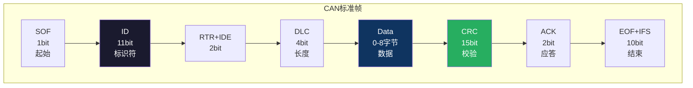
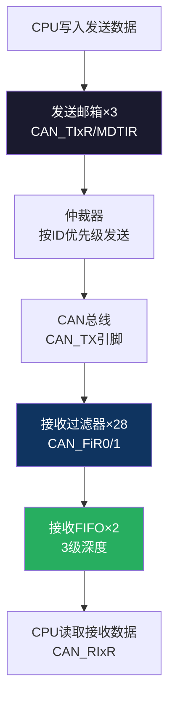

# 【元婴·113】CAN总线：车规嵌入式通信

> **码农修仙传 · 元婴期 · 第113篇**
> 我是玄芯散人，带你从炼气修到大乘。

---

## 境界标识

```
╔══════════════════════════════════╗
║     元婴期 · 第113篇             ║
║     CAN总线                      ║
║     车规嵌入式通信                ║
║     预计阅读：12分钟              ║
╚══════════════════════════════════╝
```

---

## 修仙引入

UART和SPI和I2C三条板级总线你已经走过了。它们有个共同特点：单板内通信，距离短，干扰小。

但汽车里有上百个ECU（电子控制单元），发动机和变速箱和ABS和仪表盘之间要互相通信。车内的电磁环境极其恶劣，火花塞点火瞬间能产生几十伏的干扰脉冲。UART那根TX线在这种环境下连一帧数据都传不完就会被噪声淹没。

CAN总线就是为这种恶劣环境而生的。它用两根差分线（CAN_H和CAN_L），靠电压差传信号，抗干扰能力远超单端信号。它还有一套精妙的仲裁机制：多个节点同时发送时，优先级高的自动胜出，不丢数据也不冲突。

今天拆开CAN总线的协议帧和仲裁机制和STM32的bxCAN控制器，以及车载诊断协议OBD-II和UDS。

---

## 硬核主体

### CAN总线是什么

CAN（Controller Area Network）是1986年Bosch公司发明的串行总线协议，专为汽车设计，后来扩展到工业自动化和医疗设备。

它的物理层是差分信号：CAN_H和CAN_L两根线，显性电平（逻辑0）时CAN_H约3.5V，CAN_L约1.5V，差值约2V。隐性电平（逻辑1）时两根线都是2.5V，差值约0V。噪声同时耦合到两根线上，差值不变，所以抗干扰。

总线速率和距离成反比：1Mbps时最长40米，125kbps时可以传500米。汽车里通常用500kbps。

### CAN帧结构

一个标准CAN数据帧包含这些段：



几个要点：
- ID是11位（标准帧），扩展帧ID是29位。ID不只是地址，更是优先级
- 数据长度0到8字节，CAN FD扩展到64字节
- CRC是15位循环冗余校验，发送端算，接收端验
- ACK段：接收节点在正确收到数据后会发一个显性位应答

### 仲裁机制：ID越小优先级越高

CAN最精妙的设计是"非破坏性位仲裁"。

当两个节点同时开始发送时，它们逐位比较ID。每个节点在发送ID的某一位后，会读总线电平。如果自己发的是1（隐性）但读到的是0（显性），说明有更高优先级的节点在发送，自己就退出。

```c
// 节点A发送 ID=0x123
// 节点B发送 ID=0x100
// 逐位比较：
// bit10: A=0, B=0  → 继续
// bit9:  A=1, B=0  → B发0(显性)，A读到0但自己发1(隐性)，A输了
// B继续发送，A转为接收
```

ID值越小，优先级越高。这不是靠软件判断的，是硬件物理层自动完成的。仲裁只在ID段发生，仲裁结束后总线归胜出节点独占，不会丢数据。

### STM32 bxCAN控制器

STM32F4自带两个bxCAN控制器（CAN1和CAN2）。bxCAN是"Basic Extended CAN"的缩写，支持CAN 2.0A和B标准。

bxCAN的结构：



发送端有3个邮箱，CPU写进去后硬件自动仲裁发送。接收端有28组过滤器，先过滤再存入FIFO（2个FIFO，每个3级深度），CPU从FIFO读数据。

### 过滤器：列表模式 vs 掩码模式

28组过滤器有两种工作模式：

列表模式：只接收完全匹配指定ID的帧。每组过滤器可以配2个ID。适合只关心特定几个ID的场景。

```c
// 列表模式：只接收ID=0x123和ID=0x456
CAN_FilterInitTypeDef filter;
filter.FilterIdHigh = 0x123 << 5;     // ID1
filter.FilterMaskIdHigh = 0x456 << 5; // ID2（列表模式下Mask位当ID2用）
filter.FilterMode = CAN_FILTERMODE_IDLIST;
```

掩码模式：只匹配ID的某些位，其他位不关心。适合接收一组连续ID的场景。

```c
// 掩码模式：接收ID高8位=0x10的所有帧（0x100-0x1FF）
CAN_FilterInitTypeDef filter;
filter.FilterIdHigh = 0x100 << 5;       // 参考ID
filter.FilterMaskIdHigh = 0xFF00 << 5;   // 掩码：高8位必须匹配
filter.FilterMode = CAN_FILTERMODE_IDMASK;
```

大多数项目用掩码模式，因为只需要关心特定范围的消息ID。

### 车载应用：OBD-II和UDS

CAN总线在汽车里最典型的应用是诊断通信。

OBD-II（On-Board Diagnostics II）是排放相关的诊断标准。它定义了请求和响应的消息格式：

```c
// 读取发动机转速
// 请求：ID=0x7DF, Data=[02 01 0C 00 00 00 00 00]
// 响应：ID=0x7E8, Data=[04 41 0C 1A F0 00 00 00]
//                            ↑  ↑  ↑  ↑
//                           响应 模式 PID 数据(0x1AF0=6880, A*256+B=6880, rpm=6880/4=1720rpm)
```

UDS（Unified Diagnostic Services，ISO 14229）是更全功能的诊断协议，支持读写存储和刷ECU固件和控制执行器等。它也是基于CAN传输的。

汽车里不同功能的CAN网络速度不同：
- 动力域CAN：500kbps（发动机、变速箱）
- 舒适域CAN：125kbps（车窗、座椅）
- 诊断CAN：500kbps（OBD接口）

### 实战：STM32 CAN收发数据

```c
// 发送一帧数据
CAN_TxHeaderTypeDef tx_header;
uint8_t tx_data[8] = {0x02, 0x01, 0x0C, 0, 0, 0, 0, 0};
uint32_t tx_mailbox;

tx_header.StdId = 0x7DF;       // 功能寻址（广播）
tx_header.ExtId = 0;
tx_header.RTR = CAN_RTR_DATA;
tx_header.IDE = CAN_ID_STD;
tx_header.DLC = 8;
tx_header.TransmitGlobalTime = 0;

HAL_CAN_AddTxMessage(&hcan1, &tx_header, tx_data, &tx_mailbox);

// 接收回调
void HAL_CAN_RxFifo0MsgPendingCallback(CAN_HandleTypeDef *hcan)
{
    CAN_RxHeaderTypeDef rx_header;
    uint8_t rx_data[8];
    HAL_CAN_GetRxMessage(hcan, CAN_RX_FIFO0, &rx_header, rx_data);
    // rx_header.StdId 是发送方ID
    // rx_data[0..7] 是数据
}
```

---

## 修仙术语对照表

| 修仙术语 | 技术现实 | 本篇位置 |
|----------|---------|---------|
| 双灵脉 | CAN_H和CAN_L差分线 | 物理层 |
| 显性压制 | 显性(0)覆盖隐性(1) | 仲裁机制 |
| 身份比拼 | ID仲裁，值小者胜 | 仲裁机制 |
| 驿站信箱 | 发送邮箱×3 | bxCAN |
| 关卡守卫 | 过滤器28组 | 过滤器 |
| 候客队列 | 接收FIFO×2 | bxCAN |
| 点名册 | 列表模式过滤ID | 过滤器 |
| 通缉画像 | 掩码模式过滤ID | 过滤器 |
| 天机查问 | OBD-II诊断请求 | 车载应用 |
| 御旨密令 | UDS诊断服务 | 车载应用 |

---

## 进阶条件

会用CAN总线做车载通信之间，差这几条：

- [ ] 能画出CAN标准帧的段结构（SOF/ID/RTR/DLC/Data/CRC/ACK/EOF）
- [ ] 能解释"非破坏性位仲裁"为什么ID小优先级高
- [ ] 知道bxCAN有3个发送邮箱和2个接收FIFO
- [ ] 能配置过滤器（列表模式和掩码模式各会一种）
- [ ] 能用STM32发送和接收一帧CAN数据
- [ ] 知道OBD-II的请求响应消息格式（0x7DF请求，0x7E8响应）
- [ ] 能区分CAN标准帧（11位ID）和扩展帧（29位ID）

> 最后一条是元婴期的分水岭。CAN不只是发数据，它的仲裁机制和过滤器设计体现了硬件级的通信哲学。

---

## 下期预告 + 互动

> 下一篇：【元婴·114】SD卡和FatFS文件系统：数据持久化
>
> 嵌入式系统怎么存大量数据？SPI Flash容量太小，SD卡是首选。
> 下篇讲SDIO接口和FatFS文件系统移植和文件读写。

现在问你：

> 🔍 你做过CAN总线相关的项目吗？汽车电子还是工业控制？
>
> 📡 CAN的仲裁机制你觉得设计得精妙吗？有没有更好的方案？
>
> 评论区聊聊你跟CAN总线打交道的经历。

> 我是玄芯散人，带你从炼气修到大乘。

---

*本文是「码农修仙传」系列第113篇。系列导航见 [xren.ren](https://xren.ren)*
