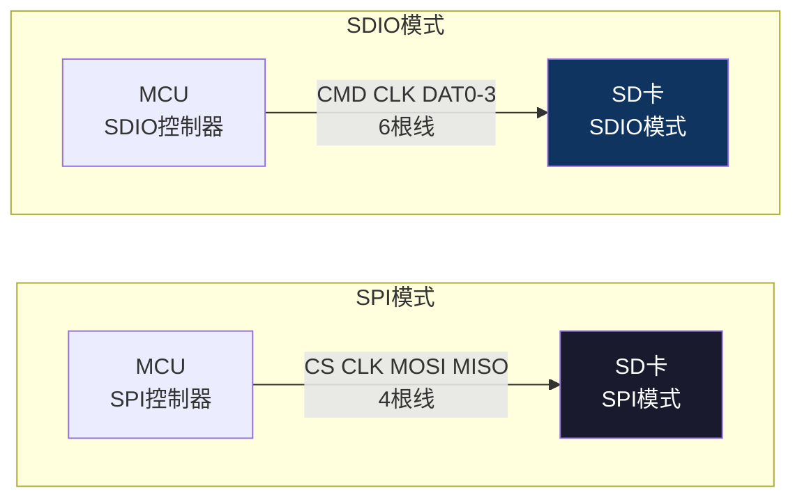
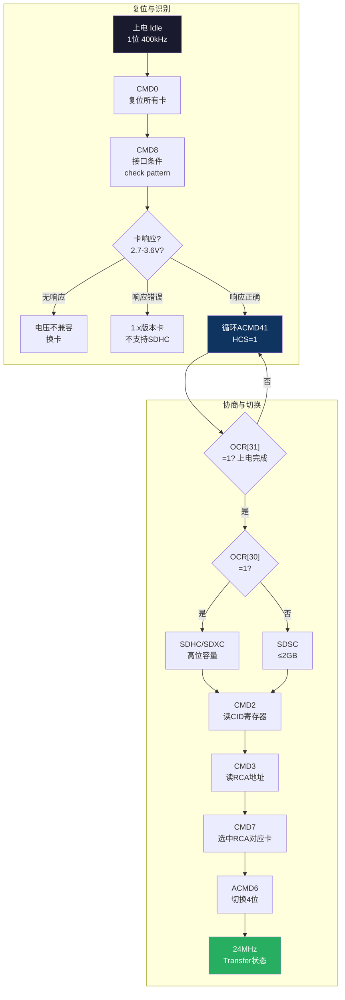
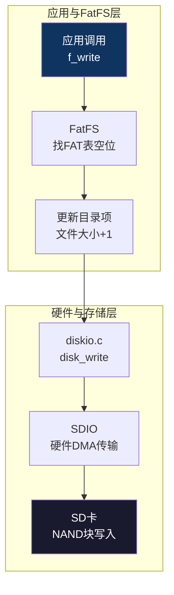

# 【元婴·114】SD卡和FatFS文件系统：数据持久化

> **码农修仙传 · 元婴期 · 第114篇**
> 我是玄芯散人，带你从炼气修到大乘。

---

## 境界标识

```
╔══════════════════════════════════╗
║     元婴期 · 第114篇             ║
║     SD卡和FatFS文件系统           ║
║     数据持久化                    ║
║     预计阅读：15分钟              ║
╚══════════════════════════════════╝
```

---

## 修仙引入

112篇Bootloader里讲过Flash擦写，擦一个扇区要几百毫秒，写之前还要先擦除。Flash适合存配置和少量日志，但数据采集器要存几百万条传感器记录，行车记录仪要连续存几个小时视频，仪器仪表要导出CSV给上位机做后处理。这种GB级数据Flash扛不住。

这时候你需要SD卡。一张标准SD卡容量涵盖几GB到几百GB，价格区间十几块到几十块，接口标准化，从Arduino到Linux都认。SD卡内部控制器帮你做了磨损均衡和坏块管理，对外呈现一个线性的块设备接口。

但光有块设备还不够。块设备只能按扇区读写，你写一个日志文件想追加一行，得管扇区空不空，管文件多大，还得记录当前写到哪。文件系统帮你管这些事。嵌入式领域最常用的就是FatFS，一款轻量级FAT文件系统，专为小资源MCU设计。

今天拆开SD卡的SDIO接口模式和SD卡初始化命令流程。讲FatFS移植方法和文件操作API，最后给一个嵌入式落地的日志存储方案。

---

## 硬核主体

### SD卡的两种接口模式

SD卡规范定义了两种接口模式，让SD卡既能接MCU也能接MPU。

SPI模式：复用105篇讲的SPI总线，只需要CS/CLK/MOSI/MISO四根线。低速（通常几十MHz），适合资源紧张的MCU和Arduino这种入门用法。

SDIO模式：SD卡专用接口。1位模式下用CMD/CLK/DAT0三根线，4位模式下加DAT1/DAT2/DAT3共6根线。SDIO时钟最高50MHz，4位并行下理论带宽200Mbps，是SPI模式的8倍以上。STM32F4系列自带SDIO控制器，硬件处理命令和数据的收发，CPU只在传输完成时收到中断通知。



两种模式不兼容。SD卡上电默认进入SDIO模式，如果要切到SPI模式需要在CMD0复位后发送特定命令。所以设计硬件时要先决定用哪种模式。MCU高端产品优先选SDIO，8倍带宽差距在视频和大数据量记录场合拉开明显。

### STM32 SDIO寄存器

STM32F4的SDIO控制器有一组寄存器配置命令和数据传输。最重要的几个：

```c
// 时钟配置：STM32F4的PCLK2 = 84MHz
// 公式：SDIO_CLK = PCLK2 / (CLKDIV + 2)
// 84MHz / (1 + 2) = 28MHz → 接近SD卡数据模式最高24MHz速率
// STM32F1的PCLK2=48MHz时，CLKDIV=0直接对应24MHz
// 注：不同STM32系列SDIO_CLKCR位域略有差异，建议用HAL宏：
// SDIO->CLKCR = SDIO_CLKCR_CLKDIV | SDIO_CLKCR_HWFC_EN |
//               SDIO_CLKCR_NEGEDGE | SDIO_CLKCR_CLKEN;
SDIO->CLKCR = (1 << 0)   |  // CLKDIV = 1 → 28MHz（F4 PCLK2=84MHz下）
              (1 << 8)   |  // HWFC_EN = 1 硬件流控
              (1 << 9)   |  // NEGEDGE = 1 下降沿采样
              (0 << 11)  |  // WIDBUS = 00 1位模式（初始化阶段）
              (0 << 13)  |  // BYPASS = 0 不旁路
              (1 << 14);   // CLKEN = 1 使能时钟（F4位14）
```

命令寄存器：SDIO_CMD放命令索引和命令类型（普通/挂起/中止）。SDIO_ARGR放32位参数。SDIO_RESPx是4个32位的响应寄存器，因为SD命令的响应长度可以是48位（6字节）、136位（CID/CSD寄存器）或R1b（带忙信号）。

数据寄存器：SDIO_DTIMER是数据超时计时器，SDIO_DLEN是数据长度（字节），SDIO_DCTRL是数据控制（含块大小和传输方向）。SDIO_STA是状态寄存器，标志传输完成、错误等。SDIO_MASK屏蔽不关心的中断，SDIO_ICR清状态位。

```c
// 发送CMD0复位卡（命令索引0，参数0，无响应）
SDIO->CMD = 0;                      // CMD索引=0
SDIO->ARGR = 0;                     // 参数=0
SDIO->CMD |= (0 << 0)  |  // WAITRESP=00 无响应（CMD0是广播命令无应答）
             (0 << 6)  |  // CPSMEN=0（稍后软件置位启动）
             (1 << 7);    // WAITPEND=0
SDIO->ARG = 0;  // 参数 = 0
SDIO->CMD = (SDIO_CMD_CPSMEN | 0);  // 启动发送，命令索引0
```

初始化阶段用1位模式时钟400kHz（识别模式），识别成功后切到4位模式时钟24MHz（数据模式）。

### SD卡初始化流程

SD卡上电后处于Idle状态，要发送一串命令才能进入Transfer状态准备读写。这串命令的顺序是SD协议规定的，不能乱：



ACMD41特殊：它是Application-Specific Command，前缀CMD55。完整序列是CMD55（告诉卡下一条是ACMD）+ ACMD41（电压协商+容量协商）。

ACMD41的参数HCS位（bit 30）=1表示主机支持SDHC/SDXC大容量卡。卡响应OCR寄存器，bit 31=1表示上电完成，bit 30=1表示自己是大容量卡。如果卡一直返回bit 31=0，说明它在内部RC振荡器校准，需要循环重试（通常需要几百毫秒到几秒）。

```c
// 初始化序列核心代码（基于HAL库）
uint8_t SD_Init(void) {
    uint8_t cmd[] = {0x40, 0x00, 0x00, 0x00, 0x00, 0x95}; // CMD0带CRC
    SD_CS_Select();
    SD_Transmit(cmd, 6);  // CMD0复位
    Delay(10);

    // CMD8: 检查协议版本
    uint8_t cmd8[] = {0x48, 0x00, 0x00, 0x01, 0xAA, 0x87};
    SD_Transmit(cmd8, 6);
    uint8_t resp[5];
    SD_Receive(resp, 5);
    // resp[3]应该是0x01, resp[4]应该是0xAA

    // ACMD41循环等待就绪
    for (int i = 0; i < 1000; i++) {
        uint8_t cmd55[] = {0x77, 0x00, 0x00, 0x00, 0x00, 0xFF};
        SD_Transmit(cmd55, 6);  // CMD55前缀

        uint8_t acmd41[] = {0x69, 0x40, 0x00, 0x00, 0x00, 0xFF};
        SD_Transmit(acmd41, 6);  // ACMD41 HCS=1

        SD_Receive(resp, 5);
        if (resp[0] & 0x80) break;  // OCR[31]=1 上电完成
        Delay(10);
    }
    // ... 后续CMD2/CMD3/CMD7/ACMD6
    SD_CS_Deselect();
    return 0;
}
```

CMD2读CID（128位卡身份寄存器），CMD3让卡自己生成一个16位相对地址RCA，CMD7选中这张卡进入Transfer状态。ACMD6切换4位总线宽度。整条链路跑通才能开始读写。

### FatFS文件系统移植

FatFS是ChaN写的轻量级FAT/exFAT文件系统，源代码开源，资源占用小（RAM几KB即可），支持FAT12/16/32和exFAT。

移植FatFS需要做两件事：在ffconf.h里配置功能开关，写diskio.c里的底层驱动。

ffconf.h几个核心配置项：

```c
#define FF_FS_READONLY    0   // 0=读写, 1=只读
#define FF_FS_MINIMIZE    0   // 0=全功能, 1=FF_MINIMIZE=去除高级API
#define FF_USE_MKFS       1   // 1=支持f_mkfs格式化
#define FF_USE_FIND       0   // 0=不用目录扫描（节省资源）
#define FF_MAX_SS         512 // 扇区大小（SD卡固定512字节）
#define FF_MIN_SS         512
#define FF_MAX_LFN        255 // 长文件名支持
#define FF_USE_LFN        2   // 2=启用长文件名，缓冲区在堆
#define FF_FS_TINY        0   // 0=每个文件独立buffer
#define FF_VOLUMES        1   // 挂载卷数量
#define FF_STR_VOLUME_ID  "SD"
```

diskio.c是FatFS和物理驱动之间的适配层。需要实现6个函数：

```c
// 1. 初始化磁盘
DSTATUS disk_initialize(BYTE pdrv) {
    return SD_Init() ? STA_NOINIT : RES_OK;
}

// 2. 查询磁盘状态
DSTATUS disk_status(BYTE pdrv) {
    return RES_OK;
}

// 3. 读扇区
DRESULT disk_read(BYTE pdrv, BYTE *buff, LBA_t sector, UINT count) {
    if (HAL_SD_ReadBlocks(&hsd, buff, sector, count, 5000) != HAL_OK)
        return RES_ERROR;
    while (HAL_SD_GetState(&hsd) != HAL_SD_STATE_READY) {}  // 等待传输完成
    return RES_OK;
}

// 4. 写扇区
DRESULT disk_write(BYTE pdrv, const BYTE *buff, LBA_t sector, UINT count) {
    if (HAL_SD_WriteBlocks(&hsd, buff, sector, count, 5000) != HAL_OK)
        return RES_ERROR;
    while (HAL_SD_GetState(&hsd) != HAL_SD_STATE_READY) {}  // 等待传输完成
    return RES_OK;
}

// 5. IO控制（查询扇区大小、擦除块等）
DRESULT disk_ioctl(BYTE pdrv, BYTE cmd, void *buff) {
    switch (cmd) {
        case CTRL_SYNC:        // 同步（让cache写回）
            return RES_OK;
        case GET_SECTOR_COUNT: // 扇区数
            *(DWORD*)buff = hsd.SdCard.BlockNbr;
            return RES_OK;
        case GET_SECTOR_SIZE:  // 扇区大小（FAT固定512）
            *(WORD*)buff = 512;
            return RES_OK;
        case GET_BLOCK_SIZE:   // 擦除块大小
            *(DWORD*)buff = hsd.SdCard.BlockSize / 512;
            return RES_OK;
    }
    return RES_PARERR;
}

// 6. 获取当前时间（FatFS写文件时调用）
DWORD get_fattime(void) {
    RTC_TimeTypeDef sTime;
    RTC_DateTypeDef sDate;
    HAL_RTC_GetTime(&hrtc, &sTime, RTC_FORMAT_BIN);
    HAL_RTC_GetDate(&hrtc, &sDate, RTC_FORMAT_BIN);
    return ((2000 + sDate.Year - 1980) << 25) |  // 年份FAT基准是1980
           (sDate.Month << 21) |
           (sDate.Date << 16) |
           (sTime.Hours << 11) |
           (sTime.Minutes << 5) |
           (sTime.Seconds / 2);  // 秒/2（FAT时间戳精度2秒）
}
```

disk_read和disk_write里的while循环不能省。HAL_SD_ReadBlocks返回HAL_OK只表示请求被提交，实际传输由DMA完成，CPU必须等到HAL_SD_STATE_READY才能读写buff，否则会拿到旧数据或半截数据。

### FatFS文件操作API

FatFS的API分两层。底层API用前缀`f_`，操作FIL/FDIR结构体；高级API用前缀`f_`操作路径但需要挂载。

```c
// 1. 挂载文件系统
FATFS fs;
FRESULT res = f_mount(&fs, "0:", 1);  // 立即挂载（1=force mount）
if (res != FR_OK) {
    // 首次插入未格式化卡，需要格式化
    BYTE work[FF_MAX_SS];
    res = f_mkfs("0:", FM_FAT, 0, work, sizeof(work));
    f_mount(&fs, "0:", 1);
}

// 2. 打开文件
FIL fil;
res = f_open(&fil, "0:log.txt", FA_WRITE | FA_OPEN_ALWAYS);
if (res != FR_OK) { /* 错误处理 */ }

// 3. 写文件
UINT bw;
f_write(&fil, "Hello, SD card!\n", 16, &bw);
f_write(&fil, "Line 2\n", 7, &bw);

// 4. 读文件（定位+读）
f_rewind(&fil);
char buf[64];
UINT br;
f_read(&fil, buf, sizeof(buf), &br);

// 5. 关闭（自动flush）
f_close(&fil);

// 6. 卸载（确保所有buffer写回）
f_mount(NULL, "0:", 0);
```

`FA_OPEN_ALWAYS`表示文件不存在就创建。FA_WRITE表示可写。FA_READ加|FA_WRITE同时支持读写。



每次写操作不一定立即触发物理写。FatFS内部有扇区buffer，写满512字节才真正调用disk_write。要保证数据立即落盘，在关键点（比如掉电前）调`f_sync(&fil)`强制flush。

### 日志存储设计

嵌入式场合最常见的用途就是日志存储。传感器读数要写，异常事件要记，还有运行状态也要保留——这些事最后都要落到SD卡拿回去处理。

设计原则：

1. 单个日志文件不要过大，4MB到16MB一个文件，方便复制和解析
2. 文件名带序号或时间戳：`log_0001.txt`、`20260829_140530.log`
3. 环形覆盖：磁盘满时删除最旧的文件，始终保留最近N天的数据
4. 每条日志带时间戳和CRC，便于追溯

```c
// 环形日志管理器
typedef struct {
    uint32_t file_seq;        // 当前文件序号
    uint32_t file_max_size;   // 单文件最大字节
    uint32_t total_files;     // 保留文件总数
    FIL current_file;
} LogManager;

static LogManager g_log = {
    .file_seq = 1,
    .file_max_size = 4 * 1024 * 1024,  // 4MB
    .total_files = 16
};

FRESULT Log_Write(const char *fmt, ...) {
    char buf[256];
    va_list ap;
    va_start(ap, fmt);
    int len = vsnprintf(buf, sizeof(buf), fmt, ap);
    va_end(ap);

    // 检查是否需要切换文件
    if (f_size(&g_log.current_file) >= g_log.file_max_size) {
        f_close(&g_log.current_file);
        g_log.file_seq++;
        // 检查是否需要环形覆盖
        if (g_log.file_seq > g_log.total_files) {
            char old_name[32];
            sprintf(old_name, "0:log_%04u.txt", g_log.file_seq - g_log.total_files);
            f_unlink(old_name);  // 删除最旧文件
        }
        char new_name[32];
        sprintf(new_name, "0:log_%04u.txt", g_log.file_seq);
        f_open(&g_log.current_file, new_name, FA_WRITE | FA_CREATE_NEW);
    }

    // 写入时间戳+日志
    DWORD timestamp = get_fattime();
    char line[300];
    int line_len = snprintf(line, sizeof(line), "[%08X] %s\n", timestamp, buf);
    UINT bw;
    f_write(&g_log.current_file, line, line_len, &bw);
    f_sync(&g_log.current_file);  // 每条都flush（牺牲速度换可靠性）
    return FR_OK;
}
```

掉电保护是日志系统最容易踩坑的地方。SD卡内部有自己的cache和磨损均衡策略，但断电时正在写的扇区可能损坏。要么在每次写入后`f_sync`，要么用双扇区A/B备份方案。

写入性能：连续写入速度受SD卡品质影响，Class 10卡10MB/s以上，UHS-I U3卡30MB/s以上。但FatFS的文件API有额外开销（FAT表更新、目录更新），实际业务写入速度比裸块写入慢20%。

读出性能：FatFS有目录遍历API`f_opendir`/`f_readdir`，可以列出所有日志文件。批量读取时一次读一个扇区（512字节）效率最高，不要一次读1字节。

---

## 修仙术语对照表

| 修仙术语 | 技术现实 | 本篇位置 |
|----------|---------|---------|
| 储物袋 | SD卡大容量存储 | 引入 |
| 灵脉双轨 | SDIO 4位并行数据线 | 接口模式 |
| 令牌信物 | SDIO命令和响应寄存器 | SDIO寄存器 |
| 入门心法口诀 | CMD0/CMD8/ACMD41等初始化命令 | 初始化流程 |
| 灵根资质校验 | HCS位检测SDHC支持 | 初始化流程 |
| 收纳符箓 | FAT文件系统 | FatFS移植 |
| 灵兽袋契约 | f_mount挂载卷 | FatFS API |
| 卷轴开合 | f_open/f_close文件句柄 | FatFS API |
| 笔墨书文 | f_write写入 | FatFS API |
| 卷轴复读 | f_read读出 | FatFS API |
| 强制定魂 | f_sync落盘 | 日志设计 |
| 时辰戳 | 时间戳FAT格式 | 日志设计 |
| 轮回覆盖 | 环形日志删除旧文件 | 日志设计 |
| 灵兽袋收纳术 | diskio.c适配层 | FatFS移植 |
| 灵脉共振 | SDIO 24MHz时钟同步 | SDIO寄存器 |

---

## 进阶条件

会用SD卡和FatFS做数据持久化之前，差这几条：

- [ ] 能区分SD卡的SPI模式和SDIO模式，知道两者在总线宽度、时钟频率上的差异，以及各自的适用场合
- [ ] 能画出SD卡初始化的命令顺序（CMD0→CMD8→ACMD41→CMD2→CMD3→CMD7）
- [ ] 知道ACMD41是应用特定命令需要CMD55前缀
- [ ] 能配置STM32 SDIO时钟分频（掌握CLKDIV计算公式并理解F1/F4的PCLK2差异）
- [ ] 能写出diskio.c的6个接口函数（init/status/read/write/ioctl/get_fattime）
- [ ] 能用f_open/f_write/f_read/f_close完成一次文件读写
- [ ] 知道为什么要调f_sync强制落盘（掉电保护）
- [ ] 能设计环形日志管理器（含多文件+序号+自动覆盖）

> 最后一条是元婴期的分水岭。SDIO和FatFS本身是工具，能设计出可靠的数据持久化方案才叫本事。

---

## 下期预告 + 互动

> 下一篇：【元婴·115】以太网和LWIP：嵌入式联网
>
> SD卡解决了本地大容量存储，但设备要联网怎么办？
> 下篇讲以太网控制器（W5500/LAN8720）和LWIP协议栈移植，再讲TCP/UDP通信和嵌入式HTTP服务器。

现在问你：

> 💾 你做的项目里SD卡用在哪？行车记录仪、数据采集器还是别的？

> 🔄 日志系统的可靠性你怎么保证？掉电保护有没有踩过坑？

> 评论区聊聊你的数据持久化方案。

> 我是玄芯散人，带你从炼气修到大乘。

---

*本文是「码农修仙传」系列第114篇。系列导航见 [xren.ren](https://xren.ren)*
