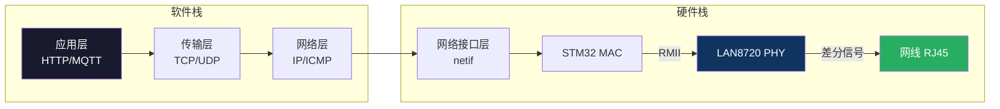
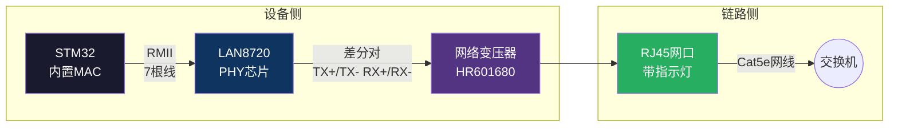
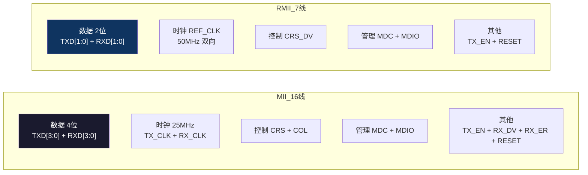
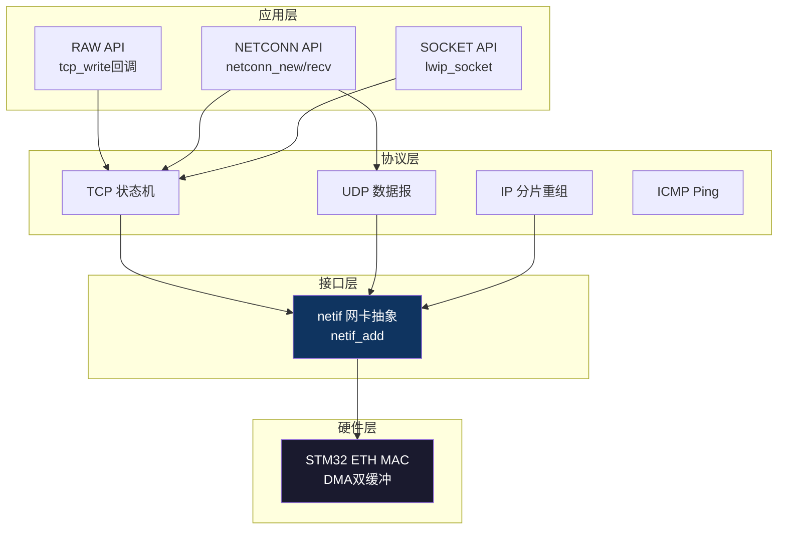

# 【元婴·115】以太网和LWIP：嵌入式联网

> **码农修仙传 · 元婴期 · 第115篇**
> 我是玄芯散人，带你从炼气修到大乘。

---

## 境界标识

```
╔══════════════════════════════════╗
║     元婴期 · 第115篇            ║
║     以太网和LWIP：嵌入式联网    ║
║     MAC + PHY + RMII + LWIP     ║
║     预计阅读：25分钟            ║
╚══════════════════════════════════╝
```

---

## 修仙引入

114篇讲过SD卡能把数据存起来，可数据怎么飞回山门供师傅查看？设备孤岛困在洞府里，连不上互联网就和瞎子聋子没两样。

修真界里把这一关叫「架设跨界传送阵」。传送阵分两层：底层是MAC和PHY之间的物理链路，决定数据怎么变成电信号在线缆里跑；上层是TCP/IP协议栈，决定数据怎么拆包重组、怎么找到对方。

084篇金丹修士练过socket七步法力，那是「跨洞府通信」的法术口诀。这一篇把目光落到硬件层，看STM32内置MAC怎么通过RMII接口和LAN8720 PHY芯片握手，看LWIP协议栈怎么在裸机上跑起来。最后搭一个嵌入式HTTP服务器，让浏览器能直接访问设备。



层级分明、各司其职，这就是嵌入式联网的全景。

---

## 硬核主体

### 嵌入式以太网结构：MAC + PHY + 变压器

STM32F4/F7/H7系列内置以太网MAC（媒体访问控制器），但只有MAC不够。MAC负责把数据封装成以太网帧，但它输出的数字信号不能直接上网线。要让信号在双绞线里跑得动、抗得住干扰，还需要PHY（物理层收发器）来完成物理层的转换工作：把并行数据转成串行比特流，再做曼彻斯特编码，最后从时钟里恢复同步。

PHY再外接一个网络变压器（也称隔离变压器），位于PHY芯片和RJ45网口之间。变压器的用途是电气隔离：1000V以上的雷击浪涌会先打到变压器的隔离栅上，保护PHY和后端的MCU不会被烧穿。



LAN8720是SMSC（后被Microchip收购）出品的百兆以太网PHY，RMII接口，支持Auto-MDIX自动翻转（直连网线/交叉网线都能通），外接25MHz晶振但通过内部PLL倍频到REF_CLK 50MHz供给MAC。

W5500是另一种思路：芯片内部集成了MAC+PHY+TCP/IP协议栈+Socket，对外只暴露SPI接口。MCU通过SPI发几条命令就能建立TCP连接，不需要跑协议栈。代价是价格高（一片W5500约15元，LAN8720只要3元），并发连接数有限（最多8个Socket）。

选型原则看场合。实时控制场景，数据量小且对成本敏感，选W5500合适，少写代码少占RAM。另一种情况，需要跑HTTP服务器、想用MQTT客户端连云端，还要支持复杂路由，这种场合只能选LAN8720配LWIP，灵活是灵活，得自己写移植代码。

### RMII接口：精打细算的引脚方案

MAC和PHY之间需要传输：
- 数据线（TX/RX）
- 时钟
- 载波侦听CRS和冲突检测COL（半双工用）
- 管理接口MDC/MDIO（读写PHY寄存器）

MII（Media Independent Interface）接口下，数据线是4位宽，时钟25MHz（百兆速率下），整体需要16根信号线。RMII（Reduced MII）把数据线减到2位，时钟翻倍到50MHz，同样的百兆速率只需要7根信号线。



REF_CLK是双向信号：PHY和MAC之间只能有一方提供时钟。LAN8720默认从外部25MHz晶振经PLL倍频输出50MHz REF_CLK，MAC做从机接收。如果硬件设计时让MAC的MCO引脚输出50MHz给PHY（少见），则LAN8720进入从时钟模式，对应寄存器位需要配置。

RMII的2位数据线在50MHz时钟下，每个时钟周期传2位，百兆速率需要25MHz时钟域。看起来带宽一样，但物理层编码（4B/5B或MLT-3）后实际线速是100Mbps，等效字节速率12.5MB/s，嵌入式场合够用。

### LAN8720寄存器配置：自动协商

LAN8720内部有32个16位寄存器，前16个是IEEE 802.3标准寄存器（BCR/BSR/PHYID等），后16个是厂商扩展。

PHY地址由硬件引脚PHYAD[0]（即PHYAD0）决定。LAN8720的PHYAD0在RXER/PHYAD0引脚上电时采样，浮空（内部下拉）为地址0，拉高为地址1。一块板子只接一片LAN8720时默认地址0。

要操作PHY，先打交道的是BCR（Basic Control Register，地址0）：

```c
// LAN8720 BCR寄存器 位定义（地址0）
#define LAN8720_BCR_RESET        (1 << 15)  // 软件复位
#define LAN8720_BCR_LOOPBACK     (1 << 14)  // 回环测试
#define LAN8720_BCR_SPEED_SELECT (1 << 13)  // 速度选择 1=100M 0=10M
#define LAN8720_BCR_AUTONEG_EN   (1 << 12)  // 自动协商使能
#define LAN8720_BCR_POWER_DOWN   (1 << 11)  // 掉电
#define LAN8720_BCR_ISOLATE      (1 << 10)  // 隔离（断MII）
#define LAN8720_BCR_RESTART_AUTONEG (1 << 9)// 重启自动协商
#define LAN8720_BCR_DUPLEX_MODE  (1 << 8)   // 全双工 1=全双工 0=半双工

// 自动协商完成后的状态查看（BSR寄存器 地址1）
#define LAN8720_BSR_AUTONEG_COMP (1 << 5)   // 自动协商完成
#define LAN8720_BSR_LINK_STATUS  (1 << 2)   // 链路建立
```

自动协商是PHY和链路对端（通常是交换机）协商速度和双工模式的过程。链路建立后，PHY会通过REF_CLK把协商结果反馈给MAC，MAC读BSR寄存器的第2位和第3位判断当前是10M还是100M、半双工还是全双工。

读写PHY寄存器通过MDIO接口，这是2线制串行总线（时钟MDC+数据MDIO）。STM32的ETH外设自带SMI（Station Management Interface）模块，CPU直接读写寄存器：

```c
// STM32 ETH SMI接口读PHY寄存器
uint16_t ETH_ReadPHYRegister(uint16_t PHYAddr, uint16_t PHYReg) {
    // 等待MII忙标志空闲
    while (ETH->MACMIIAR & ETH_MACMIIAR_MB) {}
    
    // 构造命令：PHYAddr << 11 | (PHYReg << 6) | MII_READ
    ETH->MACMIIAR = (PHYAddr << 11) | (PHYReg << 6) | ETH_MACMIIAR_CR_MII 
                  | ETH_MACMIIAR_MB;  // 启动读
    
    // 等待读完成
    while (ETH->MACMIIAR & ETH_MACMIIAR_MB) {}
    
    return (uint16_t)(ETH->MACMIIDR & 0xFFFF);
}

// 读LAN8720的BSR（地址1）判断链路状态
uint16_t bsr = ETH_ReadPHYRegister(0x00, 0x01);
if (bsr & LAN8720_BSR_LINK_STATUS) {
    // 链路已建立，链路指示灯亮
}
```

SMI时钟MDC由HCLK分频而来，规范规定最高2.5MHz。STM32F4的HCLK一般是168MHz，ETH_MACMIIAR的CR字段只有3位（CR[2:0]，最大7）。实际MDC = HCLK / (CR+2)，即使CR=7也约18.67MHz，超过PHY规范。生产环境需要查询LAN8720数据手册，看PHY是否兼容更快的MDC，或加MDIO总线驱动能力限速。

### STM32 ETH外设：MAC硬件配置

STM32F4的ETH外设负责：
- MAC帧的封装和解封装
- CRC32校验
- 物理层管理（SMI读写PHY寄存器）
- DMA把数据搬运到内存缓冲区
- 接收帧过滤（单播/多播/广播/哈希过滤）

初始化步骤（基于HAL库简化）：

```c
// 1. 使能ETH时钟和GPIO时钟
__HAL_RCC_ETHMAC_CLK_ENABLE();      // MAC时钟
__HAL_RCC_ETHMACTX_CLK_ENABLE();    // 发送时钟
__HAL_RCC_ETHMACRX_CLK_ENABLE();    // 接收时钟
__HAL_RCC_GPIOA_CLK_ENABLE();       // PA1/PA2/PA7 引脚

// 2. 配置RMII引脚
// PA1 = ETH_REF_CLK      50MHz参考时钟输入
// PA2 = ETH_MDIO         SMI数据线
// PA7 = ETH_MII_RX_DV    RMII下作为CRS_DV
// PB11 = ETH_MII_TX_EN   发送使能
// PB12 = ETH_MII_TXD0    发送数据0
// PB13 = ETH_MII_TXD1    发送数据1
// PC1  = ETH_MDC         SMI时钟
// PC4  = ETH_MII_RX_D0   接收数据0
// PC5  = ETH_MII_RX_D1   接收数据1
// 注：RMII模式下PA0/PA3不需要，但部分板子的HAL库默认全配，按实际硬件删减
GPIO_InitTypeDef gpio = {0};
gpio.Pin = GPIO_PIN_1 | GPIO_PIN_2 | GPIO_PIN_7;  // 仅REF_CLK/MDIO/CRS_DV
gpio.Mode = GPIO_MODE_AF_PP;
gpio.Pull = GPIO_NOPULL;
gpio.Speed = GPIO_SPEED_FREQ_VERY_HIGH;
gpio.Alternate = GPIO_AF11_ETH;
HAL_GPIO_Init(GPIOA, &gpio);

// 3. 复位ETH外设
__HAL_RCC_ETHMAC_FORCE_RESET();
HAL_Delay(1);
__HAL_RCC_ETHMAC_RELEASE_RESET();

// 4. 配置MAC地址（每个设备MAC全球唯一）
uint8_t mac[6] = {0x00, 0x80, 0xE1, 0x00, 0x00, 0x01};
ETH->MACA0LR = (mac[3] << 24) | (mac[2] << 16) | (mac[1] << 8) | mac[0];
ETH->MACA0HR = (mac[5] << 8)  | (mac[4] << 0);

// 5. 配置DMA接收描述符和发送描述符（环形链表）
// HAL库中由HAL_ETH_Init内部完成

// 6. 启动MAC和DMA
ETH->MACCR |= ETH_MACCR_TE | ETH_MACCR_RE;  // 发送+接收使能
```

RMII的REF_CLK必须早于MAC启动。如果LAN8720还没稳定输出50MHz时钟，MAC已经开始接收数据，会收到大量CRC错误帧。

### LWIP协议栈：轻量级TCP/IP

LWIP（Lightweight IP）是瑞典计算机科学学院Adam Dunkels为嵌入式系统设计的开源TCP/IP协议栈，最早版本1.4.0发布于2003年，2.x版本重写了内核。STM32CubeMX默认集成LWIP 2.1.x。

LWIP有两种使用模式：
- NO_SYS模式（裸机）：没有操作系统，协议栈在一个主循环里轮询，所有TCP/IP处理都在同一个任务上下文
- OS模式（带RTOS）：协议栈跑在独立任务里，通过消息队列/信号量跟调用方通信

裸机环境下最常用NO_SYS模式。下文都基于NO_SYS讲解。

LWIP的内核结构分三层：
- 网络接口层（netif）：抽象网卡，每个网卡对应一个netif结构体
- 协议层（IP/ICMP/TCP/UDP）：实现网络层和传输层
- 应用层API有三种：RAW API基于回调函数；NETCONN API基于消息队列；SOCKET API兼容BSD socket接口



netif是LWIP和网卡之间的桥梁。LWIP定义一个netif结构体：

```c
struct netif {
    ip4_addr_t ip_addr;       // 本机IP
    ip4_addr_t netmask;       // 子网掩码
    ip4_addr_t gw;            // 网关
    uint8_t hwaddr[6];        // MAC地址
    netif_init_fn init;              // 网卡初始化回调
    netif_input_fn input;            // 链路层输入回调
    struct dhcp *dhcp;                // DHCP客户端（可选）
    // ... 更多字段
};
```

每个netif对应一块网卡，LWIP收到IP包后根据目的IP匹配netif。STM32只有一块网卡，所以只有一个netif（叫`gnetif`或`eth0`）。

### ethernetif.c移植：协议栈和硬件的粘合剂

LWIP自带一个参考移植文件`ethernetif.c`，要做三件事：

1. `low_level_init()`：初始化网卡硬件，设置MAC地址
2. `low_level_output()`：把LWIP的pbuf数据通过网卡发出去
3. `low_level_input()`：从网卡DMA读取数据，封装成pbuf交给LWIP

核心是`ethernetif_input()`，它在主循环里被反复调用，把网卡收到的帧喂给协议栈：

```c
// ethernetif.c 核心实现（基于HAL库）
static err_t low_level_output(struct netif *netif, struct pbuf *p) {
    struct pbuf *q;
    uint32_t framelength = 0;
    
    // 遍历pbuf链表，把数据复制到DMA描述符指向的缓冲区
    for (q = p; q != NULL; q = q->next) {
        memcpy((void *)(ETH_TX_BUFFER + framelength), q->payload, q->len);
        framelength += q->len;
    }
    
    // 启动DMA发送
    HAL_ETH_TransmitFrame(&heth, framelength);
    
    return ERR_OK;
}

static struct pbuf *low_level_input(struct netif *netif) {
    struct pbuf *p = NULL, *q;
    uint32_t len = 0;
    uint8_t *buffer;
    
    // 检查DMA是否收到帧
    if (HAL_ETH_GetReceivedFrame(&heth) != HAL_OK) return NULL;
    
    len = heth.RxFrameInfos.length;
    buffer = (uint8_t *)heth.RxFrameInfos.buffer;
    
    // 给LWIP分配pbuf（pbuf是LWIP自己的内存结构）
    p = pbuf_alloc(PBUF_RAW, len, PBUF_POOL);
    if (p != NULL) {
        for (q = p; q != NULL; q = q->next) {
            memcpy(q->payload, buffer, q->len);
            buffer += q->len;
            len -= q->len;
        }
    }
    
    // 释放DMA描述符，准备接收下一帧
    HAL_ETH_ReleaseReceivedFrame(&heth);
    return p;
}

void ethernetif_input(struct netif *netif) {
    struct pbuf *p;
    for (;;) {
        p = low_level_input(netif);
        if (p == NULL) break;
        netif->input(p, netif);  // 把pbuf喂给IP层
    }
}
```

主循环里这样用：

```c
int main(void) {
    HAL_Init();
    SystemClock_Config();
    MX_GPIO_Init();
    MX_ETH_Init();
    
    // LWIP初始化（NO_SYS裸机模式只能调lwip_init；tcpip_init是OS模式专用）
    lwip_init();
    
    // 配置netif（静态IP版本）
    struct ip4_addr ipaddr, netmask, gw;
    IP4_ADDR(&ipaddr, 192, 168, 1, 100);
    IP4_ADDR(&netmask, 255, 255, 255, 0);
    IP4_ADDR(&gw, 192, 168, 1, 1);
    
    netif_add(&gnetif, &ipaddr, &netmask, &gw, NULL, &ethernetif_init, &ethernet_input);
    netif_set_default(&gnetif);
    netif_set_up(&gnetif);
    
    while (1) {
        // 轮询网卡接收
        ethernetif_input(&gnetif);
        
        // 轮询LWIP定时器（ARP、TCP重传、DHCP等）
        sys_check_timeouts();
    }
}
```

`sys_check_timeouts()`是LWIP的软定时器调度入口。协议栈里几个需要周期性触发的事件，例如TCP重传计时、ARP表项老化、DHCP租约续期，都通过它推进。

### TCP echo服务器：RAW API实战

RAW API是LWIP最贴近底层的API，基于回调函数，不需要操作系统。下面是一个能跑的TCP echo服务器：

```c
#include "lwip/tcp.h"

static struct tcp_pcb *echo_pcb;

// 接收回调：收到数据时触发
static err_t echo_recv(void *arg, struct tcp_pcb *tpcb, struct pbuf *p, err_t err) {
    if (p == NULL) {
        // 客户端关闭连接
        tcp_close(tpcb);
        return ERR_OK;
    }
    
    // 把收到的数据原样回传（echo）
    tcp_write(tpcb, p->payload, p->len, TCP_WRITE_FLAG_COPY);
    
    // 立即发送（不等Nagle算法合并）
    tcp_output(tpcb);
    
    // 通知LWIP已经处理这个pbuf（释放内存）
    tcp_recved(tpcb, p->len);
    pbuf_free(p);
    
    return ERR_OK;
}

// accept回调：客户端连接到来时触发
static err_t echo_accept(void *arg, struct tcp_pcb *newpcb, err_t err) {
    // 注册接收回调
    tcp_recv(newpcb, echo_recv);
    return ERR_OK;
}

// 启动echo服务器
void echo_server_init(void) {
    echo_pcb = tcp_new();
    if (echo_pcb != NULL) {
        err_t err = tcp_bind(echo_pcb, IP_ADDR_ANY, 7);  // 端口7（echo标准端口）
        if (err == ERR_OK) {
            echo_pcb = tcp_listen(echo_pcb);
            tcp_accept(echo_pcb, echo_accept);
        }
    }
}
```

测试方法：用电脑ping设备的IP（确认链路通），然后用`telnet 192.168.1.100 7`连接，输入字符看回显。

tcp_write第三个参数TCP_WRITE_FLAG_COPY告诉LWIP把数据复制到自己的缓冲区，而不是引用调用者的内存。这样调用者可以立刻释放原数据，不用等LWIP发完。如果不设这个标志，调用者必须在数据发完前保证内存可用。

tcp_recved是流量控制的核心调用。客户端发100字节过来，服务器recv回调里处理完必须调用tcp_recved(tpcb, 100)告诉LWIP「这100字节我已经处理完了，可以接收更多」。如果忘了调，接收窗口会越来越小，最后客户端停止发送。

### UDP echo服务器

UDP没有连接概念，直接发数据报：

```c
static struct udp_pcb *udp_echo_pcb;

static void udp_echo_recv(void *arg, struct udp_pcb *upcb, struct pbuf *p,
                          const ip_addr_t *addr, u16_t port) {
    // 收到UDP数据，原IP原端口回传
    udp_sendto(upcb, p, addr, port);
    pbuf_free(p);
}

void udp_echo_init(void) {
    udp_echo_pcb = udp_new();
    udp_bind(udp_echo_pcb, IP_ADDR_ANY, 7);
    udp_recv(udp_echo_pcb, udp_echo_recv, NULL);
}
```

UDP不保证数据到达。要发出去的数据可能中途丢失，到了对端也不保证按发送顺序抵达，更没有拥塞控制机制来防止压垮接收方。优势是开销小：不需要三次握手，也不必维护连接状态，适合实时音视频这种对延迟敏感而对可靠性要求不高的场合。DNS查询和SNMP监控也常用UDP。

嵌入式场合UDP常用在：NTP时间同步；TFTP文件传输；CoAP物联网协议；Modbus UDP。

### 嵌入式HTTP服务器

LWIP自带一个mini HTTP服务器（httpd），能做静态网页托管。STM32CubeMX启用LWIP_HTTPD选项后，会自动生成httpd.c。

基本HTTP服务器只能返回预编译好的HTML。要让网页读取传感器数据，需要CGI（Common Gateway Interface）：

```c
// CGI处理函数：URL匹配时调用
const char *cgi_handler_sensor(int iIndex, int iNumParams, char *pcParam[], char *pcValue[]) {
    // 检查URL参数
    if (iIndex == 0) {
        // 假设URL是 /sensor.cgi?type=temp
        for (int i = 0; i < iNumParams; i++) {
            if (strcmp(pcParam[i], "type") == 0) {
                if (strcmp(pcValue[i], "temp") == 0) {
                    return "/temp.shtml";  // 返回温度页面
                }
                if (strcmp(pcValue[i], "humi") == 0) {
                    return "/humi.shtml";  // 返回湿度页面
                }
            }
        }
    }
    return "/index.shtml";
}

// SSI（Server Side Include）处理：动态替换页面里的标记
u16_t ssi_handler_sensor(const char *pcInsert, int iIndex, u16_t current_tag_part, u16_t *next_tag_part) {
    // 检查标记名字
    if (strcmp(pcInsert, "temp") == 0) {
        // 读取DS18B20温度
        float temp = DS18B20_ReadTemp();
        sprintf((char *)httpd_tag_buffer, "%.1f", temp);
        return strlen((char *)httpd_tag_buffer);
    }
    return 0;
}

// 在网页里写 <!--#temp-->，SSI会替换成实际温度值
```

HTTP服务器搭建完成后，浏览器输入`http://192.168.1.100/`就能访问设备，看到传感器读数、控制LED。嵌入式设备的本地化管理界面都是这样做的：嵌入式HTTP服务器 + HTML + AJAX。

性能提升：HTTP服务器默认每次请求都新建TCP连接（短连接）。浏览器加载一个页面通常需要请求多个资源（HTML+CSS+JS+图片），每个资源都要新建TCP连接。启用HTTP keep-alive可以让一个TCP连接承载多个HTTP请求，加载时间能缩短几百毫秒。

LWIP_HTTPD_USE_KEEPALIVE宏控制这个功能。

---

## 修仙术语对照表

| 修仙术语 | 技术现实 | 本篇位置 |
|----------|---------|---------|
| 跨界传送阵 | 以太网架构（MAC+PHY+变压器） | 引入 |
| 令牌信道 | RMII接口 2位数据线 | RMII |
| 心跳灵脉 | REF_CLK 50MHz参考时钟 | RMII |
| 灵根资质鉴别 | PHY自动协商 速度+双工 | LAN8720 |
| 灵兽契约之信 | MAC地址 全球唯一 | STM32 ETH |
| 令牌灵台 | SMI接口 MDC/MDIO | LAN8720 |
| 跨界盟约书 | TCP三次握手/四次挥手 | TCP |
| 灵符单投 | UDP数据报 无连接 | UDP |
| 灵物清单 | netif网络接口结构 | LWIP |
| 灵兽袋契约 | ethernetif.c移植 | 移植 |
| 灵息轮转 | LWIP sys_check_timeouts | LWIP |
| 传音符回声 | TCP echo服务器 | TCP实战 |
| 信匣灵符 | UDP回传 | UDP实战 |
| 远程灵讯殿 | 嵌入式HTTP服务器 | HTTP |
| 灵符动态术 | SSI/CGI动态网页 | HTTP |

---

## 进阶条件

会搭嵌入式以太网方案之前，差这几条：

- [ ] 能画出MAC+PHY+变压器+RJ45的硬件连接图，区分W5500和LAN8720两种方案的适用场合
- [ ] 能对比MII和RMII接口的引脚数和时钟频率差异，说出为什么嵌入式偏好RMII
- [ ] 能配置STM32 ETH外设的RMII引脚（PA1/PA2/PA7/PB11/PB12/PB13/PC1/PC4/PC5）
- [ ] 能通过SMI接口读写LAN8720的BCR/BSR寄存器，判断链路状态和协商结果
- [ ] 能解释netif在LWIP中的用途，给STM32的网卡添加一个netif
- [ ] 能写出ethernetif.c里的low_level_output和low_level_input两个函数
- [ ] 能用RAW API写一个TCP echo服务器，处理tcp_accept/tcp_recv回调
- [ ] 能用RAW API写一个UDP echo服务器，处理udp_recv回调
- [ ] 能用LWIP_HTTPD搭一个嵌入式HTTP服务器，配合SSI显示传感器数据

> 最后一条是元婴期的分水岭。硬件MAC寄存器配通、HTTP服务器能响应浏览器的请求，两端都打通才算真正修成。

---

## 下期预告 + 互动

> 下一篇：【元婴·116】RTOS入门：FreeRTOS第一课
>
> 嵌入式联网搞定了，但代码都跑在一个大循环里。多个网络任务同时在跑，传感器采集也不能落下，用户按键也得响应，这种并发场合怎么调度？
> 下篇引入RTOS（实时操作系统），讲FreeRTOS怎么把任务拆开，按优先级调度，什么时候需要上RTOS。

现在问你：

> 🌐 你做的项目里用过哪种以太网方案？W5500简单粗暴还是LAN8720+LWIP灵活机动？

> 🖥️ 给嵌入式设备搭过本地网页管理界面吗？SSI动态数据显示效果如何？

> 评论区聊聊你的嵌入式联网经验。

> 我是玄芯散人，带你从炼气修到大乘。

---

*本文是「码农修仙传」系列第115篇。系列导航见 [xren.ren](https://xren.ren)*