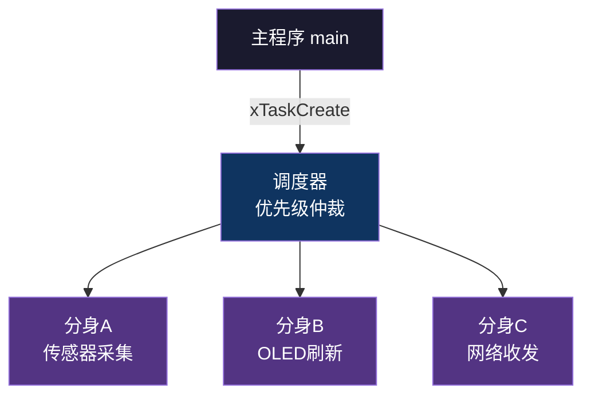
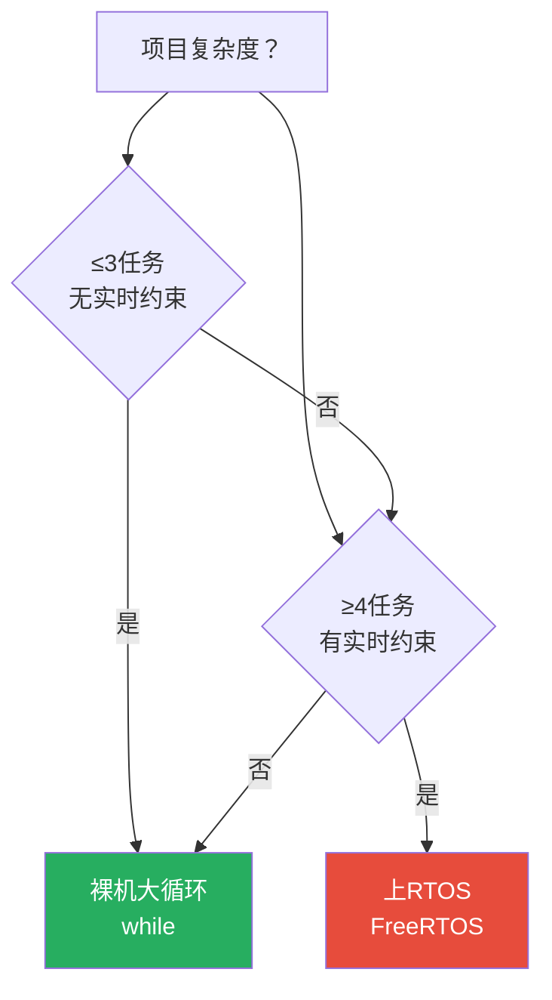
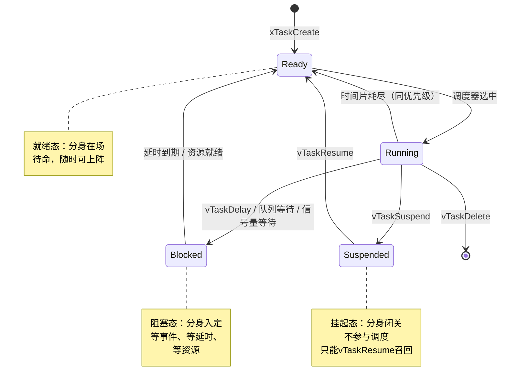
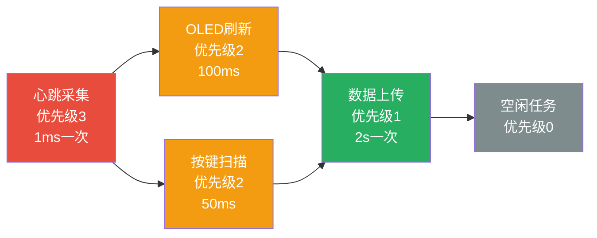

# 【元婴·116】RTOS入门：FreeRTOS第一课

> **码农修仙传 · 元婴期 · 第116篇**
> 我是玄芯散人，带你从炼气修到大乘。

---

## 境界标识

```
╔══════════════════════════════════╗
║     元婴期 · 第116篇            ║
║     RTOS入门：FreeRTOS第一课    ║
║     任务 × 优先级 × 延时          ║
║     预计阅读：22分钟            ║
╚══════════════════════════════════╝
```

---

## 修仙引入

115篇搞定了以太网联网，芯片跑着LWIP协议栈收发数据包。可洞府里的事只会越来越多：传感器采集要定时，OLED屏幕要刷新，按键要扫描，网络数据要处理，LED要按节奏闪烁。事情一多，main函数里的while(1)大循环就开始打架。

修真界管这种局面叫「万法归宗难」。一个修士同一时刻只能专心做一件事，要同时盯住多个目标，得请出「分身术」。每位分身独立运转、各有职责担当，紧急任务更会优先派给高阶分身。这套分身调度体系落到芯片上，就是RTOS（实时操作系统）干的事。

083篇金丹修士练过pthread多线程，那是修真大派给座下弟子排班的「宗门任务堂」。嵌入式这头是另一种轻量分身术。FreeRTOS占用资源小到能塞进几十KB RAM的MCU，跑在Cortex-M3这种小芯片上也有模有样。本篇把分身术的入门规矩讲清楚，主题围绕任务的创建方法、优先级怎么排、延时怎么调度这几件事。



调度器盯着所有分身，谁紧急就调度谁，闲下来的分身进休息状态。这就是嵌入式RTOS的全貌。

---

## 硬核主体

### 裸机 vs RTOS：什么时候该请出分身术

先回答最要紧的问题：项目必须上RTOS吗？不一定。元婴期见过太多案例，简单项目硬上RTOS反而添乱。

裸机大循环（Super Loop / Bare Metal）的长相：

```c
int main(void) {
    HAL_Init();                          // 硬件初始化
    SystemClock_Config();                // 时钟配置
    MX_GPIO_Init();                      // GPIO初始化
    MX_USART1_UART_Init();               // 串口初始化

    while (1) {                          // 死循环里轮询
        read_sensors();                  // 读传感器
        update_oled();                   // 刷OLED
        check_buttons();                 // 查按键
        ethernet_poll();                 // 喂网络协议栈
    }
}
```

这种结构在修真界叫「一人分饰多角」。每轮循环把每件事都做一遍，周而复始。优势是简单，可控性极强，没有任务调度带来的不确定性。中断负责处理紧急事件，主循环处理常规事务。

裸机方案的适用边界，列三种典型场景：

- 任务数 ≤ 3 个，相互之间没有复杂交互
- 每个任务的执行时间远小于周期（比如1ms能跑完的任务放在10ms循环里）
- 没有严格的实时性要求（百毫秒级别的延迟可以接受）
- 资源极少，比如ATmega328这种2KB RAM单片机

一旦超过这些边界，裸机的循环结构就开始露出破绽。经典的痛点叫任务执行时间漂移。传感器采集原本1ms能跑完，加上滤波算法后变成5ms（占用翻了五倍），整轮循环的周期被拉长，OLED刷新的频率也跟着变。

```c
// 裸机大循环的实际表现
while (1) {
    read_sensors();   // 原本1ms，加滤波后变5ms
    update_oled();    // 因为前面慢了，OLED刷新也跟着迟到
    check_buttons();  // 整个循环错位
    ethernet_poll();
}
```

RTOS入场时机也列三种：

- 任务数 ≥ 4 个，且互相之间有通信需求
- 部分任务有硬实时要求，比如电机控制回路必须1ms响应一次
- 想用阻塞等待代替轮询（任务可以sleep等事件）
- 代码规模到了几千行，模块之间需要清晰的边界

判断的口诀是：任务少且顺序固定就裸机，任务多且时间敏感就RTOS。



### FreeRTOS 任务：分身的基本结构

确认要上RTOS之后，第一个问题就是：怎么创一个任务？FreeRTOS的核心API是xTaskCreate，签名长这样：

```c
BaseType_t xTaskCreate(
    TaskFunction_t pvTaskCode,        // 任务函数（无限循环或一次性）
    const char * const pcName,        // 任务名（调试用，最长configMAX_TASK_NAME_LEN）
    const uint16_t usStackDepth,      // 栈大小，单位word（4字节），不是字节
    void * const pvParameters,        // 传给任务的参数（void*）
    UBaseType_t uxPriority,           // 优先级，0最低，configMAX_PRIORITIES-1最高
    TaskHandle_t * const pxCreatedTask // 输出参数，返回任务句柄
);                                    // 返回pdPASS成功，errCOULD_NOT_ALLOCATE_REQUIRED_MEMORY失败
```

六个参数各司其职，挨个拆。

任务函数长得像一个"永远不会返回"的C函数。任务跑完自己的活儿，必须调用vTaskDelay或vTaskDelete让出CPU，不能return。一旦return，栈被回收，下次调度进来执行野指针直接崩溃：

```c
void task_sensor(void *arg) {
    uint16_t period_ms = *(uint16_t *)arg;       // 取出参数
    for (;;) {                                    // 修真分身不退休
        read_temperature();                       // 读温度
        read_humidity();                          // 读湿度
        vTaskDelay(pdMS_TO_TICKS(period_ms));     // 睡一会儿
    }
}
```

任务名字只在调试时有用（vTaskList()打印）。不参与调度，名字写得太长会截断。

栈大小是个坑。单位是word不是字节，usStackDepth=128实际占用128乘以4等于512字节。栈不够会触发栈溢出钩子函数（configCHECK_FOR_STACK_OVERFLOW必须打开），MCU直接HardFault。经验值：复杂任务（带printf、带大数组）给256-512word，简单任务（单纯GPIO翻转）64-128word够用。

参数是void*，可以传任意类型。传多个值就把它们打包进结构体再传结构体指针。

优先级决定调度顺序。数值大的优先级高，0是最低（空闲任务就是优先级0）。同一个优先级下，多个任务轮流分时间片（默认1ms一切）。

句柄是任务的身份证。后续调用vTaskSuspend(handle)、vTaskDelete(handle)、vTaskPrioritySet(handle, new_prio)都要拿这个句柄。不需要操作可以传NULL。

实战示例，创两个不同优先级的LED任务：

```c
#include "FreeRTOS.h"
#include "task.h"

// 任务句柄
static TaskHandle_t led_red_handle;
static TaskHandle_t led_blue_handle;

// 红灯任务：500ms闪一次（用vTaskDelayUntil锁死周期）
static void task_led_red(void *arg) {
    TickType_t last = xTaskGetTickCount();
    for (;;) {
        HAL_GPIO_TogglePin(GPIOB, GPIO_PIN_0);
        vTaskDelayUntil(&last, pdMS_TO_TICKS(500));
    }
}

// 蓝灯任务：100ms闪一次（绝对延时精确锁周期）
static void task_led_blue(void *arg) {
    TickType_t last = xTaskGetTickCount();
    for (;;) {
        HAL_GPIO_TogglePin(GPIOB, GPIO_PIN_1);
        vTaskDelayUntil(&last, pdMS_TO_TICKS(100));
    }
}

int main(void) {
    HAL_Init();
    SystemClock_Config();
    MX_GPIO_Init();

    xTaskCreate(task_led_red,  "LED_RED",  128, NULL, 1, &led_red_handle);
    xTaskCreate(task_led_blue, "LED_BLUE", 128, NULL, 1, &led_blue_handle);

    vTaskStartScheduler();   // 启动调度器（不会返回）
    while (1) { /* 永远不会跑到这里 */ }
}
```

vTaskStartScheduler()是最后那脚油门。一旦调用，main函数的while循环就再也没机会跑。调度器接管CPU，按优先级和时间片轮转调度所有就绪任务。

### 任务状态机：分身的四种命运

FreeRTOS里的任务状态机比想象中细致，远不止运行/不运行两态这么粗。任务在FreeRTOS里有四种状态的精妙配合。看官方那张经典状态机：



四种状态一一定义。（Deleted可以算第五种，是任务了断后的过渡态，本篇不展开。）

Running运行态：当前正在CPU上跑的任务。整个系统同一时刻只能有一个Running任务（单核MCU）。

Ready就绪态：分身在场待命，调度器一声令下就能上场。同优先级多个Ready任务按先到先服务排队，调度器按时间片轮流切。

Blocked阻塞态：分身入定，等事件到。常见触发原因有三种：
- vTaskDelay延时到期
- xQueueReceive等队列里来数据
- xSemaphoreTake等信号量被释放

这三类阻塞都对应一个超时时间，超时了就自动回Ready。阻塞态的任务不参与调度，调度器跳过它们。

Suspended挂起态：分身闭关，谢绝一切调度。只有手动vTaskResume才能把它叫回Ready。vTaskSuspend(NULL)甚至能挂起自己。

Deleted态是任务自我了断后，TCB和栈被释放前的短暂状态。一般看不到。

实战观察：用SEGGER Ozone或STM32CubeIDE的FreeRTOS插件，能看到每个任务的当前状态、栈高水位（High Water Mark）、累计运行时间。一颗芯片跑起来后，多数时间各任务在Blocked之间切换，CPU利用率不会破50%。因为大家都在sleep等事件。

### 延时函数：vTaskDelay vs vTaskDelayUntil

最常用的阻塞调用是延时。FreeRTOS提供两个延时函数，看似相同，行为差异极大。

vTaskDelay(n)是相对延时，从现在开始睡n个tick：

```c
void task_a(void *arg) {
    for (;;) {
        do_work();
        vTaskDelay(pdMS_TO_TICKS(100));  // 睡100ms
    }
}
```

pdMS_TO_TICKS(100)是个宏，把毫秒转成tick。FreeRTOS的心跳叫configTICK_RATE_HZ，默认1000Hz也就是1tick=1ms。如果改成100Hz，1tick=10ms，pdMS_TO_TICKS(100)自动变成10个tick。用宏不直接写数字，换芯片换配置时代码不用动。

vTaskDelay的副作用：每次循环的"起点"是上一次的"苏醒时刻"加上do_work()的执行时间。do_work()跑得久了，循环周期就漂了。下图能看出区别：

```mermaid
gantt
    title vTaskDelay周期漂移示意
    dateFormat X
    axisFormat %s

    section 周期1
    do_work() :a1, 0, 30
    等待100ms :a2, 30, 100

    section 周期2
    do_work() :a3, 100, 140
    等待100ms :a4, 140, 200

    section 周期3
    do_work() :a5, 200, 250
    等待100ms :a6, 250, 200
```



任务此次下次启动点定在30ms（工作完成后），再睡100ms醒来的时刻落在130ms。实际周期变成130ms而非设定的100ms。

vTaskDelayUntil(&xLastWakeTime, n)是绝对延时，睡到xLastWakeTime + n那个时刻：

```c
void task_b(void *arg) {
    TickType_t xLastWakeTime = xTaskGetTickCount();  // 记住当前tick
    for (;;) {
        do_work();
        vTaskDelayUntil(&xLastWakeTime, pdMS_TO_TICKS(100)); // 下次醒来固定+100ms
    }
}
```

xLastWakeTime被自动更新为本次醒来的时刻。下次醒来始终是上次醒来的时刻加n，精确锁住周期。

```mermaid
gantt
    title vTaskDelayUntil精确周期
    dateFormat X
    axisFormat %s

    section 周期1（0ms起）
    do_work() :b1, 0, 30
    等到100ms :b2, 30, 100

    section 周期2（100ms起）
    do_work() :b3, 100, 140
    等到200ms :b4, 140, 200

    section 周期3（200ms起）
    do_work() :b5, 200, 250
    等到300ms :b6, 250, 300
```



工作时段不管怎么飘，整个周期锚定在固定时刻。这就是采样、协议轮询这类严格周期任务的正确姿势。

选型口诀：采样场合或者协议轮询这类对周期有严格要求的任务，用vTaskDelayUntil才靠谱；LED闪烁、按键扫描这种"有节奏但不在意漂移"的场合用vTaskDelay就够了。

### 任务优先级和调度：分身的品级

FreeRTOS的优先级是个uint32_t，范围0到configMAX_PRIORITIES-1（FreeRTOSConfig.h里改，默认5）。数值大的优先级高，0是最低（空闲任务）。

调度规则有三条：

1. 高优先级任务一旦就绪（变Ready），立刻抢占低优先级任务的CPU（抢占式调度）
2. 同优先级多个任务按时间片轮转（默认1ms一切，时间片由configTICK_RATE_HZ决定）
3. 同优先级任务按就绪队列的排队顺序轮转



优先级反转（Priority Inversion）是多任务系统的经典坑。高优先级任务H等一个低优先级任务L占用的资源，可L又被一个中优先级任务M抢占。表面上H等L，M抢了L的执行权，结果M反倒先跑完。M的优先级居然比H高，实际却先于H完成调度。这违反直觉的"高优先级先跑"。

修真界的比方：高阶弟子等低阶弟子写文书，可低阶弟子被中阶弟子叫走处理别的事，结果文书迟迟交不上。FreeRTOS的互斥信号量（Mutex）配合优先级继承（Priority Inheritance）机制能解这问题。低阶任务拿到高阶任务等待的资源时，临时把自己的优先级提到和高阶任务一样高，抢占中阶任务的CPU。这部分117篇讲信号量时展开，本篇先记住有这回事。

设计优先级的经验，列几条常见的：

- 中断处理任务（如果用）给最高优先级2-3
- 实时性强的任务（电机控制、Modbus响应）给优先级2-3
- 普通外设任务（OLED、按键）给优先级1-2
- 后台数据处理（上传、统计）给优先级1
- 空闲钩子用优先级0（系统自动占用）

用示波器接两个GPIO能直观看到：两个LED的翻转完全独立，谁也不等谁。这就是RTOS分身的"并行感"。单核CPU其实是一个时间片一个时间片切着跑，但每个任务看到的都是"好像我独占CPU"。

### FreeRTOS vs pthread：嵌入式和大派分身的区别

083篇金丹讲过pthread多线程，pthread是修真大派给座下弟子配的任务堂，FreeRTOS是嵌入式洞府的轻量分身术，场景不同。先看一个对比速查：

资源占用差异：FreeRTOS内核最小可以裁剪到4-10KB ROM、几KB RAM，适合Cortex-M0这种64KB Flash的小芯片。pthread得跑在Linux上，最小的Linux系统也得几MB资源。

优先级差异：FreeRTOS从设计第一天起就支持优先级抢占。pthread也支持优先级（pthread_attr_setschedparam），但Linux是通用操作系统，更倾向公平时间片。

同步原语差异：FreeRTOS同步工具齐备，配套队列传数据、信号量做同步这套组合拳，原生支持中断安全版本（FromISR后缀），这是pthread没有的能力。pthread的同步靠互斥锁和条件变量，需要自己包中断安全。

API命名风格：FreeRTOS坚持Free前缀（如pvPortMalloc），pthread是POSIX标准（pthread_create）。嵌入式圈FreeRTOS更顺手。

结论：嵌入式场景默认用FreeRTOS。要在嵌入式上跑Linux线程，除非芯片是高端Cortex-A（带MMU），否则没意义。FreeRTOS是元婴期的"分身术正解"。

---

## 修仙术语对照表

| 修仙术语 | 技术现实 | 本篇位置 |
|---------|---------|---------|
| 万法归宗难 | 任务增多导致大循环难以管理 | 引入 |
| 修士分身术 | FreeRTOS任务机制 | 引入 |
| 宗门任务堂 | pthread多线程模型 | 083篇 |
| 分身品级 | 任务优先级 | 优先级 |
| 分身在待命 | Ready就绪态 | 任务状态 |
| 分身入定等事 | Blocked阻塞态 | 任务状态 |
| 分身闭关谢客 | Suspended挂起态 | 任务状态 |
| 一人心无二用 | 单核MCU同时一个Running任务 | 任务状态 |
| 修真大派vs洞府 | Linux pthread vs FreeRTOS | 对比 |
| 沉睡规定时长 | vTaskDelay相对延时 | 延时 |
| 锁死周期苏醒 | vTaskDelayUntil绝对延时 | 延时 |
| 心跳滴答 | configTICK_RATE_HZ系统节拍 | 延时 |
| 栈溢出走火入魔 | configCHECK_FOR_STACK_OVERFLOW | 任务创建 |
| 优先级反转被卡 | 高优先级等低优先级资源的死局 | 优先级 |

---

## 突破条件

会FreeRTOS的基本盘之前，差这几条：

- [ ] 能说出FreeRTOS和裸机大循环各自的适用场合，列三个上RTOS的判断标准
- [ ] 能写出xTaskCreate的完整六参数调用，知道栈大小的单位是word而不是字节
- [ ] 能画出任务状态机图，区分Ready/Blocked/Suspended三种非运行态的触发条件
- [ ] 能解释vTaskDelay和vTaskDelayUntil的本质区别，给严格周期采样场景选对函数
- [ ] 能用vTaskDelayUntil写出一个500ms精确定时翻转LED的任务
- [ ] 能用示波器观察两个同优先级任务的GPIO输出，验证时间片轮转
- [ ] 能说出FreeRTOS和pthread在同步能力、API风格两个角度的差异
- [ ] 能在CubeMX里启用FreeRTOS，观察任务列表（vTaskList）里各任务的状态和栈水位

最后一条是元婴期的入门分水岭。把RTOS跑起来、把任务状态看清楚，分身术才算真正入门。

---

## 下期预告 + 互动

下一篇：【元婴·117】RTOS任务通信：队列、信号量、通知。

116篇把分身创出来了，可分身之间得传话。传感器分身采到温度，要发给OLED分身显示；按键分身检测到按下，要通知主任务处理；中断来了，要把数据递给高优先级任务。

下篇讲FreeRTOS的三大通信法器：队列（Queue）传数据，信号量（Semaphore）做同步，任务通知（Task Notification）做轻量通知。还有中断安全的FromISR系列API，这是FreeRTOS相对pthread的一大特色。

现在问你：

🥷 你做的项目里，main函数的while循环里塞了多少个轮询任务？有没有被任务执行时间漂移坑过？

⏱️ 传感器采样这种严格周期任务，你用的是vTaskDelay还是vTaskDelayUntil？用错能发现吗？

评论区聊聊你的RTOS踩坑经验。

我是玄芯散人，带你从炼气修到大乘。

---

*本文是「码农修仙传」系列第116篇。系列导航见 [xren.ren](https://xren.ren)*
