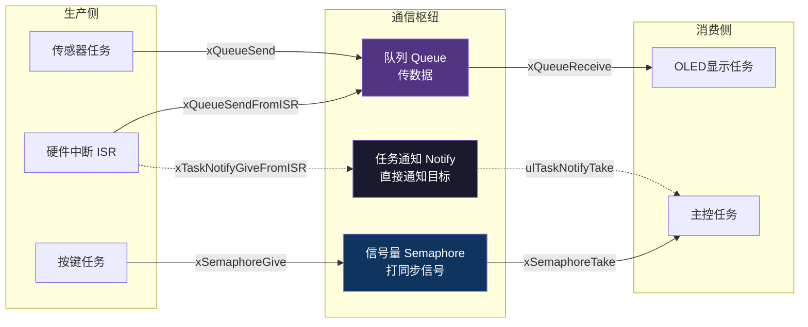
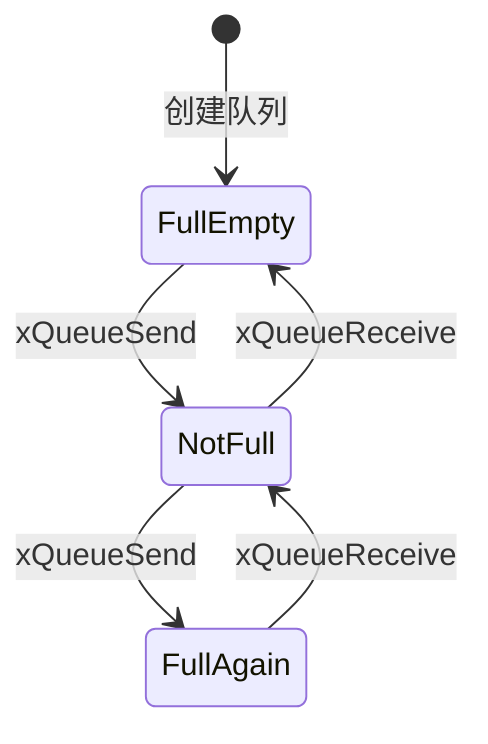
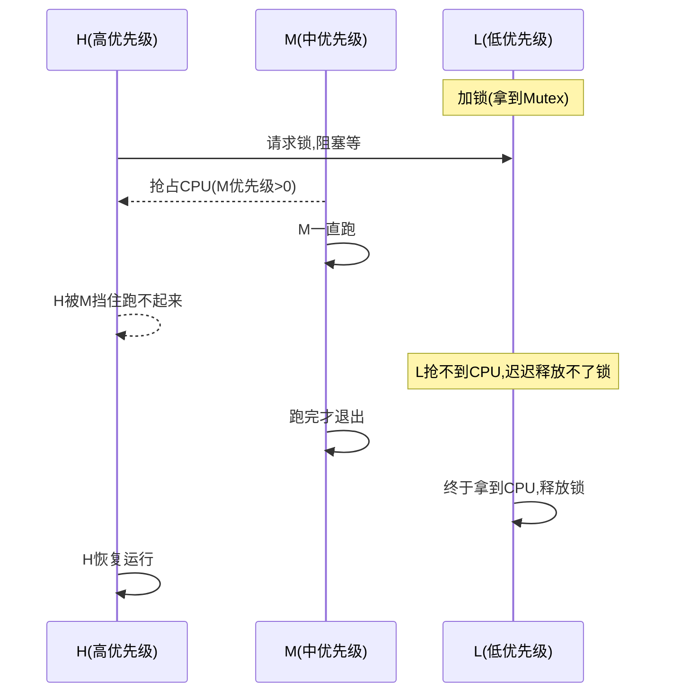
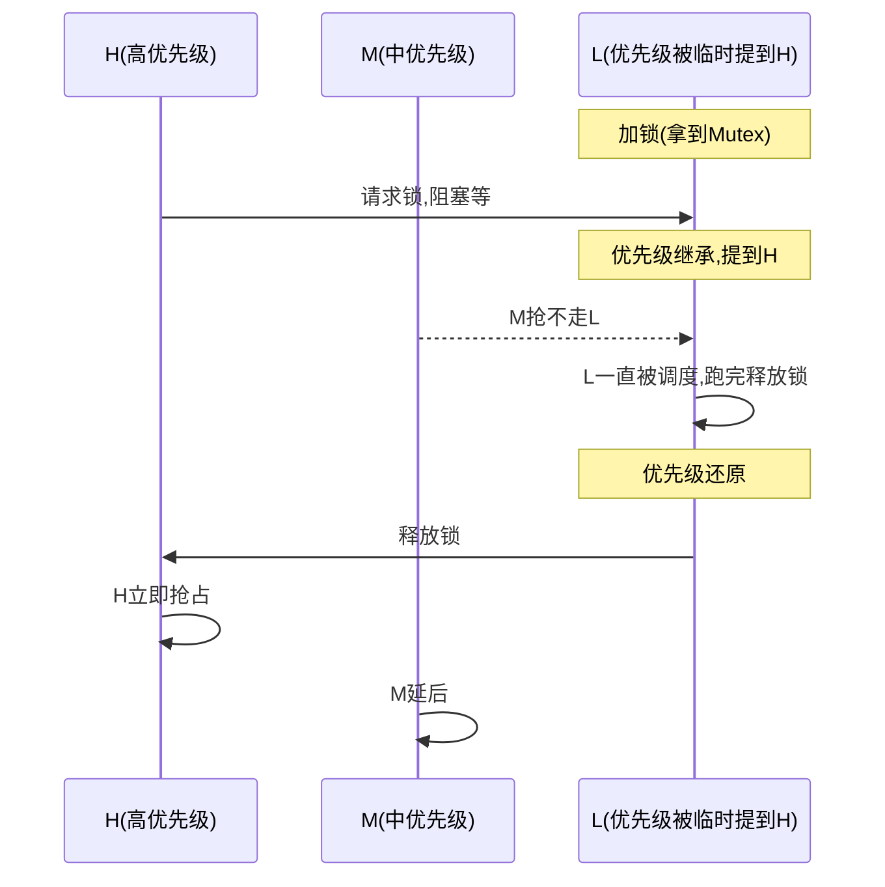
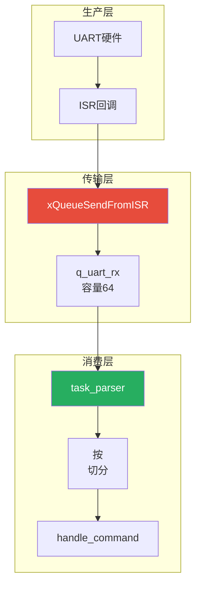

# 【元婴·117】RTOS任务通信：队列、信号量、通知

> **码农修仙传 · 元婴期 · 第117篇**
> 我是玄芯散人，带你从炼气修到大乘。

---

## 境界标识

```
╔══════════════════════════════════╗
║     元婴期 · 第117篇            ║
║     RTOS任务通信                ║
║     队列 × 信号量 × 任务通知     ║
║     预计阅读：25分钟             ║
╚══════════════════════════════════╝
```

---

## 修仙引入

116篇把分身创出来了。可分身各管一摊，谁也不跟谁说话，很快洞府又乱成一锅粥。传感器分身采到温度，得传给OLED分身显示；按键分身检测到按下，得通知主任务处理逻辑；网络数据是中断收到，得递给上层任务消化。

修真界管这种现象叫「经脉不通」：每位弟子都在运转，宗门资源却分配不到该去的地方。这一篇把FreeRTOS的通信法器讲透，分别是队列（Queue）用于传数据，信号量（Semaphore）用于做同步，任务通知（Task Notification）用于轻量打信号。最后附上FreeRTOS对pthread的杀手锏，中断安全API（FromISR系列），这是嵌入式实时系统对通用操作系统最硬核的差异化能力。



通信法器各司其职，分身之间才会「经脉贯通」。

---

## 硬核主体

### 为什么任务之间要通信

在116篇分身术的例子里，每个任务都是闭环的：采了就用，检测了就处理。真实洞府远没有这么简单。一个传感器可能同时被多个任务关心，OLED要看它，云端要看它，本地存储也要看它。多个生产者、一个消费者这种模式在大循环里不方便实现，RTOS的优势就体现在这里：让任务之间通信。

修真界管生产者和消费者的关系叫「炼丹炉分流」。炼丹炉源源不断出丹，多位弟子排着队领取。FreeRTOS的队列就是修真版的「丹炉分流器」，把生产者和消费者解耦。

通信要解决三件事，每件事对应一类法器：

- 任务之间要传递数据（温度值、网络包）：用队列
- 任务之间要传递事件到达信号（按键被按下、缓冲区空）：用信号量
- 任务之间要传递轻量通知（一对一快速打信号）：用任务通知

下面挨个拆。

### 队列（Queue）：FIFO生产者消费者

队列是FreeRTOS最常用的通信法器，主要用途是线程安全的FIFO缓冲区。生产者往里塞，消费者从里取，谁也不等谁，按先后顺序排队。

修真界管它叫「丹炉分流器」：丹炉源源不断出丹，多位弟子按先来后到排队领取。这正是FreeRTOS队列的精髓，把生产者和消费者解耦。

队列的API签名看清这五条：

```c
QueueHandle_t xQueueCreate(UBaseType_t uxQueueLength,  // 队列能装多少个item
                           UBaseType_t uxItemSize);    // 每个item多大，单位字节

// 入队（队尾）
BaseType_t xQueueSend(QueueHandle_t xQueue,        // 队列句柄
                      const void * pvItemToQueue,  // 待入队数据指针
                      TickType_t xTicksToWait);    // 队列满时等多久

// 出队（队首）
BaseType_t xQueueReceive(QueueHandle_t xQueue,   // 队列句柄
                         void * pvBuffer,         // 接收缓冲区
                         TickType_t xTicksToWait); // 队列空时等多久
```

uxQueueLength决定队列容量，uxItemSize决定每个item多大。

传值还是传指针，是个绕不过去的选型题：

- 传值（uxItemSize填实际尺寸，比如sizeof(uint16_t)用于温度）：实现简单，队列自己复制，多任务下安全。代价是队列占内存大（容量乘以item尺寸）。
- 传指针（uxItemSize填sizeof(void*)，数据放在外面）：队列只搬指针，内存省。代价是要管那块数据的生命周期，谁释放、什么时候释放要算清楚。

经验阈值：单变量小于等于4字节可以直接传值，比如uint32_t的温度计数。如果数据是结构体，并且结构体内还要带字符串或时间戳，就改用传指针这条路。修真界管「大块头」叫重器，重器不直接搬，挪的是牌子。

传值的示意：

```c
typedef struct {
    uint16_t temp_centi;  // 温度（摄氏度×100）
    uint16_t humid_centi; // 湿度
    uint32_t timestamp;   // 采样时刻
} SensorData;

// 容量4，item大小8字节
QueueHandle_t q_sensor = xQueueCreate(4, sizeof(uint16_t));

void task_sensor(void *arg) {
    for (;;) {
        uint16_t temp = read_temperature();
        xQueueSend(q_sensor, &temp, portMAX_DELAY);  // 阻塞塞数据
        vTaskDelay(pdMS_TO_TICKS(100));
    }
}

void task_oled(void *arg) {
    uint16_t t = 0;
    for (;;) {
        xQueueReceive(q_sensor, &t, portMAX_DELAY);  // 阻塞取数据
        oled_show_temperature(t);
    }
}
```

传指针的示意：

```c
QueueHandle_t q_packet = xQueueCreate(8, sizeof(void*));   // 容量8，存指针

typedef struct {
    uint8_t buf[256];
    uint16_t len;
    uint32_t seq;
} NetPacket;

void isr_uart(void) {
    NetPacket *pkt = pvPortMalloc(sizeof(NetPacket));
    // 填充pkt...
    xQueueSendFromISR(q_packet, &pkt, NULL);  // 传指针
}

void task_net(void *arg) {
    NetPacket *pkt = NULL;
    for (;;) {
        xQueueReceive(q_packet, &pkt, portMAX_DELAY);
        process(pkt->buf, pkt->len);
        vPortFree(pkt);   // 消费完就释放，记好生命周期
    }
}
```

队列的长相：



阻塞等待是队列最拿得出手的能力。当队列塞满时，xQueueSend阻塞直到有消费者取走。当队列空时，xQueueReceive阻塞直到有生产者塞入。修真界对应「丹炉满则弟子暂候，丹炉空则弟子打坐入定」，这种生产者消费者互相成就的关系，正是队列立得住的法门。

### 信号量（Semaphore）：打事件的信号枪

信号量其实就是计数器。Take减一，Give加一，计数为零时Take会阻塞。它没有「数据」可塞，只是个同步信号枪。

FreeRTOS有两类信号量：

二值信号量（Binary Semaphore）：计数器只有0和1两态，最适合打一次性信号（按按键、数据到达）。

```c
SemaphoreHandle_t sem_button = xSemaphoreCreateBinary();

void isr_button(void) {
    BaseType_t hpw = pdFALSE;
    xSemaphoreGiveFromISR(sem_button, &hpw);  // 中断里Give
    portYIELD_FROM_ISR(hpw);                  // 需要的话触发任务切换
}

void task_main(void *arg) {
    for (;;) {
        if (xSemaphoreTake(sem_button, portMAX_DELAY) == pdTRUE) {
            handle_button_event();
        }
    }
}
```

计数信号量（Counting Semaphore）：计数器可累加，适合资源计数（停车位还剩几个、缓冲区空槽有几个）。

```c
SemaphoreHandle_t sem_slots = xSemaphoreCreateCounting(10, 10);  // 最大10，初始满
// 生产者take一个空槽，消费者give回去
```

信号量和队列的区分，常被新人混淆。原则记住这一句：

队列用来「搬运东西」，信号量用来「敲钟」。把按键事件用队列传一个字节当然能跑，但浪费；用信号量给上层打一次性通知就够了。

修真界管信号量叫「钟鸣」：钟敲一下，全院皆知，但钟不背内容，听者各去响应各的事。

### 互斥量（Mutex）：优先级反转与继承

互斥量是信号量的特化版本，叫Mutex（Mutual Exclusion）。用途管对共享资源的独占访问。比如SPI总线、I2C设备，或全局链表这种需要排他访问的对象。

```c
SemaphoreHandle_t mtx_spi = xSemaphoreCreateMutex();

void task_a(void *arg) {
    if (xSemaphoreTake(mtx_spi, portMAX_DELAY) == pdTRUE) {  // 加锁
        spi_transfer(buf, len);
        xSemaphoreGive(mtx_spi);                              // 解锁
    }
}
```

Mutex和二值信号量看起来都能实现「一次只有一个任务进」，但Mutex多一个能力：所有权。谁Take谁必须Give。不能在任务A里Take、任务B里Give。这条规矩避免了「我加锁你解锁」的逻辑错乱。

互斥量的杀手锏是优先级继承机制。这要先理解一个洞天级问题：优先级反转。

#### 优先级反转的灾难

设三个任务：H高优先级、L低优先级、M中优先级。L拿着共享资源（被Mutex保护），H也要拿这个资源所以阻塞等。等的过程中M抢走了CPU（M优先级比L高）。结果是这样的：H在等L释放资源，L拿不到CPU（L被M抢），H一直被M挡着跑不起来，叫优先级反转。

修真界管优先级反转叫「品级悬逆」。修真界把这种现象归成火星拓印那类诡异故障：1997年NASA的Mars Pathfinder探测器因为这个机制反复重启，差点没把整个任务拖崩。



#### 优先级继承：把L临时升级

互斥量解决优先级反转的办法叫优先级继承（Priority Inheritance）。L任务拿到H任务等待的资源时，临时把自己的优先级顶到H那档（继承H的品级），让M抢不走它的CPU。L释放资源后，优先级还回原值。



修真界的比方：低阶弟子被高阶弟子点名要文书，中阶弟子再急也别想插队。低阶弟子临时挂上「高阶令牌」，先集中精力把文书交了。文档一交，令牌收回，中阶弟子才能继续。这是修真界化解「品级悬逆」的法宝。

要注意：只有互斥量Mutex才有这个机制，二值信号量没有。所以跨任务共享资源的场合永远用xSemaphoreCreateMutex()，不要用xSemaphoreCreateBinary()。

FreeRTOS还提供递归互斥量xSemaphoreCreateRecursiveMutex()。同一个任务可多次Take，但Take几次就得Give几次。这种用法多见于递归调用函数中都访问共享资源的情况，但实际项目里用得不多，能不用就别用，免得代码变复杂。

### 任务通知（Task Notification）：轻量打信号

任务通知是FreeRTOS后来新加的法器，速度比信号量更快（最高10倍，参考官方benchmark），内存占用更省，不需要单独创建句柄，直接拿目标任务的handle就能用。

每个任务都有一个32位的通知值（ulNotifiedValue），这是个隐藏属性。通信靠两个动作：写（Give/Notify）和读（Take/Wait）。

```c
// 写通知（最简单的版本）
void notify_task(TaskHandle_t h) {
    xTaskNotifyGive(h);  // ulNotifiedValue加一
}

// 读通知
BaseType_t task_proc(void *arg) {
    uint32_t cnt = ulTaskNotifyTake(pdFALSE, portMAX_DELAY);  // 减一并返回
    handle(cnt);
}
```

更灵活的是xTaskNotify系列，能传32位数据、能指定行为（覆盖/加/置位/按位与）：

```c
// 带数据的通知（行为为覆盖原值）
xTaskNotify(target_handle, 0x1234, eSetValueWithOverwrite);

// 等通知并取出数据
uint32_t val;
xTaskNotifyWait(0xFFFFFFFF,        // 退出时清除哪些位
                0xFFFFFFFF,        // 等待时关注哪些位
                &val,              // 收到通知时的值
                portMAX_DELAY);    // 阻塞等
```

任务通知的限制：

- 通知只有一收方（任务handle是绑定的），不能广播
- 在ISR里不能用ulTaskNotifyTake，得用vTaskNotifyGiveFromISR
- 多个任务同时等待一个通知，处理起来不方便

修真界管任务通知叫「传音入密」：一对一私密传话，效率高于当面呼喊。但传音入密有个限制，只能给特定那位修士。修真大群广而告之的事情还得用信号量或队列。

任务通知vs信号量，选用速查：

| 通信需求 | 选任务通知 | 选信号量 |
|----------|-----------|---------|
| 一对一通知 | 推荐 | 也可以 |
| 一对多广播（事件组） | 不行 | 可以 |
| 计数用法（比如资源池） | 不行 | 必须用计数信号量 |
| 极致性能要求（高频中断） | 推荐 | 也可以 |
| 不想多创建句柄 | 推荐 | - |

总结：能用任务通知的场合就优先用，性能和资源占用的差距是真实存在的。

### 中断安全API（FromISR）：实时系统的命根子

FreeRTOS相对pthread最硬的差异化能力，就是中断安全API。这是嵌入式实时系统对通用操作系统的杀手锏。

#### 为什么ISR里要特殊的API

普通任务可以阻塞（vTaskDelay、xQueueReceive挂起等事件），但中断服务程序ISR不能阻塞。中断处理讲究快进快出，长任务会卡死系统的实时性。如果ISR里调用了阻塞API，可能让调度器状态错乱。也可能让栈撑爆，更严重时直接HardFault。

FreeRTOS把所有可能阻塞的API都拆成两份：

- 普通任务版本（xQueueSend, xSemaphoreGive）
- 中断安全版本（xQueueSendFromISR, xSemaphoreGiveFromISR）

FromISR版本都不能阻塞（没有xTicksToWait参数），调用后立即返回。它们接受一个特殊的参数：

```c
BaseType_t xQueueSendFromISR(QueueHandle_t xQueue,
                             const void * pvItemToQueue,
                             BaseType_t * pxHigherPriorityTaskWoken);
```

第三个参数pxHigherPriorityTaskWoken（简称hpw）告诉调用方：这次入队操作有没有触发更高优先级任务变成就绪。处理逻辑务必遵守这个三步曲：

```c
void isr_uart_rx(void) {
    uint8_t byte = UART_DR;  // 读数据寄存器清中断标志
    BaseType_t hpw = pdFALSE;
    xQueueSendFromISR(q_uart, &byte, &hpw);  // 1. FromISR API
    portYIELD_FROM_ISR(hpw);                  // 2. 需要切换就发起
}

void isr_timer(void) {
    BaseType_t hpw = pdFALSE;
    xSemaphoreGiveFromISR(sem_tick, &hpw);
    portYIELD_FROM_ISR(hpw);
}
```

修真界管这段规矩叫「护法八戒」。戒急就是一进一出不阻塞，戒惰是立即返回不让ISR卡住，戒忘是有需要才主动切换任务。违反任何一戒，要么系统崩，要么实时性破灭。

#### configMAX_SYSCALL_INTERRUPT_PRIORITY：中断优先级边界

不是所有中断都能调用FromISR API。FreeRTOS要求调用FromISR的中断优先级必须在configMAX_SYSCALL_INTERRUPT_PRIORITY之内（数值上大于等于它，因为Cortex-M优先级数字大的实际优先级低）。

Cortex-M的中断优先级分组后是8位，高几位是抢占优先级，低几位是子优先级。FreeRTOS用抢占优先级做判断：

- 数值上小于configMAX_SYSCALL_INTERRUPT_PRIORITY的中断（抢占优先级更高）：不能调用FromISR API，连vPortEnterCritical都不行
- 低于它的中断（数值大）：可以调用，但仍然不能阻塞

这个边界在FreeRTOSConfig.h里配：

```c
// Cortex-M4, 4位抢占优先级, NVIC_PRIORITYBITS = 4
#define configMAX_SYSCALL_INTERRUPT_PRIORITY    5   // 抢占优先级数值>=5才能用FromISR
#define configKERNEL_INTERRUPT_PRIORITY         15  // 内核用最低数值优先级（最不抢）
```

常见的错误配：把这个边界设得太高（数值小），结果几乎所有中断都不能用API；或者忘了配，默认值导致HardFault。

#### 实战：UART中断 + 队列 + 处理任务

把这一篇的法器串起来，做个最常见的案例：UART接收中断把字节塞队列，处理任务从队列取出来解析协议。

```c
// 头文件里定义
QueueHandle_t q_uart_rx;
TaskHandle_t  task_parser_handle;

// 启动代码
void setup(void) {
    q_uart_rx = xQueueCreate(64, sizeof(uint8_t));
    xTaskCreate(task_parser, "parser", 256, NULL, 2, &task_parser_handle);
    HAL_UART_Receive_IT(&huart1, &rx_byte, 1);  // 启动接收中断
}

// UART接收中断（HAL库会调用）
void HAL_UART_RxCpltCallback(UART_HandleTypeDef *huart) {
    if (huart->Instance == USART1) {
        BaseType_t hpw = pdFALSE;
        xQueueSendFromISR(q_uart_rx, &rx_byte, &hpw);
        portYIELD_FROM_ISR(hpw);
        HAL_UART_Receive_IT(&huart1, &rx_byte, 1);  // 重新开启下一次接收
    }
}

// 处理任务：从队列按协议解析（这里以"收到\n作为一帧"为例）
static char line_buf[128];
static uint8_t line_pos = 0;
void task_parser(void *arg) {
    uint8_t b;
    for (;;) {
        if (xQueueReceive(q_uart_rx, &b, portMAX_DELAY) == pdTRUE) {
            if (b == '\n' || line_pos >= sizeof(line_buf) - 1) {
                line_buf[line_pos] = '\0';
                handle_command(line_buf);   // 处理一行命令
                line_pos = 0;
            } else if (b != '\r') {
                line_buf[line_pos++] = b;
            }
        }
    }
}
```

整体数据流：



ISR里只把字节塞进队列，处理工作全丢给任务。这种模式叫「中断打信号，任务干活」，修真界对应的就是「巡山弟子敲钟，主殿弟子执事」。符合嵌入式「快进快出ISR、慢活在任务」的不二法门。

### 通信法器选型速查

修真界法器繁杂，按本篇讲过的法器挑选即可：

| 通信需求 | 推荐法器 |
|----------|---------|
| 任务之间传数据（结构体、字符串） | 队列 |
| ISR到任务传字节流 | 队列 + FromISR |
| 一对一打信号（按键、事件到达） | 任务通知 |
| 资源计数（缓冲区空槽、停车位） | 计数信号量 |
| 跨任务保护共享资源 | 互斥量（Mutex） |
| 广播多任务信号（位标志） | 事件组（不在本篇范围） |

修真界一条经验：「能传音入密就不敲钟，能敲钟就不炼丹炉」，越轻量越好。法器虽多，懂得挑选才是真道行。

---

## 修仙术语对照表

| 修仙术语 | 技术现实 | 本篇位置 |
|---------|---------|---------|
| 经脉不通 | 多任务之间缺乏通信 | 引入 |
| 炼丹炉分流器 | 队列的FIFO生产消费思路 | 队列 |
| 丹炉满则暂候 | 队列满时Send阻塞 | 队列 |
| 丹炉空则入定 | 队列空时Receive阻塞 | 队列 |
| 传值传丹、传指针传葫芦 | 队列item传值还是传指针 | 队列 |
| 钟鸣 | 信号量打事件信号 | 信号量 |
| 品级悬逆 | 优先级反转问题 | 互斥量 |
| 高阶令牌 | 互斥量的优先级继承机制 | 互斥量 |
| 递归互斥量 | 同一任务多次Take | 互斥量 |
| 传音入密 | 任务通知的一对一通信 | 任务通知 |
| 通知值 | ulNotifiedValue 32位值 | 任务通知 |
| 护法三戒 | FromISR的快进快出+Yield | FromISR |
| 巡山弟子敲钟 | ISR给任务打信号 | FromISR |
| 主殿弟子执事 | 任务做耗时处理 | FromISR |
| 抢占品级边界 | configMAX_SYSCALL_INTERRUPT_PRIORITY | FromISR |
| 火星拓印实验 | Mars Pathfinder 1997年bug | 互斥量 |

---

## 突破条件

真懂RTOS任务通信之前，差这几条：

- [ ] 能说出队列、信号量、互斥量、任务通知的差异，并会按工程问题挑法器
- [ ] 能写出xQueueCreate+xQueueSend+xQueueReceive的全套用法，知道传值和传指针的选型准则
- [ ] 能解释信号量Mutex和Binary的差异，理解Mutex的所有权和优先级继承
- [ ] 能复述优先级反转的因果链，并解释优先级继承怎么破解这个死局
- [ ] 能用xTaskNotifyGive和ulTaskNotifyTake实现一对一的轻量事件通知
- [ ] 能列出三种FromISR API并解释为什么不能在ISR里调用普通API
- [ ] 能解释pxHigherPriorityTaskWoken + portYIELD_FROM_ISR这套规矩
- [ ] 能用一个真实项目例子实现「UART中断 → 队列 → 处理任务」数据通路

最后一条是元婴期修真分身术的「经脉贯通」检验标准。通信通路打通了，分身术才算真正派上用场。

---

## 下期预告 + 互动

下一篇：【元婴·118】调试器原理：JTAG/SWD怎么看见你的代码。

117篇把分身之间的通信讲透了，可出了问题怎么排查？LED不闪这种事挺常见，传感器读数永远为零也常见，队列塞死不动也常见，这些都是肉眼难辨的bug。嵌入式工程师的第三只眼是调试器，下一篇钻进芯片里看看JTAG和SWD协议怎么把内核状态拉出来。

调试器通过DAP（Debug Access Port）连进CPU内部。靠这个口子能读写寄存器，能查看内存。还能单步执行，能设断点。这套机制在芯片设计的时候就内嵌好了，叫CoreSight这套（ARM专属）。修真界管这种内嵌的窥探通道叫「心魔探测术」，能照见修士自身的运转细节，连自己都察觉不到的小动作都漏不掉。

现在问你：

🥷 你做的项目里，任务之间是怎么通信的？用的全局变量还是正经的队列信号量？踩过哪些坑？

🔧 ISR里直接调用printf或者delay的惨痛经历有没有？看到任务卡死、HardFault的时候怎么排查？

评论区聊聊你的RTOS通信踩坑经验。

我是玄芯散人，带你从炼气修到大乘。

---

*本文是「码农修仙传」系列第117篇。系列导航见 [xren.ren](https://xren.ren)*
