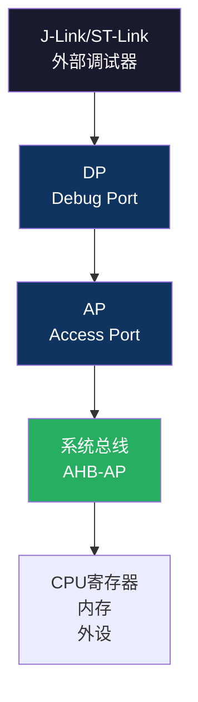

# 【元婴·118】调试器原理：JTAG/SWD怎么看见你的代码

> **码农修仙传 · 元婴期 · 第118篇**
> 我是玄芯散人，带你从炼气修到大乘。

---

## 境界标识

```
╔══════════════════════════════════╗
║     元婴期 · 第118篇             ║
║     调试器原理                    ║
║     JTAG/SWD怎么看见你的代码      ║
║     预计阅读：12分钟              ║
╚══════════════════════════════════╝
```

---

## 修仙引入

你天天用J-Link或ST-Link调试：打断点，单步执行，看变量值。但你想过没有，调试器怎么做到这些的？

你的代码跑在STM32的Flash里，调试器是一个外部设备，它怎么知道CPU执行到哪了？怎么在你设的断点处停下来？怎么读到变量的值？

答案是一套叫"Debug Port"和"Access Port"的硬件总线，加上几个专门的调试寄存器。CPU内部有一整套调试硬件，你的J-Link只是跟这些硬件"对话"的工具。

今天拆开调试器的底层原理：JTAG和SWD接口和DP/AP总线和硬件断点和软件断点的区别和SWO单线追踪怎么输出printf。

---

## 硬核主体

### JTAG vs SWD：两种调试接口

JTAG是最早的调试接口，4根信号线：TCK（时钟）和TMS（模式选择）和TDI（数据输入）和TDO（数据输出），加上复位线nRST一共5根。它最初是为芯片测试设计的（边界扫描），后来被借用来做调试。

SWD（Serial Wire Debug）是ARM专门为调试设计的2线接口：SWCLK（时钟）和SWDIO（数据双向），加上复位线nRST一共3根。比JTAG省2根引脚，在引脚紧张的MCU上更常用。

两种接口功能一样，SWD是JTAG的精简版。STM32F4默认用SWD，因为PA13/PA14两根线就够了。

### DP和AP：调试器的两段式总线

调试器访问MCU内部资源，要经过两道关卡：



DP（Debug Port）是第一道关卡。调试器通过SWD接口跟DP通信，DP负责把SWD的串行协议转成内部总线信号。DP里有几个寄存器：IDCODE（芯片ID）和CTRL/STAT（控制状态）和SELECT（选择哪个AP）和RDBUFF（读缓冲）。

AP（Access Port）是第二道关卡。DP选好AP后，通过AP访问系统总线。最常用的是MEM-AP（内存访问AP），它能让调试器像CPU一样读写内存和寄存器。

调试器读一个变量的流程：
1. 调试器通过SWD写DP的SELECT寄存器，选择MEM-AP
2. 写AP的TAR（Transfer Address Register），设置要读的地址
3. 读AP的DRW（Data Read/Write），拿到数据
4. 数据通过DP的RDBUFF返回调试器

整个过程不需要CPU参与，调试器直接访问系统总线。

### 硬件断点 vs 软件断点

断点有两种实现方式，原理完全不同。

硬件断点：用FPB（Flash Patch and Breakpoint）单元。FPB里有几个地址比较器，CPU每次取指令时FPB会比较地址，如果匹配就触发调试异常，CPU停下来。STM32F4有6个硬件断点。硬件断点可以直接在Flash里设，因为不修改Flash内容。

软件断点：调试器把目标地址的指令替换成BKPT指令（机器码0xBE00）。CPU执行到BKPT时触发调试异常。断点取消时再把原始指令写回去。软件断点数量不限，但只能用在RAM里（Flash需要擦写才能替换）。

你在Keil里打断点时：
- 代码在Flash里 → 默认用硬件断点（最多6个）
- 代码在RAM里 → 用软件断点（不限数量）
- 硬件断点用完了 → 调试器可能自动转软件断点

### SWO追踪：单线输出printf

嵌入式调试有个痛点：想看变量值但UART被占用了，或者printf太慢影响实时性。SWO（Serial Wire Output）解决了这个问题。

SWO是单根输出线，跟SWD的SWCLK和SWDIO复用调试接口，但方向是MCU输出到调试器。它通过ITM（Instrumentation Trace Macrocell）模块工作。

```c
// 通过ITM输出printf（不需要UART）
#define ITM_Port32(n) (*((volatile unsigned int *)(0xE0000000 + 4*n)))

void ITM_SendChar(char ch) {
    while (ITM_Port32(0) == 0);  // 等Stimulus Port 0就绪
    *((volatile char *)0xE0000000) = ch;
}
```

ITM有32个Stimulus Port，每个port可以写数据。SWO以高速（通常是CPU时钟或分频）把ITM数据串行输出到调试器，调试器再转发给电脑显示。速度远超UART，且不占用任何外设引脚。

### 调试相关的寄存器

Cortex-M4的调试系统有一组寄存器，映射在0xE0000000开始的系统控制空间：

| 寄存器 | 地址 | 作用 |
|--------|------|------|
| DHCSR | 0xE000EDF0 | 调试主机控制状态，设置调试 halt/resume |
| DCRSR | 0xE000EDF4 | 调试核心寄存器选择，读写CPU寄存器 |
| DCRDR | 0xE000EDF8 | 调试核心寄存器数据 |
| DEMCR | 0xE000EDFC | 调试异常监控控制，使能DWT/ITM/向量捕获 |
| FP_CTRL | 0xE0002000 | FPB控制，使能硬件断点 |
| FP_COMP1 | 0xE0002008 | 断点地址比较器1 |

调试器设置断点时，实际就是写FP_COMP寄存器，把目标地址配进去。

---

## 修仙术语对照表

| 修仙术语 | 技术现实 | 本篇位置 |
|----------|---------|---------|
| 天眼通 | 调试器通过DP/AP看到CPU内部 | 引入 |
| 两道关卡 | DP和AP两段式总线 | DP/AP |
| 传令兵 | DP转SWD串行协议 | DP |
| 内务管事 | AP访问系统总线 | AP |
| 定身术 | 硬件断点FPB比较器 | 断点 |
| 替身符 | 软件断点BKPT替换指令 | 断点 |
| 传音密线 | SWO单线输出 | SWO |
| 传音阵眼 | ITM Stimulus Port | SWO |
| 调度令牌 | DHCSR控制halt/resume | 寄存器 |
| 地址照妖镜 | FP_COMP地址比较器 | 寄存器 |

---

## 进阶条件

会用调试器和理解调试器原理之间，差这几条：

- [ ] 能说出JTAG 4线和SWD 2线的引脚名称
- [ ] 知道DP和AP的区别（DP管协议转换，AP管总线访问）
- [ ] 能解释硬件断点（FPB比较器）和软件断点（BKPT替换）的区别
- [ ] 知道STM32F4有6个硬件断点
- [ ] 能配置SWO/ITM输出printf，不占用UART
- [ ] 知道DHCSR/DEMCR/FP_COMP等调试寄存器的作用
- [ ] 能解释为什么软件断点只能用在RAM里

> 最后一条是元婴期的认知分水岭。调试器不是魔法，它是一套硬件总线加寄存器的组合。

---

## 下期预告 + 互动

> 下一篇：【元婴·119】示波器入门：嵌入式工程师的第三只眼
>
> 代码能跑了但信号不对？你需要示波器看波形。
> 下篇讲示波器基本操作和触发设置和I2C/SPI波形分析和电源纹波测量。

现在问你：

> 🔍 你用过SWO输出printf吗？比UART快多少？
>
> 📌 你知道你的芯片有几个硬件断点吗？用完了怎么办？
>
> 评论区聊聊你跟调试器打交道的经历。

> 我是玄芯散人，带你从炼气修到大乘。

---

*本文是「码农修仙传」系列第118篇。系列导航见 [xren.ren](https://xren.ren)*
