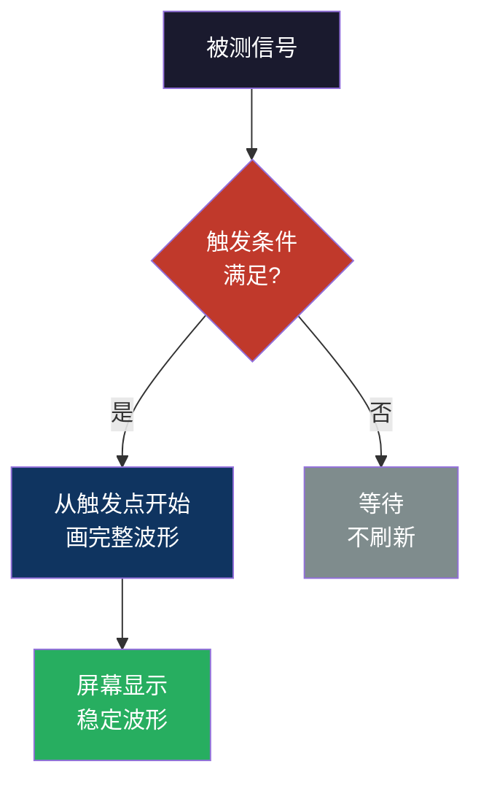
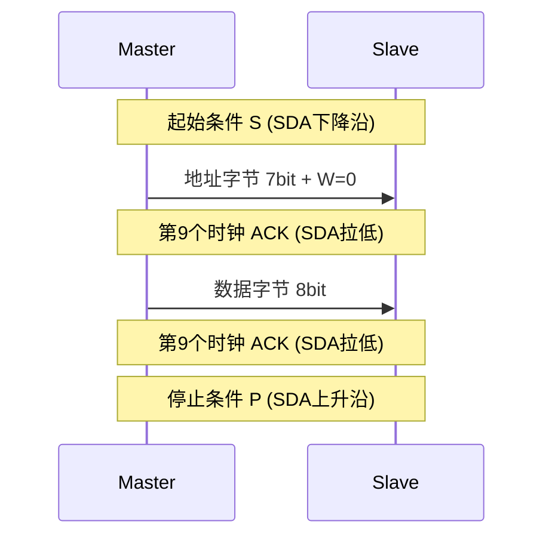
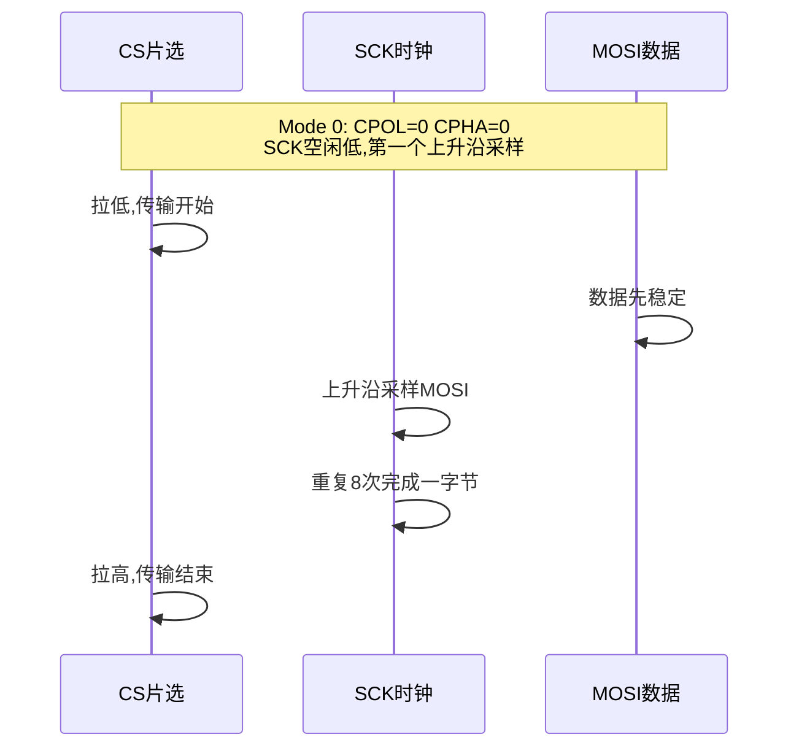

# 【元婴·119】示波器入门：嵌入式工程师的第三只眼

> **码农修仙传 · 元婴期 · 第119篇**
> 我是玄芯散人，带你从炼气修到大乘。

---

## 境界标识

```
╔══════════════════════════════════╗
║     元婴期 · 第119篇             ║
║     示波器入门                    ║
║     嵌入式工程师的第三只眼        ║
║     预计阅读：12分钟              ║
╚══════════════════════════════════╝
```

---

## 修仙引入

上一篇讲了调试器，它让你看清 CPU 内部在执行什么指令，寄存器里放着什么值。但调试器有个盲区：它看不到电路上的真实电信号。

代码里写了 `HAL_GPIO_WritePin(GPIOA, GPIO_PIN_5, GPIO_SET)`，逻辑分析仪告诉你 CPU 写出了高电平，但实际板子上 PA5 引脚是不是 3.3V？I2C 总线 SCL 是不是真的拉高了？电源纹波有没有超过芯片手册给的 50mV？这些事，调试器管不了，示波器管。

示波器是嵌入式工程师的第三只眼。第一只眼看代码，第二只眼看逻辑（用调试器），第三只眼看电平。硬件 bug 十有八九藏在那根 SDA 线的边沿抖动里，藏在那颗 LDO 输出端的尖峰里。

今天拆开示波器怎么用。先讲基本操作和触发设置，这是看波形的基础。然后讲 I2C 和 SPI 波形怎么读，最后讲电源纹波怎么测。

---

## 硬核主体

### 示波器是什么

示波器的本职工作是画电压随时间变化的曲线。横轴是时间，纵轴是电压，屏幕上一个移动的光点记录着探头上看到的电平。

判断一台示波器能不能用，看两个参数：带宽和采样率。

带宽是示波器能如实放大信号的最高频率。带宽不足时，正弦波会变三角波，上升沿会变圆弧，看起来对实际错。经验法则：示波器带宽要 ≥ 被测信号最高频率的 5 倍，否则 100MHz 以上的谐波被衰减，方波变圆波。看 100MHz 的 SPI 时钟，选 500MHz 带宽的示波器。

采样率是每秒采多少个点。奈奎斯特定律要求采样率 ≥ 信号带宽的 2 倍才能还原波形，但只看采样率会踩坑：很多入门级示波器只有 1GSa/s 采样率，开两个通道就降成 500MSa/s，开四个通道降到 250MSa/s。看通道数和单通道采样率，而不是标称的峰值。

### 基本操作：四个旋钮

示波器面板上有几十个旋钮，初学者会懵。其实日常调试就动四个：

### 时基（TIME/DIV）

水平方向每格的时长。旋转它就是拉宽或压缩时间轴。看 UART 波形一般 100us/div，看电源上电过程用 100ms/div，看 I2C 400kHz 用 500ns/div。

### 电压挡位（VOLTS/DIV）

垂直方向每格的电压值。旋转它把波形放大或缩小。看 3.3V 信号用 1V/div，看 12V 电源用 2V/div。

### 耦合方式（DC / AC / GND）

DC 耦合：信号原样进示波器，直流偏置和交流分量都看得到。AC 耦合：在示波器内部加一个电容，剥掉直流分量，只剩交流。GND：把输入短路到地，看当前时基下的零电平位置，用来校准基线。

什么时候用 AC 耦合？测电源纹波时。纹波是叠加在 3.3V 直流上的小幅交流，如果用 DC 耦合，3.3V 直流会把波形顶到屏幕顶部，根本看不清小幅纹波。切到 AC 耦合后，3.3V 直流被剥掉，屏幕中央一条横线，纹波清晰可见。

### 探头（1X / 10X）

探头是示波器和电路板的接口，分 1X 和 10X 两挡。

1X 探头：信号直通到示波器，无衰减。优点是便宜简单，缺点是探头的 100pF 左右电容并联在电路上，对高频信号是巨大负担，会把方波的上升沿拖成斜坡。

10X 探头：探头内部有个 9MΩ 电阻和示波器内部的 1MΩ 输入电阻分压，把信号衰减 10 倍再送进示波器。优点是输入阻抗变成 10MΩ，对电路几乎无影响，带宽也高得多（典型 100MHz 10X 探头 vs 10MHz 1X 探头）。缺点是要在示波器端把挡位也切到 10X，否则显示幅度小 10 倍。

工程实践：默认用 10X 探头，除非测小信号需要高灵敏度时才用 1X。示波器上有个探头补偿调节孔，用方波校准信号调探头内的微调电容，让 1kHz 方波显示成方波而不是过冲或欠阻尼的弧线。每次换探头都要做这一步。

### 触发设置：让波形停下来

示波器屏幕不停地扫，扫出来的波形不固定，看起来一团乱。这就是没设触发。

触发的意思是：设定一个条件，示波器扫到满足这个条件的瞬间才开始画下一次波形，这样前后两次的波形能对齐，屏幕上看的就是稳定的重复波形。



### 边沿触发

最常用的触发：设定一个电压阈值和边沿方向（上升沿/下降沿/任意）。每次信号跨过阈值时，示波器从那个点开始画。

工程例子：用 UART 发送 0x55（01010101），设上升沿触发，电压阈值 1.65V（3.3V 的一半），每次起始位结束后的第一个上升沿触发，屏幕稳定显示一帧 UART 数据。

### 脉宽触发

设定脉宽上下阈值。比边沿触发更进一步，能捕获到特定宽度的异常脉冲。典型用法是找程序里偶尔出现的毛刺。

工程例子：嵌入式系统里偶尔有 100ns 的尖峰干扰，CPU 复位时怀疑是它。设触发脉宽小于 500ns 的上升沿，一旦捕获尖峰，屏幕停下，再用单次触发（Single）冻结画面细看。

### 协议触发

现代数字示波器内置协议解码器，可以按地址、数据等条件触发。设触发条件为"I2C 地址 0x50 的写操作"，示波器在总线上抓到对应地址时触发，并自动把 SDA 线上的 0/1 翻译成数据字节。

工程例子：调试 I2C EEPROM，I2C 总线上挂了一主多从 4 个设备，设触发条件为"地址 0x50 收到读命令"，每次 AT24C02 被访问时屏幕停下，自动显示地址、数据字节和 ACK 状态。比手动数脉冲节省几个小时。

### 触发电平和 Holdoff

触发电平决定什么时候算跨过阈值。设太高不触发（屏幕不刷新），设太低噪声就触发（波形乱跳）。

Holdoff 是触发后等待一段时间再接受下一次触发。看 UART 帧时，每帧有 10 个边沿，默认触发会让波形停在帧中间。设 Holdoff 大于一帧时间，触发只在每帧起点发生，波形自然对齐。

### 用示波器看 I2C 波形

I2C 总线两根线：SCL（时钟）和 SDA（数据）。SCL 高电平期间 SDA 下降是起始条件 S，SCL 高电平期间 SDA 上升是停止条件 P。

用示波器看 I2C，探头一夹 SCL 一夹 SDA，触发条件选"下降沿"，触发源选 SDA 通道，阈值 1.65V。屏幕停下后，逐个格子读：



读波形时按以下步骤：

1. 找到 S 起始条件：SCL 高时 SDA 从高跳到低
2. 接下来 7 个 SCL 周期对应 7 位地址，按 MSB 在前读
3. 第 8 个 SCL 周期是 R/W 位，0 写 1 读
4. 第 9 个 SCL 周期看 ACK：SDA 被从机拉低表示应答
5. 之后每个字节 8 个 SCL 数据 + 1 个 ACK
6. 看到 P 停止条件时结束

实测坑：I2C 总线跑 400kHz，1 格 500ns，每位 2.5μs 共占 5 格。探头要短地线，地线环路大了会引入振铃，干扰 SDA 边沿判读。地线用探头自带的弹簧接地，比夹子地线短十几倍，测高频时必须用弹簧。

### 用示波器看 SPI 波形

SPI 有 4 根线：SCK 是时钟，MOSI 是主出从入，MISO 是主入从出，CS 是片选。比 I2C 简单，但没有标准协议层，需要看芯片手册确认时序。

CPOL 和 CPHA 决定 4 种模式：

- Mode 0：CPOL=0, CPHA=0，SCK 空闲低，第一个边沿采样
- Mode 1：CPOL=0, CPHA=1，SCK 空闲低，第二个边沿采样
- Mode 2：CPOL=1, CPHA=0，SCK 空闲高，第一个边沿采样
- Mode 3：CPOL=1, CPHA=1，SCK 空闲高，第二个边沿采样



用示波器看 SPI：

1. 探头夹 SCK 和 MOSI，触发条件选"CS 下降沿"或"SCK 上升沿"
2. 看到 CS 拉低表示传输开始
3. 每个 SCK 周期读一位数据，CPOL/CPHA 决定是哪个边沿
4. 8 个 SCK 周期对应 1 个字节
5. CS 拉高表示传输结束

模式判断：先把时基调到 100ns/div，看 SCK 空闲电平是高还是低确定 CPOL。然后看数据变化和 SCK 边沿的对应关系确定 CPHA。如果看 W25Q Flash（常用 Mode 0），SCK 空闲低，第一个上升沿 MOSI 已经稳定，这种就是 Mode 0。

### 测量电源纹波

电源纹波是叠加在直流电源上的交流分量。3.3V LDO 输出端，理论上是平直的 3.3V 直线，实际是 3.3V 上下波动的曲线，波动幅度叫纹波。

纹波过大会干扰模拟电路，例如 ADC 的精度会下降、运放输出会有噪声。数字芯片对纹波容忍度稍高，但超过一定幅度也会让 MCU 跑飞。

测量步骤：

1. 探头切到 10X，挂在 LDO 输出端
2. 示波器通道切到 AC 耦合（剥掉 3.3V 直流）
3. 时基设 1ms/div，电压挡位 10mV/div
4. 触发设边沿触发，触发电平调到屏幕中央
5. 用探头自带的弹簧接地，不要用夹子地线（防振铃）
6. 开 20MHz 带宽限制（大多数示波器有 BW Limit 按钮）

带宽限制很关键。LDO 输出的开关噪声频率很高（MHz 甚至几十 MHz），示波器探头会引入谐振，量到的纹波比实际大很多。开 20MHz 带宽限制后，高频噪声被滤掉，看到的是真实的低频纹波。

常见标准：3.3V 数字电源纹波一般要求 < 50mV，敏感模拟电路要求 < 10mV。STM32 数据手册规定 VDD 纹波 < 50mV。

#### 替代方案：差分探头测开关节点

测 buck converter 的 SW 节点（开关节点）时，节点电压在 0V 和 12V 之间跳变，普通探头会过压损坏。需要用差分探头或专门的高压隔离探头。普通嵌入式工程师用不到，但做电源设计必须知道。

---

## 修仙术语对照表

| 修仙术语 | 技术现实 | 本篇位置 |
|----------|---------|---------|
| 第三只眼 | 示波器看电平信号 | 引入 |
| 灵眼识海 | 带宽和采样率决定显示能力 | 示波器是什么 |
| 时间刻度尺 | 时基 TIME/DIV | 基本操作 |
| 电压度量衡 | 电压挡位 VOLTS/DIV | 基本操作 |
| 滤水镜 | AC 耦合剥离直流偏置 | 耦合方式 |
| 雷电灵契 | 触发条件决定波形稳定 | 触发 |
| 锋刃触发 | 边沿触发 | 边沿触发 |
| 灵光一闪触发 | 脉宽触发 | 脉宽触发 |
| 闪电契约起始 | I2C 起始条件 S | I2C |
| 应声符 | I2C ACK 应答 | I2C |
| 灵力法则 | SPI CPOL/CPHA 4 种模式 | SPI |
| 净水镜面 | 弹簧接地防振铃 | 纹波测量 |
| 频域屏蔽阵 | 20MHz 带宽限制 | 纹波测量 |

---

## 进阶条件

会用示波器和理解示波器原理之间，差这几条：

- [ ] 能说出时基/电压挡位/耦合/探头四个旋钮的作用
- [ ] 知道带宽 ≥ 信号最高频率 5 倍的工程法则
- [ ] 能解释 10X 探头为什么比 1X 探头带宽高
- [ ] 能根据使用场景选择边沿触发、脉宽触发或协议触发
- [ ] 用示波器稳定显示一帧 UART 波形
- [ ] 用示波器读出 I2C 地址字节并判断 ACK
- [ ] 能根据 SCK 空闲电平和采样边沿判断 SPI Mode 0/1/2/3
- [ ] 用 AC 耦合加 20MHz 带宽限制测量电源纹波

> 最后一条是元婴期硬件调试的分水岭。代码 bug 可以打断点调试，硬件 bug 只能靠示波器看波形。元婴期工程师的标志是：看到信号异常就知道该调哪个旋钮、看哪条边沿。

---

## 下期预告 + 互动

> 下一篇：【元婴·120】元婴期毕业：能独立设计嵌入式产品
>
> 示波器会用、调试器会调、RTOS 会跑，到了元婴期毕业的时候了。
> 下篇讲嵌入式产品全链路。先拿到需求，然后做硬件选型，再写固件，最后做验收，每一步都有标准。

现在问你：

> 🔍 你测过最棘手的信号是什么？毛刺？振铃？串扰？怎么定位的？
>
> 📌 你的板子电源纹波实测多少 mV？有没有因为纹波翻车过？
>
> 评论区聊聊你跟示波器打交道的经历。
>
> 我是玄芯散人，带你从炼气修到大乘。

---

*本文是「码农修仙传」系列第119篇。系列导航见 [xren.ren](https://xren.ren)*
