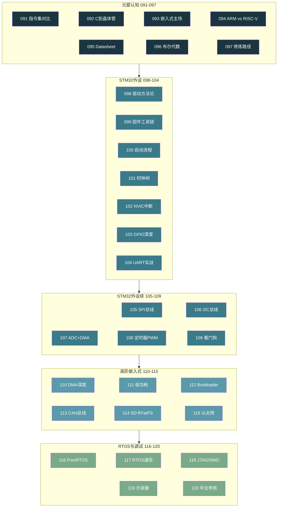
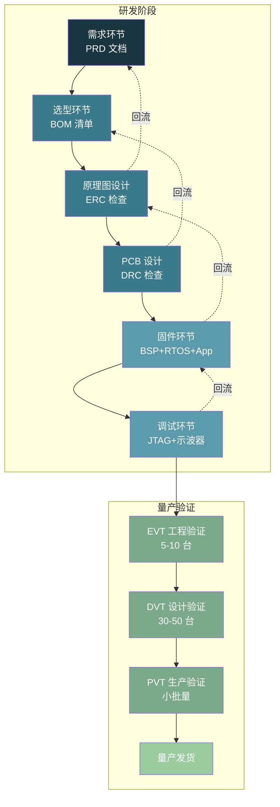

# 【元婴·120】元婴期毕业：能独立设计嵌入式产品

> 码农修仙传 · 元婴期 · 第120篇（毕业篇）
> 我是玄芯散人，带你从炼气修到大乘。

---

## 境界标识

```
╔══════════════════════════════════╗
║     元婴期 · 第120篇（毕业篇）  ║
║     能独立设计嵌入式产品         ║
║     知识体系回顾 / 全链路验收    ║
║     预计阅读：42 分钟            ║
╚══════════════════════════════════╝
```

---

## 修仙引入

091 到 119，三十篇元婴功法走完了。

修真界里这段路弟子一路爬坡。091 那篇 CPU 指令集是怎么回事，098 摸到了第一颗 STM32 的寄存器，101 理清了 RCC 时钟树，104 调通了 UART，116 在 FreeRTOS 上跑起了多任务，119 用示波器看到了 SPI 波形里那颗毛刺。一篇一篇堆下来，眼界比金丹期厚了不止一寸。但元婴期的毕业标准不止是「你学了多少」，更要看你「能不能独立炼出一件下品法宝」。

修真比喻：修真界里元婴期毕业典礼不是一场庆典，是一场「独立炼器」的考核。考核官发给弟子一份残缺的天材地宝清单，弟子要在限定时间内把它炼成一件能用的法宝。鉴宝开始，封印出山，每一步都要走全。能走完就算毕业，走不完继续修。

这一篇把三十篇串起来，给弟子一张元婴期知识地图，再讲一份嵌入式产品开发全流程，再出一道毕业考试清单。再之后，化神期大门打开，那条路会在那里等着。

---

## 硬核主体

### 元婴期三十篇：弟子都修了什么

修真界里 091 到 120 是元婴期的全部功法。按规划书分四组，每组约七到八篇。

第一组元婴认知（091 到 097）是元婴期第一关。弟子看到 `MOV R0, #1` 不再是黑箱，看 `LDMIA` 不再是咒语。091 看 ISA 三种主流指令集的差异，092 看一条 C 语句怎么穿透到晶体管翻转，093 看嵌入式工程师为什么天生踏在软硬两界，094 看 ARM 和 RISC-V 的商业模式之争，095 看 Datasheet 怎么读、Errata 怎么看，096 看 0 和 1 背后的数学基础（布尔代数加上卡诺图），097 画了一张嵌入式工程师的六层修炼路径图。修真比喻里这一关是「识海开天眼」，弟子从此能看透硬件底层。

第二组 STM32 外设实战（098 到 109）是元婴期第二关。098 看驱动开发的方法论（HAL 库、LL 库、裸机寄存器三种方式的取舍），099 看固件和交叉编译工具链，100 看 STM32 启动链路，101 看 RCC 时钟树，重点是 PLL 配置与 AHB/APB 总线分频，102 看 NVIC 中断优先级分组和嵌套，103 看 GPIO 八种模式（MODER 加上 OTYPER 加上 OSPEEDR 加上 PUPDR 寄存器深度），104 看 UART 的波特率和 DMA 接收、环形缓冲，105 看 SPI 的 CPOL 加 CPHA 四种模式，106 看 I2C 的总线死锁怎么破，107 看 ADC 配合 DMA 双缓冲流水线，108 看定时器的 PWM 输出和输入捕获，109 看 IWDG 加 WWDG 和 RDP 读保护。修真比喻里这一关是「御灵术」，弟子学会了驱使每一颗外设。

第三组高阶嵌入式（110 到 115）是元婴期第三关。110 看 DMA 的通道仲裁和 Cache 一致性，111 看 Stop 加 Standby 低功耗模式和外部中断触发重新启动，112 看 Bootloader 设计和 IAP 升级、失败回滚，113 看 CAN 总线的车规通信，114 看 SD 卡 FatFS 文件系统，115 看以太网和 LWIP 协议栈。修真比喻里这一关是「进阶法宝」，弟子开始组合多种外设做完整方案。

第四组 RTOS 与调试（116 到 120）是元婴期第四关。116 看 FreeRTOS 任务和优先级，117 看任务通信方式，118 看 JTAG 加 SWD 调试器的 DP 加 AP 总线和断点原理，119 看示波器的触发和电源纹波测量，120 这一篇是毕业考核。修真比喻里这一关是「天眼测试」，弟子终于能看清硬件在做什么。

三十篇功法串起来看，元婴期要的不是「会用 HAL 库」，是「看得到 HAL 库背后每一行寄存器是怎么翻转的」。这一关没过的弟子，调一个 SPI bug 会卡一星期；这一关过的弟子，调一个 SPI bug 会先看波形再对时序最后翻代码。

### 元婴期知识地图：四组功法全景

修真界里弟子把元婴期四组功法串起来，应该能用一张图看出整个阶段的脉络：



修真比喻：这张图是「元婴期修炼路线图」。弟子从左下角上山，元婴认知组入门，往右走完四组，最后一路走到右下角下山。每组功法约七到八篇，前后组之间有依赖。认知组打底，让弟子看到硬件的物理真相；外设实战组深化，让弟子看到 MCU 的经脉外设；高阶嵌入式组进阶，让弟子组合多种外设做方案；RTOS 与调试组收口，让弟子用调试器和示波器看穿 bug。

修真界里这张图还有一个隐藏含义：四组功法的颜色由深到浅（`#1A3540` 到 `#7AAA8A`），对应弟子眼界的提升过程。先是看到晶体管怎么翻转，最后能独立炼出一件下品法宝，元婴期弟子的能力弧线就是这一笔渐变。

### 毕业标准：能独立设计嵌入式产品

修真界里元婴期毕业考核不是笔试，是实战。

考核官把弟子领到炼器房门口，给弟子一份残缺的天材地宝清单，也就是一份产品需求文档。这份清单可能是「做一台能监测土壤温度湿度的农业物联网终端，电池供电，待机一年，每亩地部署一台，成本压到 80 元以内」。也可能是「做一台工业 CAN 总线数据记录仪，1MB 采样率，能存 30 天数据」。也可能是「做一台消费级 TWS 耳机主控，左右耳同步延迟 < 40ms」。无论哪种需求，弟子要走完同样的六阶段。

六阶段就是嵌入式产品开发全流程。修真界里这是「独立炼器的六个步骤」，修真比喻对应如下：

| 修真步骤 | 技术阶段 | 关键产物 |
|----------|----------|----------|
| 鉴宝识材 | 需求环节 | 需求文档 PRD |
| 选材配伍 | 选型环节 | 选型对比表 BOM |
| 布阵画符 | 原理图加 PCB | 原理图 PCB 文件 |
| 注灵炼器 | 固件环节 | 启动文件 BSP App |
| 试炼校准 | 调试环节 | 测试报告 |
| 验收封印 | 验收环节 | DVT 加 PVT 报告 |

修真比喻：考核官不要求弟子炼出上品法宝（量产百万级产品）。考核官要的是弟子能走完这六步，每一步都产出可验证的产物。六步走完，元婴期就算毕业。

### 阶段一：需求环节

需求环节是嵌入式产品的命门。需求没写清楚，后面的环节全出错。

修真比喻：需求文档是「鉴宝清单」。清单里写错一味材料，后面五步全错。

一份合格的嵌入式需求文档应该包含五块。

第一块功能需求。列举产品必须实现的所有功能。比如农业物联网终端需要温度采集、湿度采集这种基础采集。还要包括 4G 上报、低电压报警这些辅助功能。功能需求要明确到「传感器型号」「采样率」「上报频率」「数据格式」这些可验证的颗粒度。

第二块性能需求。列举性能指标。比如功耗方面待机小于 10uA，采样精度要求 ±0.5°C，传输延迟要 < 5s，无线距离要 > 200m。性能需求要给出具体数字，不能写「要省电」「要快」这种模糊表述。

第三块成本需求。BOM 成本控制在多少以内，整机成本留多少给组装和测试。这是硬件选型的硬约束。

第四块认证需求。CE 加 FCC 加 RoHS 加 3C 加 UL 这些认证要不要做。车规产品还要 AEC-Q100、医疗要 IEC 60601。认证需求决定元件选型能不能用某些便宜的替代料。

第五块环境需求。工作温度方面，-40°C 到 +85°C 是工业级。还要考虑湿度和震动情况。防水等级 IP67 是常见户外产品的要求。环境需求决定外壳工艺，比如接插件要不要灌封。

修真比喻：修真界里一份好的「鉴宝清单」要让弟子知道：要炼什么品级（下品法宝还是中品），材料在哪找（供应链），炼器场地有什么限制（认证），炼完要在什么环境下保存（环境需求）。

### 阶段二：选型环节

选型环节是嵌入式产品的根本。选错一颗 MCU 整个项目推倒重来。

修真比喻：硬件选型是「选材配伍」。选错一味主材，整个丹方失效。

选型按四类分别做对比表。

第一类 MCU。STM32 系列按性能分四档。F0 和 F1 是入门级（F0 加 F1 对应 Cortex-M 系列内核），适合简单控制。F4 和 F7 是高性能带 FPU（Cortex-M4 与 M7 内核），适合 DSP 算法。H7 是顶配双精度 FPU，适合图形处理。L 系列主打低功耗，适合电池供电产品。GD32 是国产平替，GD32F103 对标 STM32F103，GD32F303 对标 STM32F303。选型时看 Flash、RAM、外设数量、封装、价格这些维度。

第二类传感器。温度传感器里，DS18B20 单总线接口便宜（±0.5°C），SHT30 I2C 接口精度高（±0.2°C）。湿度传感器里 SHT30 用得最多，DHT22 也很常见。选型时关注接口和封装。

第三类通信模组。4G 模组用移远 EC800N（Cat 1）或者合宙 Air724。WiFi 用 ESP32-C3，它自带 MCU，可以省一颗主控。LoRa 用 SX1278，适合远距离低功耗。选型时重点看协议栈是否稳定。

第四类电源。LDO 用 AMS1117-3.3 便宜但效率低。DC-DC 用 TPS54302 效率 90%+。电池用 18650 锂电或者磷酸铁锂。选型时要考察输入输出范围、效率这些参数。

修真比喻：修真界里「选材配伍」有三条铁律。一是主材不能有杂念，MCU 选型要看配套文档和社区稳定性，不要选刚出的型号。二是辅材不能拖后腿，传感器和通信模组的成熟度比 MCU 还重要。三是炮制手法要稳定，电源方案决定产品能不能量产。

### 阶段三：原理图与 PCB

原理图和 PCB 是嵌入式产品的「肉身」。肉身设计错了，软件再强也救不回来。

修真比喻：原理图 PCB 是「布阵画符」。阵法布局出错，灵力再多也走不通。

修真界里现在主流的工具是 KiCad（开源免费）和立创 EDA（国产在线）。Altium Designer 是行业里用得多的工具但收费高。选工具看预算和团队习惯。

原理图画完后要做三件事。

一是 ERC（电气规则检查）。KiCad 自动查未连接引脚、网络标号错误这类问题。ERC 不通过不能进 PCB。

二是 PCB 布局。MCU 放在板子中央，方便走线到四周。晶振靠近 MCU，电源走线粗而短，模拟地和数字地单点连接。高速信号线（SPI 时钟 > 10MHz、SDRAM 数据线）要走 50Ω 阻抗匹配，长度匹配，差分对走等长。

三是 DRC（设计规则检查）。KiCad 检查线宽和过孔这类设计规则。DRC 不通过不能下单 PCB。

修真比喻：修真界里「布阵」有三忌。一忌阵法散乱，PCB 布局乱糟糟。二忌灵力外泄，电源纹波超标。三忌通路堵塞，信号完整性问题。这三忌都犯了，阵法就是废阵。

### 阶段四：固件环节

固件是嵌入式产品的「元神」。元神不凝，肉身就是一堆废铁。

修真比喻：固件开发是「注灵炼器」。注灵失败，法宝就是一块废铁。

固件开发按四层来。

第一层启动文件。从 startup_xx.s 汇编开始，然后到 SystemInit，再到 __main，最后到 main()。这一层负责把 MCU 拉到一个 C 语言能跑的环境。099 和 100 讲过启动链路，弟子已经会写。

第二层 BSP（板级支持包）。把每一颗外设的寄存器配置封装成 C 函数。比如 `BSP_LED_Init()` `BSP_UART_Send()` `BSP_ADC_Read()`。BSP 是固件和硬件的桥，桥不稳上层全塌。

第三块中间件。FreeRTOS 这种实时操作系统、FatFS 这种文件系统都是常见选择。还有 LwIP 这种网络协议栈。这些是元婴期 116 到 118 讲过的内容，弟子已经会移植。

第四层应用。业务逻辑代码。比如农业物联网终端的应用层有传感器读取任务。还要包括数据处理任务、4G 上报任务。应用层在 RTOS 多任务里跑起来，116 讲过的任务优先级配置在这里派上用场。

修真比喻：修真界里「注灵」要按从底到顶的顺序。先注器灵（启动文件），再注阵灵（BSP），再注法灵（中间件），最后注元神（应用）。顺序颠倒，注灵失败。

### 阶段五：调试环节

调试验证是嵌入式产品的「试炼场」。试炼不过，法宝不能出山。

修真比喻：调试验证是「试炼校准」。试炼没过的法宝就是次品。

修真界里调试有三件套：118 讲过的 JTAG 加 SWD 调试器、119 讲过的示波器，以及逻辑分析仪。

JTAG 加 SWD 看代码在 CPU 里跑什么。可以设断点后单步执行。硬件 bug 用软件断点定位不了时，换示波器看波形。

示波器看电平信号。I2C 总线通信失败时，用示波器看 SCL 和 SDA 的实际波形，对比 Datasheet 里的时序图，看是时序问题还是电平问题。电源纹波超标时，用示波器 AC 耦合加 20MHz 带宽限制测量。

逻辑分析仪看多路数字信号。SPI 加 I2C 加 UART 通信里有疑问时，逻辑分析仪能同时抓多路信号并自动解析协议，比示波器省事。

修真比喻：修真界里「试炼」有三关。一关是软件关，JTAG 调试器查代码逻辑。二关是电平关，示波器查电信号。三关是协议关，逻辑分析仪查总线协议。三关全过，法宝才能出山。

### 阶段六：验收环节

验收交付是嵌入式产品的「封印出山」。没封印的法宝不能上市。

修真比喻：验收交付是「封印出山」。没封印的法宝流通出去会害别人。

修真界里验收分三阶段。

第一阶段 EVT（Engineering Validation Test，工程验证）。目的是验证设计能不能工作。EVT 阶段做 5 到 10 台工程样机，跑全功能测试。EVT 通过的标志是「所有功能都能跑」。

第二阶段 DVT（Design Validation Test，设计验证）。目的是验证设计稳不稳定。DVT 阶段做 30 到 50 台设计样机，跑长时间稳定性测试。DVT 通过的标志是「产品在极限条件下也能稳定工作 1000 小时以上」。

第三阶段 PVT（Production Validation Test，生产验证）。目的是验证量产工艺稳不稳定。PVT 阶段在产线上做小批量试产，跑良率测试、可制造性测试。PVT 通过的标志是「良率 > 98%」。

修真比喻：修真界里 EVT 是「弟子在自己房里炼器」，DVT 是「师傅看着弟子炼器」，PVT 是「弟子在宗门炼器房里量产」。三阶段全过，宗门才给弟子发炼器许可证。

### 嵌入式产品开发全流程时序图

修真界里把六阶段串起来看，应该能用一张图看出整个产品开发的时间轴：



修真比喻：这张图是「独立炼器时间轴」。弟子从左往右推，每个阶段都有可验证的产物。虚线箭头是回流路径。当 PCB 设计发现选型错了，要回流到选型阶段。当固件调试发现原理图错了，要回流到原理图阶段。修真界里允许回流，但不允许「跳过某一阶段直接进入下一阶段」。跳过的弟子会在下一阶段被现实打回来。

修真比喻：修真界里这张图还有一个隐藏含义：六阶段加上三阶段验收共九步，颜色由深到浅（`#1A3540` 到 `#9ACCA0`），对应弟子视野的拓展。弟子每完成一阶段，眼界就宽一寸。

### 元婴期毕业考试清单

修真界里元婴期毕业考核给弟子一份残缺的天材地宝清单，弟子要在限定时间内走完六阶段。这是清单的具体内容。

修真界里毕业考核不是要弟子炼出上品法宝，是要弟子能独立走完流程。考核清单分六块。

第一块需求环节考核。给弟子一份产品需求描述（500 字以内），弟子要在 4 小时内输出一份需求文档（PRD），覆盖产品需要的功能定位和成本边界。

第二块选型环节考核。给弟子一份产品需求，弟子要在 4 小时内输出选型对比表，MCU 这种主控类、传感器这种采集类要各选一个并写出理由。

第三块原理图与 PCB 考核。给弟子一个原理图参考设计，弟子要在 8 小时内用 KiCad 或立创 EDA 画一份原理图和 4 层 PCB，通过 ERC 和 DRC。

第四块固件环节考核。给弟子一块开发板，弟子要在 8 小时内写完启动文件，再写 BSP。比如做一个按键控制 LED 闪烁并通过 UART 上报状态的 Demo。

第五块调试环节考核。给弟子一块故意有 bug 的板子，弟子要在 4 小时内用 JTAG 和示波器定位 bug 并修复。

第六块验收环节考核。给弟子一份产品验收清单，弟子要在 4 小时内完成 EVT 测试报告。

修真比喻：考核清单六块全过，元婴期毕业。修真界里考核官不是看弟子炼得快不快，是看弟子炼得稳不稳。走得快但跳过了 ERC 检查，PCB 下单回来全是飞线，那就不是毕业。

修真界里毕业考核有一句口头禅：「慢就是快，跳就是坑」。每一步走扎实，叠加起来才是快。任何一步想跳过，最后都是要补回来的。

### 修真界里的毕业典礼

修真界里元婴期毕业典礼是「独立炼器仪式」。考核官把弟子领到炼器房，给弟子一份残缺的天材地宝清单，限定一个月时间。弟子要在一个月内独立完成六阶段，炼出一件能用的下品法宝。

一个月时间分配如下：

```
第 1 周：需求环节 加 选型环节
  ├─ D1-D2: 撰写 PRD 需求文档
  ├─ D3-D4: 硬件选型对比表
  ├─ D5: 选型评审会议
  ├─ D6: 下单元器件
  └─ D7: 整理周报

第 2 周：原理图 加 PCB
  ├─ D8-D10: 原理图设计 + ERC
  ├─ D11-D13: PCB 布局布线 + DRC
  ├─ D14: 下单 PCB 打样

第 3 周：固件环节
  ├─ D15: 启动文件移植
  ├─ D16-D17: BSP 编写（UART/I2C/SPI/ADC）
  ├─ D18: FreeRTOS 移植
  ├─ D19-D20: 应用层 Demo
  └─ D21: 整理代码仓库

第 4 周：调试环节 加 验收环节
  ├─ D22-D24: JTAG + 示波器调试
  ├─ D25-D26: EVT 测试
  ├─ D27-D28: 验收报告撰写
  ├─ D29: 复盘：哪些做对了，哪些做错了
  └─ D30: 交作业：六阶段产物齐全 + 一个月心得
```

修真比喻：修真界里这三十天相当于「独立炼器闭关」。闭关第一天师傅把炼器房钥匙交给弟子（需求文档），闭关中旬弟子每周交一次周报，闭关最后一天弟子交作业（六阶段产物）。出关时师傅要看三样东西：六阶段产物代表流程走全，一个月心得代表过程反思，独立炼出的法宝代表动手能力。三样齐全就算闭关成功，元婴期毕业。

修真界里这个时间表也适用于其他复杂度。比如简单的消费类玩具可以压缩到 2 周，省去选型阶段用成熟方案。复杂的工业控制器可以延长到 3 个月，增加 EMC 测试阶段。修真界里没有标准时间表，只有「流程不能跳」的硬规则。

### 下一站预告：化神期，使用工具跨越到制造工具

修真界里元婴期毕业，化神期大门就开了。元婴期看的是「代码怎么变成物理动作」，化神期看的是「工具是怎么被造出来的」。这一关过去，弟子就不再是「嵌入式工程师」，是「能造工具的创造者」。

化神期第一篇 121：创造编程语言需要什么。这一篇讲语言设计的基本要素，比如语法怎么写、语义怎么定义。弟子写一个最简单的解释器，理解「C 语言本身也是一个程序」。121 之后是 122 那一篇讲编译原理，先讲词法分析再讲语法分析最后讲代码生成。123 讲虚拟机的设计，包括栈式 VM 和寄存器式 VM。124 讲操作系统是怎么启动的，先 BIOS 再 bootloader 再内核。125 讲数据库的存储引擎（LSM Tree 和 B+ Tree）。

修真比喻：修真界里元婴期毕业典礼的最后一幕是「造物测试」。测试官问弟子：「你是会用灵器的人，还是能造灵器的人？」元婴期弟子是「会用」（嵌入式工程师是工具的使用者）；化神期弟子要「能造」（理解工具本身的原理，能从零造出新工具）。这一关最难过的不是技术，是思维转变。很多元婴期大能一辈子卡在这一关，不是因为不懂原理，是因为不愿从「使用者」变成「创造者」。

修真界里化神期共三十篇（121 到 150），分四组：

```
第一组：语言与编译（121-128）—— 语言设计、词法、语法、代码生成、虚拟机
第二组：操作系统与数据库（129-138）—— OS 设计、存储引擎、查询优化
第三组：分布式与开源（139-145）—— 分布式系统、开源治理、技术选型
第四组：架构与工程（146-150）—— 架构模式、技术债务、Code Review
```

修真界里这四组的顺序是按「造工具的层级」排的：先造语言（最底层），再造操作系统和数据库（中间层），再研究分布式和开源（上层），最后做架构和工程（顶层）。化神期毕业的标准是「能设计一个完整系统」，比元婴期毕业标准又上一阶。

修真界里元婴期跨入化神期，是修真境界的一次大跃迁。元婴期弟子看到的是「灵器怎么用」，化神期弟子看到的是「灵器怎么造」。这是修真路上的关键一步，迈过去就是新天地。

---

## 修仙术语对照表

| 修仙术语 | 技术现实 | 本篇位置 |
|----------|----------|----------|
| 独立炼器考核 | 元婴期毕业标准（独立设计嵌入式产品） | 毕业标准 |
| 鉴宝识材 | 需求环节，撰写 PRD | 阶段一 |
| 选材配伍 | 选型环节，BOM 清单 | 阶段二 |
| 布阵画符 | 原理图 PCB 设计 | 阶段三 |
| 注灵炼器 | 固件环节，启动+BSP+RTOS+App | 阶段四 |
| 试炼校准 | 调试环节 | 阶段五 |
| 验收封印 | 验收环节，EVT+DVT+PVT | 阶段六 |
| 天材地宝清单 | 产品需求文档 | 需求环节 |
| 主材辅材炮制 | MCU 选型 + 传感器 + 通信 + 电源 | 选型环节 |
| 阵法三忌 | PCB 三忌（布局乱/纹波超标/信号完整） | PCB 设计 |
| 器灵阵灵法灵元神 | 启动文件/BSP/中间件/应用层 | 固件四层 |
| 三关试炼 | 软件关/电平关/协议关 | 调试三件套 |
| 炼器许可证 | 产品量产资质 | 验收环节 |
| 造物测试 | 化神期毕业标准（能造工具） | 下一站预告 |
| 灵器使用者 vs 创造者 | 嵌入式工程师 vs 化神期创造者 | 境界跃迁 |

---

## 毕业条件

元婴期毕业条件比金丹期更具体，要求弟子能独立走完产品开发六阶段：

- [ ] 能独立撰写一份嵌入式产品 PRD 需求文档（功能/性能/成本/认证/环境五块齐全）
- [ ] 能做硬件选型对比表（MCU/传感器/通信/电源四类各选一个并写出理由）
- [ ] 能用 KiCad 或立创 EDA 画一份原理图并通过 ERC 检查
- [ ] 能用 KiCad 或立创 EDA 画一份 4 层 PCB 并通过 DRC 检查（阻抗匹配 + 等长走线）
- [ ] 能写启动文件 + BSP + 一个 Demo（按键控制 + UART 上报 + RTOS 多任务）
- [ ] 能用 JTAG/SWD 调试器 + 示波器 + 逻辑分析仪三件套定位硬件 bug
- [ ] 能完成 EVT 测试报告（功能 + 性能 + 环境三块齐全）
- [ ] 能在 GitHub 上维护一个嵌入式产品仓库（原理图 + PCB + 固件 + 文档）

> 最后三条是元婴期工程师的标志。会写代码的不算嵌入式工程师，会调 bug 的才算。会调单个 bug 的不算，能独立交付一个产品的才算。元婴期工程师的标志是「拿到需求一路到交付产品的全链路能力」。

---

## 下期预告 + 互动

下一篇：【化神·121】创造编程语言需要什么。

> 修真界里从元婴期跨进化神期，是一次大境界跃迁。元婴期看的是「代码怎么变成物理动作」，化神期看的是「工具是怎么被造出来的」。
> 下篇讲创造一门编程语言需要什么。语法层面怎么设计、语义层面怎么定义这些底层问题，手写一个最简单的 Lisp 解释器，让弟子理解「C 语言本身也是一个程序」。化神期第一篇，使用工具跨越到制造工具的大门第一次打开。

现在问你：

> 🔍 你做过最完整的嵌入式产品是什么？需求到交付走了多久？踩过最深的坑是哪一步？
>
> 📌 你觉得元婴期三十篇里哪一篇对你实际工作影响最大？比如 RCC 时钟树，还是 FreeRTOS 任务，还是 JTAG 调试器？
>
> 评论区聊聊你「使用工具」跨越到「制造工具」的距离。

我是玄芯散人，带你从炼气修到大乘。

---

*本文是「码农修仙传」系列第120篇。系列导航见 [xren.ren](https://xren.ren)*
