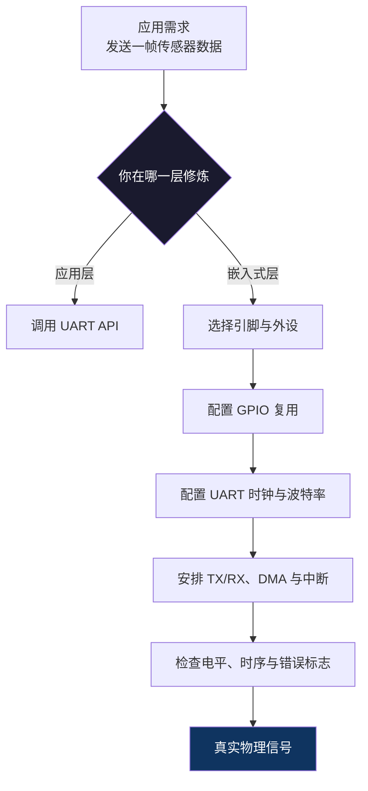

# 【元婴·17】为什么嵌入式工程师天生在元婴期
> **码农修仙传 · 元婴期 · 第17篇**
> 我是玄芯散人，带你从炼气修到大乘。

---

## 境界标识

```
╔══════════════════════════════════╗
║     元婴期 · 第17篇              ║
║     为什么嵌入式工程师天生在元婴期 ║
║     预计阅读：12分钟              ║
╚══════════════════════════════════╝
```

---

## 修仙引入

别人写程序，调用的是 `API`；嵌入式工程师写程序，拨动的是 `GPIO` 电平，配置的是寄存器，等待的是中断，安排的是 `DMA`，最后还要面对示波器上那条不肯消停的毛刺。

普通人写代码，是站在灵脉上施展法术；嵌入式工程师写代码，是亲手把功法刻进芯片，再让硅片里真正有电流流过。

这便是“元婴”的特殊性：神识离体，不只看得见软件，还能越过抽象层，俯身看见寄存器和晶体管。

我是玄芯散人，一名嵌入式系统工程师。今天不讲玄学，讲清楚：为什么嵌入式工程师天然站在软硬两界的交界，为什么这段主场非元婴期莫属。

---

## 硬核主体

### 脚踏两界：软件之上，硬件未远

先看普通应用开发。工程师通过操作系统、数据库、框架和 `API` 构造业务逻辑。一行 `request()` 下去，网络栈、驱动和网卡各自完成工作；多数时候，我们只需要知道接口的输入、输出与异常。

嵌入式开发却多了一层责任：你写的代码不仅要“正确”，还要在确定的芯片、时钟、引脚、电压和时序下正确。

一个普通程序说“把数据发出去”，可能只需调用通信库。嵌入式工程师却要继续追问：数据从哪个 `UART` 外设出去？波特率由谁分频？发送缓冲区空时，谁触发中断？`DMA` 在哪里搬运数据？引脚复用是否冲突？接收端采到的是稳定的高电平，还是一个被 EMI 抖出来的幻觉？

于是，同一个“点灯”就有了两种完全不同的修炼：

- 应用工程师看到的是 `LED_ON()`，这是调用宗门已经铸好的法器。
- 嵌入式工程师看到的是 `GPIO` 模式、输出类型、上下拉、翻转速度和 `ODR/BSRR` 寄存器，这是自己搭台、施法、验收。

这不是多背了几个 `API`，而是世界观发生了变化：你开始把“软件状态”翻译成“物理状态”，把逻辑上的 `0/1` 翻译成芯片引脚上的电压。

```c
/* STM32F4 风格的寄存器配置示例：芯片头文件提供具体地址与位定义。 */
#include "stm32f4xx.h"

#define LED_PIN 5U

static void led_init(void)
{
    /* 先开启 GPIOA 外设时钟，否则修改引脚寄存器就像灵脉尚未接驳。 */
    RCC->AHB1ENR |= RCC_AHB1ENR_GPIOAEN;

    /* 清除 PA5 原来的两位模式，再设置为通用输出模式。 */
    GPIOA->MODER =
        (GPIOA->MODER & ~(3U << (LED_PIN * 2U))) |
        (1U << (LED_PIN * 2U));

    GPIOA->OTYPER &= ~(1U << LED_PIN); /* 推挽输出。 */
    GPIOA->OSPEEDR &= ~(3U << (LED_PIN * 2U)); /* 采用较低默认速度。 */
    GPIOA->PUPDR &= ~(3U << (LED_PIN * 2U)); /* 无上下拉。 */
}

int main(void)
{
    led_init();

    while (1) {
        GPIOA->BSRR = 1U << LED_PIN;       /* 置位 PA5：原子地点亮 LED。 */
        GPIOA->BSRR = 1U << (LED_PIN + 16U); /* 写 BSRR 高位：原子地熄灭 LED。 */
    }
}
```

这里最值得修炼的不是某一位，而是顺序思维：先使能时钟，再配置引脚；先改 `MODER` 的目标位，最后才操作 `BSRR`。如果顺序错了，寄存器不会报错，示波器也不会安慰你——它只会冷冷地告诉你：没有波形。

这就是嵌入式工程师的日常：抽象层不再替你兜底。代码有 Bug，芯片通常不会“抛异常”；外设还在运行，函数也可能已经返回；你甚至会遇到一种最让纯软件工程师费解的情况——程序逻辑完全正确，硬件就是不动。



所谓元婴，不是背得动多少术语，而是能沿着因果链向下穿透：代码写进 Flash，取指后改变寄存器，寄存器驱动逻辑门，逻辑门控制晶体管，最终表现为引脚上的电压变化。越往下，抽象越薄，物理约束越硬。

### 修炼日常：别人看日志，我看时序

我做嵌入式之后，看待世界多了一把“尺子”：时间。

这段任务必须在 `50 μs` 内响应；这个脉冲至少保持 `2 μs`；`I2C` 的上升时间不能太慢，否则信号在板级线路上会被“拖成事故”；电机控制循环晚了几个微秒，电流波形就会畸变；FreeRTOS 的 `vTaskDelay()` 语义不同，周期任务甚至可能从 `10 ms` 悄悄变成 `20 ms`。

这便是实时性的世界观：嵌入式系统不是只追求“最终算对”，还追求“在窗口之内发生”。

#### Datasheet：天地法则原文

普通开发者遇到不清楚的 API，会看文档或源码。嵌入式工程师还要读 Datasheet、Reference Manual、Errata、原理图和 PCB 注释。

Datasheet 不是一本从头读到尾的故事书。真正有效率的读法是先建立约束地图：

1. **Memory Map**：寄存器位于哪里，访问宽度是 8/16/32 位，还是需要特殊对齐？
2. **Clock Tree**：外设时钟从 `HSE/HSI/PLL` 哪条路径来，频率能否满足要求？
3. **Electrical Characteristics**：输出电流多大，输入高电平阈值多少，某个电压下还能不能正常工作？
4. **Alternate Function**：这个引脚究竟能接 `UART1_TX`，还是已经被 `SWD` 或其他外设占用？
5. **Errata**：芯片写明支持某项特性，但某个 silicon revision 偏偏就是有问题。

能把“能跑”变成“在边界内稳定跑”，才算读懂了天地法则。

#### 中断：管理天道的紧急信号

中断不是普通的函数调用。普通函数调用往往有稳定调用栈；中断却可能在任何指令边界到来，进入后只拥有有限现场、资源和时间。

一个合格的中断服务函数，通常有三个原则：

- 足够快，只完成清标志、读取硬件等不可延迟动作。
- 不做长时间计算，不分配大内存，不打印日志，不调用有不确定延迟的阻塞 API。
- 把复杂任务通过 `task notification`、消息队列或 `Event Group` 交给任务上下文。

```c
/* 伪代码：展示 ISR 与主任务协作的边界，
 * 具体外设寄存器名称会因 MCU 型号而变化。
 */
void UART_IRQHandler(void)
{
    uint32_t status = mock_uart->STATUS; /* 一次性读取并锁存中断状态。 */

    if (status & UART_RX_READY) {
        uint8_t byte = mock_uart->RX_DATA; /* 快速取走硬件数据，防止溢出。 */
        mock_uart->FLAG_CLEAR = UART_RX_READY; /* 清除标志，避免重复进入 ISR。 */
        uart_rx_queue_send_from_isr(byte); /* 快速移交：唤醒主任务处理。 */
    }
}

void uart_task(void *arg)
{
    uint8_t byte;

    for (;;) {
        if (uart_rx_queue_receive(&byte, 100 / portTICK_PERIOD_MS)) {
            parse_sensor_byte(byte); /* 复杂解析留给任务上下文。 */
        }
    }
}
```

“元婴出窍后要收放自如”：中断处理也如此。硬件只负责敲钟，真正读经、施法、归档，都别全塞进钟楼里。

#### DMA：元婴的分身搬运术

没有 `DMA` 时，CPU 亲自搬运每一个字节，像修士用双手把灵石一趟趟搬进洞府。数据量一大，双手就成了瓶颈。

`DMA` 控制器则像元婴分出的化身：CPU 告诉它源地址、目标地址、传输长度和方向，它便在外设与 Memory 之间搬运。CPU 终于可以去计算、去调度、去处理协议。

但“把数据交出去”不等于“项目完成了”。嵌入式工程师仍要配置通道、仲裁、地址增量、缓冲区模式和对齐；处理半传输完成、传输完成、总线错误和 FIFO 溢出；处理 Cache 一致性；处理循环缓冲区“生产者追着消费者跑”的竞态。

这里和元婴法术一样，力量越强，约束越细。`DMA` 搬得很快，但若双方约定不清，它也会把错误高速复制一千遍。

### 功耗：元婴也要计算每一次呼吸

服务器工程师常把功耗交给机房和散热系统，嵌入式工程师却必须亲手计算。产品用两节 `5 号电池` 还是纽扣电池？传感器多久唤醒一次？无线模块以多大功率发射？一次完整采样要运行多久？进入低功耗后，RAM 是否保持，RTC 是否继续，某个 GPIO 是否仍然漏电？

嵌入式里的功耗不是一句“开启省电模式”就能解决。开发者要在测量数据上建模：唤醒时间、稳态电流、峰值电流、休眠电流和电池容量共同决定续航。

例如，设备平均需要 `10 mA` 时看起来不吓人，但若每分钟只工作 `100 ms`，其余 `59.9 s` 都能进入 `10 μA` 的深睡眠，平均电流就会大幅下降。真正高阶的嵌入式优化，不只是让算法跑快，而是让芯片在正确的时间醒来、完成工作、迅速睡去。

这也解释了为什么“更低的时钟频率”不必然等于“更低的总功耗”：如果降低主频导致任务迟迟无法结束，设备可能要在高功耗态停留更久。反之，适度提高频率、缩短执行时间，再立刻进入深度睡眠，反而可能更省电。嵌入式优化从来不是单变量竞赛，而是系统账本。

### 确定性：知道什么时候一定发生

“平均延迟很低”与“任何一次都不超过截止时间”是两回事。嵌入式系统尤其看重 worst-case：最慢情况下，中断多久能到？Flash 在低温或高压下读取会不会变慢？队列满时，任务会不会无限等待？无线丢包后，重传是否挤占关键控制周期？

因此，我们会用 `WCET`（Worst-Case Execution Time，最坏情况执行时间）估算关键代码，为任务设置合适优先级，限制中断嵌套和临界区长度，设计环形缓冲区与超时机制。元婴期的“神机妙算”不是预知未来，而是把不确定性拆开：哪些可以统计，哪些必须设上限，哪些绝不能赌。

### 差异不在学历，而在因果闭环

嵌入式不是某个语言，也不是某款芯片。它是一种从需求一路追到物理结果的工程方法。

普通程序员的终点，常常是“接口能返回正确数据”；嵌入式工程师的终点则是“物理世界能稳定、可预测地做对事”。

做板级调试时，我常在日志、原理图、寄存器手册和示波器之间来回切换。软件日志说“传感器超时”，示波器说“时钟没起来”；寄存器显示中断已挂起，原理图却揭示中断脚根本没有焊通；代码检查完全通过，电源纹波却让 ADC 采样集体离家出走。

那一刻修的不是一条语句，而是完整因果链：板 → 芯片 → 总线 → 寄存器 → 驱动 → 中断 → 应用 → 物理量。

这正是嵌入式最深的护城河。不是“会几个外设”，而是能够建立闭环：

> 现象是什么？假设是什么？哪个测量能证伪？改哪一层？改完如何回归？

很多人把嵌入式想成“调寄存器”，其实寄存器只是门槛。真正的差异是：你能同时用软件、电气、时序和系统状态解释同一个问题。

### 嵌入式 + AI：我为什么把这里当成主场

过去，AI 推理大多运行在 GPU、服务器和云端；现在，越来越多模型开始进入 MCU、边缘 NPU、摄像头和机器人控制板。AI 不再只存在于聊天窗口里，它要进入有电、有噪声、有散热、有成本的真实世界。

在服务器上，“一次推理慢 20 ms”可能只是性能问题；在电机控制里，这个延迟可能意味着系统错过控制周期；在电池设备上，多唤醒一次都可能决定产品续航；在产线视觉里，漏掉一帧可能就漏掉一个缺陷。

嵌入式 + AI 的交汇点，恰好需要两套能力：

- 嵌入式告诉你资源、功耗、实时性、驱动与硬件边界。
- AI 告诉你模型、量化、算子、部署与推理效率。

不懂硬件，算法工程师容易把真实世界当成分布式服务器；不懂算法，嵌入式工程师又可能守着高性能芯片，却只会把 demo 跑通。

我的主场就在这里：用 `C/C++`、RTOS、Linux Driver、BSP 理解系统，再用 AI 重新定义嵌入式的能力上限。

### 一条可落地的修炼路径

不要一开始就挑战“宇宙级架构”。元婴也是从一盏 LED 点起来的。

| 阶段 | 目标 | 核心修炼 | 验收结果 |
|---|---|---|---|
| 第一层：点灵灯 | 点亮 LED | `GPIO`、时钟树、交叉编译、烧录、调试器 | 修改寄存器让 LED 可控闪烁 |
| 第二层：传讯 | 打通通信 | `UART`、SPI、I2C、协议、示波器 | 读取真实传感器或控制外设 |
| 第三层：应劫 | 处理异步事件 | 中断、定时器、去抖、临界区 | 外部事件在规定时间内被处理 |
| 第四层：分身 | 多任务协作 | 队列、信号量、RTOS、优先级反转 | 周期任务稳定，任务间不竞态 |
| 第五层：筑基台 | 掌握 BSP | Bootloader、Linker Script、启动文件、Memory Map | 能分析启动、映射与复位流程 |
| 第六层：御灵 | 写 Driver/Firmware | Linux Device Model、DMA、IOMMU、电源管理 | 稳定驱动真实外设 |

每一层都要有实物验收。能说清 `I2C` 的起始位不算毕业；用逻辑分析仪抓到它，才算入门；能解释地址冲突为什么让 ACK 消失，才有了一点元婴神识；能同时判断是软件时序、板上电平还是芯片勘误，才算真正脚踏两界。

---

## 修仙术语对照表

| 修仙术语 | 技术现实 | 本篇详解 |
|---|---|---|
| 元婴 | 能跨软硬件抽象层思考的嵌入式工程能力 | 脚踏软件与物理世界两界 |
| 神识离体 | 对代码执行链和硬件时序的端到端感知 | 从 C 代码追到引脚电平 |
| 界域修士 | 嵌入式系统/BSP/驱动工程师 | 同时面对编译器、芯片、电路与协议 |
| 天地法则原文 | Datasheet / Reference Manual / Errata | 寄存器、电气特性与勘误的权威来源 |
| 调整法则参数 | 配置时钟、GPIO、UART、DMA 等寄存器 | 每一位都有硬件后果 |
| 天道警讯 | Interrupt / Exception | 外部或内部事件打断当前执行流 |
| 元婴分身 | DMA / 多核 / 外设自治 | 在 CPU 忙其他任务时搬运或处理数据 |
| 灵脉基座 | BSP（Board Support Package） | 初始化板级硬件并向 OS 提供支撑 |
| 御灵术 | Device Driver | 把统一 OS 接口翻译成具体硬件操作 |
| 推演天机 | 软硬件联合调试 | 用日志、测量与实验逐步验证因果 |
| 嵌入式 + AI | 边缘智能、端侧推理、具身智能 | 资源、实时性与模型能力的交汇 |

---

## 突破条件

别用“看过多少文档”衡量境界，用是否能完成一个闭环来衡量：

- [ ] 看懂原理图，知道 MCU 的时钟、复位、启动模式和关键外设连接
- [ ] 能从 Datasheet 找到寄存器地址、位域含义、访问限制和 Errata
- [ ] 独立完成一个 LED + UART 小项目，而不是只复制教程代码
- [ ] 理解中断优先级、临界区、ISR 约束和 `volatile` 的真实含义
- [ ] 能用示波器或逻辑分析仪验证 UART、SPI、I2C 的真实波形
- [ ] 知道 `DMA` 的数据流，并处理过半、溢出、竞态和 Cache 一致性
- [ ] 遇到“软件看起来没问题”时，会主动检查电源、时钟、引脚复用和硬件勘误
- [ ] 能解释一段嵌入式代码如何最终改变一个物理量

> 八项不必第一天全部做到，但每一项都要能落到板子、波形或测量数据上。能建立因果闭环，你就不只是“写固件的”，而是真正进入了元婴期。

---

## 下期预告 + 互动

> **下一篇：【元婴·18】ARM vs RISC-V大战**

同一个需求，为什么有的芯片选择 ARM，有的押注 RISC-V？ISA 到底开放了什么，又有哪些东西不是开源 ISA 一句“免费”就能解决的？

下篇拆开 ARM 宗门与 RISC-V 新教的功法、授权、生态和商业路线，看看下一场芯片世界的门派之争。

现在问你：**你第一次读 Datasheet、烧录程序或抓波形时，最大的“原来如此”是什么？你觉得嵌入式最难的，是寄存器、C、实时性，还是Debug？**

欢迎在评论区留下你的“渡劫现场”。

---

*本文是「码农修仙传」系列第17篇。系列导航见 [xren.ren](https://xren.ren)*