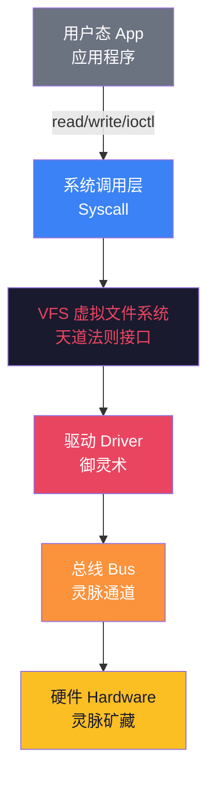
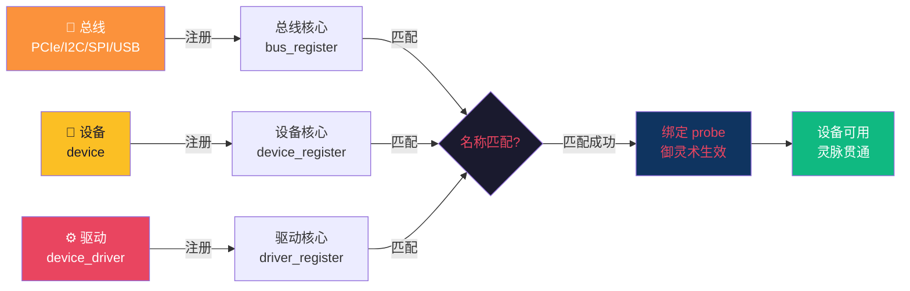
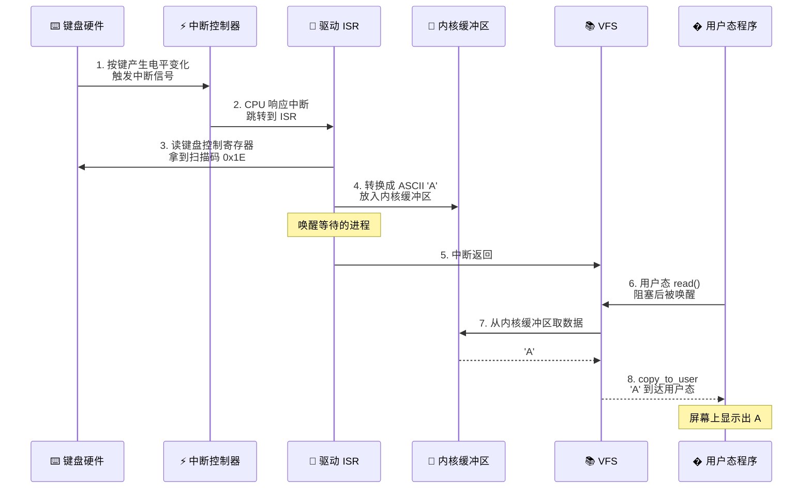
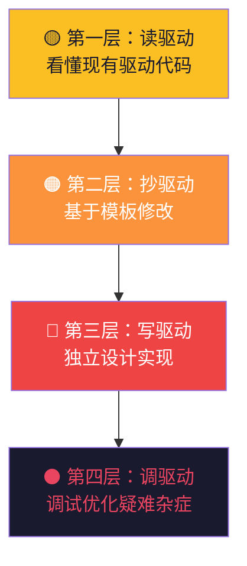
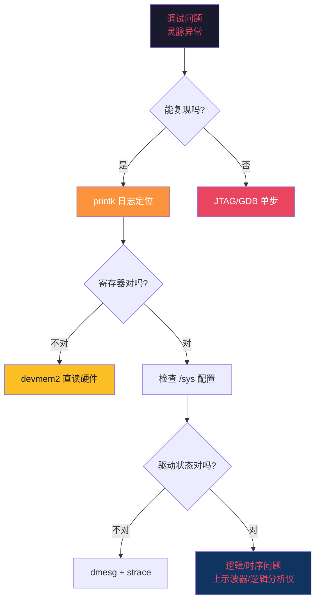

# 【元婴·19】驱动开发：沟通硬件的御灵术

> **码农修仙传 · 元婴期 · 第19篇**
> 我是玄芯散人，带你从炼气修到大乘。

---

## 境界标识

```
╔══════════════════════════════════╗
║     元婴期 · 第19篇              ║
║     驱动开发：沟通硬件的御灵术    ║
║     预计阅读：15分钟              ║
╚══════════════════════════════════╝
```

---

## 修仙引入

天道高高在上，能调动世间万物。法则条文清清楚楚写着："这块灵脉属于你，那条灵泉归我管。"

但天道终究不是矿工。法则再完备，也得有人蹲在矿洞里一镐一镐地把灵矿挖出来。这个蹲矿洞的人，就是**驱动**。

驱动开发是嵌入式/底层工程师的核心修为，也是元婴期的硬核大考——你不再只是看灵脉流转，而是亲手调度灵脉。本篇讲清楚：驱动是什么，Linux 驱动模型长什么样，一条数据怎么从硬件穿越到用户态，以及裸机世界里的"蛮荒御灵"。

---

## 硬核主体

### 驱动是什么——天道和硬件之间的翻译官

先给个定义，看完你就能跟人讲清楚驱动的本质：

**驱动（Driver）= 操作系统内核中专门负责操作某类硬件的代码段。**

注意三件事：
1. 驱动是内核代码，不是用户态程序。它跑在天道法则内部。
2. 驱动是为某一类硬件服务的——不同硬件有不同驱动。网卡有网卡驱动，键盘有键盘驱动，USB 摄像头有 USB 摄像头驱动。
3. 驱动的工作是让 OS 能操作硬件——没有驱动，OS 知道"我应该点亮这颗 LED"，但不知道怎么点亮。

如果 OS 是天道，硬件是灵脉矿藏，那驱动就是"御灵术"——天道调令要靠御灵术才能真正撼动灵脉，OS 的系统调用要靠驱动才能真正打到硬件上。

来一张图看清位置：



最下面那一层（橙色 → 黄色），就是驱动 + 总线 + 硬件。驱动是连接软件世界和硬件世界的桥。这座桥塌了，OS 就"失明失聪"——它以为自己有网卡，其实网卡就是块废铁。

没有驱动的 OS，只有法则没有手。它知道要干什么，但干不了。这跟修仙小说里的元婴修士一个道理——神识再强，调动不了灵矿，也只是空有修为。

---

### Linux 驱动模型——bus、device、driver 三界归一

Linux 内核的驱动模型，是嵌入式工程师必须搞懂的底层骨架。它的核心思想只有一句话：把硬件、驱动、连接通道分开管理，靠匹配机制自动绑定。

三个角色：

| 角色 | 职责 | 修仙类比 |
|------|------|---------|
| **Bus（总线）** | 提供设备与驱动的匹配通道 | 灵脉通道——连接灵矿和御灵术 |
| **Device（设备）** | 描述"这里有个什么硬件" | 灵脉矿藏的档案——告诉天道这块矿的属性 |
| **Driver（驱动）** | 描述"我能驾驭这种硬件" | 御灵术——告诉天道怎么调度这块矿 |

三者关系是这样的：



工作流程：
1. **总线初始化**：系统启动时扫描 PCI/USB/I2C 等物理总线，发现上面的设备
2. **设备注册**：每个发现的设备被注册进设备模型，名字叫 "i2c-3:48" 之类的
3. **驱动注册**：每个加载的驱动也注册进驱动模型，声明"我能驾驭这种设备"
4. **匹配**：内核拿设备的 ID 表和驱动的 ID 表去匹配
5. **绑定（probe）**：匹配成功则调用驱动的 probe 函数，初始化硬件
6. **可用**：从这一刻起，用户态程序就能用这个设备了

Linux 设备模型的核心思想：总线负责牵线，设备介绍自己，驱动亮出本事，相中了就合作。

---

### file_operations——驱动的看家本领

驱动注册进内核之后，对外暴露什么接口？——`file_operations` 结构体。

这是 Linux 字符设备驱动的核心结构，每个成员是一个函数指针，对应一个文件操作：

```c
// Linux 字符设备驱动的核心结构体
// 御灵术的招式表 —— 每个函数指针就是一招
struct file_operations {
    int (*open)(struct inode *, struct file *);              // 打开设备
    ssize_t (*read)(struct file *, char __user *, size_t, loff_t *);    // 读取数据
    ssize_t (*write)(struct file *, const char __user *, size_t, loff_t *); // 写入数据
    long (*unlocked_ioctl)(struct file *, unsigned int, unsigned long);  // 控制命令
    int (*release)(struct inode *, struct file *);           // 关闭设备
    // 还有更多：poll/lseek/mmap/flush ...
};
```

把它翻译成修仙术语：

| 函数指针 | 作用 | 修仙类比 |
|---------|------|---------|
| `open` | 初始化设备、建立连接 | 开山引灵——凿开灵脉 |
| `read` | 从硬件读数据到用户空间 | 取灵——从灵矿搬运灵力 |
| `write` | 把用户数据写入硬件 | 灌灵——把灵力注入灵矿 |
| `ioctl` | 发送特殊控制命令 | 调阵法——不靠常规读写的高级指令 |
| `release` | 关闭设备、释放资源 | 闭山归元——灵脉封山 |

一个最小的字符设备驱动示例（伪代码版）：

```c
#include <linux/fs.h>      // file_operations 所在
#include <linux/cdev.h>    // 字符设备结构

// 全局缓冲区 —— 灵脉上的灵力池
static char kernel_buf[1024];

// open：开山引灵
static int mydev_open(struct inode *inode, struct file *filp) {
    printk(KERN_INFO "mydev: open called\n");
    return 0;  // 0 表示成功
}

// read：从灵脉取灵力到用户空间
static ssize_t mydev_read(struct file *filp, char __user *buf,
                          size_t count, loff_t *ppos) {
    // copy_to_user 把内核数据搬到用户空间
    // 把内核数据搬到用户空间
    int ret = copy_to_user(buf, kernel_buf, count);
    return count;  // 返回实际读取字节数
}

// write：从用户空间灌灵力到灵脉
static ssize_t mydev_write(struct file *filp, const char __user *buf,
                           size_t count, loff_t *ppos) {
    // copy_from_user 把用户数据搬到内核
    int ret = copy_from_user(kernel_buf, buf, count);
    return count;
}

// ioctl：调阵法 —— 发送特殊命令
static long mydev_ioctl(struct file *filp, unsigned int cmd,
                        unsigned long arg) {
    switch (cmd) {
        case 1: printk("御灵：启动\n"); break;
        case 2: printk("御灵：停止\n"); break;
        default: return -EINVAL;
    }
    return 0;
}

// release：闭山归元
static int mydev_release(struct inode *inode, struct file *filp) {
    printk(KERN_INFO "mydev: release called\n");
    return 0;
}

// 招式表：把上面这些函数登记成"驱动的看家本领"
static struct file_operations mydev_fops = {
    .owner   = THIS_MODULE,
    .open    = mydev_open,
    .read    = mydev_read,
    .write   = mydev_write,
    .unlocked_ioctl = mydev_ioctl,
    .release = mydev_release,
};

// 注册字符设备（简化版）
static int __init mydev_init(void) {
    register_chrdev(240, "mydev", &mydev_fops);  // 主设备号 240
    printk(KERN_INFO "mydev: registered\n");
    return 0;
}

static void __exit mydev_exit(void) {
    unregister_chrdev(240, "mydev");
    printk(KERN_INFO "mydev: unregistered\n");
}

module_init(mydev_init);
module_exit(mydev_exit);
MODULE_LICENSE("GPL");
```

这段代码一旦加载（`insmod`），用户态就能用 `open("/dev/mydev")` 打开它，再 `read/write/ioctl` 跟它交互。看起来简单的五行接口，背后是天道法则的调用链：

用户态 `read()` → `sys_read` 系统调用 → VFS → `mydev_fops.read` → `copy_to_user` → 用户拿到数据。

整条链路里，驱动是唯一跟硬件直接打交道的环节。

---

### 从硬件到驱动——一条数据的旅程

光看 file_operations 还是有点抽象。让我们跟踪一个真实的场景：用户按下一个键盘按键，字符 'A' 是怎么从硬件到达你的屏幕的？

完整旅程：



逐环节拆解：

1. 硬件产生数据

你按下 'A' 键，键盘里的扫描芯片识别按键位置，编码成"扫描码"通过 USB/I2C 总线发给主机的键盘控制器。物理动作 → 电信号 → 数字编码。

2. 中断信号

键盘控制器收到数据后，向 CPU 的中断控制器（如 ARM 的 GIC、x86 的 APIC）发出中断请求（IRQ）。这是"灵脉有动静，要请天道处置"。

3. CPU 响应中断

CPU 在每条指令结束时检查是否有中断。如果有，就保存当前上下文（寄存器、程序计数器），跳转到内核预设的中断处理入口。

4. ISR 处理

驱动注册的中断服务程序（ISR）被调用。它从硬件寄存器读出扫描码 0x1E，转换成 ASCII 'A'，放入内核的"输入缓冲区"（一个环形队列），然后唤醒正在等待输入的用户进程。

5. 中断返回

ISR 处理完，恢复之前的上下文，CPU 继续执行被打断的代码。从用户进程角度看，read() 调用从阻塞中被唤醒。

6. 数据拷贝到用户态

VFS 调用驱动的 read 函数，驱动从内核缓冲区取数据，通过 `copy_to_user` 拷贝到用户空间的 buffer。

7. 用户态拿到数据

用户态的 read() 返回，程序拿到字符 'A'，把它显示在屏幕上。

整个旅程，从物理按键到屏幕显示，毫秒级完成。其中驱动参与了两次：一次在中断里（ISR），一次在 read 里（数据搬运）。其他环节都是 OS 内核的基础设施。

驱动工程师必须懂中断，因为硬件事件是异步的，驱动要把它转成同步的数据流喂给应用。

---

### 中断——御灵术的"紧急传讯"

中断这块必须单独说，因为它是驱动开发的核心机制。

为什么需要中断？

想象没有中断的世界：CPU 必须不停地"轮询"键盘——"有按键吗？没有。有按键吗？没有……"。99% 的轮询都是浪费，CPU 干不了别的活。

中断是硬件主动通知 CPU 的机制——"有事！停下你干的活，先处理我"。CPU 处理完再回去干原来的活。

Linux 驱动的中断注册：

```c
// 注册中断服务程序
// 御灵术的"紧急传讯令"
int request_irq(unsigned int irq,                // 中断号
                irq_handler_t handler,           // ISR 函数指针
                unsigned long flags,             // 触发方式（上升沿/电平）
                const char *name,                // 中断名字
                void *dev)                       // 私有数据
```

一个真实的按键中断驱动片段：

```c
// 按键中断 ISR —— 御灵术紧急传讯
static irqreturn_t button_isr(int irq, void *dev_id) {
    struct button_dev *bdev = (struct button_dev *)dev_id;

    // 1. 读硬件寄存器，确认中断源（去抖）
    int val = gpio_get_value(bdev->gpio_pin);

    // 2. 唤醒等待的读进程
    wake_up_interruptible(&bdev->wait_queue);

    // 3. 通知上半部处理（延迟工作）
    schedule_work(&bdev->work);

    return IRQ_HANDLED;  // 告诉内核"我处理完了"
}

// 初始化时注册中断
static int __init button_probe(struct platform_device *pdev) {
    struct button_dev *bdev = ...;

    int irq = gpio_to_irq(bdev->gpio_pin);  // GPIO 转中断号
    int ret = request_irq(irq, button_isr,
                          IRQF_TRIGGER_FALLING,  // 下降沿触发
                          "mybutton", bdev);
    if (ret) {
        dev_err(&pdev->dev, "request_irq failed\n");
        return ret;
    }
    return 0;
}
```

注意 ISR 里的两条铁律：
1. ISR 里不能做耗时操作——中断里阻塞会卡死整个系统。所以 `schedule_work` 把重活儿扔给下半部（workqueue/tasklet）。
2. ISR 里不能 sleep——中断上下文不允许睡眠。所以 `copy_to_user` 这种需要可能睡眠的操作不能在 ISR 里做。

上半部（top half）做最紧急的事：清中断标志、读关键寄存器、唤醒等待进程。
下半部（bottom half）做耗时的活：通过 workqueue/tasklet/softirq 延迟执行。

---

### 嵌入式中的裸机驱动——蛮荒御灵术

上面讲的全是 Linux 驱动——有 OS 罩着。但元婴期更硬核的一关是**裸机驱动**——没有 OS，你就是 OS。

裸机驱动的特点：
1. 没有 OS 保护——你写错一个寄存器，整个系统就死
2. 没有 syscall 接口——应用直接调驱动函数（库函数形式）
3. 没有内存管理——所有内存你自己分配，可能踩到硬件寄存器
4. 没有调度器——main 函数里的 `while(1)` 就是你的整个系统

来一段 STM32 点亮 LED 的代码：

```c
// 裸机 GPIO 操作 —— 直接写寄存器地址
// 蛮荒世界的御灵术：没有天道保护，每一步都可能坠入深渊

// STM32F4 的 GPIOA 基地址（从芯片手册得来）
#define GPIOA_BASE    0x40020000
#define RCC_BASE      0x40023800

// GPIOA 模式寄存器偏移 0x00
#define GPIOA_MODER   (*(volatile uint32_t *)(GPIOA_BASE + 0x00))
// GPIOA 输出寄存器偏移 0x14
#define GPIOA_ODR     (*(volatile uint32_t *)(GPIOA_BASE + 0x14))
// GPIOA 时钟使能寄存器
#define RCC_AHB1ENR   (*(volatile uint32_t *)(RCC_BASE + 0x30))

void led_init(void) {
    // 第一步：使能 GPIOA 时钟（蛮荒世界的灵力通道要先打通）
    RCC_AHB1ENR |= (1 << 0);

    // 第二步：配置 PA5 为输出模式（把灵脉引向 LED）
    // MODER 每两位控制一个引脚，01 = 输出
    GPIOA_MODER &= ~(0b11 << (5 * 2));  // 清零
    GPIOA_MODER |=  (0b01 << (5 * 2));  // 置位
}

void led_on(void) {
    GPIOA_ODR |= (1 << 5);   // BS5 位置 1，PA5 输出高电平，LED 亮
}

void led_off(void) {
    GPIOA_ODR &= ~(1 << 5);  // BS5 位清零，PA5 输出低电平，LED 灭
}

int main(void) {
    led_init();   // 初始化灵脉
    while (1) {   // 蛮荒修士的修炼循环
        led_on();
        delay_ms(500);   // 简陋的延时
        led_off();
        delay_ms(500);
    }
}
```

三件事很关键：
1. `volatile` 关键字——告诉编译器"这个变量会被硬件改变，别优化掉"。没有它，编译器可能把 `GPIOA_ODR |= (1 << 5)` 优化掉。
2. 地址是死的——0x40020000 是硬件手册里写死的，不是 malloc 出来的。踩错地址直接死机。
3. 没有错误处理——OS 里有 `request_irq` 返回值检查，这里只能靠手册读得仔细。

裸机开发的真功夫是读 Datasheet——几十页到几百页的芯片手册，把每个寄存器的每一位摸清楚。修仙类比就是读"灵脉图录"——每一道灵脉的走向、容量、禁忌都记下来。

---

### 驱动开发的修炼心法——四步走

从看懂驱动到能写驱动，再到写出工业级驱动，分四层修炼：



第一层：读驱动

从内核源码里读现有驱动。Linux 的 `drivers/` 目录是宝库——`drivers/input/keyboard/` 下面有几十种键盘驱动，每一种都是一份驱动作文的范本。先读懂 `gpio_keys.c` 这种简单的，再读 `i2c/` 下的复杂驱动。

第二层：抄驱动

基于现有模板改。把 `gpio_keys.c` 复制一份，改成自己的板子支持的按键。这是初学者最快的进步路径。

第三层：写驱动

能独立设计 `file_operations`，处理 probe/remove、电源管理、错误恢复、并发同步。这是驱动工程师的"出师"标准。

第四层：调驱动

能调疑难杂症：中断不触发、DMA 不工作、时序错乱、内存泄漏。这是元婴后期的硬功夫，需要对硬件、内核、编译器、CPU 都有深入理解。

90% 的嵌入式工程师停在第三层。第四层的调试功夫，是"御灵术"的真正登峰造极——灵脉出问题时，你能看出是矿藏的问题、通道的问题、还是法术的问题。

---

### 调驱动的法器——四大调试神兵

驱动跑起来容易，跑对了难。元婴期御灵师必须掌握四件调试法器：

第一件：printk —— 御灵日志

```c
// 内核里的 print，对标用户态的 printf
// 御灵日志：每召必应，写到内核环形缓冲区
printk(KERN_INFO "mydev: probe called, irq=%d\n", irq);
printk(KERN_ERR "mydev: request_irq failed: %d\n", ret);

// 用户态用 dmesg 查看 —— 查看天道日志
// $ dmesg | grep mydev
// mydev: probe called, irq=42
// mydev: request_irq failed: -16
```

日志级别八个：`KERN_EMERG` / `KERN_ALERT` / `KERN_CRIT` / `KERN_ERR` / `KERN_WARNING` / `KERN_NOTICE` / `KERN_INFO` / `KERN_DEBUG`。开发用 `KERN_DEBUG`，产品用 `KERN_INFO`/`KERN_ERR`。

第二件：/proc 和 /sys —— 灵脉状态窗

调试驱动时常常要暴露内部状态给用户态。两种标准接口：

```c
// /proc 接口 —— 一次性快照
static int mydev_proc_show(struct seq_file *m, void *v) {
    seq_printf(m, "irq_count: %lu\n", irq_count);
    seq_printf(m, "last_value: %d\n", last_value);
    return 0;
}

// /sys 接口 —— 属性文件，可读可写
static ssize_t mydev_value_show(struct device *dev,
                                struct device_attribute *attr,
                                char *buf) {
    return sprintf(buf, "%d\n", mydev.value);
}
static DEVICE_ATTR_RO(mydev_value);
```

`/proc` 适合一次性输出（"现在状态怎么样"），`/sys` 适合可调参数（"实时修改某个寄存器值"）。

第三件：devmem2 / devmem —— 直接读寄存器

调试硬件寄存器最快的方法是直接读寄存器。用户态工具 `devmem2`：

```bash
# 读 0x40020014（GPIOA_ODR）的值
$ devmem2 0x40020014 w
Value at 0x40020014 (0xb6f9e014): 0x20
# 0x20 = 0b00100000 → PA5 高电平 → LED 亮着
```

这一招能直接看到硬件的真实状态，绕过驱动，绕过缓存。在驱动不响应、寄存器被踩错时，这一招救命。

第四件：JTAG / SWD + GDB —— 元神出窍

最硬的调试是源码级调试。JTAG（x86/ARM 调试口）或 SWD（ARM 串行调试）连上调试器，配合 GDB 能单步、看寄存器、看内存、看变量。这相当于"元神出窍"——你的神识直接附在被调试的 CPU 上，看着每一条指令执行。

```bash
# arm-none-eabi-gdb 启动
$ arm-none-eabi-gdb vmlinux
(gdb) target remote :3333    # 连 OpenOCD
(gdb) break mydev_isr         # 在 ISR 打断点
(gdb) continue
(gdb) print irq_count         # 看变量
(gdb) info registers          # 看所有寄存器
```

四件法器的协作关系：



调驱动的真功夫不是会用工具，是知道先用哪个。能复现的问题先 printk；不能复现的疑难杂症直接 JTAG；怀疑硬件寄存器被踩就 devmem2 直读；时序问题必须上示波器看波形——光看代码看不出来。

---

## 修仙术语对照表

| 修仙术语 | 技术现实 | 本篇详解 |
|---------|---------|---------|
| 天道法则 | 操作系统内核 | §驱动是什么 |
| 灵脉矿藏 | 物理硬件 | §驱动是什么 |
| 御灵术 | 驱动（Driver） | 全篇主线 |
| 灵脉通道 | 总线（Bus） | §Linux 驱动模型 |
| 灵矿档案 | Device（设备描述） | §Linux 驱动模型 |
| 御灵术招式表 | `file_operations` 结构 | §file_operations |
| 紧急传讯 | 中断（IRQ） | §中断 |
| 上半部/下半部 | Top half / Bottom half | §中断 |
| 开山引灵 | open() | §file_operations |
| 取灵 | read() | §file_operations |
| 灌灵 | write() | §file_operations |
| 调阵法 | ioctl() | §file_operations |
| 闭山归元 | release() | §file_operations |
| 蛮荒御灵 | 裸机驱动（无 OS） | §裸机驱动 |
| 灵脉图录 | 芯片 Datasheet | §裸机驱动 |
| 御灵日志 | printk / dmesg | §调驱动法器 |
| 灵脉状态窗 | /proc / /sys 调试接口 | §调驱动法器 |
| 直读寄存器 | devmem2 工具 | §调驱动法器 |
| 元神出窍 | JTAG/SWD + GDB 源码级调试 | §调驱动法器 |

---

## 突破条件

要从驱动开发的小成跨入元婴后期的御灵大成，你需要：

- [ ] 能说清楚驱动在 OS 和硬件之间的角色和位置
- [ ] 理解 Linux 设备模型的三要素（bus / device / driver）和匹配机制
- [ ] 能完整写出 `file_operations` 的五个核心函数（open/read/write/ioctl/release）
- [ ] 理解中断的上下半部机制，知道 ISR 里能做什么不能做什么
- [ ] 能独立写一个 STM32 的 GPIO 裸机驱动（点亮 LED 算入门）
- [ ] 能读懂芯片 Datasheet 中关键章节（Clock/GPIO/Interrupt）
- [ ] 能用 `insmod` 加载一个字符设备驱动，并从用户态测试
- [ ] 能用 printk + dmesg 定位驱动初始化问题
- [ ] 知道 printk / /proc / /sys / devmem2 / JTAG 五大调试法器各自的适用场景

> 全勾完，你就能从"调 API 的修士"进阶成"调度灵脉的御灵师"。下一步是元婴终极大考——固件（Bootloader/UEFI），那是开天辟地的创世法术。

---

## 下期预告 + 互动

> **下一篇：【元婴·20】固件：开天辟地前最后一道工序**

按下电源键到屏幕亮起 Logo 中间发生了什么？
是固件在 OS 还没出生之前，独自把硬件从沉睡唤醒——初始化时钟、内存、外设，加载内核。
固件是软件最接近硬件的一层，也是元婴期的终极大考。
下一篇讲清楚：BIOS / UEFI / U-Boot 三种创世法的差异，从上电到 OS 运行的完整链路。

现在问你：

> 🎮 御灵初试：你写过驱动吗？写过哪类驱动（字符/块/网络）？在评论区晒出你的第一段驱动代码！
>
> 💬 话题：你被硬件坑过吗？驱动调不通、中断不触发、寄存器踩错……说出你的"灵脉翻车"经历，老司机来答疑！
>
> 🔔 关注玄芯散人，修炼不迷路。下一篇带你直击固件——元婴期的最后一关。

> 我是玄芯散人，带你从炼气修到大乘。

---

*本文是「码农修仙传」系列第19篇。系列导航见 [xren.ren](https://xren.ren)*
