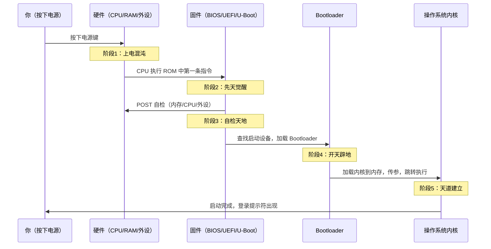

# 【元婴·20】固件：开天辟地前最后一道工序

> **码农修仙传 · 元婴期 · 第20篇**
> 我是玄芯散人，带你从炼气修到大乘。

---

## 境界标识

```
╔══════════════════════════════════╗
║     元婴期 · 第20篇               ║
║     固件：开天辟地前最后一道工序     ║
║     预计阅读：12分钟              ║
╚══════════════════════════════════╝
```

---

## 修仙引入

你按下电源键的那一秒——

屏幕是黑的，风扇没转，操作系统不存在，所有你熟悉的软件都还没诞生。整个宇宙是一片**混沌**。

但就在这片混沌里，已经有先民在默默做工了。

它们住在芯片最深处的只读存储器（ROM）里，名字古老而沉重：**BIOS、UEFI、U-Boot、Bare-metal**。它们是开天辟地之前那一缕最原始的元神——**固件（Firmware）**。

今天这篇，是元婴期最后一篇，也是终极大考。通过了，你就真正元婴大成，可以破境化神。过不了，前面 19 篇学的指令集、晶体管、驱动，全都只是没扎根的浮萍——因为这些知识要真正"活"起来，必须从固件这道工序开始。

记住一句话：软件世界的尽头是固件，固件世界的尽头是硬件。你是嵌入式出身，这是你的主场。

---

## 硬核主体

### 固件是什么——创世前的先民

先给定义：

> **固件（Firmware）= 固化在硬件里的软件，开机最先执行，是硬件和操作系统之间的桥梁。**

这个定义里有三个关键词：固化、最先、桥梁。

固化：固件不是存在硬盘上的（那是操作系统和应用），它存在 ROM、Flash、EPROM 这些"焊死在芯片里"的存储器上。哪怕你把硬盘全格了、哪怕操作系统完全没装，固件依然在芯片里等着——它是芯片的"先天记忆"。

最先：你按下电源，CPU 第一条执行的指令不是 `main()`，不是 `kernel_start`，而是固件里的代码。这是 CPU 设计的硬性约定：上电后 PC（程序计数器）指针强制指向某个固定地址，那个地址里住着固件。

桥梁：固件要做三件事——初始化硬件、自检、加载操作系统。它是"在 OS 出生前替它探路"的先民。

修仙类比放这里最贴切：

| 修仙概念 | 固件现实 |
|---------|---------|
| 混沌未开 | 硬件上电，但一切未初始化 |
| 先天先民 | 固件（BIOS/UEFI/U-Boot） |
| 开辟天地 | 固件初始化硬件、加载 OS |
| 天道法则建立 | 操作系统内核启动 |
| 众生开始修炼 | 用户态程序运行 |

你可以这样理解：操作系统是天道法则，但天道不是凭空出现的——它是先民（固件）开辟出来的。没有固件这个"创世神"，再漂亮的 Linux 内核也只是硬盘里一坨没用的比特。

### 启动链路——从按下电源到 OS 启动的完整旅程

这是元婴大考的核心。闭上眼跟我走一遍按下电源后，硬件世界发生了什么。

我把它分成五个阶段，每一步都有"先民"在做工：



**阶段一：上电混沌（Power-On）**

电源接通，所有芯片复位。CPU 的 PC 指针被硬件强制设为 `0xFFFFFFF0`（x86）或 `0x00000000`（ARM，取决于具体 SoC）——这个地址映射到 ROM 或 Flash，里面烧录着固件的第一条指令。

此时 RAM 里的内容是完全随机的（未初始化的），所有外设寄存器都是默认值。这就是"混沌"。

**阶段二：先天觉醒（ROM Code / Boot ROM）**

CPU 开始执行 ROM 中的代码。这段代码通常非常短（几 KB 以内），只做一件事：初始化最关键的硬件——主要是内存控制器（DRAM）和时钟。然后从下一个存储介质（通常是 Flash）加载更大的固件到 RAM 执行。

**阶段三：天地自检（POST / Power-On Self-Test）**

固件开始全面自检——内存是否正常？CPU 寄存器能不能读写？键盘鼠标在不在？硬盘能不能识别？这一步叫 POST（Power-On Self-Test）。听到主板"滴"一声，那就是 POST 通过。

**阶段四：开天辟地（Bootloader）**

POST 通过后，固件按预设顺序查找启动设备（硬盘/U 盘/网络/SD 卡），找到后读取第一阶段 Bootloader（比如 x86 上的 GRUB2、ARM 上的 U-Boot），加载到内存执行。Bootloader 再去加载操作系统内核（比如 Linux 内核的 `vmlinuz`）到内存，并把启动参数（rootfs 路径、命令行参数等）传给内核，最后跳转执行。

**阶段五：天道建立（OS 启动）**

内核接管 CPU，开始初始化所有子系统——进程管理、内存管理、文件系统、网络协议栈……一直到你看到登录提示符、敲下用户名密码，登录 shell 启动成功——天道法则终于建立完毕，众生可以开始修炼了。

五行修仙梗对应一下：

- 上电 = 混沌初开
- ROM 自举 = 先天觉醒
- POST 自检 = 天地自检
- Bootloader = 开天辟地
- OS 内核启动 = 天道法则建立

掌握这五阶段，元婴大考的内容你已经过了大半。

### BIOS vs UEFI——两种创世法的代际更替

固件不是铁板一块，它有代际。BIOS 和 UEFI 是两种截然不同的创世法。

**BIOS（Basic Input/Output System）**——上古创世法

出现于 1980 年代，统治 PC 界近 40 年。它是 **16 位实模式**的固件，只能访问 1MB 内存地址空间。配套使用的是 **MBR（Master Boot Record）** 分区表，最多支持 4 个主分区，单个分区最大 2TB。

UEFI 没普及前，全世界主板都是 BIOS。它稳定、简单、所有老硬件都兼容——但它老了。

**UEFI（Unified Extensible Firmware Interface）**——现代创世法

2000 年代由 Intel 牵头推出，现在是新主板的标配。它是 **32/64 位保护模式**，能访问全部内存。配套使用的是 **GPT（GUID Partition Table）** 分区表，支持 128 个分区，单分区最大 18EB（1EB = 1024PB）。

UEFI 比 BIOS 多了三个关键能力：

1. **Secure Boot（安全启动）**：固件验证 OS 内核的签名，没签名的拒绝加载——防止 bootloader 被篡改
2. **网络启动（PXE）**：直接从网络下载内核启动，方便云数据中心批量部署
3. **图形化配置界面**：鼠标操作，能看图，不像 BIOS 那样全键盘蓝底白字

用一张表对照清楚：

| 对比项 | BIOS（古法） | UEFI（新法） |
|--------|-------------|-------------|
| 处理器模式 | 16 位实模式 | 32/64 位保护模式 |
| 寻址空间 | 1 MB | 全部内存 |
| 分区表 | MBR（4 主分区/2TB） | GPT（128 分区/18EB） |
| 启动速度 | 慢（自检+16位切换） | 快（并行初始化） |
| 安全启动 | 不支持 | Secure Boot |
| 网络启动 | 弱 | PXE 原生支持 |
| 配置界面 | 纯键盘文字 | 鼠标图形 |
| 现状 | 已淘汰，新主板不支持 | 现代 PC 唯一标准 |

一个修仙类比：BIOS 是上古大能封印的功法，能用但有上限（1MB 寻址、四分区限制）；UEFI 是新派功法，打破了封印，能用全部修为。选哪个？现在装新机器根本没 BIOS 可选——UEFI 一统天下。

但有个坑要记住：BIOS 用 MBR 分区，UEFI 用 GPT 分区。老机器换新固件要重新分区，资料不丢靠工具（`gdisk` / `diskpart`）。这是实操中很多人栽过的地方。

再看 MBR 和 GPT 的本质区别——这是大考必考：

```bash
# 查看当前磁盘的分区表类型（Linux）
sudo fdisk -l /dev/sda
# Disklabel type: dos     ← MBR
# Disklabel type: gpt     ← GPT

# MBR：512 字节引导扇区
# - 前 446 字节：引导代码（Bootloader 第一阶段）
# - 中间 64 字节：4 个主分区表项（每项 16 字节）
# - 最后 2 字节：魔数 0x55AA（固件用来识别"这是启动盘"）

# GPT：现代分区表
# - 保护性 MBR（前 512 字节，兼容老固件）
# - 主 GPT 头 + 分区项数组（至少 128 项）
# - 备份 GPT 头 + 备份分区项（容灾用）
```

MBR 的 0x55AA 魔数就是 BIOS 启动时识别"这块盘能启动"的标志——没有这个魔数，主板根本不会去尝试加载你的 Bootloader，直接报"No bootable device"。UEFI 则跳过这一步，直接读 GPT 头里的启动项。

### U-Boot——嵌入式世界的万能 Bootloader

PC 上 Bootloader 是 GRUB2，但嵌入式领域——尤其是 ARM、MIPS、RISC-V 这些平台——用的几乎都是 **U-Boot（Universal Boot Loader）**。

为什么 U-Boot 是"万能"？因为它支持几百种开发板，从树莓派到 STM32 到国产全志、瑞芯微，几乎所有主流 ARM SoC 都有 U-Boot 移植版本。它的核心职责只有四件事：

```c
// U-Boot 的核心任务（伪代码）
void uboot_main(void) {
    // 1. 初始化硬件（CPU、内存、Flash、串口、网口）
    board_init();        // 板级初始化
    
    // 2. 显示启动横幅，等待用户打断（按任意键进入菜单）
    printf("U-Boot 2024.01\n");
    if (tstc()) {        // 检测按键
        run_command("menu");  // 进入启动菜单
    }
    
    // 3. 从指定设备加载内核
    //    bootcmd 环境变量决定默认行为
    //    例：fatload mmc 0:1 0x40008000 zImage
    load_kernel_from_mmc();   // 从 SD 卡加载 Linux 内核到内存 0x40008000
    
    // 4. 设置启动参数，跳转执行
    setup_atags(bootargs);     // 设置内核命令行参数
    jump_to_kernel(0x40008000);  // 跳转执行
}
```

U-Boot 的全部职责就是这四步：初始化、加载、传参、跳转。

修仙类比：U-Boot 是"万能开天法术"。不管什么硬件平台（不同 ARM SoC、RISC-V、PowerPC），它都能先帮天道（OS）把天地开辟出来。嵌入式工程师要换平台，U-Boot 配置改一改就能用，这是它"万能"的根源。

实战里你会跟 U-Boot 打交道最多的场景：

1. 烧录：把 U-Boot 镜像烧到 SPI Flash 或 SD 卡的固定偏移地址（一般是 0x0）
2. 环境变量：用 `setenv bootcmd` 设置默认启动命令，用 `saveenv` 保存
3. 更新 U-Boot 自身：升级时要小心，弄错偏移地址整个板子就"变砖"了——这是嵌入式工程师真实的"渡劫"现场

提一个实战陷阱：很多新手烧 U-Boot 不看偏移地址，烧错位置直接变砖。 嵌入式行业的"砖"不是真的砖，是 SPI Flash 里写乱了，板子起不来，得用 JTAG/SWD 救回——这是真正的"走火入魔"。

U-Boot 还有个杀手锏是环境变量——这是它的"动态配置层"：

```bash
# 在 U-Boot 命令行交互模式（看到 U-Boot 提示符后）可以这样操作：

U-Boot> printenv                    # 打印所有环境变量
baudrate=115200
bootcmd=run mmc_boot               # 默认启动命令
bootargs=console=ttyS0,115200 root=/dev/mmcblk0p2 rw

U-Boot> setenv bootdelay 5          # 设置启动延时 5 秒（默认 3）
U-Boot> setenv ipaddr 192.168.1.10  # 设置本板 IP
U-Boot> saveenv                     # 保存到 Flash（不 saveenv 重启就丢）

U-Boot> tftp 0x60008000 uImage     # 通过网络下载内核
U-Boot> bootm 0x60008000           # 启动它
```

`bootcmd` 是 U-Boot 自动执行的命令——大考里你会被问到："怎么让板子默认从网络启动而不是 SD 卡？"答案就是改 `bootcmd` 环境变量并 `saveenv`。

### 启动失败的四种天劫——大考现场实录

纸上谈兵不算元婴，真金火炼才是大考。下面四种启动失败是嵌入式工程师真实的"渡劫现场"，每一种都对应一种功夫修炼的缺口：

| 天劫名 | 现场表现 | 修真类比 | 破劫法 |
|--------|---------|---------|--------|
| 无字天书 | 串口完全无输出，风扇转但板子"死"了 | 元神被困 | 检查电源、时钟、JTAG 单步跟启动汇编 |
| 黑屏魔障 | 屏幕亮但花屏/不动 | 神识错乱 | 检查 DDR 时序、显存初始化、LVDS 时钟 |
| 找不到灵脉 | 报"No bootable device" | 灵脉断了 | 检查启动盘 FAT 分区、SD 卡引脚、0x55AA 魔数 |
| 内核失踪 | U-Boot 加载内核后无反应 | 神魂俱灭 | 检查 `bootargs`、machine ID、device tree 是否匹配 |

每种天劫对应不同修炼：

- 无字天书：固件根本没起来，要从硬件层查——电源、晶振、复位电路。修炼的是硬件原理图阅读能力
- 黑屏魔障：固件起了但显示初始化失败，修炼的是显示子系统驱动（LCD 控制器、时序参数、背光使能）
- 找不到灵脉：固件找不到启动设备，修炼的是存储控制器驱动 + 文件系统
- 内核失踪：内核加载了但跳不进去，修炼的是链接脚本、ATAGS/DT、机器码兼容性

这四种对应四种功夫修炼，刚好印证"固件是大考"——它考的不是单一技能，是全链路整合能力。这也是固件工程师成为嵌入式领域金字塔尖存在的原因。

### 固件开发——元婴终极大考的全貌

终于到了大考现场。固件开发为什么是终极大考？因为它要求你同时掌握五个领域的知识：

| 领域 | 具体要求 |
|------|---------|
| 硬件 | 看懂原理图（Schematic）、知道每个引脚功能 |
| 汇编 | 能读写启动汇编、理解启动文件（startup.s） |
| 编译 | 会用交叉编译器（cross-compiler） |
| 链接 | 理解链接脚本（linker script），知道代码/数据放在内存哪个地址 |
| 烧录 | 用 JTAG/SWD 调试器、烧录器把固件写到 Flash |

我说它是大考，因为前面 19 篇学的知识在固件这里全都要用上：指令集（第 15 篇）、晶体管到 C 代码（第 16 篇）、嵌入式工程思维（第 17 篇）、ARM/RISC-V 架构（第 18 篇）、驱动开发（第 19 篇）。少了任何一块，固件开发都玩不转。

固件开发的工具链长这样：

```bash
# 典型嵌入式开发流程（以 ARM Cortex-A 为例）

# 1. 准备交叉编译器
# 在 x86 主机上编译 ARM 平台代码
export CROSS_COMPILE=arm-linux-gnueabihf-
export ARCH=arm

# 2. 配置 U-Boot（选择开发板）
make vexpress_ca9x4_defconfig

# 3. 编译
make -j8

# 4. 输出文件
# u-boot         ← ELF 格式（可调试）
# u-boot.bin     ← 裸二进制（要烧录的就是这个）

# 5. 烧录到 SD 卡
sudo dd if=u-boot.bin of=/dev/sdX bs=512 seek=1 conv=fsync
#          ↑ seek=1 跳过 SD 卡的第一个 512 字节（保留分区表）

# 6. 或者用 JTAG/SWD 直接烧到 SPI Flash
openocd -f board/stm32f4discovery.cfg \
        -c "program u-boot.bin 0x08000000"  # 烧到 Flash 起始地址
```

这段脚本里你看到的所有关键词——交叉编译、`.bin` 输出、SD 卡偏移地址、JTAG 烧录到 Flash——都是固件开发的"考试范围"。

大考的核心心法：

> 固件开发不是写代码，是让代码在对的时刻、出现在对的内存地址、初始化对的硬件、加载到对的存储位置。

这四件事任何一件错，整个系统就崩了。所以嵌入式工程师的核心竞争力不是"写多少行 C"，而是对系统启动全链路的掌控力。

过完这个大考，你就真正元婴出窍——从应用层的虚拟世界穿越到了物理层，能让自己的代码真的驱动硬件改变现实。这是码农修仙里含金量最高的突破之一。

---

## 修仙术语对照表

| 修仙概念 | 技术现实 | 本篇对应章节 |
|---------|---------|------------|
| 混沌初开 | 硬件上电，所有芯片复位 | §启动链路·阶段一 |
| 先天先民 | 固件（Firmware） | §固件是什么 |
| 先天觉醒 | ROM 中第一段自举代码 | §启动链路·阶段二 |
| 天地自检 | POST（Power-On Self-Test） | §启动链路·阶段三 |
| 开天辟地 | Bootloader（GRUB2 / U-Boot） | §启动链路·阶段四 |
| 天道法则建立 | 操作系统内核启动 | §启动链路·阶段五 |
| 上古创世法 | BIOS（16位实模式，MBR） | §BIOS vs UEFI |
| 现代创世法 | UEFI（64位保护模式，GPT） | §BIOS vs UEFI |
| 万能开天法术 | U-Boot（通用 Bootloader） | §U-Boot |
| 跨界灵器 | 交叉编译器（Cross-Compiler） | §固件开发 |
| 御器神针 | JTAG / SWD 调试器 | §固件开发 |
| 变砖 | 固件烧错，板子无法启动 | §U-Boot |
| 元婴出窍 | 从应用层穿越到物理层 | §固件开发 |
| 启动天劫 | 开机失败（无输出/找不到设备/内核失踪） | §启动失败的四种天劫 |
| 灵脉断位 | 找不到启动设备 | §启动失败的四种天劫 |
| 黑屏魔障 | 屏幕显示异常 | §启动失败的四种天劫 |
| 无字天书 | 串口无任何输出 | §启动失败的四种天劫 |

---

## 突破条件

元婴期 → 化神期的突破，看这八条：

- [ ] 能完整口述从按下电源到 OS 启动的五阶段链路
- [ ] 理解 BIOS 和 UEFI 的核心区别（位数、寻址、分区表、安全启动）
- [ ] 知道 Bootloader 的四步职责：初始化、加载、传参、跳转
- [ ] 能说出 U-Boot 在嵌入式领域的地位
- [ ] 理解交叉编译的概念，知道为什么不能用 x86 编译器编译 ARM 代码
- [ ] 知道固件烧录的两种方式（SD 卡偏移地址 / JTAG 烧 Flash）
- [ ] 能看懂一个简单的链接脚本，知道代码段/数据段/BSS 段的位置
- [ ] 至少动手烧过一次 U-Boot 或裸机程序到开发板（变砖救回也算）

最后一条是真正的"大考凭证"。纸上谈兵不算元婴，亲手让板子起死回生过才算。

---

## 下期预告 + 互动

> **下一篇：【化神·21】创造者境界——化神期的标准是什么**

元婴期六篇全过完。恭喜你从第 15 篇开始，一路走过指令集、晶体管、嵌入式、ARM/RISC-V、驱动、固件。

但元婴大成不是终点，是起点。

从第 21 篇开始进入化神期——创造者的境界。化神期不再追着别人造的轮子跑，而是自己造轮子：造语言、造框架、造工具、造系统。Linux 之父 Linus 化神期；Git 之父 Junio Hamano 化神期；Vue 之父尤雨溪化神期。

化神期的标准是什么？怎么从元婴跨过去？下一篇讲清楚。

现在问你：

> 🎮 大考真题：你亲手烧过 U-Boot 或裸机程序吗？烧成功几次？变砖几次？评论区报数，老司机带带你。
>
> 💬 话题：你现在的开发板是啥型号（树莓派 / STM32 / 全志 / 其它）？评论区聊聊你的"渡劫法器"。
>
> 🔔 关注玄芯散人，修炼不迷路。元婴期已通关，化神期大门已开。

> 我是玄芯散人，带你从炼气修到大乘。

---

*本文是「码农修仙传」系列第20篇。系列导航见 [xren.ren](https://xren.ren)*