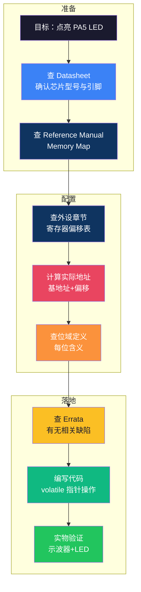

# 【元婴·95】Datasheet怎么读：嵌入式工程师的必修课

> **码农修仙传 · 元婴期 · 第95篇**
> 我是玄芯散人，带你从炼气修到大乘。

---

## 境界标识

```
╔══════════════════════════════════╗
║     元婴期 · 第95篇              ║
║     Datasheet怎么读：嵌入式工程师的必修课 ║
║     预计阅读：12分钟              ║
╚══════════════════════════════════╝
```

---

## 修仙引入

新人学嵌入式，最怕的往往是一打开那份上千页的 PDF 就完全找不到北。

师傅往往只说一句："去读 Datasheet。"可这本厚书一打开，术语缩写、寄存器表格一股脑全涌上来，时序图和电气参数也紧随其后。读完第一章，第二章又冒出十几个新名词；跳过电气参数直接看寄存器，时序那一段又冒出 `t_setup`、`t_hold`、`falling edge` 等一堆玄学。

嵌入式工程师的功夫，有一半藏在手册里。能把 Datasheet 翻清楚的人，调寄存器才调得明白；调得明白寄存器的人，写驱动才写得稳。这一篇，就把"读 Datasheet"这件事拆成可复用的修炼心法。

---

## 硬核主体

### 一份手册不够：Datasheet 与 Reference Manual 的分工

嵌入式新手最容易混淆的两个词：`Datasheet` 和 `Reference Manual`。很多同学以为是一回事，其实是两份不同的功法典籍。

- **Datasheet（数据手册）**：芯片厂商对外发的"产品说明书"，一般几十到一百多页。它的目的是让你快速判断这颗芯片能不能用：会列出芯片内核与封装类型，再补充典型功耗这些关键参数。Datasheet 不讲寄存器细节，只讲芯片"长什么样"。
- **Reference Manual（参考手册）**：芯片内部的"完整功法总纲"，动辄上千页。它会详细描述每个外设的寄存器配置方式，包括位域定义规则与完整的初始化流程。Reference Manual 不讲芯片长什么样，只讲"怎么让芯片按你想要的方式工作"。

这两份文档对应着两种修炼。Datasheet 决定"这颗芯片值不值得选"；Reference Manual 决定"这颗芯片怎么用对"。选型时先看 Datasheet，看完之后再去 Reference Manual 查具体寄存器和时序。

| 文档 | 角色 | 篇幅 | 用途 |
|------|------|------|------|
| Datasheet | 宗门对外发的"入门简介" | 几十到一两百页 | 选型与硬件设计 |
| Reference Manual | 宗门内部传承的"完整功法典籍" | 几百到上千页 | 寄存器配置与时序分析 |

把这两份手册的关系搞清楚，后面的修炼才不混乱。

### Datasheet 的五块拼图

任何一份 Datasheet，都可以拆成五块固定章节。养成"按模块查"的习惯，能省掉一半翻文档时间。下文每一项都先讲"它在哪一节、查什么"，再讲"工程师最容易踩的坑"。

#### 1. Overview：芯片的自我介绍

**入口**：Datasheet 第 1 章 "Description" 或 "Overview"。

**查什么**：

- 内核类型：常见的有 Cortex-M4、M7 以及 RISC-V。
- 主频上限：例如 168 MHz。
- Flash / RAM 容量：例如 1 MB Flash + 192 KB SRAM。
- 工作电压：例如 2.0V ~ 3.6V。
- 封装与温度等级：LQFP64、-40°C ~ 85°C 工业级等等。
- 典型应用场景：电机控制是经典领域，消费电子、物联网网关也常常见到。

**避坑点**：Overview 给的是"上限"。最终能不能跑到 168 MHz，还要看 PCB 散热、电源设计等实际条件能不能撑住。Overview 不告诉你这一点。

这章相当于芯片的"履历表"。看完它，开发者就知道这颗芯片大致能跑什么、值不值得继续往下读。

#### 2. Pinout / Pin Definitions：芯片的经脉图

**入口**：Datasheet "Pinouts and pin description" 章节，通常有引脚图和详细表格两种呈现。

**查什么**：

- 引脚名：`PA5`、`PB6`、`VSSA`、`VDD` 等等。
- 引脚类型：可能是电源、地、I/O，也可能标注为特殊功能引脚（例如 `NRST`、`BOOT0`、`OSC_IN`）。
- 复用功能：例如 PA5 既可以是普通 GPIO，也可以是 SPI1_SCK（视具体型号而定）。
- 备注：`5V tolerant`、`Analog input`、`I/O` 等等电气特性提示。

**避坑点**：表格里同时出现 "Default" 和 "Alternate function" 两列时，重点看 Alternate function 列。默认列只在你不配置复用功能时才生效；一旦开启 AF，复用功能会"接管"引脚。

这是芯片的经脉图。画原理图时，这张表决定每个引脚该如何连接，是否需要外加上拉电阻。

#### 3. Electrical Characteristics：芯片的经脉承受力

**入口**：Datasheet "Electrical characteristics" 章节，通常是表格密集型。

**查什么**：

- `VIH` / `VIL`：输入高电平 / 低电平的电压阈值。例如 `VIH >= 0.7 × VDD`，`VIL <= 0.3 × VDD`。
- `VOH` / `VOL`：输出高电平 / 低电平时的电压范围。
- `IOL` / `IOH`：单个引脚能吸收 / 输出的电流上限。例如 `IOH = 8 mA`，超过这个值，引脚会损坏。

**避坑点**：5V tolerant 引脚可以承受 5V 输入，但有注入电流限制；超过限制会触发闩锁效应（Latch-up），芯片直接永久损坏。Datasheet 通常会单独列出 "Input voltage injection" 一节。

这章相当于芯片的"经脉承受力"。调硬件前不查这一章，等于在悬崖边闭眼跳。

#### 4. Memory Map：芯片的灵脉总图

这是 Datasheet 中最容易被忽略、但 Reference Manual 里详细展开的一章。

**入口**：Reference Manual 的第 2 章 "Memory Map"，通常有一张全芯片地址空间分布图。

**查什么**：

- 各存储区域与外设寄存器对应的地址范围。
- 每个外设的基地址（Base Address）。

**避坑点**：基地址给出的是外设起点，不是寄存器地址。寄存器还要再加上"偏移量"。初学者最容易把基地址当成寄存器地址直接访问，结果寄存器偏移对不上，外设一动不动。

例如 STM32F407 的 GPIOA 基地址是 `0x40020000`，GPIOB 是 `0x40020400`，每个 GPIO 外设的地址区间长度固定是 `0x400` 字节。

这张图相当于芯片的"灵脉总图"。后续要算任何寄存器地址，都靠这张表。

#### 5. Alternate Function Mapping：引脚复用表

**入口**：Datasheet 或 Reference Manual 的 "Alternate function mapping" 章节，通常按 GPIO 端口分组。

**查什么**：哪些引脚可以复用为哪些外设。例如 PA9 / PA10 既是普通 GPIO，也是 USART1 的 TX / RX；PB6 / PB7 既是普通 GPIO，也是 I2C1 的 SCL / SDA。

**避坑点**：同一外设的多个引脚在不同封装下可能不全可用。例如 LQFP48 封装的 STM32F407 比 LQFP64 少 16 个引脚，复用对应关系完全不同。画 PCB 前必须确认封装型号。

复用表的关键信息是"哪些引脚可以复用为哪些外设"。画 PCB 时，外设引脚分配错了，整块板子就要重新打样。

总结一下五块拼图：

| 模块 | 关键问题 | 不查这一章的后果 |
|------|---------|----------------|
| Overview | 这颗芯片能跑什么？ | 选型失误 |
| Pinout | 引脚怎么连？ | 板子画错 |
| Electrical Characteristics | 引脚能承受多大电流？ | 烧板 |
| Memory Map | 寄存器在哪里？ | 调不通外设 |
| Alternate Function | 引脚能不能复用？ | 硬件错配 |

把这五块搞清楚，开发效率至少翻一倍。

### 三步找到任意寄存器地址

找到寄存器地址，是嵌入式开发的基本功。三步搞定：

**第一步：在 Reference Manual 的 Memory Map 章节找到外设基地址。**

例如 STM32F407 中：

```
0x40020000 ~ 0x400203FF   GPIOA
0x40020400 ~ 0x400207FF   GPIOB
0x40020800 ~ 0x40020BFF   GPIOC
...
0x40023C00 ~ 0x40023FFF   RCC
```

每个外设占一段地址空间。

**第二步：查目标寄存器的偏移量。** 外设章节会列出寄存器偏移表。

例如 GPIOA 章节会列出：

| 寄存器 | 偏移 | 作用 |
|--------|------|------|
| MODER | 0x00 | 模式选择 |
| OTYPER | 0x04 | 输出类型 |
| OSPEEDR | 0x08 | 输出速度 |
| PUPDR | 0x0C | 上下拉 |
| IDR | 0x10 | 输入数据 |
| ODR | 0x14 | 输出数据 |
| BSRR | 0x18 | 位设置/复位 |
| LCKR | 0x1C | 锁定 |

**第三步：实际地址 = 基地址 + 偏移。**

例如 GPIOA 的 ODR 寄存器：

```
GPIOA_ODR = 0x40020000 + 0x14 = 0x40020014
```

用 C 语言指向这个地址：

```c
#define GPIOA_BASE   0x40020000UL
#define GPIOA_ODR    (*(volatile uint32_t *)(GPIOA_BASE + 0x14))

/* 点亮 PA5 */
GPIOA_ODR |= (1U << 5);
```

这就是嵌入式开发的"寻脉定位"。手册里一张表，对应 C 语言里一行宏定义，三步就能走完。

### 位域（Bit Field）怎么算

光找到寄存器地址还不够。寄存器每个位（bit）都有含义，必须按位操作才能正确配置。

以 GPIOA 的 `MODER` 寄存器为例，它控制每个引脚的模式。每个引脚占 2 个 bit：

```
bit[1:0]   PA0   (00=输入, 01=输出, 10=复用, 11=模拟)
bit[3:2]   PA1
bit[5:4]   PA2
...
bit[31:30] PA15
```

要把 PA5 设置为输出模式，对应位是 `bit[11:10]`，需要写入 `01`：

```c
#define GPIOA_MODER (*(volatile uint32_t *)(GPIOA_BASE + 0x00))

/* 把 PA5 设为输出模式 */
GPIOA_MODER = (GPIOA_MODER & ~(0b11 << (5 * 2))) | (0b01 << (5 * 2));
```

公式拆解：

- `~(0b11 << (5 * 2))`：把 PA5 对应的两位先清零（其它位保持）。
- `(0b01 << (5 * 2))`：把 `01` 写到 PA5 对应的两位。
- 或运算：把清零结果和写入结果合并。

读手册时，必须注意每个寄存器有三件套：

- 寄存器名与偏移。
- 每个位域对应的字段名、位宽，以及读写权限。
- Reset Value（上电默认值），决定初始化逻辑。

搞懂这三件套，寄存器配置就不再玄学。

### Errata：芯片的"先天不足"

读 Datasheet 时，很多人忽略一份重要文档：**Errata Sheet（勘误表）**。

什么是 Errata？芯片在流片（tape-out）后才发现的硬件 bug，无法通过软件修复，只能在文档里告诉开发者："这颗芯片的某个功能有缺陷，请绕开它用。"Errata 就是芯片的"先天不足清单"。

为什么会出 Errata？硅片设计极其复杂，仿真通过的电路，量产时往往因为工艺偏差而出现异常，时序裕量不足、温度漂移也是常见诱因。厂商不可能回收已售出的芯片，只能更新 Errata 告诉后续开发者怎么规避。

**Errata 怎么查？**

1. 去芯片厂商官网（例如 st.com）。
2. 搜索具体芯片型号，例如 STM32F407VGT6。
3. 进入产品页面 → Documentation → Errata Sheet。
4. 下载 PDF，对照自己使用的 silicon revision 查看。

每条 Errata 通常包含：

- 缺陷描述：某个外设在某条件下行为异常。
- 受影响版本：哪个 silicon revision 触发。
- Workaround：怎么绕开。

例如 STM32F407 的 I2C1 在主模式下，连续发送 START 信号后可能丢失 ACK（Errata Sheet ES0288 v2.1 修订中有专门描述）。Workaround 建议：每次 START 之前插入一段延时，或改用 I2C2。再例如 STM32F411 的 USB OTG FS 在某些主机控制器下会偶发挂起（ES0334 Section 2.5），需要手动重置 DP/DM 上拉。

不读 Errata 的代价：

- 程序偶发性死机找不到原因。
- 升级芯片批次后莫名其妙功能失效。
- 量产时同一批代码，部分板子工作正常，部分永远调不通。

Errata 应该贯穿选型到量产再到调试的全流程。出问题时当然要查，没出问题也要在选型和量产前主动核对一遍。

### 不同厂家的 Datasheet 结构差异

STM32 只是嵌入式芯片的一种。读其它厂家 Datasheet 时，"五块拼图"模型依然适用，但细节会变。

- **NXP（i.MX RT 系列）**：Reference Manual 通常厚达两千页，分章节发布。Memory Map 在独立文档 System Reset and Boot 中。Errata 按 silicon revision 分多个 PDF。
- **Nordic（nRF52 / nRF53 系列）**：Datasheet 与 Reference Manual 合并为一份 "Product Specification"，章节按外设分类，没有独立 Memory Map 章节（基地址在每个外设章节开头给出）。
- **乐鑫（ESP32 / ESP32-S3 系列）**：TRM（Technical Reference Manual）走寄存器表风格，寄存器描述里直接列出位域，没有独立的位域定义章节。Datasheet 主要讲模组电气特性，编程参考在 TRM 中。
- **GD / 兆易创新（GD32 系列）**：寄存器布局与 STM32 高度兼容，但仍有几十条 Errata 与 STM32 不同。直接复用 STM32 代码会踩坑。

跨厂家迁移的关键是：抓住"五块拼图"的结构，把每个厂家当成新宗门来读。具体寄存器地址会变，但找地址的思路、读位域的方法、查 Errata 的流程，都是通用的。

### 实战示例：手册到代码的完整链路

把上面所有方法串起来，做一个完整演练：目标是用 PA5 点亮 LED。

**步骤 1：选型。** Datasheet Overview 章节确认芯片是 STM32F407，主频 168 MHz，封装 LQFP64，符合项目需求。

**步骤 2：硬件设计。** Pin Definitions 章节查到 PA5 是普通 GPIO 引脚，5V tolerant，供电范围 2.0V ~ 3.6V。LED 通过限流电阻接到 PA5 与 GND 之间。

**步骤 3：找基地址。** Memory Map 章节查到 GPIOA 基地址 `0x40020000`。

**步骤 4：找寄存器偏移。** Reference Manual GPIOA 章节查到 ODR 偏移 `0x14`。

**步骤 5：算地址。** `GPIOA_ODR = 0x40020000 + 0x14 = 0x40020014`。

**步骤 6：位域操作。** ODR 的 `bit[5]` 对应 PA5，写 1 输出高电平。

**步骤 7：检查 Errata。** 下载 STM32F407 Errata Sheet（RM0090 配套的 ES0288 / ES0347 等），确认 GPIOA 在当前 silicon revision 下没有相关缺陷。

**步骤 8：写代码骨架。**

```c
/* 仅展示指针定义 + 时钟使能 + 位运算三件套。完整 GPIO 初始化见 19 篇。 */
#define RCC_BASE       0x40023800UL
#define RCC_AHB1ENR    (*(volatile uint32_t *)(RCC_BASE + 0x30))
#define GPIOA_BASE     0x40020000UL
#define GPIOA_MODER    (*(volatile uint32_t *)(GPIOA_BASE + 0x00))
#define GPIOA_ODR      (*(volatile uint32_t *)(GPIOA_BASE + 0x14))

#define RCC_AHB1ENR_GPIOAEN  (1U << 0)

void led_init(void)
{
    /* 第一步：使能 GPIOA 时钟（手册规定访问前必须先打开） */
    RCC_AHB1ENR |= RCC_AHB1ENR_GPIOAEN;

    /* 第二步：配置 PA5 为输出模式 */
    GPIOA_MODER = (GPIOA_MODER & ~(0b11 << (5 * 2))) | (0b01 << (5 * 2));

    /* 第三步：PA5 输出高电平 */
    GPIOA_ODR |= (1U << 5);
}
```

整段代码只有几行有效逻辑，但每一行都来自手册里的某一页。手册翻清楚了，代码自然就写明白了。完整的 LED 闪烁工程模板（带 BSRR 原子操作和 LED toggle 循环）放在第 19 篇讲驱动开发时再展开。



### 读 Datasheet 的四个误区

最后讲几个常见误区，避免走弯路：

**误区一：通读 Datasheet。** Datasheet 是工具书，不是小说。养成"带着问题查"的习惯，比顺序通读高效十倍。

**误区二：只看 Datasheet 不看 Reference Manual。** Datasheet 只讲芯片长什么样，寄存器细节都在 Reference Manual。只看 Datasheet 写不出正确代码。

**误区三：跳过电气特性。** 很多 bug 来自电气设计：引脚驱动能力不够、5V tolerant 引脚被灌入 5V、上电时序不满足。烧板之后才知道，是非常昂贵的教训。

**误区四：不看 Errata。** Errata 是官方对芯片缺陷的明确声明。不读 Errata 等于在悬崖边蒙眼跳。选型时查一次，量产前再查一次，调不通时还要查一次。

把 Datasheet 当成"功法总集"，按问题或模块去查，按链路去推演，而不是顺序背诵。嵌入式工程师的功夫，就在这一次次的"按图施工"里长出来。

---

## 修仙术语对照表

| 修仙术语 | 技术现实 | 本篇详解 |
|---------|---------|---------|
| 天地法则原文 | Datasheet / Reference Manual | 芯片选型与编程的权威依据 |
| 入门简介 | Datasheet | 决定芯片能否入选 |
| 完整功法典籍 | Reference Manual | 决定芯片如何被正确使用 |
| 经脉图 | Pin Definitions | 每个引脚的功能定义 |
| 经脉承受力 | Electrical Characteristics | 引脚的电压电流限制 |
| 灵脉总图 | Memory Map | 所有外设的地址分布 |
| 经脉寻脉定位 | 基地址 + 偏移 = 实际地址 | 三步找到任意寄存器 |
| 经脉位域 | Register Bit Field | 每个 bit 对应的功能含义 |
| 先天不足清单 | Errata Sheet | 流片后才发现的硬件缺陷 |
| 按图施工 | 手册到 C 代码的转换 | 每行代码都有手册出处 |
| 闭眼跳崖 | 跳过电气特性直接调寄存器 | 烧板、量产事故 |
| 蒙眼跳崖 | 不读 Errata 直接量产 | 偶发性故障 |

---

## 突破条件

- [ ] 能区分 Datasheet 和 Reference Manual 的不同用途，知道选型查前者、调寄存器查后者
- [ ] 能在 Reference Manual 的 Memory Map 章节找到任意外设的基地址
- [ ] 能根据手册算出目标寄存器的实际地址（基地址加偏移）
- [ ] 读寄存器描述时，能看懂位域定义；能记住 Reset Value；能区分读写权限
- [ ] 能根据手册写一个 `volatile` 指针 + 位运算的寄存器宏
- [ ] 能在芯片厂商官网找到对应型号的 Errata Sheet
- [ ] 调外设前先检查 Errata，确认没有相关缺陷
- [ ] 硬件设计前先查 Datasheet 的 Pin Definitions 和 Electrical Characteristics

> 八项不必一次全做完，但每一项都对应一个真实可验证的工程动作。能读完手册查完代码，再去示波器上验证一遍波形，这样你才算真正跨过了嵌入式工程师的第一道门槛。

---

## 下期预告 + 互动

> **下一篇：【元婴·96】0 和 1 背后的数学：布尔代数和数字电路基础**

寄存器里翻来覆去的 `0` 和 `1`，背后其实有一套严密的数学规则。下一篇讲布尔代数，看看数字电路的"道法本源"是怎么搭起来的。

现在问你：**你第一次读 Datasheet 时，最让你"原地去世"的是哪一章？是上千页的 Reference Manual，还是满屏缩写的电气参数表？有没有因为没读 Errata 踩过坑？**

欢迎在评论区留下你的"手册渡劫现场"。

---

*本文是「码农修仙传」系列第95篇。系列导航见 [xren.ren](https://xren.ren)*