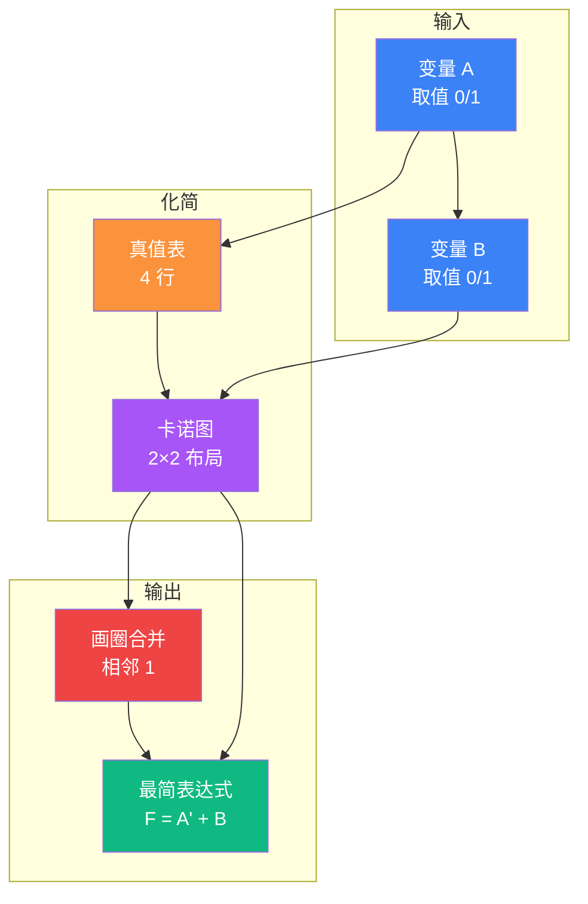
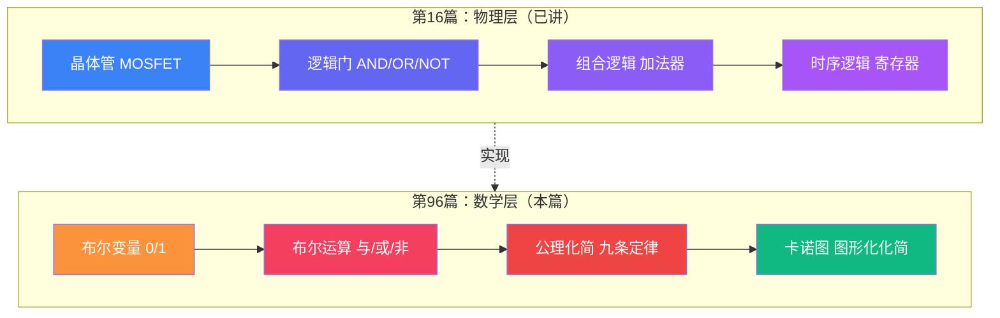

# 【元婴·96】0和1背后的数学：布尔代数和数字电路基础

> **码农修仙传 · 元婴期 · 第96篇**
> 我是玄芯散人，带你从炼气修到大乘。

---

## 境界标识

```
╔══════════════════════════════════╗
║     元婴期 · 第96篇              ║
║     0和1背后的数学：布尔代数和数字电路基础 ║
║     预计阅读：18分钟              ║
╚══════════════════════════════════╝
```

---

## 修仙引入

筑基期间你也曾翻过寄存器，调过 GPIO。但这一篇要回到更底层，把 0 和 1 这两个符号拆到最深的数学去。

这就要回到数字电路的源头，也就是布尔代数（Boolean Algebra）。

如果说第 16 篇是把数字电路拆到电子那一层，那这一篇再往下一层，拆到数学。0 和 1 不是凭空存在的两个符号，它们背后的运算是有严密公理支撑的。这套公理 1854 年由乔治·布尔（George Boole）发表，本意是研究人类思维规律的数学化。约 80 年后（1937 年左右），香农（Claude Shannon）的硕士论文发现它能完美描述开关电路，从此布尔代数就成了数字电路的天道法则。

今天这堂课，我们把这套法则讲透。讲完之后，你看到的就不再是几个孤零零的与或非门，而是一套完整的化简武功。卡诺图就是这套武功里最常用的兵器。

---

## 硬核主体

### 一、布尔代数是什么

布尔代数和普通代数不一样。它只关心两个值，0（假）和 1（真）。所有变量只能取这两个值之一，所有运算的结果也只能是这两个值之一。

| 概念 | 普通代数 | 布尔代数 |
|------|---------|----------|
| 取值范围 | 任意实数 | 仅 0 或 1 |
| 运算符 | 加减乘除 | 与、或、非 |
| 用途 | 描述连续量 | 描述逻辑关系 |
| 提出者 | 久远 | George Boole（1854） |

修仙类比：普通代数是天地灵气的运行法则，可以是小数或负数；布尔代数是道与魔的两极法则，只有正邪两判，没有中间状态。

二值性是布尔代数的根本。在数字电路里，0 对应低电平（通常 0V），1 对应高电平（通常 3.3V 或 5V）。物理上之所以用二值，是因为二值电路抗干扰能力强。只要电压在阈值之上就判为 1，在阈值之下就判为 0，中间区域是灰色禁区，电路要尽量避免长时间停留在那里。

### 二、三种基本运算

任何布尔表达式都可以拆成三种基本运算的组合。

与运算（AND, 记作 · 或省略）：两个输入都为 1 时输出 1，否则输出 0。

```
0 · 0 = 0   0 · 1 = 0   1 · 0 = 0   1 · 1 = 1
```

或运算（OR, 记作 +）：任一输入为 1 时输出 1，否则输出 0。

```
0 + 0 = 0   0 + 1 = 1   1 + 0 = 1   1 + 1 = 1
```

非运算（NOT, 记作 ' 或上划线）：输入取反。

```
0' = 1   1' = 0
```

注意几点与日常直觉不同的细节。`1 + 1 = 1`，不是 2。布尔代数里 1+1 还是 1，因为真加真还是真。运算符优先级方面，非运算优先于与，与运算优先于或。必要时加括号明确顺序。

用 C 语言表达：

```c
int AND_op(int a, int b) { return a & b; }
int OR_op (int a, int b) { return a | b; }
int NOT_op(int a)        { return ~a & 1; }
```

注意 `~a & 1` 里的 `& 1` 是必要的。C 语言的 `~` 是按位取反，`~0` 会得到一堆 1（具体多少位看类型），必须和 1 做与运算才能拿到真正的逻辑非。

### 三、布尔代数的九条公理与定理

布尔代数的全部力量，来自九条核心定律。掌握这九条，任何复杂逻辑都能拆解和化简。

| 名称 | 与形式 | 或形式 |
|------|--------|--------|
| 交换律 | A·B = B·A | A+B = B+A |
| 结合律 | (A·B)·C = A·(B·C) | (A+B)+C = A+(B+C) |
| 分配律 | A·(B+C) = A·B + A·C | A+(B·C) = (A+B)·(A+C) |
| 同一律 | A·1 = A | A+0 = A |
| 0-1 律 | A·0 = 0 | A+1 = 1 |
| 补余律 | A·A' = 0 | A+A' = 1 |
| 幂等律 | A·A = A | A+A = A |
| 双重否定 | (A')' = A | — |
| 德摩根律 | (A·B)' = A' + B' | (A+B)' = A'·B' |

这九条是推导一切复杂等式的基础。看似平淡，但组合起来威力巨大。

德摩根定律单独强调一下，因为它是数字电路里最高频使用的变换。与的否定等于否定的或，或的否定等于否定的与。用一句话概括，NAND 等价于先 AND 再 NOT（结果也可以写成 NOT 再 OR），NOR 等价于先 OR 再 NOT（结果也可以写成 NOT 再 AND）。这条直接给出了 NAND 的功能完备性，详见 16 篇《晶体管翻转》一文。

修仙类比：这九条就是修仙界的道典九章。任何再高深的功法，溯源到底都是这九章的排列组合。

### 四、化简实战

学习九条定律的目的是什么？化简。一个复杂的逻辑表达式，往往可以化简成更短的形式。电路里每少一个门，节省的成本与功耗都直接反映到最终产品上。

例 1，化简 `F = A·B + A·B'`。

```
F = A·B + A·B'
  = A·(B + B')     // 分配律
  = A·1             // 补余律
  = A               // 同一律
```

物理意义：不管 B 是什么，输出都等于 A。等价电路只需一根导线。

例 2，化简 `F = (A+B)·(A+B')`。

```
F = (A+B)·(A+B')
  = A·A + A·B' + A·B + B·B'   // 分配律展开
  = A + A·B' + A·B + 0          // 幂等律与补余律
  = A·(1 + B' + B)               // 提取 A
  = A·(1 + 1)                    // 补余律
  = A·1                          // 0-1 律
  = A                            // 同一律
```

例 3，用德摩根律改写 `(A·B·C)'`。

```
(A·B·C)' = A' + B' + C'      // 多个变量，德摩根律的扩展
```

多变量版本的德摩根律：整个表达式取反，等于每个变量取反，运算符与或互换。

化简策略一般分两步。第一步用定律化简，先尝试提取公因子，再应用补余律、幂等律。第二步用卡诺图化简。当变量超过 3 个，人工推导容易遗漏，卡诺图更可靠。

### 五、卡诺图

卡诺图（Karnaugh Map，简称 K 图）是 Maurice Karnaugh 在 1953 年发明的图形化化简方法。它的核心思想是，把真值表重新排布，让相邻单元只有一个变量不同，从而让可以合并的项在图上相邻。

为什么相邻只有一个变量不同这么重要？因为根据 `A·B + A·B' = A·(B+B') = A`，两个只差一个变量的最小项可以合并消掉那个变量。

#### 5.1 二变量卡诺图

两变量 A、B 的卡诺图是 2×2 的方格。

```
       B=0   B=1
A=0  [ m0 ] [ m1 ]
A=1  [ m2 ] [ m3 ]
```

四个格子分别是四个最小项。m0 = A'·B'（A=0, B=0），m1 = A'·B，m2 = A·B'，m3 = A·B。

化简例子：F = Σ(0, 1, 2)

```
       B=0   B=1
A=0  [ 1  ] [ 1  ]
A=1  [ 1  ] [ 0  ]
```

1 号、2 号格子位置不在同一行也不在同一列，看似不相邻。但 K 图允许按行列两个方向分别圈组合：0 号与 1 号同行相邻，合并消 A 得 B'；0 号与 2 号同列相邻，合并消 B 得 A'。两组圈覆盖了所有 1，最简结果是 `A' + B`。

这就是卡诺图化简的核心，找最大的矩形圈，覆盖所有 1，尽可能大，少数量。



#### 5.2 三变量卡诺图

三变量 A、B、C 的卡诺图布局是 2×4。

```
        BC=00  BC=01  BC=11  BC=10
A=0    [ m0 ] [ m1 ] [ m3 ] [ m2 ]
A=1    [ m4 ] [ m5 ] [ m7 ] [ m6 ]
```

注意一个细节，列的顺序按 Gray 码排列，第一行依次是 00、01，然后跳到 11、10。第二行同样按这个顺序。每一列和下一列只有一个变量变化。卡诺图的环回特性也在此：最右列（10）和最左列（00）相邻，因为 10 和 00 也只有一个变量不同。

这意味着 m0 和 m2 相邻，m4 和 m6 相邻，这在物理布局上跨越了边界。

三变量化简例子：F = Σ(0, 1, 2, 4, 5, 6)

```
        BC=00  BC=01  BC=11  BC=10
A=0    [ 1  ] [ 1  ] [ 0  ] [ 1  ]
A=1    [ 1  ] [ 1  ] [ 0  ] [ 1  ]
```

观察：上下两行除了 BC=11 列都是 1。可以圈一个大圈包含所有 8 个格子吗？不行，BC=11 两格是 0。最优圈法是把上半行的 0、1、2 圈一组，把下半行的 4、5、6 圈一组。但 A'+A = 1（补余律），所以最终 F = 1。其实再仔细看，这 6 个 1 除了 BC=11 两列全填了 1，BC=11 时 A 取任何值都是 0，即 F = (BC)' = B' + C'。

三变量卡诺图能合并的圈大小有 1 格到 8 格之间的偶数次方格几种。每种圈大小对应消掉不同数量的变量。

#### 5.3 四变量卡诺图

四变量卡诺图的布局是 4×4 的方格。

```
        CD=00  CD=01  CD=11  CD=10
AB=00  [ m0 ] [ m1 ] [ m3 ] [ m2 ]
AB=01  [ m4 ] [ m5 ] [ m7 ] [ m6 ]
AB=11  [ m12] [ m13] [ m15] [ m14]
AB=10  [ m8 ] [ m9 ] [ m11] [ m10]
```

Gray 码序同样适用：每行每列相邻只有一个变量变化，最左和最右相邻，最上和最下相邻。

四变量化简例子：F = Σ(0, 1, 2, 4, 5, 6, 8, 9, 10, 12, 13, 14)

这是个经典案例。输出除了 BC=11 和 CD=11 对应的格子外全是 1。换句话说 F = (BC)'·(CD)' = (B'+C')·(C'+D') = C' + B'·D'（用分配律展开后化简）。

人工推导很绕，但卡诺图一眼就能看出来：圈掉所有 0，剩下的就是 F 的反，再取反回来。

### 六、卡诺图三句心法

第一句，圈要尽可能大。圈越大，消掉的变量越多，结果越简。

第二句，圈数要尽可能少。每个圈对应一个与项，圈数越少，项数越少。但每圈必须至少包含一个其他圈没覆盖的 1，否则这个圈多余。

第三句，所有 1 都要被圈到。漏掉任何一个 1，结果就错了。可以重复圈同一格（被多个圈覆盖），这在逻辑上等价于该格被多次使用，对应表达式里该项被复用。

### 七、超越四变量，奎因-麦克拉斯基法

四变量以下，卡诺图是神器。五变量及以上，卡诺图开始失灵。5 变量需要两个 4 变量图叠加，6 变量需要 4 个，人眼很难再看出合并关系。

这时候用奎因-麦克拉斯基法（Quine-McCluskey）。它把卡诺图的图形合并转成列表合并，用算法（适合编程实现）代替人眼。

```python
def quine_mccluskey(minterms, variables):
    groups = group_by_ones(minterms)
    merged = merge_groups(groups)
    while can_merge(merged):
        merged = merge_groups(merged)
    return select_prime_implicants(merged)
```

这套算法 EDA 工具都会内置。卡诺图是教学工具，奎因-麦克拉斯基法是工业引擎，背后的化简思想一脉相承。

### 八、为什么这一套对嵌入式工程师重要

回到元婴期本身。嵌入式工程师天天和数字电路打交道，化简能力是基本功。

写 HDL 代码（Verilog/VHDL）时，写完一个逻辑先想能不能化简，决定综合出来的电路是 50 个门还是 5 个门。芯片面积和功耗直接相关。

读芯片手册时，外设功能框图里那些逻辑条件，比如 PA8 复用为 TIM1_CH1 当 AF=1 且 MODER=10，背后就是一组布尔表达式。卡诺图让你一眼看出哪些条件是真冗余。

调硬件 bug 时，偶尔遇到为什么这个信号在某种组合下异常。画张卡诺图把信号列出来看规律，比看波形高效。

修仙类比：化简是数字电路的内功心法。同样的逻辑，外门弟子用一百个门堆出来，元婴修士用十个门就解决。门数就是修真界的灵力消耗，少一分消耗，就多一分续航。

### 九、和上一篇的区别

第 16 篇讲的是物理层（标题里有"晶体管翻转"那个）。晶体管怎么搭成 NAND，NAND 怎么搭成加法器，加法器怎么搭成寄存器。那一篇关心的是门电路怎么造、怎么组合。

这一篇关心的是门电路怎么排布最简。

类比一下。如果说第 16 篇讲的是怎么炼出这把剑，这一篇讲的是怎么用最少的钢材炼出最锋利的剑。前者是工艺，后者是数学。两者加起来，才是数字电路的完整心法。



读到这里，你应该理解了。0 和 1 不是孤零零的两个数字，它们背后站着一整套 1854 年就被数学家证明的公理。数字电路的所有神奇现象，都建立在这套公理之上。CPU 跑得动靠的是它，内存存得下靠的是它，网卡传得稳也是它。

---

## 修仙术语对照表

| 修仙术语 | 技术现实 | 本篇详解 |
|---------|---------|---------|
| 道与魔的两极法则 | 布尔代数（二值代数） | §一 |
| 法术三脉 | 与、或、非三种基本运算 | §二 |
| 道典九章 | 九条公理和定理（交换/结合/分配/同一/0-1/补余/幂等/双重否定/德摩根） | §三 |
| 万阵之母之母 | 德摩根定律（与或互换） | §三 |
| 提纯化简 | 用公理化简布尔表达式 | §四 |
| 化简神图 | 卡诺图（K 图） | §五 |
| Gray 序排列 | 相邻格只差一个变量的布局 | §5.2 / §5.3 |
| 圈地心法 | 卡诺图三原则（最大圈、最少圈、覆盖所有 1） | §六 |
| 工业神兵 | 奎因-麦克拉斯基法 | §七 |
| 物理层 vs 数学层 | 第 16 篇硬件 vs 第 96 篇数学 | §九 |

---

## 突破条件

- [ ] 能复述与/或/非三种运算的真值表，理解 `1+1=1` 而非 2 的含义
- [ ] 能默写九条公理和定理的与形式和或形式两栏
- [ ] 能用九条定律手工化简一个 3 变量布尔表达式
- [ ] 能画 2/3/4 变量三种规模的卡诺图，并理解 Gray 码序排列的原因
- [ ] 能在卡诺图上正确圈出最大合并圈，覆盖所有 1
- [ ] 能解释德摩根定律，并写出 `(A·B·C)' = A' + B' + C'`
- [ ] 能说出卡诺图与奎因-麦克拉斯基法的适用场景差异
- [ ] 能用一句话说清第 16 篇（硬件层）和本篇（数学层）的区别

> 八项不必一次全勾完，但每一项都对应一个真实可验证的工程能力。能用 Verilog 写一段化简后的组合逻辑并仿真通过，你才算真正把布尔代数内化成自己的内功。

---

## 下期预告 + 互动

> 下一篇：【元婴·97】元婴期修炼路径：点灯之后写固件

数字电路的数学底子打好了，下一步是修炼路径。元婴期 30 篇涵盖硬件底层方方面面，既有最基础的点亮 LED，也有写 Bootloader 这种综合性实战，再往上有调寄存器、跑 RTOS。普通人怎么一步步走出来？下一篇讲清楚这张修炼地图，每一关都有明确的练功任务和验收标准。

现在问你：

> 🎮 顿悟自测：你之前看到 `(A+B)' = A'·B'` 这条德摩根律，是不是只当作要背的公式？看完这一篇，有没有意识到它其实是在说任何电路都能用另一种方式实现？在评论区留下你的德摩根时刻。

> 💬 实战互动：你在写 Verilog 或 VHDL 时，有没有过明明逻辑对但综合出来门数爆炸的经历？是用什么方法化简的？留言告诉我，下一篇修炼路径里可能会专门展开讲 HDL 编码风格。

> 🔔 关注玄芯散人，修炼不迷路。下一篇给元婴期画一张完整的修炼地图。

我是玄芯散人，带你从炼气修到大乘。

---

*本文是「码农修仙传」系列第96篇。系列导航见 [xren.ren](https://xren.ren)*
