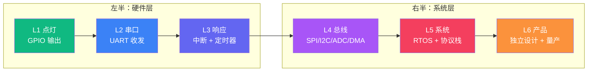

# 【元婴·97】元婴期修炼路径：从点灯到写固件

> **码农修仙传 · 元婴期 · 第97篇**
> 我是玄芯散人，带你从炼气修到大乘。

---

## 境界标识

```
╔══════════════════════════════════╗
║     元婴期 · 第97篇              ║
║     元婴期修炼路径：从点灯到写固件 ║
║     预计阅读：15分钟              ║
╚══════════════════════════════════╝
```

---

## 修仙引入

很多道友问我，嵌入式这条路，到底要学到什么程度才算"出师"？

我见过不少卡在 UART 收不到数据的，也见过卡在 RTOS 任务调度出毛病的，更见过已经能写驱动却还在为产品功耗焦头烂额的。嵌入式这条修炼路，不是堆知识点就能走通的，得按层级打怪。

修真界一共六个境界，嵌入式也有自己的六层台阶。每上一层，看到的世界就不一样。这一篇是元婴篇的"毕业卷"，也是嵌入式修炼的"全景图"。你处在哪一层，下一步该练什么，全在这张图里。

---

## 硬核主体

### 元婴期修炼全景图

先把整张图摆出来，方便后面一层一层拆。



六层之间是强依赖关系。上一层没过，下一层无从下手。比如 UART 不会配置波特率，中断无从触发；中断没摸清，DMA 的中断机制看不懂；DMA 不熟，RTOS 里的消息队列很难理解。底层没修稳，上面全是空中楼阁。

下面一层一层讲清楚。

---

### 第一层：点亮 LED（GPIO 输出）

修炼起点，让一个 LED 在开发板上稳定闪烁。

这一步看似简单，却藏着嵌入式修炼的所有地基。时钟使能要会，引脚复用要懂，输出模式要选，推挽与开漏要分清，上下拉电阻要会用，翻转速度要调对。少一步灯不亮，顺序错了灯也不亮。

```c
/* STM32 点亮 LED 的最小工程。 */
#include "stm32f4xx.h"

#define LED_PIN 5U

static void led_init(void)
{
    /* 时钟先开，否则寄存器写入不生效。 */
    RCC->AHB1ENR |= RCC_AHB1ENR_GPIOAEN;

    /* MODER 配置 PA5 为通用输出模式（01）。 */
    GPIOA->MODER = (GPIOA->MODER & ~(3U << (LED_PIN * 2U)))
                 | (1U << (LED_PIN * 2U));

    /* OTYPER 推挽输出；OSPEEDR 默认低速；PUPDR 无上下拉。 */
    GPIOA->OTYPER &= ~(1U << LED_PIN);
    GPIOA->OSPEEDR &= ~(3U << (LED_PIN * 2U));
    GPIOA->PUPDR &= ~(3U << (LED_PIN * 2U));
}

int main(void)
{
    led_init();

    while (1) {
        GPIOA->BSRR = 1U << LED_PIN;
        for (volatile int i = 0; i < 100000; i++);
        GPIOA->BSRR = 1U << (LED_PIN + 16U);
        for (volatile int i = 0; i < 100000; i++);
    }
}
```

验收标准：

- [ ] 能独立说清每条寄存器配置的目的（不是抄代码）
- [ ] 知道为什么必须先开时钟再改引脚
- [ ] 能区分推挽输出与开漏输出的适用情况
- [ ] 能用万用表或示波器在引脚上看到电平翻转
- [ ] 能在不查手册的情况下默写出 LED 闪烁的最小工程

第一层过关后，你才算真正"碰过芯片"。

---

### 第二层：串口通信（UART 收发）

修炼进阶，让单片机"开口说话"，把数据通过串口发到 PC。

串口是嵌入式修炼最常用的调试手段。掌握 UART 意味着你能用 `printf` 重定向打出变量，能用串口助手观察协议数据。这是脱离"点灯"走向"通信"的第一步。

```c
/* UART1 初始化，115200 波特率，8N1。 */
static void uart1_init(void)
{
    /* 1. 开时钟：GPIOA 时钟 + USART1 时钟。 */
    RCC->AHB1ENR |= RCC_AHB1ENR_GPIOAEN;
    RCC->APB2ENR |= RCC_APB2ENR_USART1EN;

    /* 2. PA9、PA10 复用为 USART1。MODER=10(AF)，AFRH=0110(AF7)。 */
    GPIOA->MODER = (GPIOA->MODER & ~((3U << 18) | (3U << 20)))
                 |  ((2U << 18) | (2U << 20));
    GPIOA->AFR[1] = (GPIOA->AFR[1] & ~((0xFU << 4) | (0xFU << 8)))
                  |  ((7U << 4) | (7U << 8));

    /* 3. 波特率：115200 @84MHz APB2。BRR = 84M / 115200 ≈ 729。 */
    USART1->BRR = 84U * 1000000U / 115200U;

    /* 4. 使能发送与接收。 */
    USART1->CR1 = USART_CR1_TE | USART_CR1_RE | USART_CR1_UE;
}

void uart1_send_char(char c)
{
    while (!(USART1->SR & USART_SR_TXE));
    USART1->DR = c;
}
```

验收标准：

- [ ] 能独立配置一个串口（不查手册默写）
- [ ] 理解波特率计算公式（PCLK / BRR = 波特率）
- [ ] 能用 `fputc` 重定向实现 `printf`
- [ ] 能用串口助手收发自定义协议帧
- [ ] 知道 8N1 与 8E1 在数据位和校验位和停止位上的差异

这一层过关，你就能"自检自查"了。后面所有调试都靠这一层的功夫。

---

### 第三层：中断和定时器（响应外部事件）

修炼进阶，让单片机不再"傻等"，能响应外部事件。

点灯和串口都靠 CPU 死等。CPU 一旦进入 `while(1)` 就只能处理一件事。引入中断之后，CPU 才能在不轮询的情况下响应按键，处理计时器溢出，监听外部信号。这是嵌入式修炼真正的分水岭。

```c
/* 外部中断：PA0 接按键，触发 EXTI0。 */
static void exti0_init(void)
{
    RCC->AHB1ENR |= RCC_AHB1ENR_GPIOAEN;
    RCC->APB2ENR |= RCC_APB2ENR_SYSCFGEN;

    /* PA0 输入模式 + 下拉。 */
    GPIOA->MODER &= ~(3U << 0);
    GPIOA->PUPDR = (GPIOA->PUPDR & ~(3U << 0)) | (2U << 0);

    /* EXTI0 映射到 PA0。 */
    SYSCFG->EXTICR[0] &= ~(0xFU << 0);

    /* 触发边沿：下降沿。 */
    EXTI->FTSR |= EXTI_FTSR_TR0;

    /* 使能中断与 NVIC。 */
    EXTI->IMR |= EXTI_IMR_MR0;
    NVIC_EnableIRQ(EXTI0_IRQn);
}

void EXTI0_IRQHandler(void)
{
    if (EXTI->PR & EXTI_PR_PR0) {
        EXTI->PR = EXTI_PR_PR0;
        GPIOA->ODR ^= (1U << 5);
    }
}
```

定时器实质上是"硬件级的中断源"。配置好 PSC 和 ARR，就能按固定时间触发更新中断。这是后面 PWM 与输入捕获、编码器相关玩法的基础。

验收标准：

- [ ] 能独立配置一个外部中断（按键触发翻转）
- [ ] 理解中断向量表与 IRQ 号的关系
- [ ] 知道为什么要"清中断标志位"
- [ ] 能用定时器实现 1ms 周期中断
- [ ] 理解中断优先级（抢占优先级与响应优先级）
- [ ] 知道中断与主循环的同步问题（volatile 关键字）

这一层过关，你才算真正"用上了 CPU"。

---

### 第四层：DMA 和总线（SPI/I2C/ADC）

修炼进阶，让数据搬运脱离 CPU。

CPU 每搬一个字节就要被打断一次，效率太低。DMA 出现之后，外设与内存之间能"自治搬运"。同时 SPI/I2C/ADC 这些外设协议也开始登场，嵌入式世界从此有了"传感器"和"存储"。

```c
/* SPI1 通过 DMA 发送一帧数据。 */
static void spi1_dma_tx_init(void)
{
    /* 1. 开时钟：GPIOA + SPI1 + DMA2。 */
    RCC->AHB1ENR |= RCC_AHB1ENR_GPIOAEN;
    RCC->APB2ENR |= RCC_APB2ENR_SPI1EN;
    RCC->AHB1ENR |= RCC_AHB1ENR_DMA2EN;

    /* 2. PA5/PA6/PA7 复用为 SPI1（AF5）。 */
    GPIOA->MODER = (GPIOA->MODER & ~((3U<<10)|(3U<<12)|(3U<<14)))
                 |  ((2U<<10)|(2U<<12)|(2U<<14));
    GPIOA->AFR[0] = (GPIOA->AFR[0] & ~((0xFU<<20)|(0xFU<<24)|(0xFU<<28)))
                  |  ((5U<<20)|(5U<<24)|(5U<<28));

    /* 3. SPI 主机模式，8 位，全双工。 */
    SPI1->CR1 = SPI_CR1_MSTR | SPI_CR1_SSI | SPI_CR1_SSM;
    SPI1->CR1 |= SPI_CR1_SPE;

    /* 4. DMA2 Stream3 Channel3：SPI1_TX。 */
    DMA2_Stream3->PAR  = (uint32_t)&SPI1->DR;
    DMA2_Stream3->M0AR = (uint32_t)tx_buf;
    DMA2_Stream3->NDTR = TX_LEN;
    /* DIR=01 内存到外设，MINC 内存递增，PSIZE/MSIZE=00 8 位，
     * PL=01 中优先级，CHSEL=011 选择通道 3。 */
    DMA2_Stream3->CR   = DMA_SxCR_DIR_0
                      | DMA_SxCR_MINC
                      | (1U << 16)
                      | (3U << 25);
    DMA2_Stream3->CR |= DMA_SxCR_EN;

    /* 5. SPI 启动 DMA 发送。 */
    SPI1->CR2 |= SPI_CR2_TXDMAEN;
}
```

I2C 的复杂度比 SPI 高一截。要处理起始位，要注意应答位的电平，还要看 ACK/NACK 和地址匹配这些细节。很多新人卡在这一层。但只要拆解出"主机发地址 → 从机 ACK → 主机发数据 → 从机 ACK"的序列，I2C 就变得清晰。

验收标准：

- [ ] 能用 SPI 读写 W25Q Flash
- [ ] 能用 I2C 读取 MPU6050 陀螺仪数据
- [ ] 能用 ADC 采样电位器电压
- [ ] 能用 DMA 搬运 SPI 数据
- [ ] 理解 SPI 的四种模式（CPOL/CPHA 组合）
- [ ] 知道 I2C 上拉电阻为什么缺它就动不了
- [ ] 能在没有 HAL 库的情况下配置 DMA

这一层过关，你就有了"感知世界"的能力。

---

### 第五层：RTOS 和通信协议（CAN/以太网/文件系统）

修炼进阶，让多个任务并行运行，让设备能联网。

裸机 `while(1)` 应付几个任务还行，任务一多就要写成"状态机 + 定时器"的大泥球。引入 RTOS 之后，每个任务独立运行，消息队列通信，软件定时器精确调度。这是嵌入式修炼的"操作系统入门"。

```c
/* FreeRTOS 经典点灯：两个任务 + 队列。 */
#include "FreeRTOS.h"
#include "task.h"
#include "queue.h"

static QueueHandle_t evt_queue = NULL;

static void task_led(void *arg)
{
    while (1) {
        GPIOA->BSRR = 1U << 5;
        vTaskDelay(pdMS_TO_TICKS(500));
        GPIOA->BSRR = 1U << (5 + 16);
        vTaskDelay(pdMS_TO_TICKS(500));
    }
}

static void task_key(void *arg)
{
    uint8_t evt;
    while (1) {
        if (!HAL_GPIO_ReadPin(GPIOA, GPIO_PIN_0)) {
            evt = 1;
            xQueueSend(evt_queue, &evt, portMAX_DELAY);
            vTaskDelay(pdMS_TO_TICKS(50));
        }
        vTaskDelay(pdMS_TO_TICKS(10));
    }
}

int main(void)
{
    HAL_Init();
    SystemClock_Config();
    led_init();
    uart1_init();

    evt_queue = xQueueCreate(4, sizeof(uint8_t));
    xTaskCreate(task_led, "led", 128, NULL, 1, NULL);
    xTaskCreate(task_key, "key", 128, NULL, 2, NULL);
    vTaskStartScheduler();

    while (1) { }
}
```

通信协议栈也开始登场。CAN 是汽车电子的标配；以太网（LWIP 协议栈）让单片机接入 TCP/IP；FatFs 让单片机读写 SD 卡文件系统。这一层开始，嵌入式和"物联网"正式接轨。

验收标准：

- [ ] 能在裸机上跑起 FreeRTOS
- [ ] 能用信号量与队列与互斥锁解决任务同步
- [ ] 知道优先级反转与优先级继承
- [ ] 能用 CAN 总线收发一帧数据
- [ ] 能用 LWIP 实现 TCP echo server
- [ ] 能在 SD 卡上挂载 FatFs 文件系统
- [ ] 理解 RTOS 下的内存管理与栈大小分配

这一层过关，你就具备了"工程师"的标准水平。

---

### 第六层：独立设计产品

修炼终章，从"实现功能"走向"设计系统"。

前五层都是"让别人告诉你做什么"，第六层是你自己决定"要做什么、怎么做"。这一步要把硬件选型与芯片资源与外设接口与通信协议以及功耗与可靠性和成本全部统筹起来。嵌入式修炼的最终形态，是独立交付一个能在产线上跑起来的产品。

一个嵌入式产品的全闭环，至少要走八步：

1. 需求拆解：把客户想要的功能拆成芯片能实现的功能。
2. 芯片选型：按性能与功耗和成本选 MCU/MPU。
3. 分层搭建：硬件层与驱动层与业务层与协议层之间划清边界。
4. 原理图与 PCB：硬件工程师主导，固件工程师参与评审。
5. 驱动开发：基于 HAL 或寄存器实现外设驱动。
6. 业务开发：在 RTOS 上实现业务逻辑。
7. 测试验证：单元测试、集成测试、压力测试与可靠性测试都要过一遍。
8. 量产交付：烧录器配置和固件签名和 OTA 升级方案都要备齐。

验收标准：

- [ ] 独立完成过一个能上产线的全流程产品，不是 demo
- [ ] 能用状态图梳理复杂业务逻辑
- [ ] 能评估芯片资源是否够用（ROM/RAM/IO 余量）
- [ ] 能写出功耗预算与休眠策略
- [ ] 能设计 OTA 升级方案
- [ ] 能处理量产中的良率问题
- [ ] 能独立完成 EMC/EMI 测试整改
- [ ] 理解 PCB 布局会从去耦和晶振和走线三方面牵连固件调试

第六层过关，你才算真正的"嵌入式老兵"。再往上走，是资深技术专家，是化神期的事情了。

---

### 一张表看清每一层

| 层级 | 主技能 | 常用外设 | 典型项目 | 验收时间 |
|------|----------|----------|----------|----------|
| 第一层 | GPIO 输出 | GPIO | LED 闪烁 | 1 周 |
| 第二层 | UART 收发 | USART | 串口打印 | 2 周 |
| 第三层 | 中断与定时器 | EXTI + TIM | 按键控制 + PWM | 4 周 |
| 第四层 | DMA 与总线协议 | SPI + I2C + ADC | Flash 读写 + 传感器 | 8 周 |
| 第五层 | RTOS 与协议栈 | FreeRTOS + CAN + LWIP | 多任务网关 | 12 周 |
| 第六层 | 系统设计 | 全部 | 全流程产品量产 | 数年 |

时间是经验值，不是死规定。有天赋的道友三层合并两层练，也不是不行。但跳过任何一层，下一层都会回头补课。

---

### 修炼心法三条

第一条，从下往上排错。嵌入式出问题，先盯电源，再看晶振，再查复位，最后看引脚电平。软件查三小时查不出的 bug，换块板子可能就好了。这条心法看似废话，却是很多纯软件背景工程师转嵌入式最容易忽略的。

第二条，从手册推行为。先读 Reference Manual 再写代码。库的源码会变，API 名字会变。芯片手册的寄存器定义和时序图不会变。能把 Reference Manual 翻熟的人，换芯片只是时间问题；只能记 API 的人，换一颗芯片就要重新学一年。

第三条，从产品倒推栈。卡 UART 时先查波特率还是先查接线？规则是：先验接线，再量电平，再追时钟，最后才怀疑代码。技术栈是手段，产品交付才是目的。

各层对应的系列篇号速查：

| 层级 | 涉及系列篇号 |
|------|--------------|
| 第一层 | 17（嵌入式为何元婴）、098（驱动开发） |
| 第二层 | 098（HAL/LL 库 UART） |
| 第三层 | 后续 NVIC 篇（待写） |
| 第四层 | 098（SPI 驱动）、CAN 总线篇 |
| 第五层 | FreeRTOS 实战篇（待写） |
| 第六层 | 全流程整合（化神期） |

---

## 修仙术语对照表

| 修仙术语 | 技术现实 | 本篇位置 |
|----------|----------|----------|
| 元婴出窍 | CPU 切换到中断响应 | 第三层 |
| 六层境界 | 嵌入式工程师的六个能力阶段 | 全文骨架 |
| 灵脉接驳 | 时钟使能 | 第一层 |
| 推恩令 | BSRR 高 16 位复位 | 第一层 |
| 千里传音 | UART 串口通信 | 第二层 |
| 应声虫 | 中断服务函数 | 第三层 |
| 漏刻计时 | 定时器中断 | 第三层 |
| 御剑千里 | DMA 自治搬运 | 第四层 |
| 灵兽契约 | SPI/I2C 总线协议 | 第四层 |
| 六道轮回 | RTOS 任务调度 | 第五层 |
| 护山大阵 | 通信协议栈 | 第五层 |
| 渡劫飞升 | demo 走向量产 | 第六层 |

---

## 进阶条件

元婴期修炼路径总览篇的过关标准，帮你看清整张图。读完后请自检：

- [ ] 能准确说出自己目前在哪一层
- [ ] 能列出当前层到下一层需要掌握的具体技能
- [ ] 能在 30 分钟内独立完成第一层（点灯）的工程
- [ ] 知道 GPIO 和 UART 和中断和 DMA 和 RTOS 之间的依赖关系
- [ ] 能在简历上写清楚自己做过哪几层的项目
- [ ] 知道"嵌入式工程师"和"单片机爱好者"的差别在哪里

第一到第六层是横向铺开。下一阶段是把每一层往深里挖。下一篇 098 驱动开发（已写过，跳过），下一篇待写 099 固件（已写过，跳过），下一篇待写 100 STM32 启动流程，看看一颗芯片冷启动的链路。

---

## 下期预告 + 互动

下一篇：100 STM32 启动流程，看看 `main()` 函数之前发生了什么。这是一篇芯片冷启动的全过程拆解，把启动文件里的向量表、`SystemInit()`、`__main` 到用户 `main()` 的整条链路讲透。学完 100 篇，你对程序如何跑起来的理解会彻底改变。

互动问题：

1. 你现在处在元婴期六层路径的哪一层？卡在哪一关？
2. 你觉得哪一层的验收标准最难达到？说说踩过的坑。
3. 如果让你重新学嵌入式，你会跳过哪一层？

评论区聊聊你的修炼进度。

---

*本文是「码农修仙传」系列第97篇。系列导航见 [xren.ren](https://xren.ren)*