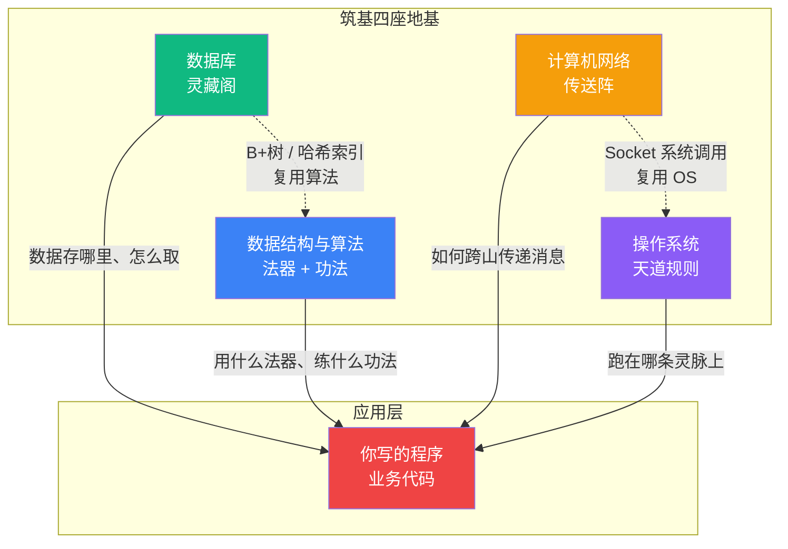

# 【筑基·031】你已经筑基了吗——码农修炼体系四座地基

> **码农修仙传 · 筑基期 · 第31篇**
> 我是玄芯散人，带你从炼气修到大乘。

---

## 境界标识

```
╔══════════════════════════════════╗
║     筑基期 · 第31篇               ║
║     你已经筑基了吗                ║
║     预计阅读：8分钟               ║
╚══════════════════════════════════╝
```

---

## 修仙引入

你是不是写了两年代码，但一被问到这些问题就卡壳：

"进程和线程到底什么区别？"
"TCP三次握手为什么是三次不是两次？"
"哈希表底层是怎么实现的？"

你会写代码，会调API，能搞定业务需求。但这些"基础"问题一问就懵。

在码农修仙体系里，炼气期是"会写代码"，筑基期是"懂原理"。两者之间有一道坎。很多人工作五年十年，实际修为还卡在炼气后期，从没真正筑基。

今天讲清楚：筑基到底要筑什么，以及怎么判断自己有没有筑基成功。

---

## 硬核主体：筑基四座地基

筑基期要打四座地基。缺任何一座，后续修为都是空中楼阁。

四座地基之间互相连通。先看一眼它们的拓扑关系：



图里能看到两层关系。第一层是四座地基托起应用。你的每一行代码，都同时站在这四块地基上。第二层是地基之间互相复用。数据库索引底层是 B+ 树，复用了数据结构这座地基。网络收发数据走 Socket 系统调用，复用了操作系统这座地基。筑基期不是学四门孤立的课，是看清一张互相联通的图。

### 第一座地基：数据结构与算法

这是筑基期最重要的地基。数据结构是法器，算法是功法。

法器是修仙者用来对敌的工具，比如剑、印、镜、鼎。数据结构对程序而言也是工具，比如数组、链表、哈希表。你用什么数据结构，决定了你的程序能怎么操作数据，就像修仙者用什么法器，决定了能打什么仗。

功法是修仙者修炼的内核，决定了灵气怎么运转。算法对程序而言就是内核，决定了计算怎么进行。排序和查找，动态规划和贪心，这些是程序运转的内在逻辑。

再往深一层看，"复杂度"为什么是筑基期的心法？因为它区分了"能跑"和"能扛"。

一段处理一千条数据的代码，全排序 O(n log n) 和堆优化 O(n log k) 跑起来差不多，都是几十毫秒，你根本看不出差别。但当数据量涨到一亿条，全排序要算 27 亿次比较，堆优化只要 6.6 亿次，差距就是 4 倍。再往上到十亿百亿，这就是"分钟级"和"小时级"的区别。面试官问复杂度，问的不是算法本身，是你对规模化的敬畏。

感受一下堆优化的实际写法：

```python
import heapq

def kth_largest(nums, k):
    """小顶堆找第 K 大元素，时间复杂度 O(n log k)"""
    heap = []  # 维护一个大小为 k 的小顶堆
    for num in nums:
        if len(heap) < k:
            heapq.heappush(heap, num)  # 前 k 个先入堆
        elif num > heap[0]:
            # 当前数比堆顶还大，说明能挤进 Top K
            heapq.heapreplace(heap, num)
    return heap[0]  # 堆顶永远是最小的那个，也就是第 K 大

# 实战验证
print(kth_largest([3, 2, 1, 5, 6, 4], 2))  # 输出 5
```

这段代码的灵魂就一行：`heapreplace`。堆里始终只保留 K 个候选，比堆顶还小的直接扔掉，全程不跟全部数据较劲。这就是"减而治之"：不求全局最优，只对最有希望的部分精打细算。

堆的底层也没有多神秘。它就是一个数组，按完全二叉树的方式摆放。下标 i 的节点，左孩子在 2i+1，右孩子在 2i+2，父节点在 (i-1)//2。没有 next 指针，没有 malloc，纯算下标。这正是它访问快、能塞进 CPU 缓存的根因。

判断你是否筑基成功的标准：

问你一个问题。给你一个无序数组，要找出第K大的元素，你怎么做？

- 炼气期回答：排序，然后取第K个。时间复杂度O(n log n)。
- 筑基期回答：用小顶堆，维护K个元素，O(n log k)。

如果你想到的是前者，你还在炼气期。如果你能解释为什么堆更优，并且知道堆的底层是怎么实现的（完全二叉树+数组存储），你的数据结构与算法地基筑成了。

> 筑基丹（学习资源）：《算法导论》经典但厚重，选读。MIT 6.006（B站有中文字幕版）视频课程，更直观。LeetCode刷题，实战验证，按专题刷。

---

### 第二座地基：操作系统

操作系统是天道规则。它决定了所有程序运行的基本法则：谁能用CPU，谁能用内存，谁能读写文件。不管你写什么代码，都在操作系统定的规则里活动。

筑基期不需要你懂内核源码，但要懂几个要紧概念。

进程与线程。进程是独立运行的程序实例，线程是进程内的执行单元。一个进程可以有多个线程，共享进程的资源。

为什么这重要？因为你写的每一行代码都跑在某个线程里。理解线程调度才能理解为什么并发会有问题：为什么需要锁，为什么会有死锁，为什么volatile不够用。

内存管理。虚拟内存和分页机制。你new一个对象，底层发生了什么？为什么Stack Overflow和OutOfMemoryError是两种不同的错误？理解这些，你才能写出内存利用合理的代码，才能调性能问题。

文件系统与IO。文件到底是什么？读写文件时操作系统做了什么？为什么IO慢，怎么改善？这些知识在写高性能应用时至关重要。

把这条链路再拆细一层，重点看三个节点：

- execve 系统调用：把磁盘上的 ELF 可执行文件加载进内存，替换当前进程的地址空间。loader 会解析段表，把 .text 段放到代码区，.data 和 .bss 各自有自己的位置。
- brk / mmap：堆内存的两种分配方式。小对象走 brk，连续扩张。大对象走 mmap，直接在虚拟地址空间里挖一块独立的洞。前者连续且回收快，后者离散但可以单独释放。这个大小分界线取决于具体 malloc 实现，glibc 默认大约 128KB，但不是内核规定。
- 进程切换：CPU 切走当前进程前，要保存当前寄存器状态和页表基址到内核栈。切回来时再恢复。这一来一回就是"上下文切换开销"，纯纯的内核态空转。所以线程池大小不能随意扩大，线程数远超 CPU 核数时，切换开销会吃掉有效计算时间。

下面这段 Python 伪代码演示 Unix 最经典的"父子进程"模型。Nginx 和 Redis 和 Docker 容器的进程模型，都是它的变体：

```python
import os, time

# fork 是 Unix 的灵魂系统调用：当前进程一分为二
pid = os.fork()

if pid == 0:
    # 子进程分支：从这里开始，两个进程同时跑各自的代码
    print(f"[子] 我是新生的 pid={os.getpid()}, 我爹是 {os.getppid()}")
    time.sleep(1)
    print("[子] 干完自己的活，去领盒饭")
    os._exit(0)  # 子进程独立结束
else:
    # 父进程分支
    print(f"[爹] 我是爹 pid={os.getpid()}, 刚生了个娃 {pid}")
    os.waitpid(pid, 0)  # 等子进程跑完再继续
    print("[爹] 娃跑完了，我继续我的事")
```

这段代码的精妙之处：`os.fork()` 之后，父子进程看到的代码完全一样，但根据返回值走不同分支。父进程拿到的是子进程的 pid，子进程拿到的是 0。"一切皆进程"的 Unix 哲学，就是从这个调用开始的。你写的每一个子进程，Nginx 的 worker，Docker 里的容器进程，底层都在重复这个 fork 的动作。

判断你是否筑基成功的标准：

问：你写的程序"点击运行"之后，到"输出结果"之前，中间发生了什么？

- 炼气期回答：程序跑起来了，出了结果。
- 筑基期回答：操作系统创建进程，分配虚拟内存空间，加载可执行文件到内存，CPU从入口点开始执行指令，遇到系统调用时切换到内核态，结果通过IO输出到终端或文件。

如果你能把这个链路大致讲清楚，操作系统地基筑成了。

> 筑基丹：《操作系统导论》（OSTEP）免费在线，讲得最通透。《深入理解计算机系统》（CSAPP）不只是操作系统，是整个计算机系统的底层认知。

---

### 第三座地基：数据库

会写SELECT和JOIN和GROUP BY，这是炼气期。筑基期要懂原理。

索引。B+树是什么，为什么数据库索引用B+树而不是二叉搜索树？聚簇索引和非聚簇索引的区别是什么？什么时候索引会失效？

这些问题不是空谈。你线上SQL慢了，不懂索引原理，你连explain出来的执行计划都看不懂，怎么调？

事务。ACID是什么？隔离级别有哪几种？为什么默认隔离级别是RC或RR？MVCC怎么实现的？

这些在写并发逻辑、处理数据一致性时是必须掌握的。

再拆细一层。先说索引为什么是 B+ 树，不用红黑树（BST 的一种）：

B+ 树是多路平衡查找树，每个节点能存很多 key，所以树的高度极低。一棵 4 层 B+ 树理论上能索引几十亿行。红黑树（二叉平衡树）每个节点只存一个 key，同样数据量树高得多。树每高一层，就是多一次磁盘 IO。而磁盘 IO 是数据库性能的头号瓶颈。一次随机磁盘读要 10ms 左右，CPU 能在这一段空转几百万条指令。

B+ 树还有第二个巧思：所有数据都挂在叶子节点，叶子节点之间用链表串起来。这让范围查询（WHERE id BETWEEN 100 AND 200）变成"沿链表顺序读"，不用回到上层重查。这就是为什么范围查询用 B+ 树索引会特别快。

实际看一段 SQL：

```sql
-- 给 users 表的 age 字段建索引
CREATE INDEX idx_age ON users(age);

-- 查 25 岁的用户
EXPLAIN SELECT * FROM users WHERE age = 25;
```

EXPLAIN 的输出是数据库的"心电图"。看三列就够：

- `type`：ref 或 range 算走索引；ALL 就是全表扫描，基本是事故现场
- `rows`：估算要扫多少行，跟实际偏差过大说明统计信息过期，索引可能选错了
- `Extra`：出现 Using filesort 或 Using temporary 是性能警告，往往意味着没走索引排序

再说事务。MySQL InnoDB 默认隔离级别是 RR（可重复读），靠 MVCC（多版本并发控制）实现。每行数据有隐藏字段：DB_TRX_ID 记录最后修改它的事务ID，DB_ROLL_PTR 指向 undo log 里的旧版本。事务开启时拍一个 ReadView 快照，通过比较 DB_TRX_ID 和 ReadView 里的活跃事务列表，决定当前事务能看到哪个版本。读操作沿着 undo log 版本链找到自己该看到的那一版。这就解决了"不可重复读"的大部分情况，而且不用加锁，读取不阻塞写入。对于幻读，InnoDB 还会加 next-key lock 来防止其他事务插入新行。

判断你是否筑基成功的标准：

问：一张1000万行的表，SELECT * FROM users WHERE age = 25，怎么判断这个查询会不会走索引？

- 炼气期回答：应该会吧。
- 筑基期回答：看WHERE条件字段有没有索引，看字段选择性高不高，用EXPLAIN看执行计划，看type是不是ref/range，看扫描行数估算。

如果你能答出这个链路，数据库地基筑成了。

> 筑基丹：《MySQL技术内幕：InnoDB存储引擎》讲InnoDB实现原理。《数据库系统概念》经典教材，讲通用数据库原理。

---

### 第四座地基：计算机网络

网络是修仙界的传送阵。现代应用几乎没有不联网的，不懂网络，你写的每一个接口都像黑盒。不知道数据怎么出去，怎么回来。

筑基期要懂这些。

TCP/IP。为什么TCP要三次握手？为什么断开要四次挥手？TIME_WAIT是什么，为什么要有？这些不是八股文，是线上故障排查的基础。端口耗尽、连接超时，半连接队列溢出，都跟这些概念有关。

HTTP。HTTP/1.1 和 HTTP/2 和 HTTP/3 有什么区别？Cookie 和 Session 和 Token 的区别？HTTPS的握手过程？GET和POST的真正区别不是"一个传参一个传body"。

最经典的灵魂拷问是：TCP 握手为什么是三次，不是两次？

把它想成两个人隔着一座山喊话确认对方都醒着：

- 一次喊话：你喊"在吗"。只知道自己喊出去了，不知道对方听到没有。
- 两次喊话：对方回"在"。你知道对方收到了，但对方不知道你收到了他的"在"。
- 三次喊话：你再回"好"。双方都确认了对方知道自己在线。

少一次都不行。如果只有两次，服务器发出"在"之后就得开始发数据，但万一这个"在"在路上丢了，客户端压根没收到，服务器还在傻傻地发数据。资源就白白浪费了。三次握手除了确认双向通道都通，还有一层作用是同步双方的初始序列号。TCP 是可靠传输，每个字节都有序号，发送方和接收方必须约定好起始序号，后续的确认和重传才有了基准。

四次挥手同理。客户端说"我说完了"（FIN），服务器回"我知道你说完了"（ACK），服务器也说"我也说完了"（FIN），客户端回"我知道你也说完了"（ACK）。多出来的一次是因为服务器可能还有数据没发完，要分两步关。

用一段 Python 感受下，Socket 编程把这一切都藏进了几行调用里：

```python
import socket

# 客户端：三次握手由操作系统在底层完成
client = socket.socket(socket.AF_INET, socket.SOCK_STREAM)
client.connect(("example.com", 80))  # 这一步背后就是三次握手
client.send(b"GET / HTTP/1.1\r\nHost: example.com\r\n\r\n")
response = client.recv(4096)
print(response.decode("utf-8", errors="ignore")[:200])
client.close()  # 这一步背后是四次挥手
```

你写的代码只有 5 行，但每一次 connect 和 close 背后，TCP 协议栈都替你跑了全部的握手和挥手。线上排查"连接超时""端口耗尽""TIME_WAIT 太多"这些故障时，才知道该看哪个内核参数。比如 `tcp_tw_reuse`、`somaxconn`、`net.ipv4.tcp_max_syn_backlog`。没有这块地基，你看内核参数就像看天书。

判断你是否筑基成功的标准：

问：浏览器输入URL到页面显示出来，中间发生了什么？

- 炼气期回答：发请求，服务器返回HTML，浏览器渲染。
- 筑基期回答：DNS解析→TCP三次握手→TLS握手（HTTPS）→发HTTP请求→服务器处理→返回响应→浏览器解析HTML→构建DOM树和CSSOM→布局→绘制→合成。每一步如果展开，都能讲出细节。

如果你能把这个链路讲清楚，知道每一步可能的性能瓶颈在哪，网络地基筑成了。

> 筑基丹：《计算机网络：自顶向下方法》从应用层往下讲，最易懂。《图解HTTP》入门级，适合快速过一遍。

---

## 修仙术语对照表

| 修仙概念 | 技术现实 | 本篇位置 |
|---------|---------|---------|
| 法器 | 数据结构 | 第一座地基：数组链表树图哈希 |
| 功法 | 算法 | 第一座地基：排序查找DP贪心 |
| 天道规则 | 操作系统 | 第二座地基：进程内存IO |
| 灵藏阁 | 数据库 | 第三座地基：索引事务MVCC |
| 传送阵 | 网络 | 第四座地基：TCP/IP HTTP |
| 灵根 | 编程天赋 | 术语对照：逻辑思维和抽象能力 |
| 筑基丹 | 学习资源 | 每座地基末尾推荐书目 |
| 经脉走向 | 学习路径 | 四座地基的学习顺序 |
| 丹田 | 知识体系 | 四座地基的总称 |
| 闭门造车 | 只写不学 | 舒适区陷阱的别名 |
| 口诀背熟没实修 | 看了不练 | 知行脱节的画像 |
| 实修 | 动手验证 | 每座地基的判断标准 |

---

## 进阶条件

- [ ] 能用小顶堆写出一个找第K大元素的函数，并且说清堆的底层是怎么用数组存的
- [ ] 能向同事讲清楚程序"点击运行"之后到"输出结果"之前中间发生了什么（至少说出5个步骤）
- [ ] 用EXPLAIN看过自己写的SQL执行计划，能说出type字段ref/range/ALL分别什么含义
- [ ] 能用5分钟向人讲清TCP为什么是三次握手不是两次，并且举出少一次会出什么问题
- [ ] 读完四座地基各推荐书目中至少一本的前三章
- [ ] 自己写过至少一个非业务项目（比如echo服务器或mini shell），不是抄教程

如果你勾掉了5条以上，你已经在筑基的路上。如果不到3条，下一篇讲的筑基四座地基就是你接下来的修炼方向。

下一篇讲这个链路：你的代码在CPU里跑了一圈。看看源码变成可执行文件，再到CPU执行，中间到底发生了什么。

---

## 下期预告 + 互动

下一篇：【筑基·032】你的代码在CPU里跑了一圈。源码变成可执行文件再被CPU执行的链路，一次走通。

互动问题：你工作几年了？回忆一下，四座地基里你最薄弱的是哪一座？是数据结构，还是操作系统，还是数据库，还是网络？评论区聊聊。

我是玄芯散人，带你从炼气修到大乘。

---

*本文是「码农修仙传」系列第31篇。系列导航见 [xren.ren](https://xren.ren)*
