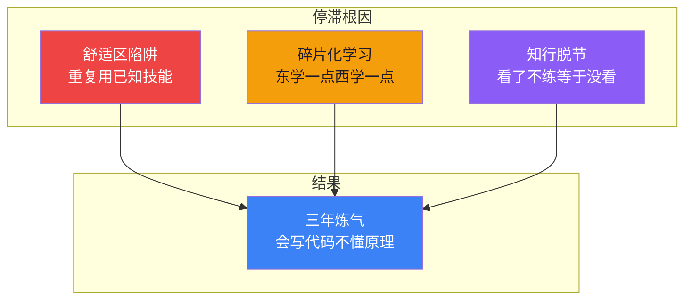
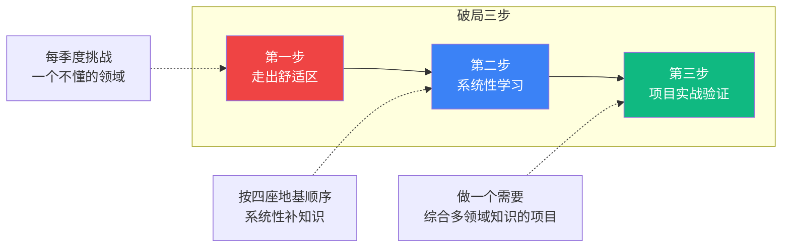

# 【筑基·033】为什么有人三年还在炼气——程序员成长停滞的根因和破局

> **码农修仙传 · 筑基期 · 第33篇**
> 我是玄芯散人，带你从炼气修到大乘。

---

## 境界标识

```
╔════════════════════════════════════╗
║     筑基期 · 第33篇                ║
║     为什么有人三年还在炼气          ║
║     预计阅读：10分钟                ║
╚════════════════════════════════════╝
```

---

## 修仙引入

修真小说里有个常见设定：大量修士一辈子卡在炼气期，灵力再浑厚也进阶不了筑基。不是天赋不够，不是灵石不够，是修炼方向出了问题。

程序员也一样。有人工作三年五年，代码写得很溜，需求扛得住，bug修得快。但一问到"进程和线程什么区别""TCP为什么三次握手""哈希表怎么实现的"，就答不上来。

会写代码，不等于会编程。炼气期满灵力了，但不筑基，永远只能做执行者。

今天拆解三个让人停滞在炼气期的根因，以及怎么破局。

---

## 硬核主体

### 一、三年炼气的典型画像

先对号入座。看看下面这个画像，你中了几条：

```c
// 三年炼气期修士的日常代码
void work_daily(void) {
    while (1) {
        Task *t = receive_task();      // 接需求
        if (t->type == TASK_CRUD) {
            copy_paste(t->template);   // 复制粘贴昨天代码
            t->status = DONE;
        } else if (t->type == TASK_BUG) {
            google(t->error_msg);      // 搜报错信息
            patch(t->file);            // 打补丁
            t->status = DONE;
        }
        // 从来不问：为什么这样写？底层怎么跑的？
        if (t->status == DONE)
            break;
    }
}
```

这段伪代码看着夸张，但很多人的生活差不多。每天的工作就是接需求，搜方案，改代码，提测。循环往复，三年下来写了十万行代码，技术认知还停在第一年的水平。

问题不在于"写得不够多"，在于"重复低水平循环"。十万行复制粘贴，跟一万行深入思考，成长差距是数量级的。

### 二、三个根因



#### 根因一：舒适区陷阱

舒适区不是偷懒。很多人加班很多，工作很拼，但拼的全是自己已经会的活。

写了两年Spring Boot增删改查，第三年还在写增删改查，换了项目还是增删改查。Spring Boot版本从2.x升到3.x，但做的事情没变。这就像修士每天打坐吸纳灵气，灵力越来越浑厚，但经脉走向从没变过，永远卡在同一个瓶颈。

判断标准很简单：你最近三个月写代码时，有没有遇到过"需要学一个完全不懂的东西才能继续"的时刻？如果没有，你就在舒适区里。

有个指标可以自测：

```python
# 技术成长率自测
def growth_rate(tasks):
    """计算过去N个任务中有多少需要学新东西"""
    if not tasks:
        return "无数据"
    new_skill_count = 0
    for task in tasks:
        if task.requires_new_knowledge:  # 需要查文档/学新概念
            new_skill_count += 1
    rate = new_skill_count / len(tasks)
    
    if rate < 0.1:
        return "危险区：几乎全是重复劳动"
    elif rate < 0.3:
        return "温水区：偶尔学点新的，不够系统"
    elif rate < 0.5:
        return "成长区：持续接触新领域"
    else:
        return "进阶区：在舒适区外待的时间比在内长"

# 诚实回答：你过去三个月的任务，有几个需要学新东西？
```

低于0.1的成长率，三年下来技术认知基本没动。不是没努力，是努力的方向不对。

#### 根因二：碎片化学习

碎片化学习是这年代最容易掉进去的坑。

刷到一篇"十分钟搞懂Redis持久化"，看了，觉得自己懂了。刷到一条"TCP三次握手图解"，看了，觉得自己懂了。刷到一段"Linux进程调度原理"，看了，觉得自己懂了。

每篇都看了，每篇都"懂了"，但知识点之间没有连线。就像修士今天学了一招剑法，明天学了一式身法，后天学了一道符箓，招式攒了一大堆，但没有内功心法串起来，实战时一招都用不出来。

碎片化学习的特征是：知识没有层次结构。你问"Redis持久化"，他能说RDB和AOF。你问"持久化触发的时机和fork子进程的关系"，答不上来。因为第二层需要操作系统知识，而操作系统这座地基他没筑过。

碎片化学习的解药是系统性学习。不是不刷技术文章，是先搭好骨架再填细节。先知道CS基础有四座地基（数据结构，操作系统，计算机组成，网络），再往每座地基里填具体知识。碎片化信息变成知识树上的一个节点，才算真正吸收。

```python
# 碎片化 vs 体系化学习对比
fragmented = [
    "Redis持久化", "TCP三次握手", "进程调度",
    "B+树索引", "volatile原理", "GC算法",
    "Epoll", "内存对齐", "Docker原理",
]

systematic = {
    "数据结构与算法": ["B+树索引", "排序算法", "复杂度分析"],
    "操作系统": ["进程调度", "volatile原理", "内存管理", "Epoll"],
    "计算机组成": ["内存对齐", "CPU缓存", "指令执行"],
    "网络": ["TCP三次握手", "HTTP协议", "Socket编程"],
    "工程工具": ["Redis持久化", "Docker原理", "Git"],
}

# 碎片化：9个知识点，互相之间没有关系
# 系统性：同样9个知识点，挂在5棵树上，每棵树有脉络
# 同样的信息量，系统性吸收率高出3-5倍
```

同样是9个知识点，散落着记和挂在树上记，提取的时候差别巨大。面试官问你Epoll，系统性学习的人能围绕操作系统的系统调用一路聊到事件驱动模型，碎片化的人只能说"就是比select快的那个"。

#### 根因三：知行脱节

知行脱节最隐蔽。看了很多书，读了很多源码解析，收藏了一堆教程，但手上从来不写。

修真小说里叫"闭门造车""纸上谈兵"。功法口诀背得滚瓜烂熟，但从来不实修。真到了实战，发现口诀跟实际手感完全对不上。

举个具体的例子。你读了一篇讲epoll原理的文章，文章说"epoll用红黑树管理fd，用就绪链表返回活跃fd"。你点头说懂了。但如果让你用C写一个epoll版的echo服务器，你写得出吗？

```c
// 你真的"懂"epoll吗？试着不看资料写出来
#include <sys/epoll.h>
#include <sys/socket.h>

#define MAX_EVENTS 10

int epoll_echo(int listen_fd) {
    int epfd = epoll_create1(0);  // 创建epoll实例
    
    struct epoll_event ev;
    ev.events = EPOLLIN;          // 监听可读事件
    ev.data.fd = listen_fd;
    epoll_ctl(epfd, EPOLL_CTL_ADD, listen_fd, &ev);  // 注册监听fd
    
    struct epoll_event events[MAX_EVENTS];
    while (1) {
        int n = epoll_wait(epfd, events, MAX_EVENTS, -1);  // 等待事件
        for (int i = 0; i < n; i++) {
            if (events[i].data.fd == listen_fd) {
                // 新连接来了
                int conn_fd = accept(listen_fd, NULL, NULL);
                ev.events = EPOLLIN;
                ev.data.fd = conn_fd;
                epoll_ctl(epfd, EPOLL_CTL_ADD, conn_fd, &ev);
            } else {
                // 已有连接有数据
                char buf[1024];
                int fd = events[i].data.fd;
                int len = read(fd, buf, sizeof(buf));
                if (len <= 0) {
                    epoll_ctl(epfd, EPOLL_CTL_DEL, fd, &ev);  // 删除时events可为NULL(Linux 2.6.9+)
                    close(fd);
                } else {
                    write(fd, buf, len);  // echo回去
                }
            }
        }
    }
}
```

如果你看这段代码能一眼看懂每个函数的参数和返回值，并且知道epoll_create1跟epoll_create的区别，那确实懂了。如果看不太懂，说明之前那篇文章你只是"看过"，不是"学过"。

知行脱节的判断标准：你收藏的技术文章里，有几篇你跟着敲过代码跑过demo改过参数验证过？如果低于10%，就是知行脱节。

### 三、破局路径

三个根因说完了，怎么破？



第一步，走出舒适区。不是辞职换方向，是在当前工作里找需要学新东西的任务。做后端的去碰一碰前端，做应用的去碰一碰系统，做业务的去碰一碰工具链。每季度给自己设一个"不懂但必须搞定"的挑战。

第二步，系统性学习。别再东刷一篇文章西看一个视频了。找一套经典教材（《CSAPP》《算法导论》《操作系统导论》），按顺序读，做笔记，做课后题。把碎片化的知识重新挂在知识树上。

第三步，项目实战验证。学完一个领域，做一个能跑的项目验证。学完网络编程就写一个HTTP服务器，学完操作系统就写一个shell，学完数据结构就用红黑树实现一个定时器。项目不需要大，但必须自己从零写，不能抄。

这三步是个循环。走出舒适区发现问题，系统性学习补知识，项目实战验证掌握程度，然后找下一个不懂的领域继续。

### 四、时间投入的数学题

很多人说"我加班到九点十点，哪有时间学"。算一笔账。

```python
# 技术成长的时间账本
def time_account():
    """每周可用于技术成长的时间"""
    
    # 碎片时间
    commute = 0.5 * 5    # 通勤每天30分钟听技术播客 = 2.5h/周
    lunch = 0.5 * 5      # 午休看技术文章 = 2.5h/周
    
    # 固定学习时间
    weekday_evening = 1.0 * 5  # 工作日晚上各1小时 = 5h/周
    weekend = 3.0 * 2          # 周末各3小时 = 6h/周
    
    total = commute + lunch + weekday_evening + weekend
    return f"每周可投入: {total}小时, 每年: {total * 48}小时"

print(time_account())
# 输出: 每周可投入: 16.0小时, 每年: 768.0小时
```

每年768小时。CSAPP大概需要250小时读完，算法导论选读需要300小时，操作系统导论需要100小时。三大基础教材加起来650小时，不到一年的固定学习时间。剩下118小时做两三个实战项目绰绰有余。

不是没时间，是时间被短视频和游戏吃掉了。把每天刷手机的时间换成读一章节书，一年下来差距就是天和地。

---

## 修仙术语对照表

| 修仙术语 | 技术现实 | 本篇位置 |
|---------|---------|---------|
| 炼气期 | 会写代码但不懂底层原理的阶段 | 开篇画像 |
| 筑基 | 理解CS基础原理，能看透代码背后发生了什么 | 全文主线 |
| 灵力浑厚 | 代码写得多、写得快 | 根因一舒适区 |
| 经脉走向不变 | 重复用相同技能，没有接触新领域 | 根因一 |
| 招式攒一堆没心法 | 碎片化学知识点之间没有联系 | 根因二 |
| 口诀背熟没下场实修 | 看了文章不写代码验证 | 根因三 |
| 功法口诀 | 技术文章和教材 | 根因三 |
| 闭门造车 | 只看不练的学习方式 | 根因三 |
| 丹田 | 知识树，存放修炼成果的地方 | 破局第二步 |
| 进阶瓶颈 | 炼气到筑基的跃迁 | 破局三步 |
| 实修 | 动手写代码做项目验证 | 破局第三步 |
| 灵脉 | 学习路径和知识脉络 | 碎片化对比 |
| 悟道 | 理解技术背后的原理 | 破局第二步 |
| 师门传承 | 经典教材系统性学习 | 破局第二步 |

---

## 进阶条件

- [ ] 过去30天里，至少有1次"必须学不懂的东西才能继续"的经历
- [ ] 能说出CS基础四座地基的名字，并且每座地基至少读过一本教材的前三章
- [ ] 收藏夹里的技术文章，至少有10%跟着敲过代码验证过
- [ ] 过去6个月里，自己从零写过至少1个非业务项目（不是复制粘贴模板）
- [ ] 能向同事用5分钟讲清楚一个技术概念（比如"TCP为什么三次握手"），对方能听懂
- [ ] 每周有固定的技术学习时间，至少5小时，持续超过3个月
- [ ] 能画出自己技术知识树的脑图，标出哪些领域已掌握、哪些还很薄弱

如果你勾掉了5条以上，你已经在筑基的路上。如果不到3条，下一篇讲的筑基四座地基就是你接下来的修炼方向。

---

## 下期预告 + 互动

下一篇：筑基四座地基。今天讲了"为什么停滞"，下期讲"往哪里走"。筑基期要打四座地基，每座学什么，学到什么程度，一次说清楚。

互动问题：你工作几年了？回忆一下，过去一年里有没有一个时刻让你觉得"技术认知被刷新了"？如果有，是什么触发的？如果没有，可能你也在舒适区里转圈。

我是玄芯散人，带你从炼气修到大乘。

---

*本文是「码农修仙传」系列第33篇。系列导航见 [xren.ren](https://xren.ren)*
