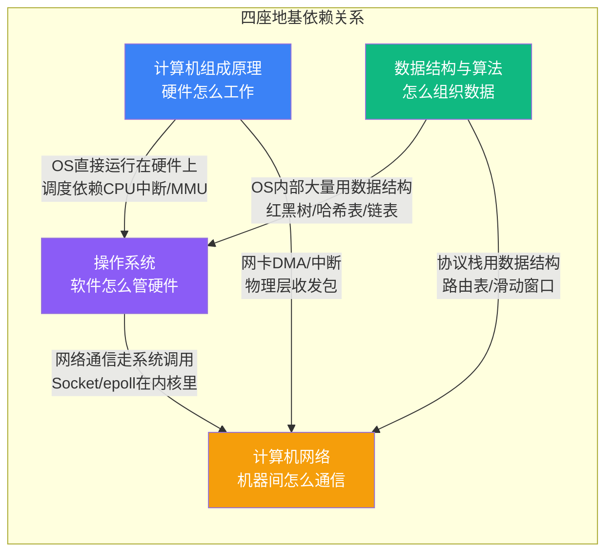
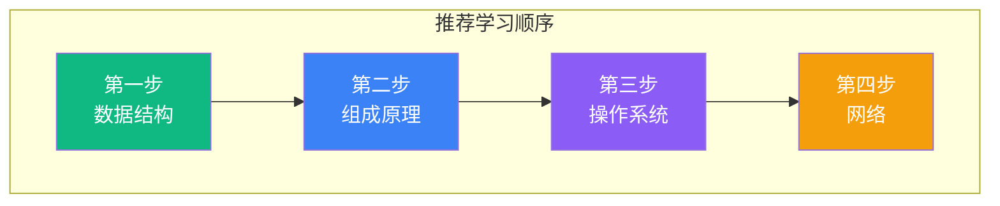

# 【筑基·034】程序员绕不开的四座地基：CS基础体系总览

> **码农修仙传 · 筑基期 · 第34篇**
> 我是玄芯散人，带你从炼气修到大乘。

---

## 境界标识

```
╔══════════════════════════════════════╗
║     筑基期 · 第34篇                   ║
║     计算机组成/OS/数据结构/网络四座地基    ║
║     预计阅读：12分钟                   ║
╚══════════════════════════════════════╝
```

---

## 修仙引入

修真小说里，筑基不是往丹田里灌灵气就完了。宗门给你一块地，你得在上面建四根柱子。四根柱子的高低粗细决定你这辈子能盖多高的楼。

柱子之间还不是各建各的。数据结构这根柱子歪了，操作系统的进程调度就站不住。操作系统这根柱子短了，网络的Socket通信就悬在半空。四根柱子互相借力，最后撑起的是同一片天花板，就是你写的每一行业务代码。

上一篇033讲了"为什么有人三年还在炼气"，拆解了停滞的原因。这篇讲往哪走：筑基要筑的四座地基，它们之间什么关系，先学哪个后学哪个，每座学到什么程度算够。

---

## 硬核主体

### 一、为什么是这四座

计算机科学的知识庞大到一个人一辈子学不完。但站在程序员实战的立场，真正左右你"能不能看懂代码背后发生了什么"的，就四块：

- 计算机组成原理：硬件怎么工作
- 操作系统：软件怎么管硬件
- 数据结构与算法：怎么组织数据让程序跑得快
- 计算机网络：机器之间怎么通信

有人会问：数据库呢？编译原理呢？软件工程呢？

数据库是数据结构和操作系统的上层组合。B+树索引是数据结构，事务隔离靠操作系统的锁和并发控制。你把数据结构和操作系统两座打牢了，数据库的原理自然能看懂。

编译原理是金丹期的内容，筑基期不碰。软件工程偏经验积累，不在这四座里面。

这四座的选择标准很简单：缺了任何一座，后面学什么都会卡。不懂数据结构，你写不出快的代码。不懂操作系统，你看不懂为什么多线程会出bug。不懂组成原理，你理解不了CPU缓存和内存屏障。不懂网络，你的程序就是个孤岛。

### 二、四座地基的依赖拓扑

四座地基不是平铺的四块砖，它们之间有明确的依赖关系。先看图：



这张图的信息量很大，拆开看：

组成原理是所有地基的地基。操作系统直接跑在硬件上，它管理的进程调度靠CPU的时间片中断，虚拟内存靠MMU做地址翻译，文件系统靠磁盘控制器。你不理解硬件怎么工作，操作系统的很多设计就只是"规定"而不是"道理"。

数据结构是操作系统的工具箱。Linux内核里到处都是数据结构：进程调度器用红黑树管理进程队列，文件系统用B+树管理目录索引，网络协议栈用链表管理socket连接。数据结构不好的人看内核代码像看天书，不是因为内核逻辑多复杂，是连容器都看不懂。

操作系统是网络的支撑。你写一行 `socket.connect()`，背后是操作系统的TCP协议栈在跑三次握手。epoll的实现完全在内核里，不懂操作系统的人学epoll只能背概念。

组成原理也直接支撑网络。网卡收包靠DMA把数据搬到内存，靠中断通知CPU处理。物理层的每一帧都经过硬件通道，这部分属于组成原理和网络的交叉地带。

### 三、每座地基学到什么程度

四座地基不是每座都要学到专家级别。筑基期的目标很明确：能看懂代码背后发生了什么。下面逐一说每座学到什么程度算够。

#### 计算机组成原理：理解到"CPU怎么执行指令"

组成原理回答的问题是：你写的代码，CPU怎么执行的？

需要掌握的：
- CPU的指令周期，也就是取指然后解码然后执行然后访存然后写回
- 寄存器和内存的层次关系：为什么有L1/L2/L3缓存
- 汇编语言能读简单的，不是让你手写汇编，是看懂编译器生成的汇编
- 总线概念：CPU怎么跟内存和外设通信

不需要掌握的（这些在元婴期深入）：
- 具体某款CPU的寄存器位域
- 外设控制器的编程方法
- 芯片手册怎么读

```c
// 一行C代码
int a = 1 + 2;

// 编译成ARM64汇编后（筑基期只要求能读懂，不要求手写汇编）
// mov  w0, #1      ; 把1放进寄存器w0
// mov  w1, #2      ; 把2放进寄存器w1
// add  w0, w0, w1  ; w0 = w0 + w1 = 3
// str  w0, [sp, #4]; 把结果存到栈上变量a的位置
```

你能说出"CPU先取到mov指令，解码后执行寄存器赋值，最后把结果写回内存"，组成原理这关就算过了。知道缓存行是64字节，知道CPU缓存命中率左右程序性能，也算加分。

#### 操作系统：理解到"程序跑在OS上"

操作系统回答的问题是：你的程序跑的时候，OS在背后做了什么？

需要掌握的：
- 进程和线程的区别：调度方式，地址空间隔离，上下文切换的代价
- 虚拟内存：为什么每个进程以为自己独占4GB
- 系统调用：用户态到内核态的切换
- 文件系统概念：inode是什么，目录树怎么组织，VFS在做什么
- 锁和并发：mutex怎么用，死锁的四个条件，volatile为什么不够用

不需要掌握的（这些在金丹期深入）：
- 内核源码精读
- CFS调度器的红黑树实现
- 写Linux内核模块

```python
import os

# fork之后，父子进程各自跑
pid = os.fork()
if pid == 0:
    # 子进程：独立地址空间，独立PC
    print(f"子进程 pid={os.getpid()}")
    os._exit(0)
else:
    os.waitpid(pid, 0)  # 等子进程结束
    print("父进程继续")
```

你能解释fork之后操作系统为子进程复制了页表（写时复制），能说出waitpid为什么不会阻塞整个系统，操作系统这关就算过了。

#### 数据结构与算法：理解到"选对工具"

数据结构回答的问题是：面对一个具体问题，你选什么数据结构，代价是多少？

需要掌握的：
- 常见数据结构包括数组、链表、栈、队列、哈希表以及树形结构，掌握每种的基本操作和时间代价
- 排序算法：冒泡和快排和归并的时间空间代价
- 大O表示法：能估算自己代码的时间复杂度
- 缓存友好性：为什么数组比链表快（CPU缓存行）

不需要掌握的：
- 红黑树的手写实现（知道用途和复杂度就行）
- 动态规划的所有变体
- 竞赛级算法技巧

```python
# 同样找第K大元素，不同数据结构差1000倍
import heapq

def kth_largest_sort(nums, k):
    # 方法1：排序后取第K个，O(n log n)
    return sorted(nums)[-k]

def kth_largest_heap(nums, k):
    # 方法2：小顶堆维护K个元素，O(n log k)
    heap = []
    for num in nums:
        if len(heap) < k:
            heapq.heappush(heap, num)
        elif num > heap[0]:
            heapq.heapreplace(heap, num)
    return heap[0]
```

你看到这段代码，能说出"n=100万、k=10时，方法1要做约2000万次比较，方法2只做约330万次"，数据结构这关就过了。

#### 计算机网络：理解到"数据怎么出去怎么回来"

网络回答的问题是：你发一个HTTP请求，数据经过哪些层到达服务器，响应怎么回来？

需要掌握的：
- TCP/IP四层结构：最上层是HTTP所在的层，传输层负责端到端，网络层负责寻路，链路层负责物理传输
- TCP三次握手和四次挥手：不是背流程，是知道为什么
- HTTP请求响应：GET和POST的区别，状态码含义
- DNS解析：域名怎么变IP
- Socket编程：能写一个简单的echo服务器

不需要掌握的：
- TCP拥塞控制的数学理论
- BGP路由协议
- QUIC和SCTP等底层传输协议细节

```python
import socket

# 客户端发HTTP请求
client = socket.socket(socket.AF_INET, socket.SOCK_STREAM)
client.connect(("example.com", 80))  # 三次握手在这步完成
client.send(b"GET / HTTP/1.1\r\nHost: example.com\r\n\r\n")
response = client.recv(4096)
client.close()  # 四次挥手在这步完成
```

你能解释connect背后操作系统做了什么，能说出为什么TIME_WAIT要等2MSL，网络这关就过了。

### 四、学习顺序建议

四座地基有依赖关系，学习顺序不能乱。



为什么先学数据结构？因为它是工具箱。后面学操作系统时，进程调度器用红黑树，文件系统用B+树，网络协议栈用链表。不懂这些容器，看什么底层代码都费劲。而且数据结构不依赖其他三座，可以零基础直接入门。

为什么组成原理排第二？因为操作系统直接跑在硬件上。你不知道CPU怎么执行指令、不知道缓存是什么，学操作系统时很多设计只能死记。

操作系统排第三。有了数据结构做工具，有了组成原理做硬件认知，学操作系统时能真正理解"为什么这么设计"，而不是背概念。

网络排最后。网络通信走系统调用，协议栈在内核里实现，这些都依赖操作系统知识。你先理解了进程是什么，先理解了文件描述符是什么，先理解了系统调用怎么切换，再看Socket和epoll会顺很多。

当然这不是唯一路线。如果你已经在工作中积累了某块的知识，可以跳过先学其他的。但如果是零基础系统性补课，按这个顺序走效率最高。

### 五、学习资源和时间预算

四座地基都学一遍需要多久？按每天投入2小时算：

| 地基 | 推荐资源 | 预计时间 |
|------|---------|---------|
| 数据结构 | 《算法图解》入门，LeetCode刷100题 | 3个月 |
| 组成原理 | CSAPP前6章 | 2个月 |
| 操作系统 | OSTEP（免费在线） | 2个月 |
| 网络 | 《计算机网络：自顶向下方法》前5章 | 2个月 |

合计约9个月。听起来很长，但这是在打基础。基础打好了，后面学什么工具、什么语言都快。基础没打好，学什么都像在沙子上盖楼。

```python
def study_plan():
    """筑基四座地基的时间预算"""
    foundations = [
        ("数据结构", 90, "算法图解 + LeetCode"),
        ("组成原理", 60, "CSAPP前6章"),
        ("操作系统", 60, "OSTEP"),
        ("网络", 60, "自顶向下方法前5章"),
    ]
    total_days = sum(d for _, d, _ in foundations)
    total_hours = total_days * 2  # 每天2小时
    return f"总计{total_days}天约{total_hours}小时，约{total_days/30:.0f}个月"

print(study_plan())
# 输出: 总计270天约540小时，约9个月
```

540小时听起来多，但分到9个月，每天2小时。大多数人每天刷手机的时间远超2小时。

### 六、常见学习误区

误区一：四座并行学。有人同时开四本书，每本看一章。结果数据结构还在看链表，组成原理已经讲到流水线了，知识之间搭不上。四座有依赖，按顺序学效率最高。

误区二：只看不练。看《CSAPP》觉得都懂了，但从来没写过系统调用的代码。上一篇033讲过这个坑（根因三：知行脱节），这里再强调一次：知识停留在眼睛里，没进手。每学完一个概念，写段代码验证一下。

误区三：钻太深。组成原理学到晶体管原理，操作系统学到内核源码。筑基期的目标是"看懂代码背后发生了什么"，不是"成为硬件工程师"或"成为内核开发者"。每个概念学到能讲清楚就够了，深入留到后续境界。

误区四：跳过组成原理。很多人觉得组成原理"离业务太远"直接跳过。结果学操作系统时不懂为什么有缓存行对齐，学并发时不理解内存屏障，学性能调优时看不懂CPU缓存命中率。组成原理是四座里最容易被忽视但牵连最广的。

---

## 修仙术语对照表

| 修仙术语 | 技术现实 | 本篇位置 |
|---------|---------|---------|
| 四座地基 | 组成原理/OS/数据结构/网络 | 全文主线 |
| 柱子歪了 | 某块基础没打好，牵连其他模块 | 修仙引入 |
| 工具箱 | 数据结构是操作系统的底层工具 | 依赖拓扑 |
| 天道规则 | 操作系统管理硬件的法则 | 依赖拓扑 |
| 传送阵 | 网络通信 | 依赖拓扑 |
| 丹田灌灵 | 往脑子里灌知识但不系统 | 误区一 |
| 闭门造车 | 只看不练 | 误区二 |
| 走火入魔 | 钻太深超出筑基范围 | 误区三 |
| 灵脉 | 硬件通道，CPU和内存之间的通路 | 组成原理 |
| 经脉 | 学习路径和知识脉络 | 学习顺序 |
| 实修 | 写代码验证概念 | 误区二 |
| 宗门传承 | 经典教材系统性学习 | 推荐资源 |
| 修炼境界 | 技术能力层级 | 钻太深 |
| 孤岛 | 不懂网络时程序的状态 | 为什么四座 |

---

## 进阶条件

- [ ] 能用一句话说清四座地基各自解决什么问题
- [ ] 能画出四座地基的依赖拓扑图，标出谁依赖谁
- [ ] 知道学习顺序：数据结构然后组成原理然后操作系统然后网络，并且能说清为什么
- [ ] 每座地基至少读过一本推荐教材的前三章
- [ ] 能说出组成原理跟操作系统之间的关系（OS调度依赖CPU中断和MMU）
- [ ] 能说出数据结构在操作系统中的三个具体用处（红黑树用于调度队列，B+树用于文件索引，链表用于连接管理）
- [ ] 有一个9个月的学习计划，明确每周投入多少时间

如果你勾掉了5条以上，你的筑基地基已经初具雏形。下一篇带你做一次自测，看看四座地基里你到底缺哪一块。

---

## 下期预告 + 互动

下一篇：工作五年还在炼气期？筑基的四座地基你缺哪一块。今天讲了四座是什么，它们之间什么关系，该怎么学。下期给你一套自测题，逐座检查你的掌握程度，找到薄弱环节，精准补课。

互动问题：四座地基里，你觉得哪一座最薄弱？是从来没学过组成原理，还是数据结构只停留在"会用但不懂数据结构"的阶段？评论区说说你的情况，我来帮你判断该怎么补。

我是玄芯散人，带你修到大乘。

---

*本文是「码农修仙传」系列第34篇。系列导航见 [xren.ren](https://xren.ren)*
