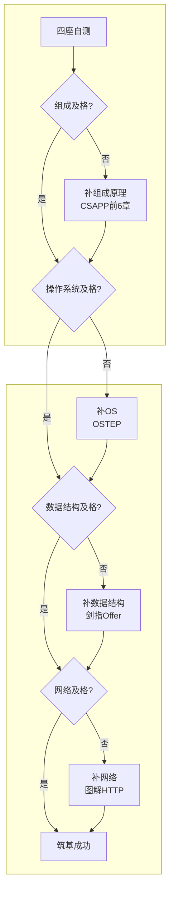

# 【筑基·035】工作五年还在炼气期？筑基的四座地基你缺哪一块

> **码农修仙传 · 筑基期 · 第35篇**
> 我是玄芯散人，带你从炼气修到大乘。

---

## 境界标识

```
╔══════════════════════════════════════╗
║     筑基期 · 第35篇                   ║
║     工作五年还在炼气期？自测缺哪块地基  ║
║     预计阅读：10分钟                   ║
╚══════════════════════════════════════╝
```

---

## 修仙引入

修真体系里有个残酷的筛选机制：炼气期满灵力的修士多如牛毛，真正筑基成功的不到三成。大部分灵力攒够了，但底子虚浮，丹药催上去也凝聚不出道基。

程序员这个行业更狠。没有外部筛选择，工作五年十年的炼气期修士大量存在。代码写得飞快，框架用得熟练，增删改查信手拈来。但一遇到性能问题，一碰到并发bug，一看到网络异常，就束手无策。

上一篇034讲了筑基要建四座地基。这篇做一件事：帮你搞清楚自己到底缺哪一块。

---

## 硬核主体

### 一、为什么要自测

很多人意识到该补CS基础，买了一堆书，从头开始啃。结果看了两章《深入理解计算机系统》就放弃了，因为不知道自己在哪，也不知道要去哪。

盲目补和完全不补，结果一样烂。补之前先搞清楚两件事：

1. 你现在在什么位置（哪些会，哪些不会）
2. 你该先补哪块（优先级怎么排）

四座地基之间有依赖关系。组成原理是地基的地基，操作系统站在组成原理上面，数据结构和网络相对独立。先补最底层最缺的那块，效率最高。

下面给出四座地基各自的自测题。每座5道题，答对3道算及格，不到3道说明这块地基需要补。

### 二、计算机组成原理自测

```c
// 第1题：下面代码在x86-64上输出什么？
#include <stdio.h>
int main() {
    int a = 1;
    char *p = (char *)&a;
    printf("%d\n", *p);  // 小端序，输出1还是0？
    return 0;
}
```

```c
// 第2题：位运算
int x = 0x50;  // 0101 0000
int y = x | (1 << 3);  // 把第3位置1，y=0x58 (0101 1000)
int z = x & ~(1 << 4); // 把第4位清0，z=0x40 (0100 0000)
```

第3题：CPU缓存行一般是多少字节？为什么结构体里两个字段频繁交替读写会导致性能下降？

第4题：`int a = 1; int b = 2; int c = a + b;` 这三行代码，CPU大致经历了哪几个阶段？

第5题：浮点数为什么不能直接用`==`比较？0.1 + 0.2在IEEE 754双精度下等于0.3吗？

如果你答不上缓存行大小（64字节），答不上CPU取指解码执行写回，答不上小端序的存储方式，那组成原理这块地基缺了。

### 三、操作系统自测

```c
// 第1题：进程和线程
// 下面代码fork之后，x的值在父子进程里分别是多少？
int x = 10;
pid_t pid = fork();
if (pid == 0) {
    x = 20;  // 子进程改了x
}
// 父进程的x是多少？子进程的x是多少？
```

```bash
# 第2题：文件描述符
# 下面命令做了什么？
$ ls -l /proc/self/fd
# 0、1、2分别指向什么？
```

第3题：虚拟内存是什么意思？一个进程访问的地址0x400000一定是物理内存的0x400000吗？（如果不是，CPU怎么把虚拟地址翻译成物理地址的？）

第4题：mutex和spinlock什么区别？什么情况下用spinlock更合适？

第5题：`time`命令输出的real、user、sys分别代表什么？为什么一个多线程程序user时间可能大于real时间？

如果你不知道fork之后父子进程各自有独立的地址空间，不知道文件描述符0/1/2是标准输入输出错误，不知道虚拟内存和物理内存的区别，操作系统这块需要补。

### 四、数据结构与算法自测

```python
# 第1题：复杂度
# 下面函数的时间复杂度是多少？
def mystery(n):
    count = 0
    i = 1
    while i < n:
        i *= 2
        count += 1
    return count
# O(n)? O(n^2)? O(log n)? O(1)?
```

```c
// 第2题：哈希表
// 哈希表冲突解决有哪两种方式？
// Java HashMap用的哪种？什么情况下链表会转成红黑树？
```

第3题：二叉搜索树在最坏情况下退化成什么？为什么需要AVL树或红黑树？

第4题：BFS和DFS分别用什么数据结构实现？哪个能找到无权图的最短路径？

第5题：快排的平均时间复杂度和最坏时间复杂度分别是多少？什么情况下会触发最坏情况？（提示：和pivot选择策略有关）

如果你算不出O(log n)，不知道拉链法和开放寻址法，不知道快排最坏情况O(n^2)出现在数组已排序时，数据结构这块有漏洞。

### 五、计算机网络自测

```bash
# 第1题：TCP三次握手
# 用tcpdump或wireshark能看到三个包，分别是什么？
# 为什么不是两次？为什么不是四次？
```

```python
# 第2题：HTTP状态码
# 200、301、302、404、500分别代表什么？
# 301和302的区别是什么？对SEO有什么影响？
```

第3题：DNS解析的过程是什么？浏览器输入`www.example.com`后，经过哪些步骤拿到IP地址？

第4题：TCP和UDP的区别是什么？视频通话一般用哪个？为什么？

第5题：什么是NAT？为什么家里多台设备共用一个公网IP也能上网？

如果你说不出三次握手的SYN/SYN-ACK/ACK三个包，分不清301永久重定向和302临时重定向，不知道DNS先查本地缓存再查本地DNS服务器再递归查询，网络这块缺了。

### 五点五、补课顺序说明

034讲的是入门学习顺序，从数据结构起步。这篇讲的是工作后补课顺序，应该反过来，先补组成原理。原因很简单：入门时需要快速产出感，数据结构刷题见效最快。工作后补课要补的是底层理解，组成原理是其他三座的地基。两篇文章讲的顺序不矛盾，适用阶段不同。

### 六、自测结果怎么看



注意这张图的补课顺序。组成原理是地基的地基，缺了它，操作系统里的虚拟内存和文件系统会学得似懂非懂。操作系统是数据结构和网络的基础，进程和线程的概念不清晰，数据结构里的队列和栈就只是纸上的定义。网络放在最后补，因为它对前三座的依赖最弱。

### 七、补课的时间线建议

有人问：工作五年了，每天加班到九点，哪有时间补这些。这里给一个现实的方案：

每天抽30分钟，坚持半年。不需要把书从头啃到尾，抓住每座地基的5个知识点就够了。

- 组成原理（1个月）：补码表示，位运算，内存层级，CPU流水线概念，缓存行
- 操作系统（2个月）：进程线程，虚拟内存，文件描述符，锁的概念，调度原理
- 数据结构（2个月）：数组链表，栈队列，哈希表，二叉树，排序算法
- 网络（1个月）：TCP三次握手，HTTP方法状态码，DNS解析流程，TCP vs UDP，NAT穿透

每块不需要学到能考试。能用自己的话给同事讲明白，就算及格。

---

## 修仙术语对照表

| 修仙术语 | 技术现实 | 本篇位置 |
|---------|---------|---------|
| 炼气期满灵力 | 代码写得溜但不懂底层 | 引入段 |
| 筑基四座地基 | CS四大基础：组成/OS/数据结构/网络 | 硬核主体 |
| 根底虚浮 | 会写代码但答不上CS基础题 | 引入段 |
| 灵脉 | 计算机组成原理（最底层的根脉） | 组成原理自测 |
| 天道规则 | 操作系统（管硬件的规则层） | 操作系统自测 |
| 功法 | 数据结构与算法（组织数据的方法论） | 数据结构自测 |
| 传送阵 | 计算机网络（机器间通信） | 网络自测 |
| 丹药催上去 | 框架和工具的堆砌，治标不治本 | 引入段 |
| 筑基成功 | 四座地基自测全部及格 | 诊断图 |
| 自检灵根 | 自测题检查缺哪块地基 | 硬核主体 |
| 补课 | 补地基的学习路径 | 时间线建议 |

---

## 进阶条件

- [ ] 能独立完成四座地基的自测题，每座答对3题以上
- [ ] 知道自己最缺哪一块，制定了优先补课顺序
- [ ] 理解组成原理是四座地基中最底层的一块，优先补
- [ ] 能用自己的话向同事讲清楚fork之后父子进程的地址空间关系
- [ ] 能画出浏览器输入URL之后到看到页面的全链路（DNS解析，TCP连接，HTTP请求，服务器响应）
- [ ] 能区分O(n)和O(log n)的差别，知道二分查找为什么是O(log n)
- [ ] 每天能抽30分钟专门补CS基础，坚持至少3个月

四座地基补齐了，就能进入筑基期的后半段：动手实操。下一篇讲筑基期怎么毕业。

---

## 下期预告 + 互动

下一篇：036《筑基期毕业：能独立完成一个项目》。四座地基补齐了不是终点，终点是把知识串起来做一个全的东西。到时候讲项目实操和毕业标准。

互动：

1. 你工作几年了？四座地基自测，哪一块最虚？
2. 你觉得补CS基础最好的方式是什么？看书？刷题？做项目？评论区聊聊。

我是玄芯散人，带你从炼气修到大乘。

---

*本文是「码农修仙传」系列第35篇。系列导航见 [xren.ren](https://xren.ren)*
