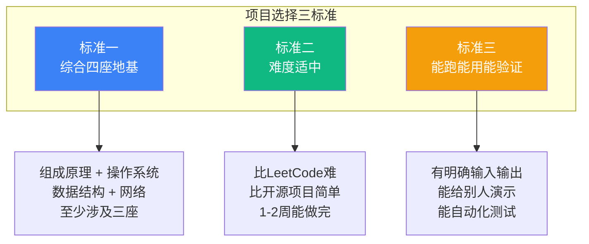
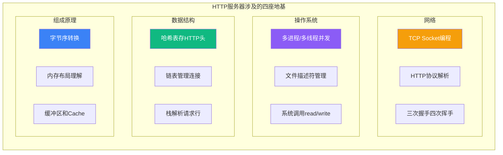
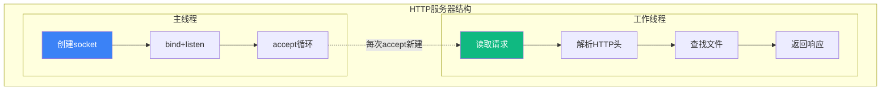

# 【筑基·036】筑基毕业：能独立做一个项目

> **码农修仙传 · 筑基期 · 第36篇**
> 我是玄芯散人，带你从炼气修到大乘。

---

## 境界标识

```
╔══════════════════════════════════════╗
║     筑基期 · 第36篇                   ║
║     毕业标准：独立做一个项目           ║
║     预计阅读：12分钟                   ║
╚══════════════════════════════════════╝
```

---

## 修仙引入

修真小说里，筑基期满的标志不是灵力有多少，是能不能独立下山办事。宗门给你一个任务，你一个人搞定，回来交差。搞不定，灵力再浑厚也是半成品。

程序员也一样。你读完了《CSAPP》，刷完了LeetCode 100题，能把TCP三次握手画得滚瓜烂熟。但问你：你能从零写一个能跑的项目吗？如果答不上来，你的筑基还差最后一脚。

上一篇034讲了四座地基是什么以及它们之间的关系。这一篇讲怎么用这四座地基做出一个能跑的项目，算是筑基期第一组内容的收尾。

---

## 硬核主体

### 一、什么叫"独立完成一个完整项目"

很多人觉得自己做过项目就算毕业了。但仔细一问，项目是跟着教程敲的，代码是复制粘贴改的，遇到bug就搜Stack Overflow照着改。这不叫独立完成，叫"陪练完成"。

独立完成的意思是：给你一个需求，你能自己拆解，自己设计，自己写代码，自己调试，自己测试，最后交付一个能跑的东西。全程不抄别人的代码，可以查文档查API，但不能照着教程一行一行抄。

合格项目的意思是：不是写一个函数，不是做一道算法题，是一个有输入有输出有数据流动的系统。它至少包含这些环节：

- 需求拆解：把"做一个XX"拆成具体的功能模块
- 技术选型：选什么数据结构，选什么通信方式
- 代码实现：写出能编译能跑的代码
- 调试排错：出了bug能自己定位到哪一行
- 测试验证：怎么证明你的程序是对的

```python
# 判断你的项目是否"独立完成"的自测
def is_independent_project(project):
    checks = {
        "需求自己拆": project.decomposed_by_self,      # 不是教程帮你拆好的
        "架构自己定": project.designed_by_self,          # 不是照搬别人的目录结构
        "代码自己写": project.coded_by_hand,             # 不是复制粘贴改的
        "bug自己调": project.debugged_independently,     # 不是搜报错照着改的
        "能跑能用": project.runs_correctly,              # 不是跑起来就崩的
    }
    passed = sum(checks.values())
    if passed == 5:
        return "✅ 毕业级项目"
    elif passed >= 3:
        return "⚠️ 半独立，还不够"
    else:
        return "❌ 陪练级，重做"

# 诚实回答：你做过的"项目"，几条打勾？
```

### 二、项目选择的三个标准

筑基期毕业项目不是随便找个项目做就行。它需要满足三个条件：



标准一：综合四座地基。筑基期学了四座地基（组成原理，操作系统，数据结构，网络），毕业项目至少要涉及三座。做一个纯算法题只考数据结构，做一个纯前端页面什么地基都不考。好的项目应该让你在做的过程中用上多块知识。

标准二：难度适中。太简单没有压力，太难做不完会放弃。合适的项目大约需要1到2周的业余时间完成，代码量在500到2000行之间。比LeetCode的算法题复杂，但比参与一个开源项目简单。

标准三：能跑能用能验证。做完之后不是"我写了代码但没跑通"。程序要能运行，要有明确的输入和输出，能给别人演示。最好能写自动化测试，用数据证明你的程序是对的。

### 三、推荐项目：用C写一个HTTP服务器

满足上面三个标准的项目，首推：用C语言从零写一个HTTP服务器。

为什么选这个项目？因为它天然综合了四座地基：



网络方面，你要用Socket API建立TCP连接，要解析HTTP请求的请求行和头部，要处理三次握手和四次挥手。操作系统方面，你要用多进程或多线程处理并发连接，要管理文件描述符，要用read和write系统调用收发数据。数据结构方面，HTTP请求头是键值对，自然用哈希表存，多个客户端连接用链表管理。组成原理方面，网络字节序和主机字节序的转换涉及字节序问题，缓冲区设计涉及内存布局。

下面拆解这个项目的实现步骤。

### 四、项目实战拆解

#### 第一步：需求拆解

一个最简HTTP服务器要做的事：

1. 监听一个端口（比如8080）
2. 接受客户端连接
3. 读取HTTP请求
4. 解析请求行（GET /path HTTP/1.1）
5. 根据路径返回对应的文件内容
6. 关闭连接

```c
// 最简HTTP服务器的骨架代码
#include <stdio.h>
#include <stdlib.h>
#include <string.h>
#include <unistd.h>
#include <sys/socket.h>
#include <netinet/in.h>

#define PORT 8080
#define BUF_SIZE 4096

int main() {
    int server_fd = socket(AF_INET, SOCK_STREAM, 0);  // 创建TCP socket
    
    struct sockaddr_in addr;
    addr.sin_family = AF_INET;
    addr.sin_addr.s_addr = INADDR_ANY;
    addr.sin_port = htons(PORT);  // 主机序转网络序
    
    bind(server_fd, (struct sockaddr*)&addr, sizeof(addr));
    listen(server_fd, 5);  // 最大等待队列5
    printf("Server listening on port %d...\n", PORT);
    
    while (1) {
        int client_fd = accept(server_fd, NULL, NULL);  // 等待连接
        char buf[BUF_SIZE];
        int n = read(client_fd, buf, BUF_SIZE - 1);
        buf[n] = '\0';
        
        // 解析请求行: GET /path HTTP/1.1
        char method[8], path[256], version[16];
        sscanf(buf, "%s %s %s", method, path, version);
        printf("Request: %s %s %s\n", method, path, version);
        
        // 返回固定响应（后续可改为读取文件）
        const char *response = 
            "HTTP/1.1 200 OK\r\n"
            "Content-Type: text/html\r\n"
            "Content-Length: 13\r\n"
            "\r\n"
            "Hello, World!";
        write(client_fd, response, strlen(response));
        close(client_fd);
    }
    return 0;
}
```

这段代码能跑，能处理一个请求。但它只是骨架，离合格项目还差得远。

#### 第二步：结构设计

骨架代码的问题：一次只能处理一个连接，客户端要排队。要做一个能用的HTTP服务器，至少需要并发处理。



主线程负责接受连接，每来一个连接就fork一个子进程或创建一个线程去处理。工作线程读取请求，解析HTTP头部，根据路径查找文件，返回响应内容。

这涉及操作系统的进程管理（fork）或线程管理（pthread_create），涉及文件系统的文件读取（open/read），涉及网络的HTTP协议解析，涉及数据结构的请求头存储（哈希表或数组）。

#### 第三步：实现HTTP请求解析

HTTP请求的格式是文本协议，解析过程就是把文本按规则切分：

```c
// HTTP请求格式：
// GET /index.html HTTP/1.1\r\n
// Host: localhost:8080\r\n
// User-Agent: curl/7.68.0\r\n
// \r\n

typedef struct {
    char method[8];    // GET/POST/PUT/DELETE
    char path[256];    // /index.html
    char version[16];  // HTTP/1.1
    char headers[32][2][128];  // 头部键值对数组
    int header_count;
} HttpRequest;

void parse_request(const char *raw, HttpRequest *req) {
    // 第一步：解析请求行
    sscanf(raw, "%s %s %s", req->method, req->path, req->version);
    
    // 第二步：逐行解析头部
    const char *p = strstr(raw, "\r\n");  // 跳过请求行
    p += 2;
    req->header_count = 0;
    
    while (*p != '\r' && *p != '\0') {
        // 每行格式: Key: Value
        sscanf(p, "%[^:]: %[^\r\n]", 
               req->headers[req->header_count][0],
               req->headers[req->header_count][1]);
        req->header_count++;
        p = strstr(p, "\r\n");
        if (!p) break;
        p += 2;
    }
}
```

这段代码用数组存HTTP头部。更进阶的做法是用哈希表，查找某个头部时从O(n)变成O(1)。这就是数据结构选择的实际意义：同样的功能，不同的数据结构带来不同的性能差异。

#### 第四步：并发处理

单进程版的HTTP服务器处理一个请求时，其他客户端必须等待。要支持并发，有两种方式：

```c
// 方式一：fork子进程（简单但开销大）
void handle_fork(int server_fd) {
    while (1) {
        int client_fd = accept(server_fd, NULL, NULL);
        pid_t pid = fork();
        if (pid == 0) {
            // 子进程处理请求
            close(server_fd);  // 子进程不需要监听socket
            handle_request(client_fd);
            close(client_fd);
            exit(0);
        }
        close(client_fd);  // 父进程不需要客户端socket
        // ⚠️ 这里需要waitpid回收子进程，否则产生僵尸进程
    }
}

// 方式二：pthread线程（轻量但要注意线程安全）
#include <pthread.h>

void *worker_thread(void *arg) {
    int client_fd = *(int*)arg;
    free(arg);
    handle_request(client_fd);
    close(client_fd);
    return NULL;
}

void handle_thread(int server_fd) {
    while (1) {
        int client_fd = accept(server_fd, NULL, NULL);
        int *fd_ptr = malloc(sizeof(int));
        *fd_ptr = client_fd;
        pthread_t tid;
        pthread_create(&tid, NULL, worker_thread, fd_ptr);
        pthread_detach(tid);  // 自动回收，不需要join
    }
}
```

fork方式简单粗暴，每个子进程有独立的地址空间，不用操心线程安全。但fork的代价是复制父进程的页表结构（写时复制机制下只读标记，真正写时才复制数据），高并发时开销大。pthread方式轻量，线程共享地址空间，但多个线程同时访问全局变量时需要加锁。

这就是操作系统知识在实际项目里的体现：你知道fork和pthread的区别，知道什么时候用哪种，知道各自的风险。

#### 第五步：测试验证

项目做完了，怎么证明它是对的？不能只靠"看起来能跑"。需要系统化测试：

```bash
# 测试1：基本功能，用curl发请求
curl http://localhost:8080/index.html
# 期望：返回index.html的内容

# 测试2：并发压力，用ab（Apache Bench）
ab -n 1000 -c 10 http://localhost:8080/index.html
# 期望：1000个请求全部成功，不崩溃

# 测试3：边界情况，请求不存在的文件
curl http://localhost:8080/nonexistent
# 期望：返回404 Not Found

# 测试4：恶意请求，超长URL
python3 -c "import socket; s=socket.socket(); s.connect(('localhost',8080)); s.send(b'GET /'+'A'*10000+b' HTTP/1.1\r\n\r\n'); print(s.recv(4096))"
# 期望：不崩溃，返回400 Bad Request或正常拒绝
```

这五个步骤走完，你的HTTP服务器就算一个能跑能用的项目了。做的过程中你用到了网络（Socket和HTTP），操作系统里的fork和pthread，数据结构里的数组和哈希表，组成原理里的字节序和内存布局。四座地基全部覆盖。

### 五、其他推荐项目

HTTP服务器不是唯一选择。以下是几个同样满足三标准的项目，按你的兴趣和技术方向选一个：

```python
recommended_projects = [
    {
        "name": "HTTP服务器",
        "语言": "C",
        "涉及地基": "网络+OS+数据结构+组成",
        "难度": "★★★☆☆",
        "代码量": "800-1500行",
        "适合": "想做后端/系统编程的人",
    },
    {
        "name": "简易Shell",
        "语言": "C",
        "涉及地基": "OS+数据结构+组成",
        "难度": "★★★☆☆",
        "代码量": "500-1000行",
        "适合": "想深入理解进程和信号的人",
    },
    {
        "name": "键值存储（类Redis）",
        "语言": "C/Python",
        "涉及地基": "数据结构+OS+网络",
        "难度": "★★★★☆",
        "代码量": "1000-2000行",
        "适合": "对数据库感兴趣的人",
    },
    {
        "name": "定时器模块",
        "语言": "C",
        "涉及地基": "数据结构+OS",
        "难度": "★★☆☆☆",
        "代码量": "300-600行",
        "适合": "想做嵌入式/网络框架的人",
    },
]

# 选项目的原则：选你感兴趣的，选你能做完的
# 不要选最难的，选最适合你的
```

简易Shell涉及操作系统的进程创建和信号处理，还有管道和重定向。键值存储需要数据结构（哈希表或跳表），需要网络（TCP协议），需要操作系统（持久化用文件系统）。定时器模块需要数据结构（最小堆或红黑树管理定时任务），需要操作系统（信号或timerfd）。

### 六、做项目时常见的坑

坑一：一上来就追求完美。想支持HTTP/2，想支持HTTPS，想做异步IO。结果一周过去了连基本的HTTP/1.1请求都没解析对。做项目要分阶段：先让它跑起来，再让它跑得对，最后让它跑得好。先做一个只能返回固定字符串的服务器，再加上文件读取，再加上并发，再加上错误处理。每一步都是可运行的状态。

坑二：不写测试。写完代码手动curl一下觉得"能跑"就算完了。但手动测试覆盖不了边界情况：空请求怎么处理？超大请求怎么处理？并发100个连接会不会崩？每加一个功能，同时加对应的测试用例。

坑三：照着教程抄。网上有大量"用C写HTTP服务器"的教程。看一遍理解思路没问题，但写代码的时候关掉教程自己写。你能抄出来的代码不证明你会写，只有关掉教程能写出来才算会。

坑四：不读经典。做完项目觉得"能跑就行了"，不回去对照经典教材看自己的实现差在哪。HTTP服务器做完后，去看看Nginx的设计思路（不需要读源码，看设计文章就行），对比自己的设计，找到差距。这一步是让你从"会做"变成"做得好"。

---

## 修仙术语对照表

| 修仙术语 | 技术现实 | 本篇位置 |
|---------|---------|---------|
| 下山办事 | 独立完成一个完整项目 | 修仙引入 |
| 宗门给任务 | 拿到一个需求自己拆解实现 | 修仙引入 |
| 陪练完成 | 跟着教程抄代码，不算独立 | 什么叫独立完成 |
| 四座地基 | 组成原理/OS/数据结构/网络 | 项目选择标准 |
| 灵力浑厚也是半成品 | 知识学了一堆但没有项目验证 | 修仙引入 |
| 实修 | 动手做项目 | 项目选择 |
| 走火入魔 | 追求完美导致做不完 | 常见坑 |
| 闭门造车 | 不写测试不验证 | 常见坑 |
| 师门传承 | 对照经典教材找差距 | 常见坑 |
| 分阶段修炼 | 先跑起来再改进 | 常见坑 |
| 传音符 | Socket API驱动网络通信 | HTTP服务器 |
| 心法 | 设计思路和模块拆解 | 结构设计 |
| 经脉 | 项目中知识之间的依赖链路 | 结构设计 |
| 修炼成果 | 能跑能用能验证的项目 | 项目选择标准 |

---

## 进阶条件

- [ ] 做了一个至少500行的非教程项目，涉及四座地基中的至少三座
- [ ] 项目能编译能运行，不是"写了一半跑不起来"
- [ ] 全程没有照着教程逐行抄代码，可以查文档但不能抄实现
- [ ] 写了至少3个测试用例，覆盖正常请求和边界情况
- [ ] 遇到bug时能自己用gdb或printf定位到具体行，不是靠搜报错信息碰运气
- [ ] 做完后能向别人用5分钟讲清楚项目的结构和数据流
- [ ] 对照过经典教材或开源项目的设计文章，知道自己的实现差在哪

勾掉5条以上，你的筑基期算是真正毕业了。接下来进入筑基期第二组：数据结构与算法。四座地基里，数据结构是最先该打牢的那一座，下一篇带你正式入门。

---

## 下期预告 + 互动

下一篇：数据结构就是功法。今天讲了筑基毕业怎么做项目，接下来进入筑基期的第二组内容，数据结构与算法。数组，链表，栈，队列，哈希表，这些容器到底是什么，什么情况用什么，一篇讲清楚。

互动问题：你做过的项目里，有没有一个是你觉得"真正独立完成"的？它用了哪些CS基础知识？评论区聊聊，看看大家的项目都涉及哪些地基。

我是玄芯散人，带你从炼气修到大乘。

---

*本文是「码农修仙传」系列第36篇。系列导航见 [xren.ren](https://xren.ren)*
