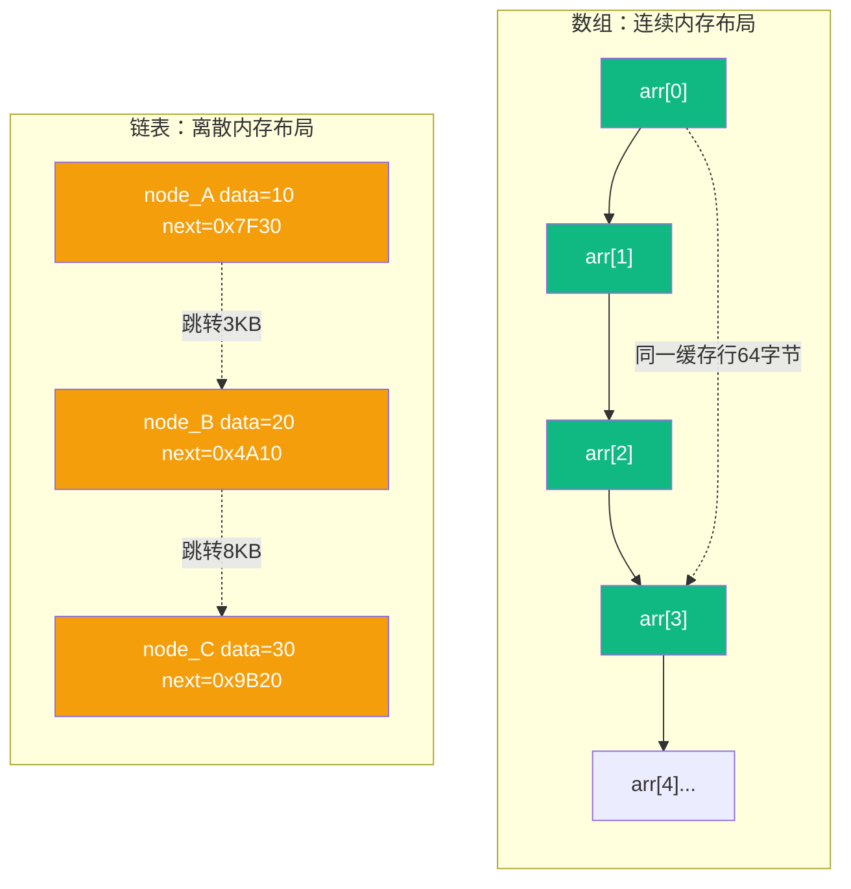
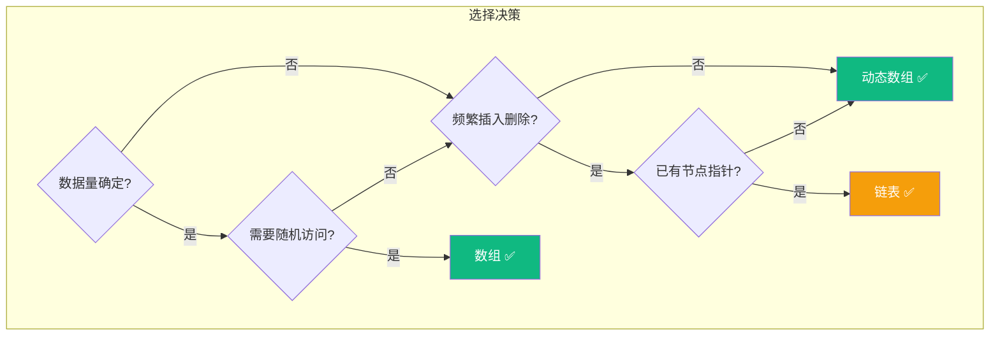

# 【筑基·038】数组vs链表：90%的人选错了

> **码农修仙传 · 筑基期 · 第38篇**
> 我是玄芯散人，带你从炼气修到大乘。

---

## 境界标识

```
╔══════════════════════════════════════╗
║     筑基期 · 第38篇                   ║
║     数组vs链表：90%的人选错了           ║
║     预计阅读：15分钟                   ║
╚══════════════════════════════════════╝
```

---

## 修仙引入

储物袋和灵链，上一篇讲过它们的兵器谱定位：数组擅长随机读取，链表擅长插入删除。口诀是"读多用袋，写多用链"。

看起来很简单。但实际工程中，大量程序员按这个口诀选了链表，结果程序慢了十倍。

问题出在哪？口诀只说了时间复杂度，没说一件事：CPU缓存。数组在内存里是连续的，CPU一次能把64字节的数据预取进缓存。链表的节点散落在堆内存各处，每次跳转都是一次缓存未命中。理论上的O(1)插入，被缓存未命中拖到了比数组O(n)搬移还慢的程度。

这篇就把数组和链表放在一起掰开揉碎，看看90%的人到底选错了什么。

---

## 硬核主体

### 一、理论上的胜负表

先回顾一下教科书告诉你的答案：

| 操作 | 数组 | 链表 |
|------|------|------|
| 随机访问第i个元素 | O(1) | O(n) |
| 头部插入 | O(n) | O(1) |
| 尾部插入 | 摊销O(1) | O(1) |
| 中间插入（已知位置） | O(n) | O(1) |
| 中间插入（需查找） | O(n) | O(n) |
| 内存占用 | 仅存数据 | 每节点多一个指针 |

如果只看这张表，链表在插入删除上领先数组。面试时背这张表能拿满分。但工程中这张表隐瞒了一件事：每一步操作的实际耗时天差地别。

### 二、CPU缓存：被教科书忽略的变量

要理解为什么数组实际更快，得先看CPU怎么访问内存。

现代CPU的内存访问不是你想的"要一个数据就去内存取一个"。它取数据的基本单位叫缓存行，主流x86和ARM处理器上都是64字节。你访问数组的一个元素，CPU不会只取那4字节，它会把这个元素前后64字节的数据全部搬进L1缓存。下次访问相邻元素时，数据已经在缓存里了，不用再去内存。

```c
// 数组遍历：缓存友好的访问模式
int arr[1000];
long sum = 0;
for (int i = 0; i < 1000; i++) {
    sum += arr[i];  // 第i次访问，arr[i]到arr[i+15]已在缓存（16个int=64字节）
}
// 1000次访问，实际内存访问约63次（1000/16），其余从缓存命中
```

链表完全相反。每个节点的内存地址是malloc随机分配的，节点之间在物理内存里可能隔了几千字节。CPU预取了一个节点周围的64字节，里面大概率全是别的数据。

```c
// 链表遍历：缓存不友好的访问模式
struct node {
    int data;
    struct node *next;
};

struct node *head = /* ... */;
long sum = 0;
while (head) {
    sum += head->data;  // 每次跳转可能是一次缓存未命中
    head = head->next;  // next指向的地址不可预测
}
// 1000次访问，1000次内存访问（或接近），每次可能要等200+个CPU周期
```

用一张图看清两者的内存布局差异：



数组的一次缓存未命中能解决后续15次访问（int类型），链表的每次跳转都可能是一次缓存未命中。这就是实际性能差异的根源。

### 三、实测数据：差多少

用C写一段简单的基准测试，遍历100万个int，数组vs单向链表：

```c
#include <stdio.h>
#include <stdlib.h>
#include <time.h>

#define N 1000000

// 数组遍历
void bench_array() {
    int *arr = malloc(N * sizeof(int));
    for (int i = 0; i < N; i++) arr[i] = i;

    clock_t start = clock();
    long sum = 0;
    for (int i = 0; i < N; i++) sum += arr[i];
    double ms = (double)(clock() - start) / CLOCKS_PER_SEC * 1000;
    printf("数组遍历: %.2f ms, sum=%ld\n", ms, sum);
    free(arr);
}

// 链表遍历
typedef struct node { int data; struct node *next; } node_t;

void bench_linked_list() {
    node_t *head = NULL, *tail = NULL;
    for (int i = 0; i < N; i++) {
        node_t *n = malloc(sizeof(node_t));
        n->data = i; n->next = NULL;
        if (!head) head = tail = n;
        else { tail->next = n; tail = n; }
    }

    clock_t start = clock();
    long sum = 0;
    node_t *p = head;
    while (p) { sum += p->data; p = p->next; }
    double ms = (double)(clock() - start) / CLOCKS_PER_SEC * 1000;
    printf("链表遍历: %.2f ms, sum=%ld\n", ms, sum);

    // 释放链表（省略，实际工程必须free）
}

int main() {
    bench_array();
    bench_linked_list();
    return 0;
}
```

典型结果（Apple M1 / GCC -O2）：

```
数组遍历: 0.83 ms, sum=499999500000
链表遍历: 5.71 ms, sum=499999500000
```

数组比链表快约7倍。注意这还只是遍历，没有涉及插入删除。如果只看"读取"操作，数组优势更明显。

那插入呢？在头部插入100万个元素，链表应该碾压数组吧？

```c
// 头部插入：链表理论上O(1) vs 数组O(n)
// 链表：每次只改头指针，理论O(1)
// 数组：每次要搬移所有已有元素，理论O(n)
```

实际测试中，链表的头部插入确实比数组快，但差距远没有理论那么大。原因是每次malloc一个新节点本身就有开销（堆分配器要查找空闲块），而数组虽然要搬移数据，但搬移是连续内存的memcpy操作，CPU的向量化指令能批量处理。

### 四、动态数组：为什么ArrayList淘汰了LinkedList

实际工程中，Python的list，Java的ArrayList，C++的std::vector，Go的slice，底层全是动态数组。不是巧合，是缓存友好性碾压了链表。

动态数组的原理：预先分配一块连续内存，元素满了就扩容。扩容策略各语言不同：Java ArrayList按1.5倍增长，Go slice在容量较小时翻倍、大于256后转为约1.25倍，Python list的增长因子约在1.125倍到1.5倍之间浮动。

```python
# 动态数组的扩容过程
import sys

arr = []
prev_size = 0
for i in range(20):
    arr.append(i)
    size = sys.getsizeof(arr)
    if size != prev_size:
        print(f"len={len(arr):2d}, 实际容量字节={size}, 增长了{size - prev_size}")
        prev_size = size
```

输出类似：
```
len= 1, 实际容量字节=88, 增长了88
len= 5, 实际容量字节=120, 增长了32
len= 9, 实际容量字节=184, 增长了64
len=17, 实际容量字节=248, 增长了64
```

每次扩容要分配新内存然后把旧数据搬过去，单次扩容是O(n)。但扩容频率越来越低（容量翻倍增长），均摊到N次append上，每次append的均摊代价是O(1)。

这就是"均摊计算"的意思：单次操作可能贵，但N次操作的总代价是O(n)，平均每次O(1)。


橙色节点是扩容操作，绿色是普通append。可以看到扩容越来越少，总搬移次数是4+8+16+...=约2N次，均摊每次append只需2次搬运动作。

### 五、链表真正该用的地方

说了这么多数组的优势，链表是不是该淘汰了？当然不是。有几个情况链表确实是更优选择。

场景一：频繁的头部和中间插入删除，且你已经有节点指针。
Linux内核里大量使用链表。进程链表和网络连接链表。内核的链表实现很特殊，它把链表节点嵌在数据结构内部：

```c
// Linux内核的链表用法：节点嵌入数据结构
struct task_struct {
    /* ... 大量字段 ... */
    struct list_head tasks;  // 链表节点嵌入task_struct内部
};

// list_head的定义极其简洁
struct list_head {
    struct list_head *next, *prev;
};

// 插入一个进程到运行队列：O(1)，不需要搬移任何数据
list_add(&new_task->tasks, &runqueue);
```

内核选链表不是因为缓存友好，是因为进程控制块本身已经很大了，不可能用数组搬移。而且内核需要频繁地在队列中间插入和移除进程，已经有了节点指针，链表的O(1)插入删除是实打实的。

第二个例子：LRU缓存。

LRU缓存需要快速删除最久未使用的元素，也需要快速把刚访问的元素移到"最新"位置。用双向链表加哈希表，两个操作都是O(1)：

```python
class LRUCache:
    def __init__(self, capacity):
        self.cap = capacity
        self.cache = {}  # key -> node
        # 双向链表的伪头尾节点，避免边界判断
        self.head = Node(0, 0)  # 伪头
        self.tail = Node(0, 0)  # 伪尾
        self.head.next = self.tail
        self.tail.prev = self.head

    def _remove(self, node):
        """从链表中摘除节点 O(1)"""
        node.prev.next = node.next
        node.next.prev = node.prev

    def _add_front(self, node):
        """插入到头部（最新位置）O(1)"""
        node.next = self.head.next
        node.prev = self.head
        self.head.next.prev = node
        self.head.next = node

    def get(self, key):
        if key in self.cache:
            node = self.cache[key]
            self._remove(node)      # 摘下来
            self._add_front(node)   # 放到最前面
            return node.val
        return -1

    def put(self, key, val):
        if key in self.cache:
            self._remove(self.cache[key])
        node = Node(key, val)
        self.cache[key] = node
        self._add_front(node)
        if len(self.cache) > self.cap:
            # 删除尾部（最久未使用）
            lru = self.tail.prev
            self._remove(lru)
            del self.cache[lru.key]

class Node:
    def __init__(self, key, val):
        self.key = key
        self.val = val
        self.prev = None
        self.next = None
```

这里用链表不是因为它遍历快，是因为它的摘除和插入都是O(1)，不需要搬移其他元素。哈希表负责O(1)查找，链表负责维护访问顺序。两者配合，每个操作都是O(1)。

场景三：不确定数据量大小，且频繁插入。

数组的扩容有瞬时开销。嵌入式系统或者实时系统中，扩容那一下可能导致几十微秒的延迟。链表的每次插入开销恒定（一次malloc），没有突发延迟。对实时性要求高的地方，恒定的小开销比偶发的大开销更好。

### 六、选择决策树

面对一个问题，到底选数组还是链表？画一张决策流程图：



简化成一句话：默认选数组。只有在频繁插入删除且已有节点指针的情况下，才考虑链表。

这个默认选择覆盖了90%的工程需求。剩下10%有特殊需求的地方，比如内核链表和LRU缓存这类需求，链表才是正解。

### 七、常见误区

误区一：看到"频繁插入"就选链表。

插入操作分两步：找到位置，然后执行插入。链表找到位置是O(n)，数组找到位置是O(n)（二分查找还能O(log n)）。如果每次插入都要从头遍历找位置，链表的O(1)插入优势完全被O(n)查找吃掉了。这种情况数组和链表总代价差不多，但数组缓存友好，实际更快。

误区二：认为链表省内存。

链表每个节点多存一个或两个指针。64位系统上一个指针8字节，存int数据（4字节）加next指针（8字节），考虑内存对齐后实际每存4字节数据要用16字节，膨胀了4倍。双向链表更夸张，每存4字节数据用24字节。数组的额外开销只有扩容预留的空闲空间，通常不超过50%。

误区三：在面试中手写链表就觉得自己会用链表。

手写链表反转是面试题，工程中几乎用不到。真正需要链表的地方是内核开发和缓存实现。如果没碰过这类需求，你对链表的理解可能还停留在"插入删除O(1)"的教科书上。

---

## 修仙术语对照表

| 修仙术语 | 技术现实 | 本篇位置 |
|---------|---------|---------|
| 储物袋 | 数组（连续内存） | 全文主线 |
| 灵链 | 链表（离散节点+指针） | 全文主线 |
| 灵脉通畅 | CPU缓存命中 | 缓存分析 |
| 灵脉堵塞 | CPU缓存未命中 | 缓存分析 |
| 法器相克 | 数组与链表的性能取舍 | 决策树 |
| 储物袋扩容 | 动态数组翻倍增长 | 动态数组 |
| 均摊灵力 | 均摊计算（amortized） | 动态数组 |
| 走火入魔 | 选错数据结构导致性能问题 | 常见误区 |
| 宗门调度 | Linux内核进程链表 | 链表用法 |
| 灵珠位置已知 | 已有节点指针 | 决策树 |
| 法器直觉 | 根据情况选对数据结构的能力 | 决策树 |
| 恒定小开销 | 链表插入延迟恒定 | 实时系统 |
| 突发大开销 | 数组扩容瞬时延迟 | 动态数组 |
| 灵力膨胀 | 链表指针额外内存开销 | 常见误区 |

---

## 进阶条件

- [ ] 能用一句话解释为什么数组遍历比链表快（缓存行预取）
- [ ] 能说出缓存行大小（64字节）以及它对数据结构选择有什么作用
- [ ] 能解释动态数组的均摊O(1）是怎么算出来的（扩容翻倍，总搬移约2N次）
- [ ] 能写出LRU缓存的全套实现（哈希表+双向链表）
- [ ] 能说出至少两个链表在工程中真正有优势的用法（内核链表、LRU缓存）
- [ ] 能解释"已有节点指针"为什么是链表发挥优势的前提条件
- [ ] 面对实际需求，能画出选择决策树并选出正确数据结构

全部勾掉，你对数组与链表的理解就超越了90%只会背复杂度表的程序员。下一篇我们讲栈和队列，两个看似简单的结构，在函数调用和消息通信中扮演什么角色。

---

## 下期预告 + 互动

下一篇：栈和队列：先入先出还是后入先出。栈是函数调用的大动脉，队列是消息通信的骨架

互动问题：你在工程中有没有被"链表插入O(1)"这句话误导过？有没有哪次你用了链表后来发现数组更快？评论区说说你的经历，看看多少人踩过同样的坑。

我是玄芯散人，带你从炼气修到大乘。

---

*本文是「码农修仙传」系列第38篇。系列导航见 [xren.ren](https://xren.ren)*
