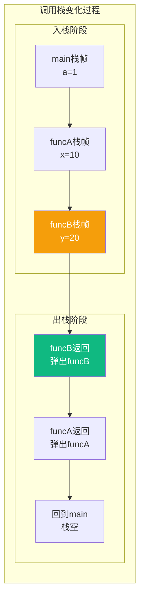
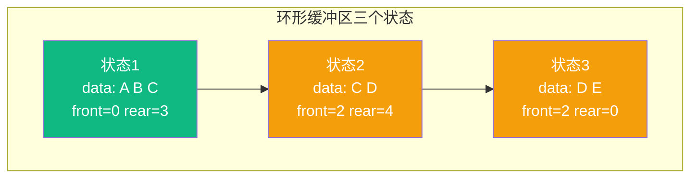
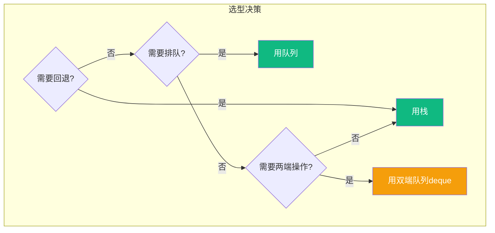

# 【筑基·039】栈和队列：先入先出还是后入先出

> **码农修仙传 · 筑基期 · 第39篇**
> 我是玄芯散人，带你从炼气修到大乘。

---

## 境界标识

```
╔══════════════════════════════════════╗
║     筑基期 · 第39篇                   ║
║     栈和队列：先入先出还是后入先出      ║
║     预计阅读：15分钟                   ║
╚══════════════════════════════════════╝
```

---

## 修仙引入

修士的储物匣有两种规矩。一种像码盘子的桶，你往里放盘子，只能从顶上拿，最后放进去的最先出来。另一种像排队领丹药，先到的先领，排在前面的先走。

前者叫栈，后者叫队列。两个结构简单到十行代码就能写完，但函数调用靠栈，消息通信靠队列，编译器求值靠栈，操作系统调度靠队列。大道至简的两个容器，撑起了计算机世界一半的运转逻辑。

上一篇讲了数组和链表怎么选，这一篇讲两种受限的数据结构为什么"受限"反而成了优势。

---

## 硬核主体

### 一、栈：只能从顶部进出的储物匣

栈是一种受限的线性结构，只允许在一端（栈顶）进行插入和删除。后进先出，LIFO。

用数组实现一个最简单的栈：

```c
#include <stdio.h>
#include <stdbool.h>

#define MAX 100

typedef struct {
    int data[MAX];  // 用数组存储
    int top;         // 栈顶指针，-1表示空栈
} Stack;

void init(Stack *s) {
    s->top = -1;  // 空栈
}

bool push(Stack *s, int val) {
    if (s->top >= MAX - 1) return false;  // 栈满
    s->data[++s->top] = val;  // 先移动top，再写入
    return true;
}

bool pop(Stack *s, int *val) {
    if (s->top < 0) return false;  // 栈空
    *val = s->data[s->top--];  // 先读出，再移动top
    return true;
}

bool peek(Stack *s, int *val) {
    if (s->top < 0) return false;
    *val = s->data[s->top];  // 只看不取
    return true;
}
```

三个操作全是O(1)。栈的"受限"在于你不能从中间取数据，只能从顶部。这种限制看起来是缺点，实际上正是这种限制让栈的行为可预测，适合需要"回溯"的场合。

### 二、栈的第一个用法：函数调用

炼气期018篇讲过函数调用栈的概念。这里从数据结构的角度再看一遍。

当main调用funcA，funcA又调用funcB时，每个函数的栈帧依次压入调用栈。funcB执行完，它的栈帧最先弹出。funcA执行完，它的栈帧弹出。最后回到main。



为什么用栈而不是其他结构？因为函数调用天然符合"后调用先返回"的规则。A调B，B没返回之前A不可能先返回。这种嵌套关系就是LIFO。

递归也是同理。fib(5)调用fib(4)调用fib(3)，最内层的fib(3)先返回，逐层往外。每一层等待内层返回时，自己的状态（局部变量、返回地址）都安全地存在栈帧里，不会丢失。

栈的大小是有限的。Linux默认线程栈8MB，嵌入式中可能只有几KB。递归层数太深就会栈溢出，因为栈帧堆积超过了栈空间。

```c
// 无限递归：栈溢出
void infinite(int n) {
    int buf[1024];  // 每层栈帧约4KB
    infinite(n + 1);  // 递归无终止条件
}
// 8MB / 4KB ≈ 2048层就会溢出
```

### 三、栈的第二个用法：表达式求值

编译器怎么计算 `3 + 4 * 2`？人的直觉是先算4*2得8，再算3+8得11。但计算机按顺序扫描，遇到 `+` 时还不知道后面的 `*` 优先级更高。

解决方案是把中缀表达式转成后缀表达式（逆波兰表示法）。中缀 `3 + 4 * 2` 变成后缀 `3 4 2 * +`，然后求值。

转换过程用到两个东西：一个输出队列，一个运算符栈。扫描到数字直接输出，扫描到运算符就与栈顶比较优先级。

```c
// 后缀表达式求值（简化版，只处理个位整数加减乘除）
int eval_postfix(const char *expr) {
    Stack s;
    init(&s);
    
    for (int i = 0; expr[i]; i++) {
        char c = expr[i];
        if (c >= '0' && c <= '9') {
            push(&s, c - '0');  // 数字直接压栈
        } else if (c == '+' || c == '-' || c == '*' || c == '/') {
            int b, a;
            pop(&s, &b);  // 先弹出的是右操作数
            pop(&s, &a);  // 后弹出的是左操作数
            int r;
            switch (c) {
                case '+': r = a + b; break;
                case '-': r = a - b; break;
                case '*': r = a * b; break;
                case '/': r = a / b; break;
            }
            push(&s, r);  // 结果压回栈
        }
    }
    int result;
    pop(&s, &result);
    return result;
}

// 输入 "3 4 2 * +" → 输出 11
```

栈在这里干什么？暂存"待处理的数据"。扫描到运算符时，它需要的两个操作数正好在栈顶。如果运算符有优先级差异，栈的LIFO特性保证了高优先级运算符先被处理。

### 四、队列：先排队先走的通道

队列是另一种受限的线性结构，只允许在一端（队尾）插入，另一端（队头）删除。先进先出，FIFO。

同样用数组实现：

```c
#define MAX 100

typedef struct {
    int data[MAX];
    int front;  // 队头
    int rear;   // 队尾
    int size;   // 当前元素个数
} Queue;

void q_init(Queue *q) {
    q->front = 0;
    q->rear = 0;
    q->size = 0;
}

bool enqueue(Queue *q, int val) {
    if (q->size >= MAX) return false;  // 队满
    q->data[q->rear] = val;
    q->rear = (q->rear + 1) % MAX;  // 环形回绕
    q->size++;
    return true;
}

bool dequeue(Queue *q, int *val) {
    if (q->size <= 0) return false;  // 队空
    *val = q->data[q->front];
    q->front = (q->front + 1) % MAX;  // 环形回绕
    q->size--;
    return true;
}
```

注意 `(q->rear + 1) % MAX` 这个写法。数组用完一圈后从头开始用，这就是环形缓冲区。如果没有这个回绕，数组前面的空间就浪费了。



### 五、队列的第一个用法：缓冲区

串口接收数据时，CPU可能正在处理其他事情，来不及逐个处理收到的字节。这时候把收到的字节先塞进队列，等CPU忙完了再从队列里取出来处理。

```c
// 串口接收中断里：把字节塞进队列
void uart_rx_handler(uint8_t byte) {
    enqueue(&rx_queue, byte);  // 不阻塞，塞进去就走
}

// 主循环里：取出字节处理
void process_uart() {
    int byte;
    while (dequeue(&rx_queue, &byte)) {
        handle_byte(byte);  // 慢慢处理
    }
}
```

这里队列解决了一个速度不匹配的问题：中断处理必须快（微秒级），但协议解析可能慢（毫秒级）。队列作为缓冲，让快的一端不停下来等慢的一端。

### 六、队列的第二个用法：生产者消费者

生产者消费者模式是多线程编程的经典写法。生产者生产数据放入队列，消费者从队列取出数据处理。两者通过队列解耦，各自按自己的速度工作。

```python
import threading
import queue
import time

buffer = queue.Queue(maxsize=10)  # 容量10的缓冲队列

def producer():
    for i in range(20):
        buffer.put(i)  # 队列满了会阻塞
        print(f"生产: {i}")
        time.sleep(0.01)

def consumer():
    for _ in range(20):
        item = buffer.get()  # 队列空了会阻塞
        print(f"消费: {item}")
        time.sleep(0.05)

t1 = threading.Thread(target=producer)
t2 = threading.Thread(target=consumer)
t1.start()
t2.start()
t1.join()
t2.join()
```

队列在这里起什么效果？"削峰填谷"。生产者速度快时，数据堆在队列里；消费者速度快时，从队列里取完就等待。两边不需要同步协调，队列本身就提供了缓冲能力。

### 七、栈和队列的选型对比

两者都是受限结构，但适用方向完全不同：

| 对比项 | 栈 (LIFO) | 队列 (FIFO) |
|------|-----------|-------------|
| 操作端 | 单端 | 双端 |
| 顺序 | 后进先出 | 先进先出 |
| 适合回溯 | 是 | 否 |
| 适合缓冲 | 否 | 是 |
| 典型用法 | 函数调用和表达式求值 | 消息队列和任务调度 |

选择标准很简单：需要"回退到上一步"用栈，需要"公平排队"用队列。



### 八、双端队列：两者的结合

有些语言提供双端队列（deque），两端都能进出。Python的collections.deque，C++的std::deque。它兼具栈和队列的能力，当不确定用栈还是队列时，双端队列是个安全的退路。

```python
from collections import deque

d = deque()
d.append(1)      # 右端入队（当队列用）
d.append(2)
d.appendleft(0)  # 左端入队（当栈用）
print(d)         # deque([0, 1, 2])
d.popleft()      # 左端出队 → 0（FIFO）
d.pop()          # 右端出队 → 2（LIFO）
```

双端队列在Python中比list更适合做队列，因为list的pop(0)是O(n)要搬移整个数组，deque的popleft是O(1)。

---

## 修仙术语对照表

| 修仙术语 | 技术现实 | 本篇位置 |
|---------|---------|---------|
| 储物匣（竖桶） | 栈（LIFO结构） | 栈的定义 |
| 领丹药队列 | 队列（FIFO结构） | 队列的定义 |
| 碟盘取顶 | 栈的push/pop操作 | 栈的实现 |
| 栈帧封存 | 函数调用时局部变量压栈 | 函数调用用法 |
| 递归叠层 | 递归调用导致栈帧堆积 | 栈溢出 |
| 逆序运算 | 后缀表达式求值 | 表达式求值 |
| 灵力回绕 | 环形缓冲区取模回绕 | 队列实现 |
| 速度不匹配的缓冲 | 队列解决生产消费速率差 | 缓冲区用法 |
| 削峰填谷 | 队列在多线程中的缓冲效果 | 生产者消费者 |
| 宗门回退令 | 撤销/返回操作用栈实现 | 选型对比 |
| 公平排队 | 队列的FIFO公平性 | 选型对比 |
| 法器双口 | 双端队列deque | 双端队列 |

---

## 进阶条件

- [ ] 能用数组实现栈和队列，包含环形缓冲区的回绕逻辑
- [ ] 能解释为什么函数调用用栈而不是队列（后调用先返回）
- [ ] 能手动把中缀表达式 `3 + 4 * 2 - 1` 转成后缀表达式并求值
- [ ] 能说出栈溢出的原因和x86-64 Linux默认线程栈大小（8MB）
- [ ] 能写一个生产者消费者模式，用队列做缓冲
- [ ] 能解释Python中list做队列为什么比deque慢（pop(0)是O(n)）
- [ ] 面对"需要回退"和"需要排队"两种需求，能正确选择栈或队列

全部勾掉，栈和队列这两个最基础的结构你就真吃透了。下一篇讲哈希表，一个用空间换时间的法器，查找速度O(1)的秘密在哪。

---

## 下期预告 + 互动

下一篇：哈希表：用空间换时间。哈希函数怎么把任意key变成数组下标，冲突怎么解决，为什么哈希表查找能做到O(1)。

互动问题：你写代码时有没有手动用过栈或队列？还是只用了语言内置的list和deque？有没有哪次"手动写栈"解决了用递归搞不定的问题？评论区聊聊。

我是玄芯散人，带你从炼气修到大乘。

---

*本文是「码农修仙传」系列第39篇。系列导航见 [xren.ren](https://xren.ren)*
